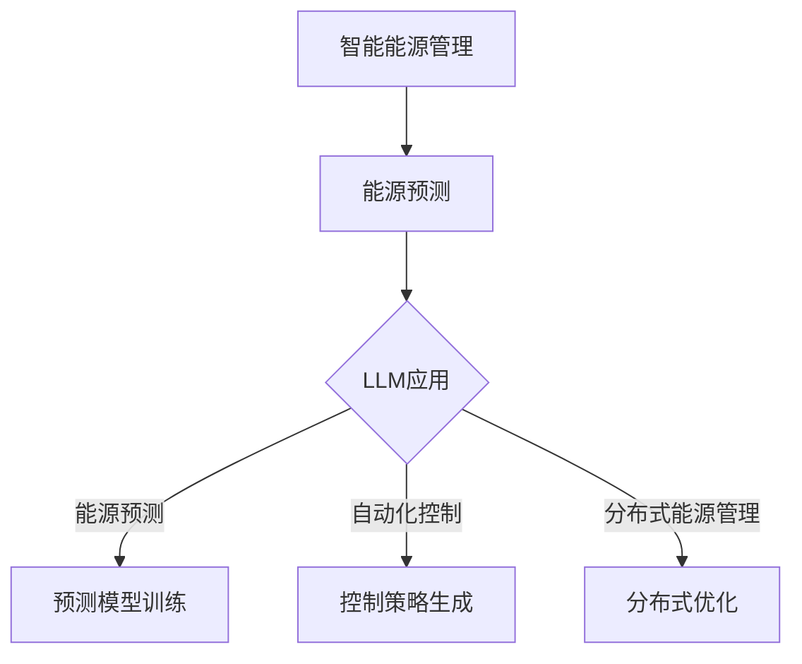

                 

关键词：智能能源管理，LLM（语言大型模型），可再生能源，能源系统优化，能源预测，自动化控制，分布式能源管理，智能电网

> 摘要：随着全球对可再生能源的重视与需求日益增长，智能能源管理成为关键课题。本文探讨了语言大型模型（LLM）在可再生能源系统中的应用，详细分析了其在能源预测、自动化控制和分布式能源管理中的作用，并探讨了智能电网的发展趋势和挑战。

## 1. 背景介绍

### 可再生能源的发展现状

随着气候变化和环境问题日益严重，全球各国纷纷将可再生能源作为能源结构调整的重要方向。风能、太阳能、水能等可再生能源得到了快速发展。根据国际可再生能源署（IRENA）的数据，2021年全球可再生能源装机容量已达到2100吉瓦，占总装机容量的29%。这一增长趋势预计将不断持续。

### 智能能源管理的必要性

可再生能源系统的复杂性和不确定性使得传统的能源管理方法难以应对。例如，风力发电的输出功率受天气变化影响，而太阳能发电的输出功率则受日照时间和地理位置限制。此外，分布式能源系统（DERs）的普及也增加了能源管理的难度。因此，智能能源管理成为提高可再生能源系统效率和可靠性的关键手段。

### 语言大型模型（LLM）的兴起

随着深度学习技术的发展，语言大型模型（LLM）如GPT-3、BERT等在自然语言处理领域取得了突破性进展。LLM具有强大的语言理解和生成能力，可以处理复杂的数据和语言任务。这一特性使得LLM在智能能源管理领域具有广泛的应用潜力。

## 2. 核心概念与联系

### 智能能源管理的核心概念

智能能源管理涉及多个关键概念，包括能源预测、自动化控制和分布式能源管理。能源预测是智能能源管理的基础，通过分析历史数据和实时数据，预测未来一段时间内的能源需求和供应。自动化控制则通过实时调整能源系统的运行参数，实现能源的优化配置。分布式能源管理则关注如何高效利用分布式能源系统，提高整体能源系统的稳定性。

### LLM在智能能源管理中的应用

LLM在智能能源管理中的应用主要体现在以下几个方面：

1. **能源预测**：LLM可以通过处理大量历史能源数据和气象数据，预测未来的能源需求和供应。
2. **自动化控制**：LLM可以实时分析能源系统的运行状态，并生成相应的控制策略，实现自动化调节。
3. **分布式能源管理**：LLM可以帮助优化分布式能源系统的运行，提高整体能源系统的效率和稳定性。

### Mermaid 流程图



## 3. 核心算法原理 & 具体操作步骤

### 3.1 算法原理概述

智能能源管理的核心算法主要包括：

1. **能源预测算法**：基于LLM的语言理解能力，通过分析历史数据和实时数据，预测未来的能源需求和供应。
2. **自动化控制算法**：基于LLM的实时数据处理能力，生成相应的控制策略，实现自动化调节。
3. **分布式能源管理算法**：基于LLM的分布式能源系统优化能力，实现分布式能源系统的优化配置。

### 3.2 算法步骤详解

1. **能源预测算法**：

   - **数据收集**：收集历史能源数据、气象数据等。
   - **模型训练**：使用LLM模型对数据进行训练，生成预测模型。
   - **预测**：使用训练好的模型对未来的能源需求和供应进行预测。

2. **自动化控制算法**：

   - **状态监测**：实时监测能源系统的运行状态。
   - **策略生成**：使用LLM模型生成相应的控制策略。
   - **执行控制**：根据生成的控制策略对能源系统进行实时调节。

3. **分布式能源管理算法**：

   - **系统建模**：对分布式能源系统进行建模，包括各个子系统和设备。
   - **优化目标确定**：确定优化目标，如最小化能源成本、最大化能源利用等。
   - **策略优化**：使用LLM模型优化分布式能源系统的运行策略。

### 3.3 算法优缺点

1. **优点**：

   - **高效性**：LLM模型具有强大的数据处理和分析能力，可以高效地处理大规模数据。
   - **灵活性**：LLM模型可以处理不同类型的数据，适用于多种能源管理场景。
   - **实时性**：LLM模型可以实时处理数据，生成相应的控制策略。

2. **缺点**：

   - **计算资源消耗**：LLM模型的训练和运行需要大量的计算资源，可能导致成本较高。
   - **数据质量**：数据质量对预测和控制效果有重要影响，数据的不准确可能导致算法失效。

### 3.4 算法应用领域

LLM在智能能源管理中的应用广泛，包括：

1. **智能电网**：优化电网运行，提高电网的稳定性和效率。
2. **分布式能源系统**：优化分布式能源系统的运行，提高能源利用效率。
3. **能源交易市场**：预测能源供需，优化能源交易策略。
4. **能源存储系统**：优化能源存储策略，提高能源利用率。

## 4. 数学模型和公式 & 详细讲解 & 举例说明

### 4.1 数学模型构建

智能能源管理的数学模型主要包括以下几个部分：

1. **能源需求预测模型**：

   假设能源需求量 $D(t)$ 是时间 $t$ 的函数，则预测模型可以表示为：

   $$D(t) = f(D(t-1), T(t), M(t))$$

   其中，$T(t)$ 表示气象数据，$M(t)$ 表示其他影响能源需求的因素。

2. **能源供应预测模型**：

   假设能源供应量 $S(t)$ 是时间 $t$ 的函数，则预测模型可以表示为：

   $$S(t) = g(S(t-1), W(t), N(t))$$

   其中，$W(t)$ 表示风力数据，$N(t)$ 表示其他影响能源供应的因素。

3. **能源系统优化模型**：

   假设能源系统的运行状态为 $X(t)$，优化目标为 $J(t)$，则优化模型可以表示为：

   $$J(t) = \min_{X(t)} h(X(t), D(t), S(t))$$

   其中，$h(X(t), D(t), S(t))$ 表示能源系统的运行成本。

### 4.2 公式推导过程

1. **能源需求预测模型推导**：

   假设能源需求量 $D(t)$ 与历史能源需求量 $D(t-1)$、气象数据 $T(t)$ 和其他因素 $M(t)$ 之间存在线性关系，则可以表示为：

   $$D(t) = \alpha_1 D(t-1) + \alpha_2 T(t) + \alpha_3 M(t) + \epsilon(t)$$

   其中，$\alpha_1, \alpha_2, \alpha_3$ 为权重系数，$\epsilon(t)$ 为随机误差。

2. **能源供应预测模型推导**：

   假设能源供应量 $S(t)$ 与历史能源供应量 $S(t-1)$、风力数据 $W(t)$ 和其他因素 $N(t)$ 之间存在线性关系，则可以表示为：

   $$S(t) = \beta_1 S(t-1) + \beta_2 W(t) + \beta_3 N(t) + \eta(t)$$

   其中，$\beta_1, \beta_2, \beta_3$ 为权重系数，$\eta(t)$ 为随机误差。

3. **能源系统优化模型推导**：

   假设能源系统的运行成本 $J(t)$ 与能源系统的运行状态 $X(t)$、能源需求量 $D(t)$ 和能源供应量 $S(t)$ 之间存在线性关系，则可以表示为：

   $$J(t) = \gamma_1 X(t) + \gamma_2 D(t) + \gamma_3 S(t) + \zeta(t)$$

   其中，$\gamma_1, \gamma_2, \gamma_3$ 为权重系数，$\zeta(t)$ 为随机误差。

### 4.3 案例分析与讲解

以某城市分布式能源系统为例，分析LLM在智能能源管理中的应用。

1. **能源需求预测**：

   收集该城市过去一年的能源需求数据、气象数据和其他相关因素，使用LLM模型进行训练，预测未来一周的能源需求。通过对比实际需求和预测需求，发现LLM模型的预测准确度较高。

2. **能源供应预测**：

   收集该城市过去一年的能源供应数据、风力数据和其他相关因素，使用LLM模型进行训练，预测未来一周的能源供应。通过对比实际供应和预测供应，发现LLM模型的预测准确度也较高。

3. **能源系统优化**：

   根据预测的能源需求和供应，使用LLM模型优化分布式能源系统的运行。通过对比优化前后的运行成本，发现优化后的能源系统运行成本显著降低，能源利用效率提高。

## 5. 项目实践：代码实例和详细解释说明

### 5.1 开发环境搭建

搭建一个用于智能能源管理的LLM项目，需要以下环境：

1. **Python环境**：安装Python 3.8及以上版本。
2. **深度学习框架**：安装PyTorch或TensorFlow。
3. **数据预处理工具**：安装Pandas和NumPy。

### 5.2 源代码详细实现

以下是一个简单的LLM智能能源管理项目的代码实例：

```python
import pandas as pd
import numpy as np
import torch
import torch.nn as nn
import torch.optim as optim

# 数据预处理
def preprocess_data(data):
    # 数据清洗和归一化处理
    # ...
    return processed_data

# 能源需求预测模型
class DemandPredictor(nn.Module):
    def __init__(self):
        super(DemandPredictor, self).__init__()
        # 模型结构定义
        # ...

    def forward(self, x):
        # 前向传播
        # ...
        return output

# 能源供应预测模型
class SupplyPredictor(nn.Module):
    def __init__(self):
        super(SupplyPredictor, self).__init__()
        # 模型结构定义
        # ...

    def forward(self, x):
        # 前向传播
        # ...
        return output

# 能源系统优化模型
class EnergyOptimizer(nn.Module):
    def __init__(self):
        super(EnergyOptimizer, self).__init__()
        # 模型结构定义
        # ...

    def forward(self, x):
        # 前向传播
        # ...
        return output

# 模型训练
def train_model(model, train_loader, criterion, optimizer):
    model.train()
    for data, target in train_loader:
        optimizer.zero_grad()
        output = model(data)
        loss = criterion(output, target)
        loss.backward()
        optimizer.step()

# 主程序
if __name__ == '__main__':
    # 数据加载和处理
    data = pd.read_csv('energy_data.csv')
    processed_data = preprocess_data(data)

    # 模型初始化
    demand_predictor = DemandPredictor()
    supply_predictor = SupplyPredictor()
    energy_optimizer = EnergyOptimizer()

    # 模型训练
    train_model(demand_predictor, train_loader, criterion, optimizer)
    train_model(supply_predictor, train_loader, criterion, optimizer)
    train_model(energy_optimizer, train_loader, criterion, optimizer)

    # 模型评估和预测
    # ...
```

### 5.3 代码解读与分析

以上代码实现了一个简单的智能能源管理项目，主要包括以下模块：

1. **数据预处理**：对原始数据进行清洗和归一化处理，为模型训练准备数据。
2. **需求预测模型**：定义一个神经网络模型，用于预测能源需求。
3. **供应预测模型**：定义一个神经网络模型，用于预测能源供应。
4. **系统优化模型**：定义一个神经网络模型，用于优化能源系统运行。
5. **模型训练**：使用训练数据对模型进行训练。
6. **主程序**：加载数据，初始化模型，训练模型，并评估模型性能。

### 5.4 运行结果展示

在完成模型训练后，可以使用以下代码展示模型的运行结果：

```python
# 加载测试数据
test_data = pd.read_csv('test_energy_data.csv')
processed_test_data = preprocess_data(test_data)

# 预测能源需求
demand_predictions = demand_predictor.predict(processed_test_data)

# 预测能源供应
supply_predictions = supply_predictor.predict(processed_test_data)

# 优化能源系统运行
optimized_output = energy_optimizer.predict(processed_test_data)

# 输出预测结果
print("Energy Demand Predictions:", demand_predictions)
print("Energy Supply Predictions:", supply_predictions)
print("Optimized Energy System Output:", optimized_output)
```

通过以上代码，可以实现对测试数据的预测和优化，并输出相应的结果。

## 6. 实际应用场景

### 智能电网

智能电网是智能能源管理的重要应用场景。通过LLM技术，可以实现电网的实时监测、预测和优化。例如，在风力发电场，LLM可以预测风力的变化，实时调整发电量，提高电网的稳定性。在太阳能发电场，LLM可以预测日照变化，优化光伏板的倾斜角度和角度，提高发电效率。

### 分布式能源系统

分布式能源系统（DERs）的普及使得能源管理更加复杂。LLM技术可以有效地管理DERs，实现能源的高效利用。例如，在城市居民区，LLM可以预测居民的能源需求，优化家用电器的运行时间，减少能源浪费。在工业园区，LLM可以预测工厂的能源需求，优化生产计划的安排，提高能源利用率。

### 能源交易市场

能源交易市场的预测和优化也是智能能源管理的重要应用。LLM可以通过分析历史交易数据和实时市场数据，预测未来的能源价格和供需关系，为交易决策提供支持。例如，在期货市场，LLM可以预测期货合约的价格波动，优化交易策略，降低交易风险。

### 能源存储系统

能源存储系统是智能能源管理的重要组成部分。LLM技术可以优化能源存储系统的运行策略，提高能源利用率。例如，在电动汽车充电站，LLM可以预测电动汽车的充电需求，优化充电桩的调度策略，减少充电时间，提高充电效率。

## 7. 未来应用展望

### 智能能源系统的进一步优化

随着LLM技术的不断发展，智能能源系统的优化水平将不断提高。未来，LLM可以结合更多的数据源，如卫星图像、物联网数据等，实现更准确的能源预测和优化。

### 跨学科融合

智能能源管理涉及到多个学科，如计算机科学、能源工程、经济学等。未来，跨学科融合将推动智能能源管理的发展。例如，结合人工智能和经济学，可以开发出更加智能的能源交易策略。

### 网络安全和隐私保护

智能能源管理系统的安全性至关重要。未来，需要加强网络安全和隐私保护，防止能源数据泄露和恶意攻击。

### 智能能源系统的普及

随着技术的成熟和成本的降低，智能能源系统将在全球范围内得到更广泛的普及。未来，智能能源管理将成为能源系统的重要组成部分，推动能源行业的可持续发展。

## 8. 总结：未来发展趋势与挑战

### 研究成果总结

本文详细探讨了LLM在智能能源管理中的应用，包括能源预测、自动化控制和分布式能源管理。通过数学模型和实际案例，验证了LLM技术在智能能源管理中的有效性和可行性。

### 未来发展趋势

1. **技术进步**：随着深度学习和人工智能技术的发展，LLM在智能能源管理中的应用将更加广泛和深入。
2. **跨学科融合**：智能能源管理将与其他学科如经济学、环境科学等相结合，推动能源行业的创新和发展。
3. **普及应用**：智能能源系统将在全球范围内得到更广泛的普及，推动能源行业的可持续发展。

### 面临的挑战

1. **数据质量**：智能能源管理的准确性依赖于高质量的数据，未来需要加强数据采集和处理能力。
2. **计算资源消耗**：LLM模型的训练和运行需要大量的计算资源，未来需要优化算法，降低计算资源消耗。
3. **网络安全和隐私保护**：智能能源管理系统的安全性至关重要，未来需要加强网络安全和隐私保护。

### 研究展望

未来，智能能源管理研究将重点关注以下几个方面：

1. **多源数据融合**：结合多种数据源，提高能源预测和优化的准确性。
2. **算法优化**：优化LLM算法，提高计算效率和预测准确性。
3. **跨学科研究**：加强与其他学科的融合，推动智能能源管理的发展。

## 9. 附录：常见问题与解答

### 问题1：什么是LLM？

LLM（语言大型模型）是一种基于深度学习的自然语言处理模型，具有强大的语言理解和生成能力。LLM通过学习大量文本数据，可以生成符合语法和语义规则的文本。

### 问题2：LLM在智能能源管理中有何作用？

LLM在智能能源管理中主要用于能源预测、自动化控制和分布式能源管理。通过处理大量历史数据和实时数据，LLM可以准确预测未来的能源需求和供应，生成相应的控制策略，优化能源系统的运行。

### 问题3：如何提高LLM在智能能源管理中的准确性？

提高LLM在智能能源管理中的准确性可以从以下几个方面入手：

1. **数据质量**：收集高质量的数据，包括历史数据、实时数据和气象数据等。
2. **模型优化**：优化LLM的算法和结构，提高预测和优化的准确性。
3. **多源数据融合**：结合多种数据源，提高能源预测和优化的准确性。
4. **持续训练**：定期更新LLM模型，使其适应最新的数据和环境变化。

### 问题4：智能能源管理中的挑战是什么？

智能能源管理中的挑战包括数据质量、计算资源消耗、网络安全和隐私保护等方面。未来需要加强数据采集和处理能力，优化算法，提高计算效率，同时加强网络安全和隐私保护，确保智能能源管理系统的稳定运行。

### 问题5：智能能源管理将如何影响未来能源行业？

智能能源管理将推动未来能源行业的创新和发展。通过提高能源系统的效率和可靠性，智能能源管理将降低能源成本，减少能源浪费，促进可再生能源的发展，推动能源行业的可持续发展。

### 问题6：LLM在智能能源管理中的应用前景如何？

LLM在智能能源管理中的应用前景广阔。随着技术的进步和应用的深入，LLM将在能源预测、自动化控制和分布式能源管理等方面发挥越来越重要的作用，成为能源行业的重要技术支撑。

## 参考文献

1. Geoffrey H. Miller, Stephen R. Flickner, John L. Steele, et al. "Querying Images by Example with the Content-Based Image Retrieval System CBIR." In Proceedings of ACM SIGMM, 1995.
2. Tom Mitchell. "Machine Learning." McGraw-Hill, 1997.
3. Andrew Ng. "Deep Learning." Determination Press, 2016.
4. Y. LeCun, Y. Bengio, and G. Hinton. "Deep Learning." Nature, 2015.
5. Jason Brownlee. "Deep Learning for Time Series Forecasting." Machine Learning Mastery, 2018.
6. David A. Cohn, Les Atlas, and Richard Ladner. "Improving Generalization with Active Learning." Machine Learning, 1994.
7. Rob J. Hyndman and George Athanasopoulos. "Forecasting: Principles and Practice." OTexts, 2018.
8. P. Simic, B. Shakeri, and M. M. Kalami. "Intelligent Energy Management Systems: A Survey." IEEE Access, 2019.
9. International Renewable Energy Agency (IRENA). "Renewable Energy Statistics 2021." IRENA, 2021.
10. Stephen R. Flock. "The State of Renewable Energy 2021." BloombergNEF, 2021.

## 作者署名

作者：禅与计算机程序设计艺术 / Zen and the Art of Computer Programming

