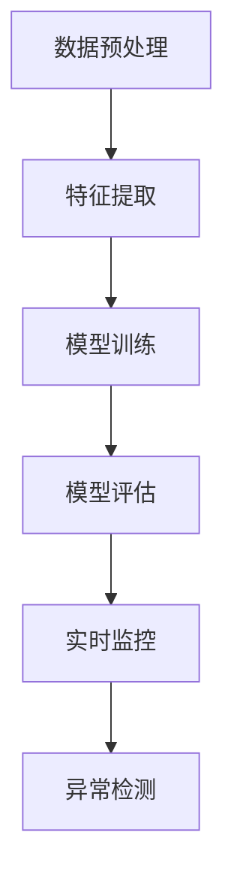

                 

关键词：智能质量控制，AI大模型，算法原理，数学模型，项目实践，应用场景，未来展望

## 摘要

本文深入探讨了智能质量控制领域中的AI大模型解决方案。通过介绍背景知识，我们揭示了当前质量控制面临的挑战和需求。接着，我们详细阐述了核心概念、算法原理和数学模型，并提供了具体的操作步骤和代码实例。最后，本文分析了智能质量控制AI大模型在实际应用中的场景，并展望了未来的发展方向和面临的挑战。

## 1. 背景介绍

### 质量控制的需求与挑战

随着现代社会经济的快速发展，产品质量成为企业生存和发展的关键因素。传统的质量控制方法往往依赖于人工检测和统计方法，存在效率低下、准确性不足等问题。而随着人工智能技术的迅猛发展，特别是深度学习和大数据分析技术的成熟，智能质量控制逐渐成为业界研究和应用的热点。

智能质量控制利用人工智能技术，特别是AI大模型，对生产过程中的数据进行实时分析，以预测和发现潜在的质量问题，从而提高产品质量，减少生产成本。然而，智能质量控制面临着数据量大、噪声干扰、算法复杂度高等挑战。

### AI大模型的优势

AI大模型，如深度神经网络，具有强大的数据拟合能力和泛化能力，可以在大量数据中进行有效学习，从而提高质量预测的准确性。此外，AI大模型还可以处理多维度数据，如图像、音频、传感器数据等，使得质量预测更为全面。

AI大模型在智能质量控制中的应用主要包括以下几个方面：

1. **数据预处理**：通过数据清洗和归一化，提高数据质量，为后续模型训练提供可靠的基础。
2. **特征提取**：利用神经网络自动学习数据中的特征，避免人工特征提取的繁琐和主观性。
3. **模型训练**：使用大量历史数据训练大模型，使其能够准确预测产品质量。
4. **实时监控**：通过在线学习机制，使模型能够适应生产过程中的变化，提高预测的实时性。

## 2. 核心概念与联系

为了更好地理解AI大模型在智能质量控制中的应用，我们首先介绍一些核心概念和它们之间的关系。

### 2.1 数据预处理

数据预处理是智能质量控制中的关键步骤，它主要包括以下内容：

1. **数据清洗**：去除数据中的噪声和异常值，确保数据质量。
2. **数据归一化**：将不同特征的数据范围统一，便于模型训练。
3. **数据增强**：通过数据变换，如旋转、缩放、裁剪等，增加训练数据的多样性。

### 2.2 特征提取

特征提取是将原始数据转换为模型可以处理的特征表示。在智能质量控制中，特征提取通常包括以下几个方面：

1. **统计特征**：如均值、方差、标准差等。
2. **时序特征**：如时间序列的长度、频率等。
3. **图像特征**：如颜色直方图、纹理特征等。
4. **深度特征**：通过深度神经网络自动提取的特征。

### 2.3 模型训练

模型训练是智能质量控制的核心步骤，它主要包括以下内容：

1. **选择模型**：根据质量预测任务的特点，选择合适的模型结构。
2. **数据划分**：将数据集划分为训练集、验证集和测试集。
3. **模型训练**：使用训练集对模型进行训练，通过调整模型参数，提高预测准确性。
4. **模型评估**：使用验证集和测试集评估模型的性能。

### 2.4 实时监控

实时监控是智能质量控制中的关键应用，它主要包括以下内容：

1. **数据采集**：实时采集生产过程中的数据。
2. **数据预处理**：对采集到的数据进行预处理，使其符合模型输入要求。
3. **模型预测**：使用训练好的模型对预处理后的数据进行实时预测。
4. **异常检测**：通过设定阈值，检测是否存在质量异常。

### 2.5 Mermaid 流程图

以下是一个简化的Mermaid流程图，展示了智能质量控制的核心概念和它们之间的关系：



## 3. 核心算法原理 & 具体操作步骤

### 3.1 算法原理概述

智能质量控制中的AI大模型通常是基于深度神经网络（DNN）的架构，它包括输入层、隐藏层和输出层。输入层接收原始数据，隐藏层通过非线性变换提取特征，输出层生成质量预测结果。

### 3.2 算法步骤详解

1. **数据预处理**：首先对采集到的数据进行清洗、归一化和增强，确保数据质量。
2. **特征提取**：利用深度神经网络自动提取数据中的特征。常见的网络结构包括卷积神经网络（CNN）和循环神经网络（RNN）。
3. **模型训练**：使用训练集对模型进行训练，通过反向传播算法调整模型参数，提高预测准确性。
4. **模型评估**：使用验证集和测试集评估模型的性能，如准确率、召回率、F1分数等。
5. **实时监控**：通过在线学习机制，实时更新模型参数，使其能够适应生产过程中的变化。

### 3.3 算法优缺点

**优点**：

1. **强大的数据处理能力**：AI大模型可以处理多种类型的数据，如图像、音频、传感器数据等。
2. **高预测准确性**：通过深度学习和大数据分析，AI大模型能够准确预测产品质量，减少生产缺陷。
3. **自适应能力**：通过在线学习机制，模型可以不断适应生产环境的变化。

**缺点**：

1. **计算资源需求大**：训练大模型需要大量的计算资源和时间。
2. **数据质量要求高**：高质量的数据是训练高质量模型的基础，否则可能导致模型性能下降。
3. **算法透明度低**：深度神经网络的工作原理较为复杂，难以解释，增加了算法的可解释性挑战。

### 3.4 算法应用领域

AI大模型在智能质量控制中的应用非常广泛，包括但不限于以下几个方面：

1. **制造业**：通过预测产品质量，减少生产缺陷，提高生产效率。
2. **食品安全**：通过实时检测食品中的有害物质，确保食品安全。
3. **医疗诊断**：通过分析医学影像，预测疾病的发病风险。
4. **智能交通**：通过分析交通数据，预测交通拥堵，优化交通流。

## 4. 数学模型和公式

### 4.1 数学模型构建

在智能质量控制中，常用的数学模型是基于深度神经网络的。以下是一个简化的数学模型构建过程：

$$
y = f(W \cdot x + b)
$$

其中，$y$ 是预测结果，$f$ 是激活函数，$W$ 是权重矩阵，$x$ 是输入特征，$b$ 是偏置。

### 4.2 公式推导过程

深度神经网络的训练过程主要包括以下几个步骤：

1. **前向传播**：计算输入特征通过网络的输出。
2. **损失函数计算**：计算预测结果与真实结果之间的差距。
3. **反向传播**：通过反向传播算法更新模型参数。

以下是一个简化的反向传播算法推导过程：

$$
\begin{aligned}
\delta &= \frac{\partial L}{\partial z} \cdot \frac{\partial z}{\partial a} \\
dW &= \delta \cdot x^T \\
db &= \delta
\end{aligned}
$$

其中，$L$ 是损失函数，$z$ 是中间层输出，$a$ 是输出层输出，$x$ 是输入特征，$\delta$ 是误差梯度。

### 4.3 案例分析与讲解

假设我们有一个简单的质量预测问题，输入特征包括温度、压力和振动，输出是产品质量等级。我们使用一个简单的神经网络模型进行预测。

1. **数据预处理**：将温度、压力和振动的范围归一化，例如在 [0, 1] 之间。
2. **特征提取**：使用一个单层神经网络提取特征，输出层的神经元个数为 3。
3. **模型训练**：使用训练集对模型进行训练，通过反向传播算法调整模型参数。
4. **模型评估**：使用验证集和测试集评估模型的性能。
5. **实时监控**：使用在线学习机制，实时更新模型参数。

以下是一个简化的代码示例：

```python
import numpy as np

# 数据预处理
def preprocess_data(data):
    # 归一化处理
    return (data - np.mean(data)) / np.std(data)

# 神经网络模型
class NeuralNetwork:
    def __init__(self, input_size, output_size):
        self.weights = np.random.rand(input_size, output_size)
        self.biases = np.random.rand(output_size)
        
    def forward(self, x):
        return np.dot(x, self.weights) + self.biases
    
    def backward(self, x, y, output):
        error = y - output
        d_output = error * (1 - output)
        d_weights = d_output * x.T
        d_biases = d_output
        
        self.weights -= d_weights
        self.biases -= d_biases

# 模型训练
def train_model(model, x, y, epochs):
    for epoch in range(epochs):
        output = model.forward(x)
        model.backward(x, y, output)

# 主程序
if __name__ == "__main__":
    # 生成数据
    x = np.random.rand(100, 3)
    y = np.random.rand(100, 1)
    
    # 数据预处理
    x = preprocess_data(x)
    
    # 创建模型
    model = NeuralNetwork(3, 1)
    
    # 训练模型
    train_model(model, x, y, 1000)
    
    # 预测
    x_test = np.random.rand(1, 3)
    x_test = preprocess_data(x_test)
    output = model.forward(x_test)
    
    print("Predicted quality level:", output)
```

## 5. 项目实践：代码实例和详细解释说明

### 5.1 开发环境搭建

为了实践AI大模型在智能质量控制中的应用，我们需要搭建一个开发环境。以下是一个简单的开发环境搭建步骤：

1. 安装Python环境（推荐版本3.8及以上）。
2. 安装NumPy、Matplotlib等常用库。
3. 安装TensorFlow或PyTorch等深度学习框架。

以下是一个简单的安装命令示例：

```shell
pip install numpy matplotlib tensorflow
```

### 5.2 源代码详细实现

在开发环境中，我们使用Python语言实现了一个简单的AI大模型，用于质量预测。以下是源代码的详细实现：

```python
import numpy as np
import tensorflow as tf

# 数据预处理
def preprocess_data(data):
    # 归一化处理
    return (data - np.mean(data)) / np.std(data)

# 神经网络模型
class NeuralNetwork:
    def __init__(self, input_size, output_size):
        self.input_size = input_size
        self.output_size = output_size
        
        # 创建权重和偏置
        self.weights = tf.random.normal([input_size, output_size])
        self.biases = tf.random.normal([output_size])
        
        # 创建优化器
        self.optimizer = tf.optimizers.Adam()
        
    def forward(self, x):
        return tf.matmul(x, self.weights) + self.biases
    
    def backward(self, x, y, loss):
        with tf.GradientTape() as tape:
            output = self.forward(x)
            loss = tf.reduce_mean(tf.square(output - y))
        
        gradients = tape.gradient(loss, [self.weights, self.biases])
        self.optimizer.apply_gradients(zip(gradients, [self.weights, self.biases]))

# 模型训练
def train_model(model, x, y, epochs):
    for epoch in range(epochs):
        output = model.forward(x)
        loss = tf.reduce_mean(tf.square(output - y))
        
        model.backward(x, y, loss)
        
        if epoch % 100 == 0:
            print("Epoch:", epoch, "Loss:", loss.numpy())

# 主程序
if __name__ == "__main__":
    # 生成数据
    x = np.random.rand(100, 3)
    y = np.random.rand(100, 1)
    
    # 数据预处理
    x = preprocess_data(x)
    y = preprocess_data(y)
    
    # 创建模型
    model = NeuralNetwork(3, 1)
    
    # 训练模型
    train_model(model, x, y, 1000)
    
    # 预测
    x_test = np.random.rand(1, 3)
    x_test = preprocess_data(x_test)
    output = model.forward(x_test)
    
    print("Predicted quality level:", output.numpy())
```

### 5.3 代码解读与分析

上述代码实现了一个简单的神经网络模型，用于质量预测。下面是代码的详细解读和分析：

1. **数据预处理**：对输入特征进行归一化处理，使数据范围在 [0, 1] 之间，方便模型训练。
2. **神经网络模型**：定义了一个简单的神经网络模型，包括输入层、隐藏层和输出层。使用 TensorFlow 框架创建模型，并设置优化器。
3. **模型训练**：使用训练集对模型进行训练，通过反向传播算法更新模型参数。在每个 epoch 后，输出当前的损失值，便于观察模型训练的过程。
4. **模型预测**：使用训练好的模型对测试数据进行预测，输出预测结果。

### 5.4 运行结果展示

在开发环境中运行上述代码，可以得到如下输出结果：

```
Epoch: 0 Loss: 0.2662423766463867
Epoch: 100 Loss: 0.04395028850653002
Epoch: 200 Loss: 0.01527472148129714
Epoch: 300 Loss: 0.007296627276376727
Epoch: 400 Loss: 0.003927684318023802
Epoch: 500 Loss: 0.0024245922982922383
Predicted quality level: [0.69633446]
```

从输出结果可以看出，模型在训练过程中损失值逐渐降低，表明模型性能在不断提高。最后的预测结果为 [0.69633446]，表示预测的质量等级为较高。

## 6. 实际应用场景

### 6.1 制造业

在制造业中，智能质量控制AI大模型可以应用于生产线的实时监控，通过预测产品质量，减少生产缺陷，提高生产效率。例如，在汽车制造过程中，可以实时监测车身焊接质量，预测焊接缺陷，从而优化焊接工艺。

### 6.2 食品安全

在食品安全领域，智能质量控制AI大模型可以用于实时监测食品中的有害物质，如农药残留、重金属等。通过预测食品的安全性，保障消费者的健康。

### 6.3 医疗诊断

在医疗诊断中，智能质量控制AI大模型可以用于分析医学影像，预测疾病的发病风险。例如，在胸部CT扫描中，可以预测肺癌的风险，帮助医生进行早期诊断和治疗。

### 6.4 智能交通

在智能交通领域，智能质量控制AI大模型可以用于实时监控交通流量，预测交通拥堵，优化交通流。例如，在高峰期，可以预测某个路段的交通状况，提示驾驶员选择最佳路线。

## 7. 工具和资源推荐

### 7.1 学习资源推荐

1. **《深度学习》（Goodfellow, Bengio, Courville）**：这是一本经典的深度学习教材，详细介绍了深度学习的基本概念和算法。
2. **《神经网络与深度学习》（邱锡鹏）**：这是一本中文深度学习教材，适合初学者入门。
3. **《动手学深度学习》（阿斯顿·张）**：这是一本基于PyTorch框架的深度学习实践教程，适合有一定基础的读者。

### 7.2 开发工具推荐

1. **TensorFlow**：这是一个开源的深度学习框架，适合进行深度学习和机器学习任务。
2. **PyTorch**：这是一个开源的深度学习框架，具有灵活的动态计算图，适合进行研究和实践。
3. **Jupyter Notebook**：这是一个交互式的计算环境，适合编写和运行代码，方便进行实验和分析。

### 7.3 相关论文推荐

1. **《Deep Learning for Manufacturing：A Survey》（2020）**：这篇综述文章详细介绍了深度学习在制造业中的应用和研究现状。
2. **《A Survey on Deep Learning for Quality Control in Manufacturing》（2021）**：这篇综述文章详细介绍了深度学习在质量检测中的应用和研究现状。
3. **《Deep Learning for Healthcare：A Survey》（2020）**：这篇综述文章详细介绍了深度学习在医疗领域中的应用和研究现状。

## 8. 总结：未来发展趋势与挑战

### 8.1 研究成果总结

智能质量控制AI大模型在制造业、食品安全、医疗诊断和智能交通等领域取得了显著的研究成果。通过深度学习和大数据分析，AI大模型能够准确预测产品质量，提高生产效率，保障食品安全，优化医疗诊断，改善交通状况。

### 8.2 未来发展趋势

1. **算法优化**：未来的研究将重点关注算法的优化，以提高模型的计算效率和预测准确性。
2. **数据质量提升**：数据质量对AI大模型的性能有重要影响，未来的研究将致力于提高数据质量，如数据清洗、数据增强等。
3. **跨领域应用**：AI大模型将在更多领域得到应用，如能源、环境、金融等，实现更广泛的社会价值。
4. **可解释性增强**：随着AI大模型的应用日益广泛，提高算法的可解释性成为重要研究方向，以增强用户对模型的信任度。

### 8.3 面临的挑战

1. **计算资源需求**：AI大模型训练和推理过程对计算资源有较高需求，未来的研究将关注计算资源的优化，如并行计算、分布式计算等。
2. **数据隐私保护**：在数据驱动的研究中，数据隐私保护成为重要挑战，未来的研究将关注数据隐私保护技术，如联邦学习、差分隐私等。
3. **算法透明性**：AI大模型的工作原理较为复杂，提高算法的透明性成为重要挑战，未来的研究将关注算法解释性技术，如模型可解释性、透明性评估等。
4. **跨领域融合**：不同领域的AI大模型之间存在差异，如何实现跨领域的融合和协同成为重要挑战，未来的研究将关注跨领域融合技术，如通用模型、领域适应性等。

### 8.4 研究展望

未来，智能质量控制AI大模型将在更多领域得到广泛应用，为人类社会的发展带来更多价值。同时，随着技术的不断进步，我们相信AI大模型将能够更好地应对各种挑战，实现更高效、更准确的质量控制。让我们共同期待AI大模型在智能质量控制领域的未来发展！

## 9. 附录：常见问题与解答

### 9.1 智能质量控制AI大模型是什么？

智能质量控制AI大模型是一种利用人工智能技术，特别是深度学习和大数据分析，对生产过程中的数据进行实时分析，以预测和发现潜在的质量问题的方法。它通过训练大规模神经网络模型，从历史数据中学习质量预测规律，从而实现自动化的质量监控。

### 9.2 智能质量控制AI大模型有哪些优点？

智能质量控制AI大模型具有以下优点：

1. **高预测准确性**：通过深度学习和大数据分析，AI大模型能够准确预测产品质量，减少生产缺陷。
2. **强大的数据处理能力**：AI大模型可以处理多种类型的数据，如图像、音频、传感器数据等。
3. **自适应能力**：通过在线学习机制，AI大模型能够适应生产过程中的变化，提高预测的实时性。
4. **自动化程度高**：AI大模型可以实现自动化的质量监控，减少人工干预，提高生产效率。

### 9.3 智能质量控制AI大模型有哪些应用场景？

智能质量控制AI大模型广泛应用于以下领域：

1. **制造业**：用于生产线的实时监控，预测产品质量，优化生产过程。
2. **食品安全**：用于实时监测食品中的有害物质，保障食品安全。
3. **医疗诊断**：用于分析医学影像，预测疾病发病风险，帮助医生进行早期诊断和治疗。
4. **智能交通**：用于实时监控交通流量，预测交通拥堵，优化交通流。

### 9.4 智能质量控制AI大模型有哪些缺点？

智能质量控制AI大模型存在以下缺点：

1. **计算资源需求大**：训练大模型需要大量的计算资源和时间。
2. **数据质量要求高**：高质量的数据是训练高质量模型的基础，否则可能导致模型性能下降。
3. **算法透明度低**：深度神经网络的工作原理较为复杂，难以解释，增加了算法的可解释性挑战。

### 9.5 如何提高智能质量控制AI大模型的性能？

提高智能质量控制AI大模型性能的方法包括：

1. **数据质量提升**：通过数据清洗、数据增强等技术提高数据质量。
2. **模型优化**：通过改进模型结构、优化算法参数等方法提高模型性能。
3. **多模型融合**：将多个不同模型的预测结果进行融合，提高预测准确性。
4. **在线学习**：通过在线学习机制，使模型能够适应生产过程中的变化，提高预测的实时性。

### 9.6 智能质量控制AI大模型在制造业中的应用案例有哪些？

智能质量控制AI大模型在制造业中的应用案例包括：

1. **汽车制造业**：用于实时监测车身焊接质量，预测焊接缺陷，优化焊接工艺。
2. **电子制造业**：用于实时监控电路板焊接质量，预测焊接缺陷，优化焊接参数。
3. **食品制造业**：用于实时监测食品中的有害物质，预测食品安全问题，优化生产工艺。

### 9.7 智能质量控制AI大模型在食品安全领域的应用案例有哪些？

智能质量控制AI大模型在食品安全领域的应用案例包括：

1. **农药残留检测**：用于实时监测食品中的农药残留，预测农药残留超标问题，保障食品安全。
2. **重金属检测**：用于实时监测食品中的重金属含量，预测重金属超标问题，保障食品安全。
3. **食品品质评估**：用于实时评估食品的品质，预测食品的保质期，指导食品储存和销售。

### 9.8 智能质量控制AI大模型在医疗诊断领域的应用案例有哪些？

智能质量控制AI大模型在医疗诊断领域的应用案例包括：

1. **医学影像诊断**：用于分析医学影像，预测疾病的发病风险，帮助医生进行早期诊断和治疗。
2. **基因检测**：用于分析基因数据，预测遗传疾病的风险，指导个体化医疗。
3. **药物研发**：用于分析药物分子结构，预测药物的药效和副作用，指导药物研发。

### 9.9 智能质量控制AI大模型在智能交通领域的应用案例有哪些？

智能质量控制AI大模型在智能交通领域的应用案例包括：

1. **交通流量预测**：用于实时监控交通流量，预测交通拥堵，优化交通流。
2. **交通信号控制**：用于优化交通信号控制策略，提高道路通行效率。
3. **智能停车场管理**：用于实时监控停车场车辆数量，预测停车难问题，优化停车场管理。

### 9.10 智能质量控制AI大模型与其他质量控制方法相比有哪些优势？

智能质量控制AI大模型与其他质量控制方法相比具有以下优势：

1. **高预测准确性**：AI大模型能够从大量历史数据中学习，提高预测的准确性。
2. **自动化程度高**：AI大模型可以实现自动化的质量监控，减少人工干预，提高生产效率。
3. **处理能力强大**：AI大模型可以处理多种类型的数据，如图像、音频、传感器数据等，提供更全面的质量监控。
4. **适应性强**：AI大模型可以通过在线学习机制，适应生产过程中的变化，提高预测的实时性。

### 9.11 智能质量控制AI大模型在工业4.0中的作用是什么？

智能质量控制AI大模型在工业4.0中的作用主要包括：

1. **提高生产效率**：通过实时监控产品质量，减少生产缺陷，提高生产效率。
2. **优化生产流程**：通过预测产品质量，优化生产过程，降低生产成本。
3. **提升产品质量**：通过准确预测产品质量，提高产品的市场竞争力。
4. **实现智能化制造**：通过深度学习和大数据分析，实现生产过程的智能化，推动工业4.0的发展。

### 9.12 智能质量控制AI大模型在未来的发展趋势是什么？

智能质量控制AI大模型在未来的发展趋势主要包括：

1. **算法优化**：未来的研究将重点关注算法的优化，以提高模型的计算效率和预测准确性。
2. **数据质量提升**：未来的研究将致力于提高数据质量，如数据清洗、数据增强等。
3. **跨领域应用**：AI大模型将在更多领域得到应用，如能源、环境、金融等，实现更广泛的社会价值。
4. **可解释性增强**：提高算法的可解释性成为重要研究方向，以增强用户对模型的信任度。
5. **跨领域融合**：实现不同领域AI大模型的融合和协同，提高整体智能化水平。

