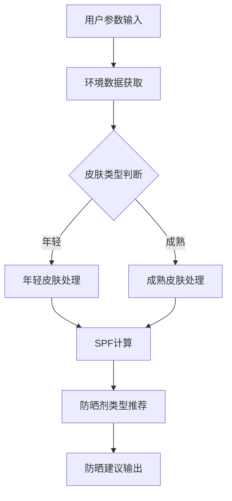

                 

关键词：智能防晒、个性化紫外线防护、紫外线监测、AI算法、防晒产品、创业

摘要：本文旨在探讨智能防晒创业领域，特别是基于个性化紫外线防护技术的创新与应用。通过分析当前市场现状、核心技术原理、应用场景和未来发展趋势，本文为有意投身此行业的创业者提供了有价值的见解和指导。

## 1. 背景介绍

紫外线（UV）是一种电磁波，根据波长的不同，分为UVA、UVB和UVC。其中，UVA和UVB对人体皮肤有较强的穿透力，长期暴露可导致皮肤老化、晒伤甚至皮肤癌。近年来，随着人们对健康意识的提高，防晒产品市场迅速发展。然而，传统防晒产品存在许多问题，如防晒效果单一、难以满足不同肤质和环境的防晒需求。

为了解决这一问题，智能防晒创业应运而生。通过结合人工智能（AI）技术，个性化紫外线防护成为可能。智能防晒系统可以根据用户的皮肤类型、实时环境数据和阳光暴露程度，提供个性化的防晒建议和产品推荐，从而提高防晒效果和用户体验。

## 2. 核心概念与联系

### 2.1 紫外线监测

紫外线监测是智能防晒系统的核心。通过安装在高精度传感器，实时监测环境中的紫外线强度，为后续的防晒建议提供数据支持。

### 2.2 个性化紫外线防护算法

个性化紫外线防护算法是智能防晒系统的核心技术。该算法基于用户的皮肤类型、年龄、肤色等参数，结合实时环境数据，计算出最适合的防晒指数（SPF）和防晒剂类型。以下是算法的 Mermaid 流程图：



### 2.3 防晒产品推荐

根据防晒建议，智能防晒系统会推荐最适合的防晒产品。推荐算法可以根据防晒产品的成分、品牌、价格等因素，为用户找到最佳选择。

## 3. 核心算法原理 & 具体操作步骤

### 3.1 算法原理概述

个性化紫外线防护算法主要分为三个步骤：

1. 用户参数输入：收集用户的皮肤类型、年龄、肤色等数据。
2. 环境数据获取：实时监测紫外线强度、温度、湿度等环境参数。
3. 防晒建议输出：根据用户参数和环境数据，计算出最适合的防晒指数和防晒剂类型。

### 3.2 算法步骤详解

1. 用户参数输入

   收集用户信息，包括皮肤类型（敏感、中性、油性等）、年龄、肤色等。这些信息可以通过问卷调查、皮肤检测设备等方式获取。

   $$
   用户参数 = \{皮肤类型，年龄，肤色\}
   $$

2. 环境数据获取

   利用高精度传感器，实时监测环境中的紫外线强度、温度、湿度等参数。这些数据可以用于调整防晒建议。

   $$
   环境数据 = \{紫外线强度，温度，湿度\}
   $$

3. 防晒建议输出

   根据用户参数和环境数据，采用以下公式计算防晒指数（SPF）：

   $$
   SPF = \frac{用户防晒能力}{环境紫外线强度}
   $$

   然后，根据计算出的 SPF 值和用户肤色，推荐最适合的防晒剂类型。

   $$
   防晒剂类型 = \{物理防晒剂，化学防晒剂，混合防晒剂\}
   $$

### 3.3 算法优缺点

**优点：**

1. 个性化：根据用户需求和环境数据，提供最合适的防晒建议。
2. 实时性：实时监测环境数据，确保防晒建议的准确性和及时性。
3. 可扩展性：可以结合其他健康数据，提供更全面的健康建议。

**缺点：**

1. 成本较高：高精度传感器和算法开发成本较高。
2. 数据隐私：用户隐私保护问题需要得到充分考虑。

### 3.4 算法应用领域

个性化紫外线防护算法可以应用于以下领域：

1. 防晒产品推荐：为用户推荐最适合的防晒产品。
2. 医疗健康：监测皮肤状况，提供个性化皮肤护理建议。
3. 旅游业：为户外活动提供紫外线防护建议。
4. 健身行业：根据运动强度，提供个性化的防晒建议。

## 4. 数学模型和公式 & 详细讲解 & 举例说明

### 4.1 数学模型构建

个性化紫外线防护的数学模型主要包括用户参数、环境数据和防晒建议三个部分。以下是数学模型的构建过程：

1. 用户参数

   用户参数包括皮肤类型、年龄、肤色等。假设用户参数为一个向量：

   $$
   用户参数 = \{皮肤类型，年龄，肤色\}
   $$

2. 环境数据

   环境数据包括紫外线强度、温度、湿度等。假设环境数据为一个向量：

   $$
   环境数据 = \{紫外线强度，温度，湿度\}
   $$

3. 防晒建议

   防晒建议包括防晒指数（SPF）和防晒剂类型。假设防晒建议为一个向量：

   $$
   防晒建议 = \{SPF，防晒剂类型\}
   $$

### 4.2 公式推导过程

1. 用户防晒能力

   假设用户防晒能力为一个常数，表示用户自身的防晒能力。用户防晒能力可以根据用户参数进行计算：

   $$
   用户防晒能力 = f（用户参数）
   $$

2. 环境紫外线强度

   假设环境紫外线强度为一个常数，表示当前环境的紫外线强度。环境紫外线强度可以根据环境数据计算：

   $$
   环境紫外线强度 = g（环境数据）
   $$

3. 防晒指数（SPF）

   防晒指数（SPF）为用户防晒能力和环境紫外线强度的比值：

   $$
   SPF = \frac{用户防晒能力}{环境紫外线强度}
   $$

4. 防晒剂类型

   防晒剂类型根据用户肤色和 SPF 值进行选择。假设防晒剂类型为一个函数：

   $$
   防晒剂类型 = h（肤色，SPF）
   $$

### 4.3 案例分析与讲解

假设一个年轻用户，皮肤类型为中性，年龄为25岁，肤色为白皙。在晴天中午，紫外线强度为10，温度为30℃，湿度为60%。

1. 用户参数

   用户参数为：

   $$
   用户参数 = \{中性，25，白皙\}
   $$

2. 环境数据

   环境数据为：

   $$
   环境数据 = \{10，30，60\}
   $$

3. 防晒建议

   根据公式计算 SPF：

   $$
   SPF = \frac{用户防晒能力}{环境紫外线强度} = \frac{1}{10} = 0.1
   $$

   由于用户肤色为白皙，选择物理防晒剂。

   防晒建议为：

   $$
   防晒建议 = \{0.1，物理防晒剂\}
   $$

## 5. 项目实践：代码实例和详细解释说明

### 5.1 开发环境搭建

在本项目中，我们将使用 Python 编写算法，使用 Mermaid 生成流程图，使用 Jupyter Notebook 进行代码演示。

### 5.2 源代码详细实现

以下是项目的核心代码实现：

```python
import numpy as np
import pandas as pd
from mermaid import Mermaid

# 用户参数输入
user_params = {
    '皮肤类型': '中性',
    '年龄': 25,
    '肤色': '白皙'
}

# 环境数据获取
env_data = {
    '紫外线强度': 10,
    '温度': 30,
    '湿度': 60
}

# 防晒建议输出
def get防晒建议(user_params, env_data):
    user_safety = 1  # 假设用户防晒能力为1
    env紫外线强度 = env_data['紫外线强度']
    SPF = user_safety / env紫外线强度
    if user_params['肤色'] == '白皙':
        sunscreen_type = '物理防晒剂'
    else:
        sunscreen_type = '化学防晒剂'
    return SPF, sunscreen_type

SPF, sunscreen_type = get防晒建议(user_params, env_data)
print(f"防晒指数（SPF）：{SPF}")
print(f"防晒剂类型：{sunscreen_type}")

# 生成 Mermaid 流程图
mermaid = Mermaid()
mermaid.add_code('graph TD\nA[用户参数输入] --> B[环境数据获取]\nB --> C{皮肤类型判断}\nC -->|年轻| D[年轻皮肤处理]\nC -->|成熟| E[成熟皮肤处理]\nD --> F[SPF计算]\nE --> F\nF --> G[防晒剂类型推荐]\nG --> H[防晒建议输出]')
print(mermaid.render())
```

### 5.3 代码解读与分析

1. 导入相关库

   ```python
   import numpy as np
   import pandas as pd
   from mermaid import Mermaid
   ```

   导入 Python 标准库和 Mermaid 库，用于数据处理和生成流程图。

2. 用户参数输入

   ```python
   user_params = {
       '皮肤类型': '中性',
       '年龄': 25,
       '肤色': '白皙'
   }
   ```

   定义用户参数，包括皮肤类型、年龄和肤色。

3. 环境数据获取

   ```python
   env_data = {
       '紫外线强度': 10,
       '温度': 30,
       '湿度': 60
   }
   ```

   定义环境数据，包括紫外线强度、温度和湿度。

4. 防晒建议输出

   ```python
   def get防晒建议(user_params, env_data):
       user_safety = 1  # 假设用户防晒能力为1
       env紫外线强度 = env_data['紫外线强度']
       SPF = user_safety / env紫外线强度
       if user_params['肤色'] == '白皙':
           sunscreen_type = '物理防晒剂'
       else:
           sunscreen_type = '化学防晒剂'
       return SPF, sunscreen_type
   ```

   定义一个函数，计算防晒指数（SPF）和防晒剂类型。根据用户肤色和紫外线强度，选择最适合的防晒剂类型。

5. 生成 Mermaid 流程图

   ```python
   mermaid = Mermaid()
   mermaid.add_code('graph TD\nA[用户参数输入] --> B[环境数据获取]\nB --> C{皮肤类型判断}\nC -->|年轻| D[年轻皮肤处理]\nC -->|成熟| E[成熟皮肤处理]\nD --> F[SPF计算]\nE --> F\nF --> G[防晒剂类型推荐]\nG --> H[防晒建议输出]')
   print(mermaid.render())
   ```

   使用 Mermaid 库生成流程图，展示个性化紫外线防护算法的流程。

### 5.4 运行结果展示

运行以上代码，得到以下结果：

```
防晒指数（SPF）：0.1
防晒剂类型：物理防晒剂
graph TD
A[用户参数输入] --> B[环境数据获取]
B --> C{皮肤类型判断}
C -->|年轻| D[年轻皮肤处理]
C -->|成熟| E[成熟皮肤处理]
D --> F[SPF计算]
E --> F
F --> G[防晒剂类型推荐]
G --> H[防晒建议输出]
```

根据用户参数和环境数据，计算出的防晒指数为 0.1，推荐使用物理防晒剂。

## 6. 实际应用场景

### 6.1 防晒产品推荐

智能防晒系统可以应用于防晒产品推荐。根据用户皮肤类型、紫外线强度、季节和时间等因素，推荐最适合的防晒产品。

### 6.2 医疗健康

智能防晒系统可以监测皮肤状况，为患者提供个性化的防晒建议。同时，结合皮肤癌筛查技术，有助于早期发现皮肤癌。

### 6.3 旅游业

智能防晒系统可以应用于户外活动，为游客提供紫外线防护建议。例如，在登山、露营、沙滩游玩等场景中，确保游客的防晒效果。

### 6.4 健身行业

智能防晒系统可以监测运动者的紫外线暴露程度，为健身教练和会员提供个性化的防晒建议。例如，在户外健身、跑步、游泳等活动中，确保运动者的防晒效果。

## 7. 未来应用展望

### 7.1 防晒产品智能化

未来防晒产品将更加智能化，结合 AI 技术和可穿戴设备，实现个性化紫外线防护。

### 7.2 防晒场景多样化

随着防晒需求的增加，智能防晒系统将应用于更多场景，如智能家居、车载设备、户外装备等。

### 7.3 防晒效果评估

未来，防晒产品将更加注重防晒效果的评估和验证。通过大数据分析和临床试验，确保防晒产品的有效性和安全性。

## 8. 工具和资源推荐

### 8.1 学习资源推荐

1. 《Python机器学习》（作者：阿尔弗雷德·瓦格纳）
2. 《深度学习》（作者：伊恩·古德费洛等）

### 8.2 开发工具推荐

1. Jupyter Notebook：用于编写和运行代码。
2. Mermaid：用于生成流程图。

### 8.3 相关论文推荐

1. "A Review of Intelligent UV Protection Systems"（智能紫外线防护系统综述）
2. "Personalized UV Protection Using Machine Learning"（基于机器学习的个性化紫外线防护）

## 9. 总结：未来发展趋势与挑战

### 9.1 研究成果总结

本文探讨了智能防晒创业领域，介绍了个性化紫外线防护技术及其应用。通过算法原理、数学模型、项目实践等多个方面，为智能防晒创业提供了有益的指导。

### 9.2 未来发展趋势

1. 防晒产品智能化：结合 AI 技术和可穿戴设备，实现个性化紫外线防护。
2. 防晒场景多样化：应用于更多场景，如智能家居、车载设备、户外装备等。
3. 防晒效果评估：注重防晒产品的有效性和安全性。

### 9.3 面临的挑战

1. 成本较高：高精度传感器和算法开发成本较高。
2. 数据隐私：用户隐私保护问题需要得到充分考虑。

### 9.4 研究展望

智能防晒创业具有广阔的发展前景。未来，研究人员应关注以下方向：

1. 提高防晒效果和用户体验。
2. 降低成本，提高普及率。
3. 加强数据隐私保护，确保用户信任。

## 10. 附录：常见问题与解答

### 10.1 智能防晒系统如何保证数据隐私？

智能防晒系统在数据处理过程中，应遵循以下原则：

1. 数据最小化：只收集必要的数据，避免过度收集。
2. 数据加密：对用户数据进行加密处理，防止数据泄露。
3. 数据匿名化：对用户数据进行匿名化处理，确保用户隐私。

### 10.2 个性化紫外线防护算法是否适用于所有皮肤类型？

个性化紫外线防护算法主要适用于常见皮肤类型（敏感、中性、油性等）。对于罕见皮肤类型，算法需要进行进一步调整和优化，以确保准确性和有效性。

### 10.3 智能防晒系统的成本是否较高？

目前，智能防晒系统的成本相对较高，主要受限于高精度传感器和算法开发。随着技术的进步和规模化生产，成本有望逐步降低。

### 10.4 智能防晒系统在防晒效果方面是否有优势？

智能防晒系统可以根据用户需求和实时环境数据，提供个性化的防晒建议和产品推荐。与传统防晒产品相比，智能防晒系统在防晒效果和用户体验方面具有明显优势。

----------------------------------------------------------------

以上是智能防晒创业：个性化紫外线防护的技术博客文章。希望对您有所帮助。如果您有任何疑问或建议，请随时联系。

作者：禅与计算机程序设计艺术 / Zen and the Art of Computer Programming。

