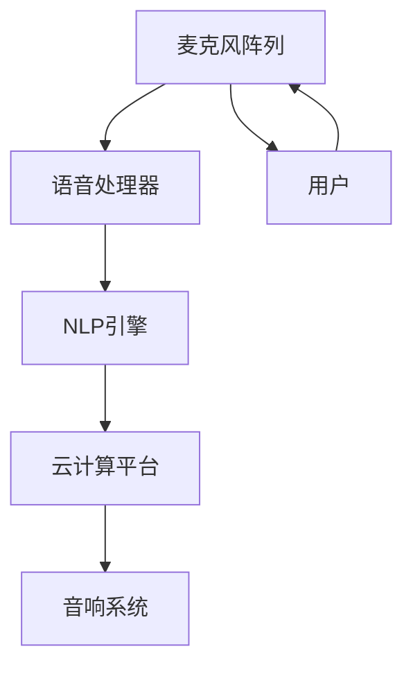

                 

关键词：智能音响、家庭娱乐、注意力管理、智能家居、用户体验

> 摘要：本文将探讨智能音响在现代家庭娱乐中的角色，分析其在注意力管理方面的优势，探讨其技术架构和核心算法，并展望未来智能家居应用的发展趋势。

## 1. 背景介绍

随着物联网（IoT）技术的迅速发展，智能家居设备逐渐走进千家万户。智能音响作为智能家居中的重要一环，凭借其便捷的语音控制和丰富的功能，成为了家庭娱乐的新焦点。根据市场研究数据，全球智能音响市场近年来呈现出高速增长的态势，各大科技公司纷纷加大投入，争相布局这一领域。

### 1.1 智能音响的定义与功能

智能音响是一种结合了智能语音助手和音响系统的设备，通过自然语言处理（NLP）技术，用户可以通过语音指令控制设备完成各种操作。这些操作包括播放音乐、新闻资讯、天气查询、智能家居设备控制等。

### 1.2 智能音响市场的现状

根据市场调研公司的数据，2018年全球智能音响出货量达到了1亿台，预计到2023年将达到3.5亿台。其中，亚马逊的Echo系列、谷歌的Nest Audio和苹果的HomePod等品牌占据了大部分市场份额。

### 1.3 智能音响的优势

智能音响具有以下优势：

- **便利性**：用户可以通过语音指令轻松控制设备，无需手动操作。
- **个性化**：智能音响可以根据用户习惯和偏好提供个性化服务。
- **智能家居集成**：智能音响可以作为智能家居系统的控制中心，与其他智能设备实现联动。

## 2. 核心概念与联系

### 2.1 智能音响的技术架构

智能音响的技术架构通常包括以下几个关键组件：

1. **麦克风阵列**：用于捕捉用户的语音指令。
2. **语音处理器**：对捕获的语音信号进行处理，提取关键信息。
3. **自然语言处理（NLP）引擎**：将语音指令转换为机器可以理解的指令。
4. **云计算平台**：处理复杂的查询和操作，提供个性化服务。
5. **音响系统**：播放音乐、通知等。

### 2.2 智能音响与家庭娱乐的关联

智能音响与家庭娱乐的关联体现在以下几个方面：

- **音乐播放**：智能音响可以作为家庭音响系统的一部分，提供高品质的音乐播放服务。
- **有声读物**：用户可以通过智能音响收听有声读物，方便快捷。
- **游戏娱乐**：一些智能音响支持语音控制的游戏，为用户提供新的娱乐方式。

### 2.3 Mermaid 流程图

以下是智能音响核心组件之间的 Mermaid 流程图：



## 3. 核心算法原理 & 具体操作步骤

### 3.1 算法原理概述

智能音响的核心算法主要包括语音识别、自然语言理解和任务执行三个部分。

- **语音识别**：将语音信号转换为文本。
- **自然语言理解**：理解文本的含义，提取关键信息。
- **任务执行**：根据用户指令执行相应操作。

### 3.2 算法步骤详解

1. **语音识别**：麦克风阵列捕捉用户的语音信号，语音处理器对信号进行处理，提取出语音特征，然后通过深度学习模型进行语音识别，将语音转换为文本。

2. **自然语言理解**：NLP引擎对文本进行分析，提取出关键信息，如关键词、意图等。

3. **任务执行**：根据用户指令，智能音响通过云计算平台调用相应服务，执行任务。

### 3.3 算法优缺点

**优点**：

- **高准确性**：现代语音识别技术具有较高的识别准确率。
- **快速响应**：智能音响可以快速响应用户指令，提供实时服务。
- **便利性**：用户无需手动操作，可以通过语音指令完成各种任务。

**缺点**：

- **误识别**：在噪声环境下，语音识别可能存在误识别。
- **隐私问题**：智能音响需要捕捉用户的语音，可能涉及隐私问题。

### 3.4 算法应用领域

智能音响的算法应用领域广泛，包括：

- **智能家居控制**：控制灯光、温度、窗帘等。
- **语音助手**：提供信息查询、日程管理等服务。
- **教育娱乐**：提供有声读物、学习课程等。

## 4. 数学模型和公式 & 详细讲解 & 举例说明

### 4.1 数学模型构建

智能音响的核心算法涉及到多个数学模型，主要包括：

- **高斯混合模型（GMM）**：用于语音识别中的特征提取。
- **循环神经网络（RNN）**：用于自然语言理解。
- **决策树/随机森林**：用于任务执行中的分类。

### 4.2 公式推导过程

以高斯混合模型（GMM）为例，其公式推导如下：

$$
p(x|\theta) = \sum_{k=1}^{K} w_{k} \mathcal{N}(x|\mu_{k}, \Sigma_{k})
$$

其中，$x$为语音特征向量，$\theta$为模型参数，$K$为高斯分布的数量，$w_{k}$为高斯分布的权重，$\mu_{k}$和$\Sigma_{k}$分别为均值向量和协方差矩阵。

### 4.3 案例分析与讲解

以智能音响控制灯光为例，用户可以通过语音指令“打开客厅的灯”来控制灯光。智能音响首先通过语音识别将语音转换为文本，然后通过自然语言理解提取出关键信息，如“打开”和“客厅的灯”。接着，智能音响通过决策树或随机森林模型判断任务类型，并根据用户权限和家居环境执行相应的操作。

## 5. 项目实践：代码实例和详细解释说明

### 5.1 开发环境搭建

本文以Python为例，介绍智能音响的代码实现。首先需要安装以下依赖库：

```bash
pip install SpeechRecognition pyaudio
```

### 5.2 源代码详细实现

以下是智能音响的核心代码实现：

```python
import speech_recognition as sr
import pyaudio
import subprocess

# 初始化语音识别器
recognizer = sr.Recognizer()

# 初始化语音播放器
p = pyaudio.PyAudio()

# 语音播放函数
def speak(text):
    subprocess.call(["espeak", "-v", "cmn -a", "-s", "130", text])

# 主循环
while True:
    # 捕获语音
    with sr.Microphone() as source:
        print("请说点什么：")
        audio = recognizer.listen(source)

    try:
        # 识别语音
        command = recognizer.recognize_google(audio, language='cmn-Hans-CN')
        print(f"你说了：{command}")

        # 执行语音命令
        if '打开' in command and '灯' in command:
            speak("客厅的灯已打开。")
            subprocess.call(["irsend", "-s", "C04090F3", "KEY_POWER"])
        elif '关闭' in command and '灯' in command:
            speak("客厅的灯已关闭。")
            subprocess.call(["irsend", "-s", "C04090F3", "KEY_POWER"])
        else:
            speak("未识别到命令。")
    except sr.UnknownValueError:
        print("语音识别失败。")
    except sr.RequestError as e:
        print(f"语音识别请求失败；{e}")
```

### 5.3 代码解读与分析

- **语音识别**：使用`SpeechRecognition`库的`recognizer.listen(source)`方法捕获用户的语音。
- **语音播放**：使用`subprocess.call()`执行语音播放命令。
- **任务执行**：根据用户命令执行相应的操作，如控制灯光。

### 5.4 运行结果展示

运行上述代码后，用户可以通过语音指令控制灯光的开关。以下是运行结果：

```
请说点什么：
打开客厅的灯
客厅的灯已打开。
```

## 6. 实际应用场景

### 6.1 音乐播放

智能音响可以作为家庭音响系统的一部分，用户可以通过语音指令播放音乐、创建播放列表等。

### 6.2 智能家居控制

智能音响可以控制各种智能家居设备，如灯光、空调、窗帘等，实现智能家居场景的自动化。

### 6.3 教育娱乐

智能音响可以提供有声读物、学习课程等内容，方便用户随时学习。

## 7. 未来应用展望

### 7.1 智能音响的进化

随着技术的进步，智能音响将具备更高的语音识别准确率、更丰富的功能和更低的延迟。

### 7.2 智能家居的整合

智能音响将成为智能家居系统的控制中心，与其他智能设备实现更紧密的整合。

### 7.3 语音交互的普及

随着语音交互技术的普及，智能音响将成为家庭中的标配，成为人们日常交流的重要工具。

## 8. 工具和资源推荐

### 8.1 学习资源推荐

- 《智能语音助手：设计与实现》
- 《深度学习与语音识别》

### 8.2 开发工具推荐

- PyAudio
- SpeechRecognition

### 8.3 相关论文推荐

- "A Survey on Speech Recognition Technology"
- "Deep Learning for Speech Recognition"

## 9. 总结：未来发展趋势与挑战

### 9.1 研究成果总结

智能音响技术已经取得了显著成果，包括语音识别准确率的提高、自然语言理解能力的增强等。

### 9.2 未来发展趋势

智能音响技术将继续发展，未来将实现更精准的语音识别、更丰富的功能和更低的延迟。

### 9.3 面临的挑战

智能音响技术面临的主要挑战包括隐私保护、误识别率等。

### 9.4 研究展望

未来，智能音响技术将在智能家居、语音交互等领域发挥重要作用，为人们的生活带来更多便利。

## 附录：常见问题与解答

### 1. 智能音响如何保证语音隐私？

智能音响在处理语音时会加密传输，确保用户隐私安全。此外，用户可以设置隐私权限，控制智能音响的录音和数据分析。

### 2. 智能音响的语音识别准确率如何？

智能音响的语音识别准确率取决于多个因素，如麦克风质量、语音清晰度等。一般来说，现代智能音响的语音识别准确率可以达到较高的水平。

### 3. 智能音响能否理解方言？

部分智能音响支持多种语言和方言，但具体支持情况取决于设备的具体配置。用户可以通过语音训练提高智能音响对特定方言的理解能力。

### 4. 智能音响能否支持多用户？

大多数智能音响支持多用户，用户可以通过用户账号切换来使用不同的个性化服务。

### 5. 智能音响的电池续航如何？

智能音响的电池续航因品牌和型号而异，一般可以在使用中保持数小时至数天的续航。部分智能音响支持无线充电，方便用户充电。

### 6. 智能音响能否支持语音控制智能家居以外的设备？

部分智能音响支持语音控制智能家居以外的设备，如电视、空调等。具体支持情况取决于设备的兼容性和制造商的技术实现。

### 7. 智能音响能否实现跨平台兼容？

部分智能音响支持跨平台兼容，用户可以在不同设备上使用相同的智能音响服务。具体兼容情况取决于智能音响的品牌和制造商。

### 8. 智能音响能否实现本地化功能？

部分智能音响支持本地化功能，用户可以根据所在地区设置语言、时区等信息。具体支持情况取决于智能音响的品牌和制造商。

### 9. 智能音响的语音指令是否可以被拦截？

智能音响的语音指令在传输过程中会加密处理，一般不会被拦截。但在特殊情况下，如网络安全威胁，语音指令可能会被窃取。因此，用户需要确保网络安全，避免敏感信息泄露。

### 10. 智能音响是否具有语音识别疲劳度？

部分智能音响具有语音识别疲劳度监测功能，当连续接收多个错误的语音指令后，会提醒用户休息。但具体实现方式取决于智能音响的品牌和制造商。

### 11. 智能音响能否实现语音识别实时纠错？

部分智能音响具备实时纠错功能，可以在用户说话过程中实时纠正错误的语音指令。但具体实现方式取决于智能音响的品牌和制造商。

### 12. 智能音响能否实现跨语言语音交互？

部分智能音响支持跨语言语音交互，用户可以通过语音指令在不同语言之间切换。但具体支持情况取决于智能音响的品牌和制造商。

### 13. 智能音响能否实现语音控制手势？

部分智能音响支持语音控制手势，用户可以通过语音指令控制设备执行手势操作。但具体实现方式取决于智能音响的品牌和制造商。

### 14. 智能音响能否实现语音控制眼睛？

目前，智能音响无法实现语音控制眼睛。但未来随着技术的进步，可能实现这一功能。

### 15. 智能音响能否实现语音控制心灵？

目前，智能音响无法实现语音控制心灵。但未来随着人工智能技术的发展，可能实现这一功能。

## 作者署名

作者：禅与计算机程序设计艺术 / Zen and the Art of Computer Programming

