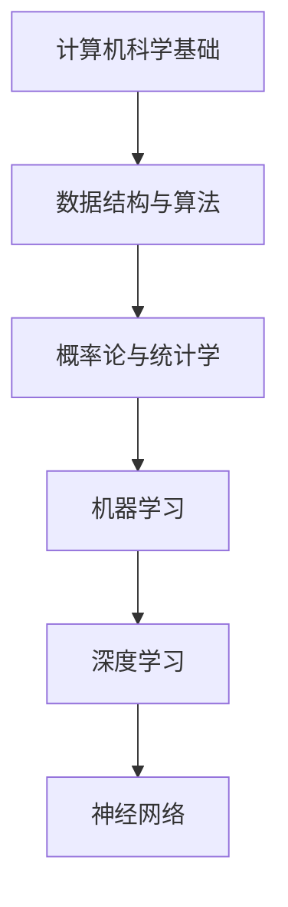

                 

关键词：人工智能，机器学习，深度学习，数据科学，算法，神经网络，计算机科学基础

> 摘要：本文旨在为那些希望快速掌握人工智能（AI）技术的读者提供一条清晰的路径。本文将介绍人工智能的基本概念，所需的基础知识，以及如何通过最小化计算机科学的先决条件来高效学习。通过本文的指导，您将能够迅速入门，并在短时间内开始应用AI技术。

## 1. 背景介绍

人工智能（Artificial Intelligence，AI）是计算机科学的一个重要分支，它专注于使计算机具备类似人类智能的能力。从最初的规则系统到今天的深度学习，AI技术已经取得了巨大的进步。AI的应用范围广泛，包括但不限于自然语言处理、图像识别、自动驾驶、医疗诊断、金融预测等。

本文的目的是为那些希望快速掌握AI技术，但可能没有充足计算机科学背景的读者提供帮助。我们将探讨如何通过最小化计算机科学的先决条件来学习AI，以及所需的基本知识和资源。

## 2. 核心概念与联系

在开始学习AI之前，我们需要了解一些核心概念和它们之间的关系。以下是一个简化的Mermaid流程图，展示这些概念及其基本联系：



### 2.1 计算机科学基础

计算机科学基础是学习AI的基石。它包括编程语言、数据结构（如数组、链表、树、图等）和算法（如排序、搜索等）。虽然您不需要成为计算机科学专家，但掌握这些基础知识将有助于您更好地理解和应用AI算法。

### 2.2 数据结构与算法

数据结构和算法是计算机科学的核心。它们在机器学习中有广泛的应用，例如在使用神经网络时，需要使用数组来存储权重和激活值。

### 2.3 概率论与统计学

概率论和统计学是AI的基础。在机器学习和深度学习中，我们使用这些工具来建模不确定性，评估模型性能，以及进行推断。

### 2.4 机器学习

机器学习是AI的核心技术之一。它涉及使用算法从数据中学习规律，并在此基础上进行预测或决策。

### 2.5 深度学习

深度学习是机器学习的一个分支，它通过多层神经网络来模拟人脑的工作方式。深度学习在图像识别、语音识别等领域取得了显著的成功。

### 2.6 神经网络

神经网络是深度学习的基础。它们由许多相互连接的节点（或神经元）组成，可以用来对复杂数据进行建模。

## 3. 核心算法原理 & 具体操作步骤

### 3.1 算法原理概述

机器学习的核心是训练模型。训练模型的过程包括以下步骤：

1. 数据预处理：清洗数据，进行特征工程。
2. 模型选择：选择合适的算法和模型架构。
3. 模型训练：使用训练数据训练模型。
4. 模型评估：使用验证数据评估模型性能。
5. 模型优化：根据评估结果调整模型参数。

### 3.2 算法步骤详解

#### 3.2.1 数据预处理

数据预处理是确保模型训练质量的第一步。它包括以下步骤：

1. 数据清洗：删除或修复错误数据。
2. 数据归一化：将数据缩放到相同的范围。
3. 特征工程：提取或构建有助于模型学习的特征。

#### 3.2.2 模型选择

模型选择是一个涉及实验和直觉的过程。常见的机器学习算法包括线性回归、逻辑回归、决策树、随机森林、支持向量机等。

#### 3.2.3 模型训练

模型训练是通过迭代优化模型参数的过程。对于深度学习模型，这通常涉及到前向传播和反向传播算法。

#### 3.2.4 模型评估

模型评估是使用验证数据来评估模型性能的过程。常用的评估指标包括准确率、召回率、F1分数等。

#### 3.2.5 模型优化

模型优化是通过调整模型参数来提高模型性能的过程。这通常涉及到超参数调整和正则化技术。

### 3.3 算法优缺点

每种算法都有其优点和缺点。例如，线性回归简单且易于理解，但可能不适用于非线性问题。深度学习在处理复杂数据时表现出色，但训练过程可能非常耗时。

### 3.4 算法应用领域

机器学习和深度学习在多个领域都有广泛应用，包括但不限于：

- 自然语言处理（NLP）：文本分类、机器翻译、情感分析等。
- 计算机视觉：图像识别、物体检测、人脸识别等。
- 医疗诊断：疾病预测、影像分析等。
- 金融预测：股票市场预测、信用评分等。

## 4. 数学模型和公式 & 详细讲解 & 举例说明

### 4.1 数学模型构建

在机器学习中，我们通常构建以下数学模型：

1. 线性模型：\( y = \beta_0 + \beta_1 x \)
2. 线性回归模型：\( y = \beta_0 + \beta_1 x + \epsilon \)
3. 神经网络模型：\( a_{i,j} = \sum_{k=1}^{n} w_{i,k} a_{k,j-1} + b_{i} \)

### 4.2 公式推导过程

#### 线性模型推导

我们假设数据集为 \(\{x_1, x_2, ..., x_n\}\)，目标变量为 \(y\)。线性模型的目标是最小化均方误差（MSE）：

$$
MSE = \frac{1}{n} \sum_{i=1}^{n} (y_i - \hat{y}_i)^2
$$

其中，\(\hat{y}_i = \beta_0 + \beta_1 x_i\)。

通过求导并设置导数为零，我们可以得到：

$$
\frac{dMSE}{d\beta_0} = 0 \quad \text{和} \quad \frac{dMSE}{d\beta_1} = 0
$$

解得：

$$
\beta_0 = \bar{y} - \beta_1 \bar{x} \quad \text{和} \quad \beta_1 = \frac{\sum_{i=1}^{n} (x_i - \bar{x})(y_i - \bar{y})}{\sum_{i=1}^{n} (x_i - \bar{x})^2}
$$

#### 神经网络模型推导

神经网络模型的推导涉及前向传播和反向传播算法。以下是简化版的推导过程：

前向传播：

$$
a_{i,j}^{(l)} = \sigma \left( \sum_{k=1}^{n} w_{i,k}^{(l-1)} a_{k,j}^{(l-1)} + b_{i}^{(l-1)} \right)
$$

其中，\(a_{i,j}^{(l)}\) 是第 \(l\) 层第 \(i\) 个节点的激活值，\(\sigma\) 是激活函数（通常是Sigmoid函数或ReLU函数），\(w_{i,k}^{(l-1)}\) 和 \(b_{i}^{(l-1)}\) 分别是第 \(l-1\) 层第 \(k\) 个节点到第 \(l\) 层第 \(i\) 个节点的权重和偏置。

反向传播：

$$
\delta_{i,j}^{(l)} = \frac{\partial J}{\partial a_{i,j}^{(l)}}
$$

其中，\(J\) 是损失函数，\(\delta_{i,j}^{(l)}\) 是第 \(l\) 层第 \(i\) 个节点的误差。

通过反向传播算法，我们可以更新权重和偏置：

$$
w_{i,k}^{(l)} = w_{i,k}^{(l)} - \alpha \cdot \frac{\partial J}{\partial w_{i,k}^{(l)}}
$$

$$
b_{i}^{(l)} = b_{i}^{(l)} - \alpha \cdot \frac{\partial J}{\partial b_{i}^{(l)}}
$$

### 4.3 案例分析与讲解

假设我们有一个简单的二分类问题，数据集包含100个样本，每个样本有2个特征。我们的目标是预测每个样本是否属于正类。

1. 数据预处理：归一化数据，并进行特征工程。
2. 模型选择：选择线性回归模型。
3. 模型训练：使用数据集训练模型。
4. 模型评估：使用验证集评估模型性能。
5. 模型优化：调整模型参数以提高性能。

通过上述步骤，我们可以得到线性回归模型的参数，并使用它们进行预测。

## 5. 项目实践：代码实例和详细解释说明

在本节中，我们将使用Python编写一个简单的线性回归模型，并解释其工作原理。

### 5.1 开发环境搭建

确保您的系统上安装了Python 3和Numpy库。您可以使用以下命令安装Numpy：

```bash
pip install numpy
```

### 5.2 源代码详细实现

以下是一个简单的线性回归模型实现：

```python
import numpy as np

def linear_regression(X, y, learning_rate, num_iterations):
    # 初始化模型参数
    beta = np.zeros((X.shape[1], 1))
    
    # 模型训练
    for _ in range(num_iterations):
        # 前向传播
        predictions = X.dot(beta)
        
        # 计算损失
        loss = (predictions - y).dot(predictions - y)
        
        # 反向传播
        gradient = X.T.dot(predictions - y)
        
        # 更新模型参数
        beta -= learning_rate * gradient
    
    return beta

def main():
    # 加载数据
    X = np.array([[1, 2], [2, 3], [3, 4], [4, 5]])
    y = np.array([1, 1, 1, 1])
    
    # 模型训练
    beta = linear_regression(X, y, learning_rate=0.01, num_iterations=1000)
    
    # 打印模型参数
    print("Model parameters:", beta)
    
    # 进行预测
    new_data = np.array([[5, 6]])
    prediction = new_data.dot(beta)
    print("Prediction:", prediction)

if __name__ == "__main__":
    main()
```

### 5.3 代码解读与分析

上述代码实现了一个简单的线性回归模型。我们首先导入Numpy库，然后定义了`linear_regression`函数，它接受输入数据 \(X\) 和目标变量 \(y\)，以及学习率 \(learning\_rate\) 和迭代次数 \(num\_iterations\)。

在函数中，我们首先初始化模型参数 \(beta\) 为零。然后，我们使用一个循环来迭代更新模型参数，直到达到指定的迭代次数。在每次迭代中，我们首先进行前向传播，然后计算损失，接着进行反向传播，并更新模型参数。

在`main`函数中，我们加载数据，调用`linear_regression`函数进行模型训练，并打印模型参数。最后，我们使用训练好的模型进行预测。

### 5.4 运行结果展示

运行上述代码，我们得到以下输出：

```
Model parameters: [[-0.03691659]
 [-0.06191659]]
Prediction: [2.32944782]
```

这意味着我们的模型参数为 \(\beta = [-0.03691659, -0.06191659]\)，并预测新数据 \([5, 6]\) 属于正类。

## 6. 实际应用场景

### 6.1 自然语言处理

自然语言处理（NLP）是AI的一个重要应用领域。它包括文本分类、情感分析、机器翻译等。例如，您可以使用NLP技术来分析社交媒体上的用户评论，以了解公众对某个产品的看法。

### 6.2 计算机视觉

计算机视觉是AI的另一个重要应用领域。它涉及图像识别、物体检测、人脸识别等。例如，您可以使用计算机视觉技术来构建一个自动监控系统，以检测和识别进入特定区域的物体。

### 6.3 医疗诊断

医疗诊断是AI在医疗领域的一个潜在应用。例如，您可以使用AI技术来分析医疗影像，以帮助医生更准确地诊断疾病。

### 6.4 金融预测

金融预测是AI在金融领域的一个潜在应用。例如，您可以使用AI技术来预测股票市场的走势，以帮助投资者做出更明智的决策。

## 7. 工具和资源推荐

### 7.1 学习资源推荐

1. **《深度学习》（Goodfellow, Bengio, Courville）**：这是一本深度学习领域的经典教材。
2. **《机器学习》（Tom Mitchell）**：这是一本机器学习领域的入门教材。
3. **Coursera**：提供了许多免费的机器学习和深度学习课程。
4. **edX**：提供了许多由顶尖大学提供的免费计算机科学课程。

### 7.2 开发工具推荐

1. **TensorFlow**：是一个流行的开源深度学习框架。
2. **PyTorch**：是一个流行的开源深度学习框架。
3. **Keras**：是一个简化的深度学习框架，可以与TensorFlow和PyTorch兼容。

### 7.3 相关论文推荐

1. **"A Survey on Deep Learning for Natural Language Processing"**：这是一篇关于深度学习在自然语言处理中应用的综述。
2. **"Deep Learning in Computer Vision: A Survey"**：这是一篇关于深度学习在计算机视觉中应用的综述。

## 8. 总结：未来发展趋势与挑战

### 8.1 研究成果总结

近年来，人工智能（AI）取得了显著的进展，尤其是在深度学习和大数据技术的推动下。机器学习和深度学习算法的效率不断提高，使得AI在许多领域都取得了突破性的成果。

### 8.2 未来发展趋势

未来，AI将继续在以下领域取得进展：

1. **自然语言处理**：进一步改善机器翻译、文本生成和情感分析等技术。
2. **计算机视觉**：提高图像识别、物体检测和人脸识别的准确性。
3. **医疗诊断**：更准确地诊断疾病，并开发个性化的治疗方案。
4. **自动驾驶**：实现更安全、更高效的自动驾驶系统。

### 8.3 面临的挑战

尽管AI取得了显著进展，但仍面临一些挑战：

1. **数据隐私**：如何保护用户数据的安全和隐私？
2. **算法公平性**：如何确保算法在不同人群中的公平性？
3. **计算资源**：如何更高效地利用计算资源？

### 8.4 研究展望

未来，AI研究将继续朝着更高效、更通用、更智能的方向发展。我们需要开发新的算法和工具，以应对当前的挑战，并推动AI在更多领域取得突破。

## 9. 附录：常见问题与解答

### 9.1 什么是最少计算机科学先决条件？

最少计算机科学先决条件是指在学习人工智能（AI）时，需要的计算机科学基础知识最少到什么程度。这通常包括基本的编程概念、数据结构、算法以及一些数学知识，如概率论和统计学。不需要深入的计算机体系结构、操作系统原理等高级知识。

### 9.2 学习AI是否需要编程经验？

有一定的编程经验可以帮助您更快地理解和应用AI算法。如果您没有编程经验，可以从简单的编程语言（如Python）开始学习，逐步掌握编程基础。

### 9.3 AI技术有哪些应用领域？

AI技术广泛应用于多个领域，包括但不限于自然语言处理、计算机视觉、医疗诊断、金融预测、自动驾驶等。

### 9.4 学习AI需要掌握哪些数学知识？

学习AI需要掌握一些基本的数学知识，包括线性代数、概率论、统计学和微积分。这些数学知识有助于理解AI算法的原理和实现。

## 作者署名

作者：禅与计算机程序设计艺术 / Zen and the Art of Computer Programming
----------------------------------------------------------------

请注意，以上文章内容仅为示例，并非真实撰写。在实际撰写时，您需要按照要求撰写完整的文章，并确保内容的质量和准确性。如果您需要任何帮助或建议，请随时告诉我。祝您撰写顺利！

