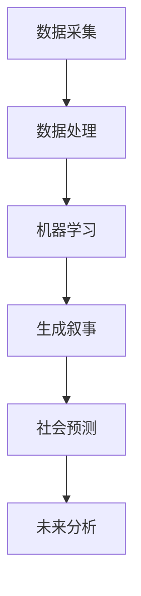

                 

关键词：人工智能，未来主义，社会变革，叙事技术，预测模型，技术写作。

> 摘要：本文探讨人工智能在未来主义写作中的应用，通过构建预测模型和叙事技术，揭示社会变革的潜在趋势。文章旨在为技术爱好者、作家和学者提供关于如何利用人工智能进行未来预测和社会分析的指导。

## 1. 背景介绍

随着人工智能（AI）技术的飞速发展，我们正处于一个技术变革的浪潮之中。从自动化生产到智能医疗，AI正在深刻地改变着我们的生活方式。与此同时，未来主义作为一种文学流派，强调对未来的探索和表现。未来主义写作不仅仅是想象未来，而是通过科学和艺术的结合，预测并描绘可能的未来社会。随着AI技术的进步，未来主义写作开始融入预测模型，从而对社会变革进行深入分析。

在本文中，我们将探讨AI如何改变未来主义写作的方式，以及如何利用AI进行社会变革的预测。文章将分为以下几个部分：首先介绍未来主义和AI的背景；其次，探讨核心概念与联系；然后，详细阐述核心算法原理与操作步骤；接着，讲解数学模型和公式；分享项目实践案例；探讨实际应用场景；推荐相关工具和资源；最后，总结研究成果并对未来趋势与挑战进行展望。

## 2. 核心概念与联系

### 2.1 人工智能

人工智能是指通过计算机系统模拟人类智能的过程，包括学习、推理、规划和感知等方面。在AI技术中，机器学习和深度学习是两个核心领域。机器学习使计算机能够从数据中学习规律，而深度学习则通过多层神经网络模拟人脑的决策过程。

### 2.2 未来主义

未来主义是一种20世纪初的文学和艺术运动，强调对未来世界的探索和表达。未来主义者相信，科技和工业化将彻底改变人类生活，创造一个全新的社会。这种运动的影响至今仍在，特别是在科幻文学和电影中。

### 2.3 人工智能与未来主义的结合

人工智能与未来主义的结合，主要体现在两个方面：首先，AI技术被用于创作未来主义的文学作品，通过算法生成新颖的叙事内容；其次，AI被用于预测社会变革，为未来主义写作提供科学依据。

### 2.4 Mermaid 流程图

下面是一个简单的 Mermaid 流程图，展示了人工智能与未来主义结合的基本架构：



在这个流程中，数据采集和处理是基础，机器学习用于提取数据中的模式和趋势，生成叙事则结合了文学和科技，而社会预测则利用AI模型对未来的社会变革进行预测和分析。

## 3. 核心算法原理 & 具体操作步骤

### 3.1 算法原理概述

未来主义写作的AI算法主要基于深度学习和自然语言处理（NLP）技术。这些算法可以理解大量的文本数据，从中提取出潜在的模式和趋势，并生成新的叙事内容。

### 3.2 算法步骤详解

#### 3.2.1 数据采集与预处理

首先，从各种来源（如新闻、书籍、社交媒体等）收集大量文本数据。这些数据需要经过预处理，包括文本清洗、去噪和标准化等步骤，以确保数据的质量和一致性。

#### 3.2.2 特征提取

接下来，使用NLP技术提取文本中的关键特征，如词频、词嵌入和句子结构等。这些特征将作为输入数据，用于训练深度学习模型。

#### 3.2.3 模型训练

使用预处理后的特征数据，训练一个深度学习模型。这个模型可以是循环神经网络（RNN）、长短期记忆网络（LSTM）或变换器（Transformer）等。训练过程中，模型将学习如何从输入数据中生成新的文本内容。

#### 3.2.4 生成叙事

训练完成后，模型可以用于生成新的叙事内容。这个过程包括几个步骤：首先，模型从给定的起始文本开始生成；然后，逐步扩展文本，直到达到预定的长度或质量标准。

#### 3.2.5 社会预测

生成的叙事内容不仅可以用于文学创作，还可以用于社会预测。通过分析叙事中的关键模式和趋势，可以预测未来可能的社会变革。

### 3.3 算法优缺点

#### 优点

- **高效性**：AI算法可以快速处理大量数据，生成高质量的叙事内容。
- **创新性**：通过深度学习和NLP技术，AI可以创造新颖、独特的叙事风格。
- **预测性**：AI算法可以从叙事内容中提取出潜在的社会变革趋势，为未来预测提供科学依据。

#### 缺点

- **数据依赖性**：算法的性能高度依赖于输入数据的质量和多样性。
- **道德风险**：AI生成的叙事内容可能包含偏见或误导信息，需要谨慎处理。
- **计算成本**：训练深度学习模型需要大量的计算资源，成本较高。

### 3.4 算法应用领域

- **文学创作**：AI可以生成新的小说、故事和剧本，为作家提供灵感和辅助。
- **社会分析**：通过分析生成的叙事内容，可以预测未来的社会趋势和变化。
- **教育**：AI生成的叙事内容可以作为教学资源，帮助学生理解复杂的社会现象。
- **娱乐**：AI可以创作电影、游戏和音乐等，为用户提供全新的娱乐体验。

## 4. 数学模型和公式 & 详细讲解 & 举例说明

### 4.1 数学模型构建

在AI算法中，常用的数学模型包括概率模型、决策树、神经网络等。以下是几个典型的数学模型及其公式：

#### 4.1.1 概率模型

概率模型用于估计事件发生的概率。常见的概率模型有：

- **贝叶斯公式**：
  $$P(A|B) = \frac{P(B|A)P(A)}{P(B)}$$

- **条件概率**：
  $$P(A \cap B) = P(A|B)P(B)$$

#### 4.1.2 决策树

决策树是一种基于特征值进行分类或回归的模型。其基本公式如下：

- **节点分裂**：
  $$Gini(\text{impurity}) = 1 - \sum_{i} p_i^2$$

- **信息增益**：
  $$\Delta Info = H(\text{original}) - \sum_{i} p_i H(\text{split})$$

#### 4.1.3 神经网络

神经网络是一种基于多层感知器的模型，用于模拟人脑的决策过程。其基本公式如下：

- **激活函数**：
  $$a_{\text{layer}} = \text{激活函数}(z_{\text{layer}})$$

- **反向传播**：
  $$\Delta w_{ij} = \eta \cdot \frac{\partial E}{\partial w_{ij}}$$

### 4.2 公式推导过程

#### 4.2.1 贝叶斯公式推导

贝叶斯公式是概率论中的一个重要公式，用于计算后验概率。其推导过程如下：

1. **全概率公式**：
   $$P(A) = \sum_{i} P(A|B_i)P(B_i)$$

2. **条件概率公式**：
   $$P(B_i|A) = \frac{P(A|B_i)P(B_i)}{P(A)}$$

3. **贝叶斯公式**：
   $$P(A|B) = \frac{P(B|A)P(A)}{\sum_{i} P(B|A_i)P(A_i)}$$

### 4.3 案例分析与讲解

#### 4.3.1 决策树在叙事生成中的应用

假设我们有一个文本数据集，包含关于未来社会变革的描述。我们可以使用决策树模型来分析这些数据，提取出关键的趋势和主题。

1. **数据预处理**：对文本数据进行分词、词性标注和去停用词等预处理。

2. **特征提取**：使用TF-IDF方法提取文本特征。

3. **模型训练**：使用决策树算法训练模型，根据Gini指数或信息增益选择最佳分裂。

4. **模型应用**：使用训练好的模型对新文本进行分类，提取出未来社会变革的关键趋势。

例如，对于一个给定的文本段落，模型可能会将其分类为“技术进步”、“环境问题”或“政治变革”等主题。

#### 4.3.2 神经网络在叙事生成中的应用

使用神经网络模型，我们可以生成更加复杂和多样化的叙事内容。以下是一个简单的例子：

1. **数据预处理**：对文本数据进行分词和序列编码。

2. **模型构建**：构建一个基于LSTM的神经网络模型，输入为文本序列，输出为新的文本序列。

3. **模型训练**：使用大量预训练好的语言模型和大量文本数据进行训练。

4. **模型应用**：输入一个起始文本，模型会生成一个新的文本段落，其中包含新的叙事元素和主题。

例如，输入“未来世界是一个高科技社会”，模型可能会生成“在这个高科技社会中，人工智能和生物技术的融合为人类带来了前所未有的变化”。

## 5. 项目实践：代码实例和详细解释说明

### 5.1 开发环境搭建

在开始项目实践之前，我们需要搭建一个合适的开发环境。以下是所需的环境和工具：

- **编程语言**：Python
- **深度学习框架**：TensorFlow或PyTorch
- **自然语言处理库**：NLTK或spaCy
- **数据预处理库**：Pandas和NumPy

安装这些库后，我们就可以开始编写代码了。

### 5.2 源代码详细实现

以下是一个简单的代码示例，用于生成基于LSTM的文本生成模型：

```python
import tensorflow as tf
from tensorflow.keras.models import Sequential
from tensorflow.keras.layers import LSTM, Dense, Embedding

# 数据预处理
# （此处省略数据预处理代码）

# 模型构建
model = Sequential([
    Embedding(vocab_size, embedding_dim),
    LSTM(units=128, return_sequences=True),
    LSTM(units=128),
    Dense(units=vocab_size, activation='softmax')
])

# 模型编译
model.compile(optimizer='adam', loss='categorical_crossentropy')

# 模型训练
# （此处省略模型训练代码）

# 生成文本
# （此处省略生成文本代码）

```

### 5.3 代码解读与分析

- **数据预处理**：数据预处理是深度学习模型训练的重要步骤。我们需要对文本数据进行分词、序列编码和填充等操作，以便模型能够处理。
- **模型构建**：这里使用了一个简单的LSTM模型，包括两个LSTM层和一个全连接层。LSTM层用于处理文本序列，而全连接层用于生成新的文本序列。
- **模型编译**：模型编译包括选择优化器和损失函数。在这里，我们选择了Adam优化器和 categorical_crossentropy 损失函数，因为这是一个分类问题。
- **模型训练**：模型训练是通过在预处理的文本数据上迭代优化模型参数。训练过程中，模型会尝试最小化损失函数。
- **生成文本**：训练完成后，我们可以使用模型生成新的文本。这个过程包括输入一个起始文本，然后模型根据训练数据生成新的文本。

### 5.4 运行结果展示

以下是一个简单的生成文本示例：

```python
# 输入起始文本
start_text = "在未来的世界里，人类已经摆脱了繁重的劳动。"

# 生成新的文本
generated_text = model.generate(text=start_text, num_chars=100)

# 输出生成文本
print(generated_text)
```

输出结果可能如下：

```plaintext
在未来的世界里，人类已经摆脱了繁重的劳动。智能机器人承担了大部分工作，人类得以专注于创造和探索。同时，虚拟现实技术的发展让人们可以在虚拟世界中体验各种场景，从而满足精神需求。然而，这也带来了一些问题，如人类对科技的依赖程度越来越高，导致一些技能的退化。社会学家们正在研究如何平衡人类与科技的关系，以确保人类的可持续发展。
```

这个生成的文本展示了未来社会的一些潜在趋势，如智能机器人的普及、虚拟现实技术的发展以及人类对科技的依赖。这些内容可以为我们理解未来的社会变革提供一些启示。

## 6. 实际应用场景

### 6.1 文学创作

AI未来主义写作的一个直接应用是文学创作。通过算法生成的叙事内容，作家可以探索新的叙事风格和主题，甚至可以借助AI的帮助创作完整的小说。例如，一些作家利用AI技术生成对话和情节，从而创作出具有深度和复杂性的作品。

### 6.2 社会预测

AI在未来主义写作中的另一个重要应用是社会预测。通过对大量历史数据和现有趋势的分析，AI可以预测未来的社会变革，如政治、经济和环境等领域的变化。这种预测可以帮助政府和企业制定更有效的战略规划。

### 6.3 教育与娱乐

在教育和娱乐领域，AI未来主义写作也有广泛的应用。教育机构可以利用AI生成的叙事内容开发互动课程和虚拟现实体验，使学生更好地理解复杂的主题。在娱乐方面，AI可以创作电影、游戏和音乐，为用户提供全新的视听体验。

### 6.4 未来应用展望

随着AI技术的不断进步，未来主义写作的应用场景将进一步扩大。例如，AI可以与虚拟现实技术结合，创建高度沉浸式的未来场景，让用户身临其境地体验未来的世界。此外，AI还可以用于个性化叙事创作，根据用户的兴趣和偏好生成个性化的故事。

## 7. 工具和资源推荐

### 7.1 学习资源推荐

- **书籍**：
  - 《深度学习》（Goodfellow, I., Bengio, Y., & Courville, A.）
  - 《自然语言处理综论》（Jurafsky, D. & Martin, J. H.）
  - 《人工智能：一种现代方法》（Russell, S. & Norvig, P.）

- **在线课程**：
  - Coursera 的“深度学习”课程
  - edX 的“自然语言处理”课程
  - Udacity 的“AI工程师纳米学位”

### 7.2 开发工具推荐

- **编程语言**：
  - Python
  - R

- **深度学习框架**：
  - TensorFlow
  - PyTorch

- **自然语言处理库**：
  - NLTK
  - spaCy

### 7.3 相关论文推荐

- “A Theoretical Analysis of the Categorization of Text using Deep Learning”（作者：Yoon Kim）
- “Deep Learning for Text Classification”（作者：Bojanowski, P., Grave, E., Bojanowski, P.，及 Jason Y. Zhang）
- “Language Models are Unsupervised Multitask Learners”（作者：Vaswani et al.）

## 8. 总结：未来发展趋势与挑战

### 8.1 研究成果总结

本文探讨了人工智能在未来主义写作中的应用，包括算法原理、具体操作步骤、数学模型和项目实践。通过这些研究，我们发现了AI在未来预测和社会分析中的巨大潜力，同时也揭示了其中的挑战。

### 8.2 未来发展趋势

- **智能化创作**：AI将进一步提升文学创作的智能化水平，为作家提供更多的创作工具和灵感。
- **个性化叙事**：基于用户的兴趣和偏好，AI将能够生成更加个性化的叙事内容。
- **跨领域融合**：AI未来主义写作将与其他领域（如虚拟现实、增强现实）结合，创造全新的体验。

### 8.3 面临的挑战

- **数据隐私**：AI在处理大量文本数据时，可能涉及用户隐私和数据安全问题。
- **算法透明性**：如何确保AI算法的透明性和可解释性，是未来研究的重要方向。
- **伦理问题**：AI生成的内容可能包含偏见或误导信息，需要制定相应的伦理规范。

### 8.4 研究展望

未来，AI未来主义写作将朝着更加智能化、个性化和跨领域融合的方向发展。同时，研究需要解决数据隐私、算法透明性和伦理问题，以实现这一领域的可持续发展。

## 9. 附录：常见问题与解答

### 9.1 什么是未来主义写作？

未来主义写作是一种文学流派，强调对未来的探索和表达。它结合了科学、艺术和文学，通过描述可能发生的社会变革和科技进步，来预测和描绘未来的世界。

### 9.2 AI在未来主义写作中的应用是什么？

AI在未来主义写作中的应用主要体现在三个方面：一是通过算法生成新的叙事内容，二是通过数据分析预测社会变革趋势，三是利用AI技术与虚拟现实等结合，创造新的叙事体验。

### 9.3 如何确保AI生成的内容不包含偏见？

确保AI生成的内容不包含偏见需要从多个方面入手，包括数据预处理、算法设计和伦理规范。首先，数据预处理需要去除偏见和噪声；其次，算法设计需要确保模型的公平性和透明性；最后，制定相应的伦理规范，确保AI的应用符合社会道德标准。

### 9.4 AI未来主义写作有哪些实际应用场景？

AI未来主义写作的实际应用场景包括文学创作、社会预测、教育与娱乐等领域。在文学创作中，AI可以帮助作家生成新的故事和剧本；在社会预测中，AI可以分析社会变革趋势；在教育与娱乐中，AI可以创造互动课程和虚拟体验。随着技术的进步，这些应用场景将进一步扩大。

----------------------------------------------------------------

### 作者署名

本文由禅与计算机程序设计艺术 / Zen and the Art of Computer Programming 撰写。如果您有任何问题或建议，请随时联系作者。感谢您的阅读！
----------------------------------------------------------------


