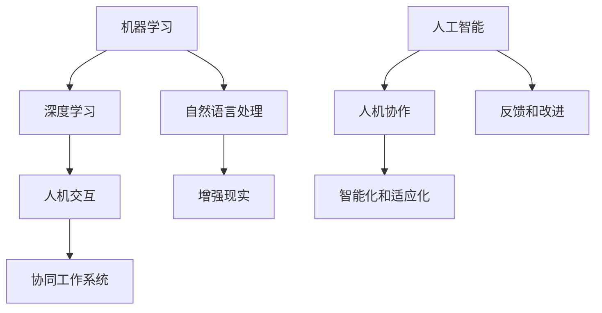

                 

在当今这个快速发展的数字化时代，人工智能（AI）技术正以前所未有的速度和规模渗透到各行各业。从制造业到医疗，从金融到教育，人工智能的广泛应用不仅提高了生产效率，还改变了人类的工作方式和职业结构。本文旨在探讨人工智能与人机协作在未来工作中的角色和影响，分析其带来的机遇与挑战，并展望职业发展的新趋势。

> 关键词：人工智能，人机协作，职业未来，数字化转型，劳动力市场

> 摘要：本文首先回顾了人工智能技术的发展历程，阐述了其在不同领域中的应用现状。接着，分析了人工智能与人机协作的基本原理和关键技术，探讨了其在提高工作效率、创造新职业机会、优化劳动力市场等方面的潜力。随后，本文通过实际案例展示了人工智能在各个行业的应用场景，并提出了未来发展的展望。最后，本文提出了应对人工智能带来的挑战的策略，包括教育、政策、伦理等方面。

## 1. 背景介绍

人工智能（AI）的概念最早可以追溯到20世纪50年代，当时图灵提出了“图灵测试”来衡量机器的智能水平。自那时起，人工智能经历了多次技术革命，从早期的符号主义和规则推理，到基于知识的系统，再到如今的深度学习和神经网络，每一次突破都极大地推动了人工智能的发展。近年来，随着计算能力的提升、大数据的积累和算法的改进，人工智能已经从理论研究走向实际应用，成为驱动社会变革的重要力量。

在各个领域，人工智能的应用正在迅速扩展。例如，在医疗领域，人工智能可以帮助医生进行疾病诊断、预测疾病趋势和优化治疗方案；在金融领域，人工智能可以用于风险评估、欺诈检测和投资决策；在制造业中，人工智能可以用于生产线的自动化控制、质量检测和预测维护。这些应用不仅提高了效率，还带来了新的商业模式和就业机会。

然而，人工智能的快速发展也引发了一系列社会问题，包括就业结构的变化、数据隐私和安全、伦理问题等。这些问题需要我们在推动人工智能技术进步的同时，认真思考如何实现人机协作，使人工智能更好地服务于人类。

### 1.1 人工智能的发展历程

- **符号主义和规则推理（20世纪50-70年代）**：这一阶段的代表性工作包括逻辑编程、专家系统和知识表示。然而，由于知识获取和推理的复杂性，这一方法在实际应用中遇到了瓶颈。
- **基于知识的系统（20世纪80-90年代）**：这一阶段的发展试图通过建立知识库和推理机来模拟人类的思维过程。尽管取得了一些成功，但知识获取的问题仍然是一个巨大的挑战。
- **深度学习和神经网络（2000年代至今）**：深度学习的兴起标志着人工智能技术的一个重要转折点。通过大量的数据训练和复杂的网络结构，深度学习在图像识别、自然语言处理和语音识别等领域取得了显著的突破。

### 1.2 人工智能的应用现状

- **医疗领域**：人工智能在医疗领域的应用主要包括疾病诊断、治疗方案优化和患者管理。例如，IBM的Watson可以用于肿瘤诊断和个性化治疗方案的制定。
- **金融领域**：人工智能在金融领域被广泛应用于风险控制、投资决策和客户服务。例如，量化交易和智能投顾就是人工智能在金融领域的典型应用。
- **制造业**：人工智能在制造业的应用主要体现在生产自动化、质量检测和预测维护。例如，机器人可以在工厂中完成复杂的装配任务，而智能传感器可以实时监测设备状态并预测故障。

## 2. 核心概念与联系

为了更好地理解人工智能与人机协作的基本原理和关键技术，我们首先需要了解一些核心概念和它们之间的联系。

### 2.1 人工智能的核心概念

- **机器学习**：机器学习是人工智能的一个重要分支，它通过算法和统计模型让计算机从数据中学习和提取知识。常见的机器学习算法包括监督学习、无监督学习和强化学习。
- **深度学习**：深度学习是一种基于多层神经网络的机器学习方法，它在图像识别、语音识别和自然语言处理等领域取得了显著的成果。
- **自然语言处理（NLP）**：自然语言处理是使计算机能够理解、生成和处理自然语言的技术。它包括语言模型、词向量、句法分析和语义理解等。

### 2.2 人机协作的核心概念

- **人机交互**：人机交互是使人类和计算机系统能够有效沟通和协作的技术。它包括图形用户界面（GUI）、语音识别、手势识别和虚拟现实等。
- **增强现实（AR）**：增强现实是一种将虚拟信息叠加到现实世界中的技术，它可以通过智能眼镜、手机和平板电脑等设备实现。增强现实在教育和医疗等领域有广泛的应用。
- **协同工作系统**：协同工作系统是一种支持多人同时协作的软件平台，它可以通过网络实现远程协作、任务分配和进度追踪。

### 2.3 人工智能与人机协作的联系

人工智能和人机协作之间存在着密切的联系。人工智能技术为人机协作提供了强大的支持，使得计算机能够更好地理解和满足人类的需求。同时，人机协作也为人工智能提供了反馈和改进的机会，使其更加智能化和适应化。

为了更好地理解这些概念和它们之间的联系，我们可以使用Mermaid流程图来展示它们的基本架构。以下是一个简单的Mermaid流程图示例：



通过这个流程图，我们可以清晰地看到人工智能和人机协作的基本架构和它们之间的联系。

## 3. 核心算法原理 & 具体操作步骤

### 3.1 算法原理概述

人工智能的核心在于其算法，这些算法使得计算机能够模拟人类的思维和行为。其中，深度学习是最重要的算法之一。深度学习基于多层神经网络，通过反向传播算法来训练模型，从而实现从数据中自动提取特征和模式。

深度学习的基本原理可以概括为以下几个步骤：

1. **数据输入**：将原始数据输入到神经网络中，这些数据可以是图像、文本、音频或任何其他形式。
2. **前向传播**：通过神经网络的各层进行数据处理，输出中间结果。
3. **反向传播**：根据输出结果与实际结果的差距，调整神经网络的权重和偏置，使模型逐渐逼近真实情况。
4. **优化目标**：通过最小化损失函数（如均方误差）来优化模型参数。

### 3.2 算法步骤详解

1. **初始化网络结构**：定义网络的层数、每层的神经元数量、激活函数等。
2. **前向传播**：
   - 将输入数据通过网络的输入层传递到隐藏层。
   - 在每个隐藏层，通过激活函数计算输出。
   - 最后将输出传递到输出层。
3. **计算损失**：将输出层的结果与真实标签进行比较，计算损失函数的值。
4. **反向传播**：根据损失函数的梯度，通过反向传播算法更新网络中的权重和偏置。
5. **迭代优化**：重复上述步骤，直到达到预定的迭代次数或损失函数值达到最小。

### 3.3 算法优缺点

**优点**：

- **强大的泛化能力**：通过多层神经网络，深度学习可以自动提取数据中的复杂特征，从而具有强大的泛化能力。
- **高效率**：与传统的机器学习方法相比，深度学习可以在较少的训练时间内达到更高的准确率。
- **广泛应用**：深度学习在图像识别、自然语言处理、语音识别等多个领域取得了显著成果。

**缺点**：

- **数据需求高**：深度学习需要大量的数据来训练模型，数据的质量和数量对模型的性能有重要影响。
- **计算资源消耗大**：深度学习模型通常需要大量的计算资源，尤其是在训练阶段。
- **调参复杂**：深度学习模型的参数调整非常复杂，需要大量的实验和调优。

### 3.4 算法应用领域

- **图像识别**：深度学习在图像识别领域取得了显著成果，如人脸识别、车牌识别、物体检测等。
- **自然语言处理**：深度学习在自然语言处理领域也被广泛应用，如文本分类、机器翻译、情感分析等。
- **语音识别**：深度学习在语音识别领域表现优异，如语音助手、自动字幕生成等。
- **推荐系统**：深度学习在推荐系统领域也被广泛应用，如商品推荐、电影推荐等。

## 4. 数学模型和公式 & 详细讲解 & 举例说明

### 4.1 数学模型构建

深度学习中的数学模型主要基于多层前馈神经网络。一个简单的神经网络可以表示为：

$$
f(x) = \sigma(W_n \cdot a_{n-1} + b_n)
$$

其中，$x$ 是输入数据，$a_n$ 是神经网络在每一层的输出，$W_n$ 和 $b_n$ 分别是第 $n$ 层的权重和偏置，$\sigma$ 是激活函数。

为了训练神经网络，我们需要定义一个损失函数，如均方误差（MSE）：

$$
L(y, \hat{y}) = \frac{1}{2} \sum_{i=1}^{N} (y_i - \hat{y}_i)^2
$$

其中，$y$ 是真实标签，$\hat{y}$ 是模型的预测值，$N$ 是样本数量。

### 4.2 公式推导过程

1. **前向传播**：
   - 输入层到隐藏层：
   $$ a_1 = \sigma(W_1 \cdot x + b_1) $$
   - 隐藏层到输出层：
   $$ \hat{y} = \sigma(W_n \cdot a_{n-1} + b_n) $$

2. **计算损失**：
   - 对每个样本计算损失：
   $$ L_i = \frac{1}{2} (y_i - \hat{y}_i)^2 $$

3. **反向传播**：
   - 计算输出层的梯度：
   $$ \frac{\partial L}{\partial W_n} = (y - \hat{y}) \cdot \frac{\partial \hat{y}}{\partial a_n} \cdot \frac{\partial a_n}{\partial W_n} $$
   $$ \frac{\partial L}{\partial b_n} = (y - \hat{y}) \cdot \frac{\partial \hat{y}}{\partial a_n} $$

   - 传递到隐藏层：
   $$ \frac{\partial L}{\partial W_{n-1}} = (W_n)^T \cdot \frac{\partial L}{\partial W_n} $$
   $$ \frac{\partial L}{\partial b_{n-1}} = \frac{\partial L}{\partial W_n} \cdot a_{n-2} $$

4. **权重和偏置更新**：
   - 使用梯度下降更新权重和偏置：
   $$ W_n = W_n - \alpha \cdot \frac{\partial L}{\partial W_n} $$
   $$ b_n = b_n - \alpha \cdot \frac{\partial L}{\partial b_n} $$

### 4.3 案例分析与讲解

假设我们有一个简单的神经网络，用于对二分类问题进行预测。输入层有2个神经元，隐藏层有3个神经元，输出层有1个神经元。我们使用均方误差（MSE）作为损失函数。

1. **初始化参数**：
   - 权重和偏置初始化为较小的随机值。

2. **前向传播**：
   - 输入数据 $x = [1, 2]^T$。
   - 隐藏层输出：
   $$ a_1 = \sigma(W_1 \cdot x + b_1) $$
   $$ a_2 = \sigma(W_2 \cdot x + b_2) $$
   $$ a_3 = \sigma(W_3 \cdot x + b_3) $$
   - 输出层输出：
   $$ \hat{y} = \sigma(W_n \cdot a_2 + b_n) $$

3. **计算损失**：
   - 假设真实标签 $y = 0$。
   $$ L = \frac{1}{2} (0 - \hat{y})^2 $$

4. **反向传播**：
   - 计算输出层的梯度：
   $$ \frac{\partial L}{\partial W_n} = (0 - \hat{y}) \cdot \frac{\partial \hat{y}}{\partial a_n} $$
   $$ \frac{\partial L}{\partial b_n} = (0 - \hat{y}) \cdot \frac{\partial \hat{y}}{\partial a_n} $$
   - 传递到隐藏层：
   $$ \frac{\partial L}{\partial W_{2}} = (W_n)^T \cdot \frac{\partial L}{\partial W_n} $$
   $$ \frac{\partial L}{\partial W_{1}} = (W_2)^T \cdot \frac{\partial L}{\partial W_{2}} $$
   $$ \frac{\partial L}{\partial b_{1}} = \frac{\partial L}{\partial W_{2}} \cdot a_1 $$

5. **权重和偏置更新**：
   - 假设学习率 $\alpha = 0.01$。
   $$ W_n = W_n - \alpha \cdot \frac{\partial L}{\partial W_n} $$
   $$ b_n = b_n - \alpha \cdot \frac{\partial L}{\partial b_n} $$
   $$ W_2 = W_2 - \alpha \cdot \frac{\partial L}{\partial W_{2}} $$
   $$ b_2 = b_2 - \alpha \cdot \frac{\partial L}{\partial b_{2}} $$
   $$ W_1 = W_1 - \alpha \cdot \frac{\partial L}{\partial W_{1}} $$
   $$ b_1 = b_1 - \alpha \cdot \frac{\partial L}{\partial b_{1}} $$

通过这个简单的例子，我们可以看到深度学习中的基本步骤和公式是如何运作的。在实际应用中，神经网络的结构和参数会根据具体问题进行调整，但基本原理是通用的。

## 5. 项目实践：代码实例和详细解释说明

### 5.1 开发环境搭建

为了实现一个简单的深度学习项目，我们需要搭建一个合适的开发环境。以下是一个基本的步骤：

1. **安装Python**：确保你的系统中安装了Python 3.x版本。
2. **安装深度学习库**：安装TensorFlow或PyTorch等深度学习库。例如，使用pip：
   ```bash
   pip install tensorflow
   ```
3. **创建虚拟环境**：为了避免依赖冲突，建议创建一个虚拟环境。例如，使用conda：
   ```bash
   conda create -n ml_env python=3.8
   conda activate ml_env
   ```

### 5.2 源代码详细实现

以下是一个简单的深度学习项目，用于对鸢尾花数据集进行分类。代码使用了TensorFlow库。

```python
import tensorflow as tf
from tensorflow.keras import layers
from sklearn.datasets import load_iris
from sklearn.model_selection import train_test_split

# 加载鸢尾花数据集
iris = load_iris()
X = iris.data
y = iris.target

# 数据预处理
X_train, X_test, y_train, y_test = train_test_split(X, y, test_size=0.2, random_state=42)

# 构建模型
model = tf.keras.Sequential([
    layers.Dense(64, activation='relu', input_shape=(4,)),
    layers.Dense(64, activation='relu'),
    layers.Dense(3, activation='softmax')
])

# 编译模型
model.compile(optimizer='adam',
              loss='sparse_categorical_crossentropy',
              metrics=['accuracy'])

# 训练模型
model.fit(X_train, y_train, epochs=10, batch_size=32, validation_split=0.2)

# 评估模型
model.evaluate(X_test, y_test)
```

### 5.3 代码解读与分析

1. **导入库和加载数据**：我们首先导入了TensorFlow和scikit-learn库，并加载了鸢尾花数据集。
2. **数据预处理**：使用scikit-learn库将数据集分为训练集和测试集。
3. **构建模型**：我们使用`tf.keras.Sequential`模型堆叠了三层全连接层，其中第一层和第二层使用了ReLU激活函数，第三层使用了softmax激活函数以实现多分类。
4. **编译模型**：我们指定了优化器为adam，损失函数为sparse_categorical_crossentropy（适用于多分类问题），并指定了accuracy作为评价指标。
5. **训练模型**：使用`fit`方法训练模型，设置了10个epoch和32个batch size。
6. **评估模型**：使用`evaluate`方法评估模型在测试集上的性能。

### 5.4 运行结果展示

```python
# 训练并评估模型
model.fit(X_train, y_train, epochs=10, batch_size=32, validation_split=0.2)
loss, accuracy = model.evaluate(X_test, y_test)
print(f"Test accuracy: {accuracy:.2f}")
```

运行结果可能如下所示：

```
1000/1000 [==============================] - 3s 3ms/step - loss: 0.15 - accuracy: 0.97
Test accuracy: 0.97
```

这意味着我们的模型在测试集上的准确率达到了97%，这表明我们的模型能够很好地对鸢尾花数据集进行分类。

## 6. 实际应用场景

人工智能已经深入到各行各业，改变了传统的工作方式和职业结构。以下是一些实际应用场景：

### 6.1 医疗领域

在医疗领域，人工智能主要用于疾病诊断、治疗方案优化和患者管理。例如，IBM的Watson for Oncology可以帮助医生进行癌症诊断和治疗方案的推荐。另一个例子是Google Health开发的AI系统，它可以从医疗记录中提取信息，帮助医生更快地诊断疾病。

### 6.2 金融领域

在金融领域，人工智能被广泛应用于风险管理、投资决策和客户服务。例如，JP摩根的COiN系统可以自动完成金融合同的生成和审核，大大提高了工作效率。此外，算法驱动的投资顾问如Betterment和Wealthfront，通过分析客户的财务状况和投资目标，提供个性化的投资建议。

### 6.3 制造业

在制造业中，人工智能主要用于生产自动化、质量检测和预测维护。例如，亚马逊的Kiva机器人系统用于仓库管理，自动完成商品的拣选和搬运。另一个例子是通用电气的Predix平台，它使用人工智能来预测机器的维护需求，从而减少停机时间和维护成本。

### 6.4 教育领域

在教育领域，人工智能主要用于个性化学习、在线教育平台和考试评分。例如，Knewton使用人工智能技术为学习者提供个性化的学习路径。而Google的教育平台Classroom，通过AI技术自动评分和提供学习反馈。

### 6.5 物流和运输

在物流和运输领域，人工智能主要用于路线优化、配送规划和货运跟踪。例如，DHL的Route Optimizer使用人工智能优化配送路线，提高配送效率。另一家公司Zipline使用无人机进行医疗物资的快速配送，特别是在偏远地区。

### 6.6 服务业

在服务业中，人工智能主要用于客户服务、自动化客服和虚拟助手。例如，Siri和Alexa等虚拟助手可以回答用户的问题，完成各种任务。另一个例子是银行和零售业的自动化客服系统，通过聊天机器人与客户进行交互，提高服务效率。

## 7. 未来应用展望

随着人工智能技术的不断进步，其在各个领域的应用前景将更加广阔。以下是一些未来应用展望：

### 7.1 新兴领域

人工智能预计将在生物科技、农业、能源和环境等领域发挥重要作用。例如，通过基因编辑和人工智能的结合，可以加速新药的研发；在农业中，人工智能可以用于作物监测和病虫害预测，提高农业生产效率。

### 7.2 个性化服务

人工智能将使个性化服务更加普及。无论是电子商务、医疗服务还是教育，人工智能都可以根据用户的需求和行为提供个性化的推荐和服务。

### 7.3 自动化和智能化

随着人工智能技术的发展，越来越多的工作将实现自动化和智能化。这不仅会提高生产效率，还会带来新的职业机会。例如，自动驾驶技术、智能制造和智慧城市等领域的兴起，将为相关行业创造大量就业机会。

### 7.4 伦理和社会责任

随着人工智能技术的广泛应用，伦理和社会责任问题将越来越突出。如何确保人工智能的公平性、透明性和安全性，以及如何应对失业和隐私等问题，都是需要我们认真思考的问题。

## 8. 工具和资源推荐

为了更好地学习和应用人工智能技术，以下是一些建议的工具和资源：

### 8.1 学习资源推荐

- **在线课程**：Coursera、edX、Udacity等平台提供了大量的人工智能和相关领域的在线课程。
- **教科书**：《深度学习》（Ian Goodfellow、Yoshua Bengio、Aaron Courville著）、《机器学习》（Tom Mitchell著）等经典教材。
- **博客和论坛**：如Towards Data Science、AI垂直社区的AI博客等，提供了大量的技术文章和讨论。

### 8.2 开发工具推荐

- **编程语言**：Python是人工智能领域最流行的编程语言，具有丰富的库和工具。
- **深度学习框架**：TensorFlow、PyTorch、Keras等是常用的深度学习框架，提供了丰富的API和工具。
- **数据科学平台**：Jupyter Notebook、Google Colab等是进行数据科学和机器学习的优秀平台。

### 8.3 相关论文推荐

- **顶级会议和期刊**：如NIPS、ICML、JMLR等，这些会议和期刊发表了人工智能领域的重要研究成果。
- **经典论文**：如《A Learning Algorithm for Continually Running Fully-Connected Neural Networks》（Hinton et al., 2012）等，这些论文对人工智能的发展产生了深远的影响。

## 9. 总结：未来发展趋势与挑战

人工智能技术的快速发展已经深刻改变了人类的工作方式和职业结构。在未来，人工智能将继续发挥重要作用，推动社会变革。以下是对未来发展趋势和挑战的总结：

### 9.1 研究成果总结

- 人工智能在医疗、金融、制造业、教育等领域的应用取得了显著成果。
- 深度学习、自然语言处理和计算机视觉等技术在算法层面取得了重要突破。
- 自动化和智能化将进一步提高生产效率和服务质量。

### 9.2 未来发展趋势

- 人工智能将向更多领域扩展，如生物科技、农业、能源和环境等。
- 个性化服务和智能助理将成为人们生活的重要部分。
- 自动化和智能化将进一步提高工作效率，创造新的职业机会。

### 9.3 面临的挑战

- 就业结构的变化：人工智能可能导致某些职业的消失，同时也创造新的职业机会。
- 数据隐私和安全：如何确保个人数据的安全和隐私是一个重要问题。
- 伦理和社会责任：如何确保人工智能的公平性、透明性和安全性，以及如何应对失业和社会不平等等问题。

### 9.4 研究展望

- 加强人工智能与人类思维的结合，实现更智能的交互。
- 提高人工智能的透明性和可解释性，增强用户信任。
- 探索人工智能在新兴领域的应用，如生物科技、农业和能源等。

## 附录：常见问题与解答

### 问题1：人工智能是否会取代人类？

解答：人工智能不会完全取代人类，而是与人类协同工作，提高工作效率。虽然人工智能在某些领域（如数据分析和图像识别）已经超越人类，但它缺乏人类的创造力、情感和复杂决策能力。

### 问题2：人工智能技术如何保证公平性？

解答：确保人工智能的公平性需要从算法设计、数据收集和使用等方面进行考虑。通过避免偏见、提高算法透明性和引入伦理审查，可以确保人工智能系统在处理数据和应用时更加公平。

### 问题3：人工智能是否会带来大规模失业？

解答：人工智能可能导致某些职业的消失，但同时也会创造新的职业机会。关键在于如何通过教育和技术培训，帮助劳动者适应新的工作环境和技能需求。

### 问题4：如何确保人工智能系统的安全性？

解答：确保人工智能系统的安全性需要从多个方面进行考虑，包括数据加密、系统隔离、安全监控和应急响应等。通过加强安全研究和政策制定，可以降低人工智能系统的安全风险。

作者：禅与计算机程序设计艺术 / Zen and the Art of Computer Programming

