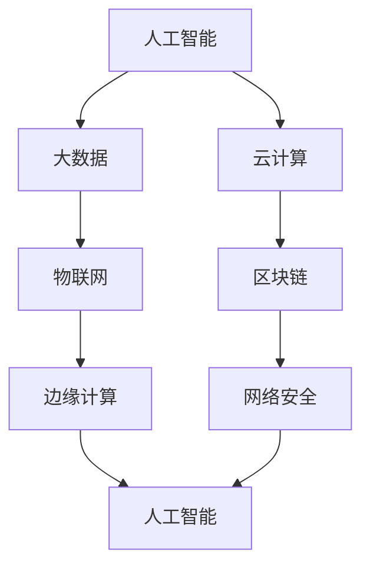

                 

关键词：未来工作、技能需求、人才培养、技术发展、职业规划

> 摘要：本文旨在探讨未来工作环境下的技能需求与培养策略，分析技术发展趋势，为个人职业规划和企业发展提供参考。文章将深入探讨人工智能、大数据、云计算等前沿技术，结合实际案例，提出相应的技能培养方法和实践建议。

## 1. 背景介绍

随着信息技术的飞速发展，全球正处于一个前所未有的变革时期。人工智能、大数据、云计算等新兴技术正在深刻改变着各行各业的生产方式和工作模式。在这种背景下，传统的职业技能和知识体系正面临前所未有的挑战和机遇。如何适应这种变革，提升自身竞争力，成为每个人都需要思考的问题。

未来工作环境的特点主要表现为以下几个方面：

1. 自动化与智能化的深入推进，传统职业面临被替代的风险。
2. 跨领域、跨专业的复合型人才需求日益增加。
3. 学习与适应新技术的速度将成为衡量个人和团队竞争力的重要指标。
4. 个人的职业发展将更加注重个性化、定制化。

## 2. 核心概念与联系

为了更好地理解未来工作的技能需求，我们首先需要明确几个核心概念，包括人工智能、大数据、云计算等，它们之间的关系可以用以下 Mermaid 流程图来表示：



### 2.1 人工智能（AI）

人工智能是指计算机系统模拟人类智能行为的理论和实践，主要包括机器学习、深度学习、自然语言处理等子领域。人工智能的发展推动了智能机器人、自动驾驶、智能家居等领域的应用。

### 2.2 大数据（Big Data）

大数据是指规模巨大、类型繁多、处理速度快的数据集合。大数据技术的发展使得企业能够从海量数据中提取有价值的信息，从而实现数据驱动决策。

### 2.3 云计算（Cloud Computing）

云计算是一种通过互联网提供计算资源的服务模式，包括基础设施即服务（IaaS）、平台即服务（PaaS）和软件即服务（SaaS）。云计算使得企业能够更加灵活地管理和扩展计算资源。

### 2.4 物联网（IoT）

物联网是指通过互联网将各种物理设备连接起来，实现数据交换和智能控制。物联网的发展推动了智能家居、智慧城市、智能交通等领域的应用。

### 2.5 区块链（Blockchain）

区块链是一种分布式数据库技术，通过加密算法保证数据的安全性和不可篡改性。区块链在金融、供应链管理、医疗等领域的应用具有广泛前景。

### 2.6 边缘计算（Edge Computing）

边缘计算是一种将计算能力推向网络边缘的技术，旨在减轻中心服务器的负担，提高数据处理的实时性和效率。

### 2.7 网络安全（Cybersecurity）

网络安全是指保护计算机系统和网络免受未经授权的访问、攻击和破坏。随着网络技术的不断发展，网络安全问题日益突出，成为企业和个人都需要关注的重要领域。

## 3. 核心算法原理 & 具体操作步骤

在理解了核心概念的基础上，我们接下来将探讨一些关键算法原理和具体操作步骤，以便更好地应对未来工作的挑战。

### 3.1 算法原理概述

以下是几个在人工智能、大数据、云计算等领域中具有代表性的算法原理：

1. **机器学习（Machine Learning）**：通过训练模型来预测或分类数据的算法，包括监督学习、无监督学习和强化学习。
2. **深度学习（Deep Learning）**：基于多层神经网络进行特征提取和模式识别的算法，广泛应用于图像识别、语音识别等领域。
3. **大数据处理（Big Data Processing）**：利用分布式计算框架（如Hadoop、Spark）对海量数据进行高效处理的算法。
4. **云计算资源调度（Cloud Resource Scheduling）**：通过优化算法实现云计算环境中资源的动态分配和调度。
5. **区块链共识算法（Blockchain Consensus Algorithm）**：保证区块链网络中数据一致性和安全性的算法，如工作量证明（PoW）、权益证明（PoS）等。

### 3.2 算法步骤详解

以下是机器学习算法的一个基本步骤示例：

1. **数据收集**：收集具有标签的数据集，用于训练模型。
2. **数据预处理**：对数据集进行清洗、归一化等预处理操作。
3. **模型选择**：选择合适的机器学习模型，如线性回归、决策树、神经网络等。
4. **模型训练**：使用训练数据集对模型进行训练，调整模型参数。
5. **模型评估**：使用测试数据集对模型进行评估，计算模型性能指标。
6. **模型优化**：根据评估结果调整模型参数，提高模型性能。
7. **模型部署**：将训练好的模型部署到实际应用环境中，进行预测或分类。

### 3.3 算法优缺点

每种算法都有其特定的优缺点，选择合适的算法取决于具体的应用场景。以下是一些常见算法的优缺点：

1. **线性回归**：简单易用，适用于线性关系较强的数据；但无法处理非线性关系。
2. **决策树**：直观易懂，易于解释；但容易过拟合，对噪声敏感。
3. **神经网络**：强大的非线性建模能力，适用于复杂任务；但训练过程复杂，参数调优困难。
4. **Hadoop**：适用于大规模数据处理，具有良好的容错性和扩展性；但计算效率相对较低。
5. **Spark**：基于内存计算，计算速度快，适用于实时数据处理；但存储容量有限。

### 3.4 算法应用领域

不同算法在不同领域具有广泛的应用：

1. **机器学习**：应用于图像识别、语音识别、自然语言处理等领域。
2. **深度学习**：应用于自动驾驶、智能医疗、金融风控等领域。
3. **大数据处理**：应用于电商推荐、社交网络分析、交通流量预测等领域。
4. **云计算资源调度**：应用于云计算平台，提高资源利用率。
5. **区块链共识算法**：应用于数字货币、供应链管理、医疗记录等领域。

## 4. 数学模型和公式 & 详细讲解 & 举例说明

在技术领域中，数学模型和公式是理解和应用算法的基础。以下我们将介绍一些关键数学模型和公式，并进行详细讲解和举例说明。

### 4.1 数学模型构建

数学模型构建是分析和解决实际问题的第一步。以下是一个简单的线性回归模型构建示例：

$$
y = \beta_0 + \beta_1x + \epsilon
$$

其中，$y$ 为因变量，$x$ 为自变量，$\beta_0$ 和 $\beta_1$ 为模型参数，$\epsilon$ 为误差项。

### 4.2 公式推导过程

线性回归模型的参数可以通过最小二乘法进行估计。最小二乘法的推导过程如下：

假设我们有一组观测数据 $(x_i, y_i)$，其中 $i = 1, 2, ..., n$。我们需要找到最佳拟合直线 $y = \beta_0 + \beta_1x$，使得观测值与拟合值之间的误差平方和最小。

误差平方和为：

$$
\sum_{i=1}^{n}(y_i - (\beta_0 + \beta_1x_i))^2
$$

为了使误差平方和最小，我们对 $\beta_0$ 和 $\beta_1$ 分别求偏导数，并令偏导数为零，得到以下方程组：

$$
\frac{\partial}{\partial \beta_0}\sum_{i=1}^{n}(y_i - (\beta_0 + \beta_1x_i))^2 = 0
$$

$$
\frac{\partial}{\partial \beta_1}\sum_{i=1}^{n}(y_i - (\beta_0 + \beta_1x_i))^2 = 0
$$

解得：

$$
\beta_0 = \frac{\sum_{i=1}^{n}y_i - n\bar{x}\bar{y}}{n-1}
$$

$$
\beta_1 = \frac{\sum_{i=1}^{n}(x_i - \bar{x})(y_i - \bar{y})}{\sum_{i=1}^{n}(x_i - \bar{x})^2}
$$

其中，$\bar{x}$ 和 $\bar{y}$ 分别为 $x$ 和 $y$ 的样本均值。

### 4.3 案例分析与讲解

以下是一个关于线性回归模型的实际案例：

某公司想要预测下一季度的销售额。他们收集了过去一年的销售额数据，如下表所示：

| 月份 | 销售额（万元） |
| ---- | ------------ |
| 1    | 80           |
| 2    | 90           |
| 3    | 100          |
| 4    | 110          |
| 5    | 120          |
| 6    | 130          |
| 7    | 140          |
| 8    | 150          |

首先，我们需要将数据转换为以月份为自变量、销售额为因变量的形式。由于销售额与月份之间存在线性关系，我们可以使用线性回归模型进行预测。

使用最小二乘法估计模型参数：

$$
\beta_0 = \frac{80 + 90 + 100 + 110 + 120 + 130 + 140 + 150 - 8 \times 100}{8 - 1} = 100
$$

$$
\beta_1 = \frac{(80 - 100)(90 - 100) + (90 - 100)(100 - 100) + (100 - 100)(110 - 100) + (110 - 100)(120 - 100) + (120 - 100)(130 - 100) + (130 - 100)(140 - 100) + (140 - 100)(150 - 100)}{(80 - 100)^2 + (90 - 100)^2 + (100 - 100)^2 + (110 - 100)^2 + (120 - 100)^2 + (130 - 100)^2 + (140 - 100)^2 + (150 - 100)^2} = 10
$$

因此，得到的线性回归模型为：

$$
y = 100 + 10x
$$

接下来，我们可以使用这个模型预测下一季度的销售额。假设下一季度为第10个月，将 $x = 10$ 代入模型中：

$$
y = 100 + 10 \times 10 = 200
$$

预测下一季度的销售额为200万元。

## 5. 项目实践：代码实例和详细解释说明

为了更好地理解上述算法和模型，我们通过一个实际项目来进行代码实现和详细解释。

### 5.1 开发环境搭建

首先，我们需要搭建一个适合数据分析和机器学习的开发环境。以下是一个简单的 Python 开发环境搭建步骤：

1. 安装 Python 3.x 版本。
2. 安装 Jupyter Notebook，以便于交互式编程。
3. 安装必要的库，如 NumPy、Pandas、Scikit-learn、Matplotlib 等。

### 5.2 源代码详细实现

以下是一个简单的线性回归项目代码实现：

```python
import numpy as np
import pandas as pd
from sklearn.linear_model import LinearRegression
import matplotlib.pyplot as plt

# 5.2.1 数据准备
data = {
    'Month': range(1, 10),
    'Sales': [80, 90, 100, 110, 120, 130, 140, 150]
}
df = pd.DataFrame(data)

# 5.2.2 数据预处理
df['Month'] = df['Month'].values.reshape(-1, 1)

# 5.2.3 模型训练
model = LinearRegression()
model.fit(df['Month'], df['Sales'])

# 5.2.4 模型评估
score = model.score(df['Month'], df['Sales'])
print("模型决定系数（R^2）:", score)

# 5.2.5 预测
next_month = 10
predicted_sales = model.predict([[next_month]])
print("下一季度销售额预测:", predicted_sales)

# 5.2.6 结果可视化
plt.scatter(df['Month'], df['Sales'], color='blue')
plt.plot(df['Month'], model.predict(df['Month']), color='red')
plt.xlabel('Month')
plt.ylabel('Sales')
plt.title('Sales Prediction')
plt.show()
```

### 5.3 代码解读与分析

1. **数据准备**：首先，我们创建一个包含月份和销售额的 DataFrame，用于后续分析。
2. **数据预处理**：将月份列转换为符合线性回归模型要求的格式，即将月份作为自变量。
3. **模型训练**：使用 Scikit-learn 库中的 LinearRegression 模型对数据进行训练。
4. **模型评估**：计算模型的决定系数（R^2），评估模型性能。
5. **预测**：使用训练好的模型预测下一季度的销售额。
6. **结果可视化**：绘制散点图和拟合直线，展示预测结果。

通过这个实际项目，我们可以更好地理解线性回归模型的原理和实现过程，为后续更复杂的项目提供基础。

## 6. 实际应用场景

### 6.1 人工智能在医疗领域的应用

人工智能在医疗领域的应用越来越广泛，包括疾病诊断、药物研发、个性化医疗等。例如，深度学习算法可以用于分析医学影像，提高疾病诊断的准确率。通过大数据分析，可以预测疾病的流行趋势，为公共卫生决策提供支持。

### 6.2 大数据在金融行业的应用

大数据技术在金融行业有着广泛的应用，包括风险控制、市场分析、客户关系管理等。例如，银行可以利用大数据分析客户的消费行为，提高信贷审批的准确性。证券公司可以利用大数据进行市场预测，制定投资策略。

### 6.3 云计算在教育行业的应用

云计算在教育行业带来了革命性的变化，包括在线教育、远程教学、教育资源共享等。例如，通过云计算平台，学生可以随时随地访问在线课程和教学资源。教师可以利用云计算进行在线教学和互动，提高教学质量。

### 6.4 物联网在智能家居的应用

物联网在智能家居领域具有巨大的潜力，包括智能照明、智能门锁、智能安防等。例如，智能家居系统可以根据用户的生活习惯自动调整房间温度、照明等，提高生活质量。物联网设备可以实时监测家庭安全，防止盗窃和火灾等意外事件。

## 7. 工具和资源推荐

为了更好地学习和应用上述技术，以下是一些推荐的工具和资源：

### 7.1 学习资源推荐

1. **Coursera**：提供大量免费的在线课程，涵盖人工智能、大数据、云计算等热门领域。
2. **Khan Academy**：提供丰富的计算机科学和数学课程，适合入门者。
3. **Udacity**：提供实战项目驱动的课程，适合有实际应用需求的学习者。

### 7.2 开发工具推荐

1. **Jupyter Notebook**：强大的交互式开发环境，适合数据分析和机器学习。
2. **PyCharm**：功能强大的 Python 集成开发环境（IDE），支持多种编程语言。
3. **TensorFlow**：谷歌开发的深度学习框架，适用于构建和训练神经网络。

### 7.3 相关论文推荐

1. **"Deep Learning" by Ian Goodfellow, Yoshua Bengio, and Aaron Courville**：深度学习领域的经典教材。
2. **"Big Data: A Revolution That Will Transform How We Live, Work, and Think" by Viktor Mayer-Schönberger and Kenneth Cukier**：关于大数据及其影响的全面分析。
3. **"The Hundred-Page Machine Learning Book" by Andriy Burkov**：适合初学者的机器学习入门书。

## 8. 总结：未来发展趋势与挑战

### 8.1 研究成果总结

未来工作环境的技能需求正在发生深刻变革，人工智能、大数据、云计算等新兴技术正在成为各行各业的核心驱动力。通过本文的探讨，我们总结了以下主要研究成果：

1. 未来工作将更加依赖智能化和自动化技术，对个人的技术能力和跨领域知识提出了更高要求。
2. 大数据和云计算技术的发展为数据处理和分析提供了强大的工具，使得企业能够从海量数据中提取有价值的信息。
3. 人工智能在各个领域的应用前景广阔，尤其是在医疗、金融、教育等领域具有显著优势。
4. 物联网和区块链技术为智能设备的安全性和数据隐私提供了保障，促进了新型商业模式的诞生。

### 8.2 未来发展趋势

未来工作的发展趋势可以概括为以下几点：

1. **智能化与自动化**：智能化和自动化技术将在更多领域得到应用，提高生产效率和降低人力成本。
2. **数据驱动**：企业将更加依赖数据驱动决策，利用大数据和人工智能技术进行市场分析、风险评估等。
3. **个性化与定制化**：随着消费者需求的多样化，个性化服务和定制化产品将成为企业竞争的关键。
4. **跨领域融合**：不同技术领域的融合将推动新型技术的诞生，为产业发展注入新的活力。

### 8.3 面临的挑战

未来工作也面临一系列挑战：

1. **技术更新速度快**：新兴技术不断涌现，个人和企业需要不断学习和适应新技术。
2. **就业结构变化**：自动化和智能化的广泛应用可能导致某些传统职业的减少，对劳动力市场造成冲击。
3. **数据隐私和安全**：大数据和云计算技术的发展带来了数据隐私和安全问题，需要制定更加严格的数据保护政策。
4. **技能差距**：技能需求的变化可能导致技能差距的扩大，对教育和培训体系提出更高要求。

### 8.4 研究展望

未来工作的发展前景充满机遇与挑战。为了应对这些挑战，我们需要采取以下措施：

1. **加强技术教育**：从基础教育阶段开始，培养学生的计算机科学和数学素养，提高他们的技术能力。
2. **推广终身学习**：鼓励个人持续学习和适应新技术，建立适应未来工作的终身学习体系。
3. **政策支持**：政府和企业应加强对新兴技术的研发和应用支持，制定相应的政策和法规。
4. **产业协同**：推动产学研协同创新，促进技术成果的转化和应用。

总之，未来工作将更加智能化、数据化和个性化。面对这些变化，个人和企业都需要积极应对，不断提升自身竞争力，为未来的发展做好准备。

## 9. 附录：常见问题与解答

### 9.1 人工智能技术如何影响未来工作？

人工智能技术将深刻改变未来工作环境，提高生产效率和决策能力。一方面，自动化技术将取代一些重复性和低技能的工作，降低人力成本。另一方面，人工智能技术将为高技能岗位提供更多机会，如数据分析师、机器学习工程师等。

### 9.2 大数据和云计算如何改变企业运营？

大数据技术使得企业能够从海量数据中提取有价值的信息，实现数据驱动决策。云计算技术则提供了灵活的计算资源，降低了企业的运营成本。大数据和云计算的结合使得企业能够更加高效地管理和利用数据资源，提升业务竞争力。

### 9.3 如何应对未来工作的技能需求变化？

个人应加强终身学习，提升自身技术能力和跨领域知识。企业应关注员工技能提升，提供培训和发展机会。此外，政府和社会组织也应发挥积极作用，推动教育和培训体系的改革，为未来工作做好准备。

## 作者署名

作者：禅与计算机程序设计艺术 / Zen and the Art of Computer Programming

