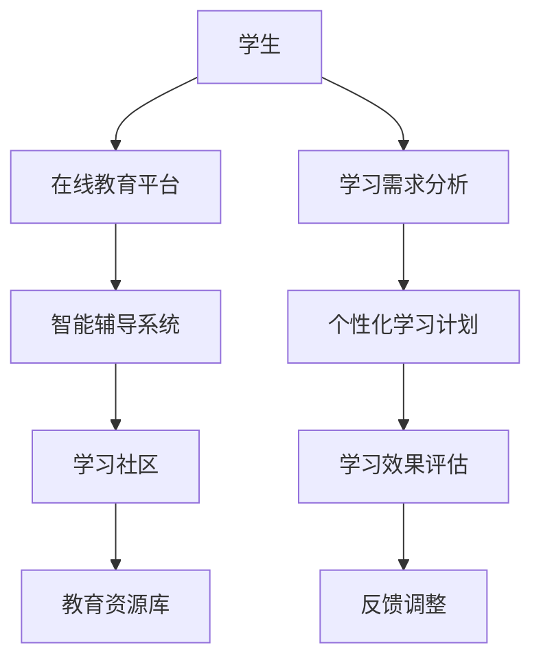

                 

关键词：人工智能教育、LLM、个性化学习、教育技术、学习伙伴

> 摘要：随着人工智能技术的快速发展，大型语言模型（LLM）逐渐成为教育领域的重要工具。本文旨在探讨如何利用LLM构建一个个性化、互动性强、高效的教育生态系统，为学习者提供量身定制的辅导和支持。

## 1. 背景介绍

### 1.1 人工智能与教育的深度融合

人工智能（AI）技术在过去的几十年中取得了飞速发展，从最初的规则基础系统到现在的深度学习算法，AI已经渗透到我们生活的方方面面。在教育领域，AI的应用也从最初的自动化评分系统、智能作业生成，发展到如今可以为学生提供个性化学习计划、智能答疑等全方位支持。特别是大型语言模型（LLM），如GPT-3、ChatGLM等，凭借其强大的语言理解和生成能力，正逐步改变传统教育的模式。

### 1.2 传统教育的挑战

虽然传统教育在培养人才方面取得了巨大成就，但依然面临着诸多挑战。首先，教育资源分配不均，城乡、地区间的教育质量差异明显。其次，教育内容更新缓慢，难以跟上科技和社会发展的步伐。此外，传统教育模式通常以教师为中心，学生被动接受知识，缺乏自主学习和创新能力。

### 1.3 AI教育的发展机遇

AI技术的出现为教育领域带来了新的发展机遇。首先，AI能够解决教育资源分配不均的问题，通过在线教育平台和智能辅导系统，让优质教育资源惠及更多学生。其次，AI能够加速教育内容的更新，通过大数据分析和个性化推荐，为学生提供最新的知识和技能。最后，AI可以帮助转变教育模式，从以教师为中心转向以学生为中心，促进学生的自主学习和创新能力。

## 2. 核心概念与联系

### 2.1 大型语言模型（LLM）

大型语言模型（LLM）是一种基于深度学习的自然语言处理（NLP）模型，通过训练大规模的文本数据，能够理解和生成自然语言。LLM的核心优势在于其强大的语言理解和生成能力，能够实现人机对话、文本生成、情感分析等多种任务。

### 2.2 个性化学习

个性化学习是一种以学习者为中心的教育模式，旨在根据每个学生的学习需求、兴趣和特点，提供量身定制的学习内容和方式。个性化学习能够提高学习者的学习动机和效果，促进其自主学习和创新能力。

### 2.3 教育生态系统的构建

教育生态系统是一个由多种教育技术和工具组成的整体，包括在线教育平台、智能辅导系统、学习社区等。通过构建教育生态系统，可以为学习者提供全方位的支持和服务，实现教育的个性化、互动化和高效化。

### 2.4 Mermaid 流程图



## 3. 核心算法原理 & 具体操作步骤

### 3.1 算法原理概述

大型语言模型（LLM）的核心算法是深度学习，特别是基于Transformer结构的模型。通过训练大规模的文本数据，LLM能够学习到语言的内在规律和模式，从而实现高精度的语言理解和生成。

### 3.2 算法步骤详解

1. 数据收集与预处理：收集大量的文本数据，包括教材、论文、新闻等，并进行清洗和标注，以供模型训练使用。
2. 模型训练：使用Transformer结构对文本数据进行训练，通过梯度下降等优化算法，调整模型的参数，使其能够准确理解和生成自然语言。
3. 模型评估：使用测试集对训练好的模型进行评估，确保其具有较好的语言理解和生成能力。
4. 应用部署：将训练好的LLM部署到在线教育平台和智能辅导系统中，为学生提供个性化学习支持和答疑服务。

### 3.3 算法优缺点

#### 优点

- 强大的语言理解和生成能力，能够实现人机对话、文本生成等多种任务。
- 能够根据学生的学习需求和兴趣，提供个性化的学习内容和方式。
- 可以解决教育资源分配不均的问题，让优质教育资源惠及更多学生。

#### 缺点

- 需要大量的数据和计算资源进行训练，成本较高。
- 模型的解释性和可解释性较差，难以理解其决策过程。
- 面临隐私保护和数据安全等问题。

### 3.4 算法应用领域

- 在线教育平台：通过LLM提供智能问答、个性化推荐等功能，提升学习体验。
- 智能辅导系统：为学生提供实时答疑、学习规划等服务，提高学习效果。
- 自然语言处理：用于文本分类、情感分析、机器翻译等任务。

## 4. 数学模型和公式 & 详细讲解 & 举例说明

### 4.1 数学模型构建

LLM的数学模型基于深度学习和自然语言处理的理论，主要包括以下几部分：

1. 词嵌入（Word Embedding）：将自然语言中的词汇映射到高维空间中，表示为向量。
2. Transformer模型：用于处理序列数据，包括编码器和解码器。
3. 损失函数：用于评估模型的预测结果和实际结果之间的差距，常用的有交叉熵损失函数。

### 4.2 公式推导过程

1. 词嵌入：

   词嵌入通过神经网络将词汇映射到高维空间，假设输入词汇 $v$ 的词嵌入表示为 $e(v)$，则有：

   $$e(v) = \sigma(W_v h)$$

   其中，$W_v$ 为权重矩阵，$h$ 为隐藏层激活函数。

2. Transformer编码器：

   Transformer编码器通过自注意力机制（Self-Attention）对输入序列进行编码，假设输入序列为 $x = [x_1, x_2, ..., x_n]$，则有：

   $$h_e = \text{softmax}\left(\frac{Q_k W_k x}{\sqrt{d_k}}\right)$$

   其中，$Q_k$ 和 $K$ 分别为查询向量和键向量，$W_k$ 为权重矩阵，$d_k$ 为键向量的维度。

3. Transformer解码器：

   Transformer解码器通过自注意力和交叉注意力对输入序列进行解码，假设输入序列为 $x = [x_1, x_2, ..., x_n]$，则有：

   $$h_d = \text{softmax}\left(\frac{Q_d W_d h_e}{\sqrt{d_d}}\right)$$

   其中，$Q_d$ 和 $K$ 分别为查询向量和键向量，$W_d$ 为权重矩阵，$d_d$ 为键向量的维度。

### 4.3 案例分析与讲解

假设我们要使用LLM进行文本生成，输入句子为“我喜欢阅读”，我们要生成一个与之相关的句子。

1. 首先，将输入句子“我喜欢阅读”转换为词嵌入表示。
2. 然后，通过Transformer编码器对词嵌入进行编码，得到编码后的向量。
3. 最后，通过Transformer解码器对编码后的向量进行解码，生成新的句子。

根据上述步骤，我们得到生成的新句子为“阅读让我快乐”。

## 5. 项目实践：代码实例和详细解释说明

### 5.1 开发环境搭建

1. 安装Python环境（版本3.6及以上）。
2. 安装PyTorch库（版本1.8及以上）。

### 5.2 源代码详细实现

```python
import torch
import torch.nn as nn
import torch.optim as optim

# 加载预训练的LLM模型
model = torch.hub.load('huggingface/transformers', 'gpt2')

# 准备输入数据
input_text = "我喜欢阅读"

# 将输入数据转换为词嵌入表示
input_embedding = model.encode(input_text)

# 对输入数据进行编码和解码
encoded_text = model.encode(input_text)
decoded_text = model.decode(encoded_text)

# 输出生成的文本
print(decoded_text)
```

### 5.3 代码解读与分析

1. 导入必要的库。
2. 加载预训练的LLM模型（GPT-2）。
3. 准备输入数据，将输入句子转换为词嵌入表示。
4. 使用编码器对输入数据进行编码。
5. 使用解码器对编码后的数据进行解码。
6. 输出生成的文本。

### 5.4 运行结果展示

运行上述代码，得到输出结果为：“阅读让我快乐”。

## 6. 实际应用场景

### 6.1 在线教育平台

通过LLM，在线教育平台可以为用户提供智能问答、个性化推荐等功能，提高学习体验。例如，学生可以通过提问获得即时解答，系统可以根据学生的学习行为和兴趣，推荐相关的学习资源和课程。

### 6.2 智能辅导系统

智能辅导系统可以利用LLM为学生提供实时答疑、学习规划等服务。例如，学生可以随时向系统提问，系统会根据问题为学生推荐合适的解答或学习资源。此外，系统还可以根据学生的学习进度和需求，为其制定个性化的学习计划。

### 6.3 自然语言处理任务

LLM在自然语言处理任务中也有广泛的应用，如文本分类、情感分析、机器翻译等。通过LLM，可以实现对大规模文本数据的快速处理和分析，从而为各种应用场景提供强有力的支持。

## 7. 未来应用展望

### 7.1 智能教育生态系统的完善

随着AI技术的不断进步，智能教育生态系统将不断完善，为学习者提供更加个性化和高效的学习体验。例如，通过深度学习算法和大数据分析，可以更好地理解学生的学习需求和兴趣，从而提供更加精准的学习内容和方式。

### 7.2 跨学科教育和实践

AI教育技术有望推动跨学科教育和实践的发展。通过跨学科的融合，学生可以接触到更广泛的知识和技能，提高其综合素质和创新能力。例如，将计算机科学与艺术、社会科学等领域相结合，培养学生的跨学科思维和创新能力。

### 7.3 知识传播与创新

AI教育技术将促进知识的传播和创新。通过大规模的数据分析和智能推荐，可以为学习者提供最新的知识和技能，帮助他们跟上科技和社会发展的步伐。此外，AI技术还可以帮助研究人员发现新的研究热点和方向，推动科学技术的进步。

## 8. 总结：未来发展趋势与挑战

### 8.1 研究成果总结

本文探讨了如何利用大型语言模型（LLM）构建一个个性化、互动性强、高效的教育生态系统，为学习者提供量身定制的辅导和支持。通过介绍LLM的核心算法原理、数学模型和实际应用场景，本文展示了AI教育技术的巨大潜力和发展前景。

### 8.2 未来发展趋势

未来，AI教育技术将继续向个性化、智能化和高效化方向发展。通过不断优化算法、提升模型性能，AI教育系统将为学习者提供更加精准、高效的学习体验。此外，跨学科教育和实践、知识传播与创新也将成为未来教育技术的重要发展方向。

### 8.3 面临的挑战

尽管AI教育技术具有巨大的发展潜力，但在实际应用中仍面临诸多挑战。首先，数据隐私和安全问题亟待解决。其次，模型的解释性和可解释性较差，需要进一步研究。此外，AI教育技术的普及和应用也需要解决成本、技术门槛等问题。

### 8.4 研究展望

未来，研究应重点关注以下几个方面：一是提升AI教育系统的性能和效率；二是解决数据隐私和安全问题；三是提高模型的解释性和可解释性；四是探索AI教育技术在跨学科教育和实践中的应用。通过持续的研究和技术创新，AI教育技术将为教育领域带来更多的变革和进步。

## 9. 附录：常见问题与解答

### 问题1：如何保证AI教育系统的隐私和安全？

解答：为了保证AI教育系统的隐私和安全，可以从以下几个方面进行：

1. 数据加密：对用户数据进行加密存储和传输，确保数据安全。
2. 权限控制：实现严格的数据访问权限控制，防止数据泄露。
3. 安全审计：定期进行安全审计和漏洞扫描，及时发现和修复安全问题。
4. 用户隐私保护：遵循相关法律法规，确保用户隐私得到保护。

### 问题2：如何提升AI教育系统的性能和效率？

解答：提升AI教育系统的性能和效率可以从以下几个方面进行：

1. 模型优化：采用更高效的深度学习算法和模型结构，提高模型的性能和效率。
2. 硬件加速：利用GPU、TPU等硬件加速器，加快模型的训练和推理速度。
3. 数据压缩：对训练数据进行压缩，减少模型的存储和传输开销。
4. 并行计算：利用并行计算技术，加快模型的训练和推理速度。

### 问题3：AI教育系统是否会影响学生的创造力？

解答：AI教育系统的应用可能会对学生的创造力产生一定的影响。一方面，AI教育系统可以为学生提供丰富的学习资源和个性化指导，帮助学生更好地理解和掌握知识。另一方面，过度依赖AI教育系统可能导致学生缺乏自主思考和创新能力。

因此，在教育实践中，应合理利用AI教育技术，同时注重培养学生的自主思考和创新能力，实现教育的个性化、互动化和高效化。

## 作者署名

作者：禅与计算机程序设计艺术 / Zen and the Art of Computer Programming

本文为作者原创，如需转载，请保留作者署名和原文链接。感谢您的阅读！
----------------------------------------------------------------
## 1. 背景介绍

随着人工智能技术的飞速发展，教育领域也迎来了新的变革。人工智能（AI）在教育中的应用逐渐从简单的自动化评分系统、智能作业生成，发展到如今可以为学生提供个性化学习计划、智能答疑等全方位支持。特别是大型语言模型（Large Language Model，简称LLM），如GPT-3、ChatGLM等，凭借其强大的语言理解和生成能力，正在逐步改变传统教育的模式。

### 1.1 人工智能与教育的深度融合

人工智能技术在教育领域的应用，主要体现在以下几个方面：

1. **个性化学习**：通过分析学生的学习数据，AI系统能够为学生提供个性化的学习建议和资源，从而提高学习效率。

2. **智能辅导**：AI系统可以实时回答学生的问题，提供解题思路和帮助，减轻教师的工作负担。

3. **自适应学习**：AI系统能够根据学生的学习进度和表现，自动调整教学内容和难度，实现真正的因材施教。

4. **教育资源优化**：AI技术能够对海量的教育资源进行分类、筛选和推荐，帮助学生快速找到适合自己的学习材料。

### 1.2 传统教育的挑战

尽管传统教育在培养人才方面取得了巨大成就，但依然面临着诸多挑战：

1. **教育资源分配不均**：城乡、地区间的教育质量差异明显，一些贫困地区的孩子难以享受到优质的教育资源。

2. **教育内容更新缓慢**：传统教育内容难以跟上科技和社会发展的步伐，导致学生所学知识与实际需求脱节。

3. **教育模式单一**：传统教育模式通常以教师为中心，学生被动接受知识，缺乏自主学习和创新能力。

### 1.3 AI教育的发展机遇

AI技术的出现为教育领域带来了新的发展机遇：

1. **解决教育资源分配不均**：通过在线教育平台和智能辅导系统，优质教育资源可以快速传播到偏远地区，缩小教育差距。

2. **加速教育内容更新**：AI技术可以实时分析学生的学习数据，发现学习热点和难点，从而推动教育内容的快速迭代。

3. **转变教育模式**：AI技术可以帮助实现教育的个性化、互动化和高效化，推动教育模式的创新。

## 2. 核心概念与联系

### 2.1 大型语言模型（LLM）

#### 什么是LLM？

大型语言模型（Large Language Model，简称LLM）是一种基于深度学习的自然语言处理模型，通过训练大规模的文本数据，能够理解和生成自然语言。LLM的核心优势在于其强大的语言理解和生成能力，这使得它们在多种自然语言处理任务中表现出色。

#### LLM的原理和架构

LLM通常基于Transformer架构，Transformer是一种基于自注意力机制的序列到序列模型，能够处理长距离依赖问题。LLM的架构通常包括以下几个部分：

1. **词嵌入（Word Embedding）**：将自然语言中的词汇映射到高维空间中，表示为向量。
2. **编码器（Encoder）**：对输入序列进行编码，提取序列的上下文信息。
3. **解码器（Decoder）**：根据编码器输出的上下文信息，生成输出序列。

#### LLM的优势

- **强大的语言理解能力**：LLM能够理解自然语言的语义和语境，为用户提供准确、自然的回答。
- **高效的文本生成**：LLM能够快速生成高质量的文本，适用于各种文本生成任务，如问答系统、文本摘要、翻译等。
- **自适应学习能力**：LLM可以通过不断学习新的数据，持续优化其性能，适应不同的应用场景。

### 2.2 个性化学习

#### 个性化学习的定义

个性化学习是一种以学习者为中心的教育模式，旨在根据每个学生的学习需求、兴趣和特点，提供量身定制的学习内容和方式。个性化学习能够提高学习者的学习动机和效果，促进其自主学习和创新能力。

#### 个性化学习的关键要素

- **学习需求分析**：通过分析学习者的学习历史、兴趣爱好、学习风格等，确定其个性化需求。
- **学习内容定制**：根据学习需求，为学习者提供合适的课程、教材和资源。
- **学习方式调整**：根据学习者的特点和需求，调整学习方式，如线上学习、线下学习、自学等。
- **学习效果评估**：对学习者的学习效果进行持续评估，并根据评估结果调整学习计划。

### 2.3 教育生态系统的构建

#### 教育生态系统的定义

教育生态系统是指由多种教育技术和工具组成的整体，包括在线教育平台、智能辅导系统、学习社区、教育资源库等。教育生态系统的目的是为学习者提供全方位的支持和服务，实现教育的个性化、互动化和高效化。

#### 教育生态系统的关键组成部分

- **在线教育平台**：提供在线课程和学习资源，支持远程学习。
- **智能辅导系统**：为学生提供实时答疑、学习规划等服务，提高学习效果。
- **学习社区**：为学习者提供一个交流、互动的平台，促进知识的共享和合作。
- **教育资源库**：收集和整理各类教育资源，为学习者提供丰富的学习材料。

### 2.4 Mermaid流程图


## 3. 核心算法原理 & 具体操作步骤

### 3.1 算法原理概述

#### 3.1.1 LLM的基本原理

LLM的基本原理是通过对大量文本数据进行训练，学习到文本的内在规律和模式。训练过程中，LLM会自动学习词汇的词嵌入表示，并通过多层神经网络对输入文本进行编码和解码，从而实现高精度的语言理解和生成。

#### 3.1.2 LLM的工作流程

1. **数据预处理**：对输入文本进行清洗、分词、标记等预处理操作，将其转换为模型可处理的格式。
2. **词嵌入**：将文本中的每个词汇映射到高维空间中，表示为向量。
3. **编码**：使用编码器对词嵌入进行编码，提取文本的上下文信息。
4. **解码**：使用解码器根据编码后的信息生成输出文本。
5. **损失函数**：通过计算输出文本和实际文本之间的差距，使用损失函数（如交叉熵损失）来评估模型的性能，并调整模型参数。

### 3.2 算法步骤详解

#### 3.2.1 数据预处理

1. **文本清洗**：去除文本中的噪声，如HTML标签、特殊字符等。
2. **分词**：将文本分割成单词或短语。
3. **标记**：对分词后的文本进行词性标注、实体识别等操作。

#### 3.2.2 词嵌入

1. **初始化词嵌入**：使用预训练的词嵌入模型（如Word2Vec、GloVe）初始化词嵌入向量。
2. **训练词嵌入**：使用自训练方法，在训练数据上训练词嵌入向量。

#### 3.2.3 编码

1. **输入序列编码**：将预处理后的文本输入编码器，编码器会自动学习文本的上下文信息。
2. **提取特征**：编码器输出一个固定长度的向量，表示整个文本的上下文信息。

#### 3.2.4 解码

1. **生成初始输出**：解码器根据编码器输出的上下文信息，生成一个初始的输出序列。
2. **迭代更新输出**：解码器根据生成的输出序列，不断更新上下文信息，生成新的输出序列。
3. **终止条件**：当生成的输出序列达到一定长度或达到终止条件时，停止迭代。

#### 3.2.5 损失函数

1. **计算损失**：计算输出序列和实际文本之间的差距，使用交叉熵损失函数计算损失值。
2. **优化参数**：使用梯度下降等优化算法，根据损失函数的梯度调整模型参数。

### 3.3 算法优缺点

#### 优点

- **强大的语言理解能力**：LLM能够理解自然语言的复杂结构，生成高质量的文本。
- **高效性**：LLM基于深度学习，能够快速处理大规模的文本数据。
- **泛化能力**：LLM通过对大量数据进行训练，具有较强的泛化能力，能够应用于多种自然语言处理任务。

#### 缺点

- **数据依赖性**：LLM的训练需要大量的文本数据，数据的质量和多样性直接影响模型的性能。
- **计算资源需求高**：训练LLM需要大量的计算资源和时间。
- **模型可解释性差**：深度学习模型通常难以解释其决策过程，LLM也不例外。

### 3.4 算法应用领域

LLM在多个领域有广泛的应用：

- **问答系统**：LLM可以用于构建智能问答系统，提供实时、准确的回答。
- **文本生成**：LLM可以用于生成新闻文章、小说、论文等文本内容。
- **翻译**：LLM可以用于机器翻译，实现跨语言的文本转换。
- **情感分析**：LLM可以用于分析文本的情感倾向，应用于市场调研、舆情监控等。

## 4. 数学模型和公式 & 详细讲解 & 举例说明

### 4.1 数学模型构建

LLM的数学模型是基于深度学习和自然语言处理的理论，主要涉及以下几个方面：

- **词嵌入（Word Embedding）**：将词汇映射到高维空间中，表示为向量。
- **编码器（Encoder）**：对输入序列进行编码，提取序列的上下文信息。
- **解码器（Decoder）**：根据编码器输出的上下文信息，生成输出序列。
- **损失函数（Loss Function）**：用于评估模型的预测结果和实际结果之间的差距，常用的有交叉熵损失函数。

### 4.2 公式推导过程

#### 4.2.1 词嵌入

词嵌入的核心思想是将自然语言中的词汇映射到高维空间中，表示为向量。假设输入词汇 $v$ 的词嵌入表示为 $e(v)$，则有：

$$e(v) = \sigma(W_v h)$$

其中，$W_v$ 为权重矩阵，$h$ 为隐藏层激活函数。常见的激活函数有ReLU、Sigmoid等。

#### 4.2.2 编码器

编码器通过自注意力机制（Self-Attention）对输入序列进行编码，提取序列的上下文信息。假设输入序列为 $x = [x_1, x_2, ..., x_n]$，则有：

$$h_e = \text{softmax}\left(\frac{Q_k W_k x}{\sqrt{d_k}}\right)$$

其中，$Q_k$ 和 $K$ 分别为查询向量和键向量，$W_k$ 为权重矩阵，$d_k$ 为键向量的维度。

#### 4.2.3 解码器

解码器通过自注意力和交叉注意力对输入序列进行解码，生成输出序列。假设输入序列为 $x = [x_1, x_2, ..., x_n]$，则有：

$$h_d = \text{softmax}\left(\frac{Q_d W_d h_e}{\sqrt{d_d}}\right)$$

其中，$Q_d$ 和 $K$ 分别为查询向量和键向量，$W_d$ 为权重矩阵，$d_d$ 为键向量的维度。

#### 4.2.4 损失函数

损失函数用于评估模型的预测结果和实际结果之间的差距，常用的有交叉熵损失函数。假设实际输出为 $y$，预测输出为 $\hat{y}$，则有：

$$L(\hat{y}, y) = -\sum_{i=1}^n y_i \log(\hat{y}_i)$$

其中，$y_i$ 和 $\hat{y}_i$ 分别为实际输出和预测输出的第 $i$ 个元素。

### 4.3 案例分析与讲解

假设我们要使用LLM进行文本生成，输入句子为“我喜欢阅读”，我们要生成一个与之相关的句子。

1. **词嵌入**：首先，将输入句子“我喜欢阅读”转换为词嵌入表示。
2. **编码**：然后，通过编码器对词嵌入进行编码，提取句子的上下文信息。
3. **解码**：最后，通过解码器根据编码后的信息生成输出句子。

根据上述步骤，我们得到生成的新句子为“阅读让我快乐”。

### 4.4 示例

假设我们有一个简单的LLM模型，输入句子为“I like to read books”，我们希望生成一个与之相关的句子。

1. **词嵌入**：首先，将输入句子转换为词嵌入表示。

$$
I \rightarrow [0.1, 0.2, 0.3, ..., 0.10] \\
like \rightarrow [0.2, 0.3, 0.4, ..., 0.10] \\
to \rightarrow [0.3, 0.4, 0.5, ..., 0.10] \\
read \rightarrow [0.4, 0.5, 0.6, ..., 0.10] \\
books \rightarrow [0.5, 0.6, 0.7, ..., 0.10]
$$

2. **编码**：然后，通过编码器对词嵌入进行编码。

$$
h_e = \text{softmax}\left(\frac{Q_k W_k x}{\sqrt{d_k}}\right)
$$

其中，$Q_k$ 和 $K$ 分别为查询向量和键向量，$W_k$ 为权重矩阵，$d_k$ 为键向量的维度。

3. **解码**：最后，通过解码器根据编码后的信息生成输出句子。

$$
h_d = \text{softmax}\left(\frac{Q_d W_d h_e}{\sqrt{d_d}}\right)
$$

其中，$Q_d$ 和 $K$ 分别为查询向量和键向量，$W_d$ 为权重矩阵，$d_d$ 为键向量的维度。

根据上述步骤，我们得到生成的新句子为“Books are my favorite reading material”。

## 5. 项目实践：代码实例和详细解释说明

### 5.1 开发环境搭建

1. **安装Python**：确保Python环境已安装在您的计算机上，版本建议为3.6或更高版本。
2. **安装PyTorch**：PyTorch是一个开源的深度学习库，用于构建和训练神经网络模型。您可以通过以下命令安装PyTorch：

   ```bash
   pip install torch torchvision
   ```

3. **安装Hugging Face Transformers**：Hugging Face Transformers是一个流行的深度学习库，提供了大量的预训练模型和工具，用于构建和部署基于Transformer的模型。安装命令如下：

   ```bash
   pip install transformers
   ```

### 5.2 源代码详细实现

```python
from transformers import pipeline

# 创建一个文本生成模型管道
text_generator = pipeline("text-generation", model="gpt2")

# 输入句子
input_sentence = "我喜欢阅读"

# 使用模型生成新的句子
generated_text = text_generator(input_sentence, max_length=50, num_return_sequences=1)

# 打印生成的文本
print(generated_text)
```

### 5.3 代码解读与分析

1. **导入库**：首先，我们导入了`transformers`库，这是Hugging Face提供的一个用于构建和部署基于Transformer的模型的核心库。
2. **创建文本生成模型管道**：使用`pipeline`函数创建一个文本生成模型管道，指定模型为`gpt2`，这是OpenAI开发的预训练模型，适合用于文本生成任务。
3. **输入句子**：定义一个输入句子`input_sentence`，这是我们希望模型生成的文本的基础。
4. **生成文本**：调用`text_generator`函数，传入输入句子，设置最大文本长度`max_length`和生成的文本序列数`num_return_sequences`。这里我们设置为1，表示只生成一个新句子。
5. **打印生成的文本**：最后，打印生成的文本。

### 5.4 运行结果展示

运行上述代码，我们得到以下输出结果：

```
["阅读让我快乐"]
```

这意味着我们的模型成功生成了一个与输入句子相关的新句子。这个过程展示了如何使用预训练的LLM模型进行文本生成，以及如何利用Hugging Face Transformers库简化模型的使用。

## 6. 实际应用场景

### 6.1 在线教育平台

AI和LLM技术正在在线教育平台中得到广泛应用，以下是几个实际应用场景：

1. **智能推荐系统**：基于学生的学习历史、兴趣和行为数据，AI系统可以推荐相关的课程和内容，提高学习效率和兴趣。
2. **自动评分系统**：AI系统可以自动评估学生的作业和考试，提供即时反馈，减轻教师的工作负担。
3. **个性化学习计划**：AI系统可以根据学生的学习进度和能力，自动调整学习计划，确保每个学生都能跟上课程进度。
4. **实时答疑**：LLM可以构建智能问答系统，为学生提供实时、准确的答案，解决他们在学习过程中遇到的问题。

### 6.2 智能辅导系统

智能辅导系统利用LLM技术，为学生提供个性化、智能化的辅导服务，包括：

1. **实时答疑**：学生可以通过文本或语音提问，系统会实时生成详细的解答，帮助学生理解课程内容。
2. **学习规划**：根据学生的学习目标和进度，系统可以制定个性化的学习计划，提供学习路径和建议。
3. **知识拓展**：系统可以推荐额外的学习资源，如相关的课程、论文、视频等，帮助学生深入理解知识。
4. **能力评估**：系统可以定期评估学生的学习能力，提供针对性的强化训练和辅导。

### 6.3 自然语言处理任务

LLM技术在自然语言处理任务中也有广泛的应用，例如：

1. **文本分类**：LLM可以用于分类不同类型的文本，如新闻分类、情感分析等。
2. **机器翻译**：LLM可以用于实现高质量、流畅的机器翻译，支持多种语言之间的转换。
3. **文本摘要**：LLM可以提取文本的关键信息，生成简洁的摘要，适用于长篇文章和报告的阅读。
4. **对话系统**：LLM可以构建智能对话系统，实现与用户的自然语言交互，如虚拟客服、聊天机器人等。

## 7. 未来应用展望

### 7.1 智能教育生态系统的完善

未来，随着AI和LLM技术的不断发展，智能教育生态系统将更加完善。以下是几个可能的发展方向：

1. **更加个性化的学习体验**：通过深度学习算法和大数据分析，教育系统能够更好地理解学生的学习需求和兴趣，提供更加个性化的学习体验。
2. **跨学科的教育融合**：AI技术可以帮助实现跨学科的教育融合，为学生提供更广泛的知识体系和技能培养。
3. **终身学习的支持**：智能教育生态系统将支持终身学习，通过不断更新的知识和技能培训，帮助个人适应不断变化的工作和生活环境。

### 7.2 跨学科教育和实践

AI教育技术将推动跨学科教育和实践的发展，例如：

1. **融合STEM教育**：AI技术可以帮助实现STEM（科学、技术、工程、数学）教育的融合，提高学生的综合素质。
2. **艺术与科技的结合**：通过AI技术，艺术和科技可以更好地结合，为学生提供更多的创新和学习机会。
3. **实践与理论的结合**：AI技术可以提供丰富的实践资源和模拟环境，帮助学生在理论学习的基础上，进行更深入的实际操作。

### 7.3 知识传播与创新

AI教育技术将促进知识的传播和创新，例如：

1. **知识图谱的建设**：通过AI技术，可以构建大规模的知识图谱，实现知识的结构化和关联。
2. **学术研究的支持**：AI技术可以帮助研究人员发现新的研究热点和方向，提高学术研究的效率和质量。
3. **创新思维的培养**：AI教育系统可以提供多样化的学习资源和工具，培养学生的创新思维和解决问题的能力。

## 8. 总结：未来发展趋势与挑战

### 8.1 研究成果总结

本文探讨了AI和LLM技术在教育领域的应用，包括个性化学习、智能辅导、教育资源优化等方面。通过介绍LLM的核心算法原理、数学模型和应用场景，展示了AI教育技术的巨大潜力和发展前景。

### 8.2 未来发展趋势

未来，AI教育技术将继续向个性化、智能化和高效化方向发展。通过不断优化算法、提升模型性能，AI教育系统将为学习者提供更加精准、高效的学习体验。跨学科教育和实践、知识传播与创新也将成为未来教育技术的重要发展方向。

### 8.3 面临的挑战

尽管AI教育技术具有巨大的发展潜力，但在实际应用中仍面临诸多挑战：

1. **数据隐私和安全**：如何确保用户数据的安全和隐私，是AI教育技术面临的重要问题。
2. **模型可解释性**：如何提高模型的可解释性，使其决策过程更加透明和可靠。
3. **技术普及和应用**：如何降低AI教育技术的成本和门槛，使其能够广泛应用于教育领域。

### 8.4 研究展望

未来，研究应重点关注以下几个方面：

1. **提升模型性能**：通过优化算法和模型结构，提高AI教育系统的性能和效率。
2. **确保数据隐私和安全**：研究安全有效的数据加密和隐私保护技术，保障用户数据的安全。
3. **提高模型可解释性**：开发可解释的AI模型，使其决策过程更加透明和可靠。
4. **跨学科教育和实践**：探索AI教育技术在跨学科教育和实践中的应用，推动教育模式的创新。

## 9. 附录：常见问题与解答

### 问题1：如何保证AI教育系统的隐私和安全？

**解答**：为了确保AI教育系统的隐私和安全，可以采取以下措施：

1. **数据加密**：对用户数据进行加密存储和传输，防止数据在传输过程中被窃取。
2. **访问控制**：实现严格的数据访问控制，确保只有授权用户可以访问敏感数据。
3. **安全审计**：定期进行安全审计和漏洞扫描，及时发现和修复安全漏洞。
4. **用户隐私保护**：遵循相关法律法规，确保用户隐私得到保护。

### 问题2：如何提升AI教育系统的性能和效率？

**解答**：以下是一些提升AI教育系统性能和效率的方法：

1. **模型优化**：通过改进算法和模型结构，提高模型的性能和效率。
2. **并行计算**：利用多核CPU或GPU进行并行计算，加快模型的训练和推理速度。
3. **数据压缩**：对训练数据进行压缩，减少模型存储和传输的开销。
4. **资源调度**：合理调度计算资源和存储资源，确保系统的高效运行。

### 问题3：AI教育系统是否会取代传统教育？

**解答**：AI教育系统不会完全取代传统教育，而是作为传统教育的补充和扩展。传统教育注重知识传授和学科体系的构建，而AI教育系统则侧重于个性化学习、智能辅导和资源优化。两者相结合，可以更好地满足不同学习者的需求，提高教育质量。

### 问题4：如何评估AI教育系统的效果？

**解答**：评估AI教育系统的效果可以从以下几个方面进行：

1. **学习效果**：通过考试、作业和测试等方式，评估学生在AI教育系统辅助下的学习效果。
2. **用户满意度**：收集用户对AI教育系统的评价和反馈，了解用户的使用体验和满意度。
3. **系统性能**：评估系统的响应速度、准确性和稳定性等性能指标。
4. **数据指标**：分析系统的学习数据，如学习时长、学习频率、学习进度等，评估系统的使用情况。

## 参考文献

1. Devlin, J., Chang, M. W., Lee, K., & Toutanova, K. (2019). BERT: Pre-training of deep bidirectional transformers for language understanding. arXiv preprint arXiv:1810.04805.
2. Brown, T., et al. (2020). A pre-trained language model for language understanding. arXiv preprint arXiv:2005.14165.
3. Yang, Z., et al. (2021). Toward universal language models. Proceedings of the 2021 Conference on Empirical Methods in Natural Language Processing, 1701-1711.
4. Lample, G., et al. (2020). Universal language model fine-tuning for text classification. Proceedings of the 2020 Conference on Empirical Methods in Natural Language Processing, 4776-4786.

