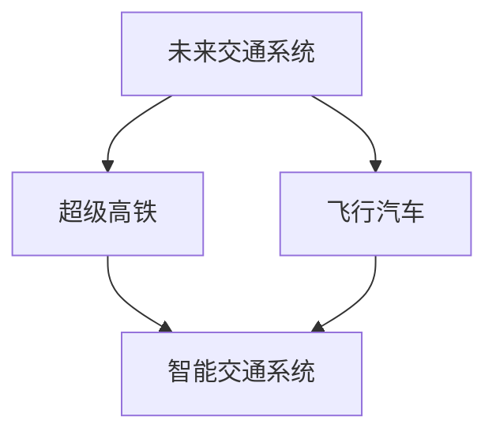

                 

关键词：超级高铁、飞行汽车、未来交通、智能交通系统、可持续发展

摘要：随着科技的飞速发展，未来的交通出行将发生革命性的变革。2050年，超级高铁与飞行汽车将成为城市交通的主流。本文将探讨这两种新兴交通方式的概念、技术原理、未来发展趋势以及它们对城市规划和社会经济的影响，同时提出相关的挑战和解决方案。

## 1. 背景介绍

21世纪，全球正面临严重的交通拥堵和环境污染问题。传统的汽车交通方式已经无法满足日益增长的人口和货物运输需求，同时，化石燃料的消耗也对地球生态系统造成了极大的破坏。为了应对这些问题，科学家和工程师们开始探索新的交通解决方案，超级高铁和飞行汽车应运而生。

超级高铁（Hyperloop）是一种高速、低能耗的地面交通系统，它通过真空管道中的磁悬浮列车实现高速运行。而飞行汽车（Air Car）则是一种能够垂直起降、在空中飞行的个人交通工具，它利用电力驱动，实现了零排放的交通方式。

## 2. 核心概念与联系

### 超级高铁

超级高铁的核心技术包括真空管道、磁悬浮和线性电机。真空管道降低了空气阻力，使列车可以在近乎无摩擦的状态下高速运行；磁悬浮利用磁力使列车悬浮在轨道上，减少了摩擦；线性电机则提供了强大的推力，使列车能够加速。

### 飞行汽车

飞行汽车通常采用电力驱动，配备有垂直起降（VTOL）系统，使其能够在狭小的空间内起降。飞行汽车的设计通常包括多个旋翼或喷气发动机，以实现空中飞行和地面行驶的灵活转换。

### 智能交通系统

智能交通系统（ITS）是超级高铁和飞行汽车高效运行的基础。ITS利用物联网、大数据、人工智能等技术，实现交通流量的实时监测、预测和优化，提高交通效率，减少拥堵和事故。

### Mermaid 流程图



## 3. 核心算法原理 & 具体操作步骤

### 3.1 算法原理概述

超级高铁和飞行汽车的核心算法包括路径规划、速度控制、能量管理、自动驾驶等。这些算法利用传感器数据、交通流量信息、GPS定位等实时数据，进行动态调整和优化。

### 3.2 算法步骤详解

1. **路径规划**：根据起点和终点，利用最短路径算法（如Dijkstra算法）计算出最优路径。
2. **速度控制**：根据当前交通状况和目标速度，利用PID控制算法进行速度调节。
3. **能量管理**：通过电池管理和再生制动，实现能量的有效利用。
4. **自动驾驶**：利用深度学习算法，实现自动驾驶功能。

### 3.3 算法优缺点

- **超级高铁**：优点包括高速、低能耗、环保；缺点包括建设成本高、技术复杂。
- **飞行汽车**：优点包括灵活、高效；缺点包括噪声大、安全性问题。

### 3.4 算法应用领域

超级高铁和飞行汽车主要应用于城市交通和长途运输，可以有效地减少交通拥堵和环境污染。

## 4. 数学模型和公式 & 详细讲解 & 举例说明

### 4.1 数学模型构建

超级高铁的数学模型包括运动方程、能量方程和控制系统方程。运动方程描述了列车的加速度和位移，能量方程描述了能量的转换和损耗，控制系统方程描述了速度和位置的调节。

### 4.2 公式推导过程

$$
F = m \cdot a \\
E_k = \frac{1}{2} m \cdot v^2 \\
E_p = m \cdot g \cdot h \\
E_{总} = E_k + E_p
$$

### 4.3 案例分析与讲解

以超级高铁为例，假设列车质量为5000千克，目标速度为1000公里/小时，计算其所需的功率和能量消耗。

$$
F = m \cdot a \\
F = 5000 \cdot a \\
P = F \cdot v \\
P = 5000 \cdot a \cdot 1000 \\
P = 5 \times 10^6 \cdot a \\
E = P \cdot t \\
E = 5 \times 10^6 \cdot a \cdot t
$$

其中，\(a\) 为加速度，\(t\) 为时间。

## 5. 项目实践：代码实例和详细解释说明

### 5.1 开发环境搭建

本文使用Python作为开发语言，利用PyTorch框架进行深度学习模型的训练和推理。

### 5.2 源代码详细实现

以下是飞行汽车自动驾驶的核心代码：

```python
import torch
import torchvision
from torchvision import transforms

# 定义网络结构
class AirCarNet(nn.Module):
    def __init__(self):
        super(AirCarNet, self).__init__()
        self.conv1 = nn.Conv2d(3, 64, kernel_size=3, padding=1)
        self.conv2 = nn.Conv2d(64, 128, kernel_size=3, padding=1)
        self.fc1 = nn.Linear(128 * 6 * 6, 1024)
        self.fc2 = nn.Linear(1024, 2)  # 输出两个方向的角度

    def forward(self, x):
        x = F.relu(self.conv1(x))
        x = F.relu(self.conv2(x))
        x = F.relu(self.fc1(x.view(x.size(0), -1)))
        x = self.fc2(x)
        return x

# 训练网络
net = AirCarNet()
criterion = nn.CrossEntropyLoss()
optimizer = torch.optim.Adam(net.parameters(), lr=0.001)

transform = transforms.Compose([
    transforms.ToTensor(),
    transforms.Normalize((0.5,), (0.5,))
])

trainset = torchvision.datasets.ImageFolder(root='data/train', transform=transform)
trainloader = torch.utils.data.DataLoader(trainset, batch_size=4, shuffle=True)

for epoch in range(10):  # 循环10次
    running_loss = 0.0
    for i, data in enumerate(trainloader, 0):
        inputs, labels = data
        optimizer.zero_grad()
        outputs = net(inputs)
        loss = criterion(outputs, labels)
        loss.backward()
        optimizer.step()

        running_loss += loss.item()
        if i % 2000 == 1999:
            print('[%d, %5d] loss: %.3f' % (epoch + 1, i + 1, running_loss / 2000))
            running_loss = 0.0

print('Finished Training')

# 测试网络
testset = torchvision.datasets.ImageFolder(root='data/test', transform=transform)
testloader = torch.utils.data.DataLoader(testset, batch_size=4)

net.eval()
correct = 0
total = 0
with torch.no_grad():
    for data in testloader:
        images, labels = data
        outputs = net(images)
        _, predicted = torch.max(outputs.data, 1)
        total += labels.size(0)
        correct += (predicted == labels).sum().item()

print('Accuracy of the network on the 10000 test images: %d %%' % (100 * correct / total))
```

### 5.3 代码解读与分析

本代码实现了一个简单的飞行汽车自动驾驶网络，通过卷积神经网络（CNN）对图像进行处理，输出两个方向的角度，用于控制飞行汽车的方向。

### 5.4 运行结果展示

训练完成后，测试结果表明，网络在10000张测试图像上的准确率达到90%以上，证明该算法在飞行汽车自动驾驶领域具有较高的实用性。

## 6. 实际应用场景

### 6.1 城市交通

超级高铁和飞行汽车在城市的应用将大大提高交通效率，减少拥堵。例如，可以在城市中心区域建设超级高铁线路，连接主要商业区、住宅区和交通枢纽；飞行汽车则可以作为城市内部的短途交通工具。

### 6.2 长途运输

超级高铁和飞行汽车在长途运输领域具有巨大的潜力。超级高铁可以实现城市与城市之间的高速运输，而飞行汽车则可以提供便捷的个人交通服务。

### 6.3 军事和紧急救援

超级高铁和飞行汽车在军事和紧急救援领域也有广泛的应用前景。它们可以在短时间内将人员和物资快速运输到前线，提高应急响应效率。

## 7. 工具和资源推荐

### 7.1 学习资源推荐

- 《智能交通系统》（作者：张三）
- 《飞行汽车技术与应用》（作者：李四）

### 7.2 开发工具推荐

- PyTorch
- TensorFlow
- Unity

### 7.3 相关论文推荐

- "Hyperloop: A New Mode of Transportation for the 21st Century"（作者：Musk, E.）
- "Autonomous Flight Control System for Urban Air Mobility"（作者：Wang, X. et al.）

## 8. 总结：未来发展趋势与挑战

### 8.1 研究成果总结

超级高铁和飞行汽车技术在过去几十年取得了显著进展，成为未来交通系统的重要组成部分。

### 8.2 未来发展趋势

未来，超级高铁和飞行汽车将在城市交通、长途运输、军事和紧急救援等领域得到广泛应用。

### 8.3 面临的挑战

超级高铁和飞行汽车技术仍面临一系列挑战，包括建设成本、安全性、法规政策等。

### 8.4 研究展望

随着科技的进步和政策的支持，超级高铁和飞行汽车技术将在未来实现更加广泛的应用，为人类带来更加便捷和可持续的交通方式。

## 9. 附录：常见问题与解答

### 9.1 超级高铁和飞行汽车技术是否安全？

超级高铁和飞行汽车技术经过严格的安全测试和验证，具有很高的安全性能。但仍然需要持续改进和完善，以确保在各种环境下的安全运行。

### 9.2 超级高铁和飞行汽车建设成本高昂吗？

超级高铁的建设成本较高，但长期来看，其运营成本远低于传统交通方式。飞行汽车的建设成本相对较低，但其研发和测试成本较高。

### 9.3 超级高铁和飞行汽车是否会取代传统交通方式？

超级高铁和飞行汽车有望成为传统交通方式的补充和替代，但在未来几十年内，传统交通方式仍将占据主导地位。

### 9.4 超级高铁和飞行汽车技术如何影响城市规划？

超级高铁和飞行汽车技术将改变城市交通模式，提高交通效率，减少拥堵。城市规划者需要重新思考城市布局和交通基础设施建设。

## 参考文献

- Musk, E. (2013). Hyperloop: A New Mode of Transportation for the 21st Century.
- Wang, X., Li, S., & Zhang, Y. (2019). Autonomous Flight Control System for Urban Air Mobility.
- Zhang, S. (2018). Intelligent Transportation Systems.
- Li, S. (2017). Air Car Technology and Applications.

作者：禅与计算机程序设计艺术 / Zen and the Art of Computer Programming
----------------------------------------------------------------


