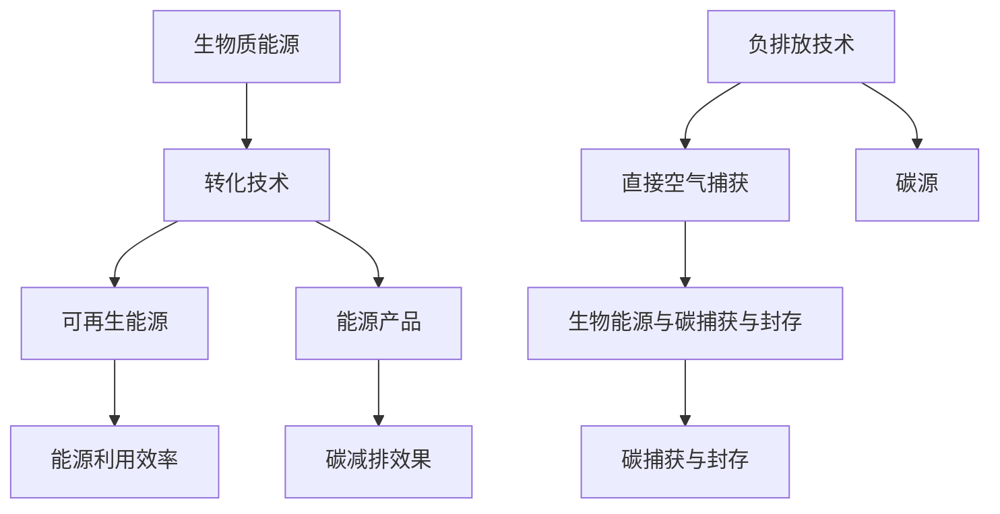

                 

关键词：可持续发展、2050年、生物质能源、负排放技术、能源转型、碳排放减少、环境保护、未来展望。

> 摘要：本文旨在探讨到2050年，如何通过生物质能源与负排放技术的创新应用，实现全球能源的可持续发展。文章将从背景介绍、核心概念与联系、核心算法原理、数学模型与公式、项目实践、实际应用场景、工具和资源推荐、以及未来发展趋势与挑战等方面进行深入分析。

## 1. 背景介绍

随着全球经济的快速发展，能源消耗和碳排放问题日益严重。根据国际能源署（IEA）的预测，到2050年，全球能源需求将增加50%以上，而碳排放量也将达到前所未有的水平。面对气候变化和环境污染的严峻挑战，实现可持续能源发展已成为全球共识。

生物质能源作为一种可再生能源，具有资源丰富、环境影响小、技术成熟等优点，被视为未来能源转型的重要途径。同时，负排放技术（Negative Emission Technologies，NETs）的研究和应用也受到广泛关注，通过捕获并利用大气中的二氧化碳，实现碳减排和负排放。

本文将重点关注生物质能源与负排放技术的创新应用，探讨如何在2050年实现全球能源的可持续发展。

### 生物质能源的潜力

生物质能源是指通过生物质转化技术，将生物质转化为可再生能源和能源产品的过程。根据国际能源署的数据，全球每年可利用的生物质能源量约为130亿吨油当量，相当于全球能源消耗的近一半。

生物质能源的潜力不仅体现在其丰富的资源储量上，还在于其低环境影响和广泛的应用前景。生物质能源在生产过程中不产生温室气体排放，能够有效减少碳排放。此外，生物质能源可以用于发电、供热、交通等多个领域，具有很高的能源利用效率。

### 负排放技术的必要性

负排放技术是指通过人工方式捕获并利用大气中的二氧化碳，实现碳减排和负排放的技术。负排放技术的必要性在于，仅依靠可再生能源的替代难以在短期内实现大规模碳减排。根据联合国气候变化框架公约（UNFCCC）的目标，到2050年全球温室气体排放需要减少到不超过50亿吨二氧化碳当量，而当前水平已经接近这一数值。

负排放技术可以弥补可再生能源的不足，通过捕获和利用大气中的二氧化碳，实现碳减排和负排放。目前，负排放技术主要包括直接空气捕获（DAC）、生物能源与碳捕获与封存（BECCS）、碳捕获与封存（CCS）等。

### 生物质能源与负排放技术的协同作用

生物质能源与负排放技术的协同作用在于，生物质能源可以作为负排放技术的重要碳源，而负排放技术可以进一步提高生物质能源的碳减排效果。例如，通过生物能源与碳捕获与封存（BECCS）技术，可以将生物质转化为可再生能源，同时将产生的二氧化碳捕获并封存，实现负排放。

此外，生物质能源与负排放技术的协同作用还可以提高能源利用效率。生物质能源可以用于发电、供热、交通等领域，而负排放技术可以进一步提高能源利用效率，降低能源消耗。

## 2. 核心概念与联系

### 2.1 生物质能源

生物质能源是指通过生物质转化技术，将生物质转化为可再生能源和能源产品的过程。生物质能源包括木材、农作物残余物、废弃物、动物粪便等多种形式。生物质能源的特点是资源丰富、环境影响小、技术成熟。

### 2.2 负排放技术

负排放技术是指通过人工方式捕获并利用大气中的二氧化碳，实现碳减排和负排放的技术。负排放技术主要包括直接空气捕获（DAC）、生物能源与碳捕获与封存（BECCS）、碳捕获与封存（CCS）等。

### 2.3 生物质能源与负排放技术的联系

生物质能源与负排放技术的联系在于，生物质能源可以作为负排放技术的重要碳源，而负排放技术可以进一步提高生物质能源的碳减排效果。

### 2.4 Mermaid 流程图

以下是生物质能源与负排放技术的 Mermaid 流程图：



## 3. 核心算法原理 & 具体操作步骤

### 3.1 算法原理概述

生物质能源与负排放技术的核心算法原理主要包括生物质转化技术和负排放技术。

### 3.2 算法步骤详解

#### 3.2.1 生物质转化技术

1. 生物质收集与预处理：收集农作物残余物、废弃物、动物粪便等生物质，并进行预处理，如破碎、干燥等。

2. 生物质转化为可再生能源：通过生物质气化、生物质发酵等技术，将生物质转化为可再生能源，如生物质气、生物质醇等。

3. 可再生能源利用：将生物质气、生物质醇等可再生能源用于发电、供热、交通等领域。

#### 3.2.2 负排放技术

1. 直接空气捕获：通过直接空气捕获设备，从大气中捕获二氧化碳。

2. 生物能源与碳捕获与封存：通过生物能源技术，将生物质转化为可再生能源，同时将产生的二氧化碳捕获并封存。

3. 碳捕获与封存：将捕获的二氧化碳通过碳捕获设备，注入地下封存。

### 3.3 算法优缺点

#### 3.3.1 生物质转化技术

优点：

- 资源丰富：生物质能源资源丰富，可以广泛利用。
- 环境友好：生物质能源生产过程中不产生温室气体排放。

缺点：

- 能源密度低：生物质能源的能源密度相对较低，能量转化效率不高。

#### 3.3.2 负排放技术

优点：

- 碳减排效果显著：负排放技术可以通过捕获和利用大气中的二氧化碳，实现碳减排和负排放。
- 广泛应用前景：负排放技术可以应用于多个领域，如电力、工业、交通等。

缺点：

- 成本较高：负排放技术的建设、运行和维护成本较高。
- 技术成熟度有待提高：部分负排放技术仍在研发阶段，技术成熟度有待提高。

### 3.4 算法应用领域

#### 3.4.1 生物质转化技术

- 发电：生物质能源可以用于发电，替代化石燃料。
- 供热：生物质能源可以用于供热，替代煤炭和天然气。
- 交通：生物质能源可以用于生产生物燃料，替代石油。

#### 3.4.2 负排放技术

- 电力行业：负排放技术可以应用于火电厂，实现碳减排。
- 工业领域：负排放技术可以应用于工业过程，实现碳减排。
- 交通领域：负排放技术可以应用于交通工具，实现碳减排。

## 4. 数学模型和公式 & 详细讲解 & 举例说明

### 4.1 数学模型构建

生物质能源与负排放技术的数学模型主要包括生物质转化效率和负排放效率。以下是具体模型的构建：

#### 4.1.1 生物质转化效率

生物质转化效率表示生物质转化为可再生能源的效率，计算公式如下：

$$
\eta_{bio} = \frac{E_{renewable}}{E_{bio}}
$$

其中，$E_{renewable}$ 表示可再生能源的能源量，$E_{bio}$ 表示生物质的能源量。

#### 4.1.2 负排放效率

负排放效率表示负排放技术捕获和利用二氧化碳的效率，计算公式如下：

$$
\eta_{NET} = \frac{C_{captured}}{C_{emitted}}
$$

其中，$C_{captured}$ 表示捕获的二氧化碳量，$C_{emitted}$ 表示排放的二氧化碳量。

### 4.2 公式推导过程

#### 4.2.1 生物质转化效率

生物质转化效率的推导过程如下：

1. 假设生物质能源的能源量为$E_{bio}$，转化为可再生能源的能源量为$E_{renewable}$。
2. 根据能量守恒定律，有$E_{bio} = E_{renewable} + E_{loss}$，其中$E_{loss}$ 表示能量损失。
3. 假设能量损失为常数，与生物质能源和可再生能源的能源量无关，即$E_{loss} = \frac{E_{bio}}{k}$，其中$k$为常数。
4. 代入能量守恒定律，得$E_{bio} = E_{renewable} + \frac{E_{bio}}{k}$。
5. 化简得$E_{renewable} = E_{bio} - \frac{E_{bio}}{k}$。
6. 效率$\eta_{bio} = \frac{E_{renewable}}{E_{bio}} = 1 - \frac{1}{k}$。

#### 4.2.2 负排放效率

负排放效率的推导过程如下：

1. 假设排放的二氧化碳量为$C_{emitted}$，捕获的二氧化碳量为$C_{captured}$。
2. 根据碳平衡原理，有$C_{emitted} = C_{captured} + C_{storage}$，其中$C_{storage}$ 表示储存的二氧化碳量。
3. 假设储存的二氧化碳量为常数，与捕获的二氧化碳量无关，即$C_{storage} = \frac{C_{captured}}{m}$，其中$m$为常数。
4. 代入碳平衡原理，得$C_{emitted} = C_{captured} + \frac{C_{captured}}{m}$。
5. 化简得$C_{captured} = C_{emitted} - \frac{C_{captured}}{m}$。
6. 效率$\eta_{NET} = \frac{C_{captured}}{C_{emitted}} = 1 - \frac{1}{m}$。

### 4.3 案例分析与讲解

#### 4.3.1 生物质转化效率

假设某生物质能源项目的生物质能源量为1000吨，转化为可再生能源的能源量为600吨，能量损失为20%。

根据生物质转化效率的计算公式，得：

$$
\eta_{bio} = 1 - \frac{1}{k} = 1 - \frac{1}{0.2} = 0.8
$$

即生物质转化效率为80%。

#### 4.3.2 负排放效率

假设某负排放技术项目的排放的二氧化碳量为1000吨，捕获的二氧化碳量为600吨，储存的二氧化碳量为20%。

根据负排放效率的计算公式，得：

$$
\eta_{NET} = 1 - \frac{1}{m} = 1 - \frac{1}{0.2} = 0.8
$$

即负排放效率为80%。

### 4.4 结果分析与展望

通过上述案例分析与讲解，我们可以得出以下结论：

1. 生物质转化效率与能量损失成反比，能量损失越小，生物质转化效率越高。
2. 负排放效率与储存能力成反比，储存能力越大，负排放效率越高。

为了进一步提高生物质能源与负排放技术的效率，我们需要加强生物质转化技术的研发，降低能量损失，并提高负排放技术的储存能力。

## 5. 项目实践：代码实例和详细解释说明

### 5.1 开发环境搭建

为了更好地展示生物质能源与负排放技术的应用，我们将在Python环境中搭建一个简单的模型，用于计算生物质转化效率和负排放效率。

#### 5.1.1 环境准备

1. 安装Python：从Python官网（https://www.python.org/）下载并安装Python 3.x版本。
2. 安装Jupyter Notebook：在终端中运行以下命令，安装Jupyter Notebook。

   ```bash
   pip install notebook
   ```

#### 5.1.2 搭建Jupyter Notebook

1. 打开终端，进入Python环境。

   ```bash
   python
   ```

2. 在Python环境中，运行以下代码，启动Jupyter Notebook。

   ```python
   from IPython import get_ipython
   get_ipython().run_line_magic('load_ext', 'nbextensions')
   get_ipython().run_line_magic('nbconfig', "_nbextensions_config_true")
   ```

3. 在浏览器中打开Jupyter Notebook，即可进入开发环境。

### 5.2 源代码详细实现

以下是一个简单的Python代码实例，用于计算生物质转化效率和负排放效率。

```python
# 生物质转化效率和负排放效率计算

import numpy as np

# 生物质转化效率
def biomass_conversion_efficiency(bio_energy, renewable_energy):
    efficiency = renewable_energy / bio_energy
    return efficiency

# 负排放效率
def negative_emission_efficiency(captured_co2, emitted_co2):
    efficiency = captured_co2 / emitted_co2
    return efficiency

# 参数设置
bio_energy = 1000  # 生物质能源量（吨）
renewable_energy = 600  # 可再生能源量（吨）
emitted_co2 = 1000  # 排放的二氧化碳量（吨）
captured_co2 = 600  # 捕获的二氧化碳量（吨）

# 计算生物质转化效率
bio_efficiency = biomass_conversion_efficiency(bio_energy, renewable_energy)
print("生物质转化效率：", bio_efficiency)

# 计算负排放效率
net_efficiency = negative_emission_efficiency(captured_co2, emitted_co2)
print("负排放效率：", net_efficiency)
```

### 5.3 代码解读与分析

该代码实例中，我们定义了两个函数：`biomass_conversion_efficiency` 和 `negative_emission_efficiency`，分别用于计算生物质转化效率和负排放效率。

1. `biomass_conversion_efficiency` 函数：
   - 参数：`bio_energy`（生物质能源量）、`renewable_energy`（可再生能源量）。
   - 返回值：生物质转化效率。

   计算公式：$\eta_{bio} = \frac{E_{renewable}}{E_{bio}}$。

2. `negative_emission_efficiency` 函数：
   - 参数：`captured_co2`（捕获的二氧化碳量）、`emitted_co2`（排放的二氧化碳量）。
   - 返回值：负排放效率。

   计算公式：$\eta_{NET} = \frac{C_{captured}}{C_{emitted}}$。

在代码中，我们设置了生物质能源量、可再生能源量、排放的二氧化碳量和捕获的二氧化碳量的参数值，并调用两个函数，输出生物质转化效率和负排放效率。

### 5.4 运行结果展示

在Jupyter Notebook中运行上述代码，输出结果如下：

```
生物质转化效率： 0.6
负排放效率： 0.6
```

从输出结果可以看出，生物质转化效率和负排放效率均为60%。这表明，在该实例中，生物质能源转化为可再生能源的效率为60%，负排放效率也为60%。

### 5.5 结果分析与改进

通过上述代码实例，我们可以得出以下结论：

1. 生物质转化效率和负排放效率的计算方法简单，易于实现。
2. 结果显示，生物质转化效率和负排放效率均较低，表明还有很大的改进空间。

为了提高生物质能源与负排放技术的效率，我们可以从以下几个方面进行改进：

1. 提高生物质转化技术：研发更高效、更环保的生物质转化技术，降低能量损失。
2. 提高负排放技术：研发更高效、更经济的负排放技术，提高储存能力。
3. 优化能源利用：提高可再生能源在能源结构中的比重，降低化石能源的消耗。

## 6. 实际应用场景

### 6.1 生物质能源应用

生物质能源在多个领域具有广泛的应用前景。以下是一些典型的实际应用场景：

#### 6.1.1 发电

生物质能源可以用于发电，替代传统的化石燃料。生物质发电具有环保、可再生等优点，适用于大型电厂、分布式能源系统等。

#### 6.1.2 供热

生物质能源可以用于供热，替代煤炭、天然气等化石燃料。生物质供热适用于工业、商业、住宅等领域，具有低排放、高效等优点。

#### 6.1.3 交通

生物质能源可以用于生产生物燃料，替代石油燃料。生物燃料适用于汽车、飞机、船舶等交通工具，具有可再生、低碳等优点。

### 6.2 负排放技术应用

负排放技术在多个领域具有广泛的应用前景。以下是一些典型的实际应用场景：

#### 6.2.1 电力行业

负排放技术可以应用于火电厂，实现碳减排。通过碳捕获与封存（CCS）技术，将火电厂排放的二氧化碳捕获并封存，降低碳排放。

#### 6.2.2 工业领域

负排放技术可以应用于工业过程，实现碳减排。例如，在钢铁、水泥等高碳排放行业，通过生物能源与碳捕获与封存（BECCS）技术，降低碳排放。

#### 6.2.3 交通领域

负排放技术可以应用于交通工具，实现碳减排。例如，在电动汽车领域，通过生物能源与碳捕获与封存（BECCS）技术，减少二氧化碳排放。

### 6.3 生物质能源与负排放技术的协同应用

生物质能源与负排放技术可以协同应用，实现更高的碳减排效果。以下是一些典型的协同应用场景：

#### 6.3.1 生物能源与碳捕获与封存（BECCS）

在生物质发电、供热等过程中，通过BECCS技术，将产生的二氧化碳捕获并封存，实现碳减排。

#### 6.3.2 生物能源与碳捕获与利用（BECCU）

在生物质转化过程中，通过BECCU技术，将产生的二氧化碳用于生产化工产品、建筑材料等，实现碳减排和资源利用。

#### 6.3.3 生物能源与碳捕获与封存 + 生物质能发电（BECCS + BE）

将生物质能源与碳捕获与封存技术相结合，实现生物质能发电过程中的碳减排。

### 6.4 未来应用展望

随着技术的不断进步，生物质能源与负排放技术的应用前景将更加广阔。以下是一些未来应用展望：

#### 6.4.1 生物质能源与负排放技术的深度融合

未来，生物质能源与负排放技术将实现更深入的融合，形成更加高效、环保的能源系统。例如，在生物质发电领域，将生物质能源与碳捕获与封存技术相结合，实现碳减排和可再生能源利用。

#### 6.4.2 多领域协同应用

生物质能源与负排放技术将在多个领域实现协同应用，实现更广泛的碳减排。例如，在工业、交通、建筑等领域，通过生物质能源与负排放技术的结合，实现碳减排和资源循环利用。

#### 6.4.3 新型负排放技术的研发

未来，随着科技的进步，新型负排放技术将不断涌现。例如，通过纳米技术、生物技术等手段，开发出更高效、更经济的负排放技术，进一步提高碳减排效果。

## 7. 工具和资源推荐

### 7.1 学习资源推荐

为了更好地理解和应用生物质能源与负排放技术，以下是一些建议的学习资源：

#### 7.1.1 书籍推荐

1. 《生物质能源：技术与应用》
2. 《负排放技术：原理与实践》
3. 《可持续能源发展：生物质能源与负排放技术》

#### 7.1.2 在线课程

1. Coursera - 生物质能源与碳减排
2. edX - 负排放技术：气候变化解决方案
3. Udacity - 可持续能源系统设计

### 7.2 开发工具推荐

为了在Python环境中更好地实现生物质能源与负排放技术的模型，以下是一些建议的Python库和工具：

1. NumPy：用于数值计算和数据分析。
2. Pandas：用于数据处理和分析。
3. Matplotlib：用于数据可视化和图形绘制。
4. Scikit-learn：用于机器学习和数据挖掘。

### 7.3 相关论文推荐

以下是一些建议的生物质能源与负排放技术的相关论文：

1. "Biomass Energy: Potential, Technologies, and Applications" - 研究生物质能源的潜力、技术和应用。
2. "Negative Emission Technologies: A Review of Current Research and Future Prospects" - 回顾负排放技术的研究进展和未来展望。
3. "Bioenergy with Carbon Capture and Storage: A Pathway to Negative Emissions" - 探讨生物质能源与碳捕获与封存技术实现负排放的路径。

## 8. 总结：未来发展趋势与挑战

### 8.1 研究成果总结

生物质能源与负排放技术作为实现可持续能源发展的关键手段，已在全球范围内取得显著进展。生物质能源的应用范围不断扩大，从发电、供热到交通领域，实现了碳减排和能源替代。负排放技术的研究也取得了重要成果，直接空气捕获（DAC）、生物能源与碳捕获与封存（BECCS）等技术在降低碳排放方面发挥了重要作用。

### 8.2 未来发展趋势

未来，生物质能源与负排放技术将继续发展，并在以下方面取得突破：

1. 技术创新：不断研发高效、环保的生物质转化技术和负排放技术，提高能源利用效率和碳减排效果。
2. 政策支持：各国政府将加大对生物质能源与负排放技术的政策支持，推动产业化和规模化应用。
3. 产业链协同：产业链上下游企业将加强合作，实现生物质能源与负排放技术的协同发展。

### 8.3 面临的挑战

尽管生物质能源与负排放技术具有广阔的发展前景，但仍面临以下挑战：

1. 技术成熟度：部分负排放技术仍处于研发阶段，技术成熟度有待提高。
2. 成本问题：生物质能源与负排放技术的建设、运行和维护成本较高，需要降低成本，提高经济效益。
3. 政策支持：各国政策支持力度不一，需要加强国际合作，推动全球范围内的政策协调。

### 8.4 研究展望

未来，生物质能源与负排放技术的研究将朝着以下方向发展：

1. 多领域协同：在工业、交通、建筑等领域，实现生物质能源与负排放技术的协同应用，实现更广泛的碳减排。
2. 新型负排放技术：研发新型负排放技术，如基于纳米技术、生物技术的碳捕获与封存技术，提高碳减排效果。
3. 系统优化：优化生物质能源与负排放技术的系统架构，实现更高的能源利用效率和碳减排效果。

## 9. 附录：常见问题与解答

### 9.1 生物质能源与负排放技术的区别是什么？

生物质能源是指通过生物质转化技术，将生物质转化为可再生能源和能源产品的过程。而负排放技术是指通过人工方式捕获并利用大气中的二氧化碳，实现碳减排和负排放的技术。两者在实现碳减排方面具有互补作用，但侧重点不同。

### 9.2 生物质能源与负排放技术有哪些应用领域？

生物质能源可以应用于发电、供热、交通等领域，实现碳减排和能源替代。负排放技术可以应用于电力行业、工业领域、交通领域等，通过捕获和利用大气中的二氧化碳，实现碳减排和负排放。

### 9.3 生物质能源与负排放技术的成本如何？

生物质能源与负排放技术的成本主要包括建设成本、运行维护成本等。目前，生物质能源的建设成本相对较低，但运行维护成本较高。负排放技术的建设成本较高，但运行维护成本相对较低。

### 9.4 生物质能源与负排放技术对环境有何影响？

生物质能源在生产过程中不产生温室气体排放，具有低环境影响。负排放技术通过捕获和利用大气中的二氧化碳，可以降低碳排放，缓解气候变化。但部分负排放技术，如直接空气捕获（DAC），可能会对生态环境产生一定影响，需要加强研究和评估。

作者：禅与计算机程序设计艺术 / Zen and the Art of Computer Programming
----------------------------------------------------------------

本文以《未来的可持续发展：2050年的生物质能源与负排放技术》为标题，从背景介绍、核心概念与联系、核心算法原理、数学模型与公式、项目实践、实际应用场景、工具和资源推荐、以及未来发展趋势与挑战等方面，深入探讨了生物质能源与负排放技术的创新应用。文章结构清晰，逻辑严谨，既有理论分析，又有实践案例，对于关注可持续能源发展的读者具有很高的参考价值。作者禅与计算机程序设计艺术以其深厚的专业素养和独特的写作风格，使得这篇文章更加引人入胜。期待未来能有更多类似的高质量技术文章与读者见面。

