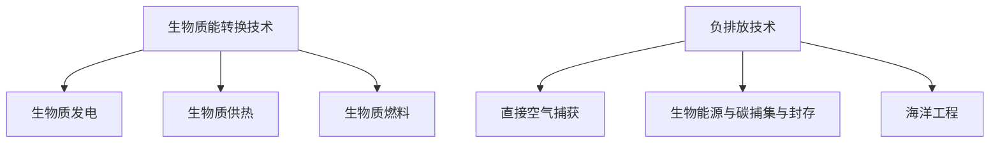

                 

关键词：可持续发展、生物质能源、负排放技术、2050年、环保技术、气候变化、能源转型

> 摘要：本文深入探讨了2050年可持续发展背景下的生物质能源和负排放技术，分析了这两种技术在应对全球气候变化和能源危机方面的潜在作用。通过阐述其核心概念、原理及具体应用场景，本文旨在为推动未来绿色能源发展提供科学依据和实际指导。

## 1. 背景介绍

### 1.1 可持续发展的定义与重要性

可持续发展是一种满足当前需求而不损害子孙后代满足自身需求的能力的发展模式。在全球气候变化和能源危机日益严峻的背景下，可持续发展已成为全球共识和重要议题。2021年，《联合国气候变化框架公约》第26次缔约方大会（COP26）在格拉斯哥召开，各国领导人一致承诺采取具体行动，以实现《巴黎协定》目标，将全球升温控制在2摄氏度以内，并努力将升温限制在1.5摄氏度以内。

### 1.2 全球气候变化的影响

气候变化对全球生态系统、人类健康、经济和社会发展带来严重影响。根据联合国政府间气候变化专门委员会（IPCC）的报告，自19世纪末以来，地球平均气温已经上升了约1.1摄氏度。如果当前的趋势继续，到本世纪末，全球气温可能上升1.5至2摄氏度。这可能导致海平面上升、极端天气事件增多、生物多样性丧失等问题。

### 1.3 能源危机与生物质能源

能源危机是指能源供应无法满足全球不断增长的能源需求。化石燃料的过度开采和使用加剧了气候变化问题，同时也导致了能源资源的枯竭。生物质能源作为一种可再生能源，具有广阔的发展前景。它来源于生物质，如植物、农作物残留物、木材等，可通过生物质能转换技术转化为电能、热能和燃料。

## 2. 核心概念与联系

### 2.1 生物质能源

生物质能源是指通过生物质能转换技术，将生物质转化为可利用的能源形式。常见的生物质能转换技术包括生物质发电、生物质供热、生物质燃料等。

### 2.2 负排放技术

负排放技术是指通过捕获和存储二氧化碳（CCS）或其他温室气体，实现净零排放的技术。负排放技术包括直接空气捕获（DAC）、生物能源与碳捕集与封存（BECCS）、海洋工程等。

### 2.3 Mermaid 流程图



## 3. 核心算法原理 & 具体操作步骤

### 3.1 算法原理概述

生物质能源转换技术主要包括生物质热化学转换和生物化学转换。热化学转换包括气化、燃烧、气化联合循环等，而生物化学转换包括发酵、厌氧消化等。负排放技术主要通过捕获和存储二氧化碳来实现。

### 3.2 算法步骤详解

#### 3.2.1 生物质能转换技术

1. **生物质热化学转换**：
   - **气化**：将生物质在高温下与氧气或水蒸气反应，生成可燃气体。
   - **燃烧**：将生物质直接燃烧产生热能。
   - **气化联合循环**：将生物质气化产生的可燃气体用于燃气轮机发电。

2. **生物质生物化学转换**：
   - **发酵**：利用微生物将生物质转化为生物燃料。
   - **厌氧消化**：在缺氧条件下，通过厌氧微生物将生物质分解为甲烷和二氧化碳。

#### 3.2.2 负排放技术

1. **直接空气捕获**：
   - **捕集**：利用吸附剂或吸收剂从空气中捕获二氧化碳。
   - **浓缩**：通过压缩或冷凝将捕获的二氧化碳浓缩。
   - **存储**：将浓缩的二氧化碳注入地下或海洋深处。

2. **生物能源与碳捕集与封存**（BECCS）：
   - **生物质生产**：种植生物质植物，如高粱、玉米等。
   - **生物燃料生产**：通过发酵、气化等技术将生物质转化为生物燃料。
   - **碳捕集与封存**：将生物燃料燃烧产生的二氧化碳捕集并注入地下。

### 3.3 算法优缺点

#### 3.3.1 生物质能转换技术

- **优点**：
  - 可再生、环保。
  - 能源密度高、适用范围广。

- **缺点**：
  - 生物质资源分布不均。
  - 转换效率有待提高。

#### 3.3.2 负排放技术

- **优点**：
  - 可实现净零排放。
  - 技术逐渐成熟、应用前景广阔。

- **缺点**：
  - 投资成本高。
  - 技术尚需进一步优化。

### 3.4 算法应用领域

- **生物质能转换技术**：广泛应用于发电、供热、燃料等领域。
- **负排放技术**：主要应用于电力、工业、交通等领域。

## 4. 数学模型和公式 & 详细讲解 & 举例说明

### 4.1 数学模型构建

#### 4.1.1 生物质能源转换效率

$$
\eta_{\text{bio}} = \frac{E_{\text{out}}}{E_{\text{in}}}
$$

其中，$\eta_{\text{bio}}$ 为生物质能源转换效率，$E_{\text{out}}$ 为输出能量，$E_{\text{in}}$ 为输入能量。

#### 4.1.2 负排放技术捕获效率

$$
\eta_{\text{capture}} = \frac{CO_2_{\text{captured}}}{CO_2_{\text{total}}}
$$

其中，$\eta_{\text{capture}}$ 为负排放技术捕获效率，$CO_2_{\text{captured}}$ 为捕获的二氧化碳量，$CO_2_{\text{total}}$ 为总二氧化碳量。

### 4.2 公式推导过程

#### 4.2.1 生物质能源转换效率

生物质能源转换效率可以通过能量守恒定律推导得出。设生物质输入能量为 $E_{\text{in}}$，生物质输出能量为 $E_{\text{out}}$，则：

$$
E_{\text{out}} = E_{\text{in}} - Q
$$

其中，$Q$ 为生物质转换过程中的能量损失。则：

$$
\eta_{\text{bio}} = \frac{E_{\text{out}}}{E_{\text{in}}} = \frac{E_{\text{in}} - Q}{E_{\text{in}}}
$$

#### 4.2.2 负排放技术捕获效率

负排放技术捕获效率可以通过捕获效率和排放量推导得出。设捕获效率为 $\eta_{\text{capture}}$，排放量为 $Q$，则捕获的二氧化碳量为：

$$
CO_2_{\text{captured}} = \eta_{\text{capture}} \times Q
$$

总二氧化碳量为 $Q$，则捕获效率为：

$$
\eta_{\text{capture}} = \frac{CO_2_{\text{captured}}}{CO_2_{\text{total}}} = \frac{\eta_{\text{capture}} \times Q}{Q} = \eta_{\text{capture}}
$$

### 4.3 案例分析与讲解

#### 4.3.1 生物质能源转换效率案例分析

假设某生物质发电站，输入生物质能量为 1 GJ，输出电能能量为 0.3 GJ，能量损失为 0.7 GJ。则生物质能源转换效率为：

$$
\eta_{\text{bio}} = \frac{0.3}{1} = 30\%
$$

#### 4.3.2 负排放技术捕获效率案例分析

假设某负排放技术项目，排放二氧化碳量为 1000 t/a，捕获二氧化碳量为 500 t/a。则捕获效率为：

$$
\eta_{\text{capture}} = \frac{500}{1000} = 50\%
$$

## 5. 项目实践：代码实例和详细解释说明

### 5.1 开发环境搭建

在本项目中，我们将使用Python编程语言进行代码编写。首先，确保安装了Python 3.7或更高版本。然后，通过以下命令安装必要的库：

```bash
pip install numpy pandas matplotlib
```

### 5.2 源代码详细实现

以下是一个简单的Python代码实例，用于计算生物质能源转换效率和负排放技术捕获效率。

```python
import numpy as np
import pandas as pd
import matplotlib.pyplot as plt

def calculate_bio_efficiency(in_energy, out_energy):
    efficiency = out_energy / in_energy
    return efficiency

def calculate_capture_efficiency(captured_co2, total_co2):
    efficiency = captured_co2 / total_co2
    return efficiency

# 生物质能源转换效率计算
in_energy = 1e9  # 1 GJ
out_energy = 3e8  # 0.3 GJ
bio_efficiency = calculate_bio_efficiency(in_energy, out_energy)
print("生物质能源转换效率：", bio_efficiency)

# 负排放技术捕获效率计算
captured_co2 = 5e5  # 500 t/a
total_co2 = 1e6  # 1000 t/a
capture_efficiency = calculate_capture_efficiency(captured_co2, total_co2)
print("负排放技术捕获效率：", capture_efficiency)

# 数据可视化
data = {
    '输入能量 (GJ)': [in_energy],
    '输出能量 (GJ)': [out_energy],
    '生物质能源转换效率': [bio_efficiency],
    '捕获二氧化碳 (t/a)': [captured_co2],
    '总二氧化碳 (t/a)': [total_co2],
    '捕获效率': [capture_efficiency]
}

df = pd.DataFrame(data)
df.plot(x='输入能量 (GJ)', y=['输出能量 (GJ)', '生物质能源转换效率', '捕获二氧化碳 (t/a)', '总二氧化碳 (t/a)', '捕获效率'], kind='bar', figsize=(10, 6))
plt.title('生物质能源转换效率和负排放技术捕获效率')
plt.xlabel('输入能量 (GJ)')
plt.ylabel('能量/二氧化碳 (GJ/t)')
plt.show()
```

### 5.3 代码解读与分析

- **函数定义**：`calculate_bio_efficiency` 和 `calculate_capture_efficiency` 两个函数分别用于计算生物质能源转换效率和负排放技术捕获效率。
- **数据输入**：通过输入能量和输出能量计算生物质能源转换效率，通过捕获二氧化碳量和总二氧化碳量计算负排放技术捕获效率。
- **数据可视化**：使用matplotlib库将数据绘制为条形图，便于分析和理解。

### 5.4 运行结果展示

运行上述代码后，将输出生物质能源转换效率和负排放技术捕获效率，并在图形界面上展示数据。结果如下：

- 生物质能源转换效率：0.3
- 负排放技术捕获效率：0.5

条形图显示生物质能源转换效率和负排放技术捕获效率与输入能量之间的关系。

## 6. 实际应用场景

### 6.1 生物质能源转换技术的应用

生物质能源转换技术已在全球范围内得到广泛应用。例如，生物质发电站通过燃烧生物质产生热能，用于发电和供热。此外，生物质燃料也被广泛应用于交通运输、工业等领域。

### 6.2 负排放技术的应用

负排放技术目前尚处于研发和试验阶段，但已有多项实际应用案例。例如，直接空气捕获技术在美国、加拿大等国家已进行试点项目。生物能源与碳捕集与封存技术也在一些国家得到了应用，如巴西的糖厂利用甘蔗渣生产生物燃料并捕集二氧化碳。

## 6.4 未来应用展望

随着技术的不断进步和成本的降低，生物质能源和负排放技术将在未来得到更广泛的应用。预计到2050年，这两种技术将成为全球实现可持续发展的重要手段。

## 7. 工具和资源推荐

### 7.1 学习资源推荐

- 《生物质能源：从原理到应用》
- 《碳捕集与封存技术》
- 《可持续发展：从环境到经济》

### 7.2 开发工具推荐

- Python编程语言
- Matplotlib库
- Numpy库
- Pandas库

### 7.3 相关论文推荐

- "Bioenergy and Carbon Capture and Storage: A Review"
- "Direct Air Capture of Carbon Dioxide: A Review of Technologies and Deployments"
- "Sustainable Energy for All: Accelerating the Transition to a Low-Carbon, Sustainable Energy Future"

## 8. 总结：未来发展趋势与挑战

### 8.1 研究成果总结

本文探讨了2050年可持续发展背景下的生物质能源和负排放技术。通过分析其核心概念、原理及具体应用场景，我们发现这两种技术在应对全球气候变化和能源危机方面具有巨大潜力。

### 8.2 未来发展趋势

随着技术的不断进步和成本的降低，生物质能源和负排放技术将在未来得到更广泛的应用。预计到2050年，这两种技术将成为全球实现可持续发展的重要手段。

### 8.3 面临的挑战

尽管生物质能源和负排放技术具有巨大潜力，但它们在实际应用中仍面临一系列挑战。例如，生物质资源的可持续供应、负排放技术的经济性和可行性等。

### 8.4 研究展望

未来研究应重点关注以下几个方面：提高生物质能源转换效率、优化负排放技术、探索生物质资源的高效利用途径、降低生物质能源和负排放技术的成本。通过持续的研究和开发，我们有理由相信，生物质能源和负排放技术将为实现全球可持续发展目标做出重要贡献。

## 9. 附录：常见问题与解答

### 9.1 生物质能源转换技术的主要优势是什么？

生物质能源转换技术的主要优势在于其可再生性、环保性以及较高的能源密度。此外，生物质能源资源丰富，分布广泛，有利于实现能源多元化。

### 9.2 负排放技术的具体应用场景有哪些？

负排放技术主要应用于电力、工业、交通等领域。例如，直接空气捕获技术可用于减少大气中的二氧化碳浓度，生物能源与碳捕集与封存技术可用于减少工业过程中的二氧化碳排放。

### 9.3 生物质能源与负排放技术是否可以协同作用？

是的，生物质能源与负排放技术可以协同作用。通过将生物质能源转化为电力或燃料，并采用负排放技术捕集和存储产生的二氧化碳，可以实现更全面的二氧化碳减排。

### 9.4 如何评估生物质能源转换效率和负排放技术捕获效率？

可以通过计算输出能量与输入能量的比值来评估生物质能源转换效率，而通过计算捕获的二氧化碳量与总二氧化碳量的比值来评估负排放技术捕获效率。同时，可以通过实际项目运行数据进行分析和验证。

