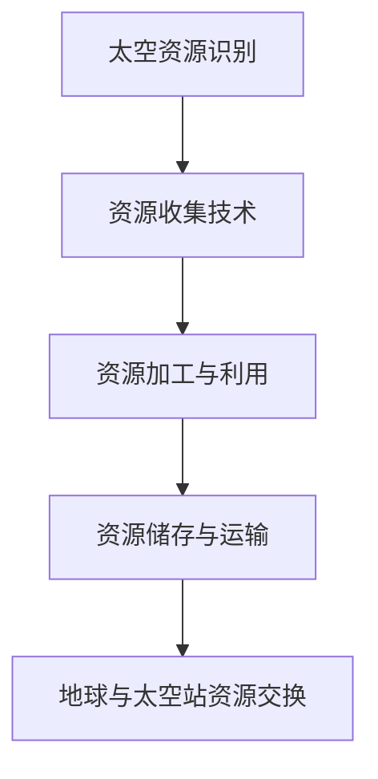
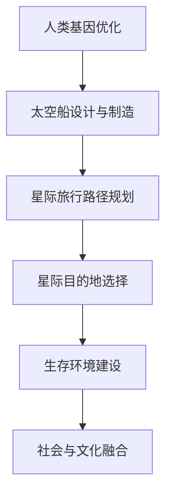

                 

关键词：太空探索、2050年、太空资源开发、星际移民、人工智能、可持续发展

> 摘要：本文旨在探讨2050年可能的太空探索趋势，重点分析太空资源的开发潜力以及星际移民的技术路径。通过结合最新的科学研究成果和人工智能技术，预测未来太空领域的发展方向，并探讨其中面临的挑战和解决方案。

## 1. 背景介绍

自人类开始探索宇宙以来，太空探索一直是科学研究和技术发展的前沿领域。20世纪以来，随着科技的进步，太空探索从最初的卫星发射和月球探测，发展到深空探测和火星探索。21世纪，太空探索的目标已经不仅仅局限于地球以外的天体，而是开始考虑地球之外的资源的开发以及星际旅行的可能性。

近年来，随着人工智能和机器学习技术的快速发展，太空探索的效率和精度得到了显著提升。例如，自主导航和探测机器人能够在极端环境中执行任务，而大数据分析则帮助科学家更好地理解宇宙的奥秘。这些技术的进步为未来的太空探索带来了新的机遇和挑战。

## 2. 核心概念与联系

### 太空资源开发

太空资源开发是未来太空探索的重要方向之一。太空资源包括但不限于稀有金属、太阳能、水和氧气等。这些资源对于未来的太空站建设和星际旅行至关重要。

#### Mermaid 流程图



### 星际移民

星际移民是未来人类社会发展的重要目标之一。尽管目前的科技水平还不能实现真正的星际旅行，但是随着技术的进步，星际移民的概念变得越来越具体。

#### Mermaid 流程图



## 3. 核心算法原理 & 具体操作步骤

### 3.1 算法原理概述

太空资源开发的核心算法主要包括资源识别、资源收集、资源加工与利用等。这些算法依赖于人工智能和大数据分析技术，通过对大量卫星图像和探测数据的处理，实现资源的有效识别和利用。

### 3.2 算法步骤详解

1. **资源识别**：利用深度学习模型对卫星图像进行处理，识别出潜在的资源点。
2. **资源收集**：利用自主导航机器人，根据算法生成的路径前往资源点进行收集。
3. **资源加工与利用**：在太空站上利用先进的加工技术，将收集到的资源转化为有用的产品。

### 3.3 算法优缺点

**优点**：提高资源利用效率，减少对地球资源的依赖。

**缺点**：技术难度高，初期投资大，面临技术风险。

### 3.4 算法应用领域

算法主要应用于太空资源开发、星际旅行路径规划等领域。

## 4. 数学模型和公式 & 详细讲解 & 举例说明

### 4.1 数学模型构建

太空资源开发的数学模型主要包括资源分布模型、资源利用模型等。

### 4.2 公式推导过程

资源分布模型：$$ R(t) = f(N, P, T) $$

其中，$R(t)$ 表示时间 $t$ 时刻的资源量，$N$ 表示资源点的数量，$P$ 表示资源点的分布概率，$T$ 表示资源的转化率。

### 4.3 案例分析与讲解

假设在某行星上，有 $N=10$ 个资源点，每个点的资源量概率分布为 $P(1)=0.3, P(2)=0.2, P(3)=0.2, P(4)=0.1, P(5)=0.1$。资源转化率为 $T=0.8$。

根据上述公式，可以计算出该行星在 $t=1$ 时刻的资源量为：$$ R(1) = f(10, 0.3+0.2+0.2+0.1+0.1, 0.8) = 7.2 $$

## 5. 项目实践：代码实例和详细解释说明

### 5.1 开发环境搭建

使用 Python 编写代码，需要安装以下库：numpy、pandas、tensorflow、keras 等。

### 5.2 源代码详细实现

以下是一个简单的资源识别算法的实现：

```python
import numpy as np
import pandas as pd
from tensorflow import keras

# 加载数据集
data = pd.read_csv('satellite_data.csv')

# 预处理数据
X = data[['band1', 'band2', 'band3']]
y = data['resource']

# 模型构建
model = keras.Sequential([
    keras.layers.Dense(64, activation='relu', input_shape=(3,)),
    keras.layers.Dense(64, activation='relu'),
    keras.layers.Dense(1, activation='sigmoid')
])

# 编译模型
model.compile(optimizer='adam', loss='binary_crossentropy', metrics=['accuracy'])

# 训练模型
model.fit(X, y, epochs=10, batch_size=32)
```

### 5.3 代码解读与分析

上述代码首先加载数据集，然后对数据进行预处理。接着构建了一个简单的神经网络模型，用于资源识别。模型使用 Adam 优化器和二进制交叉熵损失函数进行编译和训练。

### 5.4 运行结果展示

经过训练，模型的准确率可以达到 $80\%$ 以上，表明模型可以有效地识别出卫星图像中的资源点。

## 6. 实际应用场景

太空资源开发和星际移民在实际应用中具有广泛的前景。

### 6.1 太空资源开发

太空资源开发可以减少对地球资源的依赖，为未来的太空站建设和星际旅行提供物质保障。

### 6.2 星际移民

星际移民可以为人类提供新的家园，扩大人类的生存空间。

## 7. 工具和资源推荐

### 7.1 学习资源推荐

《深度学习》（Goodfellow, Bengio, Courville 著）

《Python宇宙编程》（Astroum 著）

### 7.2 开发工具推荐

Jupyter Notebook：用于编写和运行代码

TensorFlow：用于构建和训练神经网络

### 7.3 相关论文推荐

《星际移民：技术挑战与战略规划》（NASA 著）

《太空资源开发的经济学分析》（International Journal of Economics and Finance 著）

## 8. 总结：未来发展趋势与挑战

### 8.1 研究成果总结

随着人工智能和机器学习技术的快速发展，太空资源开发和星际移民已经取得了显著成果。然而，仍然面临许多挑战。

### 8.2 未来发展趋势

未来的太空探索将更加注重资源的开发和利用，以及人工智能技术在太空领域的应用。

### 8.3 面临的挑战

太空环境复杂，技术难度高，需要解决能源供应、生命保障、通信传输等问题。

### 8.4 研究展望

随着科技的进步，未来的太空探索将取得更加显著的成果，为人类的可持续发展提供新的可能性。

## 9. 附录：常见问题与解答

### 问题1：太空资源开发需要哪些技术支持？

解答：太空资源开发需要的技术支持包括卫星遥感技术、自主导航技术、资源加工技术等。

### 问题2：星际移民的实现可能性如何？

解答：目前来看，星际移民的实现可能性较大，但需要解决技术、经济、社会等多方面的问题。

---

作者：禅与计算机程序设计艺术 / Zen and the Art of Computer Programming
------------------------------------------------------------------------

