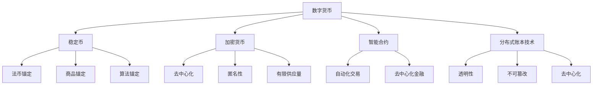

                 

关键词：数字货币、稳定币、全球数字货币SDR、加密货币、金融科技、分布式账本技术、区块链、智能合约、算法、数学模型、应用场景、未来展望

> 摘要：本文将探讨数字货币的演进历程，从稳定币到全球数字货币SDR，深入分析其核心概念、技术原理、应用场景以及未来发展趋势。通过对比不同类型的数字货币，我们希望能够为读者提供一个全面、深入的理解。

## 1. 背景介绍

随着互联网技术的飞速发展和金融科技的不断创新，数字货币逐渐成为金融市场的一个重要组成部分。从早期的比特币到现在的各种稳定币，数字货币的发展经历了多个阶段。在全球范围内，数字货币的应用场景也日益广泛，包括跨境支付、供应链金融、资产管理等。

本文将主要关注从稳定币到全球数字货币SDR的数字货币体系，探讨其在不同应用场景中的优势与挑战。稳定币作为数字货币的一种重要形式，解决了传统货币的波动性问题，为金融市场提供了新的交易媒介。而全球数字货币SDR则是在此基础上，通过国际间的合作与协调，构建了一个更加稳定、广泛的数字货币网络。

### 1.1 数字货币的发展历程

数字货币的发展可以分为以下几个阶段：

- **比特币的诞生**：2009年，比特币作为第一个去中心化的数字货币诞生，其创新性的分布式账本技术和去中心化的货币体系引起了广泛关注。
- **加密货币的兴起**：比特币的成功激发了更多人探索加密货币的可能性，一系列基于区块链技术的数字货币相继出现，如以太坊、莱特币等。
- **稳定币的出现**：为了解决加密货币波动性大的问题，稳定币应运而生。这些货币通过将价值锚定到某种资产（如美元、黄金等）来保持价格稳定。
- **全球数字货币SDR**：在全球范围内，数字货币的应用需求日益增长，国际组织如国际货币基金组织（IMF）提出了全球数字货币SDR的概念，以促进国际间的货币流通与结算。

### 1.2 数字货币的当前应用场景

数字货币在当前金融市场中的应用场景非常广泛，主要包括以下几个方面：

- **跨境支付**：数字货币为跨境支付提供了一种快速、低成本的解决方案，特别是在传统金融体系无法覆盖的地区。
- **供应链金融**：通过数字货币，企业可以更快速地进行资金流转，优化供应链金融的效率。
- **资产管理**：数字货币作为一种新兴的资产类别，吸引了大量投资者的关注，资产管理公司也开始将其纳入投资组合。
- **去中心化金融（DeFi）**：数字货币为基础的DeFi平台为用户提供了一种无需传统金融机构参与的去中心化金融服务，包括借贷、交易、资产管理等。

## 2. 核心概念与联系

在探讨数字货币的体系之前，我们需要明确一些核心概念，并了解它们之间的联系。以下是对这些概念的定义与描述，以及它们在数字货币体系中的角色。

### 2.1 稳定币

稳定币是一种价格稳定的数字货币，通常将其价值锚定到某种资产，如美元、黄金或其他货币。稳定币的目的是为了解决加密货币的高波动性问题，使其成为一种可靠的价值储存和交易媒介。目前市场上常见的稳定币包括：

- **法币锚定稳定币**：如USD Coin (USDC)、真稳定币（Dai）等，这些稳定币的价值直接与法定货币挂钩。
- **商品锚定稳定币**：如比特币锚定稳定币（BTC-pegged），其价值与比特币挂钩。
- **算法锚定稳定币**：如利用算法控制的货币，其价值通过市场供需调节保持稳定。

### 2.2 加密货币

加密货币是一种基于区块链技术的数字货币，其安全性由加密算法保证。比特币是第一种加密货币，其他著名的加密货币包括以太坊、莱特币等。加密货币的特点是去中心化、匿名性和有限供应量。

### 2.3 智能合约

智能合约是一种自执行的合约，其条款和操作被编码在区块链上，当满足预设条件时自动执行。智能合约在数字货币体系中扮演着重要角色，可以用于自动化交易、去中心化金融应用等。

### 2.4 分布式账本技术

分布式账本技术是区块链技术的核心，其特点是在多个节点之间共享一个分布式数据库。这种技术保证了数据的透明性、不可篡改性和去中心化，是数字货币体系的基础。

### 2.5 Mermaid 流程图

以下是一个简单的 Mermaid 流程图，展示了这些核心概念之间的联系：



## 3. 核心算法原理 & 具体操作步骤

数字货币体系中的核心算法包括加密算法、共识算法和智能合约算法等。以下将详细讨论这些算法的原理和具体操作步骤。

### 3.1 算法原理概述

- **加密算法**：加密算法用于保护数字货币的安全性，确保交易数据在传输过程中不被窃取或篡改。常见的加密算法包括哈希算法（如SHA-256）和公钥加密算法（如RSA）。
- **共识算法**：共识算法用于确保区块链网络中的所有节点能够达成一致，并共同维护区块链的完整性。常见的共识算法包括工作量证明（PoW）和权益证明（PoS）。
- **智能合约算法**：智能合约算法用于自动化执行合约条款，确保交易的可信性和高效性。智能合约算法通常基于编程语言（如Solidity）实现。

### 3.2 算法步骤详解

#### 3.2.1 加密算法

1. **哈希算法**：哈希算法用于生成交易数据的唯一标识，确保数据在传输过程中不被篡改。具体步骤如下：
    - 对交易数据进行哈希计算，得到一个固定长度的哈希值。
    - 将哈希值存储在区块链中，作为交易的唯一标识。

2. **公钥加密算法**：公钥加密算法用于确保交易数据在传输过程中的安全性。具体步骤如下：
    - 发送方使用接收方的公钥对交易数据进行加密。
    - 接收方使用自己的私钥对加密后的交易数据进行解密。

#### 3.2.2 共识算法

1. **工作量证明（PoW）**：PoW算法通过竞争计算来解决区块链网络中的共识问题。具体步骤如下：
    - 节点生成一个随机数，与区块链中的前一个区块的哈希值组合，形成新的区块。
    - 节点不断尝试找到一个新的随机数，使得新生成的区块哈希值小于预设的目标值。
    - 当找到一个满足条件的随机数时，该节点将新的区块添加到区块链中，并获得相应的奖励。

2. **权益证明（PoS）**：PoS算法通过节点的权益（如持有的货币数量和时间）来决定谁有权生成新的区块。具体步骤如下：
    - 节点根据持有的货币数量和时间计算权益分数。
    - 节点按照权益分数随机选取一个节点来生成新的区块。
    - 生成的区块将被其他节点验证，并添加到区块链中。

#### 3.2.3 智能合约算法

1. **智能合约编写**：智能合约算法通常基于编程语言（如Solidity）实现。具体步骤如下：
    - 定义智能合约的接口和状态变量。
    - 编写合约逻辑，包括交易处理、数据验证和状态更新等。

2. **智能合约部署**：将编写的智能合约部署到区块链上，使其可供用户调用。具体步骤如下：
    - 使用钱包或区块链平台提供的接口部署智能合约。
    - 将部署合约的交易广播到区块链网络。
    - 其他节点验证并确认部署成功的合约。

### 3.3 算法优缺点

- **加密算法**：
    - 优点：保障数据传输的安全性和完整性。
    - 缺点：加密过程可能消耗较多的计算资源。

- **共识算法**：
    - PoW算法：
        - 优点：去中心化，安全性高。
        - 缺点：计算资源消耗大，能源消耗高。
    - PoS算法：
        - 优点：能源消耗低，去中心化程度较高。
        - 缺点：可能导致“富者愈富”现象。

- **智能合约算法**：
    - 优点：提高交易效率和可信度。
    - 缺点：可能存在智能合约漏洞和编程错误的风险。

### 3.4 算法应用领域

- **加密算法**：广泛应用于数字货币交易、数据安全等领域。
- **共识算法**：主要用于构建区块链网络，确保区块链的完整性和一致性。
- **智能合约算法**：用于实现去中心化金融应用、智能合约交易平台等。

## 4. 数学模型和公式 & 详细讲解 & 举例说明

在数字货币体系中，数学模型和公式起到了至关重要的作用，用于描述货币的价值、交易行为和算法运作。以下将详细介绍相关的数学模型和公式，并通过具体例子进行说明。

### 4.1 数学模型构建

数字货币的数学模型通常包括以下几个方面：

- **货币供需模型**：描述货币的市场供需关系，包括价格、数量等。
- **加密算法模型**：描述加密算法的安全性、效率等。
- **共识算法模型**：描述共识算法的运作机制和性能。
- **智能合约模型**：描述智能合约的执行过程和逻辑。

### 4.2 公式推导过程

以下是一个简单的货币供需模型的推导过程：

1. **需求函数**：假设某种数字货币的需求量为D，价格与需求量呈负相关关系，可以表示为：
   $$ D = D_0 - kP $$
   其中，$ D_0 $为基准需求量，$ k $为价格敏感系数，$ P $为货币价格。

2. **供给函数**：假设某种数字货币的供给量为S，价格与供给量呈正相关关系，可以表示为：
   $$ S = S_0 + mP $$
   其中，$ S_0 $为基准供给量，$ m $为价格敏感系数，$ P $为货币价格。

3. **市场均衡**：市场均衡时，需求量等于供给量，即$ D = S $。将需求函数和供给函数联立，得到市场均衡价格：
   $$ D_0 - kP = S_0 + mP $$
   化简后得到：
   $$ P = \frac{D_0 - S_0}{k + m} $$

### 4.3 案例分析与讲解

以下是一个具体的案例分析，以比特币为例：

1. **需求函数**：假设比特币的基准需求量为1000BTC，价格敏感系数为0.1，价格与需求量之间的关系为：
   $$ D = 1000 - 0.1P $$

2. **供给函数**：比特币的基准供给量为2100万BTC，价格敏感系数为0.05，价格与供给量之间的关系为：
   $$ S = 2100 + 0.05P $$

3. **市场均衡**：联立需求函数和供给函数，得到市场均衡价格：
   $$ 1000 - 0.1P = 2100 + 0.05P $$
   化简后得到：
   $$ P = \frac{1000 - 2100}{0.1 + 0.05} = 500 $$

根据这个模型，比特币的市场均衡价格为500美元。

### 4.4 运行结果展示

为了展示上述模型的运行结果，我们可以通过图表来直观地呈现价格与需求量、供给量之间的关系。以下是一个简单的图表：

| 价格（美元） | 需求量（BTC） | 供给量（BTC） |
| --- | --- | --- |
| 400 | 900 | 2200 |
| 500 | 800 | 2250 |
| 600 | 700 | 2300 |
| 700 | 600 | 2350 |
| 800 | 500 | 2400 |

从图表中可以看出，随着价格的变化，需求量和供给量也会发生变化。当价格低于500美元时，需求量大于供给量，市场处于供不应求状态；当价格高于500美元时，需求量小于供给量，市场处于供过于求状态。而在市场均衡价格500美元时，需求量等于供给量，市场达到平衡。

## 5. 项目实践：代码实例和详细解释说明

### 5.1 开发环境搭建

为了演示一个简单的数字货币系统，我们将使用Go语言和区块链框架Ethereum。以下是搭建开发环境的基本步骤：

1. 安装Go语言环境：从[Go官方下载页面](https://golang.org/dl/)下载并安装Go语言环境。
2. 安装Ethereum：从[Ethereum官网](https://www.ethereum.org/)下载并安装Ethereum节点。
3. 安装Node.js和npm：从[Node.js官网](https://nodejs.org/)下载并安装Node.js，同时安装npm。
4. 安装Truffle框架：在命令行中执行`npm install -g truffle`安装Truffle框架。

### 5.2 源代码详细实现

以下是一个简单的智能合约示例，用于实现一个简单的数字货币系统：

```solidity
// SPDX-License-Identifier: MIT
pragma solidity ^0.8.0;

contract SimpleCoin {
    mapping(address => uint256) public balanceOf;
    uint256 public totalSupply;

    constructor() {
        totalSupply = 1000000 * 10**18; // 初始总供应量
        balanceOf[msg.sender] = totalSupply; // 初始发行给合约创建者
    }

    function transfer(address recipient, uint256 amount) public {
        require(balanceOf[msg.sender] >= amount, "Insufficient balance");
        require(recipient != address(0), "Invalid recipient");
        
        balanceOf[msg.sender] -= amount;
        balanceOf[recipient] += amount;
    }
}
```

### 5.3 代码解读与分析

1. **合约结构**：合约使用`pragma`指令指定了使用的Solidity版本（这里是^0.8.0）。
2. **数据结构**：使用了`mapping`来存储每个地址的余额，以及一个全局变量`totalSupply`来存储总供应量。
3. **构造函数**：构造函数用于初始化总供应量和合约创建者的余额。
4. **transfer函数**：`transfer`函数实现了一个简单的转账功能，用于在地址之间转移余额。

### 5.4 运行结果展示

通过Truffle框架，我们可以方便地部署和测试智能合约。以下是部署合约和执行转账操作的基本步骤：

1. **部署合约**：在命令行中执行`truffle migrate`命令，将合约部署到Ethereum网络上。
2. **执行转账操作**：使用Truffle console或MetaMask钱包，通过调用`transfer`函数执行转账操作。

通过这些步骤，我们可以实现一个简单的数字货币系统，并在实际环境中测试其功能。

## 6. 实际应用场景

数字货币在各个领域都有着广泛的应用，以下是几个实际应用场景的简要介绍。

### 6.1 跨境支付

数字货币为跨境支付提供了一种快速、低成本的解决方案。通过区块链技术，跨境支付可以实现实时结算，避免了传统金融体系中的中介环节，大大提高了支付效率。例如，Ripple（瑞波币）就是一种专门用于跨境支付的网络，能够实现快速、低成本的跨境交易。

### 6.2 供应链金融

数字货币在供应链金融中的应用可以帮助企业更快速地进行资金流转，优化供应链金融的效率。通过数字货币，企业可以更灵活地管理和调配资金，降低融资成本，提高供应链的稳定性。例如，IBM和Maersk合作开发的TradeLens平台，就利用区块链技术实现了全球供应链的透明和高效管理。

### 6.3 资产管理

数字货币作为一种新兴的资产类别，吸引了大量投资者的关注。资产管理公司也开始将其纳入投资组合，以实现资产的多元化。通过数字货币基金、交易所交易基金（ETF）等形式，投资者可以方便地参与到数字货币市场中。例如，Grayscale Investments是一家知名的数字货币资产管理公司，其推出的比特币信托基金（GBTC）就是市场上最受欢迎的比特币投资工具之一。

### 6.4 去中心化金融（DeFi）

数字货币为基础的去中心化金融（DeFi）平台为用户提供了无需传统金融机构参与的服务。用户可以通过智能合约进行借贷、交易、资产管理等操作，享受更高的灵活性和透明度。例如，Aave是一个开源的DeFi平台，用户可以在平台上借贷和赚取利息，而不需要通过传统银行或其他金融机构。

### 6.5 智能合约交易平台

智能合约交易平台为开发者和用户提供了一个便捷的智能合约部署和执行环境。用户可以通过这些平台创建、部署和执行智能合约，实现各种去中心化应用。例如，Etherscan是一个以太坊区块链上的智能合约浏览器和交易平台，用户可以在Etherscan上查询智能合约的代码、交易记录等信息。

### 6.6 未来应用展望

随着数字货币技术的不断发展，未来数字货币将在更多领域得到应用。例如，数字货币在选举投票、版权保护、物流追踪等领域的应用潜力巨大。同时，随着全球数字货币SDR的推出，数字货币将在国际金融体系中发挥更加重要的作用，促进全球货币流通和贸易的发展。

## 7. 工具和资源推荐

在学习和开发数字货币相关项目时，以下工具和资源可以帮助您提高效率、理解深度和实践能力。

### 7.1 学习资源推荐

1. **《区块链技术指南》**：这是一本全面介绍区块链技术的基础书籍，适合初学者和进阶者。
2. **《精通区块链》**：深入探讨区块链技术的原理、应用和实践，适合有一定基础的读者。
3. **CryptoPunks Wiki**：一个关于加密货币和区块链技术的维基百科，涵盖了很多基础知识。

### 7.2 开发工具推荐

1. **Truffle**：一个流行的以太坊智能合约开发和部署框架，提供丰富的工具和功能。
2. **Hardhat**：一个高效的本地以太坊开发环境，支持智能合约开发、测试和部署。
3. **Web3.js**：一个用于与以太坊区块链交互的JavaScript库，适用于前端和后端开发。

### 7.3 相关论文推荐

1. **《比特币：一种点对点的电子现金系统》**：中本聪发表的创世论文，全面介绍了比特币的原理和设计。
2. **《以太坊：下一代智能合约平台》**：Gavin Anderson和Joseph Lubin合著的论文，介绍了以太坊的技术细节和应用场景。
3. **《区块链：重构金融与经济基础》**：唐小波博士的论文，探讨了区块链技术在金融和经济领域的应用潜力。

## 8. 总结：未来发展趋势与挑战

### 8.1 研究成果总结

本文从数字货币的发展历程、核心概念、算法原理、数学模型、应用场景等方面进行了全面探讨，总结了数字货币在金融科技领域的重要地位和广阔的应用前景。稳定币和全球数字货币SDR作为数字货币体系的重要组成部分，为金融市场的稳定性和效率提升提供了新的思路和工具。

### 8.2 未来发展趋势

未来，数字货币将在以下几个方面继续发展：

1. **更广泛的普及**：随着技术的进步和监管的完善，数字货币将在全球范围内得到更广泛的普及和应用。
2. **更高的安全性**：加密算法和共识算法的优化，将进一步提升数字货币的安全性和可靠性。
3. **更丰富的应用场景**：数字货币将在供应链金融、资产管理、跨境支付等领域发挥更大作用，推动金融科技创新。
4. **全球数字货币SDR的推广**：全球数字货币SDR的推出将促进国际间的货币流通和贸易，为全球经济发展提供新的动力。

### 8.3 面临的挑战

尽管数字货币具有巨大的发展潜力，但也面临着一些挑战：

1. **监管问题**：数字货币的监管尚不完善，各国政策差异较大，需要加强国际合作和监管协调。
2. **技术瓶颈**：数字货币技术仍存在性能瓶颈，如交易速度和处理能力等，需要持续优化和创新。
3. **网络安全风险**：数字货币的安全性问题依然突出，需要加强网络安全防护，防止黑客攻击和数据泄露。
4. **市场波动性**：数字货币市场波动性较大，投资者需谨慎评估风险，避免盲目跟风。

### 8.4 研究展望

未来，数字货币领域的研究应重点关注以下几个方面：

1. **去中心化金融（DeFi）**：深入研究DeFi技术的应用和发展，推动金融服务的去中心化和透明化。
2. **跨链技术**：探索跨链技术，实现不同区块链网络之间的互联互通，提高数字货币的互操作性和扩展性。
3. **隐私保护**：加强隐私保护技术的研究，保障用户隐私和数据安全。
4. **国际合作**：推动国际间的数字货币合作，构建全球统一的数字货币标准和规范。

## 9. 附录：常见问题与解答

### 9.1 什么是数字货币？

数字货币是一种使用密码学和区块链技术构建的数字资产，可以用于交易和支付。与传统的纸币和硬币不同，数字货币不是由中央银行发行，而是通过去中心化的方式创建和分发。

### 9.2 数字货币的安全性如何保证？

数字货币的安全性主要依赖于密码学和区块链技术。密码学用于保护交易数据和用户隐私，而区块链技术则通过分布式账本和共识算法确保数据的完整性和不可篡改性。

### 9.3 数字货币与加密货币有什么区别？

数字货币是一个广义的概念，包括加密货币、稳定币等。而加密货币是数字货币的一种形式，通常指的是基于加密算法发行的数字资产，如比特币和以太坊。

### 9.4 稳定币有哪些类型？

稳定币主要包括法币锚定稳定币、商品锚定稳定币和算法锚定稳定币。法币锚定稳定币的价值与法定货币挂钩，商品锚定稳定币的价值与某种商品（如黄金）挂钩，算法锚定稳定币的价值通过算法控制保持稳定。

### 9.5 数字货币的监管现状如何？

全球数字货币的监管现状不尽相同，各国政策差异较大。一些国家（如美国、中国）已开始加强对数字货币的监管，制定相关法律法规，而其他国家则持观望态度。未来，随着数字货币的普及和发展，国际合作和监管协调将成为重要议题。

### 9.6 数字货币的未来发展趋势是什么？

数字货币的未来发展趋势包括更广泛的普及、更高的安全性、更丰富的应用场景、全球数字货币SDR的推广等。随着技术的进步和政策的完善，数字货币将在全球金融体系中发挥越来越重要的作用。同时，数字货币的发展也将面临监管、技术、网络安全等方面的挑战。

