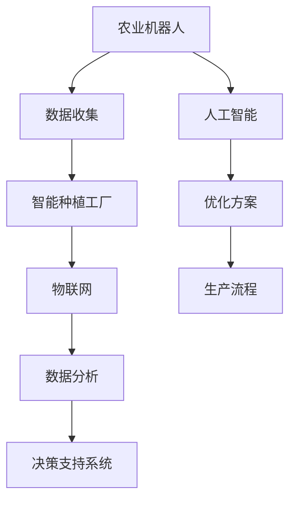

                 

关键词：智慧农业、农业机器人、智能种植工厂、物联网、可持续发展

> 摘要：随着科技的飞速发展，未来的农业将迎来前所未有的变革。本文将探讨2050年的智慧农业前景，重点分析农业机器人与智能种植工厂的技术应用，以及这些技术如何推动农业的可持续发展。

## 1. 背景介绍

在过去的几十年里，全球人口持续增长，而耕地资源却相对有限。传统农业面临着土地退化、水资源短缺、气候变化等多重挑战。为了应对这些挑战，智慧农业作为一种新兴的农业模式，逐渐受到广泛关注。智慧农业通过将信息技术、生物技术和工程技术的深度融合，实现农业的精准化、智能化和高效化。

### 1.1 智慧农业的定义

智慧农业，又称智能农业，是一种利用现代信息技术，如物联网、大数据、人工智能等，提高农业生产效率和产品质量的现代农业模式。它通过监测农作物生长环境、分析土壤和气候数据，以及应用自动化设备，实现农业生产的智能化管理。

### 1.2 智慧农业的发展历程

智慧农业的发展可以追溯到20世纪80年代的精准农业，那时候主要依赖GPS技术和遥感技术进行农田管理。随着物联网和人工智能技术的快速发展，智慧农业逐渐走向成熟。近年来，农业机器人与智能种植工厂的兴起，标志着智慧农业进入了一个全新的阶段。

## 2. 核心概念与联系

在智慧农业中，核心概念包括农业机器人、智能种植工厂、物联网、大数据、人工智能等。以下是这些概念的联系和作用的Mermaid流程图：



### 2.1 农业机器人

农业机器人是智慧农业中最重要的组成部分之一，它们可以执行多种任务，如播种、灌溉、收割、施肥、病虫害防治等。农业机器人的应用大大提高了农业生产效率，减少了人力成本。

### 2.2 智能种植工厂

智能种植工厂是一种高度自动化的农业设施，它可以模拟自然生长环境，为作物提供最优的生长条件。智能种植工厂通常配备有精准的灌溉系统、气候控制系统和营养供给系统。

### 2.3 物联网

物联网是连接农业机器人、智能种植工厂和数据分析系统的桥梁。通过物联网，各种传感器可以实时监测作物生长环境，并将数据传输到中央控制系统进行分析。

### 2.4 大数据和人工智能

大数据和人工智能技术可以对农业生产过程中的海量数据进行处理和分析，提供精准的决策支持。通过机器学习算法，可以预测作物生长趋势，优化生产方案。

## 3. 核心算法原理 & 具体操作步骤

### 3.1 算法原理概述

智慧农业中的核心算法主要包括数据采集、数据处理、预测模型和优化算法。以下是这些算法的原理概述：

#### 数据采集

数据采集是通过各种传感器实现的，如土壤湿度传感器、温度传感器、光照传感器等。这些传感器可以实时监测作物生长环境。

#### 数据处理

数据处理包括数据清洗、数据整合和数据可视化。数据清洗是为了去除噪声和错误数据，数据整合是将不同来源的数据进行合并，数据可视化则是为了更直观地展示数据。

#### 预测模型

预测模型是基于历史数据和机器学习算法建立的。通过预测模型，可以预测作物生长趋势、产量和病虫害发生情况。

#### 优化算法

优化算法用于优化生产过程，如灌溉、施肥和收割等。优化算法可以通过计算成本、效益和资源利用率等因素，提供最佳的生产方案。

### 3.2 算法步骤详解

以下是智慧农业算法的具体操作步骤：

#### 3.2.1 数据采集

1. 安装各种传感器，如土壤湿度传感器、温度传感器、光照传感器等。
2. 设置传感器的采样频率和数据传输方式。
3. 收集实时数据并上传到中央数据库。

#### 3.2.2 数据处理

1. 对采集到的数据进行预处理，包括数据清洗、数据整合和数据转换。
2. 将处理后的数据存储到数据库中，以便后续分析。

#### 3.2.3 预测模型

1. 从数据库中提取历史数据。
2. 使用机器学习算法建立预测模型。
3. 对预测模型进行训练和验证。

#### 3.2.4 优化算法

1. 根据预测模型提供的数据，制定优化方案。
2. 对优化方案进行模拟和评估。
3. 根据评估结果调整优化方案。

### 3.3 算法优缺点

#### 优点

1. 提高农业生产效率。
2. 降低生产成本。
3. 减少资源浪费。
4. 提高农产品质量。

#### 缺点

1. 初始投资较高。
2. 需要专业的技术支持。
3. 数据安全和隐私保护问题。

### 3.4 算法应用领域

智慧农业算法可以应用于多个领域，如：

1. 精准灌溉。
2. 精准施肥。
3. 病虫害防治。
4. 作物产量预测。
5. 农业资源管理。

## 4. 数学模型和公式 & 详细讲解 & 举例说明

### 4.1 数学模型构建

在智慧农业中，常用的数学模型包括回归模型、分类模型和优化模型。以下是这些模型的构建过程：

#### 回归模型

回归模型用于预测作物产量。其公式为：

$$
y = \beta_0 + \beta_1x_1 + \beta_2x_2 + ... + \beta_nx_n
$$

其中，$y$为作物产量，$x_1, x_2, ..., x_n$为影响作物产量的因素，$\beta_0, \beta_1, ..., \beta_n$为回归系数。

#### 分类模型

分类模型用于预测病虫害。其公式为：

$$
P(y = i) = \frac{e^{\theta_0 + \theta_1x_1 + \theta_2x_2 + ... + \theta_nx_n}}{\sum_{j=1}^K e^{\theta_0 + \theta_1x_1 + \theta_2x_2 + ... + \theta_nx_n}}
$$

其中，$P(y = i)$为病虫害发生的概率，$i$为病虫害种类，$x_1, x_2, ..., x_n$为影响病虫害发生的因素，$\theta_0, \theta_1, ..., \theta_n$为分类系数。

#### 优化模型

优化模型用于优化生产过程。其公式为：

$$
\min Z = c_1x_1 + c_2x_2 + ... + c_nx_n
$$

subject to

$$
a_{11}x_1 + a_{12}x_2 + ... + a_{1n}x_n \geq b_1
$$

$$
a_{21}x_1 + a_{22}x_2 + ... + a_{2n}x_n \geq b_2
$$

$$
...
$$

$$
a_{m1}x_1 + a_{m2}x_2 + ... + a_{mn}x_n \geq b_m
$$

其中，$Z$为目标函数，$c_1, c_2, ..., c_n$为权重系数，$a_{ij}, b_i$为约束条件。

### 4.2 公式推导过程

#### 回归模型的推导

假设我们有$m$个观测值$(x_{i1}, x_{i2}, ..., x_{in}, y_i)$，其中$i = 1, 2, ..., m$。我们希望通过这些观测值建立回归模型。

首先，计算每个特征的均值和方差：

$$
\bar{x_j} = \frac{1}{m}\sum_{i=1}^m x_{ij}, \quad \sigma^2_j = \frac{1}{m-1}\sum_{i=1}^m (x_{ij} - \bar{x_j})^2
$$

然后，计算回归系数：

$$
\beta_j = \frac{\sum_{i=1}^m (x_{ij} - \bar{x_j})(y_i - \bar{y})}{\sum_{i=1}^m (x_{ij} - \bar{x_j})^2}
$$

其中，$\bar{y} = \frac{1}{m}\sum_{i=1}^m y_i$。

#### 分类模型的推导

假设我们有$k$个类别$y \in \{1, 2, ..., k\}$，对于每个类别，我们有一个观测值$(x_{i1}, x_{i2}, ..., x_{in})$和标签$y_i$。

我们使用逻辑回归模型来预测每个类别的概率。逻辑回归模型的公式为：

$$
P(y = i) = \frac{e^{\theta_0 + \theta_1x_{i1} + \theta_2x_{i2} + ... + \theta_nx_{in}}}{\sum_{j=1}^k e^{\theta_0 + \theta_1x_{i1} + \theta_2x_{i2} + ... + \theta_nx_{in}}}
$$

其中，$\theta_0, \theta_1, ..., \theta_n$为分类系数。

#### 优化模型的推导

优化模型的目标是最小化目标函数$Z$，同时满足约束条件。

我们可以使用线性规划的方法来求解优化模型。线性规划的标准形式为：

$$
\min Z = c_1x_1 + c_2x_2 + ... + c_nx_n
$$

subject to

$$
a_{11}x_1 + a_{12}x_2 + ... + a_{1n}x_n \geq b_1
$$

$$
a_{21}x_1 + a_{22}x_2 + ... + a_{2n}x_n \geq b_2
$$

$$
...
$$

$$
a_{m1}x_1 + a_{m2}x_2 + ... + a_{mn}x_n \geq b_m
$$

其中，$c_1, c_2, ..., c_n$为权重系数，$a_{ij}, b_i$为约束条件。

### 4.3 案例分析与讲解

#### 案例背景

某农场种植小麦，需要制定灌溉方案以最大化产量。该农场的土壤湿度传感器提供了土壤湿度数据，温度传感器提供了温度数据，光照传感器提供了光照强度数据。

#### 数据收集

在一段时间内，收集了土壤湿度、温度和光照强度的数据，以及小麦产量数据。

#### 数据预处理

对收集到的数据进行预处理，包括数据清洗、数据整合和数据转换。例如，将温度数据转换为摄氏度，光照强度数据转换为lux。

#### 建立回归模型

使用回归模型预测小麦产量。选取土壤湿度、温度和光照强度作为特征，建立回归模型。回归模型的公式为：

$$
y = \beta_0 + \beta_1x_1 + \beta_2x_2 + \beta_3x_3
$$

其中，$y$为小麦产量，$x_1, x_2, x_3$分别为土壤湿度、温度和光照强度。

#### 训练回归模型

使用历史数据训练回归模型，计算回归系数$\beta_0, \beta_1, \beta_2, \beta_3$。

#### 预测小麦产量

使用训练好的回归模型预测小麦产量。输入当前土壤湿度、温度和光照强度数据，输出预测产量。

#### 制定灌溉方案

根据预测产量，制定灌溉方案。例如，当预测产量较低时，增加灌溉频率和水量。

#### 模拟和评估

模拟灌溉方案，评估灌溉方案对产量的影响。例如，增加灌溉频率和水量后，小麦产量是否提高。

#### 调整灌溉方案

根据模拟结果调整灌溉方案。例如，如果灌溉方案导致土壤湿度过高，可以减少灌溉频率和水量。

## 5. 项目实践：代码实例和详细解释说明

### 5.1 开发环境搭建

#### 硬件环境

- 树莓派或Arduino
- 土壤湿度传感器
- 温度传感器
- 光照传感器
- 无线模块

#### 软件环境

- Python 3.x
- Raspberry Pi OS 或 Arduino IDE

### 5.2 源代码详细实现

以下是使用Python和Raspberry Pi OS实现智慧农业的代码实例：

```python
import RPi.GPIO as GPIO
import time
import serial

# 设置GPIO引脚
GPIO.setmode(GPIO.BCM)
GPIO.setup(18, GPIO.IN)  # 土壤湿度传感器引脚
GPIO.setup(23, GPIO.IN)  # 温度传感器引脚
GPIO.setup(24, GPIO.IN)  # 光照传感器引脚

# 初始化串口通信
ser = serial.Serial('/dev/ttyUSB0', 9600)

while True:
    # 读取土壤湿度传感器数据
    soil_humidity = GPIO.input(18)
    # 读取温度传感器数据
    temperature = GPIO.input(23)
    # 读取光照传感器数据
    light_intensity = GPIO.input(24)

    # 将传感器数据发送到串口
    ser.write(str(soil_humidity).encode())
    ser.write(b',')
    ser.write(str(temperature).encode())
    ser.write(b',')
    ser.write(str(light_intensity).encode())
    ser.write(b'\n')

    # 等待1秒
    time.sleep(1)

# 关闭GPIO和串口
GPIO.cleanup()
ser.close()
```

### 5.3 代码解读与分析

上述代码实现了对土壤湿度、温度和光照传感器的数据采集，并通过串口将这些数据发送到中央控制系统进行分析。

- 第1行：引入GPIO库，用于控制树莓派的GPIO引脚。
- 第2行：引入time库，用于实现时间控制。
- 第3行：引入串口通信库，用于实现串口通信。
- 第4行：设置GPIO模式为BCM模式。
- 第5行：设置土壤湿度传感器引脚为输入模式。
- 第6行：设置温度传感器引脚为输入模式。
- 第7行：设置光照传感器引脚为输入模式。
- 第8行：初始化串口通信，设置串口号和波特率。
- 第9行：进入无限循环。
- 第10行：读取土壤湿度传感器数据。
- 第11行：读取温度传感器数据。
- 第12行：读取光照传感器数据。
- 第13行：将传感器数据通过串口发送到中央控制系统。
- 第14行：等待1秒，重复采集数据。
- 第17行：关闭GPIO引脚。
- 第18行：关闭串口。

### 5.4 运行结果展示

在运行上述代码后，传感器数据将实时采集并传输到中央控制系统进行分析。根据分析结果，中央控制系统将制定出相应的灌溉、施肥等方案，并通过无线模块发送到农业机器人执行。

## 6. 实际应用场景

### 6.1 农业机器人

农业机器人可以应用于多个领域，如：

1. **播种**：农业机器人可以自动进行播种，确保每颗种子都位于最佳位置。
2. **灌溉**：根据土壤湿度传感器提供的数据，农业机器人可以自动调整灌溉量。
3. **施肥**：根据土壤养分传感器提供的数据，农业机器人可以自动施肥。
4. **收割**：农业机器人可以自动收割作物，提高收割效率。
5. **病虫害防治**：农业机器人可以自动喷洒农药，防治病虫害。

### 6.2 智能种植工厂

智能种植工厂可以应用于多个领域，如：

1. **温室种植**：智能种植工厂可以模拟自然生长环境，为作物提供最优的生长条件。
2. **反季节种植**：智能种植工厂可以打破季节限制，实现全年种植。
3. **无土栽培**：智能种植工厂采用无土栽培技术，减少土地资源消耗。
4. **精准种植**：智能种植工厂通过物联网技术实现精准种植，提高作物产量和质量。

### 6.3 物联网

物联网技术可以应用于多个领域，如：

1. **环境监测**：物联网传感器可以实时监测土壤湿度、温度、光照强度等环境参数，为农业生产提供科学依据。
2. **设备监控**：物联网技术可以实时监控农业机器人和智能种植工厂的运行状态，确保设备正常运行。
3. **数据传输**：物联网技术可以实现农业数据的实时传输，为农业生产提供决策支持。

### 6.4 未来应用展望

随着科技的不断发展，未来的农业将更加智能化和高效化。以下是一些未来应用展望：

1. **无人农场**：无人农场将实现全程自动化，从播种到收割，全部由农业机器人完成。
2. **智慧农业平台**：智慧农业平台将整合物联网、大数据和人工智能技术，提供一站式农业生产解决方案。
3. **精准农业**：精准农业将实现作物生长环境的精确监控和调整，提高农业生产效率。
4. **生物农业**：生物农业将利用生物技术，如基因编辑和微生物发酵，提高作物产量和抗病虫害能力。

## 7. 工具和资源推荐

### 7.1 学习资源推荐

1. **书籍**：《智慧农业技术导论》、《智能农业：理论与实践》。
2. **在线课程**：Coursera上的“智慧农业与精准农业”课程。
3. **论文**：研究智慧农业的顶级学术期刊，如《农业工程学报》、《农业机械学报》。

### 7.2 开发工具推荐

1. **编程语言**：Python、Java、C++。
2. **开发框架**：TensorFlow、PyTorch、Keras。
3. **物联网平台**：阿里云物联网、华为云物联网、AWS IoT。

### 7.3 相关论文推荐

1. **智能农业机器人**：《智能农业机器人的设计与实现》。
2. **智能种植工厂**：《智能种植工厂：技术与应用》。
3. **物联网在农业中的应用**：《物联网技术在农业中的应用研究》。

## 8. 总结：未来发展趋势与挑战

### 8.1 研究成果总结

智慧农业通过将物联网、大数据和人工智能技术应用于农业生产，实现了农业生产的智能化、精准化和高效化。农业机器人和智能种植工厂在提高农业生产效率、降低生产成本和保障农产品质量方面发挥了重要作用。

### 8.2 未来发展趋势

1. **无人农场**：无人农场将成为未来农业的发展方向，实现全程自动化生产。
2. **智慧农业平台**：智慧农业平台将整合多种技术，提供一站式农业生产解决方案。
3. **精准农业**：精准农业将实现作物生长环境的精确监控和调整。
4. **生物农业**：生物农业将利用生物技术提高作物产量和抗病虫害能力。

### 8.3 面临的挑战

1. **技术难题**：智慧农业技术的研发和应用仍面临诸多技术难题，如数据安全、算法优化等。
2. **成本问题**：智慧农业的初始投资较高，对中小型农场主构成一定压力。
3. **政策支持**：智慧农业的发展需要政策支持，如税收优惠、补贴等。

### 8.4 研究展望

未来，智慧农业将不断融入新兴技术，如5G、区块链和基因编辑等，推动农业的可持续发展。同时，智慧农业的研究也将更加注重生态友好和资源高效利用，为实现全球农业的绿色转型贡献力量。

## 9. 附录：常见问题与解答

### 9.1 什么是智慧农业？

智慧农业是一种利用现代信息技术，如物联网、大数据、人工智能等，提高农业生产效率和产品质量的现代农业模式。

### 9.2 农业机器人有哪些功能？

农业机器人具有多种功能，如播种、灌溉、施肥、收割、病虫害防治等。

### 9.3 智能种植工厂有哪些优势？

智能种植工厂的优势包括：模拟自然生长环境、精准控制生长条件、提高作物产量和质量、降低生产成本等。

### 9.4 智慧农业的未来发展趋势是什么？

智慧农业的未来发展趋势包括：无人农场、智慧农业平台、精准农业和生物农业等。

### 9.5 智慧农业面临的挑战有哪些？

智慧农业面临的挑战包括：技术难题、成本问题、政策支持等。

----------------------------------------------------------------

### 作者署名

作者：禅与计算机程序设计艺术 / Zen and the Art of Computer Programming

（完）

