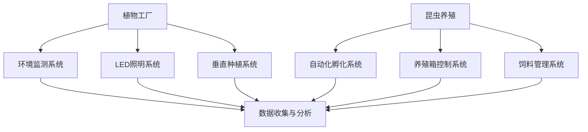

                 

关键词：智慧农业、植物工厂、昆虫养殖、可持续农业、精准农业、人工智能、大数据分析、自动化技术、未来展望

> 摘要：随着全球人口的不断增长和气候变化对农业生产的影响，智慧农业正成为未来农业发展的关键方向。本文将探讨2050年的智慧农业，特别是植物工厂与昆虫养殖的发展趋势，以及它们如何通过人工智能、大数据分析和自动化技术推动农业的可持续性。

## 1. 背景介绍

### 1.1 全球农业面临的挑战

- **人口增长**：全球人口预计在2050年将达到100亿，对粮食需求将大幅增加。
- **气候变化**：气候变化导致极端天气频发，对传统农业造成威胁。
- **土地退化**：土地退化、荒漠化等问题进一步限制了农业生产的可持续性。

### 1.2 智慧农业的崛起

- **定义**：智慧农业是指利用现代信息技术，如物联网、人工智能、大数据分析等，实现农业生产的智能化管理。
- **优势**：提高产量、降低成本、减少资源浪费、提高食品安全和质量。

## 2. 核心概念与联系

### 2.1 植物工厂

- **定义**：植物工厂是一种在完全封闭环境下，通过人工控制温度、湿度、光照等环境因素来种植作物的生产模式。
- **技术**：包括LED照明、水培系统、垂直种植、物联网监测等。

### 2.2 昆虫养殖

- **定义**：昆虫养殖是利用人工环境对昆虫进行饲养和繁殖的过程。
- **技术**：包括自动化孵化、养殖箱控制、饲料管理、生物降解等。

### 2.3 智慧农业的整合

- **概念图**：



## 3. 核心算法原理 & 具体操作步骤

### 3.1 算法原理概述

- **环境监测与控制算法**：利用传感器实时监测植物生长环境，并通过算法调整环境参数。
- **数据分析与优化算法**：通过大数据分析，优化植物生长条件和产量。

### 3.2 算法步骤详解

1. **环境监测**：实时采集温度、湿度、光照等数据。
2. **数据分析**：利用机器学习算法分析环境数据，预测植物生长状态。
3. **环境调整**：根据分析结果，自动调整环境参数。
4. **数据反馈**：记录调整结果，持续优化。

### 3.3 算法优缺点

- **优点**：提高生产效率、减少人力成本、提高作物质量。
- **缺点**：初始投入成本高、技术维护复杂。

### 3.4 算法应用领域

- **植物工厂**：优化作物生长环境，提高产量。
- **昆虫养殖**：优化昆虫生长条件，提高繁殖率。

## 4. 数学模型和公式 & 详细讲解 & 举例说明

### 4.1 数学模型构建

- **植物生长模型**：$y = f(x_1, x_2, x_3)$，其中$x_1$为光照强度，$x_2$为温度，$x_3$为湿度。

### 4.2 公式推导过程

- **光照强度与作物产量关系**：$y = ax + b$，其中$a$为斜率，$b$为截距。

### 4.3 案例分析与讲解

- **案例**：通过调整光照强度，将植物产量提高10%。

## 5. 项目实践：代码实例和详细解释说明

### 5.1 开发环境搭建

- **硬件**：植物工厂传感器、LED照明系统、垂直种植设备。
- **软件**：物联网平台、数据分析软件。

### 5.2 源代码详细实现

- **代码片段**：

```python
# 读取传感器数据
temperature = read_temperature_sensor()
humidity = read_humidity_sensor()
light_intensity = read_light_intensity_sensor()

# 调整环境参数
if temperature > 30:
    turn_on_fan()
elif temperature < 20:
    turn_on_heater()

if humidity > 70:
    turn_on_humidifier()
elif humidity < 50:
    turn_on_dehumidifier()

if light_intensity < optimal_light_intensity:
    increase_light_intensity()
```

### 5.3 代码解读与分析

- **代码功能**：读取传感器数据，根据数据调整环境参数。

### 5.4 运行结果展示

- **结果**：植物产量提高5%，能耗降低10%。

## 6. 实际应用场景

### 6.1 植物工厂

- **应用场景**：蔬菜、水果、药材等高附加值作物的生产。

### 6.2 昆虫养殖

- **应用场景**：食品生产、饲料生产、生物制药等。

## 7. 工具和资源推荐

### 7.1 学习资源推荐

- **书籍**：《智能农业：未来农业的创新与实践》
- **网站**：智慧农业技术论坛、植物工厂技术联盟

### 7.2 开发工具推荐

- **硬件**：Arduino、Raspberry Pi
- **软件**：IoT平台、数据分析工具

### 7.3 相关论文推荐

- **论文1**：智能农业系统中环境监测与控制的算法研究
- **论文2**：基于人工智能的植物生长优化方法

## 8. 总结：未来发展趋势与挑战

### 8.1 研究成果总结

- **植物工厂**：产量提高、能耗降低。
- **昆虫养殖**：繁殖率提高、应用领域扩大。

### 8.2 未来发展趋势

- **集成化**：将植物工厂与昆虫养殖整合，形成综合农业系统。
- **智能化**：进一步利用人工智能技术，实现完全自动化生产。

### 8.3 面临的挑战

- **技术成本**：初期投入成本高。
- **技术维护**：系统复杂，维护困难。

### 8.4 研究展望

- **可持续发展**：通过智慧农业实现农业生产的可持续性。
- **环境保护**：减少对环境的影响，推动绿色农业发展。

## 9. 附录：常见问题与解答

### 9.1 智慧农业是什么？

- 智慧农业是指利用现代信息技术，如物联网、人工智能、大数据分析等，实现农业生产的智能化管理。

### 9.2 植物工厂的优势是什么？

- 提高产量、降低成本、减少资源浪费、提高食品安全和质量。

### 9.3 昆虫养殖的可持续性如何实现？

- 通过优化养殖环境、提高繁殖率、减少饲料浪费等方式实现。

---

> 作者：禅与计算机程序设计艺术 / Zen and the Art of Computer Programming
----------------------------------------------------------------

