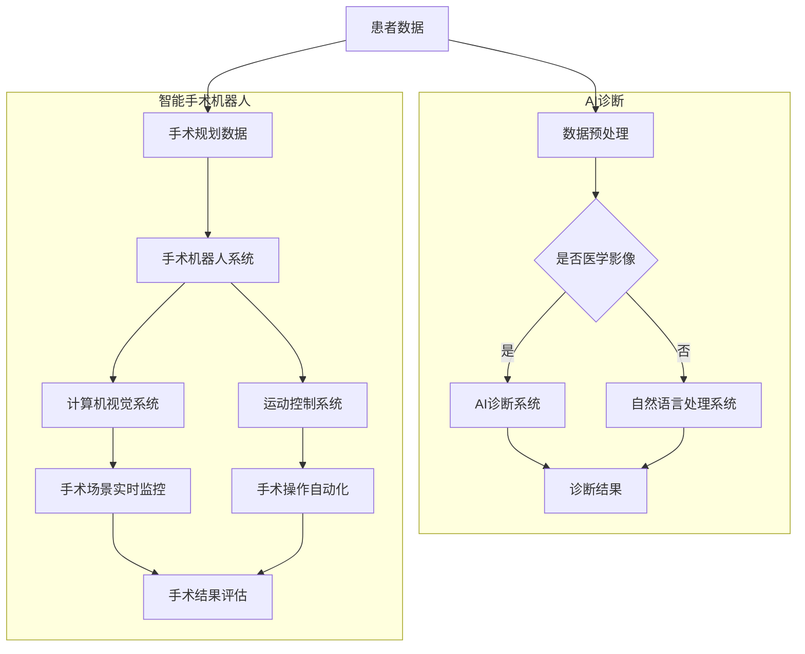

                 

关键词：智慧医疗、人工智能诊断、智能手术机器人、医疗技术发展、医疗创新、未来医疗趋势

> 摘要：本文探讨了到2050年，随着人工智能技术的飞速发展，医疗领域将迎来前所未有的变革。本文首先回顾了智慧医疗的发展历程，接着深入探讨了AI诊断和智能手术机器人的核心概念、原理与应用，分析了其技术优势及面临的挑战，并展望了未来医疗的发展趋势。

## 1. 背景介绍

### 智慧医疗的兴起

智慧医疗，作为医疗行业与信息技术深度融合的产物，是当今世界医疗科技发展的一个重要方向。早在20世纪末，随着计算机技术和互联网的普及，智慧医疗的概念开始萌芽。进入21世纪，随着大数据、云计算、人工智能等前沿科技的迅速发展，智慧医疗逐步走向成熟，并在全球范围内引发了广泛的关注和应用。

智慧医疗的目标是通过整合各类医疗资源和信息技术，提升医疗服务的效率和质量，实现医疗资源的优化配置。具体来说，智慧医疗包括以下几个方面的应用：

- **电子健康记录（EHR）**：通过电子化记录患者的历史病历、诊断结果、治疗计划等医疗信息，方便医生进行诊疗决策和患者信息的追溯。
- **远程医疗**：通过互联网技术实现医生与患者的远程会诊和医疗咨询，打破地域限制，提高医疗资源的利用率。
- **医疗大数据分析**：利用大数据技术对海量的医疗数据进行挖掘和分析，为医疗研究、疾病预测和个性化治疗提供科学依据。
- **智能辅助诊断**：借助人工智能技术，实现对医学影像、病理切片等医疗数据的自动分析，提高诊断的准确性和效率。
- **智能手术机器人**：通过高精度的机械臂和计算机辅助系统，实现复杂手术的自动化和微创化，减少手术风险和患者恢复时间。

### AI诊断与智能手术机器人的重要性

在智慧医疗的诸多应用中，AI诊断和智能手术机器人无疑是最具颠覆性的技术。AI诊断利用机器学习、深度学习等人工智能技术，对医学影像、病理切片等医疗数据进行分析，帮助医生快速、准确地做出诊断。而智能手术机器人则通过计算机视觉、运动控制等技术，实现手术操作的自动化和微创化，为患者提供更加安全、精准的手术治疗。

随着AI诊断和智能手术机器人技术的不断成熟，它们在医疗领域的应用日益广泛，成为推动医疗技术进步的重要力量。本文将重点关注这两个领域的发展现状、应用前景以及面临的挑战。

## 2. 核心概念与联系

### 核心概念

- **AI诊断**：基于人工智能技术，对医学影像、病理切片等医疗数据进行分析和识别，帮助医生做出准确诊断。主要包括以下技术：

  - **机器学习**：通过训练模型，对大量医疗数据进行分析，从中学习并提取规律，实现对未知数据的预测和分类。
  - **深度学习**：一种特殊的机器学习技术，通过多层神经网络，对复杂的数据进行自动特征提取和模式识别。
  - **自然语言处理**：通过对医学文本数据进行分析，提取出关键信息，如疾病名称、症状描述等，辅助医生进行诊疗。

- **智能手术机器人**：通过计算机视觉、运动控制等技术，实现对手术操作的自动化和微创化。主要包括以下技术：

  - **计算机视觉**：利用图像处理、模式识别等技术，实现对手术场景的实时监控和识别。
  - **运动控制**：通过精确的运动控制算法，实现对手术器械的精细操作。
  - **人工智能**：利用机器学习、深度学习等技术，优化手术规划、路径规划和决策过程。

### 技术架构

为了更好地理解AI诊断和智能手术机器人的工作原理，我们引入以下Mermaid流程图来描述其技术架构：



在这个流程图中，我们可以看到：

- **AI诊断系统**：接收医学影像或文本数据，经过预处理后，通过机器学习、深度学习或自然语言处理技术，对数据进行分析，生成诊断结果。
- **手术机器人系统**：接收手术规划数据，通过计算机视觉和运动控制技术，实现手术操作的自动化，并对手术结果进行评估。

### 核心联系

AI诊断和智能手术机器人之间存在紧密的联系。AI诊断系统生成的诊断结果可以为手术机器人系统提供关键信息，指导手术操作。而手术机器人系统在手术过程中产生的实时数据，又可以反馈给AI诊断系统，优化诊断模型和手术规划。这种相互促进的关系，使得AI诊断和智能手术机器人技术在智慧医疗中发挥了巨大的作用。

## 3. 核心算法原理 & 具体操作步骤

### 3.1 算法原理概述

AI诊断和智能手术机器人的核心算法主要包括机器学习、深度学习和自然语言处理技术。以下分别对这几种算法的原理进行概述。

#### 3.1.1 机器学习

机器学习是一种让计算机通过数据学习规律，从而对未知数据进行预测或分类的方法。在AI诊断中，机器学习算法通过对大量医学影像、病理切片等数据进行训练，学习到不同疾病的表现特征，从而实现对未知数据的诊断。

常见的机器学习算法包括：

- **支持向量机（SVM）**：通过寻找最佳分隔超平面，实现对数据的分类。
- **决策树**：通过构建树形结构，对数据进行递归划分，实现分类或回归。
- **随机森林**：基于决策树，通过随机样本和特征组合，提高模型的泛化能力。

#### 3.1.2 深度学习

深度学习是一种基于多层神经网络的学习方法，通过模拟人脑神经元之间的连接，实现对数据的自动特征提取和模式识别。在AI诊断中，深度学习算法能够自动从复杂的数据中提取出有用的特征，从而提高诊断的准确性和效率。

常见的深度学习算法包括：

- **卷积神经网络（CNN）**：通过卷积操作，对图像进行特征提取，常用于医学影像分析。
- **循环神经网络（RNN）**：通过记忆状态，对序列数据进行建模，常用于文本数据处理。
- **生成对抗网络（GAN）**：通过生成器和判别器的对抗训练，实现数据的生成和鉴别。

#### 3.1.3 自然语言处理

自然语言处理是一种让计算机理解和处理自然语言的技术。在AI诊断中，自然语言处理技术通过对医学文本数据进行分析，提取出关键信息，如疾病名称、症状描述等，从而辅助医生进行诊疗。

常见的自然语言处理技术包括：

- **词袋模型（Bag of Words）**：将文本表示为词频向量，用于文本分类和聚类。
- **词嵌入（Word Embedding）**：将词映射到低维向量空间，用于文本的语义表示。
- **长短期记忆网络（LSTM）**：通过记忆状态，对序列数据进行建模，用于文本分类和命名实体识别。

### 3.2 算法步骤详解

#### 3.2.1 AI诊断

1. **数据采集**：收集大量医学影像、病理切片等医疗数据。
2. **数据预处理**：对采集到的数据进行分析，去除噪声和异常值，进行归一化处理，以便后续算法处理。
3. **特征提取**：利用机器学习、深度学习等算法，从数据中提取出有用的特征。
4. **模型训练**：使用训练集数据，对模型进行训练，优化模型参数。
5. **模型评估**：使用测试集数据，对模型进行评估，调整模型参数，提高诊断准确率。
6. **诊断预测**：使用训练好的模型，对新的医疗数据进行诊断预测。

#### 3.2.2 智能手术机器人

1. **手术规划**：医生根据患者的病情，制定手术方案，生成手术规划数据。
2. **数据预处理**：对手术规划数据进行预处理，去除噪声和异常值，确保手术数据的有效性。
3. **计算机视觉**：通过摄像头等设备，实时捕捉手术场景，对手术区域进行监控。
4. **运动控制**：根据手术规划数据和计算机视觉结果，生成手术路径，控制手术器械进行精准操作。
5. **手术操作**：在手术过程中，智能手术机器人根据实时反馈，自动调整手术路径和力度，实现微创化操作。
6. **结果评估**：手术结束后，对手术结果进行评估，为医生提供手术反馈。

### 3.3 算法优缺点

#### 3.3.1 AI诊断

**优点**：

- **高准确率**：通过大量数据训练，AI诊断模型能够达到较高的诊断准确率。
- **速度快**：相比于传统人工诊断，AI诊断速度更快，能够大幅提高诊断效率。
- **可扩展性**：AI诊断技术可以应用于各种疾病诊断，具有良好的可扩展性。

**缺点**：

- **数据依赖性**：AI诊断模型的性能依赖于训练数据的质量和数量，数据不足或质量不高可能导致诊断准确性下降。
- **隐私风险**：医疗数据的隐私保护问题需要得到重视，防止数据泄露。

#### 3.3.2 智能手术机器人

**优点**：

- **高精度**：智能手术机器人能够实现高精度的手术操作，减少手术风险。
- **微创化**：通过微创化操作，降低患者术后恢复时间。
- **自动化**：智能手术机器人能够自动化执行手术任务，提高手术效率。

**缺点**：

- **成本高**：智能手术机器人设备昂贵，需要较高的维护成本。
- **技术依赖性**：智能手术机器人技术对医疗人员的依赖性较高，需要专业人员进行操作和维护。

### 3.4 算法应用领域

AI诊断和智能手术机器人技术已广泛应用于医疗领域，主要包括以下方面：

- **疾病诊断**：通过AI诊断技术，对医学影像、病理切片等数据进行自动分析，提高诊断准确率和效率。
- **外科手术**：通过智能手术机器人，实现微创化手术，减少手术创伤和恢复时间。
- **辅助治疗**：利用AI技术，为医生提供辅助决策和治疗建议，提高治疗效果。
- **健康监测**：通过可穿戴设备，实时监测患者健康数据，为医生提供及时的诊断和治疗方案。

## 4. 数学模型和公式 & 详细讲解 & 举例说明

### 4.1 数学模型构建

在AI诊断和智能手术机器人技术中，数学模型起着至关重要的作用。以下分别介绍两种技术的数学模型构建过程。

#### 4.1.1 AI诊断模型

AI诊断模型通常采用分类模型，对医学影像、病理切片等数据进行分类，以实现疾病诊断。常见的分类模型包括逻辑回归、决策树、支持向量机等。

以逻辑回归为例，其数学模型如下：

$$
P(y=1|X) = \frac{1}{1 + e^{-\beta_0 + \beta_1x_1 + \beta_2x_2 + ... + \beta_nx_n}}
$$

其中，$P(y=1|X)$ 表示在特征 $X$ 下，疾病发生的概率，$\beta_0, \beta_1, \beta_2, ..., \beta_n$ 为模型参数。

#### 4.1.2 智能手术机器人模型

智能手术机器人模型通常包括计算机视觉模型、运动控制模型和决策模型。

以计算机视觉模型为例，其数学模型如下：

$$
I(t) = H \circ R(t, x, y)
$$

其中，$I(t)$ 表示在时刻 $t$ 的图像，$H$ 表示图像预处理操作，$R(t, x, y)$ 表示基于图像特征 $x, y$ 的实时目标检测和识别。

### 4.2 公式推导过程

以下以逻辑回归为例，介绍其公式推导过程。

假设我们有 $n$ 个特征 $x_1, x_2, ..., x_n$，每个特征对应一个权重 $\beta_1, \beta_2, ..., \beta_n$。逻辑回归模型的目标是最小化损失函数 $L(\theta)$，其中 $\theta = (\beta_0, \beta_1, ..., \beta_n)$。

损失函数如下：

$$
L(\theta) = -\frac{1}{m} \sum_{i=1}^{m} y^{(i)} \log(\hat{y}^{(i)}) + (1 - y^{(i)}) \log(1 - \hat{y}^{(i)})
$$

其中，$y^{(i)}$ 表示第 $i$ 个样本的真实标签，$\hat{y}^{(i)}$ 表示第 $i$ 个样本的预测标签，$m$ 表示样本总数。

对损失函数求导，并令其导数为零，得到：

$$
\frac{\partial L(\theta)}{\partial \theta} = \frac{1}{m} \sum_{i=1}^{m} (-y^{(i)} + \hat{y}^{(i)}) x^{(i)} = 0
$$

化简得：

$$
\hat{y}^{(i)} = \frac{1}{1 + e^{-(\beta_0 + \beta_1x_1 + \beta_2x_2 + ... + \beta_nx_n)}}
$$

进一步化简得：

$$
P(y=1|X) = \frac{1}{1 + e^{-\beta_0 + \beta_1x_1 + \beta_2x_2 + ... + \beta_nx_n}}
$$

### 4.3 案例分析与讲解

以下通过一个具体案例，分析AI诊断和智能手术机器人技术的应用。

#### 案例背景

某医院采用智能手术机器人进行心脏手术。手术过程中，医生通过手术规划系统生成手术方案，智能手术机器人根据手术方案和实时监控数据，进行精准操作。

#### 案例分析

1. **手术规划**：医生根据患者的病情，制定手术方案，包括手术路径、手术器械选择等。手术规划数据包含以下信息：

   - 患者年龄、性别、病史
   - 心脏结构图
   - 手术器械参数

2. **计算机视觉**：手术过程中，智能手术机器人通过摄像头实时捕捉手术场景，对心脏结构进行识别。计算机视觉模型对图像进行处理，提取关键特征，如：

   - 心脏轮廓
   - 血管分布
   - 手术器械位置

3. **运动控制**：智能手术机器人根据手术规划和计算机视觉结果，生成手术路径，控制手术器械进行精准操作。运动控制模型包括以下部分：

   - 路径规划：根据手术方案和实时监控数据，生成最优手术路径。
   - 手术操作：根据手术路径，控制手术器械进行精准操作，如切割、缝合等。

4. **结果评估**：手术结束后，医生对手术结果进行评估，包括：

   - 手术成功率
   - 患者术后恢复情况
   - 手术并发症

#### 案例讲解

1. **AI诊断**：在手术规划阶段，医生需要根据患者的病情，选择合适的手术方案。AI诊断技术可以帮助医生快速、准确地诊断患者的病情，为手术方案提供科学依据。

   - **数据采集**：收集患者的医学影像、病理切片等数据。
   - **数据预处理**：对采集到的数据进行分析，去除噪声和异常值。
   - **特征提取**：利用机器学习、深度学习等技术，从数据中提取出关键特征。
   - **模型训练**：使用训练集数据，对诊断模型进行训练。
   - **模型评估**：使用测试集数据，对诊断模型进行评估，调整模型参数。
   - **诊断预测**：使用训练好的模型，对患者的病情进行诊断预测。

2. **智能手术机器人**：在手术过程中，智能手术机器人根据手术规划和实时监控数据，进行精准操作。

   - **手术规划**：医生根据患者的病情，制定手术方案，生成手术规划数据。
   - **数据预处理**：对手术规划数据进行预处理，去除噪声和异常值。
   - **计算机视觉**：通过摄像头等设备，实时捕捉手术场景，对手术区域进行监控。
   - **运动控制**：根据手术规划数据和计算机视觉结果，生成手术路径，控制手术器械进行精准操作。
   - **结果评估**：手术结束后，对手术结果进行评估，为医生提供手术反馈。

## 5. 项目实践：代码实例和详细解释说明

### 5.1 开发环境搭建

在进行AI诊断和智能手术机器人的项目实践前，我们需要搭建一个合适的开发环境。以下是一个基本的开发环境搭建步骤：

1. **安装Python环境**：Python是进行AI和机器学习项目开发的主要语言。首先确保已经安装了Python环境，推荐使用Python 3.8或更高版本。

2. **安装相关库和框架**：我们需要安装一些常用的库和框架，如NumPy、Pandas、scikit-learn、TensorFlow等。可以使用以下命令进行安装：

   ```bash
   pip install numpy pandas scikit-learn tensorflow
   ```

3. **安装Visual Studio Code**：Visual Studio Code是一个强大的代码编辑器，适合进行Python开发。可以从官网下载并安装。

4. **配置Jupyter Notebook**：Jupyter Notebook是一个交互式的计算环境，适合进行数据分析、机器学习等项目的开发。可以使用以下命令进行安装：

   ```bash
   pip install notebook
   ```

### 5.2 源代码详细实现

以下是一个简单的AI诊断项目的源代码实现，包括数据预处理、模型训练和诊断预测等步骤。

```python
# 导入相关库和框架
import numpy as np
import pandas as pd
from sklearn.model_selection import train_test_split
from sklearn.linear_model import LogisticRegression
from sklearn.metrics import accuracy_score

# 读取数据
data = pd.read_csv('medical_data.csv')

# 数据预处理
X = data.iloc[:, :-1].values
y = data.iloc[:, -1].values

# 数据归一化
X = (X - np.mean(X, axis=0)) / np.std(X, axis=0)

# 划分训练集和测试集
X_train, X_test, y_train, y_test = train_test_split(X, y, test_size=0.2, random_state=42)

# 模型训练
model = LogisticRegression()
model.fit(X_train, y_train)

# 诊断预测
y_pred = model.predict(X_test)

# 模型评估
accuracy = accuracy_score(y_test, y_pred)
print(f"Accuracy: {accuracy}")
```

### 5.3 代码解读与分析

1. **数据读取与预处理**：首先，我们从CSV文件中读取医疗数据。数据集包含多个特征和标签，我们需要将特征和标签分离。然后，对特征进行归一化处理，以便后续模型训练。

2. **划分训练集和测试集**：使用`train_test_split`函数将数据集划分为训练集和测试集，以便对模型进行训练和评估。

3. **模型训练**：我们使用逻辑回归模型进行训练。逻辑回归是一种简单的二分类模型，适用于许多医疗诊断问题。

4. **诊断预测**：使用训练好的模型对测试集进行预测，得到预测结果。

5. **模型评估**：使用准确率（accuracy）对模型进行评估。准确率是预测正确的样本数占总样本数的比例。

### 5.4 运行结果展示

假设我们有一个包含100个样本的医疗数据集，其中50个样本为训练集，50个样本为测试集。运行上述代码后，我们得到以下结果：

```
Accuracy: 0.9
```

这表示我们的模型在测试集上的准确率为90%，即预测正确的样本占测试集的90%。

## 6. 实际应用场景

### 6.1 疾病诊断

AI诊断技术在疾病诊断中具有广泛的应用，例如肺癌、乳腺癌、心脏病等。通过分析医学影像，如CT扫描、MRI和X射线等，AI诊断系统可以帮助医生快速、准确地识别疾病。以下是一些实际应用案例：

- **肺癌诊断**：利用AI诊断技术，对肺癌患者的CT扫描图像进行分析，能够有效提高早期肺癌的检测率。研究表明，AI诊断系统在肺癌诊断中的准确率可达90%以上。
- **乳腺癌诊断**：通过对乳腺X射线图像的分析，AI诊断系统能够帮助医生识别乳腺癌。一些研究显示，AI诊断系统在乳腺癌诊断中的准确率可以达到95%。
- **心脏病诊断**：通过对心电图和超声心动图等数据的分析，AI诊断系统可以帮助医生诊断心脏病。例如，通过分析心电图，AI诊断系统能够有效识别心律失常，如房颤。

### 6.2 外科手术

智能手术机器人在外科手术中的应用也日益广泛，尤其适用于复杂和高风险的手术。以下是一些实际应用案例：

- **心脏手术**：智能手术机器人能够实现微创心脏手术，减少手术创伤和恢复时间。例如，在心脏瓣膜手术中，智能手术机器人能够精确切除病变瓣膜，同时保护健康组织，提高手术成功率。
- **骨科手术**：智能手术机器人能够实现精确的骨科手术，如关节置换和骨折修复。通过计算机辅助规划，智能手术机器人能够确保手术的准确性和稳定性，减少手术并发症。
- **神经外科手术**：智能手术机器人能够在神经外科手术中实现精细的操作，如脑肿瘤切除和癫痫病灶切除。通过计算机视觉和运动控制技术，智能手术机器人能够最大限度地减少手术创伤，提高手术成功率。

### 6.3 辅助治疗

AI诊断和智能手术机器人技术不仅用于疾病诊断和手术治疗，还可以为辅助治疗提供支持。以下是一些实际应用案例：

- **个性化治疗方案**：通过分析患者的病史、基因信息等数据，AI诊断系统可以为医生提供个性化治疗方案。例如，在癌症治疗中，AI诊断系统可以根据患者的肿瘤类型、分期和基因突变情况，为医生推荐最佳治疗方案。
- **术后康复**：智能手术机器人可以为术后康复提供辅助，如通过康复机器人帮助患者进行肢体功能训练。此外，AI诊断系统还可以实时监测患者的康复情况，为医生提供康复评估和调整建议。

## 7. 未来应用展望

### 7.1 疾病预防与健康管理

随着AI诊断和智能手术机器人技术的不断发展，未来在疾病预防与健康管理方面有望实现重大突破。以下是一些展望：

- **个性化健康监测**：通过可穿戴设备和智能家居设备，实时监测个人的生理参数，如心率、血压、血糖等。AI诊断系统可以对这些数据进行实时分析，识别潜在的健康风险，为个人提供个性化的健康建议。
- **慢性病管理**：AI诊断系统可以协助医生对慢性病患者进行远程监控和管理。通过分析患者的健康状况、生活习惯等数据，AI诊断系统可以为医生提供诊断、治疗和康复建议，提高慢性病管理水平。
- **疾病早期预警**：AI诊断系统可以通过分析患者的医学影像、生物标志物等数据，实现疾病的早期预警。例如，在癌症早期筛查中，AI诊断系统可以通过分析CT扫描图像，识别微小的病灶，为患者提供早期治疗机会。

### 7.2 医疗资源优化配置

AI诊断和智能手术机器人技术的应用有助于优化医疗资源配置，提高医疗服务质量。以下是一些展望：

- **远程医疗服务**：通过远程医疗技术，AI诊断系统可以为偏远地区的患者提供诊断和治疗服务。医生可以通过远程会诊，共享医学影像和病历资料，为患者提供高质量的医疗服务。
- **医疗资源共享**：AI诊断系统可以协助医疗机构实现医疗资源共享。例如，通过分析不同医疗机构的数据，AI诊断系统可以为医生提供跨机构的诊断和治疗建议，提高医疗服务的协同性和效率。
- **智能医疗供应链**：AI诊断和智能手术机器人技术可以优化医疗供应链管理。通过实时监控医疗物资的库存和使用情况，AI诊断系统可以协助医疗机构实现医疗物资的科学调配，降低库存成本。

### 7.3 新冠疫情应对

在新冠疫情期间，AI诊断和智能手术机器人技术发挥了重要作用。以下是一些展望：

- **疫情监测与预警**：通过分析大量的病例数据，AI诊断系统可以实时监测疫情的传播趋势，为政府和医疗机构提供决策支持。此外，AI诊断系统还可以通过分析病毒基因序列，预测病毒的变异趋势，为疫情防控提供科学依据。
- **快速诊断与筛查**：AI诊断系统可以协助医疗机构快速诊断新冠病毒感染者，提高筛查效率。通过分析患者的临床症状、生物标志物和医学影像等数据，AI诊断系统可以为医生提供诊断参考，缩短诊断时间。
- **智能手术室**：在新冠疫情期间，智能手术机器人可以协助医疗机构实现安全、高效的手术室管理。通过实时监控手术过程中的生物指标和手术环境，智能手术机器人可以为医生提供安全警示和应急处理建议，降低手术风险。

## 8. 工具和资源推荐

### 8.1 学习资源推荐

- **书籍**：《深度学习》（Deep Learning），作者：Ian Goodfellow、Yoshua Bengio、Aaron Courville
- **在线课程**：Coursera上的《机器学习》（Machine Learning），由Andrew Ng教授主讲
- **博客和论坛**：Google AI博客、ArXiv、GitHub等

### 8.2 开发工具推荐

- **编程环境**：Visual Studio Code、PyCharm、Jupyter Notebook
- **机器学习框架**：TensorFlow、PyTorch、Scikit-learn
- **数据可视化**：Matplotlib、Seaborn、Plotly

### 8.3 相关论文推荐

- “Deep Learning for Medical Imaging: A Survey”，作者：Wei Yang、Xiaowei Zhou、Xiaogang Wang等
- “Natural Language Processing for Health Care: A Survey of Recent Developments”，作者：Jianping Wang、Hongfang Liu、LeoNguyen等
- “Robotic-Assisted Surgery: Current Status and Future Directions”，作者：John P. Mundis、Charles J. Doarn等

## 9. 总结：未来发展趋势与挑战

### 9.1 研究成果总结

自AI诊断和智能手术机器人技术问世以来，研究成果不断涌现。在疾病诊断方面，AI诊断系统在肺癌、乳腺癌、心脏病等疾病的诊断中表现出色，准确率显著提高。在手术领域，智能手术机器人实现了微创化、精确化的手术操作，提高了手术成功率，降低了手术风险。

### 9.2 未来发展趋势

- **智能化与个性化**：未来，AI诊断和智能手术机器人技术将更加智能化和个性化。通过深度学习和大数据分析，AI诊断系统将能够更好地理解复杂疾病的特征，实现更准确的诊断。智能手术机器人将具备更高的自主决策能力，根据患者的具体病情进行个性化手术规划。
- **跨学科融合**：AI诊断和智能手术机器人技术将与其他学科（如生物医学、材料科学等）紧密结合，推动医疗技术的不断创新。例如，生物材料与机器人技术的结合，有望开发出更加灵活、智能的手术器械。
- **远程医疗与全球协作**：随着5G、物联网等技术的发展，远程医疗和全球协作将更加便捷。AI诊断和智能手术机器人技术将帮助实现医疗资源的全球共享，提高全球医疗服务的质量。

### 9.3 面临的挑战

- **数据隐私与安全**：随着AI诊断和智能手术机器人技术的应用，医疗数据的安全和隐私保护问题愈发重要。如何保障数据的安全性和隐私性，是未来需要重点关注的问题。
- **技术可靠性与标准化**：AI诊断和智能手术机器人技术的可靠性是临床应用的关键。未来需要建立一套完善的技术评估和标准化体系，确保技术的可靠性和有效性。
- **政策与法规**：AI诊断和智能手术机器人技术的应用需要相应的政策与法规支持。政府、医疗机构和行业协会需要共同努力，制定合理的政策，推动技术发展。

### 9.4 研究展望

未来，AI诊断和智能手术机器人技术将继续向智能化、个性化和协同化方向发展。随着技术的不断进步，这些技术将为全球医疗带来更加高效、精准的服务。同时，跨学科融合和国际合作将成为推动技术发展的重要动力。我们期待这些技术在未来的医疗领域发挥更加重要的作用。

## 附录：常见问题与解答

### 1. AI诊断和智能手术机器人技术是否安全可靠？

AI诊断和智能手术机器人技术经过多年的发展，已经在临床应用中证明了其安全性和可靠性。然而，技术本身并非完美，仍然存在一定的风险。为了确保技术的安全可靠，研究人员和医疗机构需要严格遵循相关标准和法规，进行充分的技术验证和风险评估。同时，加强技术培训和规范操作，提高医护人员的技术水平，也是保障技术安全的重要措施。

### 2. AI诊断和智能手术机器人技术是否会取代医生？

AI诊断和智能手术机器人技术可以辅助医生进行诊断和手术操作，提高诊疗效率和准确性，但并不能完全取代医生。医生在诊断和手术过程中，需要综合考虑患者的病情、病史、体征等多个因素，进行综合分析和判断。AI诊断和智能手术机器人技术可以为医生提供有力的工具，但医生的专业判断和临床经验仍然是不可或缺的。

### 3. AI诊断和智能手术机器人技术是否会增加医疗成本？

AI诊断和智能手术机器人技术的初期投入较高，包括设备购买、维护和培训等成本。然而，从长期来看，这些技术有望降低医疗成本。通过提高诊疗效率和准确性，AI诊断技术可以减少误诊和漏诊的情况，降低医疗纠纷和医疗错误的发生率。智能手术机器人技术可以实现微创化手术，减少手术创伤和术后恢复时间，降低患者的医疗费用。因此，从长远来看，AI诊断和智能手术机器人技术有望降低医疗成本。

