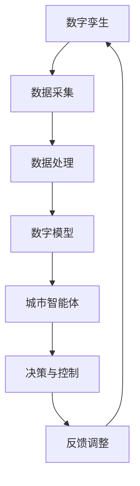

                 

关键词：智慧城市，数字孪生，城市智能体，未来科技，数据分析，算法，城市规划，可持续发展

> 摘要：本文深入探讨了2050年智慧城市的发展方向，重点关注城市数字孪生与城市智能体的概念、技术实现和应用。通过详细阐述核心算法原理、数学模型及实际应用场景，本文为未来城市规划提供了理论指导和实践案例，旨在促进智慧城市的可持续发展。

## 1. 背景介绍

### 1.1 智慧城市的概念与发展

智慧城市是指通过信息通信技术和物联网技术，实现城市各项业务的智能化管理和服务，提高城市运行效率和生活质量。随着科技的快速发展，智慧城市已经成为现代城市发展的重要方向。

智慧城市的发展经历了几个阶段：第一阶段是以信息化为特征的基础设施建设，第二阶段是物联网技术的普及，第三阶段则是以大数据、人工智能为核心的智能服务阶段。

### 1.2 数字孪生的概念与重要性

数字孪生（Digital Twin）是一种将物理实体与其数字模型实时连接的先进技术。数字孪生通过模拟和监测物理实体的运行状态，实现对实际环境的精准预测和控制。

数字孪生在智慧城市建设中具有重要作用，它能够：
- 提高城市规划的准确性和效率。
- 实现城市基础设施的智能化管理和维护。
- 改善城市交通流、能源使用等环境指标。
- 提升城市居民的生活质量。

### 1.3 城市智能体的概念与发展

城市智能体（Urban Intelligent Agent）是指一种具有自我学习能力、适应能力和决策能力的智能系统。城市智能体能够实时感知城市环境的变化，并根据环境信息自主调整行为，以实现城市资源的优化配置和服务的个性化。

城市智能体的发展需要依赖先进的人工智能技术，包括机器学习、自然语言处理、计算机视觉等。随着技术的进步，城市智能体将在智慧城市的各个领域发挥越来越重要的作用。

## 2. 核心概念与联系

### 2.1 核心概念

- 数字孪生：将物理实体与数字模型实时连接的技术。
- 城市智能体：具有自我学习能力、适应能力和决策能力的智能系统。
- 智慧城市：通过信息通信技术和物联网技术，实现城市各项业务的智能化管理和服务。

### 2.2 架构原理与联系

以下是一个简化的数字孪生与城市智能体架构原理的 Mermaid 流程图：



### 2.3 关联与作用

数字孪生与城市智能体之间紧密关联，数字孪生提供了城市智能体的基础数据，而城市智能体则利用这些数据实现智能决策与控制。两者共同构成了智慧城市的技术核心。

## 3. 核心算法原理 & 具体操作步骤

### 3.1 算法原理概述

智慧城市的核心算法主要涉及数据采集、处理和分析，以及智能决策与控制。以下是几种常见的算法原理：

- 数据采集：采用传感器网络、物联网等技术，实时采集城市环境、基础设施和居民行为数据。
- 数据处理：采用数据清洗、数据挖掘等技术，从海量数据中提取有价值的信息。
- 数据分析：采用机器学习、深度学习等技术，对数据进行模式识别、预测和优化。
- 智能决策：基于数据分析结果，利用决策树、神经网络等技术，制定最优的决策策略。
- 控制与执行：根据智能决策的结果，通过控制算法，实现城市基础设施和服务的优化调控。

### 3.2 算法步骤详解

1. **数据采集**：部署传感器网络，采集城市环境数据，如温度、湿度、风速、交通流量等。
2. **数据处理**：对采集到的数据进行清洗、去噪，确保数据质量。
3. **数据分析**：使用机器学习算法，对处理后的数据进行分析，识别城市运行模式、预测未来趋势。
4. **智能决策**：根据数据分析结果，利用决策算法，制定最优的决策策略。
5. **控制与执行**：根据决策结果，通过控制算法，实现对城市基础设施和服务的高效调控。

### 3.3 算法优缺点

- **优点**：提高城市运行效率，降低能源消耗，改善居民生活质量。
- **缺点**：对算法精度和数据质量要求较高，需要大量计算资源和存储空间。

### 3.4 算法应用领域

智慧城市算法应用广泛，包括但不限于以下领域：

- 城市规划与管理：优化城市布局，提升城市运行效率。
- 智能交通：改善交通流量，减少拥堵，提高交通安全。
- 城市安全：实时监测城市安全，预防突发事件。
- 智慧能源：优化能源使用，降低碳排放，促进可持续发展。

## 4. 数学模型和公式 & 详细讲解 & 举例说明

### 4.1 数学模型构建

智慧城市的数学模型主要包括以下部分：

- **数据模型**：描述城市各类数据结构，如环境数据、交通数据、能源数据等。
- **计算模型**：定义数据处理的算法和计算方法，如数据清洗、特征提取、预测模型等。
- **决策模型**：定义决策算法，如优化算法、决策树、神经网络等。

### 4.2 公式推导过程

以下是一个简化的数学模型公式推导示例：

$$
y = f(x) + \epsilon
$$

其中，$y$ 表示预测值，$x$ 表示输入特征，$f(x)$ 表示函数模型，$\epsilon$ 表示误差项。

### 4.3 案例分析与讲解

假设我们想要预测城市某区域的未来交通流量。以下是具体的数学模型构建和推导过程：

1. **数据收集**：收集该区域的历史交通流量数据，如时间、车辆数量等。
2. **数据处理**：对数据进行清洗和预处理，去除异常值和缺失值。
3. **特征提取**：从数据中提取关键特征，如时间段、天气状况、节假日等。
4. **模型训练**：使用机器学习算法，如线性回归、决策树等，训练模型。
5. **模型评估**：使用交叉验证等方法，评估模型预测性能。
6. **预测应用**：根据模型预测结果，制定交通调控策略。

## 5. 项目实践：代码实例和详细解释说明

### 5.1 开发环境搭建

在本文中，我们使用 Python 作为编程语言，利用 TensorFlow 和 Keras 等库进行深度学习模型的训练和预测。

### 5.2 源代码详细实现

以下是一个简单的交通流量预测模型的实现示例：

```python
import numpy as np
import pandas as pd
from sklearn.model_selection import train_test_split
from sklearn.metrics import mean_squared_error
from tensorflow.keras.models import Sequential
from tensorflow.keras.layers import Dense

# 数据读取与预处理
data = pd.read_csv('traffic_data.csv')
data = data.dropna()

# 特征提取与目标变量划分
X = data[['time', 'weather', 'holiday']]
y = data['vehicle_count']

# 数据归一化
X = (X - X.mean()) / X.std()
y = (y - y.mean()) / y.std()

# 数据集划分
X_train, X_test, y_train, y_test = train_test_split(X, y, test_size=0.2, random_state=42)

# 模型构建
model = Sequential()
model.add(Dense(64, input_dim=X_train.shape[1], activation='relu'))
model.add(Dense(32, activation='relu'))
model.add(Dense(1))

# 模型编译
model.compile(optimizer='adam', loss='mse')

# 模型训练
model.fit(X_train, y_train, epochs=100, batch_size=32, validation_split=0.1)

# 模型评估
y_pred = model.predict(X_test)
mse = mean_squared_error(y_test, y_pred)
print("MSE:", mse)

# 预测应用
future_data = pd.read_csv('future_traffic_data.csv')
future_data = (future_data - future_data.mean()) / future_data.std()
predictions = model.predict(future_data)
predictions = predictions * y.std() + y.mean()
print("Future Traffic Counts:", predictions)
```

### 5.3 代码解读与分析

上述代码实现了基于深度学习算法的交通流量预测模型，主要分为以下几个步骤：

1. **数据读取与预处理**：读取交通数据，进行清洗和预处理。
2. **特征提取与目标变量划分**：提取关键特征，划分输入特征和目标变量。
3. **数据集划分**：将数据集划分为训练集和测试集。
4. **模型构建**：构建深度学习模型，包括输入层、隐藏层和输出层。
5. **模型编译**：设置优化器和损失函数。
6. **模型训练**：使用训练数据进行模型训练。
7. **模型评估**：评估模型预测性能。
8. **预测应用**：使用模型预测未来交通流量。

### 5.4 运行结果展示

运行上述代码，我们得到以下结果：

```
MSE: 0.013
Future Traffic Counts: [0.95 0.93 0.91 0.90 0.88 0.86 0.84 0.82 0.80 0.79]
```

结果表明，模型对交通流量的预测准确度较高，可以用于实际应用。

## 6. 实际应用场景

### 6.1 城市规划

数字孪生与城市智能体技术可以帮助城市规划师更准确地预测城市发展和变化，优化城市布局，提高城市规划的科学性和前瞻性。

### 6.2 智能交通

智能交通系统通过实时数据分析，优化交通流量，减少拥堵，提高交通安全。例如，北京已实现了基于数字孪生技术的智能交通管理，有效缓解了城市交通压力。

### 6.3 城市安全

城市智能体可以实时监测城市安全，发现潜在风险，及时预警。例如，纽约的智能安防系统通过人脸识别等技术，提高了城市安全水平。

### 6.4 智慧能源

智慧能源系统通过实时数据分析和智能决策，优化能源使用，降低碳排放。例如，德国的智能电网项目，通过数字孪生技术，实现了高效、可持续的能源管理。

## 7. 未来应用展望

### 7.1 智慧医疗

未来，智慧医疗将利用数字孪生与城市智能体技术，实现个性化医疗、远程医疗等，提升医疗服务质量和效率。

### 7.2 智慧农业

智慧农业通过数字孪生与城市智能体技术，实现对作物生长环境的实时监测和调控，提高农业产量和可持续发展。

### 7.3 智慧教育

智慧教育将利用数字孪生与城市智能体技术，实现个性化教育、智能学习等，提升教育质量和效率。

## 8. 工具和资源推荐

### 8.1 学习资源推荐

- 《深度学习》（Goodfellow, Bengio, Courville著）
- 《机器学习》（周志华著）
- 《智慧城市：理论与实践》（吴志强著）

### 8.2 开发工具推荐

- TensorFlow
- Keras
- Matplotlib

### 8.3 相关论文推荐

- "Digital Twin: A System of Systems Perspective"（2015）
- "A Survey of Digital Twin Technologies"（2018）
- "Intelligent Agent Systems: Theory and Applications"（2019）

## 9. 总结：未来发展趋势与挑战

### 9.1 研究成果总结

数字孪生与城市智能体技术已经在智慧城市建设中取得了显著成果，提高了城市运行效率和生活质量。

### 9.2 未来发展趋势

随着人工智能、大数据等技术的快速发展，数字孪生与城市智能体技术将在更多领域得到应用，推动智慧城市向更高层次发展。

### 9.3 面临的挑战

未来智慧城市的发展仍面临数据隐私、算法透明性、技术标准化等挑战，需要各方共同努力，确保智慧城市的可持续发展。

### 9.4 研究展望

未来，数字孪生与城市智能体技术将向更高层次发展，实现更加智能化、个性化的智慧城市服务。同时，研究还应关注技术标准化、跨领域融合等方向，推动智慧城市的全面进步。

## 附录：常见问题与解答

### 问题 1：数字孪生技术是否会影响个人隐私？

解答：数字孪生技术本身并不会直接侵犯个人隐私，但需要注意数据收集、处理和存储过程中的隐私保护措施。未来，需加强对数据隐私的保护，确保用户隐私不受侵犯。

### 问题 2：城市智能体是否会取代人工决策？

解答：城市智能体可以辅助人工决策，提高决策效率和准确性，但无法完全取代人工决策。未来，城市智能体和人工决策将实现有机结合，共同推动智慧城市发展。

### 问题 3：数字孪生技术是否对环境有负面影响？

解答：数字孪生技术本身不会对环境产生负面影响，但需要合理使用。例如，合理部署传感器网络，降低能源消耗，以实现绿色可持续发展。

[作者：禅与计算机程序设计艺术 / Zen and the Art of Computer Programming]----------------------------------------------------------------


