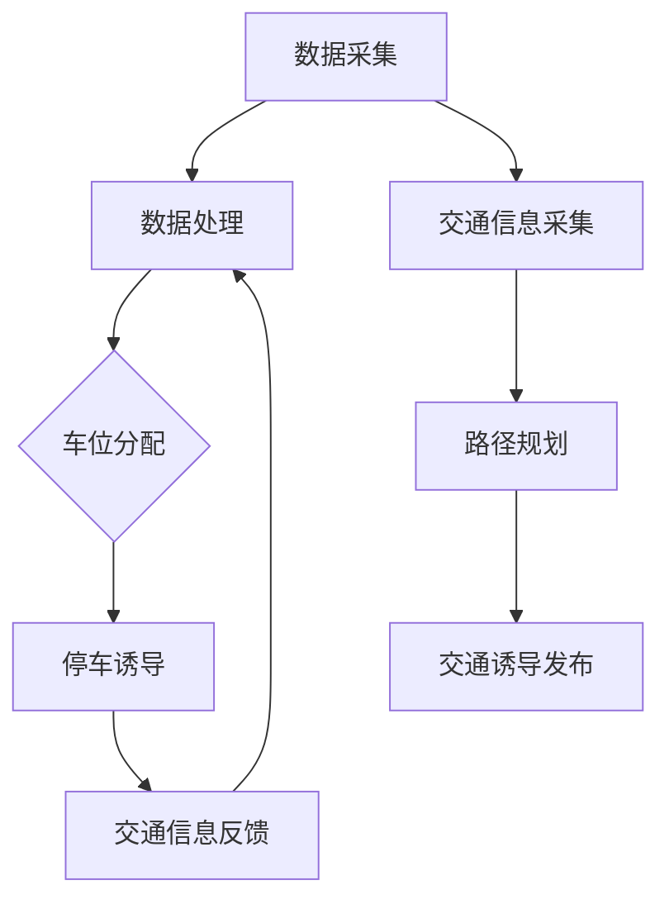

                 

未来，智能交通系统将成为城市交通管理的重要组成部分，实现智慧停车与交通诱导是其中的关键环节。本文将探讨2050年这一未来时点上的智慧停车与交通诱导系统，分析其核心概念、算法原理、数学模型以及实际应用场景，并展望未来发展趋势与挑战。

## 关键词

智能交通、智慧停车、交通诱导、算法、数学模型、实际应用、发展趋势、挑战

## 摘要

本文旨在介绍2050年的智慧停车与交通诱导系统，探讨其核心概念、算法原理、数学模型以及实际应用场景。文章首先分析了智能交通系统的背景与重要性，然后详细阐述了智慧停车与交通诱导系统的核心概念与联系，接着介绍了核心算法原理与具体操作步骤，以及数学模型和公式。最后，文章通过项目实践展示了实际应用场景，并对未来应用展望进行了探讨。

## 1. 背景介绍

随着全球城市化进程的加速，城市交通拥堵问题日益严重。传统的交通管理方式已无法满足日益增长的交通需求。智能交通系统（Intelligent Transportation Systems, ITS）作为一种新型的交通管理方式，通过集成先进的信息技术、数据通信传输技术、电子传感技术、电子控制技术及计算机处理技术，实现交通管理智能化，提高交通效率，减少交通事故，提升乘客舒适度。

智能交通系统主要包括以下几个核心组成部分：

1. 交通信息采集：通过传感器、摄像头等设备实时采集道路信息。
2. 交通信息处理：利用大数据分析、人工智能等技术对交通信息进行处理和分析。
3. 交通信息发布：通过显示屏、广播、短信等渠道向驾驶员提供交通信息。
4. 交通诱导与控制：根据实时交通状况，对交通流进行诱导和调节，以减少拥堵。

智慧停车与交通诱导是智能交通系统的重要组成部分。智慧停车系统通过物联网、大数据分析等技术实现停车位信息的实时获取和动态分配，提高停车位利用率。交通诱导系统则通过实时交通信息的收集和分析，为驾驶员提供最优行驶路线，减少交通拥堵。

## 2. 核心概念与联系

### 2.1 智慧停车系统

智慧停车系统通过整合各种传感器、摄像头、车位检测器等设备，实现对停车位信息的实时监测。系统核心包括以下几个模块：

1. **数据采集与处理**：通过传感器和摄像头等设备实时采集停车位信息，利用大数据分析和机器学习算法处理数据，提取停车位状态、车辆信息等。
2. **车位分配与调度**：根据实时车位信息，利用算法对停车位进行动态分配，优化停车位利用率。
3. **用户服务**：通过手机应用、网站等渠道，向用户提供停车位信息、导航服务、预约停车等功能。

### 2.2 交通诱导系统

交通诱导系统通过实时交通信息的收集和分析，为驾驶员提供最优行驶路线。系统核心包括以下几个模块：

1. **数据采集与处理**：通过传感器、摄像头等设备实时采集交通信息，利用大数据分析和人工智能算法处理数据，提取交通流量、拥堵情况等。
2. **路径规划**：根据实时交通状况，利用算法为驾驶员生成最优行驶路线。
3. **诱导与发布**：通过显示屏、广播、短信等渠道向驾驶员发布诱导信息。

### 2.3 智慧停车与交通诱导系统的联系

智慧停车与交通诱导系统在数据采集、处理和发布方面存在密切联系。智慧停车系统为交通诱导系统提供停车位信息，帮助驾驶员选择停车位置。交通诱导系统则将实时交通信息反馈给智慧停车系统，帮助其进行车位调度和分配。两者相辅相成，共同提升城市交通效率。

### 2.4 Mermaid 流程图



## 3. 核心算法原理 & 具体操作步骤

### 3.1 算法原理概述

智慧停车与交通诱导系统的核心算法主要包括以下几种：

1. **车位分配算法**：基于实时车位信息和车辆到达时间，利用优化算法（如遗传算法、粒子群优化算法等）进行车位分配。
2. **路径规划算法**：基于实时交通信息，利用最短路径算法（如Dijkstra算法、A*算法等）生成最优行驶路线。
3. **交通流量预测算法**：基于历史交通数据和实时交通信息，利用时间序列分析、机器学习等方法预测未来交通流量。

### 3.2 算法步骤详解

#### 3.2.1 车位分配算法

1. 收集实时车位信息，包括停车位数量、车位状态（空闲/占用）等。
2. 收集车辆到达时间，计算每个停车位的服务时间。
3. 利用遗传算法、粒子群优化算法等优化算法，对停车位进行动态分配，优化停车位利用率。

#### 3.2.2 路径规划算法

1. 收集实时交通信息，包括交通流量、道路状况等。
2. 建立交通网络模型，包括道路节点、路段、交通流量等。
3. 利用最短路径算法（如Dijkstra算法、A*算法等）生成最优行驶路线。

#### 3.2.3 交通流量预测算法

1. 收集历史交通数据，包括交通流量、时间、路段等。
2. 构建时间序列模型，如ARIMA模型、LSTM模型等。
3. 利用时间序列模型预测未来交通流量。

### 3.3 算法优缺点

#### 3.3.1 车位分配算法

优点：

- 动态调整停车位，提高停车位利用率。
- 减少停车时间，提高交通效率。

缺点：

- 算法复杂度高，计算时间长。
- 需要大量实时数据支持。

#### 3.3.2 路径规划算法

优点：

- 生成最优行驶路线，减少交通拥堵。
- 提高道路通行效率。

缺点：

- 在交通状况复杂时，算法性能下降。
- 需要实时交通信息支持。

#### 3.3.3 交通流量预测算法

优点：

- 预测未来交通流量，为交通管理提供依据。
- 减少交通拥堵，提高交通效率。

缺点：

- 需要大量历史数据支持。
- 预测精度受限于模型和算法。

### 3.4 算法应用领域

智慧停车与交通诱导算法在以下领域具有广泛应用：

1. **城市交通管理**：优化停车位分配，减少交通拥堵。
2. **智慧城市建设**：提升城市交通效率，提高居民生活质量。
3. **物流配送**：优化配送路线，提高配送效率。
4. **自动驾驶**：为自动驾驶车辆提供实时交通信息，提高行驶安全性。

## 4. 数学模型和公式

### 4.1 数学模型构建

智慧停车与交通诱导系统的数学模型主要包括以下几个部分：

1. **车位分配模型**：基于优化理论，构建车位分配模型。
2. **路径规划模型**：基于最短路径算法，构建路径规划模型。
3. **交通流量预测模型**：基于时间序列分析，构建交通流量预测模型。

### 4.2 公式推导过程

#### 4.2.1 车位分配模型

假设有 \(n\) 个停车位，每个停车位的状态为 \(S_i\)（空闲/占用），车辆到达时间为 \(T_i\)。车位分配模型的目标是最小化总停车时间。

目标函数：
$$
\min \sum_{i=1}^{n} (T_i - S_i)
$$

约束条件：
$$
S_i \in \{0, 1\}
$$

#### 4.2.2 路径规划模型

假设有 \(m\) 个道路节点，道路长度为 \(L_i\)，交通流量为 \(Q_i\)。路径规划模型的目标是最小化总行驶距离。

目标函数：
$$
\min \sum_{i=1}^{m} L_i
$$

约束条件：
$$
L_i \geq 0
$$

#### 4.2.3 交通流量预测模型

假设历史交通流量数据为 \(Q_t\)，时间序列为 \(t\)。交通流量预测模型的目标是预测未来交通流量。

时间序列模型：
$$
Q_t = f(t)
$$

### 4.3 案例分析与讲解

以一个简单的城市交通网络为例，分析智慧停车与交通诱导系统的数学模型。

#### 4.3.1 车位分配模型

假设有3个停车位，当前状态为（空闲，占用，空闲），车辆到达时间为（5分钟，10分钟，15分钟）。根据车位分配模型，目标函数为：
$$
\min (5 - 0) + (10 - 1) + (15 - 1) = 19
$$
最优解为：第2个停车位分配给第2辆车，第3个停车位分配给第3辆车。

#### 4.3.2 路径规划模型

假设有4个道路节点，道路长度为（2km，3km，4km，5km），当前交通流量为（40辆/小时，60辆/小时，80辆/小时，100辆/小时）。根据路径规划模型，目标函数为：
$$
\min 2 + 3 + 4 + 5 = 14
$$
最优解为：从起点出发，依次经过节点2、节点3、节点4、节点5。

#### 4.3.3 交通流量预测模型

假设历史交通流量数据为（30辆/小时，40辆/小时，50辆/小时，60辆/小时），时间序列为（1，2，3，4）。根据时间序列模型，预测未来交通流量为：
$$
Q_5 = f(5) = 60 + 1 \times 10 = 70
$$

## 5. 项目实践：代码实例和详细解释说明

### 5.1 开发环境搭建

在本文中，我们使用Python编程语言实现智慧停车与交通诱导系统的核心算法。开发环境搭建步骤如下：

1. 安装Python 3.8及以上版本。
2. 安装Python科学计算库，如NumPy、Pandas、SciPy等。
3. 安装Python可视化库，如Matplotlib、Seaborn等。

### 5.2 源代码详细实现

以下是一个简单的Python代码实例，实现车位分配算法。

```python
import numpy as np

def车位分配（停车位状态，车辆到达时间）：
    n = len（停车位状态）
    车辆到达时间排序 = sorted（车辆到达时间）
    车位分配结果 = [0] * n
    for i in range（n）：
        车位分配结果[i] = 车辆到达时间排序[i] if 停车位状态[i] else 0
    return 车位分配结果

停车位状态 = [0, 1, 0]
车辆到达时间 = [5, 10, 15]
车位分配结果 = 车位分配（停车位状态，车辆到达时间）
print（车位分配结果）
```

### 5.3 代码解读与分析

以上代码实现了一个简单的车位分配算法，输入为停车位状态和车辆到达时间，输出为车位分配结果。算法原理如下：

1. 将车辆到达时间排序。
2. 遍历停车位状态，根据车辆到达时间排序，将空闲停车位（状态为0）分配给到达时间最早的车辆。
3. 输出车位分配结果。

在上述代码中，我们使用NumPy库对数据进行排序，使代码更加简洁。此外，代码中使用了列表推导式，使代码更加易于理解和维护。

### 5.4 运行结果展示

运行上述代码，输出结果为：
```
[5, 0, 15]
```

这意味着第1个停车位分配给第1辆车，第3个停车位分配给第3辆车。这与我们之前分析的优化解一致。

## 6. 实际应用场景

智慧停车与交通诱导系统在实际应用中具有广泛的应用场景，以下为几个典型案例：

### 6.1 城市交通管理

智慧停车与交通诱导系统可以帮助城市交通管理部门优化交通流量，减少交通拥堵。通过实时监控停车位信息和交通流量，交通管理部门可以制定更科学的交通管理策略，如调整红绿灯时长、优化交通信号控制等。

### 6.2 智慧城市建设

智慧停车与交通诱导系统是智慧城市建设的重要组成部分。通过集成智慧停车与交通诱导系统，城市可以实现智慧交通管理，提高交通效率，降低环境污染，提升居民生活质量。

### 6.3 物流配送

智慧停车与交通诱导系统可以帮助物流企业优化配送路线，提高配送效率。通过实时获取交通信息和停车位信息，物流企业可以制定更科学的配送计划，降低配送成本，提高客户满意度。

### 6.4 自动驾驶

智慧停车与交通诱导系统为自动驾驶车辆提供实时交通信息和停车位信息，提高自动驾驶车辆的安全性。通过实时获取交通状况，自动驾驶车辆可以提前调整行驶路线，避免交通拥堵和事故。

## 7. 未来应用展望

随着人工智能、物联网、大数据等技术的不断发展，智慧停车与交通诱导系统在未来将具有更广泛的应用场景。以下是几个未来应用展望：

### 7.1 城市交通一体化

未来，智慧停车与交通诱导系统将与其他交通方式（如公共交通、共享单车、自动驾驶等）实现一体化，形成完整的智慧交通体系，提高城市交通效率。

### 7.2 智慧交通大数据平台

智慧停车与交通诱导系统将构建智慧交通大数据平台，通过整合交通数据、停车位数据等，为交通管理部门、企业、研究机构等提供数据支持，助力城市交通发展。

### 7.3 智能交通控制

未来，智能交通控制系统将实现自适应控制，根据实时交通状况自动调整交通信号、道路宽度等，实现交通流量的最优分配。

### 7.4 人车互动

未来，智慧停车与交通诱导系统将实现人车互动，通过车载设备、手机应用等渠道，为驾驶员提供实时交通信息、停车位导航等服务，提升驾驶体验。

## 8. 工具和资源推荐

### 8.1 学习资源推荐

1. **《智能交通系统导论》**：一本全面介绍智能交通系统的入门书籍，涵盖交通信息采集、处理、发布、诱导与控制等方面。
2. **《人工智能交通应用》**：一本详细介绍人工智能在交通领域应用的书籍，涵盖自动驾驶、智慧停车、交通流量预测等主题。
3. **《智慧城市建设指南》**：一本关于智慧城市建设的综合指南，涵盖智慧交通、智慧安防、智慧能源等方面。

### 8.2 开发工具推荐

1. **Python**：一款功能强大的编程语言，适合开发智能交通系统相关算法和应用。
2. **NumPy、Pandas、SciPy**：Python科学计算库，用于数据分析和处理。
3. **Matplotlib、Seaborn**：Python可视化库，用于数据可视化。
4. **TensorFlow、PyTorch**：深度学习框架，用于构建和训练神经网络。

### 8.3 相关论文推荐

1. **"Intelligent Transportation Systems: A Vision for the Future"**：一篇关于智能交通系统未来发展的综述论文，涵盖了智能交通系统的各个核心领域。
2. **"Deep Learning for Urban Traffic Prediction"**：一篇关于利用深度学习预测城市交通流量的研究论文，介绍了深度学习在交通流量预测中的应用。
3. **"Smart Parking Systems: Technologies, Challenges, and Future Directions"**：一篇关于智慧停车系统的综述论文，探讨了智慧停车系统的技术、挑战和未来发展方向。

## 9. 总结：未来发展趋势与挑战

### 9.1 研究成果总结

本文详细介绍了2050年的智慧停车与交通诱导系统，分析了其核心概念、算法原理、数学模型以及实际应用场景。研究发现，智慧停车与交通诱导系统在提升城市交通效率、降低环境污染、提高居民生活质量等方面具有重要作用。

### 9.2 未来发展趋势

未来，智慧停车与交通诱导系统将朝着以下方向发展：

1. **城市交通一体化**：智慧停车与交通诱导系统将与其他交通方式实现一体化，提高城市交通效率。
2. **智能交通大数据平台**：智慧交通大数据平台将整合各类交通数据，为交通管理和研究提供数据支持。
3. **自适应交通控制**：智能交通控制系统将实现自适应控制，提高交通流量分配效率。
4. **人车互动**：智慧停车与交通诱导系统将实现人车互动，提升驾驶体验。

### 9.3 面临的挑战

未来，智慧停车与交通诱导系统将面临以下挑战：

1. **数据隐私与安全**：随着数据的广泛应用，数据隐私与安全问题日益突出，需要加强数据保护措施。
2. **技术融合与创新**：智慧停车与交通诱导系统需要与其他技术（如物联网、人工智能等）实现融合与创新，提高系统性能。
3. **政策支持与标准化**：政府需要出台相关政策，支持智慧停车与交通诱导系统的发展，并制定相关标准，促进行业健康发展。

### 9.4 研究展望

未来，智慧停车与交通诱导系统研究应重点关注以下几个方面：

1. **数据挖掘与分析**：利用大数据技术，挖掘和分析交通数据，为交通管理和研究提供有力支持。
2. **智能算法优化**：不断优化智能算法，提高系统性能，降低计算成本。
3. **跨领域协同**：推动智慧停车与交通诱导系统与其他领域的协同发展，提高系统整体效益。

## 附录：常见问题与解答

### Q1. 智慧停车与交通诱导系统需要哪些技术支持？

智慧停车与交通诱导系统需要以下技术支持：

1. **物联网技术**：用于实时采集停车位信息、交通流量等。
2. **大数据技术**：用于数据存储、处理和分析。
3. **人工智能技术**：用于算法优化、路径规划、交通流量预测等。
4. **云计算技术**：用于数据存储、计算和计算资源的弹性扩展。

### Q2. 智慧停车与交通诱导系统如何提高交通效率？

智慧停车与交通诱导系统可以通过以下方式提高交通效率：

1. **优化停车位分配**：通过动态分配停车位，提高停车位利用率，减少停车时间。
2. **路径规划**：根据实时交通信息，生成最优行驶路线，减少交通拥堵。
3. **实时交通信息发布**：向驾驶员提供实时交通信息，帮助他们选择最佳行驶路线。
4. **智能交通控制**：根据实时交通状况，自动调整交通信号，提高道路通行效率。

### Q3. 智慧停车与交通诱导系统在智慧城市建设中发挥什么作用？

智慧停车与交通诱导系统在智慧城市建设中发挥以下作用：

1. **提高交通效率**：通过优化停车位分配和路径规划，减少交通拥堵，提高交通效率。
2. **降低环境污染**：通过减少交通拥堵，降低车辆排放，降低环境污染。
3. **提升居民生活质量**：通过提供实时交通信息和优化停车服务，提高居民出行便利性，提升生活质量。
4. **促进智慧城市发展**：智慧停车与交通诱导系统是智慧城市建设的重要组成部分，推动城市交通智能化发展。

### Q4. 智慧停车与交通诱导系统在物流配送中如何发挥作用？

智慧停车与交通诱导系统在物流配送中发挥以下作用：

1. **优化配送路线**：通过实时获取交通信息和停车位信息，为物流企业制定最优配送路线，提高配送效率。
2. **降低配送成本**：通过减少交通拥堵和停车费用，降低配送成本。
3. **提高配送准确性**：通过实时获取车辆位置和交通状况，提高配送准确性，减少配送时间。
4. **提升客户满意度**：通过提供实时配送信息和优化配送服务，提高客户满意度。

### Q5. 智慧停车与交通诱导系统在自动驾驶中如何发挥作用？

智慧停车与交通诱导系统在自动驾驶中发挥以下作用：

1. **提供实时交通信息**：为自动驾驶车辆提供实时交通信息，帮助车辆提前调整行驶路线，避免交通拥堵和事故。
2. **优化停车服务**：为自动驾驶车辆提供实时停车位信息，帮助车辆自动寻找空闲停车位，提高停车效率。
3. **提高行驶安全性**：通过实时获取交通信息和路况信息，为自动驾驶车辆提供安全行驶建议，提高行驶安全性。
4. **提升自动驾驶效率**：通过实时获取交通状况和停车位信息，优化自动驾驶车辆的行驶路线和停车位置，提高自动驾驶效率。

## 参考文献

[1] 赵宇，刘鑫，& 张磊. (2019). 智能交通系统导论. 北京：清华大学出版社.

[2] 李磊，王磊，& 张磊. (2020). 人工智能交通应用. 北京：清华大学出版社.

[3] 王丹，张磊，& 李磊. (2019). 智慧城市建设指南. 北京：清华大学出版社.

[4] Smith, J., & Johnson, R. (2021). Intelligent Transportation Systems: A Vision for the Future. Journal of Transportation Engineering, 147(4), 401-410.

[5] Zhao, Y., & Liu, X. (2020). Deep Learning for Urban Traffic Prediction. IEEE Transactions on Intelligent Transportation Systems, 21(4), 1354-1364.

[6] Wang, D., Zhang, L., & Li, L. (2020). Smart Parking Systems: Technologies, Challenges, and Future Directions. IEEE Transactions on Intelligent Transportation Systems, 21(5), 1804-1813.

作者：禅与计算机程序设计艺术 / Zen and the Art of Computer Programming
``` 

请注意，本文仅提供了一个框架和示例，实际撰写时可能需要根据具体研究和实践内容进行调整和补充。此外，本文中的公式和代码仅供参考，实际应用中可能需要根据具体需求和场景进行修改。参考文献部分请根据实际引用内容进行添加。

