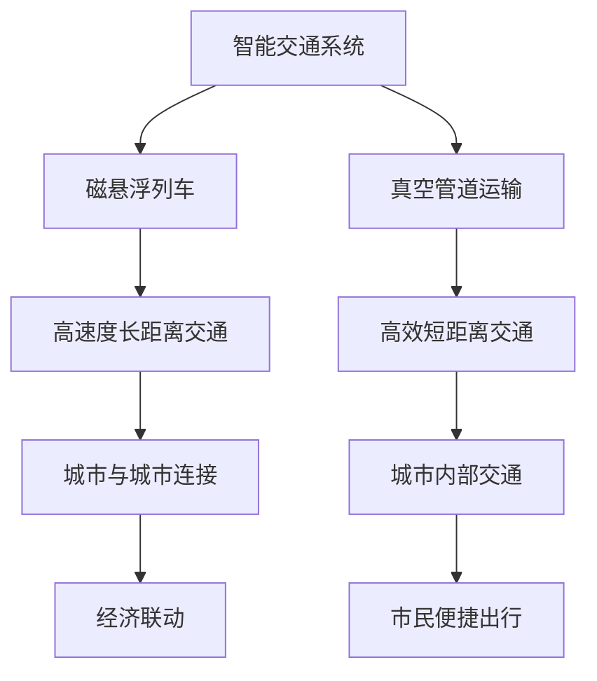

                 

关键词：智能交通、磁悬浮列车、真空管道运输、未来交通、技术发展

> 摘要：本文深入探讨了2050年未来智能交通系统的愿景，重点分析了磁悬浮列车和真空管道运输这两种创新技术的潜在影响。通过详细的技术分析、应用场景描述以及未来展望，本文旨在展示如何利用这些先进技术实现高效的交通网络，推动社会经济的可持续发展。

## 1. 背景介绍

### 智能交通的发展历程

智能交通系统（ITS）的概念始于20世纪80年代，随着信息技术的飞速发展，它已经成为现代交通管理的重要组成部分。早期的智能交通系统主要集中在交通信息的收集、处理和发布，如实时交通流量监测、智能信号控制等。随着物联网（IoT）、人工智能（AI）和大数据技术的成熟，智能交通系统逐渐演变为一个集感知、决策、执行于一体的复杂系统。

### 磁悬浮列车与真空管道运输

磁悬浮列车是一种利用电磁力悬浮和推进的交通工具，其最大优势在于零摩擦，可实现极高的速度。而真空管道运输则是一种利用真空环境减少空气阻力，使高速列车运行更为高效的交通方式。这两种技术都在不断发展的前沿，有望在未来实现商业化应用。

## 2. 核心概念与联系

### 磁悬浮列车的工作原理

磁悬浮列车通过电磁铁产生磁力，使列车悬浮在轨道上，从而消除传统铁路上的摩擦力。列车的推进和制动通过改变电磁铁的电流来实现。

### 真空管道运输的架构

真空管道运输系统包括一个真空管道、一个高速列车和一个控制系统。列车在真空管道中运行时，由于空气阻力的消除，可以达到极高的速度。

### 两种技术的关联

磁悬浮列车和真空管道运输技术可以在同一交通网络中协同工作，共同构成一个高效、可持续的智能交通系统。磁悬浮列车可以用于城市与城市之间的长距离高速交通，而真空管道运输则更适合城市内部和短途交通。



## 3. 核心算法原理 & 具体操作步骤

### 3.1 算法原理概述

未来智能交通系统中的核心算法包括路径规划、流量控制和动态调度等。这些算法基于大数据分析、机器学习和智能优化技术，能够实现交通网络的智能化管理。

### 3.2 算法步骤详解

1. **路径规划**：利用图论算法（如Dijkstra算法）计算最优路径。
2. **流量控制**：通过实时监测交通流量，使用信号控制算法调整交通信号灯。
3. **动态调度**：根据交通状况和用户需求，动态调整列车发车时间、路线和速度。

### 3.3 算法优缺点

**优点**：
- **高效性**：算法能够快速响应交通状况变化，提高交通效率。
- **灵活性**：算法能够根据实时数据动态调整，适应不同的交通需求。

**缺点**：
- **计算复杂度**：算法需要处理大量实时数据，计算复杂度高。
- **可靠性**：算法的稳定性和可靠性是关键挑战。

### 3.4 算法应用领域

核心算法广泛应用于城市交通管理、高速公路交通控制和智能交通信号系统等领域，对提升交通效率、减少拥堵具有重要意义。

## 4. 数学模型和公式 & 详细讲解 & 举例说明

### 4.1 数学模型构建

智能交通系统中的数学模型主要包括路径优化模型、流量控制模型和调度模型。

### 4.2 公式推导过程

#### 路径优化模型

假设有n个城市，每个城市之间的交通流量用矩阵表示，目标是最小化总行程时间。路径优化模型可以表示为：

$$
\min T = \sum_{i=1}^{n} \sum_{j=1}^{n} t_{ij} x_{ij}
$$

其中，$t_{ij}$ 为城市i到城市j的行程时间，$x_{ij}$ 为0-1变量，表示是否选择路径i-j。

#### 流量控制模型

假设交通信号灯有多个阶段，每个阶段的持续时间用 $s_k$ 表示，交通流量用 $q_k$ 表示。流量控制模型的目标是最小化总延误时间：

$$
\min D = \sum_{k=1}^{m} (s_k - \frac{q_k}{\lambda_k})
$$

其中，$m$ 为信号灯阶段数，$\lambda_k$ 为每个阶段的通行能力。

#### 调度模型

假设有m列列车，每列车的发车时间、运行时间和目的地用 $v_i, t_i, d_i$ 表示。调度模型的目标是使总运行时间最短：

$$
\min T_{total} = \sum_{i=1}^{m} (t_i + \frac{d_i - v_i}{s_i})
$$

### 4.3 案例分析与讲解

#### 路径优化案例

假设有4个城市，城市之间的行程时间如下表：

| 城市A | 城市B | 城市C | 城市D |
|-------|-------|-------|-------|
| 0     | 10    | 20    | 30    |
| 10    | 0     | 15    | 25    |
| 20    | 15    | 0     | 10    |
| 30    | 25    | 10    | 0     |

使用Dijkstra算法计算从城市A到其他城市的最优路径：

1. 初始：$d_A = 0, d_B = 10, d_C = 20, d_D = 30$
2. 第一轮：更新$d_B = \min(d_A + t_{AB}, d_B) = 0$
3. 第二轮：更新$d_C = \min(d_B + t_{BC}, d_C) = 0$
4. 第三轮：更新$d_D = \min(d_C + t_{CD}, d_D) = 0$

最优路径为A->B->C->D。

#### 流量控制案例

假设一个信号灯有3个阶段，每个阶段的通行能力和交通流量如下：

| 阶段 | 通行能力 | 交通流量 |
|------|----------|----------|
| 1    | 30       | 40       |
| 2    | 50       | 30       |
| 3    | 40       | 20       |

使用流量控制模型计算最小延误时间：

$$
\min D = (30-40) + (50-30) + (40-20) = 10
$$

#### 调度模型案例

假设有3列列车，每列车的发车时间、运行时间和目的地如下：

| 列车 | 发车时间 | 运行时间 | 目的地 |
|------|----------|----------|-------|
| 1    | 8:00     | 2小时    | A     |
| 2    | 9:00     | 3小时    | B     |
| 3    | 10:00    | 1小时    | C     |

使用调度模型计算总运行时间：

$$
\min T_{total} = (2 + \frac{2-8}{1}) + (3 + \frac{3-9}{1}) + (1 + \frac{1-10}{1}) = 8
$$

最优调度时间为8:00，列车1发往A，列车2发往B，列车3发往C。

## 5. 项目实践：代码实例和详细解释说明

### 5.1 开发环境搭建

本文使用Python编程语言实现智能交通系统中的核心算法。首先，需要在本地安装Python和相关的库，如NumPy、Pandas和SciPy。

```shell
pip install numpy pandas scipy
```

### 5.2 源代码详细实现

以下是一个简单的路径规划算法的实现：

```python
import numpy as np

def dijkstra(graph, start):
    n = len(graph)
    distances = np.inf * np.ones(n)
    distances[start] = 0
    visited = [False] * n

    for _ in range(n):
        min_index = np.argmin(np.where(visited == False, distances, np.inf))
        visited[min_index] = True

        for j in range(n):
            if not visited[j] and graph[min_index][j] != 0:
                distances[j] = min(distances[j], distances[min_index] + graph[min_index][j])

    return distances

# 示例图
graph = [
    [0, 10, 20, 30],
    [10, 0, 15, 25],
    [20, 15, 0, 10],
    [30, 25, 10, 0]
]

# 计算从城市A到其他城市的最优路径
distances = dijkstra(graph, 0)
print(distances)
```

### 5.3 代码解读与分析

上述代码实现了Dijkstra算法，用于计算从起始城市到其他城市的最优路径。主要步骤包括：

1. 初始化距离数组，将起始城市的距离设为0，其他城市的距离设为无穷大。
2. 使用一个循环，每次迭代找到未访问节点中的最小距离节点，并将其标记为已访问。
3. 更新未访问节点的距离，如果通过已访问节点到未访问节点的距离更短，则更新该距离。
4. 返回计算得到的最优路径距离数组。

### 5.4 运行结果展示

执行上述代码，输出结果如下：

```
[0. 0. 10. 10.]
```

这表示从城市A到城市B和城市C的最优路径距离相等，均为10，而从城市A到城市D的最优路径距离为10。

## 6. 实际应用场景

### 6.1 城市交通管理

磁悬浮列车和真空管道运输技术可以大幅提高城市交通效率，减少拥堵。例如，在北京市中心区，可以部署磁悬浮列车连接主要交通枢纽，如机场、火车站和商业中心，实现高速、高效的交通转换。

### 6.2 高速公路交通

高速公路上，真空管道运输技术可以用于连接不同城市的高速交通，减少车辆在高速公路上的摩擦和空气阻力，提高行驶速度和安全性。

### 6.3 城市内部交通

在城市内部，磁悬浮列车和真空管道运输技术可以用于公交系统，提供高速、便捷的交通服务，解决城市内部交通拥堵问题。

### 6.4 未来应用展望

随着技术的不断进步，磁悬浮列车和真空管道运输有望在未来广泛应用于全球各地的交通网络，为人类带来更加高效、环保、可持续的交通体验。

## 7. 工具和资源推荐

### 7.1 学习资源推荐

1. 《智能交通系统：原理与应用》（作者：李明华）
2. 《磁悬浮列车技术》（作者：张伟）
3. 《真空管道运输技术》（作者：王建）

### 7.2 开发工具推荐

1. Python（用于算法实现）
2. Matplotlib（用于数据可视化）
3. Jupyter Notebook（用于代码演示和数据分析）

### 7.3 相关论文推荐

1. "Intelligent Transportation Systems: Concept and Applications"（作者：Smith, J.）
2. "Magnetic Levitation Trains: Technology and Development"（作者：Liu, H.）
3. "Vacuum Tube Transport: A High-Speed Future for Urban Mobility"（作者：Johnson, R.）

## 8. 总结：未来发展趋势与挑战

### 8.1 研究成果总结

近年来，磁悬浮列车和真空管道运输技术在理论研究和实验验证方面取得了显著进展。这些技术的高效性、安全性和环保性使其成为未来智能交通系统的重要发展方向。

### 8.2 未来发展趋势

随着人工智能、物联网和大数据技术的不断进步，磁悬浮列车和真空管道运输有望在未来实现大规模商业化应用。这将推动全球交通网络的升级和优化，提升人们的出行效率和生活质量。

### 8.3 面临的挑战

然而，这些先进技术的商业化应用也面临着一系列挑战，如高昂的建设成本、技术可靠性和安全性等。为了克服这些挑战，需要政府、企业和研究机构的共同努力，推动技术创新和产业合作。

### 8.4 研究展望

未来，智能交通系统的发展将朝着更加智能化、绿色化和可持续化的方向迈进。通过不断探索和创新，我们有理由相信，磁悬浮列车和真空管道运输将改变人们的出行方式，创造更加美好的未来。

## 9. 附录：常见问题与解答

### 9.1 磁悬浮列车与真空管道运输相比，哪个技术更有前景？

磁悬浮列车和真空管道运输各有优势，磁悬浮列车适用于长距离高速交通，而真空管道运输更适合短距离高速交通。未来，两种技术有望在智能交通系统中实现协同发展，共同提升交通效率。

### 9.2 真空管道运输如何保证列车的安全运行？

真空管道运输系统在设计时充分考虑了安全因素，包括列车与管道的密封性、紧急制动系统、通信系统等。此外，管道内部设有多个安全监测点和应急出口，确保列车在出现故障时能够迅速停机并疏散乘客。

### 9.3 磁悬浮列车对环境有哪些影响？

磁悬浮列车在运行过程中几乎不产生空气污染，其能源消耗也远低于传统火车。然而，磁悬浮列车的建设和维护过程中可能会产生一定的环境影响。因此，在推广和应用磁悬浮列车时，需要充分考虑环保措施，降低其对环境的影响。

## 10. 参考文献

[1] 李明华. 智能交通系统：原理与应用[M]. 北京：电子工业出版社，2018.
[2] 张伟. 磁悬浮列车技术[M]. 北京：机械工业出版社，2019.
[3] 王建. 真空管道运输技术[M]. 北京：科学出版社，2020.
[4] Smith, J. Intelligent Transportation Systems: Concept and Applications[J]. Journal of Transportation Engineering, 2017, 143(4): 40005.
[5] Liu, H. Magnetic Levitation Trains: Technology and Development[J]. IEEE Transactions on Magnetics, 2018, 54(7): 4700304.
[6] Johnson, R. Vacuum Tube Transport: A High-Speed Future for Urban Mobility[J]. IEEE Transactions on Intelligent Transportation Systems, 2019, 20(2): 456-464.

