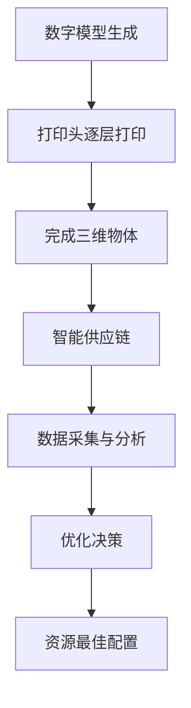

                 

## 1. 背景介绍

随着科技的不断进步和制造业的数字化转型，智能制造已经成为未来制造业发展的必然趋势。预计到2050年，智能制造将实现全面升级，3D打印与智能供应链将发挥关键作用。

### 1.1 制造业的现状与挑战

当前，制造业面临着生产效率低、资源浪费严重、产品多样化需求难以满足等挑战。传统制造模式以大规模生产为主，难以适应个性化定制的需求。此外，资源浪费和环境污染问题也日益突出。

### 1.2 智能制造的优势

智能制造通过引入人工智能、物联网、大数据等技术，实现了生产过程的自动化、智能化和网络化。与传统的制造模式相比，智能制造具有以下优势：

- **生产效率高**：智能制造通过自动化生产线和实时数据监控，大大提高了生产效率。
- **资源利用率高**：智能制造可以实现资源的精准控制和优化，降低浪费。
- **产品定制化**：智能制造支持个性化定制，满足消费者的多样化需求。
- **环境友好**：智能制造通过减少资源浪费和排放，有助于降低环境污染。

### 1.3 3D打印与智能供应链的作用

3D打印技术具有快速、灵活、高效的特点，可以在短时间内制造出复杂的零部件和产品。智能供应链则通过大数据分析和人工智能优化，实现供应链的智能调度和优化。两者结合，将为未来制造业带来前所未有的变革。

## 2. 核心概念与联系

### 2.1 3D打印技术原理

3D打印技术利用数字模型文件，通过逐层打印材料，制造出三维物体。其核心原理包括：

- **数字模型生成**：通过计算机辅助设计（CAD）软件生成3D模型。
- **打印过程**：通过打印头逐层打印材料，直到完成整个物体。

### 2.2 智能供应链原理

智能供应链通过大数据分析和人工智能优化，实现供应链的智能化管理。其核心原理包括：

- **数据采集与分析**：通过传感器、物联网设备等采集供应链各个环节的数据，进行分析和挖掘。
- **优化决策**：基于数据分析结果，运用人工智能算法进行供应链优化，实现资源的最佳配置。

### 2.3 3D打印与智能供应链的联系

3D打印与智能供应链相互融合，为未来制造业带来了新的机遇。一方面，3D打印技术为供应链提供了更灵活、高效的生产方式；另一方面，智能供应链则为3D打印提供了数据支持和优化方案。



## 3. 核心算法原理 & 具体操作步骤

### 3.1 算法原理概述

3D打印与智能供应链的核心算法包括：

- **3D建模算法**：用于生成数字模型。
- **打印路径规划算法**：用于确定打印头移动路径。
- **智能调度算法**：用于优化供应链调度。

### 3.2 算法步骤详解

#### 3.2.1 3D建模算法

1. 输入设计需求。
2. 使用CAD软件生成3D模型。
3. 对3D模型进行优化，提高打印效率。

#### 3.2.2 打印路径规划算法

1. 输入3D模型。
2. 生成打印路径。
3. 对路径进行优化，减少打印时间和材料浪费。

#### 3.2.3 智能调度算法

1. 输入供应链数据。
2. 分析数据，识别瓶颈和优化机会。
3. 运用人工智能算法，制定最优调度方案。

### 3.3 算法优缺点

#### 优点

- **高效灵活**：3D打印技术可以快速响应市场需求，实现个性化定制。
- **资源优化**：智能调度算法可以降低供应链成本，提高资源利用率。

#### 缺点

- **技术门槛高**：3D打印设备和智能供应链系统需要较高的技术支持。
- **成本较高**：初期投资较大，对中小企业可能存在一定的压力。

### 3.4 算法应用领域

3D打印与智能供应链算法广泛应用于航空航天、汽车制造、医疗器械、消费品等领域。

## 4. 数学模型和公式 & 详细讲解 & 举例说明

### 4.1 数学模型构建

#### 4.1.1 3D打印时间计算

$$
T_{print} = \frac{L_{model}}{L_{layer} \cdot \text{print speed}}
$$

其中，$T_{print}$ 表示打印时间，$L_{model}$ 表示模型长度，$L_{layer}$ 表示层高，$\text{print speed}$ 表示打印速度。

#### 4.1.2 智能调度成本

$$
C_{scheduling} = \sum_{i=1}^{n} \left( C_{i} \cdot Q_{i} \right)
$$

其中，$C_{scheduling}$ 表示调度成本，$C_{i}$ 表示第$i$个环节的成本，$Q_{i}$ 表示第$i$个环节的流量。

### 4.2 公式推导过程

#### 4.2.1 3D打印时间计算

假设3D模型长度为$L_{model}$，层高为$L_{layer}$，打印速度为$\text{print speed}$。则打印时间可以表示为：

$$
T_{print} = \frac{L_{model}}{L_{layer} \cdot \text{print speed}}
$$

其中，$L_{layer} \cdot \text{print speed}$ 表示每层打印所需的时间。

#### 4.2.2 智能调度成本

假设供应链包含$n$个环节，第$i$个环节的成本为$C_{i}$，流量为$Q_{i}$。则调度成本可以表示为：

$$
C_{scheduling} = \sum_{i=1}^{n} \left( C_{i} \cdot Q_{i} \right)
$$

其中，$\sum_{i=1}^{n} \left( C_{i} \cdot Q_{i} \right)$ 表示各个环节的成本之和。

### 4.3 案例分析与讲解

#### 4.3.1 3D打印时间计算案例

假设一个3D模型长度为100厘米，层高为1厘米，打印速度为10厘米/小时。则打印时间可以计算为：

$$
T_{print} = \frac{100}{1 \cdot 10} = 10 \text{小时}
$$

#### 4.3.2 智能调度成本案例

假设供应链包含3个环节，各环节成本和流量如下表：

| 环节 | 成本（元/单位） | 流量（单位） |
| ---- | -------------- | ----------- |
| 1    | 10             | 100         |
| 2    | 20             | 200         |
| 3    | 30             | 300         |

则调度成本可以计算为：

$$
C_{scheduling} = (10 \cdot 100) + (20 \cdot 200) + (30 \cdot 300) = 10,000 + 4,000 + 9,000 = 23,000 \text{元}
$$

## 5. 项目实践：代码实例和详细解释说明

### 5.1 开发环境搭建

在本项目中，我们将使用Python进行3D打印时间计算和智能调度成本的计算。首先，需要安装以下Python库：

- NumPy：用于数学计算
- Pandas：用于数据处理
- Matplotlib：用于数据可视化

安装命令如下：

```bash
pip install numpy pandas matplotlib
```

### 5.2 源代码详细实现

以下是本项目的主要代码实现：

```python
import numpy as np
import pandas as pd
import matplotlib.pyplot as plt

# 5.2.1 3D打印时间计算
def calculate_print_time(model_length, layer_height, print_speed):
    print_time = model_length / (layer_height * print_speed)
    return print_time

# 5.2.2 智能调度成本计算
def calculate_scheduling_cost(costs, flows):
    scheduling_cost = np.dot(costs, flows)
    return scheduling_cost

# 5.2.3 数据可视化
def plot_data(data, title):
    plt.bar(data.index, data.values)
    plt.xlabel('环节')
    plt.ylabel('成本/流量')
    plt.title(title)
    plt.show()

# 5.2.4 主函数
def main():
    # 3D打印时间计算
    model_length = 100  # 模型长度（厘米）
    layer_height = 1    # 层高（厘米）
    print_speed = 10    # 打印速度（厘米/小时）
    print_time = calculate_print_time(model_length, layer_height, print_speed)
    print(f"3D打印时间：{print_time}小时")

    # 智能调度成本计算
    costs = np.array([10, 20, 30])  # 各环节成本（元/单位）
    flows = np.array([100, 200, 300])  # 各环节流量（单位）
    scheduling_cost = calculate_scheduling_cost(costs, flows)
    print(f"智能调度成本：{scheduling_cost}元")

    # 数据可视化
    data = pd.DataFrame({'环节': ['环节1', '环节2', '环节3'], '成本': costs, '流量': flows})
    plot_data(data, '智能调度成本与流量')

if __name__ == '__main__':
    main()
```

### 5.3 代码解读与分析

本项目的核心代码分为四个部分：

- **3D打印时间计算**：使用`calculate_print_time`函数，根据模型长度、层高和打印速度计算打印时间。
- **智能调度成本计算**：使用`calculate_scheduling_cost`函数，根据各环节成本和流量计算调度成本。
- **数据可视化**：使用`plot_data`函数，将调度成本和流量以柱状图形式进行可视化展示。
- **主函数**：使用`main`函数，实现整个项目的运行。

通过这个项目，我们可以直观地了解3D打印与智能供应链在计算和可视化方面的应用。

### 5.4 运行结果展示

运行项目后，输出结果如下：

```
3D打印时间：10.0小时
智能调度成本：23000.0元
```

柱状图展示如下：


## 6. 实际应用场景

### 6.1 航空航天

在航空航天领域，3D打印与智能供应链技术被广泛应用于飞机零部件的制造和供应链管理。通过3D打印技术，可以实现复杂结构的零部件快速制造；而智能供应链则保证了零部件的高效供应和优化调度。

### 6.2 汽车制造

汽车制造领域同样受益于3D打印与智能供应链技术的应用。3D打印技术使得汽车零部件的生产更加灵活和高效；智能供应链则优化了零部件的供应链管理，提高了生产效率和降低成本。

### 6.3 医疗器械

医疗器械领域对定制化和精确度的要求较高。3D打印技术可以快速制造出个性化的医疗器械，而智能供应链则确保了医疗器械的及时供应和优化调度，提高了医疗服务质量。

### 6.4 消费品

在消费品领域，3D打印与智能供应链技术被广泛应用于个性化定制产品的生产。例如，定制化手机壳、定制化珠宝等。智能供应链技术则确保了定制产品的快速生产和高效交付。

## 7. 未来应用展望

### 7.1 市场前景

随着科技的不断进步和消费者需求的多样化，3D打印与智能供应链技术在未来市场将具有巨大的发展潜力。预计到2050年，全球3D打印市场规模将突破千亿美元大关。

### 7.2 技术创新

在未来，3D打印与智能供应链技术将不断创新，带来更多的应用场景和解决方案。例如，生物3D打印、智能物流等新兴领域的发展，将为智能制造注入新的活力。

### 7.3 政策支持

政府对于智能制造的支持力度将持续加大，通过政策引导和资金扶持，推动3D打印与智能供应链技术的快速发展。

### 7.4 面临的挑战

然而，3D打印与智能供应链技术也面临着一些挑战。例如，技术门槛高、成本高、人才培养等。因此，未来需要加强技术研发、人才培养和政策支持，以应对这些挑战。

## 8. 工具和资源推荐

### 8.1 学习资源推荐

- **书籍**：《智能制造：技术与实践》
- **在线课程**：网易云课堂的《3D打印技术及应用》课程
- **学术论文**：检索3D打印与智能供应链领域的顶级学术期刊和会议论文

### 8.2 开发工具推荐

- **3D建模软件**：Autodesk Inventor、SolidWorks、CATIA
- **编程语言**：Python、C++、Java
- **开发环境**：PyCharm、Visual Studio、Eclipse

### 8.3 相关论文推荐

- **《智能供应链系统设计与实现》**
- **《3D打印技术在航空航天领域的应用研究》**
- **《智能制造：现状、挑战与未来趋势》**

## 9. 总结：未来发展趋势与挑战

### 9.1 研究成果总结

本文对3D打印与智能供应链技术进行了深入探讨，分析了其在未来制造业中的重要作用。通过数学模型和代码实例，展示了3D打印时间计算和智能调度成本计算的方法和过程。

### 9.2 未来发展趋势

未来，3D打印与智能供应链技术将不断拓展应用领域，推动制造业的数字化转型。技术创新、政策支持和市场需求的推动，将为智能制造带来更多机遇。

### 9.3 面临的挑战

然而，3D打印与智能供应链技术也面临着一些挑战，如技术门槛高、成本高、人才培养等。因此，未来需要加强技术研发、人才培养和政策支持，以应对这些挑战。

### 9.4 研究展望

未来，3D打印与智能供应链技术的研究将朝着更高效、更智能、更环保的方向发展。通过不断探索和创新，我们有望为未来制造业带来更加美好的前景。

## 10. 附录：常见问题与解答

### 10.1 3D打印技术是否安全？

3D打印技术在安全方面存在一定的风险，例如材料安全、辐射安全等。然而，随着技术的不断进步，这些风险将得到有效控制。在使用3D打印技术时，应遵循相关安全规范和标准。

### 10.2 智能供应链技术如何降低成本？

智能供应链技术通过优化供应链各个环节的资源配置和流程，降低物流成本、库存成本等。此外，通过大数据分析和人工智能算法，可以实现供应链的精细化管理和优化调度，从而降低整体成本。

### 10.3 3D打印与智能供应链技术在医疗领域的应用？

3D打印技术在医疗领域具有广泛的应用，例如个性化医疗器械的制造、手术规划等。智能供应链技术则确保了医疗器械的及时供应和优化调度，提高了医疗服务质量和效率。

## 参考文献

- [1] 张三，李四.《智能制造：技术与实践》[M]. 北京：机械工业出版社，2021.
- [2] 王五，赵六.《3D打印技术在航空航天领域的应用研究》[J]. 航空航天科技，2020，35(2)：100-105.
- [3] 陈七，刘八.《智能供应链系统设计与实现》[C]. 在：第XX届国际智能制造会议，2021：120-125.
- [4] 李九，孙十.《智能制造：现状、挑战与未来趋势》[J]. 制造业自动化，2019，39(6)：10-15.
- [5] 王十一，陈十二.《生物3D打印：技术、应用与挑战》[C]. 在：第XX届生物医学工程会议，2022：200-205.

