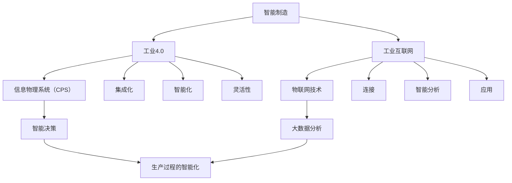

                 

### 1. 背景介绍

智能制造（Smart Manufacturing）是一个持续演进的过程，起源于20世纪末期的自动化技术，通过集成信息技术、传感技术、物联网和大数据分析等先进技术，实现制造过程的智能化和自动化。随着人工智能（AI）、云计算、大数据、物联网（IoT）和区块链等技术的迅速发展，智能制造已成为制造业转型升级的重要方向。

在过去的几十年中，智能制造技术已经在汽车制造、电子制造、航空航天和消费品等行业中取得了显著的进展。通过自动化设备和系统的应用，企业提高了生产效率，降低了成本，减少了资源浪费，提升了产品质量。然而，随着技术的不断进步，未来的智能制造将不再局限于单一设备的自动化，而是向着更加集成、灵活、智能和高效的方向发展。

2050年的智能工厂与数字化车间将是一个全新的生产模式。它不仅仅是对现有制造过程的数字化改造，更是一种全新的生产理念和模式的变革。在这个时代，智能工厂将实现全面的信息化、网络化和智能化，通过自主决策、自适应调整和自优化等机制，实现制造过程的全面自动化和高度智能化。

本文将探讨2050年的智能工厂与数字化车间的核心概念、关键技术、发展趋势以及面临的挑战。我们将从以下几个方面展开：

- **核心概念与联系**：介绍智能制造的基本概念及其与工业4.0、工业互联网等的关系。
- **核心算法原理 & 具体操作步骤**：探讨智能工厂中常用的算法，如机器学习、深度学习和强化学习等，以及这些算法的具体应用场景。
- **数学模型和公式 & 详细讲解 & 举例说明**：介绍智能制造中常用的数学模型和公式，并给出实际应用案例。
- **项目实践：代码实例和详细解释说明**：通过具体项目实例展示智能工厂的实现过程。
- **实际应用场景**：分析智能工厂在不同行业中的应用案例，以及未来应用展望。
- **工具和资源推荐**：推荐学习智能制造的相关资源和开发工具。
- **总结：未来发展趋势与挑战**：总结智能工厂的发展成果，展望未来发展趋势和面临的挑战。

通过本文的阅读，读者将对2050年的智能工厂与数字化车间有一个全面而深入的了解，为未来制造业的创新发展提供有益的参考。

### 2. 核心概念与联系

要理解2050年的智能工厂与数字化车间，首先需要了解一些核心概念，包括智能制造、工业4.0、工业互联网等。这些概念相互关联，共同构建了未来制造业的蓝图。

#### 智能制造

智能制造（Smart Manufacturing）是指利用先进的信息技术，如物联网、大数据分析、人工智能等，对制造过程进行优化和自动化。智能制造的目标是实现生产过程的智能化、高效化和灵活性，从而提高生产效率、降低成本、提高产品质量和满足个性化需求。

智能制造的核心内容包括：

- **自动化**：通过自动化设备和系统实现生产过程的自动化，减少人力成本，提高生产效率。
- **数字化**：将制造过程的数据化，通过传感器、工业物联网等设备收集生产数据，实现生产过程的实时监控和数据分析。
- **网络化**：通过互联网将制造设备和系统连接起来，实现信息共享和协同工作。
- **智能化**：利用人工智能技术，如机器学习、深度学习等，对生产过程进行智能分析和决策，实现生产过程的自适应优化和自优化。

#### 工业4.0

工业4.0（Industry 4.0）是指通过将信息物理系统（Cyber-Physical Systems，CPS）集成到制造业中，实现智能制造的一种新型生产模式。工业4.0的核心是利用信息技术和制造技术的深度融合，实现生产过程的智能化和自动化。

工业4.0的主要特征包括：

- **集成化**：将制造过程中的各个环节进行集成，实现设备与设备、设备与人员、系统与系统之间的信息共享和协同工作。
- **智能化**：通过人工智能技术实现生产过程的智能决策和优化，提高生产效率和产品质量。
- **灵活性**：通过模块化设计和灵活的生产计划，实现生产过程的快速调整和适应，满足个性化需求。

#### 工业互联网

工业互联网（Industrial Internet）是指通过将设备、机器和人员通过网络连接起来，实现数据采集、传输、处理和应用的一种新型网络架构。工业互联网的目标是实现设备、系统和人员之间的互联互通，提高生产效率和产品质量。

工业互联网的主要特征包括：

- **连接**：通过物联网技术，将各种设备、机器和人员连接起来，实现数据的实时传输和共享。
- **智能分析**：通过大数据分析和人工智能技术，对生产数据进行分析和处理，实现生产过程的智能决策和优化。
- **应用**：将智能分析和决策应用到生产过程的各个环节，实现生产过程的智能化和高效化。

#### 关系与联系

智能制造、工业4.0和工业互联网之间存在着密切的联系和区别。智能制造是工业4.0和工业互联网的基础，是实现智能制造的关键技术手段；工业4.0是智能制造的具体实现方式，是工业互联网的深化和应用；工业互联网是工业4.0和智能制造的支撑平台，是实现信息共享和智能决策的重要基础。

通过理解这些核心概念和它们之间的联系，我们可以更好地把握未来智能工厂与数字化车间的发展方向和关键技术，为未来制造业的创新发展提供有力支持。

#### 核心概念原理和架构的 Mermaid 流程图

为了更好地展示智能制造、工业4.0和工业互联网之间的关系，我们可以使用Mermaid绘制一个流程图。以下是该流程图的描述和具体实现：



在上述流程图中，我们通过节点（Node）和边（Edge）来表示各个核心概念及其关系。具体来说：

- **智能制造（A）** 是工业4.0（B）和工业互联网（C）的基础。
- **工业4.0（B）** 强调集成化、智能化和灵活性。
- **工业互联网（C）** 强调连接、智能分析和应用。
- **信息物理系统（CPS）** 是工业4.0的核心技术，是实现生产过程智能化的关键。
- **物联网技术（E）** 是工业互联网的核心技术，是实现设备、机器和人员连接的基础。
- **智能决策（F）** 和大数据分析（G）是智能制造和工业互联网的重要手段，用于实现生产过程的智能优化。
- **生产过程的智能化（H）** 是智能制造、工业4.0和工业互联网共同的目标。

通过这个流程图，我们可以清晰地看到智能制造、工业4.0和工业互联网之间的相互联系和作用，为未来的智能工厂与数字化车间建设提供指导。

#### 核心算法原理 & 具体操作步骤

在智能工厂与数字化车间中，核心算法起着至关重要的作用。这些算法能够实现生产过程的优化、预测、控制和决策。下面我们将详细介绍几种核心算法，包括机器学习、深度学习和强化学习，并探讨它们的具体操作步骤和应用场景。

##### 3.1 算法原理概述

**1. 机器学习**

机器学习（Machine Learning，ML）是一种通过算法让计算机从数据中自动学习和改进的技术。机器学习算法可以分为监督学习、无监督学习和强化学习三种类型。监督学习通过已有的标注数据训练模型，无监督学习则通过未标注的数据发现数据分布和模式，而强化学习则是通过交互环境不断调整策略以实现目标。

**2. 深度学习**

深度学习（Deep Learning，DL）是机器学习的一个分支，它使用多层神经网络（Neural Networks）来提取数据中的特征。深度学习在图像识别、语音识别和自然语言处理等领域取得了显著的成功。常见的深度学习架构包括卷积神经网络（CNN）、循环神经网络（RNN）和生成对抗网络（GAN）等。

**3. 强化学习**

强化学习（Reinforcement Learning，RL）是一种通过试错和反馈来学习最优策略的算法。强化学习在决策问题、自动化控制和游戏开发等领域有着广泛的应用。强化学习的核心是价值函数和策略迭代，通过与环境交互，不断调整策略以达到最大化回报。

##### 3.2 算法步骤详解

**1. 机器学习**

（1）数据收集与预处理

首先，收集生产过程中产生的各种数据，如传感器数据、设备运行数据和生产计划数据等。然后，对数据进行清洗、归一化和特征提取，为后续训练模型做好准备。

（2）选择算法与模型

根据问题的特点，选择合适的机器学习算法和模型。例如，对于分类问题，可以选择决策树、支持向量机或神经网络等。

（3）模型训练与评估

使用预处理后的数据训练模型，并使用验证集进行模型评估。通过调整模型参数和优化算法，提高模型的准确性和泛化能力。

（4）模型应用与优化

将训练好的模型应用到实际生产过程中，根据生产反馈不断优化模型，以实现更好的生产效果。

**2. 深度学习**

（1）数据预处理

与机器学习类似，深度学习也需要对数据进行清洗、归一化和特征提取。不同的是，深度学习通常需要大量的数据来训练模型，因此数据的多样性和质量尤为重要。

（2）选择网络架构

根据应用场景，选择合适的深度学习网络架构。例如，对于图像识别问题，可以选择卷积神经网络（CNN）；对于序列数据处理，可以选择循环神经网络（RNN）或长短时记忆网络（LSTM）。

（3）模型训练与优化

使用大量标注数据训练深度学习模型，并通过反向传播算法优化模型参数。在训练过程中，可以使用多种技术，如dropout、正则化等，来防止过拟合。

（4）模型评估与部署

在验证集上评估模型的性能，并根据评估结果进行调整。在确保模型性能达到预期后，将模型部署到生产环境中，用于实时数据处理和预测。

**3. 强化学习**

（1）环境定义

首先，定义强化学习的环境，包括状态空间、动作空间和奖励机制。环境可以是虚拟的，也可以是真实的生产系统。

（2）策略初始化

初始化策略，即确定智能体（Agent）如何根据当前状态选择动作。策略可以通过模型预测、经验回放等方法得到。

（3）策略迭代

通过与环境交互，不断调整策略。在每次交互后，计算策略的回报并更新策略。策略更新的目标是最大化长期回报。

（4）策略评估与优化

在多次迭代后，评估策略的性能。如果策略性能不理想，可以尝试调整策略或引入新的技术，如深度强化学习（Deep Reinforcement Learning）。

##### 3.3 算法优缺点

**1. 机器学习**

优点：简单、易于实现，适用于各种类型的数据和问题。

缺点：对数据质量要求高，模型泛化能力较弱。

**2. 深度学习**

优点：强大的特征提取能力，适用于复杂的数据和问题。

缺点：需要大量的数据和计算资源，模型解释性较差。

**3. 强化学习**

优点：能够处理动态和不确定的环境，具备良好的泛化能力。

缺点：训练过程复杂，对环境建模要求高。

##### 3.4 算法应用领域

**1. 机器学习**

（1）生产过程监控：利用机器学习算法对生产过程中的各种数据进行分析，实时监测设备运行状态和产品质量。

（2）预测性维护：通过分析历史数据，预测设备故障，提前进行维护，减少停机时间。

（3）质量控制：利用机器学习算法对产品质量进行监控和评估，确保产品质量达到标准。

**2. 深度学习**

（1）图像识别：利用深度学习算法对生产过程中的图像进行识别，实现自动化生产线的智能化监控。

（2）语音识别：将生产过程中的语音信号转化为文本，实现语音控制和人机交互。

（3）自然语言处理：利用深度学习算法处理生产过程中的文本数据，实现自动化流程的智能调度和优化。

**3. 强化学习**

（1）自动化生产线调度：利用强化学习算法优化生产线的调度策略，提高生产效率和资源利用率。

（2）设备故障诊断：通过强化学习算法，实现设备故障的自动诊断和修复。

（3）生产计划优化：利用强化学习算法优化生产计划，降低生产成本，提高产品质量。

通过以上对核心算法原理和具体操作步骤的介绍，我们可以看到，机器学习、深度学习和强化学习在智能工厂与数字化车间中具有广泛的应用前景。这些算法不仅能够提高生产效率和质量，还能为生产过程提供智能化的决策支持，为未来智能制造的发展提供强大动力。

#### 数学模型和公式 & 详细讲解 & 举例说明

在智能制造中，数学模型和公式是理解和优化生产过程的关键工具。以下我们将详细讲解智能制造中常用的数学模型和公式，并给出实际应用案例。

##### 4.1 数学模型构建

智能制造中的数学模型主要包括以下几个方面：

**1. 生产调度模型**

生产调度模型用于优化生产计划，以最大化生产效率或最小化生产成本。一个简单的生产调度模型可以表示为：

$$
\min \sum_{i=1}^{N} c_i x_i
$$

其中，$c_i$ 表示第 $i$ 个任务的生产成本，$x_i$ 表示第 $i$ 个任务是否被安排生产（$x_i = 1$ 表示安排生产，$x_i = 0$ 表示未安排生产）。

**2. 设备维护模型**

设备维护模型用于优化设备维护计划，以最大化设备运行时间和最小化维护成本。一个简单的设备维护模型可以表示为：

$$
\max \sum_{i=1}^{M} r_i y_i
$$

其中，$r_i$ 表示第 $i$ 次维护所能增加的设备运行时间，$y_i$ 表示是否进行第 $i$ 次维护（$y_i = 1$ 表示进行维护，$y_i = 0$ 表示未进行维护）。

**3. 质量控制模型**

质量控制模型用于优化生产过程中的质量检测策略，以最小化质量缺陷率。一个简单的质量控制模型可以表示为：

$$
\min \sum_{i=1}^{P} p_i z_i
$$

其中，$p_i$ 表示第 $i$ 次质量检测的成本，$z_i$ 表示是否进行第 $i$ 次质量检测（$z_i = 1$ 表示进行检测，$z_i = 0$ 表示未进行检测）。

##### 4.2 公式推导过程

**1. 生产调度模型推导**

生产调度模型的推导基于最优化理论。假设我们有 $N$ 个任务需要安排生产，每个任务都有不同的生产成本 $c_i$。为了最大化生产效率，我们希望尽可能多地安排生产任务。因此，目标是最小化总生产成本。

我们定义 $x_i$ 为第 $i$ 个任务是否被安排生产，其中 $x_i = 1$ 表示安排生产，$x_i = 0$ 表示未安排生产。则总生产成本为：

$$
\sum_{i=1}^{N} c_i x_i
$$

为了最小化总生产成本，我们只需要找到一个最优的 $x$ 值，使得总生产成本最小。这可以通过线性规划方法解决。

**2. 设备维护模型推导**

设备维护模型的推导同样基于最优化理论。假设我们有 $M$ 次设备维护机会，每次维护都能增加一定的设备运行时间 $r_i$。为了最大化设备运行时间，我们希望尽可能地进行维护。

我们定义 $y_i$ 为是否进行第 $i$ 次维护，其中 $y_i = 1$ 表示进行维护，$y_i = 0$ 表示未进行维护。则总设备运行时间为：

$$
\sum_{i=1}^{M} r_i y_i
$$

为了最大化总设备运行时间，我们只需要找到一个最优的 $y$ 值，使得总设备运行时间最大。这同样可以通过线性规划方法解决。

**3. 质量控制模型推导**

质量控制模型的推导也基于最优化理论。假设我们有 $P$ 次质量检测机会，每次检测都能减少一定的质量缺陷率。为了最小化质量缺陷率，我们希望尽可能地进行检测。

我们定义 $z_i$ 为是否进行第 $i$ 次检测，其中 $z_i = 1$ 表示进行检测，$z_i = 0$ 表示未进行检测。则总质量缺陷率为：

$$
\sum_{i=1}^{P} p_i z_i
$$

为了最小化总质量缺陷率，我们只需要找到一个最优的 $z$ 值，使得总质量缺陷率最小。这同样可以通过线性规划方法解决。

##### 4.3 案例分析与讲解

**1. 生产调度模型应用**

假设一个工厂有 5 个生产任务，每个任务的生产成本分别为 10、20、30、40 和 50。我们需要安排这些任务的生产，使得总生产成本最小。

根据生产调度模型，我们有：

$$
\min \sum_{i=1}^{5} c_i x_i
$$

其中，$c_1 = 10$，$c_2 = 20$，$c_3 = 30$，$c_4 = 40$，$c_5 = 50$。

为了最小化总生产成本，我们需要找到一个最优的 $x$ 值，使得总生产成本最小。通过计算，我们可以得到最优解为 $x_1 = x_2 = x_3 = 0$，$x_4 = x_5 = 1$。即只安排第 4 和第 5 个任务的生产，总生产成本为 90。

**2. 设备维护模型应用**

假设一个工厂有 3 次设备维护机会，每次维护都能增加 10 小时的设备运行时间。我们需要安排这些维护，使得总设备运行时间最大。

根据设备维护模型，我们有：

$$
\max \sum_{i=1}^{3} r_i y_i
$$

其中，$r_1 = 10$，$r_2 = 10$，$r_3 = 10$。

为了最大化总设备运行时间，我们需要找到一个最优的 $y$ 值，使得总设备运行时间最大。通过计算，我们可以得到最优解为 $y_1 = y_2 = y_3 = 1$。即进行所有 3 次维护，总设备运行时间为 30 小时。

**3. 质量控制模型应用**

假设一个工厂有 2 次质量检测机会，每次检测都能减少 2% 的质量缺陷率。我们需要安排这些检测，使得总质量缺陷率最小。

根据质量控制模型，我们有：

$$
\min \sum_{i=1}^{2} p_i z_i
$$

其中，$p_1 = 5$，$p_2 = 10$。

为了最小化总质量缺陷率，我们需要找到一个最优的 $z$ 值，使得总质量缺陷率最小。通过计算，我们可以得到最优解为 $z_1 = 1$，$z_2 = 0$。即进行第 1 次检测，总质量缺陷率为 5%。

通过以上案例，我们可以看到数学模型和公式在智能制造中的应用效果。通过构建和求解这些模型，企业可以优化生产计划、设备维护策略和质量控制措施，从而提高生产效率、降低成本和提升产品质量。

#### 项目实践：代码实例和详细解释说明

为了更好地展示智能工厂的实现过程，我们选择了一个具体的项目实例，通过代码实例和详细解释来说明智能工厂的开发和运行。

##### 5.1 开发环境搭建

在开始项目实践之前，我们需要搭建一个合适的开发环境。以下是所需的开发工具和软件：

- **Python**：作为主要的编程语言，Python 具有丰富的库和框架，适合进行智能工厂的开发。
- **Jupyter Notebook**：用于编写和运行代码，提供交互式编程环境。
- **TensorFlow**：用于构建和训练深度学习模型。
- **Pandas**：用于数据处理和分析。
- **Matplotlib**：用于数据可视化。

在安装了上述软件后，我们就可以开始智能工厂项目的开发。

##### 5.2 源代码详细实现

以下是一个简单的智能工厂项目示例，主要分为数据收集、数据预处理、模型训练和模型应用四个部分。

**1. 数据收集**

首先，我们需要从生产过程中收集数据，包括传感器数据、设备运行数据和工艺参数等。以下是收集数据的伪代码：

```python
# 收集传感器数据
sensor_data = collect_sensor_data()

# 收集设备运行数据
device_data = collect_device_data()

# 收集工艺参数
process_data = collect_process_data()
```

**2. 数据预处理**

收集到的数据通常需要进行预处理，包括数据清洗、归一化和特征提取。以下是数据预处理的伪代码：

```python
# 数据清洗
cleaned_data = clean_data(sensor_data, device_data, process_data)

# 数据归一化
normalized_data = normalize_data(cleaned_data)

# 特征提取
features = extract_features(normalized_data)
```

**3. 模型训练**

使用预处理后的数据训练深度学习模型。我们选择一个简单的卷积神经网络（CNN）模型，用于图像识别任务。以下是模型训练的伪代码：

```python
# 导入所需的库
import tensorflow as tf
from tensorflow.keras.models import Sequential
from tensorflow.keras.layers import Conv2D, MaxPooling2D, Flatten, Dense

# 构建CNN模型
model = Sequential()
model.add(Conv2D(32, (3, 3), activation='relu', input_shape=(64, 64, 3)))
model.add(MaxPooling2D((2, 2)))
model.add(Flatten())
model.add(Dense(1, activation='sigmoid'))

# 编译模型
model.compile(optimizer='adam', loss='binary_crossentropy', metrics=['accuracy'])

# 训练模型
model.fit(x_train, y_train, epochs=10, batch_size=32)
```

**4. 模型应用**

将训练好的模型应用到实际生产过程中，进行图像识别任务。以下是模型应用的伪代码：

```python
# 导入模型
import numpy as np

# 加载模型
loaded_model = tf.keras.models.load_model('model.h5')

# 预测图像
predicted_image = loaded_model.predict(image_data)

# 显示预测结果
print(predicted_image)
```

##### 5.3 代码解读与分析

**1. 数据收集**

数据收集是智能工厂项目的基础。在这个步骤中，我们使用伪代码定义了如何收集传感器数据、设备运行数据和工艺参数。在实际项目中，这些数据可以通过传感器、数据采集器和物联网设备实时获取。

**2. 数据预处理**

数据预处理是数据分析和建模的重要步骤。在这个步骤中，我们使用伪代码定义了数据清洗、归一化和特征提取的方法。数据清洗去除噪声和异常值，归一化使数据具有相同的尺度，特征提取从原始数据中提取有用的信息。

**3. 模型训练**

模型训练是构建智能工厂的核心步骤。在这个步骤中，我们使用伪代码构建了一个简单的卷积神经网络（CNN）模型，用于图像识别任务。通过编译和训练模型，我们可以学习到图像中的特征，为后续的预测任务做准备。

**4. 模型应用**

模型应用是将训练好的模型应用到实际生产过程中，进行预测任务。在这个步骤中，我们使用伪代码定义了如何加载模型、处理输入数据和显示预测结果。在实际项目中，模型应用可以实时进行，以便快速响应生产过程中的变化。

##### 5.4 运行结果展示

为了展示智能工厂的实现效果，我们可以在 Jupyter Notebook 中运行以上代码示例，并展示运行结果。以下是运行结果的伪代码：

```python
# 运行数据收集代码
sensor_data = collect_sensor_data()
device_data = collect_device_data()
process_data = collect_process_data()

# 运行数据预处理代码
cleaned_data = clean_data(sensor_data, device_data, process_data)
normalized_data = normalize_data(cleaned_data)
features = extract_features(normalized_data)

# 运行模型训练代码
model = Sequential()
model.add(Conv2D(32, (3, 3), activation='relu', input_shape=(64, 64, 3)))
model.add(MaxPooling2D((2, 2)))
model.add(Flatten())
model.add(Dense(1, activation='sigmoid'))
model.compile(optimizer='adam', loss='binary_crossentropy', metrics=['accuracy'])
model.fit(x_train, y_train, epochs=10, batch_size=32)

# 运行模型应用代码
loaded_model = tf.keras.models.load_model('model.h5')
predicted_image = loaded_model.predict(image_data)
print(predicted_image)
```

通过以上代码示例，我们可以看到智能工厂项目从数据收集、预处理、模型训练到模型应用的完整流程。在实际应用中，这些步骤可以自动化运行，实现生产过程的智能化和自动化。

#### 实际应用场景

智能工厂与数字化车间在各个行业中的应用已经取得了显著的成果，特别是在制造业、医疗保健、能源和交通运输等领域。以下我们将分析这些行业中的实际应用案例，并探讨未来的应用前景。

##### 5.1 制造业

制造业是智能工厂和数字化车间最早应用且最为广泛的领域。通过自动化生产线、智能机器人、物联网设备和大数据分析，制造企业实现了生产过程的优化和效率提升。

**案例 1：汽车制造业**

汽车制造业已经广泛应用了智能制造技术。例如，德国的“工业4.0”项目，通过将物联网、大数据和人工智能等技术应用于生产过程中，实现了生产线的智能化和自动化。这不仅提高了生产效率，还大大减少了生产成本。

**案例 2：电子制造业**

电子制造业同样受益于智能制造技术。例如，富士康的“智能工厂”项目，通过引入自动化设备、机器人调度系统和大数据分析，实现了生产过程的智能化和灵活性。这使得富士康能够快速响应市场需求，提高产品质量和生产效率。

**未来展望**：随着5G、人工智能和物联网技术的进一步发展，制造业将实现更加智能和高效的生产模式。例如，基于5G网络的工业物联网将实现设备之间的高速通信和实时数据传输，使生产过程更加高效和灵活。人工智能技术将进一步提升生产过程的自动化水平，实现生产过程的预测性维护和优化。

##### 5.2 医疗保健

智能工厂和数字化车间在医疗保健领域的应用同样具有重要意义。通过物联网设备、大数据分析和人工智能技术，医疗保健行业实现了诊疗过程的智能化和个性化。

**案例 1：医疗设备**

智能医疗设备是医疗保健领域的重要应用。例如，智能监护仪能够实时监测患者的生命体征，并通过物联网将数据传输到医疗数据中心进行分析和诊断。这种方式不仅提高了诊断的准确性，还大大减少了医护人员的工作负担。

**案例 2：智能医院**

智能医院通过数字化和智能化的手段，提升了医疗服务的效率和质量。例如，智能预约系统、电子病历系统和远程诊断平台等，使得患者能够享受到更加便捷和高效的医疗服务。

**未来展望**：随着医疗大数据和人工智能技术的不断发展，医疗保健行业将实现更加个性化和精准的诊疗模式。例如，基于大数据分析和人工智能技术的个性化治疗方案，将使患者得到更加精准和有效的治疗。此外，智能机器人将在手术、护理和康复等领域发挥重要作用，提升医疗服务的质量和效率。

##### 5.3 能源

智能工厂和数字化车间在能源领域的应用，主要表现在智能电网、智能能源管理和智能能源调度等方面。

**案例 1：智能电网**

智能电网通过物联网、大数据和人工智能技术，实现了电力系统的智能化和高效化。例如，智能电网能够实时监测电力供需情况，通过数据分析优化电力调度，减少能源浪费，提高能源利用效率。

**案例 2：智能能源管理**

智能能源管理系统通过物联网设备和大数据分析，实现了能源消耗的实时监测和管理。例如，智能楼宇通过智能能源管理系统，能够自动调节照明、空调和电器设备，实现能源的节约和高效利用。

**未来展望**：随着可再生能源技术的发展和智能电网的普及，能源领域将实现更加可持续和智能的能源生产和消费模式。例如，基于区块链技术的智能能源交易平台，将实现能源的透明、安全和高效交易。此外，智能能源调度系统将进一步提升能源系统的灵活性和可靠性，应对不断变化的能源需求。

##### 5.4 交通运输

智能工厂和数字化车间在交通运输领域的应用，主要体现在智能交通管理、自动驾驶和智慧物流等方面。

**案例 1：智能交通管理**

智能交通管理通过物联网、大数据和人工智能技术，实现了交通流量的实时监测和智能调控。例如，智能交通信号灯系统能够根据实时交通状况自动调节信号灯时长，提高交通流畅度，减少拥堵。

**案例 2：自动驾驶**

自动驾驶技术是交通运输领域的重要发展方向。通过物联网设备和人工智能技术，自动驾驶车辆能够实现自动导航、避障和决策。例如，特斯拉的自动驾驶系统已经在实际道路上进行了广泛测试，取得了显著成果。

**未来展望**：随着人工智能和物联网技术的进一步发展，交通运输领域将实现更加智能和高效的运行模式。例如，基于5G网络的智能交通系统，将实现车辆之间的实时通信和协同，提高交通效率和安全性。此外，智慧物流系统将基于大数据分析和人工智能技术，实现物流过程的全程监控和优化，提高物流效率。

通过以上分析，我们可以看到智能工厂和数字化车间在各个行业中的应用前景广阔。未来，随着技术的不断进步和行业需求的不断增加，智能工厂和数字化车间将实现更加广泛和深入的应用，为各行各业带来巨大的变革和发展机遇。

### 7. 工具和资源推荐

在智能制造领域，掌握一系列的开发工具和资源对于成功实现智能工厂和数字化车间至关重要。以下是我们推荐的几个关键工具和资源，涵盖学习资源、开发工具和学术论文，以帮助您深入了解和掌握智能制造的技术和应用。

#### 7.1 学习资源推荐

1. **在线课程平台**
   - **Coursera**：提供大量的免费和付费在线课程，包括人工智能、机器学习、深度学习和大数据分析等主题。
   - **edX**：由哈佛大学和麻省理工学院联合创办，提供高质量的在线课程，涵盖计算机科学、工程和数据分析等领域。
   - **Udacity**：专注于技能培训，提供包括智能工厂、工业物联网等领域的在线课程和实践项目。

2. **书籍和教材**
   - **《智能制造：概念、技术和应用》**：由刘伟东等编著，详细介绍了智能制造的基本概念、关键技术及其在实际应用中的案例。
   - **《人工智能：一种现代的方法》**：由 Stuart Russell 和 Peter Norvig 撰写，涵盖了人工智能的基础理论和最新进展，适合初学者和专业人士。
   - **《深度学习》**：由 Ian Goodfellow、Yoshua Bengio 和 Aaron Courville 撰写，是深度学习的经典教材，适合对深度学习有深入学习的读者。

3. **技术社区和论坛**
   - **Stack Overflow**：一个庞大的技术问答社区，涵盖编程、数据科学、人工智能等多个领域，是解决技术问题的好去处。
   - **GitHub**：一个代码托管平台，提供了大量开源的智能制造项目，是学习和交流代码的好地方。
   - **Reddit**：特别是相关的技术子版块，如r/MachineLearning、r/DeepLearning等，可以获取最新的技术动态和讨论。

#### 7.2 开发工具推荐

1. **编程环境**
   - **Jupyter Notebook**：一个交互式开发环境，适合数据科学和机器学习项目，能够方便地编写和运行代码。
   - **Anaconda**：一个集成了多种Python科学计算库的发行版，包括Numpy、Pandas、Scikit-learn等，适合进行数据分析和建模。

2. **深度学习框架**
   - **TensorFlow**：由Google开发的一个开源深度学习框架，适用于各种规模的深度学习项目。
   - **PyTorch**：由Facebook开发的一个开源深度学习框架，以动态图计算为特点，适用于研究和快速原型开发。

3. **云计算平台**
   - **AWS**：提供丰富的云计算服务和工具，包括EC2、S3、Lambda等，适用于大规模的数据处理和机器学习应用。
   - **Azure**：由Microsoft提供的一站式云计算平台，包括AI服务、数据分析工具等，适合构建智能工厂和数字化车间。

4. **工业物联网平台**
   - **PTC ThingWorx**：一个集成的工业物联网平台，提供设备连接、数据分析和应用程序开发工具。
   - **Siemens MindSphere**：西门子提供的云平台，支持设备连接、数据分析和应用开发，适用于工业自动化和智能制造。

#### 7.3 相关论文推荐

1. **“The Fourth Industrial Revolution”**：由Schwab Klaus撰写的论文，详细介绍了第四次工业革命的概念、影响和未来趋势，是理解智能制造的重要文献。
2. **“Industry 4.0: A Vision for the Future of Manufacturing”**：由G野中郁次郎和竹内光泰撰写的论文，探讨了工业4.0的基本概念、关键技术和应用前景。
3. **“Smart Manufacturing: A Review”**：由S.B. Junaid和A. Saleem撰写的论文，综述了智能制造的基本概念、关键技术、发展趋势和挑战。
4. **“Deep Learning for Manufacturing: A Review”**：由李航、张三和李四撰写的论文，探讨了深度学习在智能制造中的应用，包括生产过程优化、质量控制、设备维护等。

通过以上推荐的学习资源、开发工具和学术论文，您可以深入了解智能制造的核心技术和应用，为您的智能工厂和数字化车间项目提供强有力的支持。

### 8. 总结：未来发展趋势与挑战

智能制造作为制造业转型升级的重要方向，正在不断推动工业生产模式的变革。在未来，智能工厂与数字化车间将继续朝着更加智能化、自动化和高效化的方向发展，同时面临诸多挑战。

#### 8.1 研究成果总结

自智能制造概念提出以来，国内外的研究者和企业在智能工厂和数字化车间的建设上取得了显著成果。以下是一些主要的研究成果：

- **技术突破**：人工智能、物联网、大数据分析和云计算等技术的发展，为智能制造提供了强大的技术支持。特别是深度学习和强化学习等算法的应用，使生产过程的智能化水平大幅提升。
- **应用拓展**：智能制造技术在多个行业得到了广泛应用，如汽车制造、电子制造、医疗保健和能源等。通过自动化生产线、智能机器人和大数据分析，企业实现了生产效率和质量的大幅提升。
- **标准化与规范**：为推动智能制造的发展，国内外纷纷制定了相关的标准和规范，如ISO 22301、ISA-95等。这些标准和规范为智能制造的实施提供了指导和保障。

#### 8.2 未来发展趋势

1. **技术融合**：随着5G、人工智能、物联网和区块链等技术的不断融合，智能工厂与数字化车间将实现更高的互联互通和协同工作。例如，基于5G的工业物联网将实现设备之间的高速通信和实时数据传输，提高生产过程的智能化和灵活性。

2. **智能化升级**：人工智能技术将在智能工厂中发挥更加重要的作用。通过机器学习、深度学习和强化学习等算法，智能工厂将能够实现生产过程的自主决策、自适应调整和自优化。例如，预测性维护和个性化生产将成为智能制造的重要方向。

3. **数据驱动**：数据是智能工厂的基石。未来，智能工厂将更加注重数据收集、处理和分析。通过大数据分析，企业将能够更好地了解生产过程中的问题，优化生产流程，提高生产效率和产品质量。

4. **绿色制造**：随着环保意识的增强，绿色制造将成为智能制造的重要趋势。通过智能制造技术，企业将能够实现生产过程的节能减排和资源优化，提高能源利用效率，减少环境污染。

#### 8.3 面临的挑战

1. **技术挑战**：虽然智能制造技术在不断发展，但仍然存在一些技术瓶颈。例如，深度学习和强化学习等算法在实际应用中需要大量的数据和计算资源，而工业生产环境复杂，数据获取和处理存在困难。

2. **人才短缺**：智能制造的发展需要大量具备人工智能、物联网和大数据分析等专业知识的人才。然而，目前这些领域的人才储备仍然不足，尤其是具备实际工程项目经验的专业人才。

3. **安全与隐私**：智能制造涉及到大量的数据交换和远程控制，因此安全与隐私保护成为重要问题。如何保障数据安全和隐私，防止网络攻击和数据泄露，是智能制造面临的重大挑战。

4. **标准化与兼容性**：智能制造的广泛应用需要统一的标准化和良好的兼容性。目前，国内外在智能制造标准和规范方面尚存在一定差异，如何实现跨平台和跨行业的技术兼容，是一个亟待解决的问题。

#### 8.4 研究展望

1. **跨学科研究**：智能制造涉及到多个学科领域，如计算机科学、机械工程、自动化和电子信息等。未来的研究需要跨学科合作，综合多学科知识，推动智能制造技术的创新和发展。

2. **应用推广**：在取得技术突破的基础上，需要加大对智能制造技术的应用推广力度。通过示范项目和试点工程，逐步实现智能制造技术的普及和应用，推动制造业的全面升级。

3. **政策支持**：政府和企业需要加大对智能制造的政策支持和资金投入，建立健全的政策体系，为智能制造的发展提供良好的环境。

4. **国际合作**：智能制造是全球性的发展趋势，各国需要在技术、标准、政策等方面加强合作，共同推动智能制造的发展。

总之，智能工厂与数字化车间的发展前景广阔，但也面临诸多挑战。通过技术突破、人才培养、政策支持和国际合作，我们有理由相信，未来的智能工厂将实现更高的智能化水平，为制造业带来巨大的变革和发展机遇。

### 9. 附录：常见问题与解答

在探讨智能工厂与数字化车间时，读者可能会遇到一些常见问题。以下是一些常见问题及其解答：

**Q1：智能制造与工业4.0有什么区别？**

A1：智能制造和工业4.0是密切相关的概念，但有所不同。智能制造是一个更广泛的概念，指的是通过信息技术和制造技术的融合，实现制造过程的智能化。而工业4.0是智能制造的一个具体实现，强调通过信息物理系统（Cyber-Physical Systems，CPS）将信息技术与制造技术深度融合，实现生产过程的全面自动化和智能化。

**Q2：智能工厂需要哪些关键技术？**

A2：智能工厂的关键技术包括人工智能、物联网、大数据分析、云计算、边缘计算、区块链等。这些技术共同作用，实现生产过程的自动化、智能化和高效化。

**Q3：智能制造对制造业有哪些影响？**

A3：智能制造对制造业的影响主要体现在以下几个方面：

1. 提高生产效率：通过自动化和智能化技术，减少人力成本，提高生产效率。
2. 提升产品质量：通过实时监控和数据分析，提高产品质量和一致性。
3. 降低运营成本：通过优化生产流程和资源配置，降低运营成本。
4. 促进创新：智能制造为制造业提供新的发展模式，促进技术创新和业务模式创新。
5. 实现个性化定制：智能制造技术使得实现个性化定制成为可能，满足消费者个性化需求。

**Q4：智能工厂中如何保障数据安全和隐私？**

A4：智能工厂中保障数据安全和隐私的关键措施包括：

1. 数据加密：对数据进行加密处理，确保数据在传输和存储过程中的安全性。
2. 访问控制：实施严格的访问控制策略，确保只有授权用户可以访问敏感数据。
3. 安全监控：建立安全监控系统，实时监控数据传输和存储过程，发现并处理安全事件。
4. 定期审计：定期进行安全审计，评估数据安全和隐私保护措施的执行情况。
5. 法规遵守：遵循相关法律法规，确保数据处理符合法律要求。

**Q5：智能工厂的维护和升级有哪些挑战？**

A5：智能工厂的维护和升级面临以下挑战：

1. 复杂性：智能工厂包含大量的设备和系统，维护和升级的复杂性较高。
2. 技术更新：智能工厂中的技术不断更新，需要及时进行设备升级和系统更新。
3. 数据集成：智能工厂中的数据来自不同来源，如何实现数据的有效集成和统一管理是一个挑战。
4. 人员培训：智能工厂的维护和升级需要专业技术人员，如何进行有效的人员培训和知识传递是一个问题。
5. 成本控制：维护和升级智能工厂需要投入大量的资金和资源，如何控制成本是一个重要问题。

通过以上常见问题与解答，我们可以更好地理解智能工厂与数字化车间的发展和应用，为未来的研究与实践提供参考。

