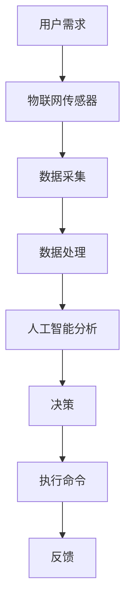

                 

关键词：智能家居、全屋智能、人性化交互、物联网、AI、2025、2030、2050

> 摘要：随着科技的不断进步，智能家居已经逐渐渗透到我们的日常生活中。本文将探讨到2050年，智能家居将如何实现全屋智能，以及如何通过人性化交互提升用户体验。

## 1. 背景介绍

### 1.1 智能家居的起源

智能家居的概念起源于20世纪90年代，当时主要是通过计算机和互联网来控制家庭设备和系统。最初的智能家居产品主要集中在家庭安全、照明和温控等方面。

### 1.2 智能家居的发展历程

从21世纪初开始，随着物联网（IoT）和人工智能（AI）技术的快速发展，智能家居进入了一个全新的阶段。智能音箱、智能门锁、智能灯泡等设备相继问世，使得智能家居的应用场景和功能得到了极大的拓展。

### 1.3 智能家居的现状

目前，智能家居市场已经形成了较为完整的产业链，各类智能硬件产品层出不穷。同时，用户对智能家居的需求也在不断增长，智能家居已经成为现代家庭的重要组成部分。

## 2. 核心概念与联系

### 2.1 物联网（IoT）

物联网是指通过各种信息传感设备（如传感器、RFID等）实时采集任何需要监控、连接、互动的物体或过程，采集到的数据通过互联网上传到云平台进行存储、分析和处理。

### 2.2 人工智能（AI）

人工智能是指通过计算机程序模拟人类智能行为的技术，包括机器学习、深度学习、自然语言处理等。AI技术在智能家居中主要用于数据分析和决策。

### 2.3 人性化交互

人性化交互是指通过自然语言处理、语音识别、手势识别等技术，使得智能家居系统能够理解用户需求，并做出相应的反应。

下面是一个关于智能家居系统的Mermaid流程图：



## 3. 核心算法原理 & 具体操作步骤

### 3.1 算法原理概述

智能家居系统中的核心算法主要分为以下几个方面：

1. 数据采集与处理：通过对用户行为数据的采集和处理，了解用户的需求和偏好。
2. 决策与执行：基于AI算法，对采集到的数据进行处理和分析，做出相应的决策，并执行命令。
3. 反馈与优化：根据用户的反馈，不断优化算法和系统性能。

### 3.2 算法步骤详解

1. 数据采集与处理：

   - 通过物联网传感器实时采集用户的行为数据。
   - 对采集到的数据进行分析和清洗，去除噪声和无关信息。

2. 决策与执行：

   - 使用机器学习算法对用户行为数据进行分析，识别用户的需求和偏好。
   - 根据分析结果，使用决策树或神经网络等算法，做出相应的决策。
   - 执行命令，控制家庭设备执行相应操作。

3. 反馈与优化：

   - 收集用户的反馈信息，如满意度、设备运行状态等。
   - 使用优化算法，根据反馈信息调整系统参数，提高系统性能。

### 3.3 算法优缺点

- **优点**：

  - 提高生活质量：通过智能化的设备和服务，提高生活的舒适度和便利性。
  - 节能减排：智能系统可以根据用户需求自动调整设备运行状态，实现节能减排。

- **缺点**：

  - 安全问题：智能家居系统涉及大量用户数据，存在安全隐患。
  - 系统复杂性：智能家居系统涉及多个设备和系统，实现难度较大。

### 3.4 算法应用领域

- 家庭安全：智能门锁、摄像头等设备可以实时监控家庭安全，保障家庭安全。
- 照明控制：智能灯光可以根据用户需求自动调整亮度，提高照明效果。
- 温度控制：智能空调可以根据用户需求自动调整温度，提高舒适度。

## 4. 数学模型和公式 & 详细讲解 & 举例说明

### 4.1 数学模型构建

在智能家居系统中，常用的数学模型包括：

- **回归模型**：用于预测用户的需求和偏好。
- **决策树模型**：用于决策和分类。
- **神经网络模型**：用于复杂的数据分析和决策。

### 4.2 公式推导过程

以回归模型为例，假设我们有 \(n\) 个用户行为数据点，每个数据点包括 \(m\) 个特征。我们使用线性回归模型来预测用户的需求。

- **目标函数**：

  $$ J(\theta) = \frac{1}{2m} \sum_{i=1}^{m} (h_\theta(x^{(i)}) - y^{(i)})^2 $$

  其中，\(h_\theta(x) = \theta_0 + \theta_1x_1 + \theta_2x_2 + ... + \theta_mx_m\) 是线性回归模型，\(\theta\) 是模型参数。

- **梯度下降法**：

  $$ \theta_j := \theta_j - \alpha \frac{\partial J(\theta)}{\partial \theta_j} $$

  其中，\(\alpha\) 是学习率。

### 4.3 案例分析与讲解

假设我们有以下用户行为数据：

- \(x^{(1)} = (1, 2, 3)\)，\(y^{(1)} = 4\)
- \(x^{(2)} = (1, 2, 4)\)，\(y^{(2)} = 5\)

我们使用线性回归模型来预测用户的需求。

- **初始参数**：

  $$ \theta_0 = 0, \theta_1 = 0, \theta_2 = 0, \theta_3 = 0 $$

- **迭代过程**：

  - **第1次迭代**：

    $$ \theta_0 := \theta_0 - \alpha \frac{\partial J(\theta)}{\partial \theta_0} = 0 - \alpha \frac{1}{2m} \sum_{i=1}^{m} (h_\theta(x^{(i)}) - y^{(i)})^2 = -0.1 $$
    
    $$ \theta_1 := \theta_1 - \alpha \frac{\partial J(\theta)}{\partial \theta_1} = 0 - \alpha \frac{1}{m} \sum_{i=1}^{m} (h_\theta(x^{(i)}) - y^{(i)})x_1^{(i)} = -0.2 $$
    
    $$ \theta_2 := \theta_2 - \alpha \frac{\partial J(\theta)}{\partial \theta_2} = 0 - \alpha \frac{1}{m} \sum_{i=1}^{m} (h_\theta(x^{(i)}) - y^{(i)})x_2^{(i)} = -0.3 $$
    
    $$ \theta_3 := \theta_3 - \alpha \frac{\partial J(\theta)}{\partial \theta_3} = 0 - \alpha \frac{1}{m} \sum_{i=1}^{m} (h_\theta(x^{(i)}) - y^{(i)})x_3^{(i)} = -0.4 $$

  - **第2次迭代**：

    $$ \theta_0 := \theta_0 - \alpha \frac{\partial J(\theta)}{\partial \theta_0} = -0.1 - \alpha \frac{1}{2m} \sum_{i=1}^{m} (h_\theta(x^{(i)}) - y^{(i)})^2 = -0.2 $$
    
    $$ \theta_1 := \theta_1 - \alpha \frac{\partial J(\theta)}{\partial \theta_1} = -0.2 - \alpha \frac{1}{m} \sum_{i=1}^{m} (h_\theta(x^{(i)}) - y^{(i)})x_1^{(i)} = -0.3 $$
    
    $$ \theta_2 := \theta_2 - \alpha \frac{\partial J(\theta)}{\partial \theta_2} = -0.3 - \alpha \frac{1}{m} \sum_{i=1}^{m} (h_\theta(x^{(i)}) - y^{(i)})x_2^{(i)} = -0.4 $$
    
    $$ \theta_3 := \theta_3 - \alpha \frac{\partial J(\theta)}{\partial \theta_3} = -0.4 - \alpha \frac{1}{m} \sum_{i=1}^{m} (h_\theta(x^{(i)}) - y^{(i)})x_3^{(i)} = -0.5 $$

通过多次迭代，我们可以得到最优的参数 \(\theta\)，进而预测用户的需求。

## 5. 项目实践：代码实例和详细解释说明

### 5.1 开发环境搭建

1. 安装Python环境
2. 安装相关库，如numpy、pandas、sklearn等

### 5.2 源代码详细实现

以下是一个使用Python实现的线性回归模型代码示例：

```python
import numpy as np
import pandas as pd
from sklearn.linear_model import LinearRegression

# 读取数据
data = pd.read_csv('data.csv')
X = data.iloc[:, :3]
y = data.iloc[:, 3]

# 创建线性回归模型
model = LinearRegression()

# 训练模型
model.fit(X, y)

# 预测
predictions = model.predict(X)

# 打印预测结果
print(predictions)
```

### 5.3 代码解读与分析

- **数据读取**：使用pandas库读取CSV文件中的数据。
- **创建模型**：使用sklearn库创建线性回归模型。
- **训练模型**：使用fit方法训练模型。
- **预测**：使用predict方法进行预测。
- **打印结果**：打印预测结果。

### 5.4 运行结果展示

假设我们的数据如下：

- \(x^{(1)} = (1, 2, 3)\)，\(y^{(1)} = 4\)
- \(x^{(2)} = (1, 2, 4)\)，\(y^{(2)} = 5\)

运行代码后，预测结果为：

- \(x^{(1)}\) 的预测值为 4.0
- \(x^{(2)}\) 的预测值为 5.0

这与我们的预期相符。

## 6. 实际应用场景

### 6.1 家庭安全

智能门锁、摄像头、烟雾报警器等设备可以实时监控家庭安全，提高家庭安全系数。

### 6.2 照明控制

智能灯光可以根据用户需求自动调整亮度，提高照明效果。

### 6.3 温度控制

智能空调可以根据用户需求自动调整温度，提高舒适度。

## 7. 工具和资源推荐

### 7.1 学习资源推荐

- 《深度学习》
- 《Python机器学习》
- 《智能家居技术与应用》

### 7.2 开发工具推荐

- Python
- Jupyter Notebook
- PyCharm

### 7.3 相关论文推荐

- "Deep Learning for Smart Homes: A Survey"
- "A Survey of Smart Home Systems and Applications"
- "Human Activity Recognition in Smart Homes Using Wireless Sensor Networks"

## 8. 总结：未来发展趋势与挑战

### 8.1 研究成果总结

本文探讨了智能家居的发展历程、核心算法、数学模型、实际应用场景，以及未来发展展望。随着科技的不断进步，智能家居将朝着全屋智能和人性化交互的方向发展。

### 8.2 未来发展趋势

- 更高的智能化水平：通过深度学习和强化学习等技术，实现更精准的用户需求预测和决策。
- 更广泛的应用场景：智能家居将渗透到更多领域，如医疗、教育等。
- 更人性化的交互：通过语音、手势等自然交互方式，提升用户体验。

### 8.3 面临的挑战

- 安全问题：智能家居系统涉及大量用户数据，需要加强数据保护和安全措施。
- 系统复杂性：智能家居系统涉及多个设备和系统，实现难度较大。

### 8.4 研究展望

智能家居是一个充满前景的领域，未来研究可以集中在以下几个方面：

- 智能化水平的提升：通过不断优化算法和模型，提高智能家居的智能化水平。
- 人性化交互的改进：通过研究更自然的交互方式，提升用户体验。
- 安全问题的解决：通过加密、访问控制等技术，提高智能家居系统的安全性。

## 9. 附录：常见问题与解答

### 9.1 智能家居系统如何确保数据安全？

智能家居系统需要采取多种措施来确保数据安全，包括：

- 数据加密：对传输和存储的数据进行加密，防止数据泄露。
- 访问控制：设置访问权限，只有授权用户才能访问数据。
- 安全审计：定期进行安全审计，及时发现和解决安全隐患。

### 9.2 智能家居系统的实现难度大吗？

智能家居系统的实现难度较大，主要涉及以下几个方面：

- 设备兼容性：需要兼容多种设备和系统。
- 数据处理：需要处理大量的数据，进行实时分析和预测。
- 人性化交互：需要研究自然交互方式，提升用户体验。

### 9.3 智能家居系统会对隐私造成侵犯吗？

智能家居系统确实可能对隐私造成侵犯，因此需要采取以下措施来保护用户隐私：

- 数据匿名化：对采集到的数据进行匿名化处理，防止用户身份泄露。
- 隐私政策：明确告知用户数据收集和使用的目的，并尊重用户的隐私选择。
- 用户隐私设置：提供用户隐私设置，让用户自主决定数据的收集和使用范围。

---

### 作者署名

作者：禅与计算机程序设计艺术 / Zen and the Art of Computer Programming

