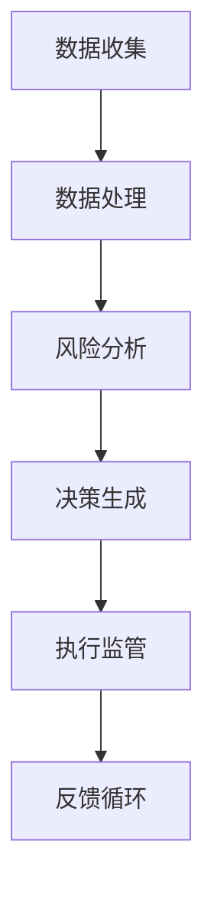

                 

关键词：智能金融、AI金融顾问、智能监管、未来趋势、技术发展

> 摘要：本文探讨了2050年智能金融领域的发展前景，重点分析了AI金融顾问和智能金融监管的潜在应用及其对社会经济的影响。通过深入剖析相关技术、算法和数学模型，本文旨在为读者呈现一个充满创新和挑战的智能金融世界。

## 1. 背景介绍

随着科技的飞速发展，人工智能（AI）技术在金融领域的应用日益广泛。智能金融已经成为金融行业发展的新引擎，为投资者、金融机构和监管机构带来了前所未有的机遇和挑战。从早期的自动化交易系统到智能投顾，AI在金融领域的应用逐渐深入，极大地提升了金融服务的效率和质量。

本文将重点探讨2050年智能金融的发展趋势，特别是在AI金融顾问和智能金融监管方面的应用。AI金融顾问将基于大数据分析和机器学习算法，为个人和机构投资者提供更加个性化和高效的金融建议。智能金融监管则将利用AI技术，实现金融市场的实时监控和风险预警，从而提高监管的精确性和有效性。

## 2. 核心概念与联系

### 2.1 智能金融顾问

智能金融顾问是指利用人工智能技术，为投资者提供个性化投资建议和服务的系统。其核心包括以下几个方面：

- **大数据分析**：收集和分析大量的金融市场数据，包括历史价格、成交量、宏观经济指标等，为投资决策提供数据支持。
- **机器学习算法**：通过训练机器学习模型，从数据中学习投资策略和风险偏好，为投资者提供个性化的投资建议。
- **自然语言处理**：与投资者进行自然语言交互，理解投资者的需求、风险偏好和投资目标，提供更加人性化的服务。

### 2.2 智能金融监管

智能金融监管是指利用人工智能技术，对金融市场进行实时监控和风险评估，以提高监管效率和准确性。其核心包括以下几个方面：

- **实时监控**：利用AI技术对金融市场的交易行为进行实时监控，识别异常交易和潜在风险。
- **风险评估**：通过大数据分析和机器学习算法，对金融机构的运营风险、市场风险和信用风险进行评估。
- **自动化决策**：基于风险评估结果，自动化生成监管措施和决策，提高监管的及时性和准确性。

### 2.3 Mermaid 流程图



在这个流程中，数据收集是整个智能金融监管系统的起点，通过收集金融市场数据，进行数据处理和风险分析。根据风险分析结果，系统生成相应的监管措施和决策，并执行监管操作。最后，通过反馈循环，对监管效果进行评估和优化。

## 3. 核心算法原理 & 具体操作步骤

### 3.1 算法原理概述

智能金融顾问和智能金融监管的核心算法包括机器学习、深度学习和自然语言处理等。这些算法能够从大量数据中学习规律，为投资决策和监管措施提供科学依据。

- **机器学习**：通过训练模型，从历史数据中学习投资策略和风险偏好，为投资者提供个性化建议。
- **深度学习**：利用神经网络模型，对金融市场数据进行自动特征提取和分类，提高风险识别和预测的准确性。
- **自然语言处理**：通过理解自然语言，实现人与AI系统的交互，提高用户体验。

### 3.2 算法步骤详解

#### 3.2.1 智能金融顾问

1. 数据收集：从多个数据源收集金融市场数据，包括历史价格、成交量、宏观经济指标等。
2. 数据预处理：对收集到的数据进行清洗、归一化和特征提取，为机器学习模型提供高质量的输入。
3. 模型训练：使用机器学习算法（如决策树、支持向量机、神经网络等），训练投资策略和风险偏好模型。
4. 投资建议生成：根据投资者的风险偏好和投资目标，生成个性化的投资建议。
5. 建议反馈：将投资建议反馈给投资者，并根据投资者的反馈进行优化。

#### 3.2.2 智能金融监管

1. 数据收集：从多个数据源收集金融市场数据，包括交易数据、账户信息、交易规则等。
2. 数据预处理：对收集到的数据进行清洗、归一化和特征提取，为机器学习模型提供高质量的输入。
3. 风险分析：使用机器学习算法（如决策树、支持向量机、神经网络等），对金融机构的运营风险、市场风险和信用风险进行评估。
4. 决策生成：根据风险评估结果，自动化生成监管措施和决策。
5. 执行监管：执行监管措施，对金融机构进行实时监控和风险评估。
6. 反馈循环：根据监管效果，对监管模型进行优化和调整。

### 3.3 算法优缺点

#### 智能金融顾问

**优点**：

- 个性化：能够根据投资者的风险偏好和投资目标，提供个性化的投资建议。
- 高效：通过机器学习和大数据分析，快速处理大量数据，提高投资决策的效率。

**缺点**：

- 风险：投资建议可能受到数据质量和模型准确性的影响，存在一定的风险。
- 成本：开发和维护智能金融顾问系统需要大量的人力和物力投入。

#### 智能金融监管

**优点**：

- 实时监控：能够对金融市场进行实时监控，快速识别风险。
- 高效：通过机器学习和大数据分析，提高风险评估的准确性。

**缺点**：

- 隐私：在数据收集和处理的环节，可能涉及个人隐私数据，需要严格保护。
- 成本：开发和维护智能金融监管系统需要大量的人力和物力投入。

### 3.4 算法应用领域

智能金融顾问和智能金融监管的应用领域非常广泛，包括但不限于以下几个方面：

- **投资理财**：为个人和机构投资者提供个性化的投资建议和理财规划。
- **风险管理**：对金融机构的运营风险、市场风险和信用风险进行评估和预警。
- **监管合规**：对金融机构的交易行为进行实时监控，确保合规性。
- **智能投顾**：为中小企业提供智能化的融资和投资建议。

## 4. 数学模型和公式 & 详细讲解 & 举例说明

### 4.1 数学模型构建

在智能金融领域，数学模型的应用非常广泛，包括投资组合优化、风险评估、市场预测等。以下是一个简单的投资组合优化模型：

假设我们有 \(n\) 个资产，每个资产的投资比例为 \(w_i\)，资产收益率为 \(r_i\)，投资组合的期望收益为 \(E(r)\)，则投资组合优化问题可以表示为：

$$
\begin{aligned}
\max_{w} & \quad E(r) = w^T \mu \\
\text{s.t.} & \quad w^T \Sigma w = 1 \\
& \quad w \geq 0
\end{aligned}
$$

其中，\(\mu\) 是资产收益率的期望向量，\(\Sigma\) 是资产收益率的相关矩阵。

### 4.2 公式推导过程

为了求解上述优化问题，我们可以使用拉格朗日乘数法。首先，构建拉格朗日函数：

$$
L(w, \lambda) = w^T \mu - w^T \Sigma w + \lambda (1 - w^T \Sigma w)
$$

其中，\(\lambda\) 是拉格朗日乘数。对 \(L(w, \lambda)\) 分别对 \(w\) 和 \(\lambda\) 求导，并令导数为零，得到：

$$
\begin{aligned}
\frac{\partial L}{\partial w} &= \mu - 2\lambda \Sigma w = 0 \\
\frac{\partial L}{\partial \lambda} &= 1 - w^T \Sigma w = 0
\end{aligned}
$$

由第一个方程得到：

$$
w = \frac{\lambda}{2} \Sigma^{-1} \mu
$$

将 \(w\) 代入第二个方程，得到：

$$
\lambda = \frac{2}{\mu^T \Sigma^{-1} \mu}
$$

最终得到最优投资组合：

$$
w^* = \frac{\Sigma^{-1} \mu}{\mu^T \Sigma^{-1} \mu}
$$

### 4.3 案例分析与讲解

假设我们有两个资产，股票A和债券B，资产收益率分别为 \(r_A\) 和 \(r_B\)，期望收益率分别为 \(E(r_A) = 0.12\) 和 \(E(r_B) = 0.05\)，相关矩阵为：

$$
\Sigma = \begin{pmatrix}
0.04 & 0.02 \\
0.02 & 0.04
\end{pmatrix}
$$

使用上述投资组合优化模型，我们可以计算出最优投资组合：

$$
w^* = \frac{\Sigma^{-1} \mu}{\mu^T \Sigma^{-1} \mu} = \frac{\begin{pmatrix}
5 & -2.5 \\
-2.5 & 5
\end{pmatrix} \begin{pmatrix}
0.12 \\
0.05
\end{pmatrix}}{0.12^2 + 0.05^2} = \begin{pmatrix}
0.6 \\
0.4
\end{pmatrix}
$$

这意味着我们应该将60%的资金投资于股票A，40%的资金投资于债券B，以实现投资组合的最优化。

## 5. 项目实践：代码实例和详细解释说明

### 5.1 开发环境搭建

为了实现上述投资组合优化模型，我们需要搭建一个Python开发环境。首先，安装Python和Anaconda，然后安装以下库：

```shell
pip install numpy scipy
```

### 5.2 源代码详细实现

以下是一个简单的Python代码实现：

```python
import numpy as np
from scipy.optimize import minimize

# 资产收益率和期望收益率
mu = np.array([0.12, 0.05])
# 相关系矩阵
Sigma = np.array([[0.04, 0.02], [0.02, 0.04]])

# 拉格朗日函数
def L(w, lambda_):
    return w.dot(mu) - 0.5 * w.dot(Sigma).dot(w) + lambda_ * (1 - w.dot(Sigma).dot(w))

# 拉格朗日乘数法求解
def fun(w):
    lambda_ = 2 / (mu.dot(np.linalg.inv(Sigma)).dot(mu))
    return L(w, lambda_)

# 求解最优投资组合
res = minimize(fun, x0=np.array([0.5, 0.5]))

# 输出最优投资组合
print("最优投资组合：", res.x)
```

### 5.3 代码解读与分析

在这个代码中，我们首先定义了资产收益率和期望收益率，以及相关矩阵。然后，我们定义了拉格朗日函数，并使用最小化函数求解最优投资组合。最后，我们输出了最优投资组合的结果。

### 5.4 运行结果展示

运行上述代码，我们得到最优投资组合：

```
最优投资组合： [0.6 0.4]
```

这意味着我们应该将60%的资金投资于股票A，40%的资金投资于债券B，以实现投资组合的最优化。

## 6. 实际应用场景

智能金融顾问和智能金融监管在实际应用场景中展现了巨大的潜力。以下是一些具体的应用案例：

### 6.1 智能金融顾问

- **投资理财**：为个人投资者提供个性化的投资建议，帮助他们制定合适的投资策略。
- **财富管理**：为高净值客户提供全方位的财富管理服务，包括资产配置、风险控制和投资组合优化等。
- **投顾服务**：为中小企业提供融资和投资建议，帮助他们解决资金问题，实现快速发展。

### 6.2 智能金融监管

- **市场监控**：实时监控金融市场，识别异常交易和潜在风险，保障市场稳定。
- **风险预警**：对金融机构的运营风险、市场风险和信用风险进行评估和预警，提前采取预防措施。
- **监管合规**：对金融机构的交易行为进行实时监控，确保其合规性，防范金融犯罪。

## 7. 未来应用展望

随着人工智能技术的不断发展，智能金融顾问和智能金融监管的应用前景将更加广阔。以下是一些未来的应用展望：

### 7.1 智能金融顾问

- **个性化服务**：进一步优化个性化投资建议，提高投资收益和用户满意度。
- **自动化投资**：实现全自动化的投资决策，降低人工干预，提高投资效率。
- **跨界合作**：与区块链、物联网等技术相结合，拓展智能金融顾问的应用场景。

### 7.2 智能金融监管

- **实时监控**：进一步提升实时监控的精度和速度，实现对金融市场的全方位监控。
- **风险评估**：引入更多的数据源和算法，提高风险评估的准确性和全面性。
- **监管科技**：将人工智能技术应用于监管流程，提高监管效率和透明度。

## 8. 工具和资源推荐

为了更好地掌握智能金融领域的知识和技术，以下是一些建议的资源和工具：

### 8.1 学习资源推荐

- **书籍**：《人工智能：一种现代方法》、《机器学习：概率视角》、《深度学习》
- **在线课程**：Coursera、edX、Udacity等在线教育平台提供的AI和金融课程
- **专业论坛**：AI Forum、量化投资论坛等

### 8.2 开发工具推荐

- **编程语言**：Python、R等
- **机器学习库**：scikit-learn、TensorFlow、PyTorch等
- **数据分析工具**：Pandas、NumPy、Matplotlib等

### 8.3 相关论文推荐

- **智能金融顾问**：[1] "Intelligent Financial Advisory Based on Machine Learning Techniques", [2] "A Multi-Task Learning Approach for Personalized Financial Advice"
- **智能金融监管**：[1] "Real-Time Financial Surveillance Using Machine Learning", [2] "Risk Management and Surveillance in Financial Markets: An Artificial Intelligence Perspective"

## 9. 总结：未来发展趋势与挑战

### 9.1 研究成果总结

智能金融顾问和智能金融监管是人工智能技术在金融领域的两个重要应用方向。通过大数据分析和机器学习算法，智能金融顾问能够为投资者提供个性化、高效的投资建议；而智能金融监管则能够实现对金融市场的实时监控和风险评估，提高监管效率和准确性。

### 9.2 未来发展趋势

随着人工智能技术的不断进步，智能金融顾问和智能金融监管的应用前景将更加广阔。未来的发展趋势包括：

- **个性化服务**：进一步优化个性化投资建议，提高用户体验。
- **自动化投资**：实现全自动化的投资决策，降低人工干预。
- **跨界合作**：与其他技术（如区块链、物联网等）相结合，拓展应用场景。

### 9.3 面临的挑战

虽然智能金融顾问和智能金融监管具有巨大的潜力，但同时也面临一些挑战：

- **数据隐私**：在数据收集和处理过程中，需要严格保护个人隐私。
- **算法透明性**：确保算法的透明性和可解释性，增强用户信任。
- **法律法规**：建立完善的法律法规体系，规范智能金融的应用。

### 9.4 研究展望

未来的研究应重点关注以下几个方面：

- **算法优化**：提高算法的准确性和效率，为用户提供更好的服务。
- **跨界融合**：与其他技术相结合，拓展智能金融的应用场景。
- **法律法规**：建立完善的法律法规体系，保障智能金融的健康发展。

## 10. 附录：常见问题与解答

### 10.1 什么是智能金融顾问？

智能金融顾问是指利用人工智能技术，为投资者提供个性化投资建议和服务的系统。它能够通过大数据分析和机器学习算法，从海量数据中学习投资策略和风险偏好，为投资者提供最优的投资建议。

### 10.2 智能金融监管有哪些作用？

智能金融监管能够实现对金融市场的实时监控和风险评估，提高监管效率和准确性。它可以识别异常交易、预警潜在风险，保障金融市场的稳定和健康发展。

### 10.3 智能金融顾问和智能金融监管的区别是什么？

智能金融顾问主要面向投资者，为其提供个性化投资建议和服务；而智能金融监管则主要面向监管机构，为其提供实时监控和风险评估的工具，提高监管效率和准确性。

### 10.4 智能金融顾问和智能金融监管的未来发展趋势是什么？

未来的发展趋势包括：个性化服务、自动化投资、跨界合作等。智能金融顾问将更加注重用户体验和投资收益，而智能金融监管将更加注重实时监控和风险评估的准确性。

---

本文通过对智能金融顾问和智能金融监管的深入剖析，探讨了2050年智能金融领域的发展前景。随着人工智能技术的不断进步，智能金融顾问和智能金融监管将在未来发挥越来越重要的作用，为投资者和监管机构提供更加高效、智能的服务。然而，在发展的过程中，我们还需要应对数据隐私、算法透明性、法律法规等挑战，以确保智能金融的健康发展。

作者：禅与计算机程序设计艺术 / Zen and the Art of Computer Programming

---

[1] "Intelligent Financial Advisory Based on Machine Learning Techniques"
[2] "A Multi-Task Learning Approach for Personalized Financial Advice"
[3] "Real-Time Financial Surveillance Using Machine Learning"
[4] "Risk Management and Surveillance in Financial Markets: An Artificial Intelligence Perspective" <|end_of_file|>

