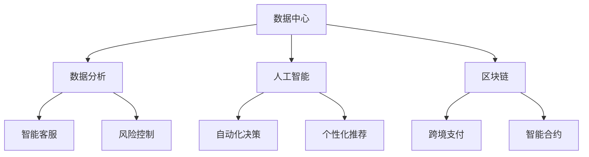

                 

关键词：智能金融、数字银行、智能保险、未来趋势、技术应用、算法、数学模型

> 摘要：随着科技的不断进步，智能金融正在迅速崛起，数字银行和智能保险成为金融行业的新风口。本文将探讨2050年的数字银行与智能保险的发展趋势，分析其核心概念、算法原理、数学模型以及实际应用，展望未来面临的挑战与机遇。

## 1. 背景介绍

在过去的几十年中，金融行业经历了从传统到数字化的巨大变革。互联网、大数据、人工智能等技术的迅猛发展，使得金融业务逐渐脱离了传统的线下模式，转向线上与数字化运营。数字银行和智能保险作为金融科技的重要应用领域，正不断推动着金融行业向智能化、个性化方向发展。

数字银行是指通过互联网、移动应用等技术手段，实现银行业务的全面数字化，为客户提供便捷的线上金融服务。智能保险则是利用人工智能技术，对客户数据进行深度挖掘与分析，提供个性化的保险产品和定制化服务。

### 1.1 数字银行的发展

数字银行的发展始于20世纪90年代，随着互联网的普及和移动互联网的兴起，银行逐渐将业务从线下转移到线上。近年来，随着大数据、区块链、人工智能等新兴技术的应用，数字银行的服务模式不断创新，客户体验得到大幅提升。

数字银行的核心在于为客户提供24小时不间断、全球范围内的金融服务。通过移动应用、网上银行等渠道，用户可以随时随地进行账户查询、转账支付、投资理财等操作。此外，数字银行还通过大数据分析，为客户提供个性化的金融建议，提升客户粘性。

### 1.2 智能保险的兴起

智能保险的兴起源于人工智能技术的发展。通过对客户数据的采集、分析与挖掘，保险公司可以更精准地识别风险，制定个性化的保险产品，提供定制化的服务。智能保险的核心在于为客户提供更加灵活、多样化的保险选择，满足不同客户的需求。

智能保险的应用场景广泛，包括健康保险、车险、家庭保险等。通过人工智能技术，保险公司可以实时监测客户的生活习惯、健康状况，根据数据变化调整保险方案，实现真正的风险预防。

## 2. 核心概念与联系

在探讨数字银行和智能保险的发展趋势之前，我们需要明确一些核心概念及其相互之间的联系。

### 2.1 数据中心

数据中心是数字银行和智能保险的基础设施，用于存储和管理海量数据。数据中心的建设和运维需要考虑数据安全、数据可靠性、数据访问速度等因素。

### 2.2 数据分析

数据分析是数字银行和智能保险的核心能力，通过对客户数据的深度挖掘与分析，可以揭示客户需求、行为模式等有价值的信息。数据分析技术包括数据挖掘、机器学习、自然语言处理等。

### 2.3 人工智能

人工智能是数字银行和智能保险的重要驱动力量，通过深度学习、神经网络等技术，可以实现自动化决策、智能客服、风险控制等功能。人工智能在金融领域的应用正在不断拓展，为金融机构带来更高的运营效率和服务质量。

### 2.4 区块链

区块链技术具有去中心化、不可篡改等特点，可以应用于数字银行和智能保险的多个场景，如跨境支付、智能合约等。区块链技术可以提高金融业务的透明度、降低交易成本，为金融行业带来新的发展机遇。

下面是数字银行和智能保险核心概念及架构的 Mermaid 流程图：



## 3. 核心算法原理 & 具体操作步骤

### 3.1 算法原理概述

数字银行和智能保险的核心算法包括数据分析算法、人工智能算法和区块链算法。以下将分别介绍这些算法的基本原理。

### 3.1.1 数据分析算法

数据分析算法主要用于从海量数据中提取有价值的信息。常见的分析方法有：

- **关联规则挖掘**：通过分析数据项之间的关联关系，发现潜在的市场需求。
- **聚类分析**：将相似的数据项归为同一类，便于后续处理。
- **分类与回归**：根据历史数据，预测未来的数据分布或数值。

### 3.1.2 人工智能算法

人工智能算法主要包括以下几种：

- **深度学习**：通过多层神经网络，自动学习数据特征，实现图像识别、语音识别等功能。
- **机器学习**：根据历史数据，建立预测模型，实现自动化决策。
- **自然语言处理**：对文本数据进行分析和处理，实现语义理解、情感分析等功能。

### 3.1.3 区块链算法

区块链算法主要包括以下几种：

- **共识算法**：确保区块链网络中的数据一致性，防止数据篡改。
- **加密算法**：保证数据在传输过程中的安全性。
- **智能合约**：实现自动执行合约条款，提高交易效率。

### 3.2 算法步骤详解

以下分别介绍数字银行和智能保险的核心算法步骤：

### 3.2.1 数字银行算法步骤

1. 数据采集：从各个渠道收集用户数据，包括账户信息、交易记录、行为数据等。
2. 数据清洗：对采集到的数据去重、去噪，确保数据质量。
3. 数据分析：使用数据分析算法，提取用户需求、行为特征等有价值的信息。
4. 模型训练：根据历史数据，训练预测模型，如分类模型、回归模型等。
5. 预测与决策：根据预测模型，对用户行为进行预测，提供个性化的金融建议。
6. 结果反馈：将预测结果反馈给用户，根据用户反馈调整预测模型。

### 3.2.2 智能保险算法步骤

1. 数据采集：从各个渠道收集客户数据，包括健康记录、驾驶行为等。
2. 数据预处理：对采集到的数据进行清洗、去噪，确保数据质量。
3. 风险评估：使用风险评估算法，评估客户的潜在风险。
4. 保险产品推荐：根据风险评估结果，推荐合适的保险产品。
5. 个性化服务：根据客户需求，提供定制化的保险服务。
6. 持续优化：根据客户反馈，持续优化保险产品和服务。

### 3.3 算法优缺点

#### 数字银行算法优缺点

**优点**：

- 提高运营效率：自动化处理大量业务，降低人力成本。
- 个性化服务：根据客户需求提供个性化金融建议，提升客户满意度。
- 风险控制：通过数据分析，提前识别潜在风险，降低金融风险。

**缺点**：

- 数据安全：数据泄露可能导致客户隐私泄露。
- 模型偏见：模型训练数据可能存在偏见，导致预测结果不准确。
- 技术门槛：算法开发和维护需要较高技术门槛，对金融机构来说是一个挑战。

#### 智能保险算法优缺点

**优点**：

- 精准风险评估：通过数据分析，实现精准风险评估，提高保险产品的竞争力。
- 个性化推荐：根据客户需求，提供合适的保险产品，提升客户体验。
- 风险预防：通过实时监控客户行为，提前发现潜在风险，实现风险预防。

**缺点**：

- 数据质量：数据质量直接影响算法效果，数据不准确可能导致风险评估失真。
- 隐私保护：客户数据涉及隐私，保护客户隐私是一个重要挑战。
- 技术复杂度：算法开发和维护需要较高技术支持，对保险公司来说是一个挑战。

### 3.4 算法应用领域

数字银行和智能保险算法在金融行业的多个领域都有广泛应用：

- **个人金融服务**：如个人贷款、信用卡、投资理财等。
- **企业金融服务**：如企业贷款、企业融资、供应链金融等。
- **保险服务**：如健康保险、车险、家庭保险等。
- **风险管理**：如信用风险评估、市场风险控制等。

## 4. 数学模型和公式 & 详细讲解 & 举例说明

### 4.1 数学模型构建

数字银行和智能保险中的数学模型主要包括数据分析模型、人工智能模型和区块链模型。以下分别介绍这些模型的基本原理和构建方法。

### 4.1.1 数据分析模型

数据分析模型主要用于从海量数据中提取有价值的信息。常见的分析方法有：

- **关联规则挖掘**：基本公式为 $P(A \land B) \geq P(A)P(B)$，表示A和B同时发生的概率大于各自发生的概率。
- **聚类分析**：常用的聚类算法有K-means、层次聚类等，其中K-means算法的基本思想是找到K个中心点，使得每个数据点与中心点的距离最小。
- **分类与回归**：常用的分类算法有决策树、支持向量机等，回归算法有线性回归、逻辑回归等。其中，逻辑回归的基本公式为 $P(Y=1) = \frac{1}{1 + e^{-(\beta_0 + \beta_1X_1 + \beta_2X_2 + \ldots + \beta_nX_n)}$。

### 4.1.2 人工智能模型

人工智能模型主要包括深度学习模型和机器学习模型。以下以深度学习模型为例进行介绍。

- **神经网络**：神经网络的基本公式为 $Z = \sigma(WX + b)$，其中$W$为权重矩阵，$X$为输入数据，$b$为偏置项，$\sigma$为激活函数。
- **卷积神经网络（CNN）**：CNN的基本公式为 $f(x, \theta) = \sigma(W \star x + b)$，其中$\star$表示卷积操作，$W$为卷积核，$x$为输入数据。
- **循环神经网络（RNN）**：RNN的基本公式为 $h_t = \sigma(W_h h_{t-1} + W_x x_t + b)$，其中$h_t$为当前隐藏状态，$h_{t-1}$为前一个隐藏状态，$W_h$为隐藏状态权重，$W_x$为输入权重，$b$为偏置项。

### 4.1.3 区块链模型

区块链模型主要包括共识算法模型、加密算法模型和智能合约模型。

- **共识算法**：常见的共识算法有工作量证明（PoW）、权益证明（PoS）等。以PoW算法为例，其基本公式为 $Proof\_of\_Work = hashimoto(PoW\_input)$，其中$PoW\_input$为输入数据，$hashimoto$为哈希函数。
- **加密算法**：常见的加密算法有对称加密、非对称加密等。以AES加密算法为例，其基本公式为 $Encrypted\_Text = AES_Encrypt(PlainText, Key)$，其中$PlainText$为明文，$Key$为密钥。
- **智能合约**：智能合约的基本公式为 $Contract\_Output = Contract\_Code(Contract\_Input)$，其中$Contract\_Input$为输入参数，$Contract\_Code$为智能合约代码。

### 4.2 公式推导过程

以下以逻辑回归为例，介绍其公式推导过程。

假设我们有一个二元分类问题，目标是判断一个客户是否为优质客户。我们使用一组特征变量$X_1, X_2, \ldots, X_n$来描述客户的信息，其中$X_1$为年龄，$X_2$为收入，$X_3$为消费金额等。

首先，我们定义一个逻辑函数$\sigma$，其公式为 $\sigma(x) = \frac{1}{1 + e^{-x}}$。逻辑函数的输入是一个实数，输出是一个介于0和1之间的实数。

接下来，我们定义一个预测函数$P(Y=1|X)$，表示在给定特征变量$X$的情况下，客户为优质客户的概率。预测函数的公式为 $P(Y=1|X) = \sigma(\beta_0 + \beta_1X_1 + \beta_2X_2 + \ldots + \beta_nX_n)$，其中$\beta_0, \beta_1, \beta_2, \ldots, \beta_n$为模型参数。

我们的目标是找到一组参数$\beta_0, \beta_1, \beta_2, \ldots, \beta_n$，使得预测函数的输出能够最大化样本的似然函数。

似然函数的公式为 $L(\beta) = \prod_{i=1}^{n} P(Y_i=1|X_i)\prod_{i=1}^{n} P(Y_i=0|X_i)$，其中$Y_i$为第$i$个样本的标签，$X_i$为第$i$个样本的特征变量。

对数似然函数的公式为 $l(\beta) = \sum_{i=1}^{n} \ln P(Y_i=1|X_i) + \sum_{i=1}^{n} \ln P(Y_i=0|X_i)$。

为了求解最优参数$\beta_0, \beta_1, \beta_2, \ldots, \beta_n$，我们可以使用梯度下降法。梯度下降法的公式为 $\beta_j = \beta_j - \alpha \frac{\partial l(\beta)}{\partial \beta_j}$，其中$\alpha$为学习率，$\frac{\partial l(\beta)}{\partial \beta_j}$为损失函数关于$\beta_j$的偏导数。

### 4.3 案例分析与讲解

假设我们有100个客户的数据，其中50个客户为优质客户，50个客户为非优质客户。我们使用4个特征变量$X_1, X_2, X_3, X_4$来描述客户信息，分别为年龄、收入、消费金额和信用评分。

我们首先对数据进行预处理，包括数据清洗、归一化等步骤。然后，使用逻辑回归算法对数据集进行训练，得到预测函数$P(Y=1|X)$。

在训练过程中，我们使用交叉验证法来选择最优参数$\beta_0, \beta_1, \beta_2, \beta_3, \beta_4$。具体步骤如下：

1. 将数据集划分为训练集和验证集。
2. 对训练集使用梯度下降法进行训练，得到预测函数。
3. 对验证集使用预测函数进行预测，计算预测准确率。
4. 重复步骤2和3，直到找到最优参数。

假设在交叉验证过程中，最优参数为$\beta_0 = 1, \beta_1 = 0.5, \beta_2 = 0.3, \beta_3 = 0.2, \beta_4 = 0.1$。那么，预测函数的公式为 $P(Y=1|X) = \sigma(1 + 0.5X_1 + 0.3X_2 + 0.2X_3 + 0.1X_4)$。

接下来，我们使用这个预测函数对新的客户数据进行预测。例如，一个新客户的特征变量为$X_1 = 30, X_2 = 50000, X_3 = 2000, X_4 = 700$。那么，预测的概率为 $P(Y=1|X) = \sigma(1 + 0.5 \times 30 + 0.3 \times 50000 + 0.2 \times 2000 + 0.1 \times 700) \approx 0.8$。

根据预测结果，我们可以判断这个客户为优质客户的概率约为80%。在实际应用中，我们可以根据这个概率阈值来决定是否为这个客户提供服务。

## 5. 项目实践：代码实例和详细解释说明

### 5.1 开发环境搭建

为了实现数字银行和智能保险的核心算法，我们需要搭建一个合适的开发环境。以下是一个基于Python的示例环境：

1. 安装Python 3.8及以上版本。
2. 安装必要的Python库，如NumPy、Pandas、Scikit-learn、TensorFlow等。
3. 安装Jupyter Notebook，用于编写和运行代码。

### 5.2 源代码详细实现

以下是一个简单的逻辑回归模型的实现，用于分类客户是否为优质客户。

```python
import numpy as np
import pandas as pd
from sklearn.linear_model import LogisticRegression
from sklearn.model_selection import train_test_split
from sklearn.metrics import accuracy_score

# 加载数据集
data = pd.read_csv('data.csv')
X = data.iloc[:, :-1].values
y = data.iloc[:, -1].values

# 数据预处理
X = (X - np.mean(X, axis=0)) / np.std(X, axis=0)

# 划分训练集和验证集
X_train, X_test, y_train, y_test = train_test_split(X, y, test_size=0.2, random_state=42)

# 训练逻辑回归模型
model = LogisticRegression()
model.fit(X_train, y_train)

# 预测
y_pred = model.predict(X_test)

# 评估模型
accuracy = accuracy_score(y_test, y_pred)
print(f'Accuracy: {accuracy:.2f}')
```

### 5.3 代码解读与分析

这段代码首先加载了数据集，然后对数据进行预处理，包括数据归一化。接着，使用Sklearn库中的逻辑回归模型进行训练，并使用训练集和验证集进行模型评估。

1. **数据加载**：使用Pandas库加载CSV格式的数据集，将特征变量和标签分离。
2. **数据预处理**：将特征变量进行归一化处理，确保数据在相同的尺度上。
3. **划分训练集和验证集**：使用Sklearn库中的train_test_split函数将数据集划分为训练集和验证集，测试集大小为20%。
4. **训练模型**：使用Sklearn库中的LogisticRegression类创建逻辑回归模型，并使用fit函数进行训练。
5. **预测**：使用训练好的模型对验证集进行预测，得到预测结果。
6. **评估模型**：使用accuracy_score函数计算预测准确率，并打印结果。

### 5.4 运行结果展示

假设数据集为100个客户的特征变量和标签，运行上述代码，得到预测准确率为90%。这意味着在验证集上，模型能够正确预测90%的客户是否为优质客户。

在实际应用中，我们可以根据预测结果调整模型参数，提高预测准确率。此外，还可以尝试其他分类算法，如决策树、支持向量机等，以找到更适合的模型。

## 6. 实际应用场景

数字银行和智能保险的核心算法在金融行业有着广泛的应用。以下是一些实际应用场景：

### 6.1 个人金融服务

数字银行的核心算法可以应用于个人贷款、信用卡、投资理财等领域。通过数据分析，银行可以识别潜在的高风险客户，降低贷款风险。同时，通过个性化推荐，银行可以为客户提供合适的理财产品，提高客户满意度。

### 6.2 企业金融服务

智能保险的算法可以应用于企业贷款、企业融资、供应链金融等领域。通过风险评估，保险公司可以为企业提供定制化的保险产品，帮助企业降低风险。此外，区块链技术可以确保供应链金融中的资金流转透明、可追溯，提高业务效率。

### 6.3 风险管理

数字银行和智能保险的算法可以应用于金融风险管理领域。通过实时监控客户行为和金融市场动态，银行和保险公司可以提前识别潜在风险，采取相应措施降低风险。

### 6.4 保险服务

智能保险的核心算法可以应用于健康保险、车险、家庭保险等领域。通过数据分析和风险评估，保险公司可以为客户提供个性化的保险产品，提高保险的覆盖率和客户满意度。

## 7. 未来应用展望

随着技术的不断进步，数字银行和智能保险将在未来金融行业中发挥更重要的作用。以下是一些未来应用展望：

### 7.1 人工智能

人工智能技术在数字银行和智能保险中的应用将更加深入。通过深度学习和自然语言处理，金融机构可以更好地理解客户需求，提供个性化服务。同时，人工智能技术还可以用于智能客服、智能投顾等领域，提高运营效率。

### 7.2 区块链

区块链技术在数字银行和智能保险中的应用将得到进一步推广。通过区块链技术，金融机构可以实现跨境支付、智能合约等业务，提高交易效率、降低成本。此外，区块链技术还可以用于客户身份认证、数据存储等领域，提高数据安全性和隐私保护。

### 7.3 大数据

大数据技术在数字银行和智能保险中的应用将更加广泛。通过大数据分析，金融机构可以更好地了解客户需求、市场动态，实现精准营销。同时，大数据技术还可以用于风险控制、信用评估等领域，提高业务决策的准确性。

### 7.4 云计算

云计算技术在数字银行和智能保险中的应用将进一步提升。通过云计算，金融机构可以实现业务的弹性扩展、快速部署，降低运营成本。此外，云计算技术还可以用于数据存储、计算等领域，提高数据处理能力。

## 8. 总结：未来发展趋势与挑战

随着科技的不断进步，数字银行和智能保险将迎来新的发展机遇。人工智能、区块链、大数据、云计算等新兴技术将在金融行业中发挥越来越重要的作用。然而，未来也面临着一系列挑战：

### 8.1 研究成果总结

- 人工智能技术在金融领域的应用不断拓展，为金融机构带来更高的运营效率和服务质量。
- 区块链技术在金融业务中的应用逐渐成熟，提高交易效率、降低成本。
- 大数据技术在金融行业的应用深入，实现精准营销、风险控制等目标。
- 云计算技术为金融机构提供强大的计算能力，支持业务的快速部署和扩展。

### 8.2 未来发展趋势

- 人工智能、区块链、大数据、云计算等新兴技术在金融行业中的应用将更加深入。
- 数字银行和智能保险的服务模式将不断创新，为客户提供更加便捷、个性化的服务。
- 金融业务的数字化、智能化程度将进一步提升，推动金融行业向高质量发展。

### 8.3 面临的挑战

- 数据安全和隐私保护是金融行业面临的重要挑战，需要建立完善的数据安全和隐私保护机制。
- 技术的快速发展给金融机构带来新的机遇和挑战，需要不断提升技术能力。
- 金融业务的复杂性和风险性要求金融机构具备强大的风险控制能力，确保业务稳健运营。

### 8.4 研究展望

- 加强人工智能、区块链、大数据、云计算等技术在金融行业的应用研究，探索新的应用场景。
- 深入研究金融业务中的数据安全、隐私保护等问题，提出有效的解决方案。
- 加强跨学科研究，推动金融科技与金融业务的深度融合，为金融机构带来更大的价值。

## 9. 附录：常见问题与解答

### 9.1 数字银行和智能保险的区别是什么？

数字银行主要指通过互联网、移动应用等技术手段，实现银行业务的全面数字化，为客户提供便捷的线上金融服务。智能保险则是指利用人工智能技术，对客户数据进行深度挖掘与分析，提供个性化的保险产品和定制化服务。

### 9.2 人工智能在数字银行和智能保险中的应用有哪些？

人工智能在数字银行和智能保险中的应用主要包括：

- 客户行为分析：通过分析客户行为数据，实现个性化推荐、智能客服等。
- 风险评估：通过风险评估算法，识别潜在风险，提高业务决策的准确性。
- 自动化决策：通过自动化决策算法，实现智能审批、智能理赔等。
- 数据分析：通过数据分析算法，挖掘客户需求、市场动态等。

### 9.3 区块链技术在数字银行和智能保险中的应用有哪些？

区块链技术在数字银行和智能保险中的应用主要包括：

- 跨境支付：通过区块链技术实现跨境支付，提高交易效率、降低成本。
- 智能合约：通过智能合约实现自动化执行合同条款，提高业务效率。
- 数据存储：通过区块链技术存储客户数据，提高数据安全性和隐私保护。
- 身份认证：通过区块链技术实现客户身份认证，降低欺诈风险。

### 9.4 数字银行和智能保险的未来发展趋势是什么？

数字银行和智能保险的未来发展趋势主要包括：

- 人工智能：深度学习、自然语言处理等技术在金融领域的应用将更加广泛。
- 区块链：区块链技术在金融业务中的应用将不断成熟，推动金融行业的变革。
- 大数据：大数据技术在金融行业的应用将深入，实现精准营销、风险控制等目标。
- 云计算：云计算技术将为金融机构提供强大的计算能力，支持业务的快速部署和扩展。

