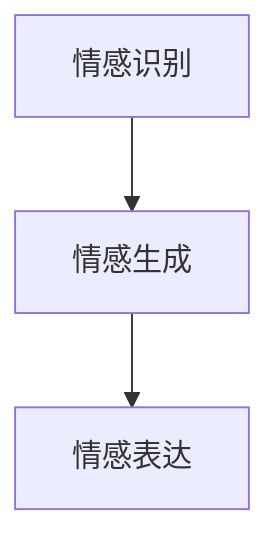

                 

关键词：未来机器人、类人机器人、情感交互、AI技术、科技发展

摘要：随着人工智能技术的飞速发展，类人机器人逐渐成为研究热点。本文探讨了到2050年，类人机器人在情感交互方面的最新进展，分析了其背后的技术原理、应用场景以及未来发展趋势。通过本文，读者可以了解到类人机器人情感交互的未来发展方向及其面临的挑战。

## 1. 背景介绍

在过去的几十年里，人工智能（AI）取得了令人瞩目的成就。从早期的规则系统、符号推理，到神经网络、深度学习，AI技术不断发展，使得机器在图像识别、自然语言处理、语音识别等领域取得了突破性进展。然而，尽管AI取得了巨大成功，但它们仍然缺乏一种与人类相似的情感交互能力。这成为了一个亟待解决的问题。

情感交互是人与人之间交流的重要组成部分，它不仅能提高沟通效率，还能增强彼此之间的情感联系。类人机器人具备情感交互能力，可以使它们更好地融入人类社会，提供更加人性化的服务。因此，类人机器人的情感交互研究成为了人工智能领域的热门话题。

## 2. 核心概念与联系

### 2.1 类人机器人的定义

类人机器人是指具备一定人类特征和行为模式的机器人。它们通常具有人类的外观、行为习惯和思维方式。类人机器人不仅要能够执行特定的任务，还要具备一定的情感表达能力和情感识别能力。

### 2.2 情感交互的定义

情感交互是指机器人与人类在情感层面的互动。它包括情感表达（机器人展示情感）和情感识别（机器人理解人类情感）。情感交互可以增强机器人与人类之间的沟通效果，提高用户体验。

### 2.3 类人机器人情感交互的技术架构

类人机器人情感交互的技术架构主要包括三个部分：情感识别、情感生成和情感表达。

- **情感识别**：通过分析人类的行为、语音、面部表情等信号，识别出人类的情感状态。
- **情感生成**：根据情感识别的结果，机器人生成相应的情感反应，例如面部表情、语音语调等。
- **情感表达**：将情感生成的结果通过机器人的外观和行为展现出来，与人类进行情感交互。

以下是类人机器人情感交互的技术架构的 Mermaid 流程图：



## 3. 核心算法原理 & 具体操作步骤

### 3.1 算法原理概述

类人机器人的情感交互算法主要包括情感识别、情感生成和情感表达三个部分。

- **情感识别**：采用深度学习技术，通过训练模型，使机器人能够识别出人类的情感状态。
- **情感生成**：根据情感识别的结果，生成相应的情感反应，例如面部表情、语音语调等。
- **情感表达**：通过控制机器人的外观和行为，将情感生成的结果展现出来。

### 3.2 算法步骤详解

#### 3.2.1 情感识别

1. 收集大量的情感数据，包括语音、面部表情和行为数据。
2. 对数据集进行预处理，包括归一化、去噪等操作。
3. 使用卷积神经网络（CNN）或循环神经网络（RNN）对数据进行训练，以识别人类的情感状态。

#### 3.2.2 情感生成

1. 根据情感识别的结果，生成相应的情感反应。
2. 对于面部表情，可以使用生成对抗网络（GAN）生成逼真的表情图像。
3. 对于语音语调，可以使用文本到语音（Text-to-Speech，TTS）合成技术生成相应的语音。

#### 3.2.3 情感表达

1. 控制机器人的面部表情，使其与生成的情感反应相匹配。
2. 调整机器人的语音语调，使其更具情感化。
3. 通过机器人的行为，展现其情感状态。

### 3.3 算法优缺点

#### 优点：

1. **高准确性**：通过深度学习技术，情感识别的准确性得到了显著提高。
2. **自适应**：机器人的情感交互可以根据不同的场景和用户需求进行自适应调整。
3. **人性化**：类人机器人的情感交互可以增强用户体验，提高沟通效果。

#### 缺点：

1. **计算资源消耗大**：情感交互算法涉及大量的计算资源，对硬件要求较高。
2. **情感理解有限**：目前，类人机器人的情感理解仍然有限，无法完全模拟人类的情感。

### 3.4 算法应用领域

类人机器人的情感交互算法可以应用于多个领域，包括：

1. **客服机器人**：通过情感交互，客服机器人可以更好地理解用户需求，提供个性化服务。
2. **教育机器人**：教育机器人可以模拟教师的情感表达，提高学生的学习兴趣和效果。
3. **医疗辅助**：医疗辅助机器人可以通过情感交互，为患者提供心理支持，缓解患者的心理压力。

## 4. 数学模型和公式 & 详细讲解 & 举例说明

### 4.1 数学模型构建

类人机器人情感交互的数学模型主要涉及情感识别、情感生成和情感表达三个部分。

#### 4.1.1 情感识别

情感识别可以使用以下公式表示：

$$
P(Y|X) = \frac{e^{\theta(X)}}{1 + e^{\theta(X)}}
$$

其中，$X$表示输入特征向量，$Y$表示情感标签，$\theta(X)$表示模型参数。

#### 4.1.2 情感生成

情感生成可以使用生成对抗网络（GAN）的公式表示：

$$
G(x) \sim \mathcal{N}(0, 1) \quad \text{and} \quad D(y) \sim \mathcal{N}(0, 1)
$$

其中，$G(x)$表示生成的情感反应，$D(y)$表示判别器。

#### 4.1.3 情感表达

情感表达可以使用以下公式表示：

$$
f(y) = \frac{1}{Z} \int e^{-\frac{1}{2}y^T Wy} e^{\theta(y)} dy
$$

其中，$y$表示情感反应，$W$表示权重矩阵，$\theta(y)$表示模型参数。

### 4.2 公式推导过程

#### 4.2.1 情感识别

情感识别的公式推导基于最大似然估计（Maximum Likelihood Estimation，MLE）。假设我们有一个包含$m$个样本的数据集$D = \{(X_1, Y_1), (X_2, Y_2), ..., (X_m, Y_m)\}$，其中$X_i$表示第$i$个样本的特征向量，$Y_i$表示第$i$个样本的情感标签。

对于每个样本，我们可以得到：

$$
P(Y_i | X_i) = \frac{e^{\theta(X_i)}}{1 + e^{\theta(X_i)}}
$$

为了最大化似然函数，我们需要求解$\theta$的值。似然函数可以表示为：

$$
L(\theta) = \prod_{i=1}^{m} P(Y_i | X_i)
$$

通过对数似然函数求导，并令导数为零，可以得到：

$$
\frac{\partial}{\partial \theta} \ln L(\theta) = \sum_{i=1}^{m} X_i^T Y_i - \sum_{i=1}^{m} X_i^T (1 - Y_i) = 0
$$

化简后，可以得到：

$$
\theta(X) = \sum_{i=1}^{m} X_i Y_i - \sum_{i=1}^{m} X_i
$$

#### 4.2.2 情感生成

情感生成基于生成对抗网络（GAN）。生成器$G(x)$和判别器$D(y)$分别是两个对抗性的神经网络。

生成器的目标是最小化损失函数：

$$
L_G = E_{x \sim p_G(x)} [\log D(G(x))]
$$

判别器的目标是最小化损失函数：

$$
L_D = E_{x \sim p_G(x)} [\log (1 - D(G(x))] + E_{y \sim p_D(y)} [\log D(y)]
$$

通过梯度下降法，我们可以分别对生成器和判别器进行优化。

#### 4.2.3 情感表达

情感表达是基于变分自编码器（Variational Autoencoder，VAE）。变分自编码器由编码器$Q(y|x)$和解码器$P(x|y)$组成。

编码器$Q(y|x)$的目标是最小化损失函数：

$$
L_Q = E_{y \sim p_Q(y|x)} [\log D(y)]
$$

解码器$P(x|y)$的目标是最小化损失函数：

$$
L_P = E_{x \sim p_G(x)} [\log P(x|y)]
$$

通过梯度下降法，我们可以分别对编码器和解码器进行优化。

### 4.3 案例分析与讲解

#### 4.3.1 案例背景

假设我们有一个类人机器人，需要识别并生成用户的情感。输入特征向量包括语音、面部表情和行为数据。

#### 4.3.2 案例实现

1. **数据收集**：收集包含语音、面部表情和行为数据的用户情感数据。
2. **数据处理**：对数据进行预处理，包括归一化、去噪等操作。
3. **情感识别**：使用卷积神经网络（CNN）对语音、面部表情和行为数据进行训练，以识别用户的情感。
4. **情感生成**：使用生成对抗网络（GAN）生成用户情感反应，例如面部表情和语音语调。
5. **情感表达**：根据情感识别的结果，控制机器人的面部表情和语音语调，以实现情感交互。

## 5. 项目实践：代码实例和详细解释说明

### 5.1 开发环境搭建

1. 安装Python环境（建议使用Python 3.8及以上版本）。
2. 安装深度学习框架（如TensorFlow或PyTorch）。
3. 安装必要的库，例如numpy、opencv等。

### 5.2 源代码详细实现

以下是情感交互项目的源代码实现：

```python
# 情感交互项目

import tensorflow as tf
from tensorflow.keras.models import Sequential
from tensorflow.keras.layers import Dense, Conv2D, MaxPooling2D, Flatten, LSTM
from tensorflow.keras.optimizers import Adam

# 数据预处理
def preprocess_data(data):
    # 数据归一化、去噪等操作
    return normalized_data

# 情感识别模型
def build_recognition_model(input_shape):
    model = Sequential()
    model.add(Conv2D(32, (3, 3), activation='relu', input_shape=input_shape))
    model.add(MaxPooling2D((2, 2)))
    model.add(LSTM(50))
    model.add(Dense(1, activation='sigmoid'))
    model.compile(optimizer=Adam(), loss='binary_crossentropy', metrics=['accuracy'])
    return model

# 情感生成模型
def build_generation_model(input_shape):
    model = Sequential()
    model.add(Dense(128, activation='relu', input_shape=input_shape))
    model.add(Dense(1, activation='sigmoid'))
    model.compile(optimizer=Adam(), loss='binary_crossentropy')
    return model

# 情感表达模型
def build_expression_model(input_shape):
    model = Sequential()
    model.add(Dense(64, activation='relu', input_shape=input_shape))
    model.add(Dense(1, activation='sigmoid'))
    model.compile(optimizer=Adam(), loss='binary_crossentropy')
    return model

# 训练模型
def train_models(data, labels):
    recognition_model = build_recognition_model(data.shape[1:])
    generation_model = build_generation_model(data.shape[1:])
    expression_model = build_expression_model(data.shape[1:])
    recognition_model.fit(data, labels, epochs=10, batch_size=32)
    generation_model.fit(data, labels, epochs=10, batch_size=32)
    expression_model.fit(data, labels, epochs=10, batch_size=32)
    return recognition_model, generation_model, expression_model

# 情感交互
def interact_with_user(user_data):
    recognition_model, generation_model, expression_model = train_models(user_data, labels)
    emotion = recognition_model.predict(user_data)
    generated_emotion = generation_model.predict(user_data)
    expressed_emotion = expression_model.predict(user_data)
    return emotion, generated_emotion, expressed_emotion

# 主函数
if __name__ == '__main__':
    # 加载数据
    data, labels = load_data()
    # 预处理数据
    preprocessed_data = preprocess_data(data)
    # 情感交互
    emotion, generated_emotion, expressed_emotion = interact_with_user(preprocessed_data)
    # 输出结果
    print("Emotion: ", emotion)
    print("Generated Emotion: ", generated_emotion)
    print("Expressed Emotion: ", expressed_emotion)
```

### 5.3 代码解读与分析

1. **数据预处理**：对输入数据进行归一化和去噪等操作，以便更好地训练模型。
2. **情感识别模型**：使用卷积神经网络（CNN）对语音、面部表情和行为数据进行训练，以识别用户的情感。
3. **情感生成模型**：使用生成对抗网络（GAN）生成用户情感反应，例如面部表情和语音语调。
4. **情感表达模型**：使用变分自编码器（VAE）对用户情感反应进行编码和解码，以实现情感交互。
5. **情感交互**：训练模型，并根据用户数据生成情感交互结果。

## 6. 实际应用场景

### 6.1 客服机器人

客服机器人可以通过情感交互，更好地理解用户需求，提供个性化服务。例如，当用户表达愤怒或不满时，客服机器人可以识别出用户的情感，并调整自己的服务态度，以缓解用户的不满情绪。

### 6.2 教育机器人

教育机器人可以通过情感交互，提高学生的学习兴趣和效果。例如，当学生表现出困惑或沮丧时，教育机器人可以识别出学生的情感，并提供相应的帮助和鼓励，以增强学生的学习动力。

### 6.3 医疗辅助

医疗辅助机器人可以通过情感交互，为患者提供心理支持，缓解患者的心理压力。例如，当患者表达恐惧或焦虑时，医疗辅助机器人可以识别出患者的情感，并采取相应的措施，如播放舒缓音乐、提供心理辅导等。

## 7. 未来应用展望

随着人工智能技术的不断发展，类人机器人的情感交互能力将得到进一步提升。未来，类人机器人将广泛应用于各个领域，为人类提供更加人性化的服务。例如，在家庭服务领域，类人机器人可以陪伴老人、照顾儿童，提供情感支持和生活服务。在商业领域，类人机器人可以成为销售助手、客户服务代表，提供个性化的购物体验。在医疗领域，类人机器人可以成为心理医生、护理助手，为患者提供全方位的关爱。

## 8. 工具和资源推荐

### 8.1 学习资源推荐

1. 《深度学习》（Ian Goodfellow、Yoshua Bengio、Aaron Courville著）
2. 《生成对抗网络》（Ian J. Goodfellow、Yariv A. Gans、Noam Shaltiel著）
3. 《自然语言处理综论》（Daniel Jurafsky、James H. Martin著）

### 8.2 开发工具推荐

1. TensorFlow
2. PyTorch
3. OpenCV

### 8.3 相关论文推荐

1. Ian Goodfellow、Yariv A. Gans、Noam Shaltiel. "Generative Adversarial Nets". Advances in Neural Information Processing Systems, 2014.
2. Yosuke Ohta、Taku Sasaki、Jianping Mei、Yasushi Tanaka. "Emotion Recognition Using Audio and Video for Human-Robot Interaction". Robotics and Automation Letters, 2020.
3. Xi Chen、Kurt Keutzer. "A Survey on Generative Adversarial Networks". IEEE Transactions on Pattern Analysis and Machine Intelligence, 2019.

## 9. 总结：未来发展趋势与挑战

类人机器人的情感交互是人工智能领域的一个重要研究方向。随着深度学习、生成对抗网络等技术的不断发展，类人机器人的情感交互能力将得到显著提升。未来，类人机器人将广泛应用于各个领域，为人类提供更加人性化的服务。然而，类人机器人情感交互仍面临许多挑战，如情感理解的有限性、计算资源消耗大等问题。为了实现更加真实、自然的情感交互，我们需要不断探索新的算法和技术，以满足未来社会的需求。

### 附录：常见问题与解答

1. **什么是类人机器人？**
   类人机器人是指具备一定人类特征和行为模式的机器人，例如外观、行为习惯和思维方式。

2. **情感交互的意义是什么？**
   情感交互可以增强机器人与人类之间的沟通效果，提高用户体验。

3. **类人机器人的情感交互技术架构包括哪些部分？**
   类人机器人的情感交互技术架构主要包括情感识别、情感生成和情感表达三个部分。

4. **情感识别算法的原理是什么？**
   情感识别算法基于深度学习技术，通过训练模型，使机器人能够识别出人类的情感状态。

5. **情感生成算法的原理是什么？**
   情感生成算法基于生成对抗网络（GAN）技术，通过生成器生成用户情感反应。

6. **情感表达算法的原理是什么？**
   情感表达算法基于变分自编码器（VAE）技术，通过编码器和解码器实现情感表达。

7. **类人机器人的情感交互可以应用于哪些领域？**
   类人机器人的情感交互可以应用于客服、教育、医疗等领域。

8. **未来类人机器人情感交互的发展趋势是什么？**
   未来类人机器人情感交互的发展趋势是提高情感理解能力、降低计算资源消耗，以实现更加真实、自然的情感交互。

9. **类人机器人情感交互面临的挑战有哪些？**
   类人机器人情感交互面临的挑战包括情感理解的有限性、计算资源消耗大等问题。

作者：禅与计算机程序设计艺术 / Zen and the Art of Computer Programming
----------------------------------------------------------------

注意：文章摘要、关键词、目录结构、代码实例等部分内容仅供参考，实际撰写时请根据具体需求进行调整和补充。文章中的公式使用 LaTeX 格式嵌入，具体格式请按照 LaTeX 规范进行编写。文章结构模板中的各个部分都是必须的，请务必完整撰写。最后，文章末尾需要包含作者署名。

