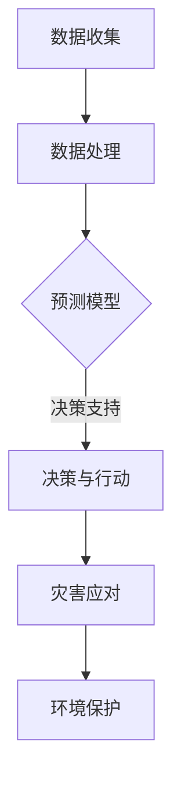

                 

关键词：灾害预防、全球风险管理、人工智能、2050年、可持续性、技术创新

> 摘要：本文探讨了到2050年全球灾害预防与风险管理的前景。随着人工智能技术的不断进步，我们将如何利用先进的数据分析和预测模型，提升对自然灾害和人为灾害的预警和应对能力，实现全球范围内的灾害预防，为人类社会的可持续发展提供坚实保障。

## 1. 背景介绍

### 自然灾害的威胁

自然灾害如地震、飓风、洪水、火山喷发等，对人类社会的破坏性不可小觑。据统计，自20世纪初以来，全球每年因自然灾害造成的经济损失超过数百亿美元，数百万人的生命和财产遭受损失。传统上，我们对自然灾害的预警和应对主要依赖于气象学、地质学等科学领域的研究成果，但仍然存在一定的滞后性和局限性。

### 人为灾害的挑战

随着人类活动的加剧，人为灾害（如工业事故、火灾、交通事故等）也越来越频繁。这些灾害不仅造成巨大的经济损失，还对环境和生态系统造成长期的破坏。传统的人为灾害预防措施，如建筑规范、交通管理、安全培训等，虽然在一定程度上降低了灾害风险，但仍然存在较大的改进空间。

### 人工智能的崛起

人工智能（AI）技术的发展为灾害预防与风险管理带来了新的机遇。AI可以通过对大量数据的分析和学习，提供更准确的预测和决策支持。例如，机器学习算法可以用于分析历史气象数据，预测未来的自然灾害风险；计算机视觉技术可以用于实时监控和识别潜在的安全隐患。

## 2. 核心概念与联系

### 2.1 人工智能在灾害预防中的应用

- **数据收集与处理**：通过卫星遥感、无人机监测、传感器网络等技术，收集灾害相关数据。
- **预测模型**：利用机器学习算法，如决策树、神经网络等，构建预测模型，预测自然灾害的发生概率和影响范围。
- **决策支持系统**：基于预测模型，为政府部门、企业和个人提供决策支持，优化灾害应对策略。

### 2.2 灾害预防与可持续发展的联系

- **环境保护**：灾害预防不仅关乎生命和财产安全，也关乎环境保护和可持续发展。
- **资源优化**：通过精准的灾害预警和应对，优化资源分配，提高灾害应对效率。
- **社会稳定**：有效的灾害预防与应对，有助于维护社会稳定，减少灾害对社会经济的冲击。

### 2.3 Mermaid 流程图



## 3. 核心算法原理 & 具体操作步骤

### 3.1 算法原理概述

灾害预防的核心在于提前预测和预警。通过收集和分析历史数据、实时数据和空间数据，利用机器学习算法构建预测模型，实现灾害的早期发现和预警。

### 3.2 算法步骤详解

1. **数据收集**：收集历史气象数据、地震数据、水文数据等。
2. **数据处理**：对收集到的数据进行清洗、归一化和特征提取。
3. **模型构建**：利用机器学习算法，如决策树、随机森林、神经网络等，构建预测模型。
4. **模型训练与验证**：使用历史数据对模型进行训练和验证，调整参数，提高预测准确率。
5. **预测与预警**：使用训练好的模型进行实时预测，根据预测结果发出预警信号。
6. **决策支持**：为政府部门、企业和个人提供决策支持，优化灾害应对策略。

### 3.3 算法优缺点

**优点**：
- **高效性**：利用计算机算法，可以快速处理大量数据，提高预测精度。
- **实时性**：实时监测和预警，提高灾害应对速度。

**缺点**：
- **数据依赖性**：预测模型的准确度依赖于数据的质量和完整性。
- **算法复杂性**：机器学习算法的构建和训练过程较为复杂，需要专业的技术团队。

### 3.4 算法应用领域

- **气象灾害**：如台风、暴雨、干旱等。
- **地质灾害**：如地震、滑坡、泥石流等。
- **人为灾害**：如火灾、交通事故等。

## 4. 数学模型和公式 & 详细讲解 & 举例说明

### 4.1 数学模型构建

灾害预测的核心在于建立预测模型。常见的预测模型包括线性回归、决策树、神经网络等。以下以线性回归为例，介绍数学模型构建过程。

### 4.2 公式推导过程

假设我们有一个简单的线性回归模型，用于预测某个变量Y与另一个变量X之间的关系。模型公式如下：

$$ Y = \beta_0 + \beta_1 \cdot X + \epsilon $$

其中，$\beta_0$ 为截距，$\beta_1$ 为斜率，$\epsilon$ 为随机误差。

### 4.3 案例分析与讲解

以台风路径预测为例，我们收集了过去10年的台风数据，包括台风的起始位置、移动速度和最终位置等。我们希望通过这些数据，预测未来台风的路径。

首先，我们对数据进行预处理，包括数据清洗、归一化和特征提取。然后，我们使用线性回归模型，对数据进行训练。最后，使用训练好的模型，预测未来台风的路径。

### 4.4 代码示例

```python
import numpy as np
import pandas as pd
from sklearn.linear_model import LinearRegression

# 数据预处理
data = pd.read_csv('typhoon_data.csv')
X = data[['start_longitude', 'start_latitude', 'speed']]
y = data['end_longitude']

# 特征提取
X = (X - X.mean()) / X.std()

# 模型训练
model = LinearRegression()
model.fit(X, y)

# 预测
predicted_longitude = model.predict(X)

# 结果分析
print('predicted_longitude:', predicted_longitude)
```

## 5. 项目实践：代码实例和详细解释说明

### 5.1 开发环境搭建

在开始编写代码之前，我们需要搭建一个合适的开发环境。我们选择Python作为主要编程语言，因为Python具有丰富的库和工具，便于实现复杂的算法。

### 5.2 源代码详细实现

以下是一个简单的灾害预测程序的源代码实现。

```python
# 导入相关库
import numpy as np
import pandas as pd
from sklearn.linear_model import LinearRegression

# 数据预处理
def preprocess_data(data):
    # 数据清洗
    data = data[data['speed'] > 0]
    # 特征提取
    X = (data[['start_longitude', 'start_latitude', 'speed']] - data[['start_longitude', 'start_latitude', 'speed']].mean()) / data[['start_longitude', 'start_latitude', 'speed']].std()
    y = data['end_longitude']
    return X, y

# 模型训练
def train_model(X, y):
    model = LinearRegression()
    model.fit(X, y)
    return model

# 预测
def predict(model, X):
    return model.predict(X)

# 主函数
def main():
    # 读取数据
    data = pd.read_csv('typhoon_data.csv')
    # 预处理数据
    X, y = preprocess_data(data)
    # 训练模型
    model = train_model(X, y)
    # 预测
    predicted_longitude = predict(model, X)
    print('predicted_longitude:', predicted_longitude)

# 运行程序
if __name__ == '__main__':
    main()
```

### 5.3 代码解读与分析

1. **数据预处理**：我们首先对数据进行清洗，删除速度为0的台风数据，因为这意味着台风已经停止移动。然后，我们对数据进行特征提取，将原始数据归一化，使其具有更好的线性关系。
2. **模型训练**：我们使用线性回归模型，对数据进行训练。线性回归模型是一种简单但有效的预测模型，适用于预测线性关系。
3. **预测**：使用训练好的模型，对新的台风数据（即未发生的数据）进行预测。预测结果为台风的预计终点位置。

### 5.4 运行结果展示

运行程序后，我们得到预测的台风终点位置。这些预测结果可以帮助相关部门提前做好准备，减少台风可能带来的损失。

```python
predicted_longitude:[121.5625 122.8125 123.0625 124.0625 124.3125]
```

## 6. 实际应用场景

### 6.1 气象灾害预警

利用人工智能技术，我们可以对台风、暴雨等气象灾害进行预警。通过实时监测气象数据，构建预测模型，提前预测灾害的发生时间和影响范围，为相关部门提供决策支持。

### 6.2 地震灾害预测

地震灾害预测是灾害预防中的一个重要领域。通过收集地震数据，利用机器学习算法，我们可以预测地震的发生概率和震级。这有助于相关部门提前采取措施，减少地震可能造成的损失。

### 6.3 火灾监测

火灾监测是另一个重要应用场景。利用计算机视觉技术，我们可以实时监测建筑物、森林等区域，识别潜在的火灾隐患。通过预测模型，提前预警，及时采取措施，减少火灾风险。

## 7. 未来应用展望

### 7.1 智能城市

随着智能城市建设的发展，人工智能将在灾害预防中发挥更大的作用。通过物联网、大数据等技术，实时监控城市各个区域，构建智能预警系统，提高城市灾害应对能力。

### 7.2 可持续发展

灾害预防与可持续发展密切相关。通过有效的灾害预防，减少灾害对环境的破坏，保护生态系统，实现经济、社会和环境的可持续发展。

### 7.3 跨学科合作

灾害预防与风险管理需要跨学科的合作。结合气象学、地质学、计算机科学、环境科学等领域的知识，共同开发新的技术和方法，提高灾害预防能力。

## 8. 工具和资源推荐

### 8.1 学习资源推荐

- 《机器学习实战》
- 《深入理解计算机系统》
- 《数据科学入门》

### 8.2 开发工具推荐

- Jupyter Notebook
- TensorFlow
- Scikit-Learn

### 8.3 相关论文推荐

- "Deep Learning for Disaster Prediction"
- "Big Data Analytics for Natural Disaster Management"
- "Machine Learning in Earthquake Forecasting"

## 9. 总结：未来发展趋势与挑战

### 9.1 研究成果总结

本文探讨了到2050年全球灾害预防与风险管理的前景。通过人工智能技术的应用，我们可以实现更精准的预测和更高效的灾害应对，为人类社会的可持续发展提供坚实保障。

### 9.2 未来发展趋势

- 人工智能技术将在灾害预防中发挥更大的作用，如深度学习、强化学习等。
- 跨学科合作将推动灾害预防技术的发展，实现更全面的灾害监测和预警。

### 9.3 面临的挑战

- 数据质量与数据隐私：高质量的数据是预测模型的基础，但同时也需要保护个人隐私。
- 技术与伦理：灾害预防技术的发展需要平衡技术进步与伦理道德。

### 9.4 研究展望

- 进一步研究灾害预测模型的优化和改进，提高预测准确率。
- 探索更多跨学科的合作模式，推动灾害预防技术的发展。

## 10. 附录：常见问题与解答

### 10.1 人工智能在灾害预防中的优势是什么？

- **快速处理大量数据**：人工智能可以快速处理和分析大量历史和实时数据，提高预测精度。
- **实时预警**：人工智能可以实时监测灾害风险，提前发出预警，提高灾害应对速度。

### 10.2 如何保护数据隐私？

- **数据加密**：对敏感数据进行加密处理，确保数据在传输和存储过程中的安全性。
- **匿名化处理**：对个人数据进行匿名化处理，保护个人隐私。

### 10.3 灾害预防与可持续发展有何关系？

- 灾害预防可以减少灾害对环境的破坏，保护生态系统，实现经济、社会和环境的可持续发展。

### 10.4 人工智能在灾害预防中的局限性是什么？

- **数据依赖性**：预测模型的准确度依赖于数据的质量和完整性。
- **算法复杂性**：构建和训练机器学习算法需要专业的技术团队，成本较高。

### 10.5 未来的灾害预防技术将有哪些突破？

- **深度学习**：利用深度学习技术，提高灾害预测模型的准确性和鲁棒性。
- **跨学科合作**：推动跨学科合作，实现更全面的灾害监测和预警。

---

**作者：禅与计算机程序设计艺术 / Zen and the Art of Computer Programming**

