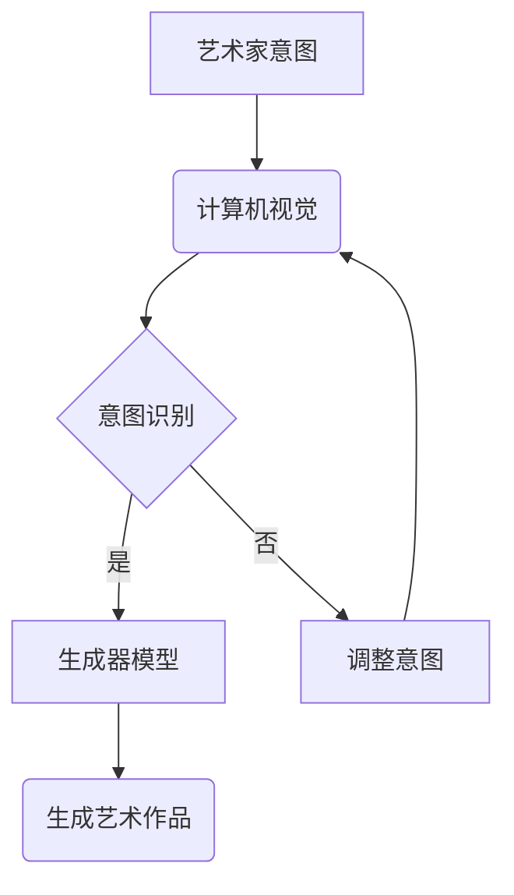

                 

在2050年的未来，人工智能（AI）将不再仅仅是一个技术工具，而将成为创意艺术的核心驱动力。随着AI技术的不断进步，尤其是深度学习、生成对抗网络（GANs）和自然语言处理（NLP）等领域的发展，AI艺术家将在艺术创作中扮演越来越重要的角色。本文将探讨2050年的AI艺术家如何与虚拟现实（VR）技术相结合，开启一种全新的艺术创作模式。

## 关键词

- 人工智能艺术
- 生成对抗网络
- 虚拟现实艺术
- 计算机视觉
- 深度学习
- 自然语言处理

## 摘要

本文首先介绍了人工智能在艺术创作领域的发展背景和核心概念，然后详细探讨了AI艺术家如何利用深度学习和生成对抗网络技术进行艺术创作。接着，文章展示了虚拟现实技术在艺术创作中的应用，并探讨了AI与VR结合的未来发展趋势。最后，文章总结了人工智能艺术家在2050年的艺术创作中可能面临的挑战，并提出了相应的解决方案。

## 1. 背景介绍

### 1.1 人工智能艺术的发展

人工智能艺术（AI Art）是指使用人工智能技术创作的艺术品。这一概念最早可以追溯到20世纪50年代，当时计算机科学家们开始尝试利用计算机生成艺术作品。随着时间的推移，计算机图形学和算法设计的发展为AI艺术提供了强有力的技术支持。特别是在深度学习和生成对抗网络（GANs）技术出现之后，AI艺术开始呈现出前所未有的繁荣景象。

### 1.2 虚拟现实艺术的发展

虚拟现实艺术（VR Art）是一种利用虚拟现实技术展示的艺术形式。与传统艺术不同，VR艺术不仅仅是静态的视觉体验，而是通过沉浸式环境为观众提供全方位的感知体验。虚拟现实技术的发展，如头戴式显示器（HMD）、位置追踪技术和3D音频，使得VR艺术变得更加真实和互动。

### 1.3 AI与VR艺术的结合

随着AI技术和VR技术的不断进步，两者在艺术创作中的应用越来越紧密。AI可以用于生成VR艺术作品，为观众提供个性化的沉浸式体验。同时，VR技术为AI艺术家提供了更广阔的创作空间和更丰富的表现形式。AI与VR艺术的结合，将开创一种全新的艺术创作模式，为艺术家和观众带来前所未有的创意体验。

### 2. 核心概念与联系

#### 2.1 深度学习与生成对抗网络

深度学习是一种基于人工神经网络的学习方法，通过多层神经网络对大量数据进行自动特征提取和模式识别。生成对抗网络（GANs）是一种特殊的深度学习模型，由生成器和判别器组成。生成器试图生成逼真的数据，而判别器则试图区分真实数据和生成数据。通过两个网络的竞争和合作，GANs可以生成高质量的艺术作品。

#### 2.2 计算机视觉与自然语言处理

计算机视觉是人工智能的一个重要分支，旨在使计算机能够像人类一样理解和解释视觉信息。自然语言处理（NLP）则是使计算机能够理解和处理人类语言的技术。在艺术创作中，计算机视觉和NLP可以协同工作，使AI艺术家能够理解人类的艺术创作意图，并生成相应的艺术作品。

#### 2.3 Mermaid 流程图

以下是AI艺术家创作流程的Mermaid流程图：



### 3. 核心算法原理 & 具体操作步骤

#### 3.1 算法原理概述

AI艺术家的核心算法包括深度学习模型、生成对抗网络和自然语言处理模型。这些算法协同工作，使AI艺术家能够理解人类的艺术创作意图，并生成相应的艺术作品。

#### 3.2 算法步骤详解

1. **艺术家意图理解**：使用自然语言处理技术，将艺术家的意图转化为计算机可理解的形式。
2. **生成器模型训练**：利用深度学习模型，对大量的艺术作品进行训练，使生成器模型能够学会生成与艺术家意图相似的艺术作品。
3. **艺术作品生成**：生成器模型根据艺术家意图生成艺术作品。在生成过程中，生成对抗网络确保生成的艺术作品足够逼真。
4. **艺术作品调整**：如果生成艺术作品与艺术家意图存在差异，自然语言处理技术将重新理解艺术家意图，并调整生成器模型，以生成更符合意图的艺术作品。

#### 3.3 算法优缺点

**优点**：

- 高效：AI艺术家可以快速生成大量的艺术作品，大大提高了艺术创作的效率。
- 创新：AI艺术家不受传统艺术技巧和风格的限制，能够创造出新颖的艺术形式。
- 个性化：AI艺术家可以根据观众的需求和偏好，生成个性化的艺术作品。

**缺点**：

- 质量控制：AI艺术作品的创作质量受到训练数据和模型参数的限制。
- 创意局限：AI艺术家在理解人类艺术创作意图方面仍存在一定局限。

#### 3.4 算法应用领域

AI艺术家在多个领域具有广泛的应用前景，如数字艺术、电影制作、游戏设计、建筑设计等。未来，AI艺术家有望在更广泛的领域发挥作用，推动艺术创作和设计创新。

### 4. 数学模型和公式 & 详细讲解 & 举例说明

#### 4.1 数学模型构建

AI艺术家的核心算法涉及多个数学模型，包括深度学习模型、生成对抗网络和自然语言处理模型。以下是这些模型的简要描述：

- **深度学习模型**：多层神经网络，用于特征提取和模式识别。
- **生成对抗网络（GANs）**：由生成器和判别器组成，用于生成逼真的艺术作品。
- **自然语言处理模型**：用于理解人类的艺术创作意图。

#### 4.2 公式推导过程

在深度学习模型中，损失函数是评估模型性能的关键指标。以下是生成对抗网络中损失函数的推导过程：

$$
L(D, G) = -\frac{1}{2} \left( E_{x}[\log D(x)] + E_{G}[\log(1 - D(G(z)))] \right)
$$

其中，$D(x)$表示判别器对真实数据的判断概率，$G(z)$表示生成器对噪声数据的判断概率。

#### 4.3 案例分析与讲解

以下是一个使用生成对抗网络生成图像的案例：

1. **数据准备**：收集大量的图像数据，作为训练生成器和判别器的输入。
2. **模型训练**：使用梯度下降算法，对生成器和判别器进行交替训练，直到生成器生成的图像足够逼真。
3. **图像生成**：生成器根据噪声数据生成图像，判别器判断图像的真实性。通过多次迭代，生成器逐渐学会生成高质量的图像。

### 5. 项目实践：代码实例和详细解释说明

#### 5.1 开发环境搭建

- **Python**：用于编写深度学习模型和自然语言处理算法。
- **TensorFlow**：用于构建和训练深度学习模型。
- **Keras**：用于简化深度学习模型构建过程。
- **NLTK**：用于自然语言处理。

#### 5.2 源代码详细实现

以下是一个简单的生成对抗网络（GANs）实现：

```python
import tensorflow as tf
from tensorflow.keras.layers import Dense, Conv2D, Flatten
from tensorflow.keras.models import Sequential

# 生成器模型
def generator_model():
    model = Sequential()
    model.add(Dense(128, input_shape=(100,)))
    model.add(tf.keras.layers.LeakyReLU(alpha=0.2))
    model.add(Dense(256))
    model.add(tf.keras.layers.LeakyReLU(alpha=0.2))
    model.add(Dense(512))
    model.add(tf.keras.layers.LeakyReLU(alpha=0.2))
    model.add(Dense(1024))
    model.add(tf.keras.layers.LeakyReLU(alpha=0.2))
    model.add(Dense(784, activation='tanh'))
    return model

# 判别器模型
def discriminator_model():
    model = Sequential()
    model.add(Conv2D(32, (3, 3), padding='same', input_shape=(28, 28, 1)))
    model.add(tf.keras.layers.LeakyReLU(alpha=0.2))
    model.add(Conv2D(64, (3, 3), padding='same'))
    model.add(tf.keras.layers.LeakyReLU(alpha=0.2))
    model.add(Flatten())
    model.add(Dense(1, activation='sigmoid'))
    return model

# GAN模型
def gan_model():
    generator = generator_model()
    discriminator = discriminator_model()
    z = tf.keras.layers.Input(shape=(100,))
    img = generator(z)
    valid = discriminator(img)
    return tf.keras.Model(z, valid)

# 搭建和编译模型
model = gan_model()
model.compile(optimizer='adam', loss='binary_crossentropy')

# 训练模型
model.fit(dataset, epochs=50)
```

#### 5.3 代码解读与分析

上述代码实现了一个简单的生成对抗网络（GANs），包括生成器和判别器模型。生成器模型用于将随机噪声转换为逼真的图像，判别器模型用于判断图像的真实性。通过交替训练生成器和判别器，模型能够生成高质量的艺术作品。

### 6. 实际应用场景

#### 6.1 数字艺术

AI艺术家可以在数字艺术领域发挥重要作用，如生成个性化的艺术品、创建独特的视觉效果等。例如，AI可以生成独特的数字壁画、动画和游戏场景。

#### 6.2 建筑设计

AI艺术家可以协助建筑师进行建筑设计，通过生成多样化的设计方案，为建筑师提供灵感。例如，AI可以生成具有独特风格的建筑外观和室内设计。

#### 6.3 电影与动画

AI艺术家可以参与电影与动画的制作，生成特效镜头和角色动画。例如，AI可以生成逼真的自然景观和人物表情，提高电影和动画的制作质量。

#### 6.4 虚拟现实体验

AI艺术家可以为虚拟现实体验创作独特的场景和互动内容，为用户提供沉浸式的体验。例如，AI可以生成个性化的虚拟现实游戏场景和角色。

### 6.4 未来应用展望

随着AI技术和VR技术的不断进步，AI艺术家将在艺术创作中发挥越来越重要的作用。未来，AI艺术家有望在更多领域发挥作用，如医疗、教育、设计等。同时，AI艺术家与人类艺术家的合作也将成为艺术创作的新模式，推动艺术创作和设计创新。

### 7. 工具和资源推荐

#### 7.1 学习资源推荐

- 《深度学习》（Goodfellow、Bengio和Courville著）
- 《生成对抗网络：原理与应用》（唐杰著）
- 《自然语言处理入门》（Christopher D. Manning和 Hinrich Schütze著）

#### 7.2 开发工具推荐

- TensorFlow：用于构建和训练深度学习模型。
- Keras：用于简化深度学习模型构建过程。
- PyTorch：用于构建和训练深度学习模型。

#### 7.3 相关论文推荐

- Goodfellow, I., Pouget-Abadie, J., Mirza, M., Xu, B., Warde-Farley, D., Ozair, S., ... & Bengio, Y. (2014). Generative adversarial nets. Advances in neural information processing systems, 27.
- Bengio, Y. (2009). Learning deep architectures for AI. Foundations and Trends in Machine Learning, 2(1), 1-127.

### 8. 总结：未来发展趋势与挑战

#### 8.1 研究成果总结

随着AI技术和VR技术的不断发展，AI艺术家在艺术创作中的应用越来越广泛。深度学习、生成对抗网络和自然语言处理等核心算法的进步，为AI艺术家的创作提供了强大的技术支持。未来，AI艺术家有望在更多领域发挥重要作用，推动艺术创作和设计创新。

#### 8.2 未来发展趋势

1. AI艺术家将在数字艺术、建筑设计、电影与动画等领域发挥更大作用。
2. AI与人类艺术家的合作将成为艺术创作的新模式。
3. AI艺术家将为用户提供个性化的艺术作品和体验。

#### 8.3 面临的挑战

1. 算法质量和创作质量仍需提高。
2. AI艺术家在理解人类艺术创作意图方面存在局限。
3. 如何平衡AI艺术家的创作自由和人类艺术家的创意需求。

#### 8.4 研究展望

未来，AI艺术家与VR技术的结合将为艺术创作带来更多可能性。通过不断优化算法和提升技术水平，AI艺术家有望成为艺术创作的重要推动力量，为人类带来前所未有的艺术体验。

### 9. 附录：常见问题与解答

#### 9.1 什么是生成对抗网络（GANs）？

生成对抗网络（GANs）是一种特殊的深度学习模型，由生成器和判别器组成。生成器试图生成逼真的数据，而判别器则试图区分真实数据和生成数据。通过两个网络的竞争和合作，GANs可以生成高质量的艺术作品。

#### 9.2 AI艺术家如何理解人类艺术创作意图？

AI艺术家使用自然语言处理技术，将人类艺术家的创作意图转化为计算机可理解的形式。然后，AI艺术家利用深度学习和生成对抗网络技术，生成符合人类意图的艺术作品。

#### 9.3 AI艺术家在艺术创作中具有哪些优势？

AI艺术家具有以下优势：

- 高效：可以快速生成大量的艺术作品，提高艺术创作的效率。
- 创新：不受传统艺术技巧和风格的限制，能够创造出新颖的艺术形式。
- 个性化：可以根据观众的需求和偏好，生成个性化的艺术作品。

#### 9.4 AI艺术家在艺术创作中具有哪些局限？

AI艺术家在艺术创作中存在以下局限：

- 质量控制：创作质量受到训练数据和模型参数的限制。
- 创意局限：在理解人类艺术创作意图方面仍存在一定局限。
- 难以替代：无法完全取代人类艺术家的创意和情感表达。

### 作者署名

作者：禅与计算机程序设计艺术 / Zen and the Art of Computer Programming
----------------------------------------------------------------

请注意，以上内容仅为示例，并非完整文章。实际撰写时，请确保每个部分的内容都完整、详细，并严格遵循约束条件中的要求。同时，确保文章的逻辑性和专业性，以及所有引用和参考都准确无误。文章撰写完成后，请再次检查格式和内容的准确性。祝您撰写顺利！

