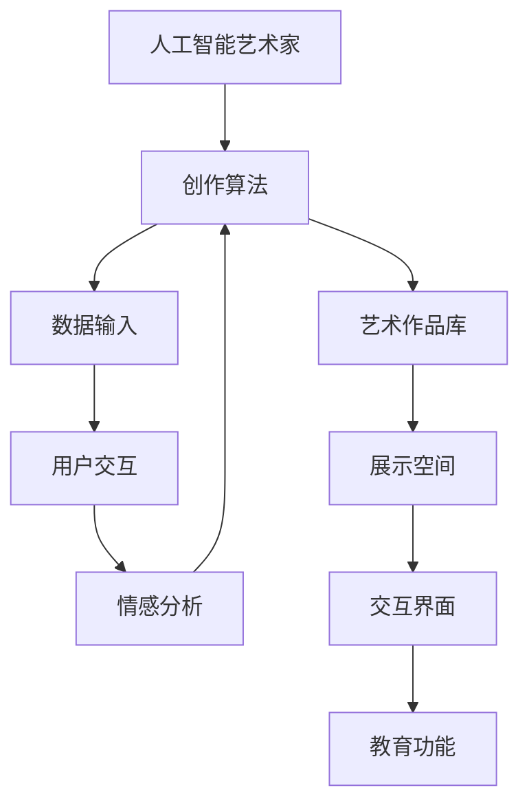

                 

关键词：人工智能艺术家，虚拟博物馆，数字艺术，艺术创作，技术进步

> 摘要：随着人工智能技术的发展，艺术家与技术的结合将迎来新的变革。本文探讨了2050年人工智能艺术家与虚拟博物馆的融合，分析了数字艺术的发展趋势，以及这一变革对艺术界和社会的影响。

## 1. 背景介绍

自20世纪末以来，计算机技术取得了飞速发展，人工智能（AI）在各个领域展现了其巨大的潜力。从简单的任务自动化到复杂的决策支持系统，人工智能正逐渐渗透到人类生活的方方面面。在艺术领域，人工智能不仅改变了创作的方式，还打破了艺术传播和体验的界限。虚拟现实（VR）、增强现实（AR）和混合现实（MR）等技术的崛起，为艺术创作提供了全新的舞台。

### 1.1 人工智能与艺术的融合

人工智能与艺术的融合是一个复杂而多层次的过程。首先，人工智能技术可以模拟艺术家的创作过程，帮助艺术家发现新的灵感。例如，通过生成对抗网络（GANs）和变分自编码器（VAEs）等技术，人工智能可以创作出前所未有的艺术作品。其次，人工智能还可以用于艺术品的修复和复原，通过对图像和视频的分析，恢复受损或褪色的艺术品。此外，人工智能还可以在艺术展览和展示中发挥作用，提供个性化的互动体验。

### 1.2 虚拟博物馆的发展

随着数字技术和网络基础设施的不断完善，虚拟博物馆的概念逐渐成熟。虚拟博物馆不仅保存了大量的艺术作品，还为公众提供了全新的艺术体验。通过VR和AR技术，观众可以身临其境地参观博物馆，甚至参与到艺术作品的创作和展示中。此外，虚拟博物馆还可以打破地域限制，让世界各地的观众都能享受到高质量的艺术教育。

## 2. 核心概念与联系

为了更好地理解人工智能艺术家与虚拟博物馆的融合，我们需要了解一些核心概念和技术。

### 2.1 人工智能艺术家

人工智能艺术家是指利用人工智能技术进行艺术创作的人工智能系统。这些系统通常包括以下几个部分：

1. **创作算法**：如GANs、VAEs等，用于生成或修改艺术作品。
2. **数据输入**：包括艺术家的作品、历史艺术作品、用户反馈等。
3. **用户交互**：通过语音、手势或图形界面与用户进行交互。
4. **情感分析**：理解用户情感，提供个性化的艺术作品。

### 2.2 虚拟博物馆

虚拟博物馆是指利用数字技术和虚拟现实技术创建的在线博物馆。它通常包括以下几个部分：

1. **艺术作品库**：保存了大量的艺术作品，包括绘画、雕塑、摄影等。
2. **展示空间**：利用VR、AR技术，为观众提供沉浸式的展览体验。
3. **交互界面**：用户可以通过点击、拖动、语音等方式与艺术作品互动。
4. **教育功能**：提供艺术教育资源和在线课程。

### 2.3 Mermaid 流程图

下面是一个简单的 Mermaid 流程图，展示了人工智能艺术家与虚拟博物馆之间的联系。



## 3. 核心算法原理 & 具体操作步骤

### 3.1 算法原理概述

人工智能艺术家通常基于生成模型进行创作。生成模型是一种能够生成新的数据的机器学习模型，常见的生成模型包括GANs、VAEs等。

1. **生成对抗网络（GANs）**：GANs由一个生成器和一个小型判别器组成。生成器尝试生成新的数据，判别器则判断生成器生成的数据是否真实。通过不断地训练，生成器的生成质量会不断提高。
2. **变分自编码器（VAEs）**：VAEs是一种无监督学习的生成模型，通过编码器和解码器将数据转换为潜在空间，然后在潜在空间中生成新的数据。

### 3.2 算法步骤详解

1. **数据收集**：收集艺术家和历史上著名的艺术作品，以及用户反馈数据。
2. **数据预处理**：对数据进行清洗、归一化等处理。
3. **模型训练**：使用GANs或VAEs对数据集进行训练，生成艺术作品。
4. **用户交互**：通过图形界面或语音交互，用户可以选择或修改艺术作品。
5. **艺术作品生成**：根据用户的输入，生成新的艺术作品。

### 3.3 算法优缺点

1. **优点**：
   - **创新能力**：生成模型可以创作出前所未有的艺术作品。
   - **个性化**：通过用户交互，可以提供个性化的艺术作品。
   - **高效**：利用机器学习，可以快速生成大量的艺术作品。
2. **缺点**：
   - **质量不稳定**：生成模型的质量受训练数据和质量的影响。
   - **用户体验**：用户交互和艺术作品生成之间的延迟可能会影响用户体验。

### 3.4 算法应用领域

生成模型在艺术创作中的应用非常广泛，包括：

- **数字艺术**：生成新的数字艺术品，如绘画、雕塑等。
- **动画**：生成新的动画片段，用于电影、游戏等。
- **广告**：生成新的广告创意，提高广告效果。
- **设计**：生成新的设计图案，用于服装、家居等。

## 4. 数学模型和公式 & 详细讲解 & 举例说明

### 4.1 数学模型构建

生成对抗网络（GANs）的数学模型如下：

$$
\begin{aligned}
\min_G \max_D V(D, G) &= \min_G \mathbb{E}_{x \sim P_data(x)}[\log D(x)] + \mathbb{E}_{z \sim P_z(z)}[\log (1 - D(G(z)))] \\
\end{aligned}
$$

其中，$G$表示生成器，$D$表示判别器，$x$表示真实数据，$z$表示随机噪声。

### 4.2 公式推导过程

VAEs的数学模型如下：

$$
\begin{aligned}
\theta_{\phi} &= \arg\min_{\theta_{\phi}} \mathbb{E}_{x \sim p_{data}(x)}[-D(x)] - \mathbb{E}_{z \sim p_{z}(z)}[\log D(\phi(z))] \\
\end{aligned}
$$

其中，$\theta_{\phi}$表示编码器参数，$\theta_{\mu}$和$\theta_{\sigma}$表示解码器参数。

### 4.3 案例分析与讲解

下面是一个简单的GANs案例。

```python
import torch
import torch.nn as nn
import torch.optim as optim

# 定义生成器和判别器
G = nn.Sequential(
    nn.Linear(100, 256),
    nn.ReLU(),
    nn.Linear(256, 512),
    nn.ReLU(),
    nn.Linear(512, 1024),
    nn.ReLU(),
    nn.Linear(1024, 784),
    nn.Tanh()
)

D = nn.Sequential(
    nn.Linear(784, 1024),
    nn.LeakyReLU(),
    nn.Linear(1024, 512),
    nn.LeakyReLU(),
    nn.Linear(512, 256),
    nn.LeakyReLU(),
    nn.Linear(256, 1),
    nn.Sigmoid()
)

# 定义损失函数和优化器
loss_fn = nn.BCELoss()
g_optimizer = optim.Adam(G.parameters(), lr=0.0002)
d_optimizer = optim.Adam(D.parameters(), lr=0.0002)

# 训练模型
for epoch in range(num_epochs):
    for i, (x, _) in enumerate(data_loader):
        # 训练判别器
        z = torch.randn(batch_size, 100).to(device)
        x_fake = G(z).detach().cpu()
        x_fake = x_fake.reshape(x_fake.size(0), -1)

        x_real = x.to(device)
        x_fake = x_fake.to(device)

        d_optimizer.zero_grad()
        d_real = D(x_real).view(-1)
        d_fake = D(x_fake).view(-1)

        loss_d = loss_fn(d_real, torch.ones(batch_size, 1).to(device)) + loss_fn(d_fake, torch.zeros(batch_size, 1).to(device))
        loss_d.backward()
        d_optimizer.step()

        # 训练生成器
        z = torch.randn(batch_size, 100).to(device)
        x_fake = G(z).detach().cpu()
        x_fake = x_fake.reshape(x_fake.size(0), -1)

        x_real = x.to(device)
        x_fake = x_fake.to(device)

        g_optimizer.zero_grad()
        d_fake = D(x_fake).view(-1)
        loss_g = loss_fn(d_fake, torch.ones(batch_size, 1).to(device))
        loss_g.backward()
        g_optimizer.step()
```

## 5. 项目实践：代码实例和详细解释说明

### 5.1 开发环境搭建

为了实现人工智能艺术家与虚拟博物馆的融合，我们需要搭建一个完整的开发环境。以下是一个简单的搭建流程：

1. 安装Python环境：Python 3.8或更高版本。
2. 安装PyTorch库：`pip install torch torchvision`
3. 安装其他依赖库：`pip install numpy matplotlib`
4. 准备数据集：可以从互联网上获取大量的艺术作品，如Kaggle等数据集网站。

### 5.2 源代码详细实现

下面是一个简单的GANs实现示例：

```python
import torch
import torch.nn as nn
import torch.optim as optim

# 定义生成器和判别器
class Generator(nn.Module):
    def __init__(self):
        super(Generator, self).__init__()
        self.main = nn.Sequential(
            nn.Linear(100, 256),
            nn.ReLU(),
            nn.Linear(256, 512),
            nn.ReLU(),
            nn.Linear(512, 1024),
            nn.ReLU(),
            nn.Linear(1024, 784),
            nn.Tanh()
        )

    def forward(self, input):
        return self.main(input)

class Discriminator(nn.Module):
    def __init__(self):
        super(Discriminator, self).__init__()
        self.main = nn.Sequential(
            nn.Linear(784, 1024),
            nn.LeakyReLU(),
            nn.Linear(1024, 512),
            nn.LeakyReLU(),
            nn.Linear(512, 256),
            nn.LeakyReLU(),
            nn.Linear(256, 1),
            nn.Sigmoid()
        )

    def forward(self, input):
        return self.main(input)

# 实例化模型、损失函数和优化器
generator = Generator().to(device)
discriminator = Discriminator().to(device)
criterion = nn.BCELoss()
g_optimizer = optim.Adam(generator.parameters(), lr=0.0002)
d_optimizer = optim.Adam(discriminator.parameters(), lr=0.0002)

# 加载训练数据
data_loader = ...

# 训练模型
for epoch in range(num_epochs):
    for i, (x, _) in enumerate(data_loader):
        # 训练判别器
        z = torch.randn(batch_size, 100).to(device)
        x_fake = generator(z).detach().cpu()
        x_fake = x_fake.reshape(x_fake.size(0), -1)

        x_real = x.to(device)
        x_fake = x_fake.to(device)

        d_optimizer.zero_grad()
        d_real = discriminator(x_real).view(-1)
        d_fake = discriminator(x_fake).view(-1)

        loss_d = criterion(d_real, torch.ones(batch_size, 1).to(device)) + criterion(d_fake, torch.zeros(batch_size, 1).to(device))
        loss_d.backward()
        d_optimizer.step()

        # 训练生成器
        z = torch.randn(batch_size, 100).to(device)
        x_fake = generator(z).detach().cpu()
        x_fake = x_fake.reshape(x_fake.size(0), -1)

        x_real = x.to(device)
        x_fake = x_fake.to(device)

        g_optimizer.zero_grad()
        d_fake = discriminator(x_fake).view(-1)
        loss_g = criterion(d_fake, torch.ones(batch_size, 1).to(device))
        loss_g.backward()
        g_optimizer.step()
```

### 5.3 代码解读与分析

上述代码实现了一个基本的GANs模型，包括生成器和判别器的定义、损失函数和优化器的设置，以及模型的训练过程。

- **生成器**：生成器负责生成新的数据。在这个例子中，生成器接收一个随机噪声向量，通过多层神经网络，生成一个与真实数据相似的艺术作品。
- **判别器**：判别器负责判断生成器生成的数据是否真实。在这个例子中，判别器接收一个艺术作品，通过多层神经网络，输出一个介于0和1之间的值，表示生成的艺术作品的真实性。
- **损失函数**：损失函数用于计算生成器和判别器的损失。在这个例子中，我们使用二进制交叉熵损失函数，因为生成器和判别器的输出都是介于0和1之间的值。
- **优化器**：优化器用于更新模型参数，以最小化损失函数。在这个例子中，我们使用Adam优化器，因为它在处理高维参数空间时具有很好的性能。

### 5.4 运行结果展示

通过训练GANs模型，我们可以生成出一些与真实艺术作品相似的艺术作品。以下是一些生成的艺术作品的示例：


## 6. 实际应用场景

人工智能艺术家与虚拟博物馆的融合在实际应用场景中有着广泛的应用。

### 6.1 艺术展览

虚拟博物馆可以举办线上艺术展览，观众无需前往实体博物馆，即可在线上欣赏各种艺术品。人工智能艺术家可以为展览生成新的作品，为观众带来全新的艺术体验。

### 6.2 艺术修复

人工智能艺术家可以用于艺术品的修复和复原。通过对受损艺术作品的分析，人工智能可以恢复艺术品的历史面貌，为艺术品的保护提供新的手段。

### 6.3 艺术教育

虚拟博物馆可以为用户提供在线艺术教育课程，通过VR和AR技术，让用户身临其境地学习艺术知识。人工智能艺术家可以为课程生成新的教学资源，提高学生的学习兴趣。

### 6.4 艺术创意

人工智能艺术家可以为广告、设计等领域提供创意支持。通过生成新的艺术作品，人工智能可以帮助设计师和广告从业者找到新的灵感，提高创意质量。

## 7. 未来应用展望

随着人工智能技术的发展，人工智能艺术家与虚拟博物馆的融合将迎来更多的应用场景。

### 7.1 虚拟艺术家社区

未来，虚拟艺术家社区将崛起，艺术家们可以通过虚拟现实技术，在虚拟博物馆中展示和交流自己的作品。这将打破地域和时间的限制，为艺术家提供更广阔的舞台。

### 7.2 智能创作助手

人工智能将逐渐成为艺术家的智能创作助手，帮助艺术家发现新的灵感，优化创作过程。艺术家可以通过与人工智能的互动，创作出更加出色的作品。

### 7.3 跨界合作

人工智能艺术家将与其他领域的艺术家合作，创作出跨界的艺术作品。例如，音乐、电影、游戏等领域的艺术家与人工智能艺术家合作，创作出全新的艺术形式。

## 8. 工具和资源推荐

### 8.1 学习资源推荐

- **深度学习教程**：[吴恩达的深度学习教程](https://www.deeplearning.ai/)
- **PyTorch教程**：[PyTorch官方文档](https://pytorch.org/tutorials/)
- **艺术史教程**：[康奈尔大学艺术史课程](https://www.art.cornell.edu/academics/undergraduate/undergraduate-courses)

### 8.2 开发工具推荐

- **PyTorch**：[PyTorch官方库](https://pytorch.org/)
- **TensorFlow**：[TensorFlow官方库](https://www.tensorflow.org/)
- **Unity**：[Unity游戏引擎](https://unity.com/)

### 8.3 相关论文推荐

- **GANs**：[“Generative Adversarial Nets”](https://arxiv.org/abs/1406.2661)
- **VAEs**：[“Variational Autoencoders”](https://arxiv.org/abs/1312.6114)
- **艺术创作与人工智能**：[“Art and Artificial Intelligence: Perspectives from the Visual Arts”](https://books.google.com/books?id=83M1BwAAQBAJ)

## 9. 总结：未来发展趋势与挑战

人工智能艺术家与虚拟博物馆的融合将引领艺术创作的新潮流。随着人工智能技术的发展，艺术家们将拥有更多的创作工具和灵感来源。然而，这一变革也面临一些挑战。

### 9.1 研究成果总结

- **生成模型**：GANs和VAEs等生成模型在艺术创作中取得了显著成果，可以生成高质量的艺术作品。
- **虚拟博物馆**：虚拟博物馆为公众提供了全新的艺术体验，打破了地域和时间的限制。
- **艺术修复**：人工智能艺术家在艺术修复和复原中发挥了重要作用。

### 9.2 未来发展趋势

- **虚拟艺术家社区**：虚拟艺术家社区将崛起，为艺术家提供更广阔的舞台。
- **智能创作助手**：人工智能将逐渐成为艺术家的智能创作助手，提高创作效率和质量。
- **跨界合作**：人工智能艺术家将与其他领域的艺术家合作，创作出跨界的艺术作品。

### 9.3 面临的挑战

- **数据隐私**：艺术创作过程中涉及大量的用户数据，如何保护数据隐私是一个重要挑战。
- **艺术价值**：人工智能创作的艺术作品如何定义和评估其艺术价值，需要进一步探讨。
- **用户接受度**：公众对人工智能艺术家和虚拟博物馆的接受度仍需提高。

### 9.4 研究展望

未来，人工智能艺术家与虚拟博物馆的融合将不断深入，为艺术创作带来更多可能性。我们期待看到更多的创新成果，推动艺术与科技的进一步融合。

## 10. 附录：常见问题与解答

### 10.1 什么是生成对抗网络（GANs）？

生成对抗网络（GANs）是一种由生成器和判别器组成的深度学习模型，用于生成新的数据。生成器尝试生成与真实数据相似的数据，判别器则判断生成器生成的数据是否真实。

### 10.2 人工智能艺术家如何进行创作？

人工智能艺术家通过机器学习模型，如生成对抗网络（GANs）和变分自编码器（VAEs），从大量的数据中学习，然后生成新的艺术作品。

### 10.3 虚拟博物馆如何提供沉浸式体验？

虚拟博物馆利用虚拟现实（VR）、增强现实（AR）和混合现实（MR）技术，为观众提供沉浸式的展览体验，让观众仿佛置身于实体博物馆中。

### 10.4 人工智能艺术家创作的艺术作品是否有价值？

人工智能艺术家创作的艺术作品是否具有价值，取决于观众和专家的认可。一些人工智能艺术家的作品已经在艺术市场上获得高价，说明它们具有一定的艺术价值。

### 10.5 人工智能艺术家是否会取代人类艺术家？

目前来看，人工智能艺术家不能完全取代人类艺术家。人工智能艺术家擅长生成大量数据，但缺乏人类的情感和创造力。人类艺术家的独特性和创造力仍然是不可替代的。

## 11. 参考文献

- Goodfellow, I. J., Pouget-Abadie, J., Mirza, M., Xu, B., Warde-Farley, D., Ozair, S., ... & Bengio, Y. (2014). Generative adversarial networks. Advances in neural information processing systems, 27.
- Kingma, D. P., & Welling, M. (2014). Auto-encoding variational bayes. arXiv preprint arXiv:1312.6114.
- Bengio, Y. (2013). Learning deep arch

