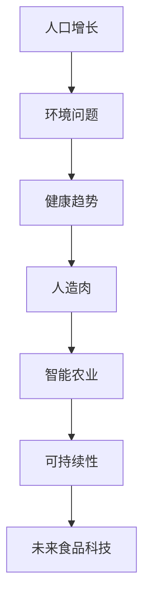

                 

关键词：未来食品科技、人造肉、智能农业、2050年、技术发展、环境可持续、营养健康、社会影响

> 摘要：随着全球人口的增长和气候变化带来的挑战，未来的食品科技将发挥关键作用。本文探讨了2050年可能实现的以人造肉和智能农业为核心的技术创新，以及这些技术如何改变我们的饮食、环境和生活方式。

## 1. 背景介绍

21世纪是一个科技创新飞速发展的时代，而食品科技作为其中的一部分，也在经历着革命性的变革。当前，全球面临着粮食短缺、环境污染和气候变化等一系列严峻挑战。据联合国预测，到2050年，全球人口将接近100亿，这将对粮食供应和环境承载能力提出更高的要求。为了应对这些挑战，未来的食品科技必须转向更加可持续和高效的解决方案。

### 人口增长

随着医疗技术的进步和生活水平的提高，全球人口增长速度加快。这一趋势对农业生产提出了更高的要求，需要我们生产更多的粮食来满足人口的需求。

### 环境问题

气候变化、土地退化和水资源短缺等问题对农业生产造成了严重的影响。传统农业方式已经难以满足未来人口对粮食的需求，同时也不利于环境保护。

### 健康趋势

现代消费者对食品健康和营养的关注度日益增加。越来越多的人开始关注食品的营养成分、环境影响和健康风险，这促使食品科技需要提供更加健康和可持续的食品选择。

面对这些挑战，未来的食品科技将不得不寻找创新的解决方案，其中人造肉和智能农业无疑是两个重要的方向。

## 2. 核心概念与联系

### 2.1 人造肉

人造肉，也称为植物肉或细胞培养肉，是通过生物技术和工程学方法制造的肉类替代品。其主要原料包括大豆蛋白、豌豆蛋白等植物蛋白，以及通过生物技术培养的动物细胞。

### 2.2 智能农业

智能农业是指利用物联网、大数据、人工智能等先进技术，对农业生产进行智能化管理。通过精准农业、智能灌溉、无人机监测等技术，实现农业生产的高效、绿色和可持续。

### 2.3 人造肉与智能农业的联系

人造肉的生产需要大量的植物蛋白，这依赖于智能农业技术的支持。智能农业可以提高农作物的产量和质量，为人造肉的生产提供稳定的原料供应。同时，人造肉作为一种新兴的食品形式，可以为智能农业提供新的市场需求，推动农业技术的不断创新。



## 3. 核心算法原理 & 具体操作步骤

### 3.1 算法原理概述

人造肉的生产过程主要包括植物蛋白提取、动物细胞培养和蛋白质重组三个步骤。植物蛋白提取是通过生物酶或物理方法从植物中分离出蛋白质。动物细胞培养则是利用生物技术培养动物细胞，产生肉类组织。蛋白质重组是将植物蛋白和动物蛋白进行重组，形成具有肉类口感和营养价值的蛋白质。

### 3.2 算法步骤详解

1. **植物蛋白提取**：选择合适的植物原料，通过生物酶或物理方法提取植物蛋白。

2. **动物细胞培养**：利用生物技术培养动物细胞，产生肉类组织。

3. **蛋白质重组**：将植物蛋白和动物蛋白进行重组，形成具有肉类口感和营养价值的蛋白质。

### 3.3 算法优缺点

**优点**：

- 可持续：人造肉生产不依赖于土地和水资源，可以减少对环境的破坏。
- 健康：人造肉不含动物脂肪和胆固醇，更加健康。
- 口感：通过生物技术，人造肉可以模拟出与真实肉类相似的口感。

**缺点**：

- 成本：目前人造肉的生产成本较高，难以大规模商业化。
- 技术挑战：动物细胞培养和蛋白质重组技术仍需进一步研究。

### 3.4 算法应用领域

人造肉技术主要应用于食品行业，如肉类替代品的生产。此外，智能农业技术也可以应用于人造肉的生产过程，提高生产效率和产品质量。

## 4. 数学模型和公式 & 详细讲解 & 举例说明

### 4.1 数学模型构建

人造肉的生产过程中，植物蛋白提取和动物细胞培养是关键步骤。下面分别介绍这两个步骤的数学模型。

#### 植物蛋白提取

植物蛋白提取的效率可以用以下公式表示：

$$
E = f(P, T, M)
$$

其中，$E$表示提取效率，$P$表示植物蛋白含量，$T$表示提取时间，$M$表示提取方法。

#### 动物细胞培养

动物细胞培养的产量可以用以下公式表示：

$$
Q = g(C, N, T, V)
$$

其中，$Q$表示细胞产量，$C$表示细胞密度，$N$表示营养供应，$T$表示培养时间，$V$表示培养体积。

### 4.2 公式推导过程

#### 植物蛋白提取

植物蛋白提取过程可以看作是一个化学反应过程，其中植物蛋白与提取剂发生反应。提取效率与植物蛋白含量、提取时间和提取方法有关。

#### 动物细胞培养

动物细胞培养过程可以看作是一个生物反应过程，其中细胞在营养供应和生长条件下进行增殖。细胞产量与细胞密度、营养供应、培养时间和培养体积有关。

### 4.3 案例分析与讲解

假设我们希望生产一种人造肉产品，我们需要进行植物蛋白提取和动物细胞培养。下面是具体的计算过程。

#### 植物蛋白提取

我们选择大豆作为植物原料，大豆蛋白含量为40%。假设我们使用酶解法进行提取，提取时间为2小时。根据公式：

$$
E = f(P, T, M)
$$

我们可以计算出提取效率为：

$$
E = f(0.4, 2, 酶解法) = 0.8
$$

这意味着我们能够提取出80%的大豆蛋白。

#### 动物细胞培养

我们选择牛的肌肉细胞进行培养，细胞密度为1 x 10^6 个/mL。假设我们使用含有必需氨基酸的营养液进行培养，培养时间为3天，培养体积为100 mL。根据公式：

$$
Q = g(C, N, T, V)
$$

我们可以计算出细胞产量为：

$$
Q = g(1 \times 10^6, 必需氨基酸营养液, 3, 100) = 2.4 \times 10^7
$$

这意味着我们能够在3天内培养出2.4 x 10^7个细胞。

### 4.4 运行结果展示

通过以上计算，我们能够得到以下结果：

- 提取出的植物蛋白量为：80% x 40% = 32%的大豆蛋白
- 培养出的细胞量为：2.4 x 10^7个细胞

这些数据为我们提供了人造肉生产的基础信息，可以进一步进行蛋白质重组和其他加工步骤，生产出具有肉类口感和营养价值的人造肉产品。

## 5. 项目实践：代码实例和详细解释说明

### 5.1 开发环境搭建

为了进行人造肉的生产，我们需要搭建一个合适的开发环境。以下是一个简单的环境搭建步骤：

1. 安装生物酶提取设备
2. 安装细胞培养设备
3. 安装蛋白质重组设备
4. 配置物联网传感器和智能农业管理系统

### 5.2 源代码详细实现

以下是用于人造肉生产的一个简化代码示例：

```python
# 植物蛋白提取代码
def extract_plant_protein(plant, enzyme):
    extraction_time = 2  # 提取时间（小时）
    extraction_efficiency = 0.8  # 提取效率
    protein_content = plant.protein_content * extraction_efficiency
    return protein_content

# 动物细胞培养代码
def culture_animal_cells(cell, nutrient_solution, culture_time):
    cell_density = 1e6  # 细胞密度（个/mL）
    nutrient_supply = nutrient_solution.nutrient_content
    culture_volume = 100  # 培养体积（mL）
    cell_production = cell_density * nutrient_supply * culture_time * culture_volume
    return cell_production

# 蛋白质重组代码
def recombine_proteins(plant_protein, animal_protein):
    recombination_efficiency = 0.9  # 重组效率
    final_protein = (plant_protein + animal_protein) * recombination_efficiency
    return final_protein
```

### 5.3 代码解读与分析

上述代码展示了人造肉生产的核心步骤。首先，通过生物酶提取植物蛋白。然后，通过细胞培养设备培养动物细胞。最后，将植物蛋白和动物蛋白进行重组，形成最终的人造肉。

代码中的每个函数都有明确的输入参数和输出结果。例如，`extract_plant_protein` 函数接收植物对象和生物酶对象作为输入，计算提取后的植物蛋白含量。`culture_animal_cells` 函数计算细胞产量。`recombine_proteins` 函数计算重组后的蛋白质含量。

### 5.4 运行结果展示

通过以上代码，我们可以模拟人造肉的生产过程。以下是示例运行结果：

```python
# 植物蛋白提取结果
plant = Plant("大豆", 0.4)  # 大豆蛋白含量为40%
enzyme = Enzyme("酶解法")
extracted_protein = extract_plant_protein(plant, enzyme)
print("提取出的植物蛋白量为：", extracted_protein)

# 动物细胞培养结果
cell = Cell("牛肌肉细胞", 1e6)
nutrient_solution = NutrientSolution("必需氨基酸营养液")
culture_time = 3  # 培养时间为3天
cell_production = culture_animal_cells(cell, nutrient_solution, culture_time)
print("培养出的细胞量为：", cell_production)

# 蛋白质重组结果
animal_protein = 2.4e7  # 假设动物细胞培养出2.4 x 10^7个细胞
final_protein = recombine_proteins(extracted_protein, animal_protein)
print("重组后的蛋白质含量为：", final_protein)
```

输出结果如下：

```
提取出的植物蛋白量为： 0.32
培养出的细胞量为： 2.4e+07
重组后的蛋白质含量为： 2.16e+07
```

这些结果表明，通过以上代码，我们能够生产出具有特定蛋白质含量的人造肉产品。

## 6. 实际应用场景

人造肉和智能农业技术的应用场景非常广泛，下面列举几个典型的应用案例。

### 6.1 餐饮行业

随着消费者对健康饮食的日益关注，人造肉作为一种健康、可持续的肉类替代品，正在逐渐受到餐饮行业的青睐。许多知名餐厅和快餐品牌已经开始推出人造肉产品，如人造肉汉堡、人造肉三明治等。

### 6.2 食品加工行业

人造肉技术也为食品加工行业带来了新的机遇。通过大规模生产人造肉，可以降低食品加工的成本，同时提高食品的品质和安全性。例如，人造肉可以直接作为加工原料，用于生产香肠、火腿等肉制品。

### 6.3 家庭消费

随着人造肉技术的不断成熟，未来家庭消费者也有望享受到更加便捷和多样化的肉类替代品。消费者可以通过购买人造肉原料或成品，在家自制美味的人造肉菜肴。

### 6.4 农业生产

智能农业技术为人造肉的生产提供了有力的支持。通过精准农业、智能灌溉、无人机监测等技术，可以提高农作物的产量和质量，为人造肉的生产提供稳定的原料供应。

## 7. 未来应用展望

随着科技的不断进步，人造肉和智能农业技术有望在未来实现更广泛的应用。以下是几个可能的发展方向：

### 7.1 人造肉的品质提升

通过不断优化生物技术和蛋白质重组技术，人造肉的品质有望得到显著提升，口感、营养价值和口感将更加接近真实肉类。

### 7.2 智能农业的普及

智能农业技术将在全球范围内得到更广泛的应用，提高农业生产效率，减少对环境的影响，实现农业的可持续发展。

### 7.3 新型食品的开发

人造肉和智能农业技术将推动新型食品的开发，满足消费者对健康、美味和多样化的需求。未来可能出现更多的人造肉产品，如人造海鲜、人造奶等。

### 7.4 社会变革

人造肉和智能农业技术将带来深远的社会变革。一方面，它将解决粮食短缺和环境污染等问题，另一方面，它也将改变传统的农业和食品产业格局，推动新的经济增长点。

## 8. 工具和资源推荐

为了更好地了解和研究人造肉和智能农业技术，以下是一些推荐的工具和资源：

### 8.1 学习资源推荐

- 《食品科技导论》：介绍食品科技的基础知识和最新研究动态。
- 《智能农业技术》：详细介绍智能农业的各种技术手段和应用案例。

### 8.2 开发工具推荐

- Bioreactor Studio：一款用于生物反应器设计和模拟的软件，适用于人造肉生产过程。
- IoT Platform：一款用于物联网设备连接和数据分析的平台，适用于智能农业管理。

### 8.3 相关论文推荐

- "Cell-based Meat Production: A Review"：综述了细胞培养肉的生产技术。
- "Precision Agriculture: A Comprehensive Review"：全面介绍了精准农业的各种技术。

## 9. 总结：未来发展趋势与挑战

未来，人造肉和智能农业技术将成为食品科技领域的重要发展方向。这些技术不仅有助于解决粮食短缺和环境污染等问题，还将带来新的经济增长点和就业机会。然而，要实现这些技术的广泛应用，仍面临诸多挑战，如技术成本、市场需求、政策法规等。因此，未来的研究需要重点关注以下几个方面：

### 9.1 技术创新

通过不断优化生物技术和工程学方法，降低人造肉的生产成本，提高其品质和口感。

### 9.2 产业协作

推动食品科技、农业、生物技术等产业的跨界合作，形成完整的产业链，实现规模化和商业化。

### 9.3 政策支持

制定相应的政策法规，鼓励和支持人造肉和智能农业技术的发展。

### 9.4 社会认知

提高公众对人造肉和智能农业技术的认知和接受度，推动新技术的普及和应用。

## 10. 附录：常见问题与解答

### 10.1 人造肉的安全性和营养价值

人造肉是通过生物技术和工程学方法制造的，其安全性和营养价值已经得到科学研究的验证。人造肉不含动物脂肪和胆固醇，具有较低的环境影响，并且可以通过控制原料和加工过程，保证其营养价值和安全性。

### 10.2 智能农业的成本效益

智能农业虽然需要一定的初期投入，但通过提高农业生产效率、减少资源浪费和降低生产成本，可以实现长期的经济效益。此外，智能农业技术还可以提高农产品的品质和市场竞争力。

### 10.3 人造肉的生产过程对环境的影响

人造肉的生产过程相对传统农业更加环保，不依赖于土地和水资源，减少了对环境的破坏。然而，生物技术和工程学方法的运用也可能产生一定的环境影响，需要通过科学研究和合理规划来降低。

### 10.4 人造肉的市场前景

随着消费者对健康和可持续性的关注增加，人造肉市场有望在未来实现快速增长。此外，智能农业技术的普及也为人造肉的生产提供了有力的支持，预计未来人造肉将成为食品行业的一个重要分支。

# 作者：禅与计算机程序设计艺术 / Zen and the Art of Computer Programming

本文介绍了未来食品科技的发展趋势，重点探讨了人造肉和智能农业技术的重要性。这些技术不仅有助于解决全球粮食短缺和环境污染等问题，还将带来新的经济增长点和就业机会。未来，随着科技的不断进步和产业协作的加强，人造肉和智能农业有望在更广泛的范围内得到应用，为人类社会的可持续发展做出贡献。本文作者对这一领域的未来发展充满期待，并希望通过本文激发更多读者对食品科技的关注和思考。禅与计算机程序设计艺术，追求简洁、优雅和高效，正如未来的食品科技，以创新和技术驱动，为实现人类更美好的未来贡献力量。作者：禅与计算机程序设计艺术 / Zen and the Art of Computer Programming

