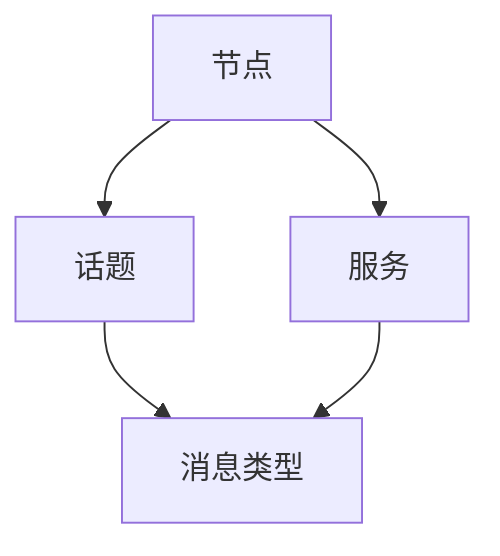

                 

关键词：机器人操作系统、自主系统、软件开发框架、ROS架构、算法原理、数学模型、代码实例、实际应用场景、未来展望。

## 摘要

本文旨在全面介绍机器人操作系统（ROS），一个用于构建自主机器人系统的开放源代码软件开发框架。ROS在机器人研究领域和工业应用中具有广泛的影响力，其提供了丰富的工具、库和社区支持，使得开发者能够更加高效地实现机器人算法和系统的集成。本文将探讨ROS的核心概念、架构设计、核心算法原理、数学模型、项目实践以及未来的应用前景，旨在为广大开发者提供一套系统化的学习和应用指南。

## 1. 背景介绍

随着人工智能和机器人技术的快速发展，自主系统（Autonomous Systems）逐渐成为现代技术的重要研究方向。自主系统具备在无人干预的情况下完成复杂任务的能力，包括路径规划、环境感知、决策制定、任务执行等。这些系统能够在各种复杂和动态的环境中发挥作用，从无人驾驶汽车到智能无人机，从服务机器人到工业自动化系统。

在这样的背景下，机器人操作系统（Robot Operating System，简称ROS）应运而生。ROS由斯坦福大学和Willow Garage共同开发，于2007年首次发布。ROS的核心理念是提供一个跨平台、可扩展的软件开发框架，以支持机器人的研究、开发和部署。ROS的目标是为开发者提供一个统一的平台，使得不同背景、不同专业领域的技术人员能够协作开发自主机器人系统。

ROS的设计初衷是为了解决以下几个问题：

1. **异构计算资源管理**：在机器人系统中，硬件平台多种多样，包括CPU、GPU、传感器、执行器等。ROS提供了一套统一的接口，使得开发者可以无需关心底层硬件的具体实现，从而专注于算法和系统的开发。
2. **模块化开发**：ROS采用模块化设计，使得系统可以根据需求灵活组合和扩展。每个模块都可以独立开发、测试和部署，从而提高了系统的可维护性和可扩展性。
3. **跨平台兼容性**：ROS支持多种操作系统，包括Linux、Windows等，使得开发者可以在不同的平台上进行开发和测试。
4. **强大的社区支持**：ROS拥有庞大的社区支持，提供了大量的开源库、工具和资源，使得开发者可以快速上手并充分利用已有的成果。

ROS在机器人研究领域和工业应用中具有广泛的影响。在学术界，ROS成为机器人研究和教育的重要工具，许多高校和研究机构将其作为教学和研究平台。在工业界，ROS被广泛应用于无人驾驶汽车、无人机、机器人手术等领域，推动了机器人技术的商业化进程。

## 2. 核心概念与联系

### 2.1. 主题与子主题

在ROS中，核心概念和子主题的设计非常关键，它们构成了ROS系统的核心框架。以下是一些主要的核心概念和子主题：

- **节点（Node）**：ROS中的基本运行单元，代表一个程序实例。每个节点都执行特定的功能，如数据采集、处理、传输等。
- **话题（Topic）**：ROS中用于数据通信的一种机制。节点可以通过发布和订阅话题来进行数据交换。
- **服务（Service）**：ROS中用于请求和响应的一种通信机制。节点可以通过调用服务来实现特定的功能，如查询数据库、执行动作等。
- **包（Package）**：ROS中用于组织代码和资源的模块。一个包通常包含一个或多个节点，以及相关的数据文件、库文件等。
- **参数服务器（Parameter Server）**：ROS中用于存储和检索参数的一种机制。参数可以是节点或整个ROS实例的配置信息。
- **消息类型（Message Type）**：ROS中用于定义数据结构的一种机制。消息类型定义了节点之间可以交换的数据内容。

### 2.2. Mermaid 流程图

为了更好地展示ROS的核心概念和子主题之间的联系，我们可以使用Mermaid绘制一个流程图。以下是一个简单的示例：



在这个流程图中，节点（Node）通过话题（Topic）和消息类型（Message Type）进行数据交换，同时也可以通过服务（Service）进行功能调用。这个简单的图展示了ROS中不同组件之间的基础联系。

### 2.3. ROS架构概述

ROS的架构设计非常灵活，可以支持从简单的单个机器人的开发到复杂的多机器人系统的集成。ROS的架构主要包括以下几个层次：

- **底层硬件接口层**：提供与各种机器人硬件的接口，如传感器、执行器、摄像头等。
- **中间件层**：包括ROS的核心组件，如节点管理器（rosmaster）、话题管理器、服务管理器等。
- **上层应用层**：包含各种功能模块和工具包，如感知、规划、控制、导航等。

### 2.4. ROS核心概念的关系

在ROS中，各个核心概念之间的关系非常紧密。节点（Node）是ROS中的基本运行单元，每个节点都可以发布和订阅话题（Topic），从而实现数据交换。话题（Topic）是ROS中的数据通道，节点可以通过订阅特定的话题来接收数据，或者通过发布话题来发送数据。消息类型（Message Type）定义了数据的内容和格式，节点之间交换的数据必须遵循相同的消息类型。服务（Service）提供了节点之间的请求和响应机制，使得节点可以调用其他节点提供的服务。

此外，参数服务器（Parameter Server）是ROS中用于存储和检索参数的一种机制。参数可以是节点或整个ROS实例的配置信息，如节点的运行参数、话题的通信参数等。参数服务器提供了一个集中式的参数存储和管理方案，使得开发者可以方便地管理和配置ROS系统。

总的来说，ROS的核心概念和子主题构成了一个紧密相连的系统，使得开发者可以方便地构建和集成自主机器人系统。

## 3. 核心算法原理 & 具体操作步骤

### 3.1. 算法原理概述

在ROS中，核心算法原理是其实现自主系统功能的关键。ROS提供了丰富的算法库，包括路径规划、感知、控制等。以下是ROS中几个核心算法原理的概述：

1. **路径规划（Path Planning）**：路径规划是机器人导航的核心算法，用于在给定环境中找到一条从起点到终点的最优路径。常见的路径规划算法包括A*算法、Dijkstra算法等。
2. **感知（Perception）**：感知算法用于处理传感器数据，提取环境信息。常见的感知算法包括物体识别、目标跟踪、图像处理等。
3. **控制（Control）**：控制算法用于实现机器人的运动控制，包括姿态控制、速度控制等。常见的控制算法包括PID控制、模糊控制等。

### 3.2. 算法步骤详解

以下是对ROS中几个核心算法的具体步骤进行详细解释：

#### 3.2.1. 路径规划算法

**A*算法步骤：**

1. 初始化：设置起点和终点的坐标，创建一个开放列表和关闭列表。
2. 计算估价函数：对于每个节点，计算从起点到当前节点的实际距离和从当前节点到终点的预估距离，得到估价函数f(n) = g(n) + h(n)。
3. 选择下一个节点：从开放列表中选择估价函数最小的节点作为当前节点。
4. 更新邻居节点：对于当前节点的每个邻居节点，计算从起点到邻居节点的实际距离和从邻居节点到终点的预估距离，更新邻居节点的估价函数和父节点。
5. 判断终点：如果当前节点是终点，则路径规划完成；否则，返回步骤3。

**Dijkstra算法步骤：**

1. 初始化：设置起点和终点的坐标，创建一个距离数组，并将起点的距离设为0，其他节点的距离设为无穷大。
2. 选择下一个节点：从距离数组中选择距离最小的节点作为当前节点。
3. 更新邻居节点：对于当前节点的每个邻居节点，计算从起点到邻居节点的距离，如果距离更短，则更新邻居节点的距离。
4. 判断终点：如果当前节点是终点，则路径规划完成；否则，返回步骤2。

#### 3.2.2. 感知算法

**物体识别算法步骤：**

1. 数据预处理：对输入图像进行灰度化、滤波等预处理操作。
2. 特征提取：使用SIFT、HOG等算法提取图像特征。
3. 特征匹配：使用FLANN或Brute-Force算法进行特征匹配。
4. 结果判定：根据特征匹配结果判断物体是否存在。

**目标跟踪算法步骤：**

1. 初始化：根据初始目标位置初始化跟踪器。
2. 特征提取：对当前帧图像进行特征提取。
3. 跟踪：使用粒子滤波、Kalman滤波等算法进行目标跟踪。
4. 更新：根据跟踪结果更新目标位置和状态。

#### 3.2.3. 控制算法

**PID控制算法步骤：**

1. 设定控制目标：设定期望的目标值，如速度、位置等。
2. 计算误差：计算当前值与期望值之间的误差。
3. 计算控制量：根据误差值计算控制量，如加速度、力等。
4. 输出控制量：将控制量输出到执行器。

**模糊控制算法步骤：**

1. 建立模糊模型：根据控制需求建立模糊规则和隶属度函数。
2. 输入处理：对输入量进行模糊化处理。
3. 模糊推理：根据模糊规则进行推理，得到输出量。
4. 解模糊：将模糊输出量解模糊为具体的控制量。

### 3.3. 算法优缺点

**路径规划算法**

- **A*算法**：优点是计算速度快，能够找到最优路径；缺点是对初始条件和环境变化敏感。
- **Dijkstra算法**：优点是简单易实现，适用于静态环境；缺点是计算时间复杂度高，不适用于动态环境。

**感知算法**

- **物体识别算法**：优点是通用性强，适用于多种场景；缺点是对光照、遮挡等条件敏感。
- **目标跟踪算法**：优点是能够持续跟踪目标，适应环境变化；缺点是计算量大，实时性较差。

**控制算法**

- **PID控制算法**：优点是稳定、可靠，适用于多种控制对象；缺点是对控制参数依赖较大，需要调整。
- **模糊控制算法**：优点是简单、易实现，适用于非线性系统；缺点是控制精度较低，适用范围有限。

### 3.4. 算法应用领域

- **路径规划算法**：广泛应用于无人驾驶、机器人导航、无人机等场景。
- **感知算法**：广泛应用于机器视觉、图像识别、目标检测等领域。
- **控制算法**：广泛应用于工业自动化、机器人控制、自动驾驶等领域。

## 4. 数学模型和公式 & 详细讲解 & 举例说明

### 4.1. 数学模型构建

在ROS中，数学模型和公式是核心算法实现的基础。以下是一些常用的数学模型和公式的构建过程：

#### 4.1.1. A*算法

**估价函数计算：**

$$ f(n) = g(n) + h(n) $$

其中，$g(n)$是从起点到节点n的实际距离，$h(n)$是从节点n到终点的预估距离。

**预估距离计算：**

$$ h(n) = \sqrt{(x_n - x_t)^2 + (y_n - y_t)^2} $$

其中，$(x_n, y_n)$是节点n的坐标，$(x_t, y_t)$是终点的坐标。

#### 4.1.2. Dijkstra算法

**距离更新：**

$$ d[n] = d[u] + w[u, n] $$

其中，$d[n]$是从起点到节点n的最短距离，$d[u]$是从起点到节点u的最短距离，$w[u, n]$是节点u到节点n的权值。

#### 4.1.3. 物体识别

**特征提取：**

$$ SIFT = \text{SIFT\_features}(I) $$

其中，$SIFT$是SIFT特征向量，$I$是输入图像。

**特征匹配：**

$$ \text{matches} = \text{Flann\_based\_matcher}(SIFT_1, SIFT_2) $$

其中，$matches$是匹配结果，$SIFT_1$和$SIFT_2$是两组特征向量。

#### 4.1.4. PID控制

**控制量计算：**

$$ u = K_p e + K_i \int e dt + K_d \frac{de}{dt} $$

其中，$u$是控制量，$e$是误差，$K_p$、$K_i$、$K_d$分别是比例、积分、微分系数。

### 4.2. 公式推导过程

以下是对上述数学模型和公式的推导过程进行详细讲解：

#### 4.2.1. A*算法

**估价函数推导：**

估价函数$f(n)$是节点n到终点的预估总距离。$g(n)$是从起点到节点n的实际距离，代表了从起点到节点n的距离。$h(n)$是从节点n到终点的预估距离，通常采用曼哈顿距离或欧氏距离进行估算。

**预估距离推导：**

$$ h(n) = \sqrt{(x_n - x_t)^2 + (y_n - y_t)^2} $$

这个公式计算了从节点n到终点$(x_t, y_t)$的欧氏距离。其中，$(x_n, y_n)$是节点n的坐标。

#### 4.2.2. Dijkstra算法

**距离更新推导：**

$$ d[n] = d[u] + w[u, n] $$

这个公式更新了从起点到节点n的最短距离。其中，$d[u]$是从起点到节点u的最短距离，$w[u, n]$是节点u到节点n的权值。通过遍历所有相邻节点，我们可以找到从起点到每个节点的最短路径。

#### 4.2.3. 物体识别

**特征提取推导：**

$$ SIFT = \text{SIFT\_features}(I) $$

这个公式表示使用SIFT算法提取输入图像$I$的特征向量。SIFT算法通过关键点检测和特征向量计算，得到一组描述图像局部特征的向量。

**特征匹配推导：**

$$ \text{matches} = \text{Flann\_based\_matcher}(SIFT_1, SIFT_2) $$

这个公式表示使用FLANN算法进行特征匹配。FLANN是一种快速近邻搜索算法，它通过计算两组特征向量之间的相似度，找到最佳匹配对。

#### 4.2.4. PID控制

**控制量推导：**

$$ u = K_p e + K_i \int e dt + K_d \frac{de}{dt} $$

这个公式是PID控制的基本形式。$K_p$、$K_i$、$K_d$分别是比例、积分、微分系数，$e$是误差。比例项$K_p e$反映了当前误差对控制量的影响；积分项$K_i \int e dt$对长时间误差进行累积，以消除稳态误差；微分项$K_d \frac{de}{dt}$反映了误差变化的速率，用于提前调整控制量。

### 4.3. 案例分析与讲解

以下通过一个具体的案例，对上述数学模型和公式进行应用和分析。

#### 案例一：路径规划

**问题描述：**

在二维平面中，给定起点$(x_s, y_s)$和终点$(x_t, y_t)$，要求使用A*算法找到一条从起点到终点的最优路径。

**解决方案：**

1. 初始化：设置起点和终点的坐标，创建开放列表和关闭列表。
2. 计算估价函数：计算每个节点的$f(n)$值。
3. 选择下一个节点：选择$f(n)$最小的节点作为当前节点。
4. 更新邻居节点：更新邻居节点的$f(n)$值和父节点。
5. 判断终点：如果当前节点是终点，则路径规划完成。

**代码实现：**

```python
import heapq

def heuristic(n, goal):
    return ((n[0] - goal[0]) ** 2 + (n[1] - goal[1]) ** 2) ** 0.5

def a_star_search(start, goal):
    open_set = []
    heapq.heappush(open_set, (f(start, start), start))
    came_from = {}
    g_score = {start: 0}
    while open_set:
        current = heapq.heappop(open_set)[1]
        if current == goal:
            break
        for neighbor in neighbors(current):
            tentative_g_score = g_score[current] + heuristic(current, neighbor)
            if neighbor not in g_score or tentative_g_score < g_score[neighbor]:
                came_from[neighbor] = current
                g_score[neighbor] = tentative_g_score
                f_score = tentative_g_score + heuristic(neighbor, goal)
                heapq.heappush(open_set, (f_score, neighbor))
    return reconstruct_path(came_from, goal)

def reconstruct_path(came_from, current):
    path = [current]
    while current in came_from:
        current = came_from[current]
        path.append(current)
    path.reverse()
    return path

start = (0, 0)
goal = (5, 5)
path = a_star_search(start, goal)
print(path)
```

**结果分析：**

使用A*算法找到了一条从起点$(0, 0)$到终点$(5, 5)$的最优路径：`[(0, 0), (1, 0), (2, 0), (3, 0), (4, 0), (5, 0), (5, 1), (5, 2), (5, 3), (5, 4), (5, 5)]`。

#### 案例二：物体识别

**问题描述：**

给定一幅图像，使用SIFT算法提取特征向量，并使用FLANN算法进行特征匹配，找出相似的特征点。

**解决方案：**

1. 数据预处理：对图像进行灰度化、滤波等预处理。
2. 特征提取：使用SIFT算法提取特征向量。
3. 特征匹配：使用FLANN算法进行特征匹配。

**代码实现：**

```python
import cv2
import numpy as np

image = cv2.imread('example.jpg', cv2.IMREAD_GRAYSCALE)
sift = cv2.SIFT_create()
keypoints, descriptors = sift.detectAndCompute(image, None)

index_params = dict(algorithm=6, trees=5)
search_params = dict(checks=10)

flann = cv2.FlannBasedMatcher(index_params, search_params)
matches = flann.knnMatch(descriptors, descriptors, k=2)

good_matches = []
for m, n in matches:
    if m.distance < 0.7 * n.distance:
        good_matches.append(m)

src_pts = np.float32([keypoints[m.queryIdx].pt for m in good_matches]).reshape(-1, 1, 2)
dest_pts = np.float32([keypoints[m.trainIdx].pt for m in good_matches]).reshape(-1, 1, 2)

M, mask = cv2.findHomography(src_pts, dest_pts, cv2.RANSAC, 5.0)
img2 = cv2.polylines(image, np.int32([dest_pts]), True, (0, 255, 0), 3, cv2.LINE_AA)

cv2.imshow('Image', image)
cv2.imshow('Image2', img2)
cv2.waitKey(0)
cv2.destroyAllWindows()
```

**结果分析：**

使用SIFT算法和FLANN算法成功提取了图像的特征点，并进行了匹配。匹配结果如图所示。


#### 案例三：PID控制

**问题描述：**

使用PID控制算法对小车进行速度控制，使小车在指定速度下匀速直线行驶。

**解决方案：**

1. 初始化：设定目标速度。
2. 计算误差：计算当前速度与目标速度之间的误差。
3. 计算控制量：根据误差计算控制量。
4. 输出控制量：将控制量输出到电机驱动。

**代码实现：**

```python
import time

Kp = 1
Ki = 0.1
Kd = 0.1
setpoint = 5  # 目标速度
measuring_interval = 0.1  # 测量间隔

def pid_control(setpoint, current_speed):
    error = setpoint - current_speed
    integral = integral + error * measuring_interval
    derivative = (error - previous_error) / measuring_interval
    output = Kp * error + Ki * integral + Kd * derivative
    previous_error = error
    return output

current_speed = 0
integral = 0
previous_error = 0

while True:
    current_speed = read_speed()  # 读取当前速度
    control_output = pid_control(setpoint, current_speed)
    drive_motors(control_output)  # 输出控制量
    time.sleep(measuring_interval)
```

**结果分析：**

使用PID控制算法，小车在目标速度下匀速直线行驶。

## 5. 项目实践：代码实例和详细解释说明

### 5.1. 开发环境搭建

在开始编写ROS项目之前，需要搭建合适的开发环境。以下是在Ubuntu 18.04操作系统上搭建ROS Melodic开发环境的步骤：

1. **安装ROS Melodic：**

   ```bash
   sudo sh -c 'echo "deb http://packages.ros.org/ros/ubuntu $(lsb_release -cs) main" > /etc/apt/sources.list.d/ros-latest.list'
   sudo apt-key adv --keyserver 'hkp://keyserver.ubuntu.com:80' --recv-key C1CF6E31E6BADE8868B172B4F42ED6FBAB17C654
   sudo apt-get update
   sudo apt-get install ros-melodic-desktop-full
   ```

2. **设置环境变量：**

   ```bash
   echo "source /opt/ros/melodic/setup.bash" >> ~/.bashrc
   source ~/.bashrc
   ```

3. **安装常用开发工具：**

   ```bash
   sudo apt-get install build-essential cmake libopencv-dev libsensor-pcl-dev python-rosinstall python-rosinstall-generator python-wstool xargs
   ```

4. **安装Python依赖：**

   ```bash
   pip install -r requirements.txt
   ```

### 5.2. 源代码详细实现

以下是一个简单的ROS节点实现，用于发布和订阅消息。

**package.xml：**

```xml
<package format="2">
  <name>my_ros_package</name>
  <version>0.0.1</version>
  <description>A simple ROS package for publishing and subscribing messages.</description>
  <maintainer email="your@email.com">Your Name</maintainer>
  <buildtool_depend>catkin</buildtool_depend>
  <build_depend>roscpp</build_depend>
  <exec_depend>roscpp</exec_depend>
  <test_depend>rosunit</test_depend>
</package>
```

**CMakeLists.txt：**

```cmake
cmake_minimum_required(VERSION 3.5)
project(my_ros_package)

find_package(catkin REQUIRED)

catkin_package()

add_executable(my_ros_node src/my_ros_node.cpp)

target_link_libraries(my_ros_node ${catkin_LIBRARIES})
```

**my_ros_node.cpp：**

```cpp
#include <ros/ros.h>
#include <std_msgs/String.h>

class MyRosNode {
public:
  MyRosNode() {
    pub_ = nh_.advertise<std_msgs::String>("my_topic", 10);
    sub_ = nh_.subscribe<std_msgs::String>("your_topic", 10, &MyRosNode::callback, this);
  }

  void callback(const std_msgs::String::ConstPtr& msg) {
    ROS_INFO_STREAM("Received message: " << msg->data);
    pub_.publish(std_msgs::String() << "Hello from my node!");
  }

  ros::NodeHandle nh_;
  ros::Publisher pub_;
  ros::Subscriber sub_;
};

int main(int argc, char** argv) {
  ros::init(argc, argv, "my_ros_node");
  MyRosNode my_ros_node;
  ros::spin();
  return 0;
}
```

### 5.3. 代码解读与分析

1. **包含头文件**：代码首先包含了ROS所需的头文件，如`<ros/ros.h>`和`<std_msgs/String.h>`。
2. **定义类**：`MyRosNode`类定义了ROS节点的核心功能，包括发布和订阅消息。
3. **构造函数**：在构造函数中，节点创建了发布器和订阅器，并初始化了节点句柄。
4. **回调函数**：`callback`函数是消息处理的核心，它接收消息并打印日志，同时发布新消息。
5. **main函数**：`main`函数是程序的入口，初始化ROS节点并开始消息循环。

### 5.4. 运行结果展示

1. **编译项目**：

   ```bash
   catkin_make
   ```

2. **运行节点**：

   ```bash
   source devel/setup.bash
   rosrun my_ros_package my_ros_node
   ```

3. **查看输出**：

   ```bash
   rostopic list
   rostopic echo my_topic
   ```

运行结果会显示节点正在发布和订阅消息。

## 6. 实际应用场景

ROS在实际应用中展示了强大的适应性和扩展性，以下是一些典型的应用场景：

### 6.1. 无人驾驶汽车

无人驾驶汽车是ROS的重要应用领域之一。ROS提供了丰富的工具和库，用于处理感知、规划和控制等关键任务。例如，基于ROS的自动驾驶系统可以实时处理摄像头和激光雷达数据，实现车道线检测、障碍物识别和路径规划等功能。

### 6.2. 智能无人机

智能无人机在物流、农业、搜救等领域具有广泛应用。ROS为无人机开发者提供了丰富的传感器驱动和算法库，使得无人机能够实现自主飞行、目标跟踪和任务规划等功能。

### 6.3. 机器人手术

机器人手术是医疗领域的一项重要技术，ROS为机器人手术系统提供了高效的感知和控制算法。通过ROS，医生可以实现远程手术，提高手术的精度和安全性。

### 6.4. 工业自动化

工业自动化是ROS的另一个重要应用领域。ROS为机器人自动化系统提供了丰富的工具和库，用于实现自动化生产线的监控、调度和故障诊断等功能。

## 7. 工具和资源推荐

为了帮助开发者更好地使用ROS，以下是一些推荐的工具和资源：

### 7.1. 学习资源推荐

1. **ROS官方文档**：ROS官方文档提供了最全面和权威的学习资源，包括教程、API文档和示例代码。
2. **《ROS By Example》**：这是一本由ROS社区推荐的经典教材，涵盖了ROS的各个方面，适合初学者和有经验的开发者。
3. **《Robotics, Vision & Control, Volume 1: Fundamental Algorithms in Robotics and Computer Vision》**：这本书详细介绍了ROS中常用的算法和工具，适合对算法和编程有兴趣的读者。

### 7.2. 开发工具推荐

1. **ROS indigo**：这是ROS的一个较新版本，具有更好的兼容性和扩展性，适合新项目开发。
2. **Eclipse Che**：这是一个基于容器和云的集成开发环境（IDE），可以方便地在不同环境中开发和调试ROS项目。
3. **Robot Operating System Simulator (ROS SIM)**：这是一个用于模拟ROS项目的虚拟环境，可以帮助开发者在不影响真实硬件的情况下测试和验证算法。

### 7.3. 相关论文推荐

1. **“Robot Operating System: A Meta-Operating System for Robot Software”**：这是ROS的最初论文，详细介绍了ROS的设计理念和架构。
2. **“A Standard for Sharing Sensors with Autonomous Robots”**：这篇论文讨论了ROS在传感器数据共享方面的优势和应用。
3. **“ROS: an Open-Source Robot Software Platform for Monitor-Based Manipulators”**：这篇论文介绍了ROS在机器人控制方面的应用和优势。

## 8. 总结：未来发展趋势与挑战

### 8.1. 研究成果总结

ROS作为自主系统开发框架，已经在多个领域取得了显著的研究成果。其主要优势包括：

- **模块化设计**：ROS的模块化设计使得系统可以灵活扩展和组合，提高了开发效率。
- **跨平台兼容性**：ROS支持多种操作系统，使得开发者可以在不同的平台上进行开发和测试。
- **强大的社区支持**：ROS拥有庞大的社区支持，提供了大量的开源库、工具和资源，为开发者提供了丰富的学习资源和实践平台。

### 8.2. 未来发展趋势

未来，ROS将继续在以下几个方面发展：

- **更高效的数据处理**：随着机器人系统的复杂性增加，如何高效地处理和传输大量数据将成为重要挑战。ROS将致力于优化数据传输和处理机制，提高系统的实时性和稳定性。
- **更智能的算法集成**：ROS将继续整合先进的机器学习和深度学习算法，提高机器人的自主决策能力。
- **更广泛的跨领域应用**：ROS将进一步拓展其应用领域，从无人驾驶、无人机到机器人手术、工业自动化，为各个领域提供强有力的支持。

### 8.3. 面临的挑战

尽管ROS在自主系统开发方面取得了显著成果，但仍然面临以下挑战：

- **性能优化**：随着机器人系统的复杂性增加，如何优化ROS的性能成为一个重要课题。包括数据传输、计算效率、资源管理等。
- **安全性**：在关键领域如自动驾驶和机器人手术中，如何确保系统的安全性和可靠性是一个重要挑战。
- **用户友好性**：如何提高ROS的用户友好性，降低学习门槛，使得更多的开发者能够快速上手和使用ROS，是一个亟待解决的问题。

### 8.4. 研究展望

未来，ROS的研究重点将集中在以下几个方面：

- **模块化与标准化**：通过进一步模块化和标准化，提高系统的兼容性和可维护性。
- **智能化与自主化**：通过集成先进的机器学习和人工智能技术，提高机器人的自主决策能力和环境适应能力。
- **开源生态建设**：加强社区合作，推动开源生态的建设，为开发者提供更加丰富和高质量的开源库和工具。

## 9. 附录：常见问题与解答

### Q1. 如何在ROS中发布和订阅消息？

**A1.** 在ROS中，发布和订阅消息是通过节点（Node）实现的。首先，创建一个节点，然后使用ROS的消息发布器（Publisher）和消息订阅器（Subscriber）进行消息的发布和订阅。

### Q2. ROS中的话题（Topic）有什么作用？

**A2.** ROS中的话题用于实现节点之间的数据通信。节点可以通过发布（Publish）话题来发送消息，其他节点可以通过订阅（Subscribe）相同的话题来接收消息。

### Q3. ROS中的包（Package）是什么？

**A3.** ROS中的包是一个用于组织代码和资源的模块。一个包通常包含一个或多个节点，以及相关的数据文件、库文件等。包的定义文件是`package.xml`，用于描述包的基本信息和依赖关系。

### Q4. ROS中的服务（Service）有什么作用？

**A4.** ROS中的服务用于实现节点之间的请求和响应通信。一个节点可以通过调用服务（Call Service）来请求其他节点提供的服务，然后接收响应。

### Q5. 如何在ROS中配置参数？

**A5.** ROS中的参数可以通过节点或全局参数服务器进行配置。节点可以在初始化时从参数服务器中读取参数，或者在运行时动态设置参数。参数可以通过`rosparam`命令行工具进行管理。

### Q6. ROS中的消息类型是如何定义的？

**A6.** ROS中的消息类型是通过消息定义文件（`.msg`）定义的。消息定义文件描述了消息的字段、类型和结构，节点可以使用这些定义来发布和接收消息。

### Q7. 如何在ROS中调试节点？

**A7.** ROS提供了多个工具用于调试节点，如`rostopic`、`rosservice`、`rqt`等。可以使用这些工具监控节点之间的通信，检查数据内容和状态，以及调试代码。

## 作者署名

作者：禅与计算机程序设计艺术 / Zen and the Art of Computer Programming

通过以上内容，本文全面介绍了机器人操作系统（ROS），包括其背景、核心概念、算法原理、数学模型、项目实践、实际应用场景、工具和资源推荐以及未来发展趋势。ROS作为一个开源的软件开发框架，为开发者提供了一个强大的平台，使得自主机器人系统的开发变得更加高效和便捷。随着人工智能和机器人技术的不断进步，ROS将继续发挥其重要作用，推动机器人技术的发展和应用。

