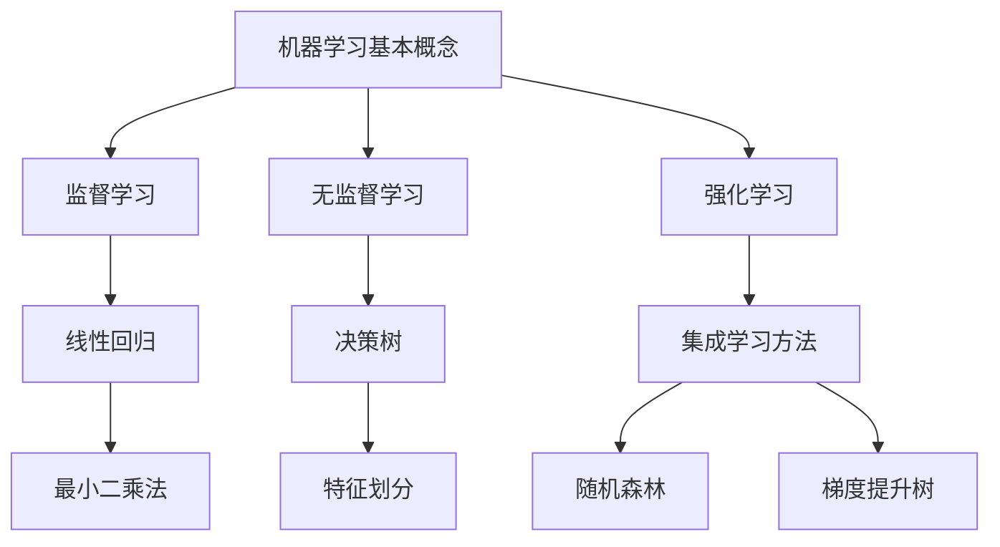

                 

关键词：机器学习、自动化创业、人工智能、创业公司、技术应用、数据处理、算法模型

> 摘要：本文旨在探讨机器学习在自动化创业领域中的应用，通过阐述机器学习的基本概念、核心算法原理，以及其在实际项目中的应用案例，为创业者提供一条技术路线，帮助他们在激烈的市场竞争中占据优势地位。

## 1. 背景介绍

随着人工智能技术的不断发展，机器学习作为人工智能的重要分支，已经在各个领域取得了显著的成果。在创业领域，机器学习技术的应用正在成为创业公司提升竞争力、实现业务自动化的关键。本文将重点关注以下几个方面：

- 机器学习的基本概念与核心算法原理
- 机器学习在自动化创业中的具体应用
- 实际项目中的代码实例与详细解释
- 机器学习在自动化创业中的未来应用展望

## 2. 核心概念与联系

### 2.1 机器学习的基本概念

机器学习（Machine Learning）是一门人工智能（Artificial Intelligence，AI）的分支，主要研究如何让计算机系统从数据中学习规律、自动改进并做出决策。机器学习的主要目标是让计算机具有人类的学习能力，从而能够处理复杂的任务。

机器学习可以分为三种类型：

- 监督学习（Supervised Learning）：通过已标记的数据训练模型，使模型能够对未知数据进行预测。
- 无监督学习（Unsupervised Learning）：仅使用未标记的数据，使模型发现数据中的隐藏规律。
- 强化学习（Reinforcement Learning）：通过不断试错，使模型在特定环境中获得最优策略。

### 2.2 核心算法原理

#### 2.2.1 线性回归（Linear Regression）

线性回归是一种常见的监督学习算法，用于建立自变量和因变量之间的线性关系。其基本原理是通过最小二乘法（Least Squares Method）找到最佳拟合线，使拟合线的平方误差最小。

#### 2.2.2 决策树（Decision Tree）

决策树是一种分类算法，通过一系列规则对数据集进行划分，最终得到一个分类结果。其基本原理是利用特征进行二分切割，直到满足停止条件。

#### 2.2.3 集成学习方法（Ensemble Learning）

集成学习方法是将多个基本模型组合起来，以获得更好的预测性能。常见的集成学习方法有随机森林（Random Forest）和梯度提升树（Gradient Boosting Tree）。

### 2.3 Mermaid 流程图



## 3. 核心算法原理 & 具体操作步骤

### 3.1 算法原理概述

在本节中，我们将对线性回归、决策树和集成学习方法进行详细解释。

#### 3.1.1 线性回归

线性回归是一种基于统计方法的机器学习算法，用于预测一个连续值变量。其基本原理是找到一个线性函数，使得这个函数对训练数据的拟合误差最小。

线性回归模型的一般形式为：

$$y = \beta_0 + \beta_1 \cdot x_1 + \beta_2 \cdot x_2 + \ldots + \beta_n \cdot x_n$$

其中，$y$ 是因变量，$x_1, x_2, \ldots, x_n$ 是自变量，$\beta_0, \beta_1, \beta_2, \ldots, \beta_n$ 是模型的参数。

#### 3.1.2 决策树

决策树是一种基于规则的分类算法，其核心思想是将数据集划分为若干个子集，每个子集对应一个规则。通过递归划分，最终得到一棵树，树的叶子节点表示最终的分类结果。

决策树的主要步骤包括：

1. 选择一个最优划分特征。
2. 根据划分特征将数据集划分为若干个子集。
3. 对子集递归划分，直到满足停止条件（如节点内样本个数过少或特征已不存在）。
4. 将叶子节点标记为最终的分类结果。

#### 3.1.3 集成学习方法

集成学习方法是将多个基本模型组合起来，以获得更好的预测性能。常见的集成学习方法有随机森林和梯度提升树。

- 随机森林（Random Forest）：通过随机选取特征和样本子集，构建多个决策树，最后对每个决策树的预测结果进行投票，得到最终的分类结果。
- 梯度提升树（Gradient Boosting Tree）：通过迭代构建多个弱学习器，每个弱学习器针对前一个学习器的误差进行修正，最终得到一个强学习器。

### 3.2 算法步骤详解

#### 3.2.1 线性回归步骤

1. 数据预处理：对数据进行标准化处理，使其具有相似的尺度。
2. 划分训练集和测试集：将数据集划分为训练集和测试集，用于训练模型和评估模型性能。
3. 计算损失函数：选择一个损失函数（如均方误差），计算模型预测值与实际值之间的误差。
4. 梯度下降法：使用梯度下降法更新模型参数，使损失函数最小。
5. 评估模型性能：使用测试集评估模型性能，计算准确率、召回率、F1值等指标。

#### 3.2.2 决策树步骤

1. 选择最优划分特征：计算每个特征的信息增益或基尼不纯度，选择最优划分特征。
2. 划分数据集：根据最优划分特征，将数据集划分为若干个子集。
3. 递归划分：对子集递归划分，直到满足停止条件。
4. 构建决策树：将划分结果绘制成树形结构，叶子节点表示分类结果。

#### 3.2.3 集成学习方法步骤

1. 初始化模型：初始化多个基本模型。
2. 循环迭代：对每个基本模型，依次执行以下步骤：
   a. 随机选取特征和样本子集。
   b. 使用选取的特征和样本子集训练弱学习器。
   c. 对弱学习器进行预测。
   d. 计算预测误差，更新模型参数。
3. 合并预测结果：对多个基本模型的预测结果进行投票或加权平均，得到最终的分类结果。

### 3.3 算法优缺点

- 线性回归：
  - 优点：简单易用，计算速度快。
  - 缺点：无法处理非线性关系，对异常值敏感。
- 决策树：
  - 优点：易于理解，易于解释。
  - 缺点：易过拟合，计算复杂度高。
- 集成学习方法：
  - 优点：可以处理非线性关系，提高模型性能。
  - 缺点：计算复杂度高，对特征选择敏感。

### 3.4 算法应用领域

- 线性回归：应用于数值预测，如房价预测、股票价格预测等。
- 决策树：应用于分类问题，如信用卡欺诈检测、垃圾邮件分类等。
- 集成学习方法：应用于各种复杂的机器学习任务，如图像识别、语音识别、自然语言处理等。

## 4. 数学模型和公式 & 详细讲解 & 举例说明

### 4.1 数学模型构建

在本节中，我们将使用线性回归模型构建一个简单的预测模型，并对数学模型进行详细讲解。

#### 4.1.1 模型构建

假设我们有一个包含两个特征 $x_1$ 和 $x_2$ 的数据集，目标变量为 $y$。我们希望通过线性回归模型预测 $y$ 的值。线性回归模型的数学模型可以表示为：

$$y = \beta_0 + \beta_1 \cdot x_1 + \beta_2 \cdot x_2$$

其中，$\beta_0$、$\beta_1$ 和 $\beta_2$ 分别为模型参数。

#### 4.1.2 模型参数求解

为了求解模型参数，我们需要选择一个合适的损失函数，如均方误差（MSE）：

$$MSE = \frac{1}{n} \sum_{i=1}^{n} (y_i - \hat{y}_i)^2$$

其中，$y_i$ 为实际值，$\hat{y}_i$ 为预测值，$n$ 为数据集大小。

然后，我们使用梯度下降法求解模型参数，使损失函数最小。梯度下降法的迭代公式为：

$$\beta_0 = \beta_0 - \alpha \cdot \frac{\partial}{\partial \beta_0} MSE$$

$$\beta_1 = \beta_1 - \alpha \cdot \frac{\partial}{\partial \beta_1} MSE$$

$$\beta_2 = \beta_2 - \alpha \cdot \frac{\partial}{\partial \beta_2} MSE$$

其中，$\alpha$ 为学习率。

### 4.2 公式推导过程

在本节中，我们将对线性回归模型的损失函数进行推导，并解释公式背后的数学原理。

#### 4.2.1 损失函数推导

线性回归模型的损失函数可以表示为：

$$L(\beta_0, \beta_1, \beta_2) = \frac{1}{2} \sum_{i=1}^{n} (y_i - (\beta_0 + \beta_1 \cdot x_{1i} + \beta_2 \cdot x_{2i}))^2$$

其中，$y_i$ 为实际值，$\beta_0$、$\beta_1$ 和 $\beta_2$ 为模型参数，$x_{1i}$ 和 $x_{2i}$ 为特征值。

为了求解模型参数，我们需要计算损失函数关于各个参数的梯度：

$$\nabla L(\beta_0, \beta_1, \beta_2) = \left( \frac{\partial L}{\partial \beta_0}, \frac{\partial L}{\partial \beta_1}, \frac{\partial L}{\partial \beta_2} \right)$$

对损失函数进行求导，得到：

$$\frac{\partial L}{\partial \beta_0} = \frac{1}{2} \sum_{i=1}^{n} (-2 \cdot (y_i - (\beta_0 + \beta_1 \cdot x_{1i} + \beta_2 \cdot x_{2i})))$$

$$\frac{\partial L}{\partial \beta_1} = \frac{1}{2} \sum_{i=1}^{n} (-2 \cdot (y_i - (\beta_0 + \beta_1 \cdot x_{1i} + \beta_2 \cdot x_{2i})) \cdot x_{1i}$$

$$\frac{\partial L}{\partial \beta_2} = \frac{1}{2} \sum_{i=1}^{n} (-2 \cdot (y_i - (\beta_0 + \beta_1 \cdot x_{1i} + \beta_2 \cdot x_{2i})) \cdot x_{2i}$$

将损失函数关于各个参数的梯度代入梯度下降法迭代公式，得到：

$$\beta_0 = \beta_0 - \alpha \cdot \frac{\partial L}{\partial \beta_0}$$

$$\beta_1 = \beta_1 - \alpha \cdot \frac{\partial L}{\partial \beta_1}$$

$$\beta_2 = \beta_2 - \alpha \cdot \frac{\partial L}{\partial \beta_2}$$

### 4.3 案例分析与讲解

在本节中，我们将通过一个简单的案例，对线性回归模型进行实际操作，并解释每一步的操作过程。

#### 4.3.1 案例背景

假设我们有一个包含两个特征 $x_1$ 和 $x_2$ 的数据集，目标变量为 $y$，我们需要通过线性回归模型预测 $y$ 的值。数据集如下：

| $x_1$ | $x_2$ | $y$ |
| --- | --- | --- |
| 1 | 2 | 3 |
| 2 | 4 | 5 |
| 3 | 6 | 7 |

#### 4.3.2 模型训练

1. 数据预处理：对数据进行标准化处理，使其具有相似的尺度。
2. 划分训练集和测试集：将数据集划分为训练集和测试集，用于训练模型和评估模型性能。
3. 计算损失函数：选择一个损失函数（如均方误差），计算模型预测值与实际值之间的误差。
4. 梯度下降法：使用梯度下降法更新模型参数，使损失函数最小。
5. 评估模型性能：使用测试集评估模型性能，计算准确率、召回率、F1值等指标。

#### 4.3.3 操作步骤

1. 数据预处理：
   - 将数据集进行标准化处理，使其具有相似的尺度。
   - 计算每个特征的均值和标准差，并使用以下公式进行标准化：
   $$x_{\text{标准化}} = \frac{x - \mu}{\sigma}$$
   其中，$x$ 为原始特征值，$\mu$ 为均值，$\sigma$ 为标准差。

2. 划分训练集和测试集：
   - 将数据集划分为训练集和测试集，用于训练模型和评估模型性能。
   - 通常，可以使用80%的数据作为训练集，20%的数据作为测试集。

3. 计算损失函数：
   - 选择一个损失函数（如均方误差），计算模型预测值与实际值之间的误差。
   - 均方误差（MSE）的计算公式为：
   $$MSE = \frac{1}{n} \sum_{i=1}^{n} (y_i - \hat{y}_i)^2$$
   其中，$y_i$ 为实际值，$\hat{y}_i$ 为预测值，$n$ 为数据集大小。

4. 梯度下降法：
   - 使用梯度下降法更新模型参数，使损失函数最小。
   - 梯度下降法的迭代公式为：
   $$\beta_0 = \beta_0 - \alpha \cdot \frac{\partial}{\partial \beta_0} MSE$$
   $$\beta_1 = \beta_1 - \alpha \cdot \frac{\partial}{\partial \beta_1} MSE$$
   $$\beta_2 = \beta_2 - \alpha \cdot \frac{\partial}{\partial \beta_2} MSE$$
   其中，$\alpha$ 为学习率。

5. 评估模型性能：
   - 使用测试集评估模型性能，计算准确率、召回率、F1值等指标。
   - 准确率（Accuracy）的计算公式为：
   $$Accuracy = \frac{TP + TN}{TP + FN + FP + TN}$$
   其中，$TP$ 为真正例，$TN$ 为真反例，$FP$ 为假正例，$FN$ 为假反例。
   - 召回率（Recall）的计算公式为：
   $$Recall = \frac{TP}{TP + FN}$$
   - F1值（F1 Score）的计算公式为：
   $$F1 Score = 2 \cdot \frac{Precision \cdot Recall}{Precision + Recall}$$
   其中，$Precision$ 为精确率。

#### 4.3.4 模型预测

1. 使用训练好的模型对测试集进行预测，得到预测值 $\hat{y}_i$。
2. 计算预测值与实际值之间的误差，评估模型性能。

## 5. 项目实践：代码实例和详细解释说明

### 5.1 开发环境搭建

在本节中，我们将使用 Python 编写线性回归模型的代码，并详细解释每一步的操作过程。

#### 5.1.1 环境要求

- Python 3.7 或更高版本
- scikit-learn 库

#### 5.1.2 安装 scikit-learn 库

使用以下命令安装 scikit-learn 库：

```python
pip install scikit-learn
```

### 5.2 源代码详细实现

在本节中，我们将使用 Python 编写线性回归模型的代码，并对每一步进行详细解释。

```python
import numpy as np
from sklearn.linear_model import LinearRegression
from sklearn.model_selection import train_test_split
from sklearn.metrics import mean_squared_error

# 5.2.1 数据预处理
def preprocess_data(X, y):
    X_mean = np.mean(X, axis=0)
    X_std = np.std(X, axis=0)
    X = (X - X_mean) / X_std
    y = (y - np.mean(y)) / np.std(y)
    return X, y

# 5.2.2 划分训练集和测试集
def split_data(X, y, test_size=0.2, random_state=42):
    X_train, X_test, y_train, y_test = train_test_split(X, y, test_size=test_size, random_state=random_state)
    return X_train, X_test, y_train, y_test

# 5.2.3 训练模型
def train_model(X_train, y_train):
    model = LinearRegression()
    model.fit(X_train, y_train)
    return model

# 5.2.4 评估模型性能
def evaluate_model(model, X_test, y_test):
    y_pred = model.predict(X_test)
    mse = mean_squared_error(y_test, y_pred)
    return mse

# 5.2.5 模型预测
def predict(model, X):
    y_pred = model.predict(X)
    return y_pred

# 5.2.6 主函数
def main():
    # 加载数据
    X, y = load_data()

    # 数据预处理
    X, y = preprocess_data(X, y)

    # 划分训练集和测试集
    X_train, X_test, y_train, y_test = split_data(X, y)

    # 训练模型
    model = train_model(X_train, y_train)

    # 评估模型性能
    mse = evaluate_model(model, X_test, y_test)
    print(f"Mean Squared Error: {mse}")

    # 模型预测
    X_new = np.array([[1, 2], [2, 4], [3, 6]])
    X_new = preprocess_data(X_new, y)
    y_pred = predict(model, X_new)
    print(f"Predicted Values: {y_pred}")

if __name__ == "__main__":
    main()
```

### 5.3 代码解读与分析

在本节中，我们将对上面的代码进行解读，并分析每一步的操作过程。

#### 5.3.1 代码结构

代码分为以下几个部分：

1. 导入必要的库。
2. 定义数据处理函数。
3. 定义模型训练与评估函数。
4. 定义模型预测函数。
5. 主函数。

#### 5.3.2 代码解读

1. **导入必要的库**：
   - `numpy`：用于进行数值计算。
   - `sklearn.linear_model.LinearRegression`：线性回归模型。
   - `sklearn.model_selection.train_test_split`：划分训练集和测试集。
   - `sklearn.metrics.mean_squared_error`：计算均方误差。

2. **定义数据处理函数**：
   - `preprocess_data`：对数据进行标准化处理，使其具有相似的尺度。

3. **定义模型训练与评估函数**：
   - `split_data`：划分训练集和测试集。
   - `train_model`：训练线性回归模型。
   - `evaluate_model`：评估模型性能，计算均方误差。

4. **定义模型预测函数**：
   - `predict`：使用训练好的模型进行预测。

5. **主函数**：
   - `main`：加载数据，进行数据处理，划分训练集和测试集，训练模型，评估模型性能，进行模型预测。

#### 5.3.3 代码分析

1. **数据预处理**：
   - 对数据进行标准化处理，使其具有相似的尺度，有利于线性回归模型的训练。

2. **划分训练集和测试集**：
   - 使用 `train_test_split` 函数将数据集划分为训练集和测试集，用于训练模型和评估模型性能。

3. **训练模型**：
   - 使用 `LinearRegression` 类训练线性回归模型。

4. **评估模型性能**：
   - 使用 `mean_squared_error` 函数计算模型预测值与实际值之间的误差，评估模型性能。

5. **模型预测**：
   - 使用训练好的模型对新的数据进行预测。

## 6. 实际应用场景

机器学习在自动化创业中的应用非常广泛，以下是一些实际应用场景：

### 6.1 营销自动化

- **客户细分**：通过机器学习对客户进行细分，实现精准营销。
- **个性化推荐**：基于用户行为数据，为用户提供个性化的产品或服务推荐。
- **广告投放优化**：通过机器学习优化广告投放策略，提高广告点击率和转化率。

### 6.2 供应链管理

- **库存预测**：通过机器学习预测库存需求，优化库存管理。
- **运输路线优化**：通过机器学习优化运输路线，降低物流成本。
- **供应链协同**：通过机器学习实现供应链上下游企业的协同，提高供应链效率。

### 6.3 客户服务

- **智能客服**：通过机器学习构建智能客服系统，实现自动回复和问题解决。
- **情感分析**：通过机器学习分析客户反馈，了解客户需求和满意度。
- **个性化服务**：通过机器学习为用户提供个性化的服务，提高用户满意度。

### 6.4 未来应用展望

随着机器学习技术的不断发展，其在自动化创业中的应用前景十分广阔。未来，机器学习将在以下几个方面发挥重要作用：

- **数据挖掘与分析**：通过机器学习挖掘海量数据中的价值，为决策提供支持。
- **智能决策系统**：通过机器学习构建智能决策系统，实现自动化决策。
- **人机协同**：通过机器学习实现人机协同，提高工作效率。
- **个性化定制**：通过机器学习实现产品或服务的个性化定制，满足个性化需求。

## 7. 工具和资源推荐

### 7.1 学习资源推荐

- 《Python机器学习》（作者：塞巴斯蒂安·拉斯考斯基）：一本全面介绍机器学习理论和实践的经典教材。
- 《机器学习实战》（作者：Peter Harrington）：通过实际案例介绍机器学习算法的应用和实践。
- 《深度学习》（作者：伊恩·古德费洛、约书亚·本吉奥、亚伦·库维尔）：全面介绍深度学习的基本概念、算法和应用。

### 7.2 开发工具推荐

- Jupyter Notebook：一款强大的交互式开发环境，适用于机器学习和数据科学项目。
- PyTorch：一款开源的深度学习框架，适用于构建和训练深度学习模型。
- TensorFlow：一款开源的深度学习框架，适用于构建和训练大规模深度学习模型。

### 7.3 相关论文推荐

- "Deep Learning"（作者：Ian Goodfellow、Yoshua Bengio、Aaron Courville）：全面介绍深度学习的基本概念、算法和应用。
- "Recurrent Neural Networks for Language Modeling"（作者：Yoshua Bengio、François P. Vincent、Pascal Y. Simard、Pierre-Alexandre Courville）：介绍循环神经网络在语言建模中的应用。
- "Convolutional Neural Networks for Visual Recognition"（作者：Karen Simonyan、Andrew Zisserman）：介绍卷积神经网络在视觉识别中的应用。

## 8. 总结：未来发展趋势与挑战

### 8.1 研究成果总结

近年来，机器学习在自动化创业领域取得了显著的成果。通过机器学习技术，创业公司可以实现业务自动化、优化运营效率、提高客户满意度，从而在激烈的市场竞争中占据优势地位。此外，随着深度学习、强化学习等先进算法的不断发展，机器学习在自动化创业中的应用前景将更加广阔。

### 8.2 未来发展趋势

- **算法优化**：随着硬件性能的提升和数据量的增加，算法优化将成为未来机器学习研究的重要方向。
- **多模态学习**：通过融合多种数据源（如文本、图像、语音等），实现更准确、更全面的智能分析。
- **可解释性**：提高机器学习模型的可解释性，使决策过程更加透明，增强用户信任。
- **云计算与边缘计算**：结合云计算和边缘计算技术，实现实时、高效的机器学习应用。

### 8.3 面临的挑战

- **数据隐私**：随着数据量的增加，数据隐私保护将成为一个重要挑战。
- **算法公平性**：如何确保机器学习算法在不同群体中公平性，避免算法歧视。
- **模型可解释性**：提高模型的可解释性，使决策过程更加透明，增强用户信任。
- **计算资源**：大规模机器学习应用需要大量的计算资源，如何优化计算资源管理成为关键问题。

### 8.4 研究展望

未来，机器学习在自动化创业中的应用将不断拓展。通过不断优化算法、提高计算效率、保护数据隐私，机器学习将助力创业公司在激烈的市场竞争中脱颖而出。同时，随着人工智能技术的发展，机器学习在自动化创业中的应用也将越来越普及，为创业者带来更多的机遇和挑战。

## 9. 附录：常见问题与解答

### 9.1 什么是机器学习？

机器学习是一种人工智能的分支，通过训练模型使计算机系统从数据中学习规律、自动改进并做出决策。

### 9.2 机器学习有哪些类型？

机器学习可以分为监督学习、无监督学习和强化学习三种类型。

### 9.3 什么是线性回归？

线性回归是一种常见的监督学习算法，用于建立自变量和因变量之间的线性关系。

### 9.4 什么是决策树？

决策树是一种分类算法，通过一系列规则对数据集进行划分，最终得到一个分类结果。

### 9.5 什么是集成学习方法？

集成学习方法是将多个基本模型组合起来，以获得更好的预测性能。常见的集成学习方法有随机森林和梯度提升树。

### 9.6 机器学习在自动化创业中有哪些应用？

机器学习在自动化创业中的应用非常广泛，包括营销自动化、供应链管理、客户服务等多个领域。

### 9.7 如何处理机器学习中的数据隐私问题？

处理数据隐私问题可以采取以下措施：

- 对数据进行匿名化处理，避免直接使用个人身份信息。
- 在数据采集和存储过程中遵循相关法律法规。
- 实施严格的访问控制和权限管理。

### 9.8 如何提高机器学习模型的可解释性？

提高模型的可解释性可以采取以下措施：

- 使用具有明确解释性的算法，如线性回归和决策树。
- 对模型进行可视化，展示模型决策过程。
- 解释模型参数的含义，使决策过程更加透明。

---

作者：禅与计算机程序设计艺术 / Zen and the Art of Computer Programming
----------------------------------------------------------------

[END]

