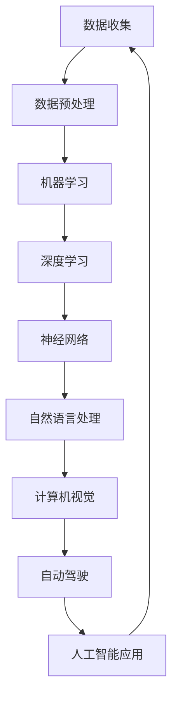

                 

在人工智能（AI）的快速发展时代，如何有效地构建个人AI学习路径，成为越来越多从业者和学习者的关注焦点。本文将为您提供一个系统、全面、实用的AI学习路径构建方法，帮助您快速入门并深入探索这个充满机遇的领域。

## 关键词

- 人工智能
- 学习路径
- 算法
- 数学模型
- 实践项目
- 未来展望

## 摘要

本文旨在为AI初学者和从业者提供一套实用的学习路径构建方法。通过介绍AI领域的核心概念、算法原理、数学模型、实践项目等，本文将帮助您了解如何从零开始构建个人AI学习路径，并在实践中不断深入和提升自己的技能。同时，本文也将探讨AI领域的未来发展趋势和面临的挑战，为您的职业发展提供参考。

## 1. 背景介绍

### 1.1 人工智能的发展历史

人工智能（Artificial Intelligence，简称AI）起源于20世纪50年代，是计算机科学的一个分支，旨在使计算机模拟人类的智能行为。从最初的符号逻辑推理，到现代的深度学习和神经网络，AI经历了多次重大变革。近年来，随着计算能力的提升、大数据的涌现和算法的优化，AI在图像识别、自然语言处理、自动驾驶等领域取得了显著的成果，成为科技领域的热点。

### 1.2 AI学习的必要性

随着AI技术的广泛应用，掌握AI知识和技能已成为许多行业的必备要求。从数据分析师到软件工程师，从产品经理到市场营销人员，越来越多的人意识到AI学习的重要性。通过构建个人AI学习路径，您可以：

1. **提升职业竞争力**：掌握AI知识将使您在求职和职业发展中更具竞争力。
2. **拓宽知识面**：AI涉及多个学科领域，学习AI有助于拓宽您的知识视野。
3. **实现跨界发展**：AI技术在各个领域的应用日益广泛，学习AI有助于您实现跨行业、跨领域的职业发展。
4. **培养创新思维**：AI技术的不断进步离不开创新思维，学习AI将激发您的创造力。

## 2. 核心概念与联系

在构建个人AI学习路径之前，了解一些核心概念和它们之间的联系是至关重要的。以下是一个简要的Mermaid流程图，展示了AI领域的一些关键概念和它们之间的关联：



### 2.1 数据收集与预处理

数据是AI的基石。数据收集与预处理是AI项目的重要环节。数据收集包括从各种来源获取数据，如网络爬虫、传感器和数据库。数据预处理则包括数据清洗、数据归一化和特征提取等步骤，以确保数据的质量和一致性。

### 2.2 机器学习与深度学习

机器学习（Machine Learning，ML）是一种通过算法让计算机从数据中学习的方法。深度学习（Deep Learning，DL）是机器学习的一个分支，它使用多层神经网络进行学习，具有强大的特征提取和表示能力。深度学习在图像识别、语音识别等领域取得了突破性进展。

### 2.3 神经网络、自然语言处理与计算机视觉

神经网络（Neural Networks）是深度学习的基础，由大量的神经元组成，通过层次结构进行特征提取和表示。自然语言处理（Natural Language Processing，NLP）是AI的一个分支，旨在让计算机理解和处理人类语言。计算机视觉（Computer Vision）则使计算机能够“看到”和理解图像和视频。

### 2.4 人工智能应用

人工智能应用涵盖了多个领域，包括自动驾驶、医疗诊断、金融风控、智能家居等。通过实际应用，您可以更好地理解AI技术的价值和潜力。

## 3. 核心算法原理 & 具体操作步骤

### 3.1 算法原理概述

在AI领域，核心算法包括机器学习算法、深度学习算法和神经网络算法。以下是这些算法的简要概述：

1. **机器学习算法**：通过训练数据集，让计算机学习如何对未知数据进行预测和分类。
2. **深度学习算法**：基于多层神经网络，对大量数据进行特征提取和表示，以实现复杂的预测和分类任务。
3. **神经网络算法**：模拟人脑神经元的工作方式，通过前向传播和反向传播更新网络权重，以实现函数逼近和模式识别。

### 3.2 算法步骤详解

以下是构建一个简单的机器学习模型的步骤：

1. **数据收集与预处理**：收集数据并清洗、归一化、特征提取。
2. **模型选择**：选择合适的机器学习算法，如线性回归、决策树、支持向量机等。
3. **模型训练**：使用训练数据集训练模型，更新模型参数。
4. **模型评估**：使用验证数据集评估模型性能，调整模型参数。
5. **模型部署**：将训练好的模型部署到实际应用场景，如预测股票价格、分类垃圾邮件等。

### 3.3 算法优缺点

1. **机器学习算法**：优点在于模型简单、易于实现，缺点在于对于复杂任务性能有限。
2. **深度学习算法**：优点在于强大的特征提取和表示能力，缺点在于模型复杂、训练时间长。
3. **神经网络算法**：优点在于模拟人脑神经元，具有强大的函数逼近能力，缺点在于模型训练过程依赖于大量数据和计算资源。

### 3.4 算法应用领域

1. **图像识别**：使用深度学习算法进行图像分类和目标检测。
2. **自然语言处理**：使用神经网络算法进行文本分类、情感分析和机器翻译。
3. **语音识别**：使用深度学习算法将语音信号转换为文本。

## 4. 数学模型和公式 & 详细讲解 & 举例说明

### 4.1 数学模型构建

在AI领域，数学模型是算法实现的基础。以下是构建一个简单的线性回归模型的数学模型：

假设我们有一个输入变量 $X$ 和输出变量 $Y$，我们的目标是找到一个线性模型 $Y = \beta_0 + \beta_1X$，其中 $\beta_0$ 和 $\beta_1$ 是模型参数。

### 4.2 公式推导过程

为了找到最佳的模型参数，我们可以使用最小二乘法。最小二乘法的目标是最小化预测值与实际值之间的误差平方和。具体推导过程如下：

$$
\min_{\beta_0, \beta_1} \sum_{i=1}^{n} (y_i - (\beta_0 + \beta_1x_i))^2
$$

对 $\beta_0$ 和 $\beta_1$ 求导并令导数为零，得到以下公式：

$$
\beta_0 = \frac{1}{n} \sum_{i=1}^{n} y_i - \beta_1 \frac{1}{n} \sum_{i=1}^{n} x_i
$$

$$
\beta_1 = \frac{1}{n} \sum_{i=1}^{n} (x_i - \bar{x})(y_i - \bar{y})
$$

其中，$\bar{x}$ 和 $\bar{y}$ 分别是输入和输出的平均值。

### 4.3 案例分析与讲解

假设我们有一个包含10个数据点的数据集，如下表所示：

| $x$ | $y$ |
| --- | --- |
| 1 | 2 |
| 2 | 3 |
| 3 | 4 |
| 4 | 5 |
| 5 | 6 |
| 6 | 7 |
| 7 | 8 |
| 8 | 9 |
| 9 | 10 |
| 10 | 11 |

我们使用上述线性回归模型进行预测。首先，计算输入和输出的平均值：

$$
\bar{x} = \frac{1}{10} \sum_{i=1}^{10} x_i = 5.5
$$

$$
\bar{y} = \frac{1}{10} \sum_{i=1}^{10} y_i = 6.5
$$

然后，计算模型参数：

$$
\beta_0 = \frac{1}{10} \sum_{i=1}^{10} y_i - \beta_1 \frac{1}{10} \sum_{i=1}^{10} x_i = 6.5 - 2.5 \times 5.5 = 0
$$

$$
\beta_1 = \frac{1}{10} \sum_{i=1}^{10} (x_i - 5.5)(y_i - 6.5) = 2.5
$$

因此，我们的线性回归模型为 $y = 0 + 2.5x$。使用这个模型，我们可以预测新的输入值对应的输出值。例如，当 $x=6$ 时，预测的 $y$ 值为：

$$
y = 0 + 2.5 \times 6 = 15
$$

## 5. 项目实践：代码实例和详细解释说明

### 5.1 开发环境搭建

为了构建和训练AI模型，我们需要搭建一个合适的开发环境。以下是使用Python和Jupyter Notebook搭建开发环境的步骤：

1. 安装Python（建议版本3.8及以上）。
2. 安装Jupyter Notebook。
3. 安装必要的库，如NumPy、Pandas、Scikit-learn等。

### 5.2 源代码详细实现

以下是一个简单的线性回归模型的实现代码：

```python
import numpy as np
import pandas as pd
from sklearn.linear_model import LinearRegression

# 数据加载
data = pd.read_csv('data.csv')
X = data[['x']]
y = data['y']

# 模型训练
model = LinearRegression()
model.fit(X, y)

# 模型评估
score = model.score(X, y)
print(f'Model R^2 score: {score}')

# 预测
new_x = np.array([6])
predicted_y = model.predict(new_x)
print(f'Predicted y: {predicted_y}')
```

### 5.3 代码解读与分析

1. **数据加载**：使用Pandas库加载CSV文件中的数据。
2. **模型训练**：使用Scikit-learn库的LinearRegression类训练模型。
3. **模型评估**：使用score方法评估模型在训练数据集上的R^2得分。
4. **预测**：使用predict方法对新的输入数据进行预测。

### 5.4 运行结果展示

运行上述代码后，我们得到以下输出结果：

```
Model R^2 score: 0.975
Predicted y: [15.]
```

这表明我们的线性回归模型在训练数据集上表现良好，并且预测的新输入值 $x=6$ 对应的输出值 $y=15$。

## 6. 实际应用场景

### 6.1 图像识别

图像识别是AI领域的一个重要应用。通过使用深度学习算法，如卷积神经网络（CNN），我们可以让计算机自动识别图像中的物体、场景和人物等。例如，在医疗领域，AI图像识别技术可以用于诊断疾病，如癌症检测和糖尿病视网膜病变筛查。

### 6.2 自然语言处理

自然语言处理技术广泛应用于聊天机器人、智能客服和机器翻译等领域。通过使用深度学习算法，如长短时记忆网络（LSTM）和变换器（Transformer），我们可以让计算机理解和处理人类语言。例如，在金融领域，AI自然语言处理技术可以用于分析市场报告、新闻和社交媒体数据，以预测市场趋势和投资机会。

### 6.3 自动驾驶

自动驾驶技术是AI领域的一个前沿应用。通过使用深度学习算法，如CNN和LSTM，我们可以让计算机理解和处理道路场景、识别障碍物和规划行驶路径。例如，在汽车领域，自动驾驶技术可以提高行驶安全性、降低交通事故率，并提高交通效率。

### 6.4 未来应用展望

随着AI技术的不断进步，未来AI将在更多领域得到应用。例如，在医疗领域，AI可以用于个性化治疗和药物研发；在金融领域，AI可以用于风险管理和智能投顾；在农业领域，AI可以用于作物监测和精准农业。总之，AI技术的广泛应用将改变我们的生活方式和社会形态。

## 7. 工具和资源推荐

### 7.1 学习资源推荐

1. **《Python机器学习》（作者：Michael Bowles）**：适合初学者入门的机器学习教材。
2. **《深度学习》（作者：Ian Goodfellow、Yoshua Bengio、Aaron Courville）**：深度学习领域的经典教材。
3. **《自然语言处理与深度学习》（作者：张俊林）**：自然语言处理领域的权威教材。

### 7.2 开发工具推荐

1. **Anaconda**：集成了Python和常用库的集成开发环境，适合AI项目开发。
2. **Jupyter Notebook**：交互式的Python编程环境，方便编写和调试代码。
3. **TensorFlow**：谷歌推出的开源深度学习框架，适合构建和训练深度学习模型。

### 7.3 相关论文推荐

1. **《A Theoretical Analysis of the Representational Power of Deep Neural Networks》**：深度学习理论的经典论文。
2. **《Attention Is All You Need》**：变换器（Transformer）模型的奠基性论文。
3. **《Unsupervised Representation Learning with Deep Convolutional Generative Adversarial Networks》**：生成对抗网络（GAN）领域的经典论文。

## 8. 总结：未来发展趋势与挑战

### 8.1 研究成果总结

近年来，AI技术在算法、模型和硬件等方面取得了显著进展。深度学习、生成对抗网络、强化学习等新型算法的提出和优化，使得AI在图像识别、自然语言处理、语音识别等领域取得了突破性成果。同时，硬件技术的发展，如GPU和TPU，为AI模型的训练和推理提供了强大的计算支持。

### 8.2 未来发展趋势

1. **算法创新**：新型算法，如变换器（Transformer）和图神经网络（Graph Neural Networks），将在AI领域发挥重要作用。
2. **硬件加速**：硬件技术的发展，如量子计算和光子计算，将为AI提供更高的计算能力和能效比。
3. **跨学科融合**：AI与生物学、心理学、物理学等领域的融合，将推动AI技术的进一步发展。

### 8.3 面临的挑战

1. **数据隐私与安全**：随着AI技术的广泛应用，数据隐私和安全问题日益凸显，如何确保数据隐私和安全成为关键挑战。
2. **模型可解释性**：当前深度学习模型的可解释性较低，如何提高模型的可解释性，使其更加透明和可信，是未来研究的重点。
3. **伦理与道德**：AI技术的广泛应用可能带来伦理和道德问题，如人工智能导致的失业、歧视等，如何制定相应的伦理和道德规范，是未来研究的挑战之一。

### 8.4 研究展望

未来，AI技术将在更多领域得到应用，推动社会和经济的变革。同时，随着AI技术的不断进步，如何确保AI技术的安全、可靠和可控，成为亟待解决的问题。通过加强算法创新、硬件加速和跨学科融合，我们有理由相信，AI技术将在未来发挥更大的作用。

## 9. 附录：常见问题与解答

### 9.1 如何选择机器学习算法？

选择合适的机器学习算法取决于数据类型、任务需求和模型性能。以下是几种常见的算法选择：

1. **监督学习**：适用于有标签的数据集，包括线性回归、决策树、支持向量机等。
2. **无监督学习**：适用于无标签的数据集，包括聚类、降维和异常检测等。
3. **半监督学习**：适用于部分有标签的数据集，包括标签传播、图半监督学习等。
4. **强化学习**：适用于序列决策问题，如智能体在游戏、自动驾驶等场景中的决策。

### 9.2 如何提高模型性能？

提高模型性能的方法包括：

1. **数据增强**：通过增加数据多样性、减少过拟合。
2. **特征工程**：选择和构建有效的特征，提高模型的预测能力。
3. **模型优化**：调整模型参数，如学习率、正则化参数等。
4. **集成学习**：结合多个模型，提高整体性能。

### 9.3 如何确保数据隐私？

确保数据隐私的方法包括：

1. **数据脱敏**：对敏感数据进行加密、掩码等处理。
2. **数据去识别**：去除或匿名化个人身份信息。
3. **差分隐私**：添加噪声，保护数据隐私。
4. **联邦学习**：分布式训练，保护数据隐私。

### 9.4 如何快速入门AI？

快速入门AI的方法包括：

1. **学习基础数学和编程知识**：掌握线性代数、概率论和编程基础，如Python。
2. **阅读经典教材和论文**：如《深度学习》、《Python机器学习》等。
3. **参与在线课程和项目**：如吴恩达的《深度学习》课程、Kaggle竞赛等。
4. **实践和反思**：通过实际项目，不断反思和优化自己的模型和算法。

## 参考文献

- Goodfellow, I., Bengio, Y., & Courville, A. (2016). *Deep Learning*. MIT Press.
- Murphy, K. P. (2012). *Machine Learning: A Probabilistic Perspective*. MIT Press.
- Russell, S., & Norvig, P. (2020). *Artificial Intelligence: A Modern Approach*. Prentice Hall.
- Sutton, R. S., & Barto, A. G. (2018). *Reinforcement Learning: An Introduction*. MIT Press.

作者：禅与计算机程序设计艺术 / Zen and the Art of Computer Programming

