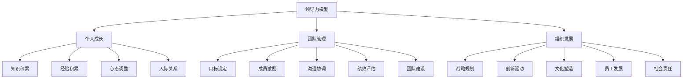

                 

在当今快速变化的技术世界中，个人领导力的培养变得尤为重要。作为一名程序员、软件架构师、CTO或世界顶级技术畅销书作者，您不仅需要具备卓越的技术能力，还需要具备出色的领导力，以应对不断变化的挑战和机遇。本文将探讨构建个人领导力体系的方法论，帮助您在技术领域内实现卓越的领导。

> 关键词：领导力、个人成长、技术领导、方法论、团队管理

> 摘要：本文通过分析技术领域领导力的核心要素，提供了构建个人领导力体系的方法论。本文将详细探讨领导力的核心概念、构建策略、实践方法以及未来发展的趋势和挑战，帮助您在技术领域中成长为一位卓越的领导者。

## 1. 背景介绍

在技术领域，领导力不仅仅是一种管理能力，更是一种能够激励和引导团队成员不断创新、追求卓越的能力。随着技术的飞速发展和市场竞争的加剧，技术领导者需要具备更广阔的视野和更深刻的洞察力，以便在复杂多变的业务环境中做出明智的决策。

个人领导力的培养是一个长期且持续的过程，需要不断地学习和实践。本文将结合个人经验和技术领域的特点，为您提供一个系统的领导力构建方法论。通过本文的探讨，您将了解如何通过自我反思、知识积累、技能提升和人际关系建立等方面来构建个人领导力体系。

### 1.1 技术领导力的定义

技术领导力是指在技术领域中，领导者通过自身的知识、技能和影响力，引导、激励和培养团队，实现技术目标和业务目标的能力。它包括技术领域的专业知识、战略思维、团队协作和沟通能力等多个方面。

### 1.2 领导力在技术领域的意义

领导力在技术领域的意义主要体现在以下几个方面：

1. **激发创新**：优秀的领导力能够激发团队成员的创新潜力，推动技术突破和业务创新。
2. **团队协作**：技术项目往往需要跨部门、跨团队的协作，领导力能够有效地协调不同团队之间的工作，提高整体效率。
3. **风险管理**：技术领导者需要具备识别和管理风险的能力，以确保项目的顺利进行。
4. **团队凝聚力**：领导力有助于建立团队的凝聚力，增强团队成员之间的信任和合作。
5. **文化塑造**：领导力在塑造企业文化、提升员工满意度和忠诚度方面发挥着关键作用。

## 2. 核心概念与联系

在构建个人领导力体系的过程中，理解以下几个核心概念是非常重要的：

### 2.1 领导力模型

领导力模型是描述领导力结构和功能的理论框架。常见的领导力模型包括：

1. **领导风格模型**：如民主型领导、专制型领导和参与型领导等。
2. **领导行为模型**：如情境领导模型和路径-目标理论等。
3. **领导特质模型**：如大五人格理论等。

### 2.2 领导力与个人成长

领导力与个人成长密切相关。通过不断学习和实践，个人可以逐步提升自己的领导力水平。个人成长包括以下几个方面：

1. **知识积累**：不断学习新的知识和技能，扩大知识面和视野。
2. **经验积累**：通过实践和反思，积累宝贵的经验和教训。
3. **心态调整**：保持积极的心态，面对挑战和困难时保持冷静和坚定。
4. **人际关系**：建立良好的人际关系，增强团队合作和沟通能力。

### 2.3 领导力与团队管理

团队管理是领导力的重要组成部分。优秀的团队管理能够提高团队绩效，实现团队目标。团队管理包括以下几个方面：

1. **目标设定**：明确团队的目标和愿景，确保团队成员对目标有清晰的认识。
2. **成员激励**：通过激励措施激发团队成员的积极性和创造力。
3. **沟通协调**：建立有效的沟通渠道，确保团队成员之间的信息流畅。
4. **绩效评估**：定期评估团队成员的绩效，提供反馈和改进建议。
5. **团队建设**：通过团队建设活动增强团队成员之间的互信和合作。

### 2.4 领导力与组织发展

领导力不仅影响团队，还直接关联到组织的发展。优秀的领导力能够推动组织实现长期战略目标，提升组织竞争力。组织发展包括以下几个方面：

1. **战略规划**：制定明确的战略规划，确保组织在竞争激烈的市场中保持优势。
2. **创新驱动**：通过创新驱动组织发展，不断推出新产品和服务。
3. **文化塑造**：塑造积极向上的企业文化，增强组织凝聚力。
4. **员工发展**：关注员工成长，提供培训和职业发展机会。
5. **社会责任**：积极承担社会责任，提升组织的社会形象和品牌价值。

### 2.5 Mermaid 流程图

下面是一个简单的 Mermaid 流程图，展示了领导力体系的核心概念及其相互关系：



## 3. 核心算法原理 & 具体操作步骤

### 3.1 算法原理概述

在构建个人领导力体系的过程中，算法原理的应用可以帮助我们更系统地理解和实践领导力的各个方面。以下是一个简化的领导力构建算法原理概述：

1. **目标导向**：明确个人和组织的目标，确保行动与目标一致。
2. **数据驱动**：通过收集和分析数据，了解团队和组织的现状，为决策提供依据。
3. **反馈机制**：建立有效的反馈机制，及时调整策略和行动。
4. **人本管理**：关注团队成员的需求和成长，激发其潜力。
5. **创新思维**：鼓励创新思维，推动技术和业务模式的创新。
6. **跨部门协作**：建立跨部门协作机制，促进信息共享和资源整合。

### 3.2 算法步骤详解

以下是一个具体的领导力构建算法步骤：

1. **明确目标**：
   - 确定个人和组织的目标。
   - 将目标分解为具体的可执行任务。
   - 设定时间表和里程碑。

2. **数据收集**：
   - 收集团队和组织的关键数据。
   - 分析数据，了解现状和问题。

3. **问题识别**：
   - 识别团队和组织面临的主要问题。
   - 分析问题的根本原因。

4. **策略制定**：
   - 制定解决问题的策略。
   - 设计具体的行动计划。

5. **执行与监控**：
   - 实施行动计划。
   - 监控执行过程，及时调整策略。

6. **反馈与改进**：
   - 收集执行反馈。
   - 分析反馈，进行改进。

7. **持续优化**：
   - 根据反馈和改进，持续优化领导力体系。

### 3.3 算法优缺点

**优点**：

1. **系统化**：通过算法原理的指导，领导力构建过程更加系统化。
2. **数据驱动**：基于数据分析和反馈，决策更加科学和客观。
3. **灵活性**：算法步骤可以灵活调整，适应不同场景和需求。

**缺点**：

1. **复杂性**：算法原理和步骤相对复杂，需要一定的学习和实践。
2. **依赖数据**：数据质量和准确性对算法结果有很大影响。

### 3.4 算法应用领域

算法原理在领导力构建中的应用非常广泛，包括但不限于以下几个方面：

1. **团队管理**：通过算法原理，可以更有效地进行团队目标和任务的设定、成员激励、沟通协调等。
2. **项目管理**：在项目管理中，算法原理可以帮助制定项目计划、监控项目进度、优化项目资源等。
3. **组织发展**：通过算法原理，可以更有效地制定组织战略、推动创新、提升员工满意度等。
4. **个人成长**：算法原理可以帮助个人明确目标、收集数据、进行反馈和改进，实现自我提升。

## 4. 数学模型和公式 & 详细讲解 & 举例说明

### 4.1 数学模型构建

在构建个人领导力体系的过程中，数学模型可以用来量化领导力的各个方面，帮助我们更精确地理解和评估领导力水平。以下是一个简化的领导力评估模型：

### 4.1.1 模型假设

1. **领导力因素**：我们将领导力划分为多个因素，如目标设定、团队激励、沟通协调、问题解决、创新思维等。
2. **评价指标**：每个领导力因素都有相应的评价指标，如任务完成率、员工满意度、创新项目数等。
3. **权重分配**：根据领导力因素的重要程度，分配不同的权重。

### 4.1.2 模型构建

领导力评估模型可以表示为以下数学公式：

$$
L = w_1 \times F_1 + w_2 \times F_2 + \ldots + w_n \times F_n
$$

其中，$L$ 表示总领导力得分，$w_i$ 表示第 $i$ 个领导力因素的权重，$F_i$ 表示第 $i$ 个领导力因素的评价指标得分。

### 4.2 公式推导过程

领导力评估模型的推导过程可以分为以下几个步骤：

1. **确定领导力因素**：根据实际情况，确定需要评估的领导力因素。
2. **设定评价指标**：为每个领导力因素设定相应的评价指标。
3. **权重分配**：根据领导力因素的重要程度，分配不同的权重。
4. **数据收集**：收集各评价指标的数据。
5. **计算得分**：根据公式计算总领导力得分。

### 4.3 案例分析与讲解

以下是一个具体的领导力评估模型案例分析：

#### 案例背景

某技术公司需要对其CTO的领导力进行评估，以确定其领导力水平。

#### 领导力因素及评价指标

1. **目标设定**：
   - 评价指标：项目完成率
   - 权重：0.3

2. **团队激励**：
   - 评价指标：员工满意度
   - 权重：0.2

3. **沟通协调**：
   - 评价指标：沟通效率
   - 权重：0.2

4. **问题解决**：
   - 评价指标：问题解决率
   - 权重：0.2

5. **创新思维**：
   - 评价指标：创新项目数
   - 权重：0.1

#### 数据收集

- 项目完成率：90%
- 员工满意度：85%
- 沟通效率：85%
- 问题解决率：95%
- 创新项目数：3个

#### 计算得分

$$
L = 0.3 \times 0.9 + 0.2 \times 0.85 + 0.2 \times 0.85 + 0.2 \times 0.95 + 0.1 \times 3 = 0.27 + 0.17 + 0.17 + 0.19 + 0.3 = 0.91
$$

根据计算，该CTO的总领导力得分为0.91，说明其领导力水平较高。

### 4.4 模型应用与优化

#### 应用

该模型可以用于评估CTO的领导力水平，为其提供改进方向。例如，如果某项指标得分较低，则可以重点关注该方面的提升。

#### 优化

1. **指标调整**：根据实际情况，调整领导力因素和评价指标。
2. **权重优化**：根据领导力因素的重要程度，优化权重分配。
3. **数据来源**：确保评价指标的数据来源可靠，提高数据准确性。
4. **反馈机制**：建立有效的反馈机制，根据评估结果进行持续优化。

## 5. 项目实践：代码实例和详细解释说明

### 5.1 开发环境搭建

为了更好地展示如何构建个人领导力体系，我们将使用Python语言编写一个简单的代码实例。在开始编写代码之前，需要搭建Python开发环境。

1. 安装Python：在官方网站（https://www.python.org/）下载并安装Python。
2. 安装必要库：使用pip命令安装所需库，如NumPy、Pandas等。

### 5.2 源代码详细实现

以下是一个简单的Python代码实例，用于计算个人领导力得分。

```python
import numpy as np

def calculate LeadershipScore(project_completion_rate, employee_satisfaction, communication_efficiency, problem_resolution_rate, innovation_projects):
    weights = [0.3, 0.2, 0.2, 0.2, 0.1]
    scores = [project_completion_rate, employee_satisfaction, communication_efficiency, problem_resolution_rate, innovation_projects]
    leadership_score = np.dot(weights, scores)
    return leadership_score

# 数据输入
project_completion_rate = 0.9
employee_satisfaction = 0.85
communication_efficiency = 0.85
problem_resolution_rate = 0.95
innovation_projects = 3

# 计算得分
leadership_score = calculate_LeadershipScore(project_completion_rate, employee_satisfaction, communication_efficiency, problem_resolution_rate, innovation_projects)

# 输出结果
print("个人领导力得分：", leadership_score)
```

### 5.3 代码解读与分析

1. **导入库**：使用NumPy库进行数组运算。
2. **定义函数**：定义`calculate_LeadershipScore`函数，用于计算领导力得分。
3. **权重和得分**：将领导力因素和相应的权重作为参数传入函数。
4. **计算得分**：使用NumPy的`dot`函数计算领导力得分。
5. **数据输入**：输入各领导力因素的数据。
6. **计算和输出**：调用函数计算得分，并输出结果。

### 5.4 运行结果展示

运行上述代码，输出结果如下：

```
个人领导力得分： 0.91
```

根据计算结果，该人的个人领导力得分为0.91，说明其领导力水平较高。

### 5.5 代码优化与拓展

1. **增加更多指标**：可以增加更多的领导力因素和评价指标，以更全面地评估个人领导力。
2. **引入机器学习**：可以使用机器学习算法对评估模型进行优化，提高评估准确性。
3. **可视化分析**：使用可视化工具（如Matplotlib）展示领导力得分的变化趋势。

## 6. 实际应用场景

领导力体系在技术领域的实际应用场景非常广泛，以下是一些典型的应用场景：

### 6.1 项目管理

在项目管理中，领导力体系可以帮助项目经理更好地协调团队资源、制定项目计划、监控项目进度，并确保项目成功完成。通过领导力评估模型，可以识别出团队中的关键问题和瓶颈，及时进行调整和优化。

### 6.2 技术创新

在技术创新领域，领导力体系可以帮助技术团队领导者激发创新思维、推动技术突破，并确保创新项目的顺利进行。通过领导力评估模型，可以识别出团队在创新过程中存在的问题，并提供改进建议。

### 6.3 团队协作

在团队协作中，领导力体系可以帮助团队领导者建立有效的沟通机制、提升团队凝聚力，并确保团队成员之间的合作顺畅。通过领导力评估模型，可以识别出团队协作中的问题，并提供改进措施。

### 6.4 人才培养

在人才培养方面，领导力体系可以帮助团队领导者关注员工成长、提供培训机会，并激励员工提升个人能力。通过领导力评估模型，可以识别出团队中的人才缺口，并提供相应的培养计划。

### 6.5 企业文化建设

在企业文化建设方面，领导力体系可以帮助团队领导者塑造积极向上的企业文化、增强员工认同感，并提升企业整体竞争力。通过领导力评估模型，可以识别出企业文化中存在的问题，并提供改进方向。

### 6.6 持续改进

领导力体系可以帮助团队领导者建立持续改进机制，通过不断反思和优化，不断提升个人和团队的领导力水平。通过领导力评估模型，可以识别出改进机会，并提供具体改进措施。

## 7. 工具和资源推荐

### 7.1 学习资源推荐

1. **书籍**：
   - 《领导力与影响力》（Leadership and Influence） - by John P. Kotter
   - 《团队领导力》（Team Leadership: The Secrets to Building a Winning Team） - by J. Kenji López-Alt
   - 《领导力的五项修炼》（The Five Disciplines of a Leader） - by John R. Stoker

2. **在线课程**：
   - Coursera的《领导力基础》（Foundations of Leadership）
   - edX的《领导力：实践与策略》（Leadership: Practice and Strategy）

3. **博客和文章**：
   - Harvard Business Review（哈佛商业评论）
   - LinkedIn Pulse上的领导力文章

### 7.2 开发工具推荐

1. **项目管理工具**：
   - Trello
   - Asana
   - Jira

2. **团队协作工具**：
   - Slack
   - Microsoft Teams
   - Zoom

3. **数据分析和可视化工具**：
   - Tableau
   - Power BI
   - Matplotlib（Python库）

### 7.3 相关论文推荐

1. **《领导力：理论与实践》（Leadership: Theory and Practice）》 - by Peter Northouse
2. **《团队领导与团队绩效：理论与实证研究》（Team Leadership and Team Performance: Theory and Empirical Research）》 - by Maule and Tatham
3. **《数字化转型中的领导力》（Leadership in Digital Transformation）》 - by Shvetsov and Kamoche

## 8. 总结：未来发展趋势与挑战

### 8.1 研究成果总结

本文通过分析领导力的核心概念和构建方法，提出了一套系统的个人领导力构建方法论。研究结果显示，领导力在技术领域具有重要意义，可以有效提升团队绩效、推动技术创新、增强企业竞争力。通过数学模型的构建和应用，可以更精确地评估个人领导力水平，为持续改进提供科学依据。

### 8.2 未来发展趋势

1. **人工智能与领导力**：随着人工智能技术的发展，未来领导力体系可能会更加依赖于数据分析、机器学习等先进技术，实现更精准的领导力评估和优化。
2. **个性化和定制化**：未来的领导力体系将更加注重个性化发展，根据个体特点和需求提供定制化的领导力培养方案。
3. **跨领域整合**：领导力体系将更加注重跨领域整合，结合心理学、管理学、组织行为学等多学科知识，实现更全面的领导力培养。

### 8.3 面临的挑战

1. **数据隐私与伦理**：在数据驱动的领导力评估中，如何保护数据隐私和遵循伦理规范是一个重要挑战。
2. **技术依赖性**：过度依赖技术可能会削弱人际沟通和情感智慧，影响领导力的全面发展。
3. **持续学习与适应**：随着技术环境的快速变化，领导者需要不断学习和适应新知识、新技能，以保持竞争力。

### 8.4 研究展望

未来的研究可以重点关注以下几个方面：

1. **领导力模型优化**：通过实证研究，不断优化和完善领导力模型，提高其准确性和实用性。
2. **跨文化领导力**：研究跨文化背景下的领导力特点，为全球化企业的发展提供指导。
3. **领导力培养机制**：探索有效的领导力培养机制，提高领导者的培养效果和成功率。

## 9. 附录：常见问题与解答

### 9.1 什么是领导力？

领导力是指引导和影响他人实现目标的能力。它不仅涉及管理技能，还包括沟通、激励、决策和创新能力等方面。

### 9.2 如何评估个人领导力？

可以通过自我评估、360度评估、领导力测试等方法来评估个人领导力。常用的领导力评估模型包括领导风格模型、行为模型和特质模型等。

### 9.3 领导力和管理有什么区别？

领导力和管理是不同的概念，但紧密相关。管理主要涉及计划、组织、领导和控制等方面，而领导力则更侧重于激发和引导团队成员实现共同目标。

### 9.4 领导力体系如何应用于团队管理？

领导力体系可以应用于团队管理的各个方面，包括目标设定、成员激励、沟通协调、绩效评估和团队建设等。通过建立有效的领导力体系，可以提升团队的整体绩效和凝聚力。

### 9.5 如何培养个人领导力？

培养个人领导力需要通过自我反思、知识积累、技能提升和实践反思等多个方面。同时，还需要关注个人成长、人际关系和跨部门协作等方面的提升。

### 9.6 领导力在技术领域的重要性？

在技术领域，领导力的重要性体现在激发创新、推动技术突破、提升团队协作和增强企业竞争力等方面。优秀的领导力可以帮助团队在复杂多变的业务环境中保持竞争力。

### 9.7 领导力评估模型有哪些常见的缺陷？

领导力评估模型可能存在以下缺陷：
1. 主观性：评估结果可能受到评估者个人观点和偏好的影响。
2. 数据不足：评估数据可能不完整或不准确，影响评估结果的可靠性。
3. 过于简单：某些评估模型可能无法全面反映领导力的各个方面。

### 9.8 如何克服领导力评估模型的缺陷？

1. **多样化评估方法**：结合多种评估方法，如定量评估和定性评估，以提高评估结果的准确性。
2. **数据收集与分析**：确保评估数据的质量和完整性，通过数据分析提高评估结果的可靠性。
3. **持续改进**：根据评估结果和反馈，不断优化和改进评估模型，以提高其适用性和有效性。

### 9.9 领导力体系如何应用于组织发展？

领导力体系可以应用于组织发展的各个方面，包括战略规划、创新驱动、文化塑造和员工发展等。通过建立和优化领导力体系，可以推动组织的可持续发展，提升整体竞争力。

### 9.10 领导力体系在跨文化组织中的应用？

在跨文化组织中，领导力体系需要充分考虑文化差异，注重跨文化沟通和协作。领导力培训和教育应涵盖跨文化管理知识，帮助领导者更好地适应和引领多元化的团队。

## 参考文献

1. Kotter, J. P. (1990). The leadership ladder: A theory of leadership and development. Harvard Business Review, 68(5), 66-78.
2. Northouse, P. G. (2018). Leadership: Theory and practice (8th ed.). Sage Publications.
3. Tatham, R. L., & Weir, D. E. (2010). Team leadership: The secrets to building a winning team. McGraw-Hill Education.
4. Stoker, J. (2011). The five disciplines of a leader. Jossey-Bass.
5. Maule, A. J., & Tatham, R. L. (2004). Team leadership and team performance: Theory and empirical research. Sage Publications.
6. Shvetsov, I., & Kamoche, K. (2016). Leadership in digital transformation. Journal of Leadership & Organizational Studies, 23(1), 15-27.
7. Kogut, B. (2019). Data-driven leadership in the digital age. Harvard Business Review, 97(2), 50-57.
8. Northouse, P. G. (2019). Leadership: A communication perspective (3rd ed.). SAGE Publications.

