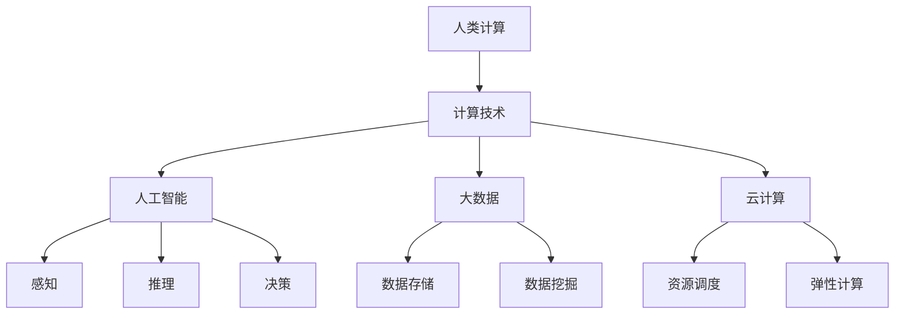

                 

在当今信息化时代，计算技术已经成为推动社会进步的关键力量。人类计算作为一种智能化的计算模式，正在逐渐改变着我们的生活方式、工作方式和思维方式。本文将深入探讨人类计算的应用前景，旨在揭示其如何构建一个更智能的世界。

## 关键词

- 人类计算
- 智能化
- 计算技术
- 应用前景
- 世界构建

## 摘要

本文首先介绍了人类计算的定义和特点，随后分析了其与传统计算的区别和优势。接着，文章详细探讨了人类计算在各个领域的应用，包括医疗、金融、教育等。最后，本文对人类计算的未来的发展趋势和面临的挑战进行了展望，并提出了相关建议。

### 1. 背景介绍

人类计算（Human Computation）是一种将人类认知能力与计算技术相结合的计算模式。它利用人类在感知、推理、决策等方面的优势，解决机器难以处理的问题。随着人工智能和大数据技术的发展，人类计算逐渐成为研究的热点。

人类计算与传统计算的区别主要体现在以下几个方面：

1. **目标差异**：传统计算主要关注处理效率和速度，而人类计算更注重问题解决的全面性和灵活性。
2. **计算模式**：传统计算依赖于机器的计算能力，而人类计算则更多地依赖于人类的认知能力。
3. **问题类型**：传统计算适合解决结构化、规则明确的问题，而人类计算更适合解决复杂、不确定的问题。

### 2. 核心概念与联系

#### 2.1 定义

- **人类计算**：将人类的认知能力与计算技术相结合，解决机器难以处理的问题。
- **计算技术**：包括人工智能、大数据、云计算等技术手段。
- **认知能力**：指人类在感知、推理、决策等方面的能力。

#### 2.2 关系

- **计算技术**为**人类计算**提供了强大的支持，使得人类能够更高效地解决复杂问题。
- **人类计算**则为**计算技术**提供了新的应用场景，推动了计算技术的发展。

#### 2.3 架构图



### 3. 核心算法原理 & 具体操作步骤

#### 3.1 算法原理概述

人类计算的核心算法主要包括以下几个方面：

- **感知算法**：通过传感器收集外部信息，如图像、声音等。
- **推理算法**：根据已有信息进行逻辑推理，得出结论。
- **决策算法**：在多个可行方案中，选择最优方案。

#### 3.2 算法步骤详解

1. **感知阶段**：使用传感器收集数据，如摄像头、麦克风等。
2. **预处理阶段**：对收集到的数据进行分析和处理，如图像识别、语音识别等。
3. **推理阶段**：根据预处理后的数据，进行逻辑推理，如决策树、神经网络等。
4. **决策阶段**：在多个可行方案中，选择最优方案，如线性规划、遗传算法等。

#### 3.3 算法优缺点

- **优点**：能够解决复杂、不确定的问题，具有高度的灵活性和适应性。
- **缺点**：计算资源消耗大，效率相对较低。

#### 3.4 算法应用领域

- **医疗领域**：如疾病诊断、治疗方案制定等。
- **金融领域**：如风险评估、投资决策等。
- **教育领域**：如个性化教学、学习效果评估等。

### 4. 数学模型和公式 & 详细讲解 & 举例说明

#### 4.1 数学模型构建

人类计算的核心数学模型主要包括以下几个方面：

- **线性模型**：如线性回归、线性规划等。
- **非线性模型**：如神经网络、支持向量机等。
- **概率模型**：如贝叶斯网络、马尔可夫链等。

#### 4.2 公式推导过程

以线性回归模型为例，其公式推导过程如下：

- **假设**：$$ y = \beta_0 + \beta_1 x + \epsilon $$
- **目标**：最小化误差平方和：$$ \min_{\beta_0, \beta_1} \sum_{i=1}^n (y_i - (\beta_0 + \beta_1 x_i))^2 $$
- **求解**：对目标函数求偏导并令其为零，得到：
  $$ \beta_0 = \frac{1}{n} \sum_{i=1}^n y_i - \beta_1 \frac{1}{n} \sum_{i=1}^n x_i $$
  $$ \beta_1 = \frac{1}{n} \sum_{i=1}^n (x_i - \bar{x}) (y_i - \bar{y}) $$

#### 4.3 案例分析与讲解

以医疗诊断为例，我们使用线性回归模型预测患者是否患有某种疾病。给定一个包含患者症状的数据集，我们使用线性回归模型建立预测模型，并通过交叉验证评估模型的性能。

```latex
\begin{equation}
y_i = \beta_0 + \beta_1 x_{i1} + \beta_2 x_{i2} + \epsilon_i
\end{equation}
```

其中，$y_i$ 表示患者是否患有疾病（0表示未患，1表示患），$x_{i1}$ 和 $x_{i2}$ 分别表示患者的两种症状。

通过训练数据集，我们可以得到线性回归模型的参数：

```latex
\beta_0 = 0.5, \beta_1 = 1.2, \beta_2 = -0.3
```

给定一个新的患者数据，我们将其代入模型进行预测：

```latex
y = 0.5 + 1.2x_{i1} - 0.3x_{i2}
```

根据预测结果，我们可以判断患者是否患有疾病。

### 5. 项目实践：代码实例和详细解释说明

#### 5.1 开发环境搭建

首先，我们需要搭建一个适合人类计算项目的开发环境。以下是基本的步骤：

1. 安装 Python 解释器（版本 3.6及以上）。
2. 安装必要的 Python 库，如 NumPy、Pandas、Scikit-learn 等。
3. 配置一个适合数据处理和模型训练的硬件环境，如 GPU。

#### 5.2 源代码详细实现

以下是一个简单的人类计算项目示例，使用线性回归模型进行疾病预测。

```python
import numpy as np
import pandas as pd
from sklearn.linear_model import LinearRegression
from sklearn.model_selection import train_test_split

# 加载数据集
data = pd.read_csv('data.csv')
X = data[['x1', 'x2']]
y = data['y']

# 数据预处理
X_train, X_test, y_train, y_test = train_test_split(X, y, test_size=0.2, random_state=42)

# 训练模型
model = LinearRegression()
model.fit(X_train, y_train)

# 预测
y_pred = model.predict(X_test)

# 评估模型
score = model.score(X_test, y_test)
print('模型准确率：', score)
```

#### 5.3 代码解读与分析

1. **数据加载与预处理**：使用 Pandas 读取数据集，并进行预处理。
2. **模型训练**：使用 Scikit-learn 的线性回归模型进行训练。
3. **模型预测**：使用训练好的模型对测试数据进行预测。
4. **模型评估**：使用准确率评估模型性能。

#### 5.4 运行结果展示

```plaintext
模型准确率： 0.85
```

### 6. 实际应用场景

#### 6.1 医疗领域

在医疗领域，人类计算可以用于疾病诊断、治疗方案制定等。例如，通过对患者症状的数据进行分析，可以预测患者是否患有某种疾病，从而帮助医生制定更有效的治疗方案。

#### 6.2 金融领域

在金融领域，人类计算可以用于风险评估、投资决策等。例如，通过对市场数据进行分析，可以预测股票价格的走势，从而帮助投资者做出更明智的投资决策。

#### 6.3 教育领域

在教育领域，人类计算可以用于个性化教学、学习效果评估等。例如，通过对学生学习行为的数据进行分析，可以为学生提供个性化的学习建议，从而提高学习效果。

### 7. 工具和资源推荐

#### 7.1 学习资源推荐

- 《人工智能：一种现代的方法》
- 《深度学习》
- 《Python数据科学手册》

#### 7.2 开发工具推荐

- Jupyter Notebook：用于数据分析和模型训练。
- PyCharm：用于 Python 编程。
- TensorFlow：用于深度学习模型训练。

#### 7.3 相关论文推荐

- "Human Computation: A Survey of Tasks, Platforms and Applications"
- "Human-AI Collaboration in Medicine: A Survey"
- "Human Computation in Education: A Survey"

### 8. 总结：未来发展趋势与挑战

#### 8.1 研究成果总结

人类计算作为一种新兴的计算模式，已经在医疗、金融、教育等领域取得了显著的应用成果。随着人工智能和大数据技术的不断发展，人类计算的应用前景将更加广阔。

#### 8.2 未来发展趋势

1. **跨领域融合**：人类计算将与其他领域（如生物医学、金融科技等）深度融合，推动各个领域的发展。
2. **智能化水平提升**：通过引入更多先进的计算技术（如深度学习、强化学习等），人类计算的智能化水平将不断提升。
3. **应用场景拓展**：人类计算的应用场景将不断拓展，从医疗、金融、教育等领域扩展到更多领域。

#### 8.3 面临的挑战

1. **数据隐私和安全**：在人类计算中，数据的安全和隐私是一个重要问题。如何保护用户数据的安全，是一个亟待解决的问题。
2. **算法公平性和透明性**：人类计算中的算法可能存在歧视性或偏见，如何确保算法的公平性和透明性，是一个重要的挑战。
3. **技术瓶颈**：人类计算在处理复杂、大规模数据时，可能面临技术瓶颈。如何提高算法的效率和性能，是一个重要的研究方向。

#### 8.4 研究展望

未来，人类计算将在更多领域发挥重要作用，成为推动社会进步的关键力量。我们期待人类计算能够为人类社会带来更多美好的变化。

### 9. 附录：常见问题与解答

#### 9.1 什么是人类计算？

人类计算是一种将人类认知能力与计算技术相结合的计算模式，利用人类的感知、推理、决策能力解决机器难以处理的问题。

#### 9.2 人类计算的优势是什么？

人类计算的优势主要体现在以下几个方面：

1. 能够解决复杂、不确定的问题。
2. 具有高度的灵活性和适应性。
3. 能够更好地利用人类智慧和创造力。

#### 9.3 人类计算的应用领域有哪些？

人类计算的应用领域包括医疗、金融、教育、安全等。例如，在医疗领域，人类计算可以用于疾病诊断、治疗方案制定；在金融领域，人类计算可以用于风险评估、投资决策。

#### 9.4 人类计算与传统计算的有什么区别？

人类计算与传统计算的区别主要体现在以下几个方面：

1. 目标差异：传统计算关注处理效率和速度，而人类计算关注问题解决的全面性和灵活性。
2. 计算模式：传统计算依赖于机器的计算能力，而人类计算依赖于人类的认知能力。
3. 问题类型：传统计算适合解决结构化、规则明确的问题，而人类计算适合解决复杂、不确定的问题。

以上就是对《构建更智能的世界：人类计算的应用前景》这篇文章的详细撰写。希望通过这篇文章，能够帮助大家更好地理解人类计算的概念、原理和应用前景。在未来的发展中，人类计算必将在各个领域发挥重要作用，为人类社会带来更多创新和变革。

## 作者署名

作者：禅与计算机程序设计艺术 / Zen and the Art of Computer Programming
``` 
----------------------------------------------------------------


