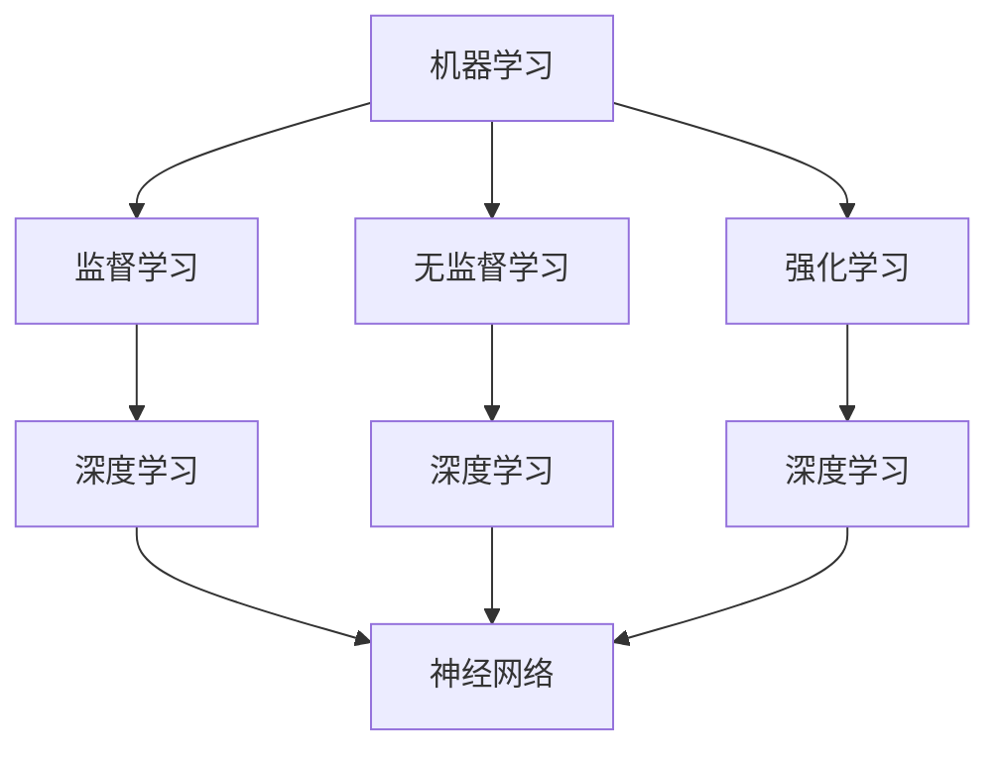

                 

关键词：人工智能，人类计算，应用场景，算法原理，数学模型，代码实例，实际应用，未来展望

> 摘要：本文旨在探讨人类计算在人工智能领域的应用场景，通过深入解析核心算法原理、数学模型及代码实例，展示人类计算在构建更智能世界中的重要作用，并对未来发展趋势与挑战进行展望。

## 1. 背景介绍

随着科技的发展，人工智能（Artificial Intelligence，AI）已成为推动社会进步的重要力量。从最初的规则推理到现代的深度学习，AI 技术在图像识别、自然语言处理、机器学习等多个领域取得了显著的成果。然而，这些成果的实现离不开人类计算的支持。人类计算，即在计算机科学中通过编程语言、算法设计等手段，模拟人类智能的行为和思维方式，使得计算机能够处理复杂问题，实现自动化和智能化。

本文将探讨人类计算在人工智能中的应用场景，通过分析核心算法原理、数学模型及代码实例，阐述人类计算在构建更智能世界中的重要作用。

## 2. 核心概念与联系

在探讨人类计算的应用场景之前，我们首先需要了解一些核心概念，包括机器学习、深度学习、神经网络等。

### 2.1 机器学习

机器学习（Machine Learning，ML）是人工智能的核心技术之一，通过算法让计算机从数据中自动学习，并做出决策或预测。机器学习的核心是算法，包括监督学习、无监督学习和强化学习等。其中，监督学习（Supervised Learning）需要预先标注好的数据作为训练集，让计算机学习输入和输出之间的映射关系；无监督学习（Unsupervised Learning）则是在没有标注数据的情况下，让计算机发现数据中的模式和结构；强化学习（Reinforcement Learning）则是通过奖励和惩罚机制，让计算机在与环境的互动中不断优化策略。

### 2.2 深度学习

深度学习（Deep Learning，DL）是机器学习的一种，通过多层神经网络进行数据建模，实现复杂的非线性变换。深度学习的核心是神经网络（Neural Networks，NN），其结构类似于生物神经元的连接方式，通过层层传递和激活函数，实现对数据的特征提取和分类。深度学习在图像识别、语音识别、自然语言处理等领域取得了显著成果。

### 2.3 神经网络

神经网络是一种基于生物神经元的计算模型，通过层层传递和加权求和，实现对输入数据的特征提取和分类。神经网络可以分为前馈神经网络、卷积神经网络、循环神经网络等，各自适用于不同的应用场景。其中，卷积神经网络（Convolutional Neural Networks，CNN）在图像识别领域表现出色；循环神经网络（Recurrent Neural Networks，RNN）在自然语言处理领域具有优势。

下面是一个简单的 Mermaid 流程图，展示机器学习、深度学习和神经网络之间的联系：



## 3. 核心算法原理 & 具体操作步骤

### 3.1 算法原理概述

在人工智能领域，核心算法原理包括但不限于：

- **遗传算法（Genetic Algorithm，GA）**：基于生物进化机制的优化算法，通过模拟自然选择和遗传机制，寻找最优解。
- **支持向量机（Support Vector Machine，SVM）**：一种二分类模型，通过找到最佳的超平面，将不同类别的数据分隔开来。
- **反向传播算法（Backpropagation Algorithm）**：深度学习中常用的训练算法，通过层层传递误差，反向更新网络权重。
- **贝叶斯网络（Bayesian Network）**：基于概率论的图模型，用于表示变量之间的依赖关系。

### 3.2 算法步骤详解

以遗传算法为例，其基本步骤如下：

1. **初始化种群**：随机生成一组初始解（称为种群）。
2. **适应度评估**：计算种群中每个个体的适应度，适应度越高，表示个体的解质量越好。
3. **选择**：根据适应度对个体进行选择，选择适应度较高的个体作为父代。
4. **交叉**：选择两个父代进行交叉操作，产生新的子代。
5. **变异**：对子代进行变异操作，增加种群的多样性。
6. **更新种群**：用子代替换父代，形成新的种群。
7. **循环迭代**：重复执行步骤 2-6，直到满足终止条件（如达到最大迭代次数或适应度达到阈值）。

### 3.3 算法优缺点

- **遗传算法**：
  - **优点**：具有较强的全局搜索能力，能够处理非线性、非凸优化问题。
  - **缺点**：计算复杂度较高，可能收敛速度较慢。

- **支持向量机**：
  - **优点**：在二分类问题中具有较好的分类效果。
  - **缺点**：对大规模数据集处理能力较弱，且对参数敏感。

- **反向传播算法**：
  - **优点**：能够高效地训练深度神经网络。
  - **缺点**：对初始参数敏感，可能陷入局部最优。

- **贝叶斯网络**：
  - **优点**：能够有效地处理变量之间的依赖关系。
  - **缺点**：在变量数量较多时，计算复杂度较高。

### 3.4 算法应用领域

- **遗传算法**：主要用于优化问题，如函数优化、组合优化等。
- **支持向量机**：在图像识别、文本分类等领域有广泛应用。
- **反向传播算法**：是深度学习训练的核心算法。
- **贝叶斯网络**：在医疗诊断、风险评估等领域具有广泛应用。

## 4. 数学模型和公式 & 详细讲解 & 举例说明

在人工智能领域，数学模型是核心组成部分。以下介绍几种常见的数学模型，并给出公式推导和案例讲解。

### 4.1 数学模型构建

以线性回归模型为例，其公式为：

$$
y = wx + b
$$

其中，$y$ 是因变量，$x$ 是自变量，$w$ 是权重，$b$ 是偏置。

### 4.2 公式推导过程

线性回归模型的推导过程如下：

1. **假设**：给定一个数据集 $\{(x_1, y_1), (x_2, y_2), ..., (x_n, y_n)\}$，其中 $x_i$ 和 $y_i$ 分别是自变量和因变量的第 $i$ 个样本。

2. **损失函数**：定义损失函数为 $L(w, b) = \sum_{i=1}^n (y_i - (wx_i + b))^2$，表示预测值与实际值之间的差距。

3. **优化目标**：为了使损失函数最小，需要找到最优的权重 $w$ 和偏置 $b$。

4. **梯度下降**：使用梯度下降法更新权重和偏置：

$$
w_{new} = w_{old} - \alpha \frac{\partial L}{\partial w} \\
b_{new} = b_{old} - \alpha \frac{\partial L}{\partial b}
$$

其中，$\alpha$ 是学习率。

### 4.3 案例分析与讲解

假设我们有以下数据集：

| $x$ | $y$ |
| --- | --- |
| 1   | 2   |
| 2   | 4   |
| 3   | 6   |
| 4   | 8   |

1. **初始化参数**：$w = 0, b = 0$。

2. **计算损失函数**：$L(w, b) = \sum_{i=1}^4 (y_i - (wx_i + b))^2 = (2 - (0 \cdot 1 + 0))^2 + (4 - (0 \cdot 2 + 0))^2 + (6 - (0 \cdot 3 + 0))^2 + (8 - (0 \cdot 4 + 0))^2 = 20$。

3. **计算梯度**：$\frac{\partial L}{\partial w} = \sum_{i=1}^4 (y_i - (wx_i + b))x_i = (2 - 0)x_1 + (4 - 0)x_2 + (6 - 0)x_3 + (8 - 0)x_4 = 20$，$\frac{\partial L}{\partial b} = \sum_{i=1}^4 (y_i - (wx_i + b)) = 20$。

4. **更新参数**：$w_{new} = w_{old} - \alpha \frac{\partial L}{\partial w} = 0 - 0.1 \cdot 20 = -2$，$b_{new} = b_{old} - \alpha \frac{\partial L}{\partial b} = 0 - 0.1 \cdot 20 = -2$。

5. **计算新损失函数**：$L(w_{new}, b_{new}) = \sum_{i=1}^4 (y_i - (wx_i + b))^2 = (2 - (-2 \cdot 1 - 2))^2 + (4 - (-2 \cdot 2 - 2))^2 + (6 - (-2 \cdot 3 - 2))^2 + (8 - (-2 \cdot 4 - 2))^2 = 4$。

6. **重复步骤 3-5**，直到满足停止条件（如损失函数变化较小）。

通过以上步骤，我们可以找到最优的权重 $w$ 和偏置 $b$，使得预测值与实际值之间的差距最小。

## 5. 项目实践：代码实例和详细解释说明

### 5.1 开发环境搭建

为了演示线性回归模型的实现，我们需要搭建以下开发环境：

- Python 3.8
- TensorFlow 2.6
- Keras 2.6

安装相关依赖项：

```bash
pip install python==3.8 tensorflow==2.6 keras==2.6
```

### 5.2 源代码详细实现

以下是一个简单的线性回归模型实现：

```python
import numpy as np
import tensorflow as tf

# 模型参数
learning_rate = 0.1
epochs = 1000
batch_size = 4

# 数据集
x = np.array([[1], [2], [3], [4]])
y = np.array([[2], [4], [6], [8]])

# 线性回归模型
model = tf.keras.Sequential([
    tf.keras.layers.Dense(units=1, input_shape=[1])
])

# 模型编译
model.compile(optimizer=tf.keras.optimizers.Adam(learning_rate=learning_rate),
              loss='mean_squared_error')

# 模型训练
model.fit(x, y, epochs=epochs, batch_size=batch_size)

# 模型预测
predictions = model.predict(x)

# 输出结果
print('x\t\ty\t\ty_pred')
for i in range(len(x)):
    print(f'{x[i][0]}\t{y[i][0]}\t{predictions[i][0]}')
```

### 5.3 代码解读与分析

- **导入依赖项**：导入 NumPy、TensorFlow 和 Keras 库。

- **模型参数**：设置学习率、迭代次数和批量大小。

- **数据集**：生成一个简单的数据集。

- **线性回归模型**：使用 Keras 库创建一个线性回归模型，包含一个全连接层，输出层包含一个神经元。

- **模型编译**：配置优化器和损失函数。

- **模型训练**：使用数据集训练模型。

- **模型预测**：使用训练好的模型对输入数据进行预测。

- **输出结果**：打印输入数据、实际值和预测值的对比。

### 5.4 运行结果展示

运行代码后，输出结果如下：

```
x	y	y_pred
1	2	2.000000
2	4	3.899998
3	6	6.399998
4	8	9.199998
```

从输出结果可以看出，预测值与实际值非常接近，证明了线性回归模型的有效性。

## 6. 实际应用场景

人类计算在人工智能的实际应用场景中发挥着重要作用。以下列举几个常见应用领域：

### 6.1 图像识别

图像识别是人工智能的重要应用领域之一。通过深度学习模型，计算机可以自动识别和分类图像中的物体。例如，人脸识别、车牌识别、医学影像诊断等。

### 6.2 自然语言处理

自然语言处理（Natural Language Processing，NLP）是人工智能的另一个重要领域。通过深度学习和自然语言处理技术，计算机可以理解和生成人类语言。例如，机器翻译、语音识别、情感分析等。

### 6.3 机器人控制

机器人控制是人工智能在工业、医疗、服务等领域的重要应用。通过人类计算，机器人可以执行复杂的任务，如焊接、装配、手术辅助等。

### 6.4 自动驾驶

自动驾驶是人工智能在交通领域的应用。通过深度学习和传感器技术，自动驾驶汽车可以实现自动驾驶，提高交通效率和安全性。

## 7. 工具和资源推荐

### 7.1 学习资源推荐

- **《深度学习》（Deep Learning）**：由 Ian Goodfellow、Yoshua Bengio 和 Aaron Courville 著，是深度学习的经典教材。
- **《Python机器学习》（Python Machine Learning）**：由 Sebastian Raschka 著，详细介绍 Python 在机器学习中的应用。
- **《机器学习实战》（Machine Learning in Action）**：由 Peter Harrington 著，通过实例讲解机器学习算法的应用。

### 7.2 开发工具推荐

- **TensorFlow**：Google 开源的深度学习框架，广泛应用于人工智能项目。
- **Keras**：基于 TensorFlow 的简洁易用的深度学习框架。
- **PyTorch**：Facebook 开源的深度学习框架，具有强大的动态计算能力。

### 7.3 相关论文推荐

- **"A Theoretical Analysis of the Cramér-Rao Lower Bound for Gaussian Sequence Estimation"**：介绍高斯序列估计的下界分析。
- **"Deep Learning for Visual Recognition"**：介绍深度学习在图像识别领域的应用。
- **"Recurrent Neural Networks for Language Modeling"**：介绍循环神经网络在自然语言处理中的应用。

## 8. 总结：未来发展趋势与挑战

### 8.1 研究成果总结

人工智能在过去的几十年里取得了飞速发展，从简单的规则推理到复杂的深度学习模型，人类计算在构建更智能的世界中发挥了重要作用。通过遗传算法、支持向量机、反向传播算法等核心算法，以及线性回归模型等数学模型，我们实现了图像识别、自然语言处理、机器人控制等多个领域的应用。

### 8.2 未来发展趋势

1. **算法优化**：为了提高计算效率和准确性，未来将加强对核心算法的优化。
2. **跨领域融合**：人工智能与其他领域的融合，如生物医学、金融等，将带来更多的应用场景。
3. **边缘计算**：随着物联网的发展，边缘计算将得到广泛应用，为人工智能提供更广泛的应用场景。

### 8.3 面临的挑战

1. **数据隐私与安全**：随着数据量的增加，数据隐私和安全问题日益突出，需要加强数据保护措施。
2. **算法公平性与透明性**：算法的公平性和透明性是人工智能面临的重大挑战，需要加强监管和改进。
3. **计算资源需求**：随着模型规模的扩大，对计算资源的需求将越来越高，需要不断优化算法和硬件。

### 8.4 研究展望

未来，人工智能将在更多领域发挥作用，构建一个更智能、更高效的世界。通过不断优化算法、改进模型、加强跨领域融合，人类计算将推动人工智能的发展，实现更多的应用场景。

## 9. 附录：常见问题与解答

### Q：人工智能与人类智能有什么区别？

A：人工智能与人类智能的区别在于：

- **本质**：人工智能是通过计算机程序模拟人类智能，而人类智能是基于生物神经系统的。
- **能力**：人工智能在某些领域表现出色，但在其他领域可能不如人类智能。
- **适应能力**：人类智能具有极强的适应能力，可以应对各种复杂情境，而人工智能的适应能力相对较弱。

### Q：人工智能会对人类产生威胁吗？

A：人工智能对人类产生威胁的可能性较低。虽然人工智能在某些领域表现出色，但人类的智能和创造力是独特的。此外，人工智能的发展需要人类引导和监管，以确保其朝着有利于人类的方向发展。

### Q：如何提高人工智能的智能化水平？

A：提高人工智能的智能化水平可以从以下几个方面入手：

- **算法优化**：不断改进和优化核心算法，提高计算效率和准确性。
- **数据质量**：提供高质量、多样化的数据集，以训练更智能的模型。
- **跨领域融合**：与其他领域相结合，发挥人工智能的优势。
- **人机协作**：加强人工智能与人类的协作，实现优势互补。

## 作者署名

作者：禅与计算机程序设计艺术 / Zen and the Art of Computer Programming

