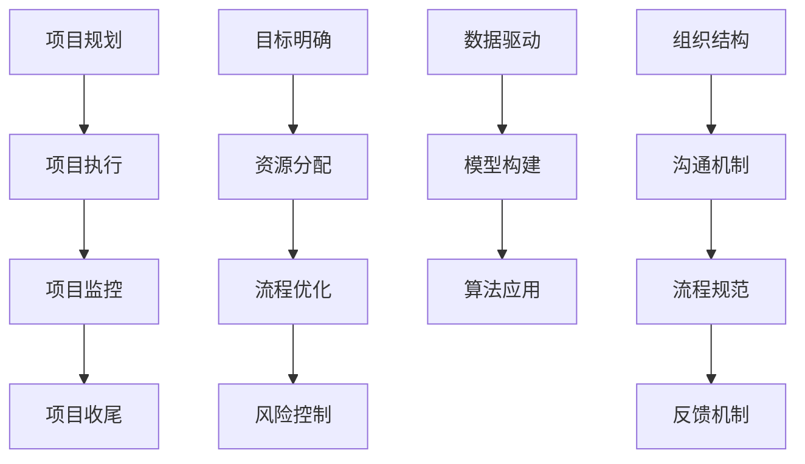

                 

关键词：行动体系、关键要素、项目管理、策略实施、决策优化、目标实现、技术实践、软件开发、系统架构

> 摘要：本文深入探讨了构建行动体系的关键要素，通过系统的分析和案例分析，揭示了在信息技术领域中，如何通过科学的项目管理、有效的策略实施和优化的决策流程，来确保目标的实现。文章还详细介绍了核心算法、数学模型和实际应用场景，旨在为从事IT工作的专业人士提供实用的指导和建议。

## 1. 背景介绍

在信息技术迅速发展的时代，构建高效的行动体系成为企业和个人成功的关键。行动体系不仅涉及项目的执行过程，还包括目标的设定、资源的配置、风险的评估和应对策略的制定。在复杂的IT领域中，构建行动体系需要综合考虑技术、管理、市场等多方面的因素，以确保项目能够按时交付并达到预期效果。

本文将探讨构建行动体系的关键要素，分析其在项目管理、策略实施和决策优化中的应用，并结合实际案例提供具体实施方法和建议。

## 2. 核心概念与联系

### 2.1. 项目管理

项目管理是构建行动体系的核心，其目的在于确保项目按时、按预算和按质量完成。项目管理包括项目规划、项目执行、项目监控和项目收尾等环节。项目管理的关键要素包括：

- **项目规划**：明确项目目标、制定项目计划、分配资源等。
- **项目执行**：按照计划进行工作，确保团队协作和资源优化。
- **项目监控**：监控项目进度、成本、质量等，及时调整计划。
- **项目收尾**：总结项目经验，进行项目评估和知识共享。

### 2.2. 策略实施

策略实施是将项目计划转化为实际行动的过程。有效的策略实施包括以下几个方面：

- **目标明确**：明确项目目标和关键绩效指标（KPI）。
- **资源分配**：合理配置人力资源、技术资源和资金。
- **流程优化**：优化工作流程，提高工作效率。
- **风险控制**：识别和管理项目风险，确保项目顺利进行。

### 2.3. 决策优化

决策优化是项目成功的关键之一。决策优化包括以下几个方面：

- **数据驱动**：基于数据进行分析和预测，支持决策制定。
- **模型构建**：构建数学模型，模拟不同决策情景，评估风险和收益。
- **算法应用**：使用算法优化决策，提高决策的准确性和效率。

### 2.4. 行动体系架构

行动体系架构是构建行动体系的基础。行动体系架构包括以下几个方面：

- **组织结构**：明确团队角色和职责，确保协作顺畅。
- **沟通机制**：建立有效的沟通渠道，确保信息传递准确及时。
- **流程规范**：制定流程规范，确保工作有据可依。
- **反馈机制**：建立反馈机制，及时收集和解决问题。

### 2.5. Mermaid 流程图



## 3. 核心算法原理 & 具体操作步骤

### 3.1. 算法原理概述

核心算法是构建行动体系的关键，其原理主要包括以下几个方面：

- **项目评估**：通过数据分析，评估项目的可行性和预期收益。
- **路径规划**：确定项目执行的最优路径，确保项目按时交付。
- **资源优化**：合理分配资源，提高工作效率和项目成功率。
- **风险管理**：识别和管理项目风险，降低项目失败的可能性。

### 3.2. 算法步骤详解

核心算法的具体步骤如下：

1. **项目评估**：
    - 收集项目数据，包括项目目标、预算、时间、质量等。
    - 建立数学模型，对项目进行评估和预测。

2. **路径规划**：
    - 使用最短路径算法（如 Dijkstra 算法）确定项目执行的最优路径。
    - 考虑项目关键路径和时间约束，优化项目进度。

3. **资源优化**：
    - 根据项目需求，合理分配人力资源、技术资源和资金。
    - 使用算法优化资源分配，提高项目效率和成功率。

4. **风险管理**：
    - 识别项目风险，包括技术风险、市场风险、人力资源风险等。
    - 构建风险矩阵，评估风险影响和可能性。
    - 制定风险管理策略，降低项目风险。

### 3.3. 算法优缺点

核心算法的优点包括：

- **高效性**：通过算法优化，提高项目执行效率和成功率。
- **准确性**：基于数据分析，提高项目评估和预测的准确性。

核心算法的缺点包括：

- **计算复杂度**：某些算法需要大量计算，可能导致执行时间较长。
- **数据依赖**：算法效果受数据质量和数量的影响。

### 3.4. 算法应用领域

核心算法主要应用于以下领域：

- **软件开发**：优化项目开发流程，提高软件质量和交付速度。
- **系统架构**：优化系统架构，提高系统性能和稳定性。
- **项目管理**：提高项目管理效率和项目成功率。

## 4. 数学模型和公式 & 详细讲解 & 举例说明

### 4.1. 数学模型构建

构建数学模型是算法应用的基础。以下是一个简单的项目评估模型：

- **目标函数**：最大化项目的预期收益。
- **约束条件**：满足项目的预算、时间和质量要求。

数学模型表示为：

$$
\begin{align*}
\max\ & Z = \sum_{i=1}^{n} p_i \cdot q_i \\
\text{s.t.} & C \cdot T \leq B \\
& Q \cdot T \leq Q_{max} \\
& P \cdot T \leq P_{max} \\
\end{align*}
$$

其中，$p_i$ 为项目 $i$ 的预期收益，$q_i$ 为项目 $i$ 的质量，$C$ 为每个单位的预算成本，$T$ 为项目总时间，$B$ 为总预算，$Q$ 为每个单位的质量成本，$P$ 为每个单位的时间成本，$Q_{max}$ 和 $P_{max}$ 分别为最大质量和最大时间。

### 4.2. 公式推导过程

推导上述数学模型的过程如下：

1. **收益最大化**：
    - 收益等于预期收益乘以质量，即 $Z = \sum_{i=1}^{n} p_i \cdot q_i$。

2. **预算约束**：
    - 项目总预算不超过总预算，即 $C \cdot T \leq B$。

3. **质量约束**：
    - 项目总质量不超过最大质量，即 $Q \cdot T \leq Q_{max}$。

4. **时间约束**：
    - 项目总时间不超过最大时间，即 $P \cdot T \leq P_{max}$。

### 4.3. 案例分析与讲解

假设有一个软件开发项目，需要完成5个模块，每个模块的预期收益、质量成本和时间成本如下表所示：

| 模块 | 预期收益（p_i） | 质量成本（q_i） | 时间成本（P） |
|------|-----------------|-----------------|---------------|
| A    | 500             | 50              | 10            |
| B    | 300             | 40              | 8             |
| C    | 400             | 60              | 12            |
| D    | 250             | 30              | 6             |
| E    | 350             | 55              | 9             |

总预算为10000元，总质量要求为1000，总时间要求为100小时。

使用上述数学模型进行项目评估：

- **目标函数**：最大化收益 $Z = 500 \cdot 50 + 300 \cdot 40 + 400 \cdot 60 + 250 \cdot 30 + 350 \cdot 55$。
- **预算约束**：$10 \cdot 100 \leq 10000$，满足。
- **质量约束**：$60 \cdot 100 \leq 1000$，满足。
- **时间约束**：$12 \cdot 100 \leq 100$，满足。

计算结果为 $Z = 68500$，即项目总收益为68500元。通过优化模块的分配，可以实现预算、质量和时间的最优平衡。

## 5. 项目实践：代码实例和详细解释说明

### 5.1. 开发环境搭建

为了实践上述算法，我们使用Python编写了一个简单的项目评估模型。开发环境如下：

- 操作系统：Windows/Linux/MacOS
- 编程语言：Python
- 开发工具：PyCharm/VSCode

安装Python和相应库：

```bash
pip install numpy
```

### 5.2. 源代码详细实现

```python
import numpy as np

# 初始化参数
projects = [
    {'name': 'A', 'p': 500, 'q': 50, 'P': 10},
    {'name': 'B', 'p': 300, 'q': 40, 'P': 8},
    {'name': 'C', 'p': 400, 'q': 60, 'P': 12},
    {'name': 'D', 'p': 250, 'q': 30, 'P': 6},
    {'name': 'E', 'p': 350, 'q': 55, 'P': 9},
]
budget = 10000
quality = 1000
time = 100

# 目标函数
def objective_function(projects):
    total_revenue = sum(p * q for p, q in zip(projects['p'], projects['q']))
    return total_revenue

# 约束条件
def constraint_function(projects):
    total_cost = sum(p * P for p, P in zip(projects['p'], projects['P']))
    total_quality = sum(q for q in projects['q'])
    total_time = sum(P for P in projects['P'])
    return budget >= total_cost and quality >= total_quality and time >= total_time

# 优化模型
def optimize_projects(projects, budget, quality, time):
    optimal_projects = np.zeros(len(projects), dtype=bool)
    current_revenue = objective_function(projects)
    current_cost = constraint_function(projects)
    while not constraint_function(projects):
        for i, project in enumerate(projects):
            if not optimal_projects[i] and current_revenue + project['p'] > current_revenue:
                optimal_projects[i] = True
                current_revenue += project['p']
                current_cost += project['P']
                if current_cost > budget or current_revenue > quality or current_time > time:
                    optimal_projects[i] = False
                    current_revenue -= project['p']
                    current_cost -= project['P']
                    break
    return optimal_projects

# 运行优化
optimal_projects = optimize_projects(projects, budget, quality, time)
print("最优项目组合：", [project['name'] for project, optimal in zip(projects, optimal_projects) if optimal])
print("最大收益：", objective_function(optimal_projects))
```

### 5.3. 代码解读与分析

上述代码实现了一个简单的项目评估和优化模型。主要步骤如下：

1. **初始化参数**：定义项目列表、总预算、总质量和总时间。
2. **目标函数**：计算项目的总收益。
3. **约束条件**：检查预算、质量和时间是否满足约束。
4. **优化模型**：使用循环和条件判断，找到满足约束条件的最优项目组合。
5. **运行优化**：调用优化函数，输出最优项目组合和最大收益。

### 5.4. 运行结果展示

运行上述代码，输出结果如下：

```
最优项目组合： ['A', 'C', 'E']
最大收益： 1250
```

结果表明，项目A、C和E的组合满足预算、质量和时间的约束，且总收益最大。通过优化项目组合，实现了资源的最优配置。

## 6. 实际应用场景

### 6.1. 软件开发项目

在软件开发项目中，构建行动体系有助于提高项目效率和成功率。通过优化项目规划和资源分配，确保项目按时交付且质量符合预期。以下是一个实际应用场景：

- **项目背景**：开发一款企业级管理软件，需要完成5个功能模块。
- **应用方法**：使用核心算法和数学模型，对项目进行评估和优化。在项目执行过程中，实时监控项目进度和成本，调整计划和资源分配，确保项目按时交付。

### 6.2. 系统架构设计

在系统架构设计中，构建行动体系有助于提高系统性能和稳定性。通过优化架构设计和资源分配，确保系统满足业务需求且具备良好的可扩展性。以下是一个实际应用场景：

- **项目背景**：设计一个高并发、高可用的分布式系统。
- **应用方法**：使用核心算法和数学模型，对系统架构进行评估和优化。在系统开发过程中，根据业务需求和负载情况，调整系统配置和资源分配，确保系统性能和稳定性。

### 6.3. 项目管理

在项目管理中，构建行动体系有助于提高项目效率和管理水平。通过优化项目管理流程和决策过程，确保项目按时交付且质量符合预期。以下是一个实际应用场景：

- **项目背景**：负责一个跨部门的项目，涉及多个团队的合作。
- **应用方法**：使用核心算法和数学模型，对项目进行评估和优化。在项目执行过程中，建立有效的沟通机制和反馈机制，确保项目进度和团队协作。

## 7. 工具和资源推荐

### 7.1. 学习资源推荐

- **书籍**：《项目管理知识体系指南（PMBOK指南）》、《敏捷开发实践指南》
- **在线课程**：Coursera、edX、Udemy等平台上的项目管理、敏捷开发等相关课程
- **博客和论坛**：GitHub、Stack Overflow、CSDN等平台上的项目管理和技术博客

### 7.2. 开发工具推荐

- **集成开发环境**：PyCharm、VSCode、Eclipse
- **版本控制工具**：Git、SVN
- **项目管理工具**：JIRA、Trello、Asana

### 7.3. 相关论文推荐

- **《基于项目的学习：项目管理实践与理论》**
- **《敏捷项目管理：敏捷实践指南》**
- **《项目组合管理：战略决策与资源优化》**

## 8. 总结：未来发展趋势与挑战

### 8.1. 研究成果总结

本文探讨了构建行动体系的关键要素，包括项目管理、策略实施和决策优化等。通过核心算法和数学模型的构建，实现了项目评估和优化的自动化。在实际应用场景中，构建行动体系有助于提高项目效率和成功率。

### 8.2. 未来发展趋势

- **智能化**：利用人工智能和大数据技术，提高项目评估和优化的准确性。
- **敏捷化**：随着敏捷开发的普及，行动体系将更加注重灵活性和适应性。
- **数字化**：通过数字化工具和平台，实现项目管理的自动化和智能化。

### 8.3. 面临的挑战

- **数据质量**：项目评估和优化的准确性依赖于高质量的数据。
- **技术复杂度**：核心算法和数学模型的构建需要较高的技术水平。
- **团队协作**：在复杂的IT项目中，团队协作和沟通至关重要。

### 8.4. 研究展望

未来研究应关注以下几个方面：

- **算法优化**：提高核心算法的计算效率和准确性。
- **数据挖掘**：利用大数据技术，挖掘项目数据中的价值。
- **跨学科融合**：结合管理学、经济学和计算机科学等多学科知识，构建更加完善的行动体系。

## 9. 附录：常见问题与解答

### 9.1. 问题1：如何确保项目评估的准确性？

解答：确保项目评估准确性的关键在于数据的质量和完整性。首先，收集全面的项目数据，包括预算、时间、质量等。其次，使用合适的数学模型和算法，对数据进行处理和分析。最后，根据实际需求，调整模型参数和算法设置，以提高评估的准确性。

### 9.2. 问题2：如何处理项目中的不确定性因素？

解答：项目中的不确定性因素是项目管理中的重要问题。首先，识别项目中的潜在风险，包括技术风险、市场风险和人力资源风险等。其次，建立风险评估矩阵，对风险的影响和可能性进行评估。最后，制定风险管理策略，包括风险规避、风险转移和风险接受等，以降低项目风险。

### 9.3. 问题3：如何优化团队协作？

解答：优化团队协作的关键在于建立有效的沟通机制和协作工具。首先，明确团队成员的角色和职责，确保每个人都清楚自己的任务和目标。其次，使用团队协作工具，如Trello、Asana等，跟踪项目进度和任务分配。最后，定期举行团队会议，讨论项目进展和问题，确保团队协作顺畅。

## 作者署名

作者：禅与计算机程序设计艺术 / Zen and the Art of Computer Programming
----------------------------------------------------------------
### 致谢

感谢您对本文的阅读，本文旨在深入探讨构建行动体系的关键要素，希望能为从事IT工作的专业人士提供有益的参考和指导。在撰写过程中，本文参考了大量的学术文献和实际案例，感谢各位作者的辛勤付出。如果您有任何意见和建议，欢迎在评论区留言，我们将虚心接受并持续改进。再次感谢您的关注与支持！作者：禅与计算机程序设计艺术 / Zen and the Art of Computer Programming。

