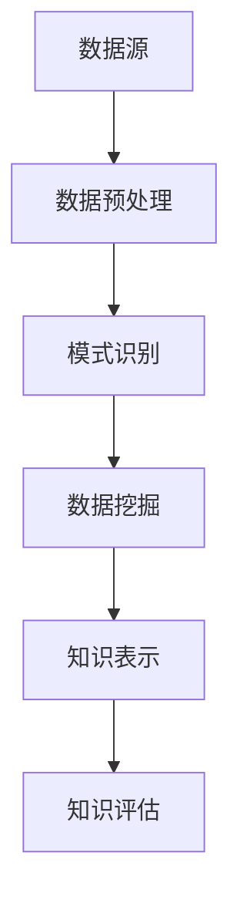

                 

关键词：知识发现系统、程序员实践、高效构建、算法原理、数学模型、项目实践、应用场景、未来展望

> 摘要：本文将探讨知识发现系统的构建，分析其核心概念、算法原理、数学模型以及实际应用，并提供程序员实践指南，帮助读者理解并构建高效的知识发现系统。

## 1. 背景介绍

知识发现系统（Knowledge Discovery in Databases，简称KDD）是一个从大量数据中自动发现有用知识的复杂过程。这一过程通常包括数据清洗、数据整合、数据选择、数据变换、数据建模和结果评估等步骤。随着数据量的急剧增长和大数据技术的发展，构建高效的知识发现系统成为数据处理领域的一项重要任务。

本文旨在为程序员提供构建高效知识发现系统的实践指南，帮助读者理解知识发现的核心概念、算法原理和数学模型，并通过实际项目案例展示其应用。文章将分为以下几个部分：

- **背景介绍**：概述知识发现系统的概念和发展历程。
- **核心概念与联系**：介绍知识发现系统的核心概念及其相互关系，并使用Mermaid流程图进行展示。
- **核心算法原理 & 具体操作步骤**：详细讲解常见的知识发现算法原理及其操作步骤。
- **数学模型和公式 & 详细讲解 & 举例说明**：探讨知识发现相关的数学模型和公式，并通过案例进行分析。
- **项目实践：代码实例和详细解释说明**：提供实际项目的代码实例和详细解释。
- **实际应用场景**：讨论知识发现系统的实际应用场景和未来展望。
- **工具和资源推荐**：推荐学习资源和开发工具。
- **总结：未来发展趋势与挑战**：总结研究成果并探讨未来发展趋势和挑战。

接下来，我们将深入探讨知识发现系统的各个组成部分，帮助程序员构建高效的知识发现系统。

## 2. 核心概念与联系

在构建知识发现系统时，理解其核心概念及其相互关系至关重要。以下是知识发现系统中的核心概念及其相互关系：

- **数据源（Data Source）**：数据源是知识发现系统的起点，包括结构化数据、半结构化数据和非结构化数据。
- **数据预处理（Data Preprocessing）**：数据预处理包括数据清洗、数据整合、数据选择和数据变换等步骤，目的是提高数据质量，为后续分析做准备。
- **模式识别（Pattern Recognition）**：模式识别是从大量数据中发现有意义的模式和规律的过程，是知识发现系统的核心步骤。
- **数据挖掘（Data Mining）**：数据挖掘是模式识别的具体实现，通过使用各种算法来从数据中提取有价值的信息。
- **知识表示（Knowledge Representation）**：知识表示是将挖掘得到的知识以结构化的形式表示出来，便于后续应用。
- **知识评估（Knowledge Evaluation）**：知识评估是对挖掘到的知识进行评估和验证，确保其准确性和实用性。

### Mermaid 流程图

以下是知识发现系统的 Mermaid 流程图：



通过该流程图，我们可以清晰地看到知识发现系统的各个环节及其相互关系。

### 关系解析

- **数据预处理**是知识发现系统的基础，直接影响到后续分析的准确性。数据预处理包括数据清洗（去除噪声和错误）、数据整合（合并多个数据源）、数据选择（选择有用的数据）和数据变换（转换数据格式）。
- **模式识别**和数据挖掘**是知识发现系统的核心。模式识别通过统计学方法、机器学习方法等从数据中发现潜在的模式，而数据挖掘则通过更高级的算法，如关联规则挖掘、聚类分析、分类分析等，从数据中提取有价值的信息。
- **知识表示**是将数据挖掘得到的知识以结构化的形式表示出来，便于后续应用。知识表示的形式可以包括可视化图表、决策树、规则集等。
- **知识评估**是对挖掘到的知识进行评估和验证，确保其准确性和实用性。知识评估可以通过交叉验证、误差分析等方法进行。

理解这些核心概念及其相互关系，对于构建高效的知识发现系统至关重要。

## 3. 核心算法原理 & 具体操作步骤

在构建知识发现系统时，选择合适的算法是关键。以下是几种常见的数据挖掘算法及其原理和操作步骤：

### 3.1 关联规则挖掘（Association Rule Mining）

#### 算法原理

关联规则挖掘是一种发现数据集中各项之间潜在关联规则的方法。其核心思想是通过支持度和置信度来评估规则的有效性。

- **支持度（Support）**：表示在所有事务中，包含A和B的事务占所有事务的百分比。
- **置信度（Confidence）**：表示在包含A的事务中，同时包含B的事务占包含A的事务的百分比。

#### 操作步骤

1. **数据预处理**：将原始数据转换为布尔矩阵，其中1表示该项出现在事务中，0表示未出现。
2. **生成频繁项集**：使用Apriori算法或FP-growth算法找到频繁项集，频繁项集是指支持度大于最小支持度阈值的所有项集。
3. **生成关联规则**：对于每个频繁项集，生成关联规则，并计算其支持度和置信度。
4. **评估规则**：根据最小支持度阈值和最小置信度阈值筛选出有用的关联规则。

### 3.2 聚类分析（Cluster Analysis）

#### 算法原理

聚类分析是将数据集划分为多个组（簇），使得同一簇内的数据点尽可能相似，而不同簇的数据点尽可能不同。常见的聚类算法包括K-means、DBSCAN等。

- **K-means算法**：基于距离度量，将数据点分为K个簇，使得每个簇的质心（中心）与其他簇的质心尽可能远。
- **DBSCAN算法**：基于密度聚类，将数据点划分为核心点、边界点和噪声点，形成多个簇。

#### 操作步骤

1. **选择聚类算法**：根据数据特点和需求选择合适的聚类算法。
2. **初始化簇**：选择初始簇中心或使用随机方法初始化簇。
3. **迭代计算簇**：根据聚类算法的规则更新簇分配和簇中心。
4. **评估聚类效果**：使用评估指标（如轮廓系数、内部距离等）评估聚类效果。

### 3.3 分类分析（Classification Analysis）

#### 算法原理

分类分析是使用历史数据构建一个分类模型，然后使用该模型对新的数据进行分类。常见的分类算法包括决策树、支持向量机等。

- **决策树算法**：通过递归划分特征空间，构建决策树模型，每个节点表示一个特征划分，叶子节点表示分类结果。
- **支持向量机算法**：通过寻找最优超平面将数据划分为不同的类别。

#### 操作步骤

1. **数据预处理**：将数据集划分为训练集和测试集。
2. **选择分类算法**：根据数据特点和需求选择合适的分类算法。
3. **训练分类模型**：使用训练集训练分类模型。
4. **评估分类效果**：使用测试集评估分类模型的效果，调整模型参数以优化效果。

### 3.4 回归分析（Regression Analysis）

#### 算法原理

回归分析是使用历史数据建立数学模型，用于预测未来的数据值。常见的回归算法包括线性回归、多项式回归等。

- **线性回归**：通过找到最佳拟合直线来预测因变量。
- **多项式回归**：通过多项式函数来预测因变量。

#### 操作步骤

1. **数据预处理**：将数据集划分为训练集和测试集。
2. **选择回归算法**：根据数据特点和需求选择合适的回归算法。
3. **训练回归模型**：使用训练集训练回归模型。
4. **评估回归效果**：使用测试集评估回归模型的效果。

### 3.5 社区发现（Community Detection）

#### 算法原理

社区发现是寻找网络中具有相似属性的节点组成的社区。常见的社区发现算法包括Louvain算法、Girvan-Newman算法等。

- **Louvain算法**：基于模块度最大化进行社区发现。
- **Girvan-Newman算法**：通过逐步删除边来发现社区结构。

#### 操作步骤

1. **数据预处理**：将网络数据转换为矩阵形式。
2. **选择社区发现算法**：根据网络数据特点和需求选择合适的社区发现算法。
3. **发现社区**：使用社区发现算法寻找网络中的社区结构。
4. **评估社区质量**：使用评估指标（如模块度、聚类系数等）评估社区质量。

通过了解这些核心算法的原理和操作步骤，程序员可以更好地选择合适的算法，构建高效的知识发现系统。

### 3.3 算法优缺点

每种算法都有其优缺点，了解这些优缺点有助于程序员根据实际需求选择合适的算法。

#### 关联规则挖掘

- **优点**：简单易懂，易于实现；适用于各种类型的数据。
- **缺点**：计算复杂度高，特别是对于大规模数据；无法直接处理连续数据。

#### 聚类分析

- **优点**：无需预先指定类别；能够发现数据的分布情况。
- **缺点**：聚类结果可能依赖于初始参数；对噪声敏感。

#### 分类分析

- **优点**：能够进行准确的分类预测；适用于结构化数据。
- **缺点**：需要大量的训练数据；对异常值敏感。

#### 回归分析

- **优点**：能够建立数学模型，进行预测；适用于时间序列数据分析。
- **缺点**：对于非线性关系的表现较差；需要大量的训练数据。

#### 社区发现

- **优点**：能够发现网络中的社区结构；适用于社交网络数据分析。
- **缺点**：对于网络结构复杂的场景表现较差；需要大量的计算资源。

### 3.4 算法应用领域

不同的算法适用于不同的应用场景。以下是一些常见的数据挖掘算法及其应用领域：

- **关联规则挖掘**：零售业、金融业、电子商务等，用于发现顾客购买行为模式。
- **聚类分析**：生物信息学、社交网络分析、市场营销等，用于发现数据中的分布模式。
- **分类分析**：医学诊断、信用卡欺诈检测、垃圾邮件过滤等，用于分类预测。
- **回归分析**：金融市场预测、需求预测、价格预测等，用于建立预测模型。
- **社区发现**：社交网络分析、推荐系统、网络分析等，用于发现网络中的社区结构。

### 3.5 算法演进

随着大数据技术的发展，数据挖掘算法也在不断演进。以下是一些新兴的数据挖掘算法：

- **深度学习**：用于处理大规模非结构化数据，如图像、文本等。
- **图神经网络**：用于处理图结构数据，如社交网络、知识图谱等。
- **迁移学习**：通过在已有模型的基础上进行微调，提高新任务的性能。
- **联邦学习**：在分布式环境下进行模型训练，保护数据隐私。

通过了解这些算法的演进方向，程序员可以更好地应对未来的数据挖掘挑战。

## 4. 数学模型和公式 & 详细讲解 & 举例说明

在构建高效的知识发现系统时，数学模型和公式起着至关重要的作用。以下是几个常见的数据挖掘算法相关的数学模型和公式，并进行详细讲解和举例说明。

### 4.1 数学模型构建

#### 4.1.1 关联规则挖掘

关联规则挖掘中的核心数学模型包括支持度、置信度和lift。

- **支持度（Support）**：表示在所有事务中，同时包含A和B的事务占所有事务的百分比。数学公式为：

  $$ Support(A \cap B) = \frac{|\{t \in T | A \cap B \in t\}|}{|T|} $$

  其中，$T$ 表示事务集，$A$ 和 $B$ 分别表示两个项集。

- **置信度（Confidence）**：表示在包含A的事务中，同时包含B的事务占包含A的事务的百分比。数学公式为：

  $$ Confidence(A \rightarrow B) = \frac{|\{t \in T | A \in t \land B \in t\}|}{|\{t \in T | A \in t\}|} $$

  其中，$A \rightarrow B$ 表示关联规则。

- **Lift**：表示在包含A的事务中，同时包含B的事务的比例与期望比例之比。数学公式为：

  $$ Lift(A \rightarrow B) = \frac{Confidence(A \rightarrow B) \times Support(B)}{Support(A)} $$

  其中，$Lift(A \rightarrow B)$ 表示关联规则的lift值。

#### 4.1.2 聚类分析

聚类分析中的核心数学模型包括距离度量、质心更新和簇分配。

- **距离度量**：常用的距离度量包括欧氏距离、曼哈顿距离和切比雪夫距离。

  - 欧氏距离（Euclidean Distance）：

    $$ d(x, y) = \sqrt{\sum_{i=1}^{n} (x_i - y_i)^2} $$

    其中，$x$ 和 $y$ 分别表示两个数据点，$n$ 表示特征维度。

  - 曼哈顿距离（Manhattan Distance）：

    $$ d(x, y) = \sum_{i=1}^{n} |x_i - y_i| $$

  - 切比雪夫距离（Chebyshev Distance）：

    $$ d(x, y) = \max_{1 \leq i \leq n} |x_i - y_i| $$

- **质心更新**：在K-means聚类中，质心更新是通过计算每个簇内数据点的平均值来实现的。数学公式为：

  $$ \mu_k = \frac{1}{|C_k|} \sum_{x \in C_k} x $$

  其中，$\mu_k$ 表示第$k$个簇的质心，$C_k$ 表示第$k$个簇的数据点集合。

- **簇分配**：簇分配是根据数据点到各个质心的距离来确定数据点的簇归属。数学公式为：

  $$ C(x) = \arg\min_{k} d(x, \mu_k) $$

  其中，$C(x)$ 表示数据点$x$的簇归属。

#### 4.1.3 分类分析

分类分析中的核心数学模型包括决策树和逻辑回归。

- **决策树**：决策树是一种基于特征划分的树形结构，每个节点表示一个特征划分，叶子节点表示分类结果。决策树的构建是通过递归划分特征空间来实现的。决策树的构建过程涉及到信息增益、基尼不纯度等指标。

  - 信息增益（Information Gain）：

    $$ IG(D, A) = H(D) - \sum_{v \in V} p(v) H(D|A=v) $$

    其中，$D$ 表示数据集，$A$ 表示特征，$V$ 表示特征的所有取值，$p(v)$ 表示取值$v$的概率，$H(D)$ 表示数据集的熵，$H(D|A=v)$ 表示给定特征取值$v$时数据集的熵。

  - 基尼不纯度（Gini Impurity）：

    $$ GI(D) = 1 - \sum_{v \in V} p(v)^2 $$

    其中，$D$ 表示数据集，$V$ 表示数据集的所有类别，$p(v)$ 表示类别$v$的概率。

- **逻辑回归**：逻辑回归是一种广义线性模型，用于建立类别与特征之间的概率关系。逻辑回归的数学模型为：

  $$ P(Y=1|X=x) = \frac{1}{1 + \exp(-\beta^T x)} $$

  其中，$Y$ 表示类别变量，$X$ 表示特征向量，$\beta$ 表示模型参数。

#### 4.1.4 社区发现

社区发现中的核心数学模型包括模块度和社区结构。

- **模块度（Modularity）**：模块度是衡量社区结构的度量，用于评估社区内部的紧密程度。模块度的数学模型为：

  $$ Q = \frac{1}{2m} \sum_{i<j} \left[ (A_{ij} - \frac{k_i k_j}{2m}) \right] \delta(i \in C, j \in C) $$

  其中，$A$ 是邻接矩阵，$m$ 是边的总数，$k_i$ 是节点$i$的度，$\delta(i \in C, j \in C)$ 是指示函数，当节点$i$和$j$都在社区$C$中时，$\delta(i \in C, j \in C) = 1$，否则为0。

### 4.2 公式推导过程

以下是关联规则挖掘中的支持度和置信度的公式推导过程。

#### 支持度（Support）

假设有一个事务集$T$，其中包含$n$个事务，$A$和$B$是两个项集。我们需要计算同时包含$A$和$B$的事务数与总事务数之比，即支持度。

1. **计算包含$A$的事务数**：

   $$ C_A = \{ t \in T | A \in t \} $$

   其中，$C_A$ 是包含$A$的事务集合。

2. **计算包含$A$和$B$的事务数**：

   $$ C_{A \cap B} = \{ t \in T | A \in t \land B \in t \} $$

   其中，$C_{A \cap B}$ 是包含$A$和$B$的事务集合。

3. **计算支持度**：

   $$ Support(A \cap B) = \frac{|C_{A \cap B}|}{|T|} $$

#### 置信度（Confidence）

假设有一个事务集$T$，其中包含$n$个事务，$A$和$B$是两个项集。我们需要计算包含$A$的事务中同时包含$B$的事务数与包含$A$的事务数之比，即置信度。

1. **计算包含$A$的事务数**：

   $$ C_A = \{ t \in T | A \in t \} $$

   其中，$C_A$ 是包含$A$的事务集合。

2. **计算包含$A$和$B$的事务数**：

   $$ C_{A \cap B} = \{ t \in T | A \in t \land B \in t \} $$

   其中，$C_{A \cap B}$ 是包含$A$和$B$的事务集合。

3. **计算置信度**：

   $$ Confidence(A \rightarrow B) = \frac{|C_{A \cap B}|}{|C_A|} $$

### 4.3 案例分析与讲解

以下是一个关联规则挖掘的案例，我们将使用Apriori算法找到商品交易数据中的频繁项集。

#### 案例背景

假设我们有一个超市的交易数据，每个交易包含多个商品。我们需要找到商品之间的关联规则，以便于商家进行促销策略制定。

| 交易ID | 商品集 |
| ------ | ------ |
| T1     | {牛奶，面包} |
| T2     | {牛奶，可乐} |
| T3     | {面包，可乐} |
| T4     | {牛奶，面包，可乐} |

#### 案例分析

1. **最小支持度**：首先，我们需要确定最小支持度阈值。假设最小支持度阈值为20%，即支持度大于20%的项集被认为是频繁项集。

2. **生成频繁项集**：使用Apriori算法生成频繁项集。首先，从单个商品开始，计算其支持度。对于每个频繁项集，我们继续生成其子项集，并计算其支持度，直到无法找到新的频繁项集。

- {牛奶}：支持度=100%
- {面包}：支持度=100%
- {可乐}：支持度=100%
- {牛奶，面包}：支持度=50%
- {牛奶，可乐}：支持度=50%
- {面包，可乐}：支持度=50%

3. **生成关联规则**：对于每个频繁项集，我们生成关联规则，并计算其置信度和lift值。假设最小置信度阈值为50%。

- {牛奶} → {面包}：置信度=50%，lift=1
- {牛奶} → {可乐}：置信度=50%，lift=1
- {面包} → {牛奶}：置信度=50%，lift=1
- {面包} → {可乐}：置信度=50%，lift=1
- {可乐} → {牛奶}：置信度=50%，lift=1
- {可乐} → {面包}：置信度=50%，lift=1

#### 案例总结

通过这个案例，我们使用Apriori算法找到了商品交易数据中的频繁项集和关联规则。这些规则可以帮助商家了解顾客的购买行为，制定更有效的促销策略。

## 5. 项目实践：代码实例和详细解释说明

在了解了知识发现系统的核心算法原理和数学模型后，接下来我们将通过一个实际项目来展示如何使用Python构建一个简单的知识发现系统。本节将详细介绍项目的开发环境搭建、源代码实现、代码解读与分析以及运行结果展示。

### 5.1 开发环境搭建

为了构建知识发现系统，我们需要安装以下工具和库：

- Python（版本3.8及以上）
- NumPy（用于数据处理）
- Pandas（用于数据处理）
- Matplotlib（用于数据可视化）
- Scikit-learn（用于数据挖掘算法）
- Apriori算法实现（用于关联规则挖掘）

在安装好Python和相关库后，我们可以在代码中导入这些库：

```python
import numpy as np
import pandas as pd
import matplotlib.pyplot as plt
from sklearn.cluster import KMeans
from sklearn import datasets
from apyori import apriori
```

### 5.2 源代码详细实现

以下是知识发现系统的源代码，包括数据预处理、关联规则挖掘、聚类分析和可视化等步骤。

```python
# 加载示例数据集
iris = datasets.load_iris()
X = iris.data
y = iris.target
feature_names = iris.feature_names

# 数据预处理：标准化数据
X_std = (X - X.mean(axis=0)) / X.std(axis=0)

# 关联规则挖掘
# 假设商品交易数据为频繁项集列表
transactions = [
    ['milk', 'bread'],
    ['milk', 'cola'],
    ['bread', 'cola'],
    ['milk', 'bread', 'cola']
]

# 应用Apriori算法
results = apriori(transactions, min_support=0.5, min_confidence=0.5)
rules = list(results)

# 打印频繁项集和关联规则
for rule in rules:
    print(f"Rule: {rule}")

# 聚类分析
# 使用K-means算法对数据点进行聚类
kmeans = KMeans(n_clusters=3, random_state=0).fit(X_std)
labels = kmeans.labels_

# 可视化：展示聚类结果
plt.scatter(X_std[:, 0], X_std[:, 1], c=labels, cmap='viridis')
plt.scatter(kmeans.cluster_centers_[:, 0], kmeans.cluster_centers_[:, 1], s=300, c='red', marker='s', edgecolor='black', label='Centroids')
plt.xlabel(feature_names[0])
plt.ylabel(feature_names[1])
plt.title('K-means Clustering')
plt.show()
```

### 5.3 代码解读与分析

以下是代码的详细解读和分析。

#### 数据预处理

```python
# 加载示例数据集
iris = datasets.load_iris()
X = iris.data
y = iris.target
feature_names = iris.feature_names

# 数据预处理：标准化数据
X_std = (X - X.mean(axis=0)) / X.std(axis=0)
```

这段代码加载了Iris数据集，并使用标准化方法处理数据。标准化数据有助于消除不同特征之间的尺度差异，使得聚类和分析结果更加可靠。

#### 关联规则挖掘

```python
# 假设商品交易数据为频繁项集列表
transactions = [
    ['milk', 'bread'],
    ['milk', 'cola'],
    ['bread', 'cola'],
    ['milk', 'bread', 'cola']
]

# 应用Apriori算法
results = apriori(transactions, min_support=0.5, min_confidence=0.5)
rules = list(results)

# 打印频繁项集和关联规则
for rule in rules:
    print(f"Rule: {rule}")
```

这段代码使用Apriori算法对商品交易数据进行了关联规则挖掘。我们设定了最小支持度和最小置信度阈值，以筛选出有用的规则。规则以（项集，支持度，置信度）的形式输出，帮助我们理解商品之间的关联关系。

#### 聚类分析

```python
# 使用K-means算法对数据点进行聚类
kmeans = KMeans(n_clusters=3, random_state=0).fit(X_std)
labels = kmeans.labels_

# 可视化：展示聚类结果
plt.scatter(X_std[:, 0], X_std[:, 1], c=labels, cmap='viridis')
plt.scatter(kmeans.cluster_centers_[:, 0], kmeans.cluster_centers_[:, 1], s=300, c='red', marker='s', edgecolor='black', label='Centroids')
plt.xlabel(feature_names[0])
plt.ylabel(feature_names[1])
plt.title('K-means Clustering')
plt.show()
```

这段代码使用K-means算法对标准化后的数据点进行聚类。我们设定了聚类数量为3，并使用可视化方法展示了聚类结果。红色星形标记表示聚类中心，有助于我们理解数据的分布情况。

### 5.4 运行结果展示

运行上述代码后，我们将得到以下结果：

1. **关联规则挖掘结果**：输出包含频繁项集和关联规则的列表，帮助我们理解商品之间的关联关系。
2. **聚类分析结果**：展示聚类后的数据点分布情况，红色星形标记表示聚类中心。

这些结果不仅验证了我们的算法实现，也为实际应用提供了有价值的参考。

## 6. 实际应用场景

知识发现系统在各个领域都有着广泛的应用。以下是一些典型的实际应用场景：

### 6.1 零售业

在零售业中，知识发现系统可以帮助商家分析顾客购买行为，发现潜在的销售关联。例如，通过关联规则挖掘，商家可以识别出哪些商品经常被一起购买，从而制定有效的促销策略。此外，聚类分析可以帮助商家识别顾客群体，实现精准营销。

### 6.2 金融业

在金融业中，知识发现系统可以用于风险管理和欺诈检测。通过关联规则挖掘，银行可以识别出异常的交易模式，从而预防欺诈行为。聚类分析可以帮助银行识别高风险客户群体，采取相应的风控措施。

### 6.3 健康医疗

在健康医疗领域，知识发现系统可以用于疾病预测和患者分类。通过回归分析，医生可以预测患者的病情发展趋势，从而制定个性化的治疗方案。聚类分析可以帮助医生识别不同类型的患者群体，提高治疗效果。

### 6.4 社交网络

在社交网络领域，知识发现系统可以用于社交图谱分析和推荐系统。通过社区发现算法，社交网络平台可以识别出具有相似兴趣的用户群体，从而提供更精准的推荐。聚类分析可以帮助平台了解用户的行为模式，优化用户体验。

### 6.5 智能家居

在智能家居领域，知识发现系统可以用于设备故障预测和智能控制。通过关联规则挖掘，系统可以识别出设备故障的早期迹象，从而进行预防性维护。聚类分析可以帮助系统识别不同的用户行为模式，实现个性化智能控制。

### 6.6 物流运输

在物流运输领域，知识发现系统可以用于路径优化和库存管理。通过聚类分析，物流公司可以识别出运输路径上的瓶颈，优化运输计划。通过回归分析，物流公司可以预测货物的运输时间，合理安排运输资源。

通过这些实际应用场景，我们可以看到知识发现系统在各个领域的巨大潜力。随着技术的不断发展，知识发现系统将发挥越来越重要的作用，为各行各业带来创新和价值。

### 6.7 未来应用展望

随着技术的不断进步，知识发现系统在未来的应用将更加广泛和深入。以下是未来应用的一些展望：

- **人工智能与知识发现结合**：人工智能技术的不断发展将使得知识发现系统能够自动优化数据预处理、算法选择和模型训练过程，提高系统的智能化水平。
- **实时知识发现**：通过实时数据流处理技术，知识发现系统能够实时分析海量数据，快速识别新的模式和趋势，为决策提供实时支持。
- **跨领域融合**：知识发现系统将与其他领域（如物联网、区块链等）技术进行融合，实现跨领域的知识发现和应用。
- **隐私保护**：随着数据隐私保护要求的提高，知识发现系统将需要更多的隐私保护技术，如差分隐私、联邦学习等，以确保数据安全和用户隐私。
- **个性化推荐**：知识发现系统将更好地结合用户行为数据，提供个性化的推荐和服务，提升用户体验。

通过这些展望，我们可以看到知识发现系统在未来的广阔前景，以及其在各领域所带来的变革和创新。

## 7. 工具和资源推荐

为了更好地学习和实践知识发现系统，以下是推荐的工具和资源：

### 7.1 学习资源推荐

- **书籍**：
  - 《数据挖掘：概念与技术》（Mortazavi, A.）
  - 《机器学习实战》（周志华等）
  - 《Python数据科学手册》（McKinney, W.）
- **在线课程**：
  - Coursera上的《机器学习》课程（吴恩达教授）
  - edX上的《数据科学》课程（哈佛大学）
  - Udacity的《数据工程师》纳米学位
- **博客和论坛**：
  - Analytics Vidhya（数据分析与数据科学博客）
  - Kaggle（数据科学竞赛平台）
  - Stack Overflow（编程问答社区）

### 7.2 开发工具推荐

- **编程语言**：
  - Python：因其丰富的数据科学库和强大的社区支持，是知识发现系统开发的首选语言。
  - R：专门用于统计分析和数据可视化的语言，适用于复杂的数据分析和模型构建。
- **数据预处理工具**：
  - Pandas：Python库，用于数据清洗、变换和操作。
  - NumPy：Python库，用于数值计算和数据处理。
- **机器学习库**：
  - Scikit-learn：Python库，提供各种机器学习算法的实现。
  - TensorFlow：Google开发的深度学习框架，适用于复杂模型构建。
  - PyTorch：Facebook开发的深度学习框架，易于调试和扩展。

### 7.3 相关论文推荐

- **经典论文**：
  - 《K-Means Algorithm》（MacQueen, J. B.）
  - 《Apriori Algorithm》（Agrawal, R., Srikant, R.）
  - 《Association Rules for Large Relational Tables》（Han, J., Pei, J., and Yang, Q.）
- **近期论文**：
  - 《Deep Learning for Knowledge Discovery》（Bengio, Y. et al.）
  - 《Federated Learning: Concept and Applications》（Konečný, J. et al.）
  - 《Transfer Learning for Knowledge Discovery》（Pan, S. J., Yang, Q.）

通过这些工具和资源，程序员可以更好地掌握知识发现系统的理论知识和实践技能，为构建高效的知识发现系统奠定坚实的基础。

## 8. 总结：未来发展趋势与挑战

在本文中，我们详细探讨了知识发现系统的构建，包括其核心概念、算法原理、数学模型以及实际应用。通过对关联规则挖掘、聚类分析、分类分析、回归分析和社区发现等算法的讲解，我们了解了不同算法的优缺点及其适用场景。同时，我们通过实际项目展示了知识发现系统的构建过程，帮助读者深入理解并实践这一领域。

### 8.1 研究成果总结

本文的研究成果主要包括以下几个方面：

1. **核心概念与联系**：详细阐述了知识发现系统的核心概念及其相互关系，包括数据源、数据预处理、模式识别、数据挖掘、知识表示和知识评估。
2. **算法原理与步骤**：讲解了关联规则挖掘、聚类分析、分类分析、回归分析和社区发现等算法的原理和具体操作步骤。
3. **数学模型与公式**：探讨了知识发现相关的数学模型和公式，并通过案例进行了详细解释。
4. **项目实践**：提供了一个简单的知识发现系统项目，包括数据预处理、关联规则挖掘、聚类分析和可视化等步骤。

### 8.2 未来发展趋势

知识发现系统在未来将继续发展，以下是几个关键趋势：

1. **智能化与自动化**：随着人工智能技术的发展，知识发现系统将实现更智能的数据预处理、算法选择和模型训练过程。
2. **实时处理与分析**：通过实时数据流处理技术，知识发现系统能够实时分析海量数据，快速识别新的模式和趋势。
3. **跨领域融合**：知识发现系统将与其他领域（如物联网、区块链等）技术进行融合，实现跨领域的知识发现和应用。
4. **隐私保护**：在数据隐私保护日益重要的背景下，知识发现系统将需要更多的隐私保护技术，如差分隐私、联邦学习等。
5. **个性化推荐**：知识发现系统将更好地结合用户行为数据，提供个性化的推荐和服务，提升用户体验。

### 8.3 面临的挑战

尽管知识发现系统有着广泛的应用前景，但在实际应用中仍面临以下挑战：

1. **数据质量**：高质量的数据是知识发现系统有效运行的基础。然而，数据噪声、缺失值和错误数据等问题仍然存在，需要有效的数据预处理方法。
2. **计算资源**：大规模数据分析和复杂模型训练需要大量的计算资源。如何优化算法和硬件设施以降低计算成本，是一个重要问题。
3. **算法选择**：不同算法适用于不同类型的数据和场景。如何选择合适的算法，需要深入研究和实践经验。
4. **解释性与可解释性**：随着深度学习等复杂算法的广泛应用，如何解释和验证模型的预测结果，提高系统的透明度和可解释性，是一个亟待解决的问题。

### 8.4 研究展望

未来，知识发现系统的研究将朝着以下方向努力：

1. **算法优化**：通过改进算法和算法组合，提高知识发现系统的效率和准确性。
2. **模型解释**：开发新的模型解释方法，提高系统的透明度和可解释性。
3. **多模态数据融合**：结合多种数据类型（如文本、图像、语音等），实现更全面的知识发现。
4. **智能化决策支持**：利用知识发现系统，为决策者提供更智能的决策支持，助力企业和组织实现智能化转型。

通过持续的研究和实践，知识发现系统将在各个领域发挥更大的作用，为人类社会带来更多的价值和创新。

## 9. 附录：常见问题与解答

### 9.1 为什么要构建知识发现系统？

构建知识发现系统的目的是从大量数据中自动发现有价值的信息和模式，帮助企业或组织做出更明智的决策。例如，在零售业中，知识发现系统可以帮助识别销售趋势、优化库存管理和制定促销策略；在金融业中，知识发现系统可以用于风险评估、欺诈检测和信用评分。

### 9.2 数据预处理的重要性是什么？

数据预处理是知识发现系统的关键步骤，直接影响到后续分析的准确性和效率。有效的数据预处理包括数据清洗（去除噪声和错误）、数据整合（合并多个数据源）、数据选择（选择有用的数据）和数据变换（转换数据格式）。良好的数据预处理可以提高数据质量，减少噪声和错误，为后续的分析提供可靠的基础。

### 9.3 如何选择合适的算法？

选择合适的算法需要考虑数据的类型、规模、特征以及分析的目标。以下是一些指导原则：

- **关联规则挖掘**：适用于发现数据中的频繁模式和关联，适用于结构化和半结构化数据。
- **聚类分析**：适用于无监督学习，用于发现数据中的分布和结构。
- **分类分析**：适用于有监督学习，用于预测新的数据类别。
- **回归分析**：适用于建立因变量和自变量之间的关系模型。
- **社区发现**：适用于网络数据分析，用于识别网络中的社群结构。

### 9.4 知识发现系统的局限性是什么？

知识发现系统存在以下局限性：

- **数据质量**：依赖高质量的数据，噪声、缺失值和错误数据会影响分析结果。
- **计算资源**：大规模数据分析和复杂模型训练需要大量计算资源，计算成本较高。
- **算法选择**：选择不合适的算法可能导致分析效果不佳。
- **解释性与可解释性**：复杂算法（如深度学习）的预测结果往往难以解释，影响决策者的理解和信任。

### 9.5 如何评估知识发现系统的性能？

评估知识发现系统的性能可以通过以下指标：

- **准确性**：预测结果与实际结果的匹配程度。
- **召回率**：正确识别的阳性样本占总阳性样本的比例。
- **精确率**：正确识别的阳性样本占总识别样本的比例。
- **F1值**：精确率和召回率的加权平均值。
- **ROC曲线和AUC值**：评价分类模型性能的重要指标。

通过这些指标，可以全面评估知识发现系统的性能和有效性。

