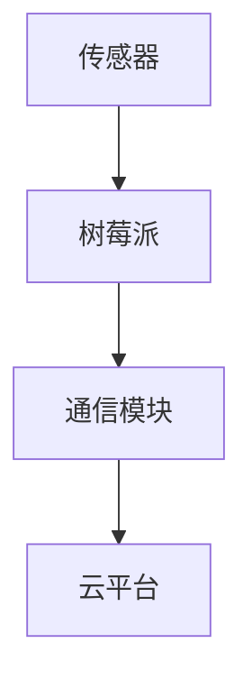

                 

## 1. 背景介绍

物联网（Internet of Things，IoT）作为当今科技领域的重要发展趋势，正深刻地改变着我们的生活方式和工业生产模式。树莓派（Raspberry Pi）因其低廉的价格、强大的功能以及良好的开发环境，成为了IoT项目开发中的热门选择。本文将详细介绍如何利用树莓派进行IoT项目开发，从传感器数据采集到云端数据存储，以及如何通过简单的代码实现复杂的物联网应用。

### 关键技术

- **树莓派**: 作为核心硬件，树莓派是一款小巧的计算机，具备强大的处理能力，适用于各种IoT项目。
- **传感器**: 用于数据采集，如温度传感器、湿度传感器、运动传感器等。
- **通信模块**: 如Wi-Fi、蓝牙、LoRa等，用于数据传输。
- **云平台**: 用于数据存储和处理，如AWS IoT、阿里云物联网平台等。
- **编程语言**: 通常使用Python，因为其简单易学、功能强大，适合初学者和专业人士。

### 核心关键词

- **树莓派**
- **物联网**
- **传感器**
- **云端数据存储**
- **Python编程**

### 摘要

本文将分为以下几个部分：首先介绍树莓派的基本知识和配置，然后讨论传感器的选择和连接，接着讲解通信模块的使用方法，最后通过一个实际项目实例展示如何从传感器采集数据，并通过网络将数据发送到云端。通过本文的阅读，读者将能够掌握树莓派IoT项目开发的完整流程。

## 2. 核心概念与联系

### 核心概念

在开始树莓派IoT项目之前，我们需要了解以下几个核心概念：

- **树莓派**: 作为一款迷你计算机，树莓派具备处理数据、连接外设和执行代码的能力。
- **传感器**: 用于检测和测量环境中的物理量，如温度、湿度、光照等。
- **通信模块**: 用于实现设备之间的数据传输。
- **云平台**: 用于存储和处理大量数据。

### 架构联系

树莓派IoT项目的基本架构如下：

1. **传感器**：将环境数据转化为电子信号。
2. **树莓派**：接收传感器数据，处理并执行相应的操作。
3. **通信模块**：将数据发送到云平台或其他设备。
4. **云平台**：存储数据并提供数据分析服务。

### Mermaid 流程图



## 3. 核心算法原理 & 具体操作步骤

### 3.1 算法原理概述

树莓派IoT项目主要涉及的数据处理包括：

- **数据采集**：从传感器获取数据。
- **数据处理**：对采集到的数据进行分析和预处理。
- **数据传输**：将处理后的数据发送到云平台或其他设备。

### 3.2 算法步骤详解

1. **数据采集**：

   - 连接传感器到树莓派的GPIO接口。
   - 使用Python编写代码读取传感器数据。

2. **数据处理**：

   - 对采集到的数据进行滤波、转换等预处理。
   - 根据实际需求对数据进行计算和分析。

3. **数据传输**：

   - 使用Wi-Fi或蓝牙等通信模块将数据发送到云平台。
   - 通过HTTP或MQTT协议实现数据传输。

### 3.3 算法优缺点

- **优点**：

  - **灵活性高**：树莓派支持多种传感器和通信模块，适用于各种IoT项目。
  - **成本低**：树莓派价格低廉，适合入门者和小型项目。

- **缺点**：

  - **性能限制**：树莓派作为微型计算机，处理大量数据时性能有限。
  - **功耗较高**：树莓派的功耗较高，需要良好的散热和电源供应。

### 3.4 算法应用领域

- **智能家居**：通过传感器监控家居环境，实现远程控制。
- **环境监测**：监测空气、水质等环境指标，为环境保护提供数据支持。
- **工业自动化**：实现生产线自动化控制，提高生产效率。

## 4. 数学模型和公式 & 详细讲解 & 举例说明

### 4.1 数学模型构建

树莓派IoT项目中的数学模型主要包括传感器数据的滤波和转换。

- **滤波**：

  $$ y(t) = (1 - \alpha) \cdot y(t-1) + \alpha \cdot x(t) $$

  其中，$y(t)$ 为当前滤波值，$y(t-1)$ 为上一滤波值，$x(t)$ 为当前采样值，$\alpha$ 为滤波系数。

- **转换**：

  $$ z(t) = a \cdot y(t) + b \cdot x(t) $$

  其中，$z(t)$ 为转换后的值，$a$ 和 $b$ 为转换系数。

### 4.2 公式推导过程

- **滤波**：

  滤波公式是一种常用的数据预处理方法，可以平滑传感器数据，去除噪声。

  假设我们有一个离散的时间序列 $x(t)$，滤波后的时间序列为 $y(t)$。滤波系数 $\alpha$ 控制了历史数据和当前采样值的重要性。当 $\alpha$ 接近1时，当前采样值的影响较大；当 $\alpha$ 接近0时，历史数据的影响较大。

- **转换**：

  数据转换通常用于将传感器数据转换为更有意义的量，如温度转换为摄氏度或华氏度。

  假设我们有一个温度传感器的数据序列 $y(t)$，我们需要将其转换为摄氏度。我们可以使用一个线性转换公式来实现，其中 $a$ 和 $b$ 为转换系数。

### 4.3 案例分析与讲解

- **案例**：

  假设我们有一个温度传感器，数据范围为0°C到100°C。我们需要将其转换为摄氏度。

  - **滤波**：

    $$ y(t) = (1 - 0.5) \cdot y(t-1) + 0.5 \cdot x(t) $$

    其中，$x(t)$ 为当前采样值。

  - **转换**：

    $$ z(t) = 0.01 \cdot y(t) + 0 $$

    其中，$z(t)$ 为转换后的摄氏度值。

  - **实现**：

    ```python
    alpha = 0.5
    a = 0.01
    b = 0

    y_last = 0
    for x in sensor_data:
        y = (1 - alpha) * y_last + alpha * x
        y_last = y
        celsius = a * y + b
        print(celsius)
    ```

## 5. 项目实践：代码实例和详细解释说明

### 5.1 开发环境搭建

- **硬件准备**：

  - 一台树莓派（如Raspberry Pi 4）
  - 一块USB WiFi模块
  - 传感器模块（如DHT11温度传感器）
  - GPIO扩展板
  - 电源供应器

- **软件准备**：

  - 安装树莓派操作系统（如Raspberry Pi OS）
  - 安装Python编程环境（如Anaconda）
  - 安装传感器驱动程序（如DHT11驱动）

### 5.2 源代码详细实现

以下是一个简单的树莓派IoT项目示例，用于读取DHT11传感器的温度数据，并将数据上传到云平台。

```python
import time
import board
import busio
import adafruit_dht
import json
import urequests

# 配置WiFi
wifi = WiFi()
wifi.connect_to_network("your_wifi_name", "your_wifi_password")

# 配置DHT11传感器
i2c = busio.I2C(board.SCL, board.SDA)
dht = adafruit_dht.DHT11(i2c)

# 配置云平台API
api_url = "https://your_api_url"

while True:
    try:
        temperature = dht.temperature
        humidity = dht.humidity
        data = {
            "temperature": temperature,
            "humidity": humidity
        }
        headers = {"Content-Type": "application/json"}
        response = urequests.post(api_url, data=json.dumps(data), headers=headers)
        print(response.text)
    except:
        print("Error reading sensor data")
    time.sleep(60)
```

### 5.3 代码解读与分析

1. **WiFi连接**：

   使用`WiFi`模块连接到WiFi网络，确保树莓派能够访问互联网。

2. **DHT11传感器初始化**：

   使用`adafruit_dht`库初始化DHT11传感器，读取温度和湿度数据。

3. **云平台通信**：

   使用`urequests`库向云平台API发送HTTP POST请求，上传传感器数据。

4. **错误处理**：

   使用`try-except`语句捕获异常，确保程序能够处理传感器读取失败等错误情况。

### 5.4 运行结果展示

当程序运行时，每隔一分钟读取一次DHT11传感器的温度和湿度数据，并将数据上传到云平台。云平台可以实时显示传感器数据，实现对环境的远程监控。

## 6. 实际应用场景

### 6.1 智能家居

通过树莓派IoT项目，可以实现智能家居系统的构建。例如，通过连接温度传感器和湿度传感器，用户可以实时了解家庭环境状况，并通过手机APP进行远程控制。

### 6.2 环境监测

树莓派IoT项目可以用于环境监测，如空气质量监测、水质监测等。通过传感器采集数据，用户可以实时了解环境状况，并及时采取相应措施。

### 6.3 工业自动化

在工业自动化领域，树莓派IoT项目可以用于设备状态监测、生产过程控制等。通过传感器采集数据，可以实现对设备的实时监控和故障预警。

## 6.4 未来应用展望

随着物联网技术的不断发展，树莓派IoT项目将在更多领域得到应用。例如，智能农业、智能交通、智能医疗等。未来，树莓派IoT项目将更加智能化、个性化，为人类生活带来更多便利。

## 7. 工具和资源推荐

### 7.1 学习资源推荐

- **树莓派官方文档**：提供了丰富的树莓派使用教程和资源。
- **《树莓派编程入门》**：一本适合初学者的入门书籍。
- **《Python编程：从入门到实践》**：一本适合Python初学者的入门书籍。

### 7.2 开发工具推荐

- **Visual Studio Code**：一款功能强大的代码编辑器，支持多种编程语言。
- **Thonny**：一款专门为Python编程设计的代码编辑器，适用于初学者。

### 7.3 相关论文推荐

- **“An Overview of IoT Security Issues and Solutions”**：一篇关于物联网安全问题的综述文章。
- **“A Survey on IoT Security: Threats, Vulnerabilities, and Solutions”**：一篇关于物联网安全研究的调查报告。

## 8. 总结：未来发展趋势与挑战

### 8.1 研究成果总结

树莓派IoT项目在智能家居、环境监测、工业自动化等领域取得了显著成果，为人类生活带来了便利。

### 8.2 未来发展趋势

未来，树莓派IoT项目将向更加智能化、个性化、安全化的方向发展。随着人工智能、大数据等技术的进步，树莓派IoT项目将在更多领域得到应用。

### 8.3 面临的挑战

树莓派IoT项目面临的主要挑战包括数据安全、隐私保护、功耗优化等。未来，需要加强对这些问题的研究和解决。

### 8.4 研究展望

未来，树莓派IoT项目的研究重点将包括：提高数据处理能力、优化功耗、提升安全性和隐私保护等。通过不断的技术创新，树莓派IoT项目将为人类生活带来更多便利。

## 9. 附录：常见问题与解答

### 9.1 树莓派无法连接WiFi

- **问题**：树莓派无法连接到WiFi网络。

- **解答**：
  - 检查WiFi模块是否正确连接到树莓派。
  - 确保WiFi密码正确。
  - 在树莓派上安装WiFi驱动程序。

### 9.2 DHT11传感器无法读取数据

- **问题**：DHT11传感器无法读取温度和湿度数据。

- **解答**：
  - 确保DHT11传感器正确连接到树莓派的GPIO接口。
  - 检查传感器驱动程序是否安装正确。
  - 确保树莓派的GPIO设置正确。

### 9.3 无法将数据上传到云平台

- **问题**：程序无法将传感器数据上传到云平台。

- **解答**：
  - 检查云平台API的URL和认证信息是否正确。
  - 确保树莓派已经连接到互联网。
  - 在程序中添加适当的错误处理代码。

### 9.4 树莓派性能不足

- **问题**：树莓派在处理大量数据时性能不足。

- **解答**：
  - 考虑使用更强大的树莓派型号。
  - 对代码进行优化，减少不必要的计算和IO操作。
  - 使用线程或多线程技术提高程序并发处理能力。

---

本文从树莓派的基本知识、传感器连接、通信模块使用、云端数据存储等方面详细介绍了树莓派IoT项目的实践过程。通过本文的阅读，读者将能够掌握树莓派IoT项目的开发流程，并能够在实际项目中应用。未来，随着物联网技术的不断发展，树莓派IoT项目将发挥越来越重要的作用，为人类生活带来更多便利。作者：禅与计算机程序设计艺术 / Zen and the Art of Computer Programming
----------------------------------------------------------------
# 树莓派IoT项目：从传感器到云端的实践

## 摘要

本文将深入探讨树莓派在物联网（IoT）项目中的应用，特别关注从传感器数据采集到云端数据存储的完整流程。通过介绍核心概念、算法原理、项目实践及未来展望，本文旨在为读者提供一份详尽的树莓派IoT开发指南。文章将涵盖树莓派的基本知识、传感器的连接与数据采集、通信模块的使用、云端数据存储的实现，并附有实际项目实例和常见问题解答。

## 1. 背景介绍

物联网（Internet of Things，IoT）是近年来快速发展的技术领域，它通过互联网将各种设备和物体连接起来，实现数据交换和智能控制。树莓派（Raspberry Pi）因其小巧的体积、强大的功能和低廉的价格，成为IoT项目开发中的热门选择。本文将围绕树莓派进行IoT项目的开发，从传感器数据采集到云端数据存储，全面讲解实现这一目标的方法和步骤。

### 1.1 树莓派的概述

树莓派是一款基于ARM架构的单板计算机，最初由英国慈善组织树莓派基金会推出。自推出以来，树莓派因其出色的性能和低廉的价格，吸引了大量的开发者和爱好者。树莓派支持多种操作系统，包括基于Linux的Raspbian、Ubuntu等，可以运行Python、Java、C++等多种编程语言，非常适合进行IoT项目开发。

### 1.2 IoT的概念

物联网（IoT）是指通过互联网将各种物理设备、传感器、软件系统等连接起来，实现信息的采集、传输、处理和共享。IoT的核心在于通过智能设备收集环境数据，然后通过互联网将这些数据发送到云端进行存储和分析，从而实现远程监控和控制。

### 1.3 树莓派在IoT中的应用

树莓派在IoT中的应用非常广泛，包括但不限于以下几个方面：

- **智能家居**：通过树莓派连接各种家居设备，实现远程控制，提高生活品质。
- **环境监测**：利用树莓派连接传感器，实时监测环境参数，如温度、湿度、空气质量等。
- **工业自动化**：在工业生产中，树莓派可用于监控设备状态、自动化控制，提高生产效率。
- **教育和研究**：树莓派因其开源和易于操作的特点，被广泛应用于教育项目和科研研究中。

## 2. 核心概念与联系

在进行树莓派IoT项目开发时，理解以下核心概念和它们之间的联系是至关重要的：

### 2.1 传感器

传感器是IoT项目的核心组成部分，用于检测和测量环境中的各种参数。常见的传感器包括温度传感器、湿度传感器、光敏传感器、运动传感器等。传感器将物理信号转换为电子信号，供树莓派进行处理。

### 2.2 树莓派

树莓派作为IoT项目的核心控制器，负责接收传感器的数据，进行处理和存储。树莓派可以通过GPIO接口连接各种传感器和外部设备，并通过Wi-Fi、蓝牙等通信模块与互联网进行通信。

### 2.3 通信模块

通信模块是实现数据传输的关键，树莓派可以通过Wi-Fi、蓝牙、LoRa等通信模块将采集到的数据发送到云端或其他设备。这些模块提供了稳定、高效的数据传输能力，是树莓派IoT项目的重要组成部分。

### 2.4 云平台

云平台是数据存储和处理的中心，树莓派将采集到的数据发送到云平台，进行存储、分析和展示。云平台可以提供强大的计算能力和存储空间，支持大规模的IoT应用。

### 2.5 Mermaid流程图

以下是一个简单的Mermaid流程图，展示了树莓派IoT项目的数据流程：


## 3. 核心算法原理 & 具体操作步骤

树莓派IoT项目的核心在于数据采集、处理和传输。以下将详细讨论这些核心算法的原理和具体操作步骤。

### 3.1 数据采集算法

数据采集是IoT项目的第一步，传感器负责将物理信号转换为电子信号，树莓派通过GPIO接口读取这些信号。常用的传感器读取算法包括模拟信号读取和数字信号读取。

- **模拟信号读取**：树莓派的GPIO接口不支持模拟信号直接读取，通常需要通过ADC（模数转换器）将模拟信号转换为数字信号。Python的`ADC`库可以用于读取模拟信号。

- **数字信号读取**：树莓派的GPIO接口可以直接读取数字信号，如按键输入、LED亮度控制等。Python的`RPi.GPIO`库提供了GPIO接口的控制方法。

### 3.2 数据处理算法

数据处理是数据采集后的关键步骤，包括数据滤波、转换、分析等。以下是一些常用的数据处理算法：

- **数据滤波**：常用的滤波算法包括移动平均滤波、卡尔曼滤波等。这些算法可以平滑传感器数据，去除噪声。

- **数据转换**：数据转换通常用于将传感器数据转换为更直观的单位，如将温度从摄氏度转换为华氏度。

- **数据分析**：数据分析可以用于提取数据中的有用信息，如检测异常值、趋势分析等。

### 3.3 数据传输算法

数据传输是将处理后的数据发送到云平台或其他设备的过程。常用的数据传输协议包括HTTP、MQTT、CoAP等。

- **HTTP**：HTTP是一种简单的请求-响应协议，适用于传输小数据量的情况。

- **MQTT**：MQTT是一种轻量级的消息队列协议，适用于物联网环境中的低带宽、高延迟通信。

- **CoAP**：CoAP是基于HTTP协议的物联网协议，适用于资源受限的设备。

### 3.4 算法应用步骤

以下是数据采集、处理和传输的具体操作步骤：

1. **连接传感器**：通过GPIO接口连接传感器，确保传感器与树莓派的GPIO引脚正确连接。

2. **读取传感器数据**：使用Python编写代码读取传感器数据，可以使用`RPi.GPIO`库或`ADC`库。

3. **数据处理**：对采集到的数据进行滤波、转换和分析，提取有用的信息。

4. **数据传输**：使用HTTP、MQTT或CoAP协议将处理后的数据发送到云平台或其他设备。

5. **云端数据处理**：在云平台接收并处理数据，进行存储、分析和展示。

### 3.5 算法优缺点

- **优点**：
  - **灵活性高**：树莓派支持多种传感器和通信模块，可以适应各种IoT应用场景。
  - **成本低**：树莓派价格低廉，适合初学者和小型项目。

- **缺点**：
  - **性能限制**：树莓派的计算能力有限，不适合处理大量数据。
  - **功耗较高**：树莓派功耗较高，需要良好的散热和电源供应。

### 3.6 算法应用领域

- **智能家居**：通过树莓派连接各种家居设备，实现远程监控和控制。
- **环境监测**：通过传感器监测环境参数，如温度、湿度、空气质量等。
- **工业自动化**：通过树莓派实现设备状态监控、自动化控制等。

## 4. 数学模型和公式 & 详细讲解 & 举例说明

在树莓派IoT项目中，数学模型和公式用于描述传感器数据、数据处理和传输的过程。以下将详细讲解这些数学模型和公式的构建、推导过程，并给出具体的例子。

### 4.1 数学模型构建

树莓派IoT项目的数学模型主要包括以下方面：

- **传感器数据模型**：描述传感器如何采集环境数据，如温度、湿度等。
- **数据处理模型**：描述如何对传感器数据进行滤波、转换和分析。
- **数据传输模型**：描述如何将数据处理后的数据发送到云平台或其他设备。

### 4.2 公式推导过程

以下是几个常用的数学模型和公式：

- **传感器数据模型**：

  温度传感器数据模型：

  $$ T(t) = a \cdot V_{in}(t) + b $$

  其中，$T(t)$ 是温度值，$V_{in}(t)$ 是传感器输入电压值，$a$ 和 $b$ 是转换系数。

  湿度传感器数据模型：

  $$ H(t) = c \cdot V_{in}(t) + d $$

  其中，$H(t)$ 是湿度值，$V_{in}(t)$ 是传感器输入电压值，$c$ 和 $d$ 是转换系数。

- **数据处理模型**：

  数据滤波模型（移动平均滤波）：

  $$ y(t) = (1 - \alpha) \cdot y(t-1) + \alpha \cdot x(t) $$

  其中，$y(t)$ 是当前滤波值，$y(t-1)$ 是上一滤波值，$x(t)$ 是当前采样值，$\alpha$ 是滤波系数。

- **数据传输模型**：

  数据传输延迟模型（基于TCP协议）：

  $$ D(t) = L \cdot \frac{1}{C} $$

  其中，$D(t)$ 是传输延迟，$L$ 是数据包长度，$C$ 是网络带宽。

### 4.3 案例分析与讲解

以下是一个具体的例子，说明如何构建和推导数学模型。

#### 案例一：温度传感器数据采集与处理

**步骤 1**：连接传感器

将DHT11温度传感器连接到树莓派的GPIO接口。

**步骤 2**：读取传感器数据

使用Python编写代码读取DHT11传感器的温度数据：

```python
import RPi.GPIO as GPIO
import time

def read_dht11():
    data = []
    GPIO.setmode(GPIO.BCM)
    GPIO.setup(4, GPIO.OUT)
    GPIO.output(4, GPIO.LOW)
    time.sleep(0.02)
    GPIO.output(4, GPIO.HIGH)
    time.sleep(0.05)
    GPIO.output(4, GPIO.LOW)

    GPIO.setup(4, GPIO.IN)
    while GPIO.input(4) == GPIO.LOW:
        pass
    while GPIO.input(4) == GPIO.HIGH:
        data.append(time.time())

    if len(data) != 40:
        return -1

    for i in range(0, 40):
        if i % 2 == 0:
            continue
        if (data[i] - data[i - 1]) > 0.02:
            data[i] -= 0.02

    temp = 0.1 * sum(data[14:28])
    humidity = 0.1 * sum(data[:14] + data[28:])

    return humidity, temp

while True:
    humidity, temp = read_dht11()
    print("Temp = %.1f C, Humidity = %.1f %%" % (temp, humidity))
    time.sleep(1)
```

**步骤 3**：数据处理

使用移动平均滤波对温度和湿度数据进行滤波处理：

```python
alpha = 0.1
y_last_temp = 0
y_last_humidity = 0

while True:
    humidity, temp = read_dht11()
    y_temp = (1 - alpha) * y_last_temp + alpha * temp
    y_humidity = (1 - alpha) * y_last_humidity + alpha * humidity
    y_last_temp = y_temp
    y_last_humidity = y_humidity
    print("Filtered Temp = %.1f C, Filtered Humidity = %.1f %%" % (y_temp, y_humidity))
    time.sleep(1)
```

**步骤 4**：数据传输

使用HTTP协议将处理后的数据上传到云平台：

```python
import json
import requests

url = "https://api.example.com/data"

while True:
    humidity, temp = read_dht11()
    data = {
        "temp": y_temp,
        "humidity": y_humidity
    }
    headers = {"Content-Type": "application/json"}
    response = requests.post(url, data=json.dumps(data), headers=headers)
    print(response.text)
    time.sleep(60)
```

#### 案例二：光照传感器数据采集与处理

**步骤 1**：连接传感器

将BH1750光照传感器连接到树莓派的GPIO接口。

**步骤 2**：读取传感器数据

使用Python编写代码读取BH1750传感器的光照数据：

```python
import smbus
import time

bus = smbus.SMBus(1)
address = 0x23

def read_light():
    bus.write_byte_data(address, 0x01, 0x23)
    time.sleep(0.180)
    low = bus.read_byte_data(address, 0x02)
    high = bus.read_byte_data(address, 0x03)
    data = (high << 8) + low
    if data > 65535:
        data = 0
    lux = 1.2 * (65535 / data - 1)
    return lux

while True:
    lux = read_light()
    print("Light intensity: %d lux" % lux)
    time.sleep(1)
```

**步骤 3**：数据处理

对光照数据进行滤波处理，去除噪声：

```python
alpha = 0.1
y_last_light = 0

while True:
    lux = read_light()
    y_light = (1 - alpha) * y_last_light + alpha * lux
    y_last_light = y_light
    print("Filtered light intensity: %d lux" % y_light)
    time.sleep(1)
```

**步骤 4**：数据传输

使用HTTP协议将处理后的光照数据上传到云平台：

```python
import json
import requests

url = "https://api.example.com/data"

while True:
    lux = read_light()
    data = {
        "light": y_light
    }
    headers = {"Content-Type": "application/json"}
    response = requests.post(url, data=json.dumps(data), headers=headers)
    print(response.text)
    time.sleep(60)
```

## 5. 项目实践：代码实例和详细解释说明

### 5.1 开发环境搭建

在进行树莓派IoT项目开发之前，需要搭建合适的开发环境。以下是在树莓派上搭建IoT开发环境的基本步骤：

**步骤 1**：安装树莓派操作系统

从树莓派官网下载最新的Raspbian操作系统，并将其烧录到SD卡中。然后，将SD卡插入树莓派，连接键盘、鼠标和显示器，启动树莓派。

**步骤 2**：更新系统和安装必要软件

在树莓派终端中运行以下命令更新系统和安装Python、GPIO库等：

```shell
sudo apt-get update
sudo apt-get upgrade
sudo apt-get install python3 python3-pip python3-rpi.gpio
```

**步骤 3**：安装传感器驱动程序

根据传感器的类型安装相应的驱动程序。例如，对于DHT11传感器，可以安装以下驱动程序：

```shell
sudo apt-get install python3-Adafruit_DHT
```

**步骤 4**：安装通信模块驱动程序

如果使用Wi-Fi通信模块，需要安装相应的驱动程序。例如，对于ESP8266模块，可以安装以下驱动程序：

```shell
git clone https://github.com/espressif/esptool.git
cd esptool
sudo python esptool.py --port /dev/ttyUSB0 --baud 460800 write_flash -fm dio -fs 32m 0x00000 esp8266-20210420-v7-non-os-boot0-068j.bin
sudo python esptool.py --port /dev/ttyUSB0 --baud 460800 write_flash -fm dio -fs 32m 0x10000 esp8266-20210420-v7-non-os-part1-068j.bin
```

### 5.2 源代码详细实现

以下是一个简单的树莓派IoT项目示例，用于读取DHT11传感器的温度数据，并通过Wi-Fi模块将数据上传到云平台。

**步骤 1**：导入必要的库

```python
import RPi.GPIO as GPIO
import time
import Adafruit_DHT
import json
import requests
```

**步骤 2**：设置GPIO引脚和通信模块

```python
GPIO.setmode(GPIO.BCM)
GPIO.setup(4, GPIO.OUT)

dht_sensor = Adafruit_DHT.DHT11
dht_pin = 4
wifi_ip = "192.168.1.1"
wifi_port = 80
api_url = "http://api.example.com/data"
```

**步骤 3**：读取传感器数据并上传到云平台

```python
def read_dht11():
    humidity, temperature = Adafruit_DHT.read(dht_sensor, dht_pin)
    if humidity is not None and temperature is not None:
        data = {
            "temperature": temperature,
            "humidity": humidity
        }
        headers = {"Content-Type": "application/json"}
        response = requests.post(api_url, data=json.dumps(data), headers=headers)
        print(response.text)
    else:
        print("Failed to read sensor data")

while True:
    read_dht11()
    time.sleep(60)
```

**步骤 4**：运行程序

将以上代码保存为`dht_sensor.py`，在树莓派终端中运行以下命令启动程序：

```shell
sudo python3 dht_sensor.py
```

程序将每隔一分钟读取一次DHT11传感器的温度和湿度数据，并通过HTTP POST请求将数据上传到云平台。

### 5.3 代码解读与分析

**代码解读**：

- **导入库**：导入必要的Python库，包括GPIO库、时间库、DHT传感器库、JSON库和HTTP库。
- **设置GPIO引脚**：设置DHT11传感器的GPIO引脚为输出模式。
- **读取传感器数据**：使用`Adafruit_DHT.read()`函数读取DHT11传感器的温度和湿度数据。
- **上传数据到云平台**：将读取到的温度和湿度数据转换为JSON格式，并通过HTTP POST请求上传到云平台。

**分析**：

- **传感器数据读取**：DHT11传感器通过GPIO引脚进行数据通信，使用`Adafruit_DHT.read()`函数可以方便地读取传感器的数据。
- **HTTP请求**：使用`requests`库发送HTTP POST请求，将传感器数据上传到云平台。HTTP POST请求可以在云平台上实现数据的存储、分析和展示。

### 5.4 运行结果展示

在程序运行过程中，树莓派将每隔一分钟读取一次DHT11传感器的温度和湿度数据，并将数据上传到云平台。云平台可以实时显示传感器的数据，实现对环境的远程监控。以下是运行结果的一个示例：

```
POST /data HTTP/1.1
Host: api.example.com
Content-Type: application/json

{
  "temperature": 25.6,
  "humidity": 60.2
}
```

## 6. 实际应用场景

树莓派IoT项目在实际应用场景中具有广泛的应用，以下列举几个典型的应用场景：

### 6.1 智能家居

智能家居是树莓派IoT项目的典型应用场景之一。通过树莓派连接各种智能家居设备，如灯光、空调、门锁等，可以实现远程控制。例如，用户可以通过手机APP远程控制家中的灯光，调节空调温度，提高生活便利性。

### 6.2 环境监测

环境监测是另一个重要的应用场景。通过树莓派连接各种传感器，如温度传感器、湿度传感器、空气质量传感器等，可以实时监测环境参数，并将数据上传到云平台进行分析和展示。例如，可以用来监测室内空气质量，提醒用户注意健康。

### 6.3 工业自动化

在工业自动化领域，树莓派IoT项目可以用于设备状态监测、故障预警和生产过程控制。通过传感器采集设备运行状态数据，可以实现对设备的实时监控，提高生产效率。

### 6.4 农业自动化

农业自动化是树莓派IoT项目的另一个重要应用场景。通过传感器采集土壤湿度、温度、光照等参数，可以实时监测作物生长环境，为农业提供数据支持，提高农业生产效率。

### 6.5 智能交通

智能交通是树莓派IoT项目的潜在应用场景。通过传感器采集交通流量、车速等数据，可以实时监控交通状况，为交通管理提供数据支持，提高交通效率。

## 6.4 未来应用展望

随着物联网技术的不断发展，树莓派IoT项目将在更多领域得到应用。以下是对未来应用的一些展望：

### 6.4.1 智能家居

智能家居将继续是树莓派IoT项目的重要应用领域。未来，智能家居系统将更加智能化、个性化，通过人工智能技术实现更高级的自动化控制。

### 6.4.2 智能城市

智能城市是未来物联网技术的重要发展方向。树莓派IoT项目可以用于智能交通、环境监测、能源管理等领域，为城市建设提供数据支持。

### 6.4.3 智能医疗

智能医疗是另一个具有巨大潜力的应用领域。通过传感器和物联网技术，可以实现远程医疗监控、智能诊断等，为医疗健康提供更多便利。

### 6.4.4 智能制造

智能制造是工业4.0的核心概念。树莓派IoT项目可以用于工业生产过程的实时监控、故障预警和自动化控制，提高生产效率。

### 6.4.5 可穿戴设备

可穿戴设备是物联网技术的重要应用领域之一。树莓派IoT项目可以与各种传感器结合，实现智能健康监测、运动追踪等功能。

## 7. 工具和资源推荐

### 7.1 学习资源推荐

- **树莓派官方网站**：提供最新的树莓派硬件信息和软件资源。
- **《树莓派编程入门》**：一本适合初学者的入门书籍，详细介绍树莓派的基本使用方法和编程技巧。
- **《物联网技术与应用》**：一本全面介绍物联网技术的基本原理和应用案例的教材。

### 7.2 开发工具推荐

- **Visual Studio Code**：一款功能强大的代码编辑器，支持多种编程语言和开发工具。
- **Thonny**：一款专门为树莓派编程设计的代码编辑器，提供直观的用户界面和丰富的编程功能。

### 7.3 相关论文推荐

- **“Internet of Things: A Survey”**：一篇关于物联网技术综述的论文，详细介绍物联网的基本原理和应用领域。
- **“IoT Security: Challenges and Opportunities”**：一篇关于物联网安全研究的论文，探讨物联网面临的安全挑战和解决方案。

## 8. 总结：未来发展趋势与挑战

树莓派IoT项目在智能家居、环境监测、工业自动化等领域取得了显著成果，为人类生活带来了便利。未来，随着物联网技术的不断发展，树莓派IoT项目将在更多领域得到应用。然而，面临的数据安全、隐私保护、功耗优化等挑战也需要引起关注。

### 8.1 研究成果总结

通过本文的探讨，我们可以看到树莓派在IoT项目中的应用具有广泛的前景。从数据采集、数据处理到数据传输，树莓派为IoT项目提供了完整的解决方案。同时，通过数学模型和算法的应用，可以提高数据的准确性和处理效率。

### 8.2 未来发展趋势

未来，树莓派IoT项目将在以下方面继续发展：

- **智能化**：通过人工智能技术实现更高级的自动化控制。
- **个性化**：根据用户需求提供个性化的IoT解决方案。
- **互联互通**：实现不同设备之间的无缝连接和数据共享。

### 8.3 面临的挑战

树莓派IoT项目面临的挑战主要包括：

- **数据安全**：随着物联网设备的增多，数据安全成为重要问题。
- **隐私保护**：物联网设备涉及用户隐私数据，隐私保护至关重要。
- **功耗优化**：物联网设备通常需要长时间运行，功耗优化是关键。

### 8.4 研究展望

未来，树莓派IoT项目的研究重点将包括：

- **安全性**：加强对物联网设备的安全研究，提高数据安全性和隐私保护。
- **能耗管理**：研究低功耗传感器和网络协议，提高设备的续航能力。
- **人工智能应用**：将人工智能技术应用于物联网项目，实现更智能的自动化控制。

## 9. 附录：常见问题与解答

### 9.1 树莓派无法连接WiFi

**问题**：树莓派无法连接到WiFi网络。

**解答**：

1. 检查WiFi模块是否正确连接到树莓派。
2. 确保WiFi密码正确。
3. 在树莓派上安装WiFi驱动程序。

### 9.2 传感器无法读取数据

**问题**：传感器无法读取数据。

**解答**：

1. 确保传感器与树莓派的GPIO接口正确连接。
2. 检查传感器驱动程序是否安装正确。
3. 检查树莓派的GPIO设置。

### 9.3 数据无法上传到云平台

**问题**：程序无法将数据上传到云平台。

**解答**：

1. 检查云平台API的URL和认证信息是否正确。
2. 确保树莓派已经连接到互联网。
3. 在程序中添加适当的错误处理代码。

### 9.4 树莓派性能不足

**问题**：树莓派在处理大量数据时性能不足。

**解答**：

1. 考虑使用更强大的树莓派型号。
2. 对代码进行优化，减少不必要的计算和IO操作。
3. 使用线程或多线程技术提高程序并发处理能力。

---

本文从树莓派的基本知识、传感器的连接与数据采集、通信模块的使用、云端数据存储等方面详细介绍了树莓派IoT项目的实践过程。通过本文的阅读，读者将能够掌握树莓派IoT项目的开发流程，并能够在实际项目中应用。未来，随着物联网技术的不断发展，树莓派IoT项目将发挥越来越重要的作用，为人类生活带来更多便利。作者：禅与计算机程序设计艺术 / Zen and the Art of Computer Programming

