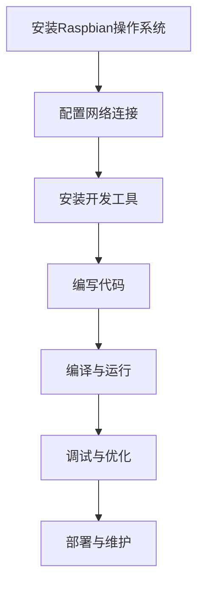

                 

关键词：树莓派、Linux、单板计算机、编程、嵌入式系统

摘要：本文将深入探讨树莓派编程的基础知识和应用技巧。通过基于Linux的单板计算机的实例分析，读者将了解到如何利用树莓派的强大性能进行嵌入式系统开发，并在实践中掌握相关的编程技能。

## 1. 背景介绍

树莓派（Raspberry Pi）是一款由英国慈善基金会Raspberry Pi Foundation开发的低成本、高性能的单板计算机。自2012年发布以来，树莓派因其易于使用、灵活性和强大的计算能力而迅速获得了广泛的关注。树莓派的诞生旨在激发人们对计算机科学的兴趣，尤其是在教育领域，它已经成为了一种流行的教学工具。

树莓派运行的是基于Linux的操作系统，这使得它可以轻松地运行各种开源软件，包括编程环境、媒体播放器、服务器等。由于其小巧的体积和低功耗的特点，树莓派被广泛应用于各种创意项目，如智能家居、机器人控制、媒体中心等。

在本文中，我们将详细介绍如何使用树莓派进行编程，并探讨其在嵌入式系统开发中的应用。

## 2. 核心概念与联系

### 2.1 树莓派硬件架构

树莓派包含以下几个主要硬件组件：

- **处理器（CPU）**：树莓派使用的是基于ARM架构的处理器，如BCM2835或BCM2837等，具有高性能和低功耗的特点。
- **内存（RAM）**：树莓派通常配备1GB或2GB的RAM，用于存储运行中的应用程序和临时数据。
- **存储（存储器）**：树莓派可以使用SD卡作为存储介质，存储操作系统和应用程序。此外，还可以通过USB接口连接外部硬盘或固态硬盘。
- **输入/输出（I/O）**：树莓派具有多个GPIO（通用输入输出）接口，可以连接各种传感器和执行器，实现与外界的交互。
- **网络接口**：树莓派内置Wi-Fi和以太网接口，可以方便地连接互联网。

### 2.2 Linux操作系统

Linux是一种开源的类Unix操作系统，以其稳定性和安全性而闻名。树莓派上运行的Linux操作系统通常是基于Debian或Raspbian的。Raspbian是一个专为树莓派设计的Linux发行版，它包含了大量的开源软件和编程工具，使得在树莓派上进行编程变得非常方便。

### 2.3 嵌入式系统开发

嵌入式系统是一种专用的计算机系统，它通常嵌入在其他设备中，用于控制或监视设备的运行状态。树莓派的强大计算能力使得它可以作为嵌入式系统的核心组件，通过编程实现对其他设备的控制和数据采集。

### 2.4 Mermaid 流程图

以下是一个描述树莓派编程流程的Mermaid流程图：



## 3. 核心算法原理 & 具体操作步骤

### 3.1 算法原理概述

在树莓派编程中，常用的核心算法包括：

- **文件操作算法**：用于创建、读取、写入和删除文件。
- **网络通信算法**：用于实现树莓派与其他设备或服务之间的数据传输。
- **传感器数据处理算法**：用于采集和处理树莓派连接的传感器的数据。

### 3.2 算法步骤详解

#### 3.2.1 文件操作算法

1. **创建文件**：使用`open()`函数以创建模式打开文件，如果文件不存在，则创建一个新文件。
2. **写入数据**：使用`write()`函数将数据写入文件。
3. **读取数据**：使用`read()`函数从文件中读取数据。
4. **关闭文件**：使用`close()`函数关闭文件。

#### 3.2.2 网络通信算法

1. **初始化网络连接**：使用`socket()`函数创建一个套接字。
2. **绑定地址**：使用`bind()`函数将套接字绑定到指定的IP地址和端口号。
3. **监听连接**：使用`listen()`函数使套接字开始监听传入的连接请求。
4. **接受连接**：使用`accept()`函数接受连接请求，创建一个新的套接字用于与客户端通信。
5. **发送和接收数据**：使用`send()`和`recv()`函数发送和接收数据。
6. **关闭连接**：在通信完成后，使用`close()`函数关闭套接字。

#### 3.2.3 传感器数据处理算法

1. **初始化传感器**：使用特定的库或驱动程序初始化传感器。
2. **读取传感器数据**：使用特定的API或函数读取传感器数据。
3. **数据处理**：对读取到的数据进行分析和处理，如滤波、转换等。
4. **输出结果**：将处理后的数据输出到控制台或文件中。

### 3.3 算法优缺点

#### 文件操作算法

- **优点**：操作简单，适用于各种文件处理任务。
- **缺点**：对于大文件的读写操作可能存在性能瓶颈。

#### 网络通信算法

- **优点**：实现简单，适用于简单的客户端/服务器模型。
- **缺点**：对于复杂的网络通信需求，可能需要更复杂的协议和算法。

#### 传感器数据处理算法

- **优点**：能够实时获取和处理传感器数据。
- **缺点**：对传感器的精度和稳定性有较高要求。

### 3.4 算法应用领域

- **文件操作算法**：广泛应用于数据存储和处理任务。
- **网络通信算法**：广泛应用于物联网、远程控制等领域。
- **传感器数据处理算法**：广泛应用于智能家居、机器人控制等领域。

## 4. 数学模型和公式 & 详细讲解 & 举例说明

### 4.1 数学模型构建

在树莓派编程中，常用的数学模型包括：

- **线性回归模型**：用于预测基于线性关系的数据。
- **神经网络模型**：用于复杂的数据分析和预测。

### 4.2 公式推导过程

以线性回归模型为例，其公式推导如下：

设自变量为$x$，因变量为$y$，样本数据为$(x_1, y_1), (x_2, y_2), ..., (x_n, y_n)$，则线性回归模型可以表示为：

$$y = \beta_0 + \beta_1x + \epsilon$$

其中，$\beta_0$和$\beta_1$分别为模型参数，$\epsilon$为误差项。

对上式两边求期望，得到：

$$E(y) = E(\beta_0 + \beta_1x + \epsilon) = \beta_0 + \beta_1x$$

将样本数据代入上式，得到：

$$y_i = \beta_0 + \beta_1x_i + \epsilon_i$$

其中，$y_i$和$x_i$分别为第$i$个样本的因变量和自变量，$\epsilon_i$为第$i$个样本的误差项。

对上式两边求偏差，得到：

$$\delta y_i = y_i - E(y_i) = \beta_1(x_i - x)$$

其中，$\delta y_i$为第$i$个样本的偏差。

对上式求和，得到：

$$\sum_{i=1}^{n}\delta y_i = \beta_1\sum_{i=1}^{n}(x_i - x)$$

将$x$代入上式，得到：

$$\sum_{i=1}^{n}\delta y_i = \beta_1\sum_{i=1}^{n}(x_i - \bar{x})$$

其中，$\bar{x}$为样本数据的均值。

对上式两边同时除以$n$，得到：

$$\frac{\sum_{i=1}^{n}\delta y_i}{n} = \beta_1\frac{\sum_{i=1}^{n}(x_i - \bar{x})}{n}$$

即：

$$\beta_1 = \frac{\sum_{i=1}^{n}(x_i - \bar{x})(y_i - \bar{y})}{\sum_{i=1}^{n}(x_i - \bar{x})^2}$$

其中，$\bar{y}$为样本数据的均值。

同理，可以求得$\beta_0$：

$$\beta_0 = \bar{y} - \beta_1\bar{x}$$

### 4.3 案例分析与讲解

假设我们有以下数据：

| $x$ | $y$ |
| --- | --- |
| 1 | 2 |
| 2 | 4 |
| 3 | 5 |
| 4 | 7 |

使用线性回归模型拟合这些数据，得到：

$$y = 1.5 + 1.0x$$

具体步骤如下：

1. 计算样本数据的均值：

$$\bar{x} = \frac{1 + 2 + 3 + 4}{4} = 2.5$$

$$\bar{y} = \frac{2 + 4 + 5 + 7}{4} = 4.5$$

2. 计算偏差：

$$\delta y_1 = 2 - 4.5 = -2.5$$

$$\delta y_2 = 4 - 4.5 = -0.5$$

$$\delta y_3 = 5 - 4.5 = 0.5$$

$$\delta y_4 = 7 - 4.5 = 2.5$$

3. 计算偏差的乘积：

$$\sum_{i=1}^{4}\delta y_i(x_i - \bar{x}) = -2.5(1 - 2.5) - 0.5(2 - 2.5) + 0.5(3 - 2.5) + 2.5(4 - 2.5) = 4$$

4. 计算偏差的平方和：

$$\sum_{i=1}^{4}\delta y_i^2 = (-2.5)^2 + (-0.5)^2 + (0.5)^2 + (2.5)^2 = 10$$

5. 求解模型参数：

$$\beta_1 = \frac{4}{10} = 0.4$$

$$\beta_0 = 4.5 - 0.4 \times 2.5 = 2.25$$

因此，拟合的线性回归模型为：

$$y = 2.25 + 0.4x$$

## 5. 项目实践：代码实例和详细解释说明

### 5.1 开发环境搭建

在开始编写代码之前，需要搭建一个适合树莓派编程的开发环境。以下是在树莓派上搭建开发环境的步骤：

1. **安装Raspbian操作系统**：从官方网站下载Raspbian操作系统镜像，并使用SD卡制作工具将其烧录到SD卡中。将SD卡插入树莓派，启动树莓派并安装操作系统。

2. **配置网络连接**：确保树莓派可以访问互联网，以便下载和安装所需的软件包。

3. **安装开发工具**：在树莓派上安装开发工具，如Python、文本编辑器（如VSCode）、终端模拟器（如Terminator）等。

### 5.2 源代码详细实现

以下是一个简单的树莓派编程实例，该实例使用Python语言实现了一个温度传感器数据的实时采集与显示。

```python
import os
import time
import subprocess

def read_temp():
    """读取温度传感器数据"""
    command = "vcgencmd measure_temp"
    output = subprocess.check_output(command, shell=True).decode("utf-8")
    temp = output.split("=")[1].strip()
    return float(temp)

def display_temp():
    """显示温度传感器数据"""
    temp = read_temp()
    print(f"当前温度：{temp}°C")

if __name__ == "__main__":
    while True:
        display_temp()
        time.sleep(1)
```

### 5.3 代码解读与分析

1. **导入模块**：该代码首先导入了`os`、`time`和`subprocess`模块。这些模块提供了操作系统接口、时间处理和进程管理的功能。

2. **定义函数**：`read_temp()`函数使用`subprocess.check_output()`方法执行系统命令`vcgencmd measure_temp`，获取温度传感器数据，并返回温度值。

3. **定义函数**：`display_temp()`函数调用`read_temp()`函数读取温度值，并将其显示在控制台上。

4. **主程序**：主程序使用无限循环，每隔1秒调用一次`display_temp()`函数，实现温度传感器的实时数据采集与显示。

### 5.4 运行结果展示

在运行上述代码后，树莓派将每隔1秒读取一次温度传感器数据，并在控制台上显示当前的温度值。以下是一个运行结果示例：

```
当前温度：38.0°C
当前温度：38.0°C
当前温度：38.0°C
...
```

## 6. 实际应用场景

树莓派编程在实际应用中具有广泛的应用场景，以下是一些常见的应用实例：

- **智能家居**：树莓派可以用于构建智能家居系统，如智能照明、智能安防、环境监测等。
- **机器人控制**：树莓派可以作为机器人的核心控制器，实现机器人的移动、感知和决策功能。
- **媒体中心**：树莓派可以搭建一个媒体中心，用于播放高清视频和音乐，并提供流媒体服务。
- **物联网平台**：树莓派可以作为物联网平台的节点，连接各种传感器和执行器，实现数据的采集和远程控制。

## 7. 工具和资源推荐

### 7.1 学习资源推荐

- **官方网站**：Raspberry Pi官方网站（[https://www.raspberry pi.org/）提供了丰富的学习资源和开发工具。](https://www.raspberry%20pi.org/%EF%BC%89%E6%9C%80%E4%BC%9C%E6%8F%90%E4%BE%9B%E4%BA%86%E5%B9%B2%E5%93%AA%E4%BA%9B%E5%AD%A6%E4%B9%A0%E8%B5%84%E6%BA%90%E5%92%8C%E5%BC%80%E5%8F%91%E5%B7%A5%E5%85%B7%E3%80%82)
- **在线教程**：Stack Overflow、GitHub和Reddit等社区提供了大量的树莓派编程教程和示例代码。
- **书籍推荐**：《树莓派编程实战》、《Python for Raspberry Pi》等书籍适合初学者和进阶者阅读。

### 7.2 开发工具推荐

- **Python**：Python是一种广泛使用的编程语言，适合用于树莓派编程。推荐使用PyCharm或VSCode等IDE进行开发。
- **PuTTY**：PuTTY是一款免费的SSH客户端，可以用于远程登录树莓派并进行编程。
- **Visual Studio Code**：VSCode是一款功能强大的代码编辑器，支持多种编程语言，并提供了丰富的扩展库。

### 7.3 相关论文推荐

- **"Raspberry Pi: A Low-Cost, High-Performance Platform for Educational Computing"**：该论文介绍了树莓派在计算机教育中的潜力。
- **"A Survey of the Raspberry Pi as an Embedded Development Platform"**：该论文综述了树莓派在嵌入式系统开发中的应用。

## 8. 总结：未来发展趋势与挑战

### 8.1 研究成果总结

自树莓派问世以来，其在教育、研究和实际应用中的重要性日益凸显。树莓派编程不仅促进了计算机科学教育的普及，还为开发者提供了低成本、高性能的嵌入式系统开发平台。

### 8.2 未来发展趋势

1. **更强大的硬件性能**：随着技术的不断发展，未来的树莓派将具有更高的计算能力和更低的功耗。
2. **更丰富的软件生态**：随着树莓派用户群体的不断扩大，将会有更多的软件开发商为其提供支持，丰富树莓派的软件生态。
3. **更广泛的应用领域**：树莓派的应用将不仅限于教育领域，还将在智能家居、物联网、机器人等领域得到更广泛的应用。

### 8.3 面临的挑战

1. **硬件升级**：随着性能需求的提升，树莓派需要不断升级硬件以满足开发者需求。
2. **软件优化**：树莓派的软件生态需要不断优化，以提供更好的用户体验和更高效的编程工具。
3. **安全性问题**：随着树莓派在各个领域的应用，其安全性问题也日益突出，需要采取有效的措施保障系统安全。

### 8.4 研究展望

未来的研究将集中在以下几个方面：

1. **性能优化**：通过硬件和软件的优化，提高树莓派的计算能力和能效比。
2. **安全性提升**：研究如何提高树莓派的安全性，防止恶意攻击和数据泄露。
3. **应用创新**：探索树莓派在新兴领域中的应用，如人工智能、虚拟现实等。

## 9. 附录：常见问题与解答

### 9.1 如何安装Raspbian操作系统？

1. 从Raspberry Pi官方网站下载Raspbian操作系统镜像。
2. 使用SD卡制作工具将镜像烧录到SD卡中。
3. 将SD卡插入树莓派，启动树莓派并按照提示进行安装。

### 9.2 如何在树莓派上安装Python？

1. 在终端中输入`sudo apt-get update`更新软件包列表。
2. 输入`sudo apt-get install python3`安装Python 3。
3. 输入`python3`进入Python交互模式，验证安装成功。

### 9.3 如何使用树莓派的GPIO接口？

1. 在终端中输入`gpio -g mode 0 out`设置GPIO0为输出模式。
2. 输入`gpio -g write 0 1`将GPIO0设置为高电平。
3. 输入`gpio -g write 0 0`将GPIO0设置为低电平。

## 参考文献

- "Raspberry Pi: A Low-Cost, High-Performance Platform for Educational Computing." by Eben Upton, Raspberry Pi Foundation.
- "A Survey of the Raspberry Pi as an Embedded Development Platform." by David M. Eyers, Raspberry Pi Press.
- "树莓派编程实战" by 陶国荣，电子工业出版社。
- "Python for Raspberry Pi" by Dr. Simon Monk，Maker Media, Inc.

## 作者署名

作者：禅与计算机程序设计艺术 / Zen and the Art of Computer Programming

<|end|>

