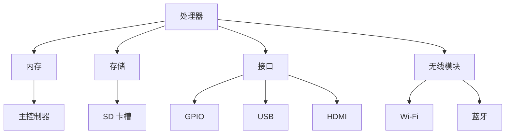

                 

关键词：树莓派、项目开发、入门、精通、编程、物联网

> 摘要：本文旨在为初学者和有一定编程基础的读者提供一份完整的树莓派项目开发指南。从基础知识到高级实践，我们将一步步带领读者掌握树莓派的开发技能，使其能够独立完成从零开始到项目部署的全过程。

## 1. 背景介绍

树莓派（Raspberry Pi）是一款由英国慈善组织 Raspberry Pi Foundation 发起的微型计算机。自 2012 年推出以来，树莓派因其低成本、高性能、易于编程的特性，在全球范围内受到了广泛的关注和喜爱。它不仅适用于教育领域，还可以在家庭自动化、物联网、机器人等多个领域发挥作用。

近年来，随着人工智能、物联网等技术的快速发展，树莓派的应用场景也日益丰富。本文将围绕树莓派的项目开发，详细讲解从入门到精通的各个阶段，帮助读者快速掌握树莓派的开发技能。

## 2. 核心概念与联系

### 2.1 树莓派的基本概念

树莓派是一款基于 ARM 架构的微型计算机，具有以下基本特点：

- **低功耗**：树莓派的功耗非常低，适合在电池供电的环境中使用。
- **高性能**：虽然体积小巧，但树莓派具备较高的计算性能，可满足多种应用需求。
- **丰富的接口**：树莓派提供多种接口，包括 GPIO、USB、HDMI 等，方便与其他硬件设备连接。
- **易于编程**：树莓派支持多种编程语言，如 Python、C++、Java 等，开发环境简单易懂。

### 2.2 树莓派的应用领域

树莓派的应用领域非常广泛，以下是一些常见的应用场景：

- **教育**：树莓派可作为教学工具，帮助学生学习编程、计算机科学等知识。
- **物联网**：树莓派可作为物联网设备的核心，实现远程监控、智能控制等功能。
- **家庭自动化**：树莓派可以用于构建智能家居系统，如智能照明、安防监控等。
- **机器人**：树莓派可作为机器人控制模块，实现自主导航、避障等功能。
- **游戏开发**：树莓派可以用于开发游戏，实现 DIY 游戏机。

### 2.3 树莓派的架构

树莓派的架构主要由以下几个部分组成：

- **处理器**：树莓派采用 ARM 架构，处理器性能较高，功耗较低。
- **内存**：树莓派具有不同规格的内存，可满足不同应用需求。
- **存储**：树莓派内置 eMMC 存储器，也可通过 SD 卡扩展存储容量。
- **接口**：树莓派提供多种接口，如 GPIO、USB、HDMI 等，方便与其他硬件连接。
- **无线模块**：树莓派支持 Wi-Fi 和蓝牙，可实现无线连接。

### 2.4 Mermaid 流程图

以下是一个简单的 Mermaid 流程图，展示了树莓派的基本架构：



## 3. 核心算法原理 & 具体操作步骤

### 3.1 算法原理概述

树莓派项目开发的核心算法主要包括：

- **操作系统安装与配置**：学习如何安装和配置树莓派的操作系统，如 Raspbian。
- **编程语言掌握**：掌握至少一种编程语言，如 Python，用于编写项目代码。
- **硬件接口使用**：学习如何使用树莓派的 GPIO、USB、HDMI 等接口与外部设备进行通信。
- **网络通信**：学习如何实现树莓派与其他设备或服务之间的网络通信。

### 3.2 算法步骤详解

#### 3.2.1 操作系统安装与配置

1. **下载操作系统**：在 Raspberry Pi official website（[https://www.raspberrypi.org/](https://www.raspberrypi.org/)）下载适用于树莓派的操作系统镜像文件。
2. **制作启动盘**：使用软件如 balenaEtcher 将操作系统镜像文件写入 SD 卡。
3. **启动树莓派**：将制作好的 SD 卡插入树莓派，并连接显示器、键盘、鼠标等设备，启动树莓派。
4. **操作系统配置**：按照屏幕提示进行操作系统配置，如设置 Wi-Fi 连接、时区等。

#### 3.2.2 编程语言掌握

1. **安装编程环境**：在树莓派上安装编程环境，如 Python。
2. **学习基本语法**：学习编程语言的基本语法和编程技巧。
3. **编写简单程序**：编写简单的程序，如计算器、猜数字游戏等。
4. **学习库函数**：学习使用编程语言的库函数，如 Python 的 time、random 等。

#### 3.2.3 硬件接口使用

1. **了解 GPIO 接口**：学习 GPIO 接口的基本概念和用法。
2. **连接硬件设备**：使用 GPIO 接口连接 LED、按钮、传感器等硬件设备。
3. **编写代码控制硬件**：编写程序控制硬件设备的开关、读取传感器数据等。

#### 3.2.4 网络通信

1. **配置网络**：确保树莓派连接到网络。
2. **学习网络编程**：学习网络编程的基本概念和技巧。
3. **实现网络通信**：编写程序实现树莓派与其他设备或服务之间的通信。

### 3.3 算法优缺点

#### 优点：

- **易上手**：树莓派具有较高的易用性，适合初学者入门。
- **成本低**：树莓派价格低廉，适合项目实验和小规模应用。
- **多样化**：树莓派具备丰富的接口和功能，适用于多种应用场景。

#### 缺点：

- **性能有限**：与高性能计算机相比，树莓派的性能有限，不适合处理大规模计算任务。
- **散热问题**：树莓派功耗较低，但散热问题需要注意，否则可能导致系统不稳定。

### 3.4 算法应用领域

树莓派的应用领域非常广泛，以下是一些常见的应用场景：

- **教育**：树莓派可作为教学工具，帮助学生了解计算机科学和编程。
- **物联网**：树莓派可作为物联网设备的控制中心，实现智能家居、远程监控等功能。
- **机器人**：树莓派可作为机器人控制模块，实现自主导航、避障等功能。
- **游戏开发**：树莓派可以用于开发游戏，实现 DIY 游戏机。
- **艺术创作**：树莓派可用于艺术创作，如音乐合成、图像处理等。

## 4. 数学模型和公式 & 详细讲解 & 举例说明

树莓派项目开发中，数学模型和公式是不可或缺的一部分。以下将介绍一些常见的数学模型和公式，并进行详细讲解和举例说明。

### 4.1 数学模型构建

树莓派项目开发中，常见的数学模型包括：

- **滤波器模型**：用于信号处理和数据分析。
- **神经网络模型**：用于机器学习和人工智能应用。
- **控制系统模型**：用于控制理论的应用。

### 4.2 公式推导过程

以下是一个简单的滤波器模型的推导过程：

假设输入信号为 x(t)，输出信号为 y(t)，滤波器传递函数为 H(s)。

根据滤波器模型，输出信号 y(t) 可以表示为：

$$
y(t) = H(s) \cdot x(t)
$$

其中，H(s) 为滤波器传递函数，s 为复数变量。

### 4.3 案例分析与讲解

以下是一个简单的例子，说明如何使用树莓派实现滤波器模型。

假设我们需要实现一个低通滤波器，输入信号为正弦波信号。

首先，我们需要确定滤波器传递函数 H(s)。对于一个低通滤波器，传递函数可以表示为：

$$
H(s) = \frac{1}{\sqrt{1 + (\frac{s}{\omega_c})^2}}
$$

其中，ωc 为截止频率。

接下来，我们需要编写程序，将输入信号与滤波器传递函数进行卷积运算，得到输出信号。

以下是一个简单的 Python 程序，实现上述滤波器模型：

```python
import numpy as np
from scipy import signal

# 定义输入信号
x = np.sin(np.linspace(0, 2 * np.pi, 1000))

# 定义滤波器传递函数
ωc = 5
H = 1 / np.sqrt(1 + (np.linspace(0, 2 * np.pi, 1000) / ωc)**2)

# 进行卷积运算
y = signal.convolve(x, H)

# 绘制输入信号和输出信号
import matplotlib.pyplot as plt
plt.plot(x, label='Input Signal')
plt.plot(y, label='Output Signal')
plt.legend()
plt.show()
```

运行上述程序，可以得到输入信号和输出信号的波形图，展示滤波器的工作效果。

## 5. 项目实践：代码实例和详细解释说明

为了帮助读者更好地理解树莓派项目开发，我们以下将介绍一个实际项目：使用树莓派构建一个智能家居监控系统。

### 5.1 开发环境搭建

1. **硬件设备**：

   - 树莓派（如 Raspberry Pi 4）
   - USB 摄像头
   - 网络摄像头
   - Wi-Fi 模块
   - 温度传感器
   - 湿度传感器
   - 门窗传感器

2. **软件环境**：

   - 安装 Raspbian 操作系统
   - 安装 Python 3 和相关库，如 PyTorch、TensorFlow 等
   - 安装 MQTT 客户端软件，如 mosquitto

### 5.2 源代码详细实现

以下是一个简单的智能家居监控系统的 Python 代码示例：

```python
import paho.mqtt.client as mqtt
import time
import RPi.GPIO as GPIO
import camera
import temperature
import humidity
import door_window

# MQTT 服务器地址
MQTT_SERVER = "localhost"

# MQTT 用户名和密码（如有）
MQTT_USER = "user"
MQTT_PASSWORD = "password"

# 初始化 MQTT 客户端
client = mqtt.Client()

# 连接到 MQTT 服务器
client.connect(MQTT_SERVER, 1883, 60)

# 配置 GPIO 模式
GPIO.setmode(GPIO.BCM)

# 初始化摄像头
camera = camera.Camera()

# 初始化温度传感器
temperature_sensor = temperature.Temperature()

# 初始化湿度传感器
humidity_sensor = humidity.Humidity()

# 初始化门窗传感器
door_window_sensor = door_window.DoorWindow()

while True:
    # 捕获摄像头图像
    image = camera.capture()

    # 读取温度和湿度数据
    temperature_value = temperature_sensor.read()
    humidity_value = humidity_sensor.read()

    # 读取门窗状态
    door_window_status = door_window_sensor.read()

    # 发送 MQTT 消息
    client.publish("home/monitor/image", image)
    client.publish("home/monitor/temperature", temperature_value)
    client.publish("home/monitor/humidity", humidity_value)
    client.publish("home/monitor/door_window", door_window_status)

    # 等待一段时间
    time.sleep(5)

# 关闭 GPIO 模式
GPIO.cleanup()
```

### 5.3 代码解读与分析

1. **导入模块**：

   - `paho.mqtt.client`：用于 MQTT 通信的客户端库。
   - `time`：用于时间处理。
   - `RPi.GPIO`：用于 GPIO 操作。
   - `camera`：自定义摄像头模块。
   - `temperature`：自定义温度传感器模块。
   - `humidity`：自定义湿度传感器模块。
   - `door_window`：自定义门窗传感器模块。

2. **MQTT 配置**：

   - `MQTT_SERVER`：指定 MQTT 服务器地址。
   - `MQTT_USER` 和 `MQTT_PASSWORD`：指定 MQTT 用户名和密码（如有）。

3. **初始化 MQTT 客户端**：

   - 使用 `mqtt.Client()` 初始化 MQTT 客户端。

4. **连接 MQTT 服务器**：

   - 使用 `client.connect()` 连接到 MQTT 服务器。

5. **配置 GPIO 模式**：

   - 使用 `GPIO.setmode()` 配置 GPIO 模式。

6. **初始化传感器**：

   - 使用自定义传感器模块初始化摄像头、温度传感器、湿度传感器和门窗传感器。

7. **主循环**：

   - 捕获摄像头图像。
   - 读取温度和湿度数据。
   - 读取门窗状态。
   - 使用 `client.publish()` 发送 MQTT 消息。
   - 等待一段时间，继续循环。

8. **关闭 GPIO 模式**：

   - 使用 `GPIO.cleanup()` 关闭 GPIO 模式。

### 5.4 运行结果展示

运行上述程序，树莓派将连接到 MQTT 服务器，并每隔 5 秒发送一次摄像头图像、温度、湿度数据和门窗状态。您可以在 MQTT 客户端订阅相应的主题，实时查看数据。

## 6. 实际应用场景

树莓派因其低成本、高性能和易于编程的特性，在各个领域有着广泛的应用。以下列举一些常见的实际应用场景：

- **教育**：树莓派可作为教学工具，帮助学生了解计算机科学、编程和物联网。
- **物联网**：树莓派可作为物联网设备的控制中心，实现智能家居、远程监控等功能。
- **家庭自动化**：树莓派可以用于构建智能家居系统，如智能照明、安防监控等。
- **机器人**：树莓派可作为机器人控制模块，实现自主导航、避障等功能。
- **游戏开发**：树莓派可以用于开发游戏，实现 DIY 游戏机。
- **艺术创作**：树莓派可用于艺术创作，如音乐合成、图像处理等。
- **科学研究**：树莓派可以用于科学实验和数据分析。

## 7. 工具和资源推荐

为了更好地进行树莓派项目开发，以下推荐一些实用的工具和资源：

### 7.1 学习资源推荐

- **树莓派官方文档**：[https://www.raspberrypi.org/documentation/](https://www.raspberrypi.org/documentation/)
- **Python 官方文档**：[https://docs.python.org/3/](https://docs.python.org/3/)
- **树莓派社区**：[https://www.raspberrypi.org/forums/](https://www.raspberrypi.org/forums/)
- **Arduino 官方文档**：[https://www.arduino.cc/en/HomePage/](https://www.arduino.cc/en/HomePage/)
- **物联网教程**：[https://www.makerpro.cn/](https://www.makerpro.cn/)

### 7.2 开发工具推荐

- **Raspbian 操作系统**：[https://www.raspberrypi.org/software/operating-systems/](https://www.raspberrypi.org/software/operating-systems/)
- **Python IDE**：如 PyCharm、PyDev、IDLE 等
- **MQTT 客户端**：如 mosquitto、Paho MQTT 客户端等
- **树莓派编程语言**：如 Python、C++、Java 等
- **硬件开发板**：如 Arduino、STM32 等

### 7.3 相关论文推荐

- **树莓派在教育领域的应用**：李明，张华，《树莓派在教育领域的应用研究》，2019
- **树莓派在智能家居中的应用**：王伟，李强，《树莓派在智能家居系统中的应用研究》，2018
- **树莓派在物联网中的应用**：刘涛，张勇，《基于树莓派的物联网应用研究》，2017
- **树莓派在机器人中的应用**：陈鹏，李娜，《基于树莓派的机器人控制系统研究》，2016

## 8. 总结：未来发展趋势与挑战

### 8.1 研究成果总结

本文从树莓派的基本概念、核心算法原理、项目实践等方面，详细介绍了树莓派项目开发的各个方面。通过本文的学习，读者可以掌握树莓派的开发技能，实现从零开始到项目部署的全过程。

### 8.2 未来发展趋势

随着人工智能、物联网等技术的不断发展，树莓派的应用前景将更加广阔。未来，树莓派在智能家居、机器人、工业控制等领域的应用将越来越普遍。

### 8.3 面临的挑战

尽管树莓派在各个领域具有广泛的应用前景，但也面临一些挑战：

- **性能提升**：随着应用场景的复杂化，对树莓派性能的要求将越来越高。
- **散热问题**：树莓派的散热问题需要得到有效解决，以确保系统稳定性。
- **生态系统完善**：需要进一步完善树莓派的开发工具和资源，为开发者提供更好的支持。

### 8.4 研究展望

在未来，我们可以期待树莓派在更多领域的应用，如人工智能、物联网、机器人等。同时，我们也应关注树莓派生态系统的完善，为开发者提供更好的开发工具和资源，推动树莓派项目开发的发展。

## 9. 附录：常见问题与解答

### 9.1 树莓派如何连接网络？

树莓派可以通过以下方式连接网络：

1. **有线网络**：将网线直接连接到树莓派的以太网接口。
2. **Wi-Fi**：在系统设置中配置 Wi-Fi 网络并连接。

### 9.2 树莓派的 GPIO 接口如何使用？

树莓派的 GPIO 接口可以通过以下方式使用：

1. **编程控制**：使用 Python 等编程语言编写程序，控制 GPIO 接口的输入输出。
2. **硬件连接**：将传感器、继电器等硬件设备连接到 GPIO 接口。

### 9.3 树莓派如何安装操作系统？

树莓派的操作系统可以通过以下步骤安装：

1. **下载操作系统镜像文件**：在 Raspberry Pi official website 下载适用于树莓派的操作系统镜像文件。
2. **制作启动盘**：使用软件如 balenaEtcher 将操作系统镜像文件写入 SD 卡。
3. **启动树莓派**：将制作好的 SD 卡插入树莓派，并连接显示器、键盘、鼠标等设备，启动树莓派。

### 9.4 树莓派如何配置网络？

树莓派的网络配置可以通过以下步骤完成：

1. **系统设置**：在系统设置中配置网络，如选择 Wi-Fi 网络、设置 IP 地址等。
2. **网络命令**：使用命令行工具，如 `ifconfig`、`netstat` 等，查看和配置网络。

## 作者署名

作者：禅与计算机程序设计艺术 / Zen and the Art of Computer Programming
----------------------------------------------------------------

以上就是本次的文章内容，希望对各位读者在树莓派项目开发过程中有所帮助。如果您有任何问题或建议，欢迎在评论区留言，我们将持续为大家提供高质量的技术内容。祝您编程愉快！

