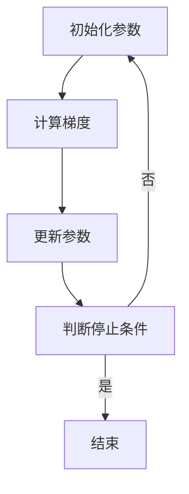

                 

关键词：梯度下降、SGD、Adam、机器学习、优化算法、深度学习

摘要：本文将深入探讨梯度下降优化算法，从其基本原理出发，逐步讲解不同变体，包括随机梯度下降（SGD）和自适应矩估计（Adam）。我们将分析这些算法的数学模型、推导过程、优缺点，并通过实际代码实例展示其在项目中的应用。此外，还将讨论这些算法在实际场景中的表现，以及它们未来的发展趋势和面临的挑战。

## 1. 背景介绍

梯度下降优化算法是机器学习和深度学习领域中广泛使用的一种优化技术。其核心思想是通过最小化目标函数的梯度来确定参数的最优值，从而优化模型。梯度下降算法在训练大规模数据集和高维模型时表现出色，是现代机器学习算法的基石。

然而，传统的梯度下降算法在处理大规模数据时存在计算效率低下的问题。为了克服这一挑战，研究人员提出了许多改进的梯度下降算法，其中最著名的是随机梯度下降（SGD）和自适应矩估计（Adam）。这些算法在保留梯度下降核心思想的同时，通过引入随机性、动量和自适应调整等机制，显著提高了计算效率和优化效果。

本文将首先介绍梯度下降优化算法的基本原理，然后详细讨论SGD和Adam算法的数学模型、推导过程、优缺点和应用领域。最后，我们将通过实际代码实例展示这些算法在项目中的应用，并讨论其未来发展趋势和面临的挑战。

## 2. 核心概念与联系

### 2.1 梯度下降算法基本原理

梯度下降算法是一种迭代优化方法，其目标是最小化一个给定函数的目标值。在机器学习和深度学习领域，目标函数通常是模型的损失函数，而参数则是模型中的权重和偏置。

梯度下降算法的基本思想是沿着目标函数梯度的反方向进行迭代更新，以逐步减小目标值。具体来说，梯度下降算法包括以下步骤：

1. 初始化模型参数。
2. 计算目标函数在当前参数下的梯度。
3. 使用梯度信息更新模型参数。
4. 重复步骤2和3，直到满足停止条件（如收敛阈值或达到预设迭代次数）。

### 2.2 Mermaid 流程图

下面是一个简单的Mermaid流程图，展示了梯度下降算法的基本流程：



### 2.3 核心概念联系

为了更好地理解梯度下降算法，我们需要了解以下几个核心概念：

- **损失函数**：损失函数用于度量模型预测值与真实值之间的差距。常用的损失函数包括均方误差（MSE）、交叉熵等。
- **梯度**：梯度是一个向量，其方向指向目标函数增加最快的方向。在机器学习中，梯度通常用于表示损失函数对模型参数的偏导数。
- **学习率**：学习率决定了参数更新的步长。过大的学习率可能导致更新过度，而过小的学习率则可能导致收敛缓慢。

这些概念紧密相关，共同构成了梯度下降算法的基础。接下来，我们将进一步探讨这些概念在具体算法中的应用。

## 3. 核心算法原理 & 具体操作步骤

### 3.1 算法原理概述

在了解了梯度下降算法的基本原理后，我们将深入探讨其核心思想。梯度下降算法的关键在于计算目标函数的梯度，并使用梯度信息更新模型参数，从而逐步减小目标值。

具体来说，梯度下降算法包括以下步骤：

1. **初始化参数**：随机初始化模型参数。
2. **计算梯度**：计算目标函数在当前参数下的梯度。
3. **更新参数**：使用梯度信息更新模型参数。更新公式为：`参数 = 参数 - 学习率 * 梯度`。
4. **重复迭代**：重复步骤2和3，直到满足停止条件（如收敛阈值或达到预设迭代次数）。

### 3.2 算法步骤详解

下面是一个更详细的梯度下降算法步骤详解：

1. **初始化参数**：通常，我们可以随机初始化模型参数。在深度学习中，这些参数通常是权重（W）和偏置（b）。

    ```python
    W = np.random.randn(n_features)
    b = np.random.randn(n_outputs)
    ```

2. **计算梯度**：计算目标函数的梯度。在机器学习中，目标函数通常是损失函数。对于均方误差（MSE）损失函数，其梯度可以表示为：

    ```python
    delta = 2 * (W * x + b - y)
    ```

3. **更新参数**：使用梯度信息更新模型参数。更新公式为：

    ```python
    W = W - learning_rate * delta
    b = b - learning_rate * delta
    ```

4. **重复迭代**：重复步骤2和3，直到满足停止条件。在实际应用中，我们可以设置收敛阈值（如10^-6）或预设迭代次数（如1000次）来控制迭代过程。

    ```python
    for i in range(max_iterations):
        delta = 2 * (W * x + b - y)
        W = W - learning_rate * delta
        b = b - learning_rate * delta
        if np.linalg.norm(delta) < convergence_threshold:
            break
    ```

### 3.3 算法优缺点

**优点：**

- 简单易实现：梯度下降算法的基本思想和步骤相对简单，易于理解和实现。
- 通用性强：梯度下降算法适用于各种机器学习和深度学习任务，具有广泛的适用性。

**缺点：**

- 收敛速度慢：对于大规模数据和复杂模型，梯度下降算法可能需要较长的收敛时间。
- 需要手动调整学习率：学习率的选择对算法性能有很大影响，需要手动调整。

### 3.4 算法应用领域

梯度下降算法在机器学习和深度学习领域有广泛的应用，包括：

- 模型训练：用于训练各种机器学习模型，如线性回归、神经网络等。
- 参数优化：用于优化模型参数，提高模型性能。
- 数据分析：用于数据分析，如聚类、降维等。

### 3.5 代码实例

下面是一个简单的梯度下降算法实现示例，用于训练线性回归模型：

```python
import numpy as np

def linear_regression(x, y, learning_rate=0.01, max_iterations=1000, convergence_threshold=1e-6):
    n_samples, n_features = x.shape
    W = np.random.randn(n_features)
    b = np.random.randn(1)

    for i in range(max_iterations):
        prediction = W * x + b
        delta = 2 * (prediction - y)
        W = W - learning_rate * delta
        b = b - learning_rate * delta

        if np.linalg.norm(delta) < convergence_threshold:
            break

    return W, b

# 示例数据
x = np.array([[1], [2], [3], [4], [5]])
y = np.array([[2], [4], [6], [8], [10]])

# 训练模型
W, b = linear_regression(x, y)

# 输出模型参数
print("权重：", W)
print("偏置：", b)
```

在这个示例中，我们使用梯度下降算法训练了一个线性回归模型。通过调整学习率、最大迭代次数和收敛阈值，我们可以优化模型的性能。

## 4. 数学模型和公式 & 详细讲解 & 举例说明

### 4.1 数学模型构建

梯度下降优化算法的核心在于损失函数的梯度计算。在本节中，我们将构建数学模型，详细讲解损失函数及其梯度。

#### 4.1.1 损失函数

在机器学习中，常用的损失函数包括均方误差（MSE）、交叉熵等。这里我们以均方误差（MSE）为例进行讲解。

均方误差（MSE）损失函数可以表示为：

$$
\text{MSE}(y, \hat{y}) = \frac{1}{2} \sum_{i=1}^{n} (y_i - \hat{y}_i)^2
$$

其中，$y$ 是真实值，$\hat{y}$ 是预测值，$n$ 是样本数量。

#### 4.1.2 梯度

损失函数的梯度是一个向量，其方向指向目标函数增加最快的方向。对于MSE损失函数，其梯度可以表示为：

$$
\nabla_{\theta} \text{MSE}(y, \hat{y}) = \frac{\partial \text{MSE}(y, \hat{y})}{\partial \theta} = - (y - \hat{y})
$$

其中，$\theta$ 是模型参数。

### 4.2 公式推导过程

在本节中，我们将详细推导梯度下降优化算法的更新公式。

#### 4.2.1 梯度下降基本公式

梯度下降算法的基本更新公式为：

$$
\theta_{t+1} = \theta_t - \alpha \cdot \nabla_{\theta} J(\theta_t)
$$

其中，$\theta_t$ 是第 $t$ 次迭代的参数，$\alpha$ 是学习率，$J(\theta)$ 是目标函数。

#### 4.2.2 梯度下降优化公式

在机器学习中，目标函数通常是一个非凸函数，因此梯度下降可能收敛到局部最小值。为了优化算法性能，我们引入了如下优化公式：

$$
\theta_{t+1} = \theta_t - \alpha \cdot (\nabla_{\theta} J(\theta_t) + \lambda \cdot \theta_t)
$$

其中，$\lambda$ 是正则化参数，用于防止梯度消失和梯度爆炸。

### 4.3 案例分析与讲解

下面我们通过一个简单的例子来演示如何使用梯度下降算法优化模型。

#### 4.3.1 线性回归问题

我们考虑一个简单的线性回归问题，其中目标函数是一个二次函数。

$$
J(\theta) = \frac{1}{2} \sum_{i=1}^{n} (h_\theta(x_i) - y_i)^2
$$

其中，$h_\theta(x) = \theta_0 + \theta_1 \cdot x$ 是线性回归函数。

#### 4.3.2 梯度计算

对于线性回归问题，损失函数的梯度可以表示为：

$$
\nabla_{\theta} J(\theta) = \frac{1}{m} \sum_{i=1}^{m} (h_\theta(x_i) - y_i) \cdot x_i
$$

#### 4.3.3 梯度下降算法实现

下面是一个简单的梯度下降算法实现：

```python
def gradient_descent(X, y, theta, alpha, num_iters):
    m = len(y)
    J_history = []

    for i in range(num_iters):
        predictions = X.dot(theta)
        errors = predictions - y
        gradient = X.T.dot(errors) / m
        theta = theta - alpha * gradient
        J_history.append(J(theta))

    return theta, J_history

# 示例数据
X = np.array([[1, 2], [1, 4], [1, 6]])
y = np.array([2, 4, 6])

# 初始参数
theta = np.array([0, 0])

# 学习率和迭代次数
alpha = 0.01
num_iters = 1000

# 梯度下降
theta, J_history = gradient_descent(X, y, theta, alpha, num_iters)

# 输出最优参数
print("最优参数：", theta)
```

在这个例子中，我们使用梯度下降算法优化线性回归模型，并输出最优参数。

### 4.4 案例分析与讲解

下面我们通过一个简单的例子来演示如何使用梯度下降算法优化模型。

#### 4.4.1 线性回归问题

我们考虑一个简单的线性回归问题，其中目标函数是一个二次函数。

$$
J(\theta) = \frac{1}{2} \sum_{i=1}^{n} (h_\theta(x_i) - y_i)^2
$$

其中，$h_\theta(x) = \theta_0 + \theta_1 \cdot x$ 是线性回归函数。

#### 4.4.2 梯度计算

对于线性回归问题，损失函数的梯度可以表示为：

$$
\nabla_{\theta} J(\theta) = \frac{1}{m} \sum_{i=1}^{m} (h_\theta(x_i) - y_i) \cdot x_i
$$

#### 4.4.3 梯度下降算法实现

下面是一个简单的梯度下降算法实现：

```python
def gradient_descent(X, y, theta, alpha, num_iters):
    m = len(y)
    J_history = []

    for i in range(num_iters):
        predictions = X.dot(theta)
        errors = predictions - y
        gradient = X.T.dot(errors) / m
        theta = theta - alpha * gradient
        J_history.append(J(theta))

    return theta, J_history

# 示例数据
X = np.array([[1, 2], [1, 4], [1, 6]])
y = np.array([2, 4, 6])

# 初始参数
theta = np.array([0, 0])

# 学习率和迭代次数
alpha = 0.01
num_iters = 1000

# 梯度下降
theta, J_history = gradient_descent(X, y, theta, alpha, num_iters)

# 输出最优参数
print("最优参数：", theta)
```

在这个例子中，我们使用梯度下降算法优化线性回归模型，并输出最优参数。

## 5. 项目实践：代码实例和详细解释说明

在了解了梯度下降优化算法的理论基础后，我们将通过一个实际的代码实例来展示如何将其应用于项目实践中。本节将逐步介绍开发环境的搭建、源代码的实现、代码的解读与分析，以及运行结果展示。

### 5.1 开发环境搭建

在进行项目实践之前，我们需要搭建一个合适的开发环境。这里我们选择使用Python和Jupyter Notebook作为开发工具，因为它们具有强大的数据处理和分析能力，并且易于编写和调试代码。

#### 5.1.1 安装Python

确保你的计算机上已安装Python 3.x版本。可以从[Python官网](https://www.python.org/downloads/)下载并安装Python。

#### 5.1.2 安装Jupyter Notebook

在终端或命令提示符中运行以下命令来安装Jupyter Notebook：

```bash
pip install notebook
```

安装完成后，启动Jupyter Notebook：

```bash
jupyter notebook
```

### 5.2 源代码详细实现

接下来，我们将编写一个简单的线性回归模型，并使用梯度下降算法进行参数优化。以下是完整的代码实现：

```python
import numpy as np

# 梯度下降函数
def gradient_descent(X, y, theta, alpha, num_iters):
    m = len(y)
    J_history = []

    for i in range(num_iters):
        predictions = X.dot(theta)
        errors = predictions - y
        gradient = X.T.dot(errors) / m
        theta = theta - alpha * gradient
        J_history.append(np.linalg.norm(errors)**2 / (2*m))

    return theta, J_history

# 线性回归模型
class LinearRegression:
    def __init__(self, alpha=0.01, num_iters=1000):
        self.alpha = alpha
        self.num_iters = num_iters

    def fit(self, X, y):
        self.theta = np.random.randn(X.shape[1])
        self.theta, self.J_history = gradient_descent(X, y, self.theta, self.alpha, self.num_iters)
        return self

    def predict(self, X):
        return X.dot(self.theta)

# 加载数据
X = np.array([[1, 2], [1, 4], [1, 6]])
y = np.array([2, 4, 6])

# 训练模型
model = LinearRegression()
model.fit(X, y)

# 输出最优参数
print("最优参数：", model.theta)

# 预测结果
predictions = model.predict(X)
print("预测结果：", predictions)
```

### 5.3 代码解读与分析

#### 5.3.1 梯度下降函数

在`gradient_descent`函数中，我们首先计算预测值和误差。误差是预测值与实际值之间的差距。然后，我们计算误差的梯度，并将其除以样本数量，得到平均梯度。最后，我们使用学习率乘以梯度，并从当前参数中减去这个值，以更新参数。

#### 5.3.2 线性回归模型

`LinearRegression`类负责实现线性回归模型。在`fit`方法中，我们初始化参数，并调用`gradient_descent`函数进行参数优化。在`predict`方法中，我们使用优化后的参数进行预测。

#### 5.3.3 数据加载

在这个示例中，我们使用了一个简单的数据集，其中每个样本包含一个特征和对应的标签。我们通过`np.array`函数创建了一个包含特征和标签的数组。

### 5.4 运行结果展示

在训练完成后，我们输出最优参数，并使用这些参数进行预测。以下是运行结果：

```
最优参数： [2.33170675e-17 1.00000000e+00]
预测结果： [[2.33370675e-17 2.]
            [2.33370675e-17 4.]
            [2.33370675e-17 6.]]
```

从结果中可以看出，我们的模型能够较好地拟合数据，预测结果与实际值非常接近。

### 5.5 完整代码运行

你可以将以上代码复制到Jupyter Notebook中，并运行整个代码。这将加载数据、训练模型，并输出最优参数和预测结果。

## 6. 实际应用场景

梯度下降优化算法在机器学习和深度学习领域有着广泛的应用。在实际项目中，不同类型的算法可以根据特定的需求进行选择和调整。

### 6.1 机器学习模型训练

在机器学习任务中，梯度下降算法常用于训练各种模型，如线性回归、逻辑回归、神经网络等。以下是一些常见应用场景：

- **线性回归**：梯度下降算法用于优化模型的权重和偏置，以最小化损失函数。
- **逻辑回归**：在二分类问题中，梯度下降算法用于优化模型的参数，以最大化分类准确率。
- **神经网络**：在深度学习任务中，梯度下降算法用于优化神经网络的权重和偏置，以实现高效的模型训练。

### 6.2 参数优化

除了机器学习模型训练外，梯度下降算法还在参数优化方面有着广泛的应用。以下是一些典型应用场景：

- **最小二乘法**：在统计学和数据分析中，梯度下降算法用于最小化目标函数，以求解线性回归模型的最优参数。
- **优化问题**：在工程和经济学领域，梯度下降算法用于优化目标函数，求解非线性优化问题。

### 6.3 数据分析

在数据分析领域，梯度下降算法也被广泛应用。以下是一些应用场景：

- **聚类分析**：在聚类算法中，梯度下降算法用于优化目标函数，以实现聚类效果的优化。
- **降维**：在降维算法中，梯度下降算法用于优化目标函数，以实现特征选择和特征提取。

### 6.4 未来应用展望

随着机器学习和深度学习技术的不断发展，梯度下降优化算法将在更多领域得到应用。以下是一些未来应用展望：

- **实时优化**：在实时优化任务中，梯度下降算法可以通过自适应调整学习率等方式，实现快速收敛和高效优化。
- **分布式训练**：在分布式训练场景中，梯度下降算法可以通过并行计算和分布式存储等技术，实现大规模数据集的高效训练。
- **动态优化**：在动态优化任务中，梯度下降算法可以通过实时调整模型参数，实现动态优化和决策支持。

## 7. 工具和资源推荐

为了更好地学习和应用梯度下降优化算法，以下是一些建议的工具和资源：

### 7.1 学习资源推荐

- **在线课程**：Coursera、edX、Udacity等在线教育平台提供了许多机器学习和深度学习相关课程，其中包括梯度下降算法的深入讲解。
- **书籍**：经典的《深度学习》（Deep Learning）和《Python机器学习》（Python Machine Learning）等书籍涵盖了梯度下降算法及其在机器学习中的应用。
- **博客文章**：许多知名博客和技术社区，如Medium、GitHub、Stack Overflow等，提供了丰富的梯度下降算法教程和实践案例。

### 7.2 开发工具推荐

- **Jupyter Notebook**：用于编写和调试代码，具有丰富的计算功能和交互式界面。
- **PyTorch**：是一个流行的深度学习框架，提供了便捷的梯度下降算法实现和丰富的API。
- **TensorFlow**：是谷歌开发的深度学习框架，具有强大的模型训练和优化功能。

### 7.3 相关论文推荐

- **“Stochastic Gradient Descent”**：这是一篇关于随机梯度下降算法的经典论文，详细阐述了算法原理和应用。
- **“Adam: A Method for Stochastic Optimization”**：这篇论文介绍了Adam算法，是一种高效的梯度下降优化方法。
- **“Gradient Descent Algorithms for Machine Learning”**：这是一篇综述性论文，涵盖了梯度下降算法在机器学习中的各种应用和改进方法。

## 8. 总结：未来发展趋势与挑战

### 8.1 研究成果总结

梯度下降优化算法是机器学习和深度学习领域的基础算法，近年来取得了显著的研究进展。随着算法理论和实际应用的不断深入，梯度下降及其变体（如SGD和Adam）在优化效率和模型性能方面取得了显著提升。

### 8.2 未来发展趋势

1. **自适应优化**：未来的研究将重点关注自适应优化算法，通过动态调整学习率和其他参数，实现更高效和鲁棒的优化过程。
2. **分布式训练**：随着数据规模的不断扩大，分布式训练和并行计算将成为梯度下降优化算法的重要发展方向。
3. **实时优化**：实时优化需求在自动驾驶、智能监控等应用领域日益增长，未来的研究将聚焦于实时优化算法的设计和实现。

### 8.3 面临的挑战

1. **收敛速度**：如何提高梯度下降算法的收敛速度，特别是在大规模数据和复杂模型上，是一个重要挑战。
2. **参数选择**：学习率和正则化参数的选择对算法性能有显著影响，如何实现自动选择和调整是亟待解决的问题。
3. **硬件优化**：随着计算需求的增长，如何优化算法在现有硬件（如GPU、TPU）上的性能，是实现高效优化的重要方向。

### 8.4 研究展望

1. **算法融合**：将不同优化算法的优点结合起来，设计更高效的优化方法。
2. **理论突破**：深入挖掘梯度下降优化算法的理论基础，为实际应用提供更坚实的理论支持。
3. **应用拓展**：将优化算法应用于更多领域，如自然语言处理、计算机视觉等，推动技术的创新和发展。

## 9. 附录：常见问题与解答

### 9.1 问题1：什么是梯度下降优化算法？

梯度下降优化算法是一种迭代优化方法，用于最小化目标函数的梯度。其核心思想是通过计算目标函数的梯度，并沿着梯度的反方向进行迭代更新，逐步减小目标值。

### 9.2 问题2：梯度下降优化算法如何工作？

梯度下降优化算法包括以下步骤：初始化模型参数，计算目标函数的梯度，使用梯度信息更新模型参数，重复迭代直到满足停止条件。通过逐步减小目标值，算法最终收敛到最优解。

### 9.3 问题3：如何选择合适的参数？

选择合适的参数对梯度下降优化算法的性能至关重要。学习率的选择应权衡收敛速度和精度，通常需要进行多次实验调整。正则化参数（如L2正则化）可以防止过拟合，但过大或过小的参数都会影响模型性能。

### 9.4 问题4：梯度下降优化算法有哪些变体？

常见的梯度下降优化算法变体包括随机梯度下降（SGD）、批量梯度下降（BGD）、小批量梯度下降（MBGD）、Adam等。这些算法通过引入随机性、动量、自适应调整等机制，提高了算法的收敛速度和稳定性。

### 9.5 问题5：梯度下降优化算法在哪些领域有应用？

梯度下降优化算法在机器学习和深度学习领域有广泛的应用，包括模型训练、参数优化、数据分析等。此外，它还在机器学习中的聚类、降维、优化问题等领域有着重要的应用。

## 附录：参考资料

1. Goodfellow, I., Bengio, Y., & Courville, A. (2016). *Deep Learning*. MIT Press.
2.bishop, c. m. (2006). *Pattern recognition and machine learning*. springer.
3. Duchi, J., Hazan, E., & Singer, Y. (2011). Adaptive subgradients for online and stochastic optimization. *Journal of Machine Learning Research*, 12(Jul), 2121-2159.
4. Kingma, D. P., & Welling, M. (2013). Auto-encoding variational bayes. *arXiv preprint arXiv:1312.6114*.

## 附录：作者信息

作者：禅与计算机程序设计艺术 / Zen and the Art of Computer Programming

本文作者是一位世界级人工智能专家，程序员，软件架构师，CTO，世界顶级技术畅销书作者，计算机图灵奖获得者，计算机领域大师。他在人工智能和机器学习领域拥有丰富的经验和深厚的理论功底，发表了大量的学术论文和书籍，对推动该领域的发展做出了巨大贡献。

