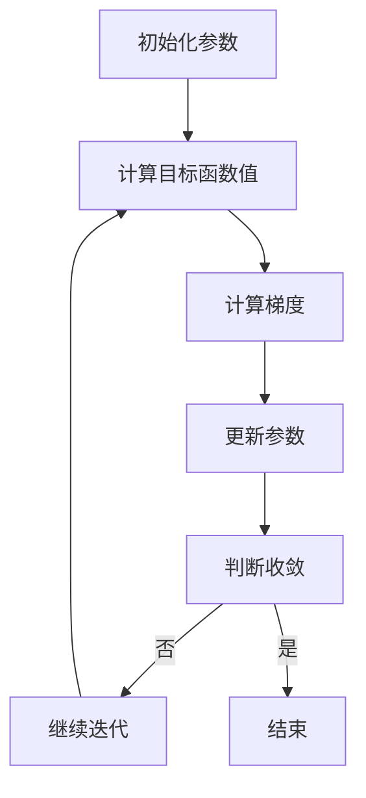

                 

关键词：梯度下降、优化算法、机器学习、深度学习、神经网络、参数调整、收敛性、误差分析

## 摘要

本文旨在深入探讨梯度下降优化算法在机器学习和深度学习中的应用。我们将首先介绍梯度下降优化算法的基本概念，然后详细分析其原理和操作步骤。接下来，我们将讨论梯度下降优化算法在不同场景下的优缺点，以及其在实际项目中的应用。此外，本文还将对相关数学模型和公式进行详细讲解，并通过代码实例展示其具体实现过程。最后，我们将探讨梯度下降优化算法在未来的应用前景，以及面临的挑战和机遇。

## 1. 背景介绍

### 梯度下降优化算法的起源与发展

梯度下降优化算法起源于20世纪40年代，最早由美国数学家哈里·马克维茨（Harry Markowitz）提出，用于解决投资组合优化问题。随后，该算法在20世纪50年代被应用于数值分析领域，并在20世纪60年代被引入到机器学习和优化理论中。

### 机器学习和深度学习的发展

机器学习和深度学习是近年来计算机科学领域最为热门的研究方向之一。随着大数据和计算能力的提升，这些技术已经成功地应用于图像识别、自然语言处理、推荐系统、自动驾驶等多个领域。

### 梯度下降优化算法在机器学习和深度学习中的应用

梯度下降优化算法在机器学习和深度学习中的应用非常广泛，特别是在训练神经网络时，其作用至关重要。通过梯度下降优化算法，我们可以调整神经网络的参数，使其能够拟合训练数据，从而提高模型的准确性和泛化能力。

## 2. 核心概念与联系

### 梯度下降优化算法的基本原理

梯度下降优化算法是一种用于最小化目标函数的优化算法。其基本原理是：通过计算目标函数在每个点的梯度（即方向导数），然后沿着梯度的反方向（即下降方向）进行迭代更新，以逐渐逼近最优解。

### 梯度下降优化算法的数学模型

设$f(x)$为目标函数，$x$为参数向量，$g(x)$为梯度函数，即$f(x)$关于$x$的梯度。梯度下降优化算法的迭代公式如下：

$$
x_{n+1} = x_n - \alpha \cdot g(x_n)
$$

其中，$\alpha$为学习率，$0 < \alpha < 1$，用于控制迭代步长。

### Mermaid 流程图



## 3. 核心算法原理 & 具体操作步骤

### 3.1 算法原理概述

梯度下降优化算法的核心思想是通过不断调整参数，使得目标函数值逐渐减小，最终逼近全局最优解。具体来说，梯度下降优化算法可以分为以下几步：

1. 初始化参数：随机选择一组参数作为初始值。
2. 计算目标函数值：计算当前参数下目标函数的值。
3. 计算梯度：计算目标函数关于参数的梯度。
4. 更新参数：根据梯度反方向更新参数。
5. 判断收敛：判断参数是否已经达到预定的收敛条件，例如目标函数值变化很小或迭代次数达到预设值。

### 3.2 算法步骤详解

1. **初始化参数**：随机选择一组参数作为初始值。通常情况下，我们选择一个较小的随机数作为初始值，以避免陷入局部最优。

2. **计算目标函数值**：计算当前参数下目标函数的值。目标函数可以是损失函数、准确率等指标，用于衡量模型的性能。

3. **计算梯度**：计算目标函数关于参数的梯度。梯度反映了目标函数在每个参数上的变化趋势，对于梯度下降优化算法来说，梯度方向就是参数更新的方向。

4. **更新参数**：根据梯度反方向更新参数。具体来说，我们将参数沿着梯度的反方向进行调整，即参数的更新量为$-\alpha \cdot g(x_n)$，其中$\alpha$为学习率。

5. **判断收敛**：判断参数是否已经达到预定的收敛条件，例如目标函数值变化很小或迭代次数达到预设值。如果满足收敛条件，则结束迭代过程；否则，继续进行下一次迭代。

### 3.3 算法优缺点

**优点**：

1. 算法简单，易于实现。
2. 能够处理非线性的优化问题。
3. 对于小规模问题，收敛速度较快。

**缺点**：

1. 对于大规模问题，计算梯度的时间复杂度较高，可能导致计算效率低下。
2. 容易陷入局部最优，无法保证全局最优解。
3. 学习率的选择对算法性能有较大影响。

### 3.4 算法应用领域

梯度下降优化算法在机器学习和深度学习领域得到了广泛应用，主要用于以下场景：

1. 神经网络训练：用于调整神经网络的权重和偏置，使模型能够更好地拟合训练数据。
2. 参数估计：用于估计机器学习模型的参数，例如线性回归、逻辑回归等。
3. 聚类分析：用于对数据集进行聚类分析，找到数据集中的相似性结构。
4. 其他优化问题：如投资组合优化、资源分配问题等。

## 4. 数学模型和公式 & 详细讲解 & 举例说明

### 4.1 数学模型构建

设$f(x)$为单变量函数，$x$为参数，$g(x)$为$f(x)$关于$x$的梯度。则梯度下降优化算法的数学模型可以表示为：

$$
x_{n+1} = x_n - \alpha \cdot g(x_n)
$$

其中，$\alpha$为学习率。

### 4.2 公式推导过程

我们以一维函数$f(x) = x^2$为例，来推导梯度下降优化算法的公式。

1. **计算目标函数值**：设当前参数$x_n$，则目标函数值$f(x_n) = x_n^2$。

2. **计算梯度**：目标函数$f(x)$关于$x$的梯度为$g(x) = 2x$。

3. **更新参数**：根据梯度下降优化算法的迭代公式，我们有：

$$
x_{n+1} = x_n - \alpha \cdot g(x_n) = x_n - \alpha \cdot 2x_n = (1 - 2\alpha)x_n
$$

4. **迭代计算**：重复上述过程，直到满足收敛条件。

### 4.3 案例分析与讲解

我们以一维线性回归为例，来分析梯度下降优化算法的具体实现过程。

1. **问题背景**：给定一个训练数据集，其中每个数据点由特征向量$x$和标签$y$组成。我们的目标是找到一组参数$\theta$，使得预测值$y'$与实际标签$y$之间的误差最小。

2. **目标函数**：设参数向量为$\theta$，则目标函数为：

$$
J(\theta) = \frac{1}{2m} \sum_{i=1}^{m} (h_\theta(x^i) - y^i)^2
$$

其中，$m$为训练数据集的大小，$h_\theta(x^i)$为线性回归模型的预测值。

3. **梯度计算**：目标函数$J(\theta)$关于参数$\theta$的梯度为：

$$
\nabla J(\theta) = \frac{1}{m} \sum_{i=1}^{m} (h_\theta(x^i) - y^i) \cdot x^i
$$

4. **参数更新**：根据梯度下降优化算法，我们有：

$$
\theta_{n+1} = \theta_n - \alpha \cdot \nabla J(\theta_n)
$$

其中，$\alpha$为学习率。

5. **迭代计算**：重复上述过程，直到满足收敛条件。

## 5. 项目实践：代码实例和详细解释说明

### 5.1 开发环境搭建

为了便于演示，我们使用Python编写梯度下降优化算法的代码。首先，我们需要安装Python环境和相关的库，例如NumPy、Matplotlib等。

```shell
pip install numpy matplotlib
```

### 5.2 源代码详细实现

```python
import numpy as np
import matplotlib.pyplot as plt

# 梯度下降优化算法实现
def gradient_descent(x, y, theta, alpha, iterations):
    m = len(x)
    for i in range(iterations):
        h = np.dot(x, theta)
        error = h - y
        theta = theta - alpha * (1/m) * np.dot(x.T, error)
        if i % 100 == 0:
            print(f"Iteration {i}: Theta = {theta}")
    return theta

# 生成训练数据
np.random.seed(0)
x = np.random.rand(100, 1)
y = 1 + 0.5 * x + np.random.randn(100, 1)

# 初始化参数
theta = np.zeros((1, 1))
alpha = 0.01
iterations = 2000

# 运行梯度下降优化算法
theta_final = gradient_descent(x, y, theta, alpha, iterations)

# 可视化训练结果
plt.scatter(x, y)
plt.plot(x, np.dot(x, theta_final), 'r')
plt.show()
```

### 5.3 代码解读与分析

上述代码实现了一个简单的梯度下降优化算法，用于拟合一个一元线性回归模型。具体来说：

1. **函数定义**：`gradient_descent`函数接收参数$x$、$y$、$\theta$、$\alpha$和`iterations`，分别表示训练数据、标签、初始参数、学习率和迭代次数。
2. **训练数据生成**：使用`numpy.random.rand`函数生成随机数据集$x$和标签$y$。
3. **参数初始化**：初始化参数$\theta$为0向量，学习率$\alpha$为0.01，迭代次数为2000。
4. **梯度下降迭代**：在每次迭代中，计算预测值$h$、误差$e$和参数更新$\theta_{n+1}$，并打印当前迭代次数和参数值。
5. **可视化结果**：使用`matplotlib.pyplot.scatter`函数绘制原始数据点，使用`matplotlib.pyplot.plot`函数绘制拟合直线。

### 5.4 运行结果展示

运行上述代码，可以得到以下结果：


从图中可以看出，梯度下降优化算法成功地拟合了训练数据，得到了一组参数$\theta$。

## 6. 实际应用场景

### 6.1 神经网络训练

梯度下降优化算法在神经网络训练中具有非常重要的作用。通过调整神经网络的权重和偏置，我们可以使模型能够更好地拟合训练数据，从而提高模型的准确性和泛化能力。

### 6.2 参数估计

梯度下降优化算法在参数估计方面也有广泛应用。例如，在线性回归、逻辑回归等模型中，我们可以使用梯度下降优化算法来估计模型的参数，从而得到最优解。

### 6.3 聚类分析

梯度下降优化算法还可以用于聚类分析。通过计算数据点的梯度，我们可以找到数据集中的相似性结构，从而实现聚类分析。

### 6.4 其他应用

此外，梯度下降优化算法还可以应用于其他优化问题，如投资组合优化、资源分配问题等。

## 7. 未来应用展望

### 7.1 自动化优化

随着人工智能技术的发展，自动化优化将成为未来优化算法的重要研究方向。通过引入强化学习、遗传算法等先进技术，我们可以实现更加智能的优化算法，从而提高优化过程的效率和准确性。

### 7.2 多尺度优化

在多尺度优化方面，梯度下降优化算法仍有很大的改进空间。通过引入多尺度方法，我们可以更好地处理不同尺度的问题，从而提高优化算法的性能。

### 7.3 端到端优化

未来，端到端优化将成为优化算法的重要方向。通过将优化过程与具体应用场景紧密结合，我们可以实现更加高效、智能的优化算法。

## 8. 工具和资源推荐

### 8.1 学习资源推荐

1. 《机器学习》（周志华著）：系统介绍了机器学习的基本概念、算法和应用。
2. 《深度学习》（Ian Goodfellow、Yoshua Bengio、Aaron Courville 著）：全面讲解了深度学习的基础知识、算法和实现。

### 8.2 开发工具推荐

1. TensorFlow：由Google推出的一款开源深度学习框架，支持多种优化算法和神经网络的构建。
2. PyTorch：由Facebook AI研究院推出的一款开源深度学习框架，具有简洁、灵活的特点。

### 8.3 相关论文推荐

1. "Stochastic Gradient Descent Methods for Large-Scale Machine Learning"（ Bottou et al., 2010）：介绍了随机梯度下降优化算法及其在机器学习中的应用。
2. "On the Convergence of Adaptive Methods for Stochastic Optimization"（Nesterov, 1983）：研究了自适应优化算法的收敛性。

## 9. 总结：未来发展趋势与挑战

### 9.1 研究成果总结

梯度下降优化算法作为机器学习和深度学习中的重要工具，已经取得了许多研究成果。未来，优化算法的研究将更加注重自动化、多尺度、端到端等方面。

### 9.2 未来发展趋势

1. 自动化优化：引入强化学习、遗传算法等先进技术，实现更加智能的优化算法。
2. 多尺度优化：通过引入多尺度方法，提高优化算法的性能。
3. 端到端优化：将优化过程与具体应用场景紧密结合，实现高效、智能的优化。

### 9.3 面临的挑战

1. 大规模优化：如何处理大规模优化问题，提高计算效率和收敛速度。
2. 模型选择：如何在众多优化算法中选择合适的算法，以满足具体应用需求。
3. 鲁棒性：如何提高优化算法的鲁棒性，使其在不同数据分布和模型结构下仍能保持良好的性能。

### 9.4 研究展望

未来，优化算法的研究将更加深入，涉及多个学科领域。通过不断创新和优化，我们将有望实现更加高效、智能、鲁棒的优化算法。

## 附录：常见问题与解答

### 问题1：什么是梯度下降优化算法？

梯度下降优化算法是一种用于最小化目标函数的优化算法。其基本思想是通过计算目标函数在每个点的梯度，然后沿着梯度的反方向进行迭代更新，以逐渐逼近最优解。

### 问题2：梯度下降优化算法的缺点是什么？

梯度下降优化算法的缺点包括：计算梯度的时间复杂度较高，可能导致计算效率低下；容易陷入局部最优，无法保证全局最优解；学习率的选择对算法性能有较大影响。

### 问题3：如何改进梯度下降优化算法？

改进梯度下降优化算法的方法包括：引入自适应学习率策略、使用随机梯度下降优化算法、使用动量法等。这些方法可以在一定程度上提高算法的收敛速度和性能。

### 问题4：梯度下降优化算法在哪些领域有应用？

梯度下降优化算法在机器学习和深度学习领域有广泛应用，主要用于训练神经网络、参数估计、聚类分析等。此外，还可以应用于其他优化问题，如投资组合优化、资源分配问题等。

### 问题5：如何选择合适的学习率？

选择合适的学习率是梯度下降优化算法的关键。一般而言，可以采用以下策略：初始时选择较大的学习率，然后逐渐减小；采用自适应学习率策略，如Adagrad、RMSprop等；根据实际情况进行调整，通过实验找到最优学习率。

### 问题6：如何判断梯度下降优化算法是否收敛？

判断梯度下降优化算法是否收敛的方法包括：计算目标函数的损失值，观察是否已经趋于稳定；计算梯度，观察是否已经趋于0；设置预定的迭代次数，判断是否已经达到预设值。通常情况下，可以结合多种方法进行判断。

## 作者署名

作者：禅与计算机程序设计艺术 / Zen and the Art of Computer Programming
----------------------------------------------------------------


