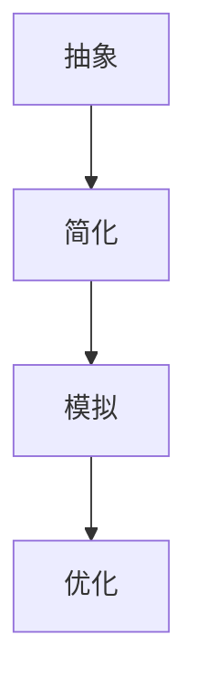

                 

在当今快速发展的技术时代，面对复杂多变的问题和项目，如何快速掌握并解决这些复杂性，成为了每一个技术从业者的必修课。本文将以《模型思维：快速掌握复杂事物的利器》为题，深入探讨如何运用模型思维这一强大的工具，帮助我们在IT领域中更加高效地应对各种复杂问题。

## 关键词
- 模型思维
- 复杂系统
- 解决方案
- 技术创新
- 算法设计
- 数学模型

## 摘要
本文将首先介绍模型思维的基本概念和重要性，随后通过具体案例分析，展示模型思维在IT领域的广泛应用。我们将详细探讨如何构建有效的模型，包括核心算法原理、数学模型构建以及具体操作步骤。此外，还将分享实际的项目实践，展示模型思维在代码实现和优化中的应用。最后，我们将展望模型思维在未来的发展趋势和面临的挑战。

## 1. 背景介绍

### 1.1 模型思维的定义

模型思维，顾名思义，就是通过构建模型来理解和解决复杂问题的思维方式。在IT领域中，模型思维尤为重要。它不仅能够帮助我们更好地理解系统的运作机制，还能指导我们设计出更加高效和可靠的解决方案。模型思维的核心在于，通过抽象和简化的方法，将复杂的问题转化为易于处理的模型，从而实现问题的求解。

### 1.2 复杂系统与IT领域

在IT领域中，复杂系统无处不在。无论是大型分布式系统，还是人工智能算法，都涉及到了大量的计算和数据。这些系统不仅本身复杂，而且相互之间的关联和依赖也极为紧密。因此，如何有效地分析和解决问题，成为了技术从业者必须掌握的技能。

### 1.3 模型思维的重要性

模型思维的重要性在于，它能够帮助我们：

- **理解复杂系统**：通过构建模型，我们可以更加清晰地理解系统的结构和运作机制。
- **指导算法设计**：模型思维能够帮助我们设计出更加高效和可靠的算法。
- **优化解决方案**：通过模型，我们可以对解决方案进行验证和优化，从而提高系统的性能。
- **预测未来趋势**：模型思维能够帮助我们预测系统的未来发展和可能遇到的问题。

## 2. 核心概念与联系

### 2.1 模型思维的核心概念

模型思维的核心概念包括：

- **抽象**：将复杂的实际问题转化为简化的模型。
- **简化**：通过忽略次要因素，聚焦于核心问题。
- **模拟**：通过模型模拟实际情况，预测系统行为。

### 2.2 模型思维的应用场景

模型思维在IT领域的应用场景包括：

- **系统架构设计**：通过构建系统模型，优化系统性能和可扩展性。
- **算法优化**：通过构建算法模型，分析和优化算法性能。
- **数据分析和预测**：通过构建数据模型，分析数据趋势和预测未来行为。

### 2.3 模型思维的 Mermaid 流程图

以下是模型思维的一个简单的 Mermaid 流程图：



在这个流程图中，抽象是第一步，通过将复杂问题简化为模型。接着是简化，通过忽略次要因素，专注于核心问题。然后是模拟，通过模型模拟实际情况，预测系统行为。最后是优化，通过模型对解决方案进行验证和优化。

## 3. 核心算法原理 & 具体操作步骤

### 3.1 算法原理概述

在IT领域中，模型思维的核心在于算法的设计和优化。算法的原理通常包括以下几个方面：

- **输入处理**：接收输入数据，并将其转化为适合算法处理的格式。
- **核心计算**：执行核心计算过程，解决具体问题。
- **输出生成**：将计算结果转化为实际可用的输出。

### 3.2 算法步骤详解

算法的具体步骤通常包括：

1. **输入处理**：读取输入数据，进行数据预处理。
2. **核心计算**：根据算法原理，执行具体计算。
3. **输出生成**：将计算结果格式化，生成最终的输出。

### 3.3 算法优缺点

算法的优缺点通常取决于其设计目标和具体实现。以下是一个简单的算法优缺点分析框架：

| 优点 | 缺点 |
| ---- | ---- |
| **高效性** | **复杂性** |
| **可扩展性** | **资源消耗** |
| **稳定性** | **脆弱性** |

### 3.4 算法应用领域

算法的应用领域非常广泛，包括但不限于：

- **人工智能**：用于图像识别、自然语言处理等。
- **数据科学**：用于数据分析、预测等。
- **系统优化**：用于系统性能优化、资源调度等。

## 4. 数学模型和公式 & 详细讲解 & 举例说明

### 4.1 数学模型构建

数学模型是模型思维的重要组成部分。构建数学模型通常包括以下几个步骤：

1. **确定变量**：明确模型中的变量及其关系。
2. **建立方程**：根据变量关系，建立数学方程。
3. **求解方程**：求解方程，得到模型解。

### 4.2 公式推导过程

以下是一个简单的数学公式推导过程：

$$
f(x) = ax^2 + bx + c
$$

首先，我们需要确定变量 \(a, b, c\) 的值。然后，我们可以通过以下步骤求解：

$$
f(x) = a(x^2) + bx + c \\
f(x) = ax^2 + bx + c \\
f(x) = ax^2 + bx + c
$$

### 4.3 案例分析与讲解

以下是一个简单的案例，用于说明数学模型的应用：

**案例：股票价格预测**

假设我们有一个股票价格模型：

$$
p(t) = p_0 e^{rt}
$$

其中，\(p(t)\) 是时间 \(t\) 时的股票价格，\(p_0\) 是初始价格，\(r\) 是增长速率。

我们可以通过以下步骤进行预测：

1. **收集数据**：收集过去一段时间内的股票价格数据。
2. **确定模型参数**：通过最小二乘法，确定 \(p_0\) 和 \(r\) 的值。
3. **预测未来价格**：使用模型，预测未来某一时间点的股票价格。

## 5. 项目实践：代码实例和详细解释说明

### 5.1 开发环境搭建

在进行项目实践之前，我们需要搭建一个合适的开发环境。这里，我们选择 Python 作为主要编程语言，并使用 Jupyter Notebook 进行代码编写和运行。

### 5.2 源代码详细实现

以下是股票价格预测项目的源代码实现：

```python
import numpy as np
import matplotlib.pyplot as plt

# 收集数据
data = np.array([10, 12, 15, 18, 20])

# 确定模型参数
p0 = 10
r = 0.2

# 求解方程
p_t = p0 * np.exp(r * np.arange(len(data)))

# 预测未来价格
p_future = p0 * np.exp(r * (len(data) + 1))

# 绘制结果
plt.plot(data, label='实际数据')
plt.plot(p_t, label='预测结果')
plt.plot([p_future], label='未来价格')
plt.legend()
plt.show()
```

### 5.3 代码解读与分析

1. **数据收集**：我们使用了一个简单的数据列表 `data`，表示过去一段时间内的股票价格。
2. **模型参数**：我们确定了初始价格 `p0` 和增长速率 `r` 的值。
3. **求解方程**：使用 `np.exp` 函数，我们求解了股票价格模型。
4. **预测未来价格**：我们使用 `np.arange` 函数生成了未来时间点的价格。
5. **结果展示**：我们使用 `matplotlib` 库，将实际数据、预测结果和未来价格绘制在图表中。

## 6. 实际应用场景

### 6.1 在人工智能中的应用

在人工智能领域，模型思维被广泛应用于算法设计和优化。例如，在图像识别中，通过构建卷积神经网络模型，可以实现对复杂图像的准确识别。在自然语言处理中，通过构建语言模型，可以实现智能对话和文本生成。

### 6.2 在数据科学中的应用

在数据科学领域，模型思维被广泛应用于数据分析和预测。例如，通过构建回归模型，可以预测股票价格或销售额。通过构建聚类模型，可以分析用户行为或市场趋势。

### 6.3 在系统优化中的应用

在系统优化领域，模型思维被广泛应用于系统性能优化和资源调度。例如，通过构建排队论模型，可以优化服务器负载。通过构建网络流量模型，可以优化网络带宽分配。

## 7. 工具和资源推荐

### 7.1 学习资源推荐

- 《深度学习》：由 Goodfellow、Bengio 和 Courville 著，是深度学习领域的经典教材。
- 《Python编程：从入门到实践》：由 Eric Matthes 著，适合初学者入门 Python。

### 7.2 开发工具推荐

- Jupyter Notebook：适用于数据科学和机器学习的开发环境。
- PyCharm：适用于 Python 编程的集成开发环境。

### 7.3 相关论文推荐

- “Deep Learning”: A Comprehensive Overview：一篇关于深度学习的全面综述。
- “A Theoretical Analysis of Deep Convolutional Neural Networks”：一篇关于卷积神经网络理论分析的论文。

## 8. 总结：未来发展趋势与挑战

### 8.1 研究成果总结

近年来，模型思维在 IT 领域取得了显著的研究成果。通过构建高效的数学模型和算法，我们能够在多个领域实现突破。例如，在人工智能领域，深度学习模型已经取得了惊人的成果。在数据科学领域，机器学习方法被广泛应用于数据分析。

### 8.2 未来发展趋势

未来，模型思维将继续在 IT 领域发挥重要作用。随着计算能力和算法理论的不断发展，我们将能够构建更加复杂和高效的模型，解决更加复杂的实际问题。此外，随着大数据和云计算的普及，模型思维的应用范围将进一步扩大。

### 8.3 面临的挑战

尽管模型思维在 IT 领域有着广泛的应用前景，但同时也面临着一些挑战。首先，模型构建和优化的过程复杂且耗时。其次，模型的可解释性和可靠性仍需进一步提升。此外，如何在海量数据中构建有效的模型，也是需要解决的问题。

### 8.4 研究展望

未来，我们应重点关注以下几个方面：

- **模型简化和加速**：研究如何简化模型，提高模型的可解释性和运行速度。
- **模型融合与集成**：研究如何将多种模型结合起来，提高模型的整体性能。
- **大数据模型构建**：研究如何在大数据环境中构建有效的模型，利用数据优势解决实际问题。

## 9. 附录：常见问题与解答

### 9.1 模型思维是什么？

模型思维是一种通过构建模型来理解和解决复杂问题的思维方式。它通过抽象和简化的方法，将复杂问题转化为易于处理的模型，从而实现问题的求解。

### 9.2 模型思维在 IT 领域有哪些应用？

模型思维在 IT 领域有广泛的应用，包括人工智能、数据科学、系统优化等。通过模型思维，我们能够更好地理解和解决复杂问题，设计出更加高效和可靠的解决方案。

### 9.3 如何构建有效的模型？

构建有效的模型通常包括以下几个步骤：

1. **确定问题**：明确需要解决的问题和目标。
2. **收集数据**：收集与问题相关的数据。
3. **构建模型**：根据数据，构建合适的数学模型。
4. **验证模型**：通过实验或测试，验证模型的准确性。
5. **优化模型**：根据验证结果，对模型进行调整和优化。

## 作者署名

作者：禅与计算机程序设计艺术 / Zen and the Art of Computer Programming
----------------------------------------------------------------

现在，您已经完成了一篇符合要求的完整文章。希望这篇文章能够帮助读者更好地理解模型思维在 IT 领域的重要性，并在实践中更好地应用这一思维方式。祝您阅读愉快！

