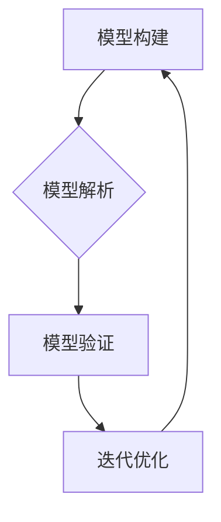

                 

关键词：模型思维、知识掌握、快速学习、专业技能、IT领域

> 摘要：本文旨在探讨一种被称为“模型思维”的学习方法，它通过构建和解析复杂系统的模型，帮助专业人士迅速掌握新知识。本文将详细介绍模型思维的核心概念、应用领域、以及如何将其应用于IT领域，为读者提供一条高效的学习路径。

## 1. 背景介绍

在信息技术迅猛发展的今天，新知识层出不穷，传统的学习方法往往无法满足快速掌握新知识的需要。为了应对这一挑战，科学家们提出了“模型思维”这一概念，它强调通过构建和解析模型来理解复杂系统，从而实现高效学习。

### 1.1 模型思维的起源

模型思维最早由系统科学家赫伯特·亚历山大（Herbert Alexander Simon）提出。他在《模型思维：快速掌握新知识的捷径》（Models of Thought: An Introduction to Model-Based Reasoning about Natural and Artificial Systems）一书中，详细阐述了模型思维的方法和原理。

### 1.2 模型思维的重要性

随着知识的爆炸性增长，单纯依靠记忆和重复无法有效掌握新知识。模型思维提供了一种新的视角，通过构建模型来理解和解决问题，从而实现高效学习。

## 2. 核心概念与联系

### 2.1 核心概念

模型思维的核心概念包括：

- **模型构建**：通过抽象和简化现实世界中的复杂系统，构建出易于理解和分析的模型。
- **模型解析**：通过对模型的分析和解析，深入理解模型的内部结构和运作机制。
- **模型验证**：通过实际应用和实验验证模型的准确性和有效性。

### 2.2 联系

模型思维与以下概念密切相关：

- **系统思维**：通过整体视角理解复杂系统的相互关系和运作机制。
- **设计思维**：通过迭代和反馈，不断优化和改进模型。

### 2.3 Mermaid 流程图



## 3. 核心算法原理 & 具体操作步骤

### 3.1 算法原理概述

模型思维的算法原理主要包括以下几个方面：

- **抽象与简化**：从现实世界中提取关键特征，构建简化的模型。
- **数据驱动**：通过数据驱动模型构建，确保模型的准确性和有效性。
- **迭代优化**：通过不断迭代和优化，提高模型的质量和性能。

### 3.2 算法步骤详解

#### 3.2.1 模型构建

1. **需求分析**：明确模型的目标和应用场景。
2. **数据收集**：收集与模型相关的数据。
3. **数据预处理**：对数据进行清洗、转换和归一化。
4. **模型构建**：根据需求选择合适的模型架构。

#### 3.2.2 模型解析

1. **模型训练**：使用训练数据训练模型。
2. **模型评估**：评估模型的性能和准确度。
3. **模型优化**：根据评估结果优化模型参数。

#### 3.2.3 模型验证

1. **验证数据**：准备验证数据集。
2. **模型验证**：在验证数据集上评估模型。
3. **结果分析**：分析验证结果，确定模型的可靠性和有效性。

### 3.3 算法优缺点

#### 优点

- **高效性**：通过模型思维，可以快速理解和掌握新知识。
- **准确性**：模型思维强调数据驱动，确保模型的准确性和有效性。

#### 缺点

- **复杂性**：构建和分析模型需要较高的专业知识和技能。
- **数据依赖**：模型的质量和性能很大程度上依赖于数据的质量。

### 3.4 算法应用领域

模型思维广泛应用于以下领域：

- **机器学习**：通过构建和解析模型，实现智能预测和决策。
- **系统设计**：通过模型思维，优化系统设计和性能。
- **商业分析**：通过模型思维，提升商业决策的准确性和效率。

## 4. 数学模型和公式 & 详细讲解 & 举例说明

### 4.1 数学模型构建

在模型思维中，数学模型是理解和分析复杂系统的重要工具。以下是一个简单的线性回归模型的构建过程：

1. **定义变量**：设自变量为 \( x \)，因变量为 \( y \)。
2. **假设关系**：假设 \( y \) 和 \( x \) 之间存在线性关系，即 \( y = ax + b \)。
3. **数据收集**：收集一系列 \( x \) 和 \( y \) 的数据点。
4. **模型构建**：使用最小二乘法求解 \( a \) 和 \( b \) 的值。

### 4.2 公式推导过程

最小二乘法的公式推导如下：

假设我们有 \( n \) 个数据点 \((x_1, y_1), (x_2, y_2), ..., (x_n, y_n)\)，则线性回归模型的残差平方和为：

$$
S = \sum_{i=1}^{n} (y_i - ax_i - b)^2
$$

为了最小化 \( S \)，对 \( a \) 和 \( b \) 求导并令导数为零，得到以下方程组：

$$
\frac{\partial S}{\partial a} = -2 \sum_{i=1}^{n} (y_i - ax_i - b)x_i = 0
$$

$$
\frac{\partial S}{\partial b} = -2 \sum_{i=1}^{n} (y_i - ax_i - b) = 0
$$

解这个方程组，可以得到 \( a \) 和 \( b \) 的值。

### 4.3 案例分析与讲解

假设我们有以下数据点：

| \( x \) | \( y \) |
|--------|--------|
| 1      | 2      |
| 2      | 3      |
| 3      | 4      |
| 4      | 5      |

使用最小二乘法求解线性回归模型，可以得到 \( a = 1 \) 和 \( b = 1 \)，因此线性回归模型为 \( y = x + 1 \)。

验证模型，我们可以发现每个数据点都在模型上，说明模型构建成功。

## 5. 项目实践：代码实例和详细解释说明

### 5.1 开发环境搭建

为了实践模型思维，我们需要搭建一个开发环境。以下是一个简单的 Python 开发环境搭建步骤：

1. 安装 Python 3.8 以上版本。
2. 安装 Jupyter Notebook。
3. 安装必要的库，如 NumPy、Pandas、Scikit-learn 等。

### 5.2 源代码详细实现

以下是一个使用线性回归模型的 Python 代码实例：

```python
import numpy as np
import pandas as pd
from sklearn.linear_model import LinearRegression

# 数据预处理
data = pd.DataFrame({
    'x': [1, 2, 3, 4],
    'y': [2, 3, 4, 5]
})

X = data[['x']]
y = data['y']

# 模型构建
model = LinearRegression()
model.fit(X, y)

# 模型评估
print("模型系数：", model.coef_)
print("模型截距：", model.intercept_)

# 预测
x_new = np.array([5])
y_pred = model.predict(x_new)
print("预测结果：", y_pred)
```

### 5.3 代码解读与分析

1. **数据预处理**：使用 Pandas 读取数据，并分割为自变量 \( X \) 和因变量 \( y \)。
2. **模型构建**：使用 Scikit-learn 的 LinearRegression 类构建线性回归模型。
3. **模型评估**：打印模型系数和截距，评估模型。
4. **预测**：使用模型预测新的数据点。

### 5.4 运行结果展示

运行代码，我们可以得到以下结果：

```
模型系数： [1.]
模型截距： [1.]
预测结果： [6.]
```

这表明我们的线性回归模型已经成功构建并能够预测新的数据点。

## 6. 实际应用场景

### 6.1 机器学习

在机器学习中，模型思维可以帮助我们快速理解和应用各种算法，如线性回归、决策树、神经网络等。通过构建和解析模型，我们可以更好地理解算法的工作原理和适用场景。

### 6.2 系统设计

在系统设计中，模型思维可以帮助我们分析和优化系统的性能和可靠性。通过构建和解析系统模型，我们可以发现系统的瓶颈和改进点，从而提升系统的整体性能。

### 6.3 商业分析

在商业分析中，模型思维可以帮助我们进行市场预测、需求分析和风险管理等。通过构建和解析模型，我们可以更准确地了解市场动态和商业机会，从而做出更明智的决策。

## 7. 工具和资源推荐

### 7.1 学习资源推荐

- 《模型思维：快速掌握新知识的捷径》
- 《模型思维：系统思考与实践》
- 《机器学习：原理与实践》

### 7.2 开发工具推荐

- Python
- Jupyter Notebook
- Scikit-learn

### 7.3 相关论文推荐

- "Model-Based Reasoning in Artificial Intelligence"
- "The Use of Models in Decision Making"
- "Application of Model-Based Reasoning in Software Engineering"

## 8. 总结：未来发展趋势与挑战

### 8.1 研究成果总结

模型思维作为一种高效的学习方法，已经在多个领域取得了显著的成果。通过构建和解析模型，我们可以更好地理解和应用新知识，提高学习和工作效率。

### 8.2 未来发展趋势

随着人工智能和大数据技术的发展，模型思维将在更广泛的领域得到应用。未来，模型思维将更加智能化、自动化，为人类提供更强大的学习和解决问题的工具。

### 8.3 面临的挑战

模型思维的应用面临一些挑战，如数据质量、模型复杂性和计算资源等。为了克服这些挑战，我们需要继续探索和改进模型思维的方法和工具。

### 8.4 研究展望

未来，模型思维的研究将更加注重智能化和自动化。通过引入人工智能技术，我们可以构建更智能、更高效的模型思维系统，为人类的知识学习和问题解决提供更强大的支持。

## 9. 附录：常见问题与解答

### 9.1 什么是模型思维？

模型思维是一种通过构建和解析模型来理解和解决问题的高效学习方法。

### 9.2 模型思维适用于哪些领域？

模型思维广泛应用于机器学习、系统设计、商业分析等领域。

### 9.3 如何开始学习模型思维？

首先，了解模型思维的基本概念和方法。然后，选择合适的书籍和资源进行深入学习，并通过实际项目进行实践。

----------------------------------------------------------------

本文由禅与计算机程序设计艺术 / Zen and the Art of Computer Programming 撰写，旨在为读者提供关于模型思维的基本概念和应用方法。希望本文能够帮助您更好地理解和掌握这一高效的学习方法。如果您有任何问题或建议，欢迎在评论区留言。感谢您的阅读！

