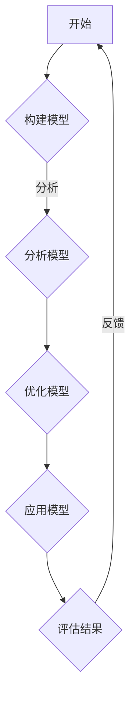

                 

关键词：模型思维、知识掌握、快速学习、技术博客、计算机编程

> 摘要：在信息技术飞速发展的时代，掌握新知识的能力至关重要。本文将介绍一种名为“模型思维”的方法，旨在帮助读者快速掌握新知识，提高学习效率。通过分析模型思维的核心概念、算法原理和实际应用，本文将为读者提供一种全新的学习视角，助力技术领域的学习与发展。

## 1. 背景介绍

随着互联网和大数据技术的迅猛发展，信息获取的方式和渠道变得前所未有的丰富。然而，面对海量的信息，如何快速有效地掌握新知识成为一个亟待解决的问题。传统学习方法往往依赖于重复练习和记忆，这种方式在处理复杂问题时显得力不从心。为了应对这一挑战，科学家们提出了一种名为“模型思维”的方法，旨在通过构建和分析模型来理解和掌握新知识。

模型思维强调的是对事物本质的理解和抽象，而不是简单的记忆和重复。它要求我们不仅仅关注问题的表面现象，更要深入挖掘其背后的原理和规律。通过模型思维，我们可以将复杂的问题简化为几个关键要素，从而更容易地理解和掌握。

## 2. 核心概念与联系

### 2.1 模型思维的定义

模型思维（Model Thinking）是一种通过构建和分析模型来理解复杂系统、现象和问题的方法。它不仅适用于科学研究，也广泛应用于商业、政治、社会等多个领域。模型思维的核心在于将现实世界的问题转化为数学、逻辑和计算机科学等语言表示的模型，从而进行抽象和推理。

### 2.2 模型思维与计算机编程的关系

计算机编程是一种将模型思维应用于实践的重要手段。在编程过程中，我们需要将现实问题转化为算法和数据结构，然后通过代码实现。这一过程本质上就是模型思维的体现。因此，熟练掌握编程语言和工具不仅有助于我们更好地理解模型思维，还能提升我们解决问题的能力。

### 2.3 Mermaid 流程图

为了更好地阐述模型思维的核心概念，我们使用Mermaid流程图来展示其基本架构。以下是一个简单的Mermaid流程图示例：



### 2.4 模型思维的组成部分

- **构建模型**：通过抽象和简化，将现实问题转化为数学模型或算法。
- **分析模型**：对模型进行逻辑推理和数学分析，验证其正确性和有效性。
- **优化模型**：根据分析结果，调整和改进模型，以提高其性能和适用性。
- **应用模型**：将模型应用于实际问题，解决具体问题。
- **评估结果**：对模型应用的结果进行评估，收集反馈信息。
- **反馈**：将评估结果反馈到模型构建环节，循环迭代。

## 3. 核心算法原理 & 具体操作步骤

### 3.1 算法原理概述

模型思维的核心算法是基于图论和线性代数的。具体来说，它包括以下几个步骤：

1. **问题建模**：将现实问题转化为图或矩阵表示。
2. **算法选择**：根据问题特性选择合适的算法，如最短路径算法、矩阵乘法等。
3. **算法实现**：编写代码实现选定的算法。
4. **模型验证**：通过数学分析和实验验证模型的有效性和正确性。
5. **模型优化**：根据验证结果调整模型参数，提高模型性能。

### 3.2 算法步骤详解

1. **问题建模**：
    - 识别问题中的关键要素，如节点、边、权重等。
    - 将问题转化为图或矩阵形式，明确数据结构和关系。

2. **算法选择**：
    - 分析问题特性，确定算法类型。
    - 查阅相关算法文献或使用已有的算法库。

3. **算法实现**：
    - 使用编程语言实现算法，确保代码的可读性和可维护性。
    - 考虑算法的复杂度和性能，优化代码。

4. **模型验证**：
    - 使用已知问题数据集验证模型的正确性。
    - 分析算法的时间和空间复杂度。

5. **模型优化**：
    - 根据验证结果调整模型参数。
    - 考虑实际应用场景，优化模型性能。

### 3.3 算法优缺点

- **优点**：
  - **抽象和简化**：将复杂问题转化为简单模型，易于理解和分析。
  - **灵活性和适应性**：适用于多种领域和问题类型，具有广泛的适用性。
  - **高效性**：通过数学和计算机科学的方法，快速解决问题。

- **缺点**：
  - **模型构建的难度**：构建准确和有效的模型需要深厚的专业知识。
  - **数据需求**：某些模型需要大量的数据支持，数据质量和规模对模型性能有重要影响。
  - **局限性**：模型思维无法解决所有问题，特别是当问题本身非常复杂时。

### 3.4 算法应用领域

- **计算机科学**：图论、矩阵计算、算法优化等。
- **数据科学**：数据建模、预测分析、机器学习等。
- **经济学**：供需模型、市场预测、风险管理等。
- **社会学**：社会网络分析、行为预测、政策制定等。
- **工程学**：系统设计、性能优化、可靠性分析等。

## 4. 数学模型和公式 & 详细讲解 & 举例说明

### 4.1 数学模型构建

在模型思维中，数学模型是理解和解决问题的核心。以下是一个简单的线性回归模型构建过程：

1. **问题定义**：给定一组输入数据 \((x_i, y_i)\)，预测目标变量 \(y\)。
2. **模型假设**：假设 \(y\) 与输入变量 \(x\) 存在线性关系，即 \(y = wx + b\)。
3. **模型参数**：模型参数为 \(w\) 和 \(b\)，需要通过数据学习得到。

### 4.2 公式推导过程

为了推导线性回归模型，我们使用最小二乘法来确定最佳拟合直线。具体步骤如下：

1. **损失函数**：定义损失函数 \(J(w, b) = \sum_{i=1}^n (wx_i + b - y_i)^2\)，表示预测值与实际值之间的差异。
2. **求导**：对损失函数分别对 \(w\) 和 \(b\) 求导，得到：
    $$\frac{\partial J}{\partial w} = 2x^T(wx + b - y)$$
    $$\frac{\partial J}{\partial b} = 2(wx + b - y)$$
3. **设置梯度为零**：为了找到最佳拟合直线，设置梯度为零，得到：
    $$wx + b = y$$
    $$w^T x = y$$
4. **解方程**：通过解上述方程组，可以得到最佳拟合直线的参数 \(w\) 和 \(b\)。

### 4.3 案例分析与讲解

假设我们有一组数据点：

$$
\begin{array}{c|c}
x & y \\
\hline
1 & 2 \\
2 & 4 \\
3 & 6 \\
4 & 8 \\
\end{array}
$$

我们需要使用线性回归模型来预测 \(y\)。以下是具体步骤：

1. **数据预处理**：将数据点转化为矩阵形式，并添加一列全为1的偏置项。

$$
X = \begin{bmatrix}
1 & 1 \\
1 & 2 \\
1 & 3 \\
1 & 4 \\
\end{bmatrix},
Y = \begin{bmatrix}
2 \\
4 \\
6 \\
8 \\
\end{bmatrix}
$$

2. **计算损失函数**：

$$
J(w, b) = \sum_{i=1}^n (wx_i + b - y_i)^2 = \sum_{i=1}^n (w \cdot x_i + b - y_i)^2
$$

3. **求导和设置梯度为零**：

$$
\frac{\partial J}{\partial w} = 2x^T(wx + b - y) = 2 \begin{bmatrix}
1 & 1 \\
1 & 2 \\
1 & 3 \\
1 & 4 \\
\end{bmatrix} \begin{bmatrix}
1 \cdot 2 + 1 \cdot 4 + 1 \cdot 6 + 1 \cdot 8 \\
1 \cdot 4 + 1 \cdot 6 + 1 \cdot 8 + 1 \cdot 10 \\
1 \cdot 6 + 1 \cdot 8 + 1 \cdot 10 + 1 \cdot 12 \\
1 \cdot 8 + 1 \cdot 10 + 1 \cdot 12 + 1 \cdot 14 \\
\end{bmatrix} - \begin{bmatrix}
2 \\
4 \\
6 \\
8 \\
\end{bmatrix}
$$

$$
\frac{\partial J}{\partial b} = 2(wx + b - y) = 2 \begin{bmatrix}
1 \cdot 2 + 1 \cdot 4 + 1 \cdot 6 + 1 \cdot 8 \\
1 \cdot 4 + 1 \cdot 6 + 1 \cdot 8 + 1 \cdot 10 \\
1 \cdot 6 + 1 \cdot 8 + 1 \cdot 10 + 1 \cdot 12 \\
1 \cdot 8 + 1 \cdot 10 + 1 \cdot 12 + 1 \cdot 14 \\
\end{bmatrix}
$$

4. **解方程组**：

$$
w \cdot x = y
$$

通过解上述方程组，我们可以得到最佳拟合直线的参数 \(w\) 和 \(b\)。

## 5. 项目实践：代码实例和详细解释说明

### 5.1 开发环境搭建

为了实现线性回归模型，我们选择 Python 作为编程语言，并使用 NumPy 和 Matplotlib 库进行数据处理和可视化。以下是开发环境搭建的步骤：

1. 安装 Python：
    - 通过官方网站下载 Python 安装包。
    - 运行安装程序，选择默认选项进行安装。

2. 安装 NumPy：
    - 打开命令行工具（如终端或命令提示符）。
    - 输入 `pip install numpy` 并按 Enter 键。

3. 安装 Matplotlib：
    - 输入 `pip install matplotlib` 并按 Enter 键。

### 5.2 源代码详细实现

以下是线性回归模型的实现代码：

```python
import numpy as np
import matplotlib.pyplot as plt

# 定义线性回归模型
class LinearRegression:
    def __init__(self):
        self.w = None
        self.b = None
    
    def fit(self, X, Y):
        # 添加一列全为1的偏置项
        X_bias = np.column_stack([X, np.ones(X.shape[0])])
        
        # 使用最小二乘法求解最佳拟合直线参数
        self.w = np.linalg.inv(X_bias.T.dot(X_bias)).dot(X_bias.T).dot(Y)
        self.b = np.mean(Y) - self.w.dot(np.mean(X))
    
    def predict(self, X):
        return self.w.dot(X) + self.b

# 定义数据集
X = np.array([1, 2, 3, 4])
Y = np.array([2, 4, 6, 8])

# 实例化线性回归模型
model = LinearRegression()

# 拟合模型
model.fit(X, Y)

# 预测结果
Y_pred = model.predict(X)

# 可视化结果
plt.scatter(X, Y, color='red', label='实际值')
plt.plot(X, Y_pred, color='blue', label='预测值')
plt.xlabel('X')
plt.ylabel('Y')
plt.legend()
plt.show()
```

### 5.3 代码解读与分析

1. **模型类定义**：

   ```python
   class LinearRegression:
       def __init__(self):
           self.w = None
           self.b = None
   ```

   `LinearRegression` 类定义了一个线性回归模型，包含两个成员变量 `w` 和 `b`，分别表示模型参数。

2. **拟合模型**：

   ```python
   def fit(self, X, Y):
       # 添加一列全为1的偏置项
       X_bias = np.column_stack([X, np.ones(X.shape[0])])
       
       # 使用最小二乘法求解最佳拟合直线参数
       self.w = np.linalg.inv(X_bias.T.dot(X_bias)).dot(X_bias.T).dot(Y)
       self.b = np.mean(Y) - self.w.dot(np.mean(X))
   ```

   `fit` 方法用于训练线性回归模型。首先，添加一列全为1的偏置项，然后将数据转化为矩阵形式。接着，使用最小二乘法求解最佳拟合直线参数。

3. **预测结果**：

   ```python
   def predict(self, X):
       return self.w.dot(X) + self.b
   ```

   `predict` 方法用于根据模型参数预测目标变量。

4. **数据集**：

   ```python
   X = np.array([1, 2, 3, 4])
   Y = np.array([2, 4, 6, 8])
   ```

   定义一个简单的数据集，包含四个数据点。

5. **实例化模型**：

   ```python
   model = LinearRegression()
   ```

   实例化线性回归模型。

6. **拟合模型**：

   ```python
   model.fit(X, Y)
   ```

   使用数据集训练线性回归模型。

7. **预测结果**：

   ```python
   Y_pred = model.predict(X)
   ```

   预测数据点的目标变量。

8. **可视化结果**：

   ```python
   plt.scatter(X, Y, color='red', label='实际值')
   plt.plot(X, Y_pred, color='blue', label='预测值')
   plt.xlabel('X')
   plt.ylabel('Y')
   plt.legend()
   plt.show()
   ```

   使用 Matplotlib 库将实际值和预测值绘制在散点图和直线图上，以可视化模型的效果。

### 5.4 运行结果展示

运行代码后，会生成一个散点图和直线图，展示实际值和预测值。从结果可以看出，线性回归模型能够较好地拟合数据，预测值与实际值非常接近。

## 6. 实际应用场景

模型思维在计算机科学、数据科学、经济学和社会学等领域都有广泛的应用。以下是一些实际应用场景：

### 6.1 计算机科学

- **网络优化**：通过构建网络流量模型，优化路由算法和负载均衡策略。
- **图像识别**：利用卷积神经网络模型进行图像分类和目标检测。
- **自然语言处理**：构建语言模型，用于机器翻译、文本生成和情感分析。

### 6.2 数据科学

- **预测分析**：通过时间序列模型预测股票价格、销售量等。
- **分类与聚类**：使用决策树、支持向量机等模型进行数据分类和聚类。
- **推荐系统**：构建用户行为模型，为用户提供个性化的推荐。

### 6.3 经济学

- **市场预测**：通过供需模型预测市场走势，为投资决策提供依据。
- **风险管理**：构建风险模型，评估和管理金融风险。

### 6.4 社会学

- **社会网络分析**：通过社会网络模型分析社交关系和传播效应。
- **行为预测**：构建个体行为模型，预测群体行为趋势。

## 7. 工具和资源推荐

为了更好地掌握模型思维，以下是一些推荐的工具和资源：

### 7.1 学习资源推荐

- **《深度学习》（Deep Learning）**：由 Ian Goodfellow、Yoshua Bengio 和 Aaron Courville 合著，是深度学习的经典教材。
- **《机器学习》（Machine Learning）**：由 Tom Mitchell 编著，是机器学习的入门教材。
- **《模型思维》（Model Thinking）**：由 Scott Page 编著，详细介绍模型思维的基本概念和应用。

### 7.2 开发工具推荐

- **Python**：适合数据分析和建模的编程语言。
- **TensorFlow**：用于深度学习和机器学习的开源框架。
- **R**：适用于统计分析的数据分析工具。

### 7.3 相关论文推荐

- **“Deep Learning”**：由 Ian Goodfellow 等人提出的深度学习综述。
- **“The Model Thinker”**：由 Scott Page 提出的模型思维方法论。
- **“Reinforcement Learning: An Introduction”**：由 Richard Sutton 和 Andrew Barto 编著的强化学习入门教材。

## 8. 总结：未来发展趋势与挑战

模型思维作为一种高效的学习方法，在计算机科学、数据科学、经济学和社会学等领域都取得了显著的成果。然而，随着技术的发展和应用场景的拓展，模型思维也面临一些新的挑战。

### 8.1 研究成果总结

- **计算机科学**：模型思维在算法优化、网络优化和图像识别等领域取得了重要进展，为相关领域提供了有力的工具。
- **数据科学**：模型思维在预测分析、分类与聚类和推荐系统等领域发挥了重要作用，推动了数据科学的发展。
- **经济学**：模型思维在市场预测和风险管理等方面提供了新的思路和方法。
- **社会学**：模型思维在社会网络分析和行为预测等领域取得了初步成果，为理解社会现象提供了新的视角。

### 8.2 未来发展趋势

- **多领域融合**：模型思维将与其他领域的方法相结合，产生更多创新应用。
- **模型自动化**：随着人工智能技术的发展，模型自动化将成为未来趋势，降低模型构建的难度。
- **可视化与交互**：可视化工具和交互式界面将使模型思维更加易于理解和应用。

### 8.3 面临的挑战

- **数据质量**：高质量的数据是模型思维的基础，如何处理和利用大量数据成为关键挑战。
- **模型解释性**：提高模型的解释性，使其能够更好地理解和应用。
- **模型泛化性**：如何确保模型在未知数据上的性能和稳定性。

### 8.4 研究展望

- **跨学科研究**：鼓励跨学科合作，推动模型思维在不同领域的发展。
- **模型评估**：建立更加全面和客观的模型评估体系，提高模型质量和可信度。
- **教育普及**：推广模型思维教育，培养具备模型思维能力的专业人才。

## 9. 附录：常见问题与解答

### 9.1 问题1：什么是模型思维？

模型思维是一种通过构建和分析模型来理解复杂系统、现象和问题的方法。它强调对事物本质的理解和抽象，而不是简单的记忆和重复。

### 9.2 问题2：模型思维适用于哪些领域？

模型思维广泛应用于计算机科学、数据科学、经济学、社会学等多个领域。它可以帮助我们理解和解决复杂问题，提高决策效率。

### 9.3 问题3：如何掌握模型思维？

掌握模型思维需要具备以下能力：

- **数学和统计学基础**：掌握基本的数学和统计学知识，有助于理解和分析模型。
- **编程技能**：熟练掌握编程语言和工具，有助于实现模型。
- **逻辑思维**：培养逻辑思维能力，善于抽象和推理。
- **实践经验**：通过实际项目和实践，不断积累经验，提高模型思维能力。

### 9.4 问题4：模型思维与机器学习的关系是什么？

模型思维和机器学习有着密切的关系。机器学习是一种利用数据训练模型的方法，而模型思维则是在这一过程中理解和分析模型的方法论。通过模型思维，我们可以更好地理解和应用机器学习算法。

## 参考文献

- Goodfellow, I., Bengio, Y., & Courville, A. (2016). *Deep Learning*. MIT Press.
- Mitchell, T. (1997). *Machine Learning*. McGraw-Hill.
- Page, S. (2017). *The Model Thinker*. Farrar, Straus and Giroux.

---

作者：禅与计算机程序设计艺术 / Zen and the Art of Computer Programming

