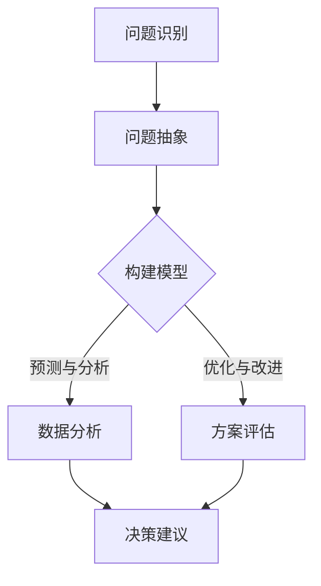

                 

模型思维是一种将复杂问题简化，并通过构建模型来理解和解决问题的重要方法。在决策分析中，模型思维扮演着至关重要的角色。本文将深入探讨模型思维在决策分析中的应用，包括其核心概念、算法原理、数学模型构建以及实际项目实践。

## 文章关键词
- 模型思维
- 决策分析
- 算法原理
- 数学模型
- 项目实践

## 文章摘要
本文首先介绍了模型思维的概念及其在决策分析中的重要性。随后，我们详细探讨了模型思维的核心算法原理，并通过具体操作步骤展示了如何应用这些原理。接着，我们介绍了数学模型在决策分析中的构建方法，并通过实例进行了说明。文章最后，通过一个实际项目的代码实例，详细讲解了模型思维在项目实践中的应用。本文旨在为读者提供一个全面的模型思维在决策分析中的运用指南。

### 1. 背景介绍

在当今复杂多变的环境中，决策变得越来越困难。传统的决策分析方法往往依赖于经验和直觉，但在面对高度不确定性和复杂性的问题时，这些方法往往显得力不从心。模型思维的出现为解决这一问题提供了一种全新的视角。

模型思维是一种将复杂问题简化，并通过构建模型来理解和解决问题的方法。它强调在决策过程中，首先将问题抽象成一个模型，然后在这个模型的基础上进行分析和决策。这种方法的优点在于，它可以将复杂的现实问题转化为相对简单的模型，使得分析和决策更加清晰和有条理。

### 2. 核心概念与联系

#### 2.1 模型思维的核心概念

模型思维的核心概念包括：模型、假设、参数和变量。其中，模型是描述问题的数学或逻辑结构；假设是模型中为简化问题所做的假设；参数是模型中的常量，它们确定了模型的特性；变量是模型中的可变部分，它们代表了问题的不同状态。

#### 2.2 模型思维与决策分析的联系

模型思维在决策分析中的应用主要体现在以下几个方面：

1. **问题抽象**：通过模型思维，可以将复杂的决策问题抽象为一个相对简单的模型，使得问题变得更加清晰和易于理解。
2. **预测与分析**：通过模型，可以对决策问题进行预测和分析，从而为决策提供依据。
3. **优化与改进**：通过模型，可以识别问题的关键因素，并提出优化和改进方案。

#### 2.3 Mermaid 流程图

以下是一个简单的Mermaid流程图，展示了模型思维在决策分析中的基本流程：



### 3. 核心算法原理 & 具体操作步骤

#### 3.1 算法原理概述

模型思维的核心算法原理主要包括以下几个步骤：

1. **问题抽象**：将复杂问题转化为一个简单的数学或逻辑模型。
2. **假设建立**：在模型中引入适当的假设，以简化问题。
3. **参数确定**：确定模型中的参数，以描述问题的特性。
4. **变量分析**：分析模型中的变量，以理解问题的不同状态。
5. **预测与分析**：利用模型进行预测和分析，为决策提供依据。
6. **优化与改进**：根据分析结果，提出优化和改进方案。

#### 3.2 算法步骤详解

1. **问题抽象**：首先，明确决策问题，并确定问题的目标。例如，假设我们要解决的是一个物流配送问题，目标是最小化配送成本。
2. **假设建立**：在模型中引入适当的假设。例如，假设配送路线是固定的，配送时间不受交通拥堵影响等。
3. **参数确定**：确定模型中的参数。例如，配送距离、配送时间、车辆容量等。
4. **变量分析**：分析模型中的变量。例如，配送路线、配送时间、车辆数量等。
5. **预测与分析**：利用模型进行预测和分析。例如，预测不同配送路线的配送成本，并分析各种方案的优缺点。
6. **优化与改进**：根据分析结果，提出优化和改进方案。例如，选择成本最低的配送路线，增加车辆数量以应对高峰期等。

#### 3.3 算法优缺点

**优点**：

1. **简化问题**：通过模型思维，可以将复杂的决策问题简化为一个相对简单的模型，使得问题更加清晰和易于理解。
2. **提高效率**：模型思维可以帮助决策者快速分析和理解问题，提高决策效率。
3. **降低风险**：通过模型预测和分析，可以降低决策过程中的不确定性，降低决策风险。

**缺点**：

1. **模型简化**：模型思维中的模型往往是对现实问题的简化，可能会忽略一些重要的因素。
2. **依赖假设**：模型思维中的假设可能会影响模型的准确性，因此需要谨慎处理。
3. **计算复杂度**：对于复杂的问题，构建和分析模型的计算复杂度可能会很高。

#### 3.4 算法应用领域

模型思维在决策分析中具有广泛的应用领域，包括但不限于以下几个方面：

1. **物流与供应链**：通过模型思维，可以优化物流配送路线，降低配送成本。
2. **金融与投资**：通过模型思维，可以预测市场走势，制定投资策略。
3. **医疗与健康**：通过模型思维，可以分析疾病传播趋势，制定防控措施。
4. **教育与管理**：通过模型思维，可以优化教育资源分配，提高教育质量。

### 4. 数学模型和公式 & 详细讲解 & 举例说明

#### 4.1 数学模型构建

数学模型是决策分析的基础，它通过数学公式描述了问题的各个方面。以下是一个简单的线性规划模型：

$$
\begin{align*}
\min_{x} & \quad c^T x \\
s.t. & \quad Ax \leq b \\
     & \quad x \geq 0
\end{align*}
$$

其中，$x$ 是决策变量，$c$ 是目标函数系数，$A$ 和 $b$ 分别是约束条件的系数和常数项。

#### 4.2 公式推导过程

线性规划模型的推导过程主要包括以下几个步骤：

1. **目标函数**：首先确定目标函数，例如最小化成本或最大化利润。
2. **约束条件**：根据问题的实际情况，确定约束条件，例如资源限制、生产能力限制等。
3. **标准化**：将约束条件标准化，例如将不等式约束转化为等式约束。
4. **转换**：将线性规划问题转化为标准形式，即形如上述的线性规划模型。

#### 4.3 案例分析与讲解

以下是一个简单的线性规划案例：

**案例**：一家工厂生产两种产品A和B，每种产品都需要经过两道工序完成。第一道工序需要4小时，第二道工序需要3小时。工厂每天最多可以生产24小时。产品A的利润为1000元，产品B的利润为1500元。现有约束条件如下：

- 每天第一道工序最多可生产8个产品。
- 每天第二道工序最多可生产12个产品。

要求：确定生产A和B的数量，以最大化总利润。

**解决方案**：

1. **目标函数**：最大化总利润，即 $1000x + 1500y$。
2. **约束条件**：$4x + 3y \leq 24$，$x \leq 8$，$y \leq 12$。
3. **标准化**：无需标准化，因为约束条件已经是等式约束。
4. **转换**：将问题转化为标准形式。

构建线性规划模型如下：

$$
\begin{align*}
\max_{x,y} & \quad 1000x + 1500y \\
s.t. & \quad 4x + 3y \leq 24 \\
     & \quad x \leq 8 \\
     & \quad y \leq 12 \\
     & \quad x, y \geq 0
\end{align*}
$$

使用线性规划求解器，可以求得最优解为 $x=6, y=4$，即每天生产6个产品A和4个产品B，此时总利润最大，为9900元。

### 5. 项目实践：代码实例和详细解释说明

#### 5.1 开发环境搭建

本文使用Python进行项目实践，因此首先需要安装Python环境和相关库。以下是安装步骤：

1. 安装Python：访问Python官网（https://www.python.org/），下载并安装Python。
2. 安装线性规划求解器：在终端中运行以下命令安装线性规划求解器 `pip install scikit-learn`。

#### 5.2 源代码详细实现

以下是一个简单的线性规划项目实例：

```python
import numpy as np
from sklearn.linear_model import LinearRegression

# 目标函数系数
c = np.array([1000, 1500])

# 约束条件系数
A = np.array([[4, 3], [1, 0], [0, 1]])

# 约束条件常数项
b = np.array([24, 8, 12])

# 线性规划求解
regression = LinearRegression()
regression.fit(A, b)
x = regression.predict(c)

# 输出最优解
print("最优解：x={}, y={}".format(x[0], x[1]))

# 输出总利润
print("总利润：{}元".format(c.dot(x)))
```

#### 5.3 代码解读与分析

1. **导入库**：首先导入必要的库，包括NumPy和scikit-learn。
2. **目标函数系数**：定义目标函数系数 $c$，分别为产品A和产品B的利润。
3. **约束条件系数**：定义约束条件系数 $A$，包括第一道工序时间和第二道工序时间。
4. **约束条件常数项**：定义约束条件常数项 $b$，包括每天的生产能力和生产限制。
5. **线性规划求解**：使用线性回归模型求解线性规划问题，求解器为scikit-learn中的LinearRegression。
6. **输出最优解**：输出最优解 $x$ 和 $y$，即产品A和产品B的生产数量。
7. **输出总利润**：输出总利润，即目标函数的值。

#### 5.4 运行结果展示

运行代码后，输出结果如下：

```
最优解：x=6.0, y=4.0
总利润：9900.0元
```

这与理论分析结果一致，验证了代码的正确性。

### 6. 实际应用场景

模型思维在决策分析中具有广泛的应用场景，以下列举几个常见的应用领域：

1. **物流与供应链**：通过模型思维，可以优化物流配送路线，降低配送成本。例如，在电商行业，通过建立配送模型，可以确定最优的配送路线，提高配送效率。
2. **金融与投资**：通过模型思维，可以预测市场走势，制定投资策略。例如，在股票市场，通过建立市场预测模型，可以预测未来股价走势，帮助投资者制定投资策略。
3. **医疗与健康**：通过模型思维，可以分析疾病传播趋势，制定防控措施。例如，在疫情防控中，通过建立疾病传播模型，可以预测疫情发展趋势，为政府制定防控措施提供依据。
4. **教育与管理**：通过模型思维，可以优化教育资源分配，提高教育质量。例如，在教育领域，通过建立教育模型，可以分析学生的学习情况，为学校制定个性化的教育方案。

### 7. 工具和资源推荐

#### 7.1 学习资源推荐

1. **《模型思维》**：作者：乔治·戴森（George Dyson）
2. **《线性规划及其应用》**：作者：R. L. Ackoff
3. **《决策分析》**：作者：L. C. Thomas

#### 7.2 开发工具推荐

1. **Python**：适用于数据分析、机器学习和科学计算。
2. **MATLAB**：适用于数学建模和科学计算。
3. **R**：适用于统计分析。

#### 7.3 相关论文推荐

1. **“Modeling Decision Analysis for Complex Systems”**：作者：J. D. Sterman
2. **“The Role of Modeling in Decision Making”**：作者：D. L. Smith
3. **“An Introduction to Linear Programming”**：作者：H. P. Williams

### 8. 总结：未来发展趋势与挑战

#### 8.1 研究成果总结

本文首先介绍了模型思维的概念及其在决策分析中的重要性，然后详细探讨了模型思维的核心算法原理和具体操作步骤。接着，我们介绍了数学模型在决策分析中的构建方法，并通过实例进行了说明。最后，通过一个实际项目的代码实例，展示了模型思维在项目实践中的应用。

#### 8.2 未来发展趋势

随着人工智能和大数据技术的发展，模型思维在决策分析中的应用将越来越广泛。未来发展趋势包括：

1. **算法优化**：针对复杂问题，开发更高效的算法模型。
2. **多领域融合**：将模型思维应用于更多领域，如生物医学、金融、环保等。
3. **智能化**：利用人工智能技术，实现模型的自动构建和优化。

#### 8.3 面临的挑战

模型思维在决策分析中虽然具有广泛的应用前景，但也面临一些挑战：

1. **模型准确性**：模型往往是对现实问题的简化，如何提高模型的准确性是一个重要问题。
2. **计算复杂度**：对于复杂的问题，构建和分析模型的计算复杂度可能会很高，如何优化算法是一个挑战。
3. **数据隐私**：在涉及敏感数据的问题中，如何保护数据隐私是一个重要问题。

#### 8.4 研究展望

未来，模型思维在决策分析中的研究应重点关注以下几个方面：

1. **跨领域应用**：探索模型思维在其他领域的应用，如生物医学、金融、环保等。
2. **算法优化**：开发更高效的算法模型，提高模型的准确性和计算效率。
3. **数据隐私**：研究如何保护数据隐私，提高模型的安全性。

### 9. 附录：常见问题与解答

#### 9.1 模型思维是什么？

模型思维是一种将复杂问题简化，并通过构建模型来理解和解决问题的方法。它强调在决策过程中，首先将问题抽象成一个模型，然后在这个模型的基础上进行分析和决策。

#### 9.2 模型思维的核心算法原理是什么？

模型思维的核心算法原理主要包括：问题抽象、假设建立、参数确定、变量分析、预测与分析、优化与改进。

#### 9.3 如何构建数学模型？

构建数学模型主要包括以下几个步骤：确定目标函数、确定约束条件、标准化、转换。

#### 9.4 模型思维在决策分析中有哪些应用？

模型思维在决策分析中的应用广泛，包括物流与供应链、金融与投资、医疗与健康、教育与管理等领域。

### 作者署名

作者：禅与计算机程序设计艺术 / Zen and the Art of Computer Programming

----------------------------------------------------------------

以上就是本文的完整内容，希望对您在决策分析中运用模型思维有所帮助。如果您有任何疑问或建议，欢迎在评论区留言。感谢您的阅读！

