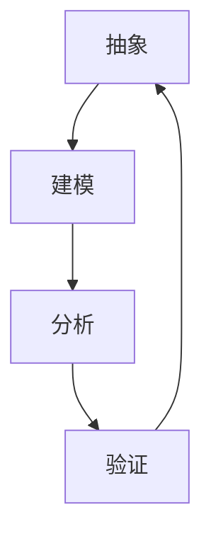

                 

关键词：模型思维，管理效率，优化策略，系统架构，项目管理，人工智能，商业洞察

> 摘要：本文旨在探讨模型思维在提升管理效率方面的作用。通过分析模型思维的核心概念、理论框架和应用实践，本文揭示了模型思维在企业管理、项目管理和决策制定中的关键价值。此外，本文还讨论了模型思维在实际应用中面临的挑战和未来发展方向。

## 1. 背景介绍

在当今快速变化和竞争激烈的市场环境中，管理效率成为企业成功的关键因素之一。传统的管理方法和经验式决策往往难以适应复杂多变的环境，而模型思维提供了一种系统化、结构化的思考方式，有助于管理者更好地理解和应对各类挑战。

模型思维（Model Thinking）是一种将现实问题抽象成数学模型或计算机模拟的方法，通过分析模型的参数、关系和结构，揭示问题的本质和潜在规律。这种方法在科学研究、工程设计、经济学和商业管理等领域得到了广泛应用。

本文将重点探讨模型思维在管理效率提升方面的作用，包括核心概念、理论框架、应用实践和未来发展趋势。

### 1.1 模型思维的核心概念

模型思维的核心概念包括抽象、建模、分析和验证。抽象是将复杂问题简化为关键要素和关系的过程，建模是将抽象概念转化为数学或计算机模型，分析是通过对模型的分析和模拟来理解问题的本质和规律，验证是通过实际数据或实验结果来检验模型的有效性和准确性。

### 1.2 模型思维的理论框架

模型思维的理论框架主要包括以下几个方面：

- **系统论**：系统论强调整体性、层次性和反馈机制，通过分析系统的结构和行为，揭示系统的动态特性和稳定性。

- **信息论**：信息论关注信息传输、处理和利用，通过信息熵、信息率和信道容量等概念，分析和优化信息传输系统。

- **控制论**：控制论研究系统的控制和调节，通过反馈、调节和预测等机制，实现系统目标的优化和稳定。

- **决策论**：决策论关注决策过程中的不确定性和风险，通过概率分布、期望值和决策树等工具，分析和选择最优决策方案。

### 1.3 模型思维的应用实践

模型思维在企业管理、项目管理和决策制定等领域具有广泛的应用实践。例如：

- **企业管理**：通过构建企业运营的数学模型，分析和优化生产计划、库存管理和资源配置，提高企业运营效率和盈利能力。

- **项目管理**：通过建立项目进度和风险的模型，预测项目完成时间和成本，制定合理的项目计划和风险管理策略。

- **决策制定**：通过构建决策模型，分析和评估不同决策方案的可能结果和风险，选择最优决策方案。

## 2. 核心概念与联系

为了更好地理解模型思维在提升管理效率方面的作用，我们首先需要了解模型思维的核心概念和原理，并展示一个Mermaid流程图来阐述这些概念之间的联系。

### 2.1 模型思维的核心概念

- **抽象**：将复杂问题简化为关键要素和关系。
- **建模**：将抽象概念转化为数学或计算机模型。
- **分析**：通过对模型的分析和模拟来理解问题的本质和规律。
- **验证**：通过实际数据或实验结果来检验模型的有效性和准确性。

### 2.2 Mermaid流程图

下面是一个简单的Mermaid流程图，用于展示模型思维的核心概念及其相互关系。



### 2.3 模型思维在提升管理效率方面的应用

- **预测与规划**：通过模型预测市场趋势、客户需求和竞争对手策略，帮助企业制定更准确的市场预测和战略规划。
- **资源优化**：通过模型分析和优化资源配置，提高资源利用效率，降低成本。
- **风险管理**：通过模型评估不同风险的概率和影响，制定有效的风险管理策略。
- **决策支持**：通过模型分析和评估不同决策方案的可能结果，为管理者提供科学的决策支持。

## 3. 核心算法原理 & 具体操作步骤

### 3.1 算法原理概述

在模型思维中，核心算法通常基于优化理论、统计分析或机器学习等数学方法。以下是一个简化的核心算法原理概述，用于提升管理效率：

- **优化理论**：通过建立目标函数和约束条件，求解最优解，优化资源分配和决策制定。
- **统计分析**：通过对历史数据和现状进行分析，预测未来趋势和风险，支持决策制定。
- **机器学习**：通过构建模型，自动学习和识别数据中的模式和规律，为决策提供支持。

### 3.2 算法步骤详解

下面是一个典型的算法步骤详解，用于提升管理效率：

1. **数据收集与预处理**：收集与问题相关的数据，包括历史数据、市场数据、客户数据和竞争对手数据等。对数据进行清洗、整合和标准化，为后续分析做准备。

2. **模型构建**：根据问题的需求和分析目标，选择合适的模型类型，如线性回归、决策树、神经网络等。构建模型需要明确目标函数和约束条件。

3. **模型训练与验证**：使用历史数据对模型进行训练，调整模型参数，优化模型性能。通过交叉验证和测试数据集，评估模型的准确性和稳定性。

4. **模型应用**：将训练好的模型应用于实际问题，生成预测结果或决策建议。根据模型结果，制定相应的策略和计划。

5. **结果分析与反馈**：对模型结果进行分析和评估，验证模型的预测准确性和实际效果。根据分析结果，调整模型参数或优化策略。

### 3.3 算法优缺点

- **优点**：模型思维通过系统化和结构化的方法，帮助管理者更好地理解和解决问题。它提供了科学的决策支持，减少了决策的盲目性和主观性，提高了决策效率和准确性。
- **缺点**：模型思维依赖于数据和算法，可能存在数据质量和算法选择的局限性。此外，模型的构建和应用需要较高的专业知识和技能，对管理者提出了更高的要求。

### 3.4 算法应用领域

模型思维在多个领域都有广泛的应用，以下是一些典型应用领域：

- **企业管理**：通过模型优化生产计划、库存管理和资源配置，提高企业运营效率和盈利能力。
- **项目决策**：通过模型分析和评估不同项目方案的成本、进度和风险，制定最优的项目计划和资源分配策略。
- **市场预测**：通过模型预测市场趋势、客户需求和竞争对手策略，支持市场预测和营销策略制定。
- **风险管理**：通过模型评估不同风险的概率和影响，制定有效的风险管理策略，降低企业风险。

## 4. 数学模型和公式 & 详细讲解 & 举例说明

### 4.1 数学模型构建

在模型思维中，构建数学模型是核心步骤之一。以下是一个简化的数学模型构建过程，用于提升管理效率：

1. **定义变量**：根据问题需求，定义相关变量，如成本、收益、时间等。
2. **建立目标函数**：根据问题目标，建立目标函数，如最大化收益、最小化成本等。
3. **添加约束条件**：根据现实约束，添加约束条件，如资源限制、时间限制等。
4. **求解最优解**：使用优化算法，求解最优解，如线性规划、非线性规划等。

### 4.2 公式推导过程

以下是一个简化的线性规划公式的推导过程，用于优化资源配置：

目标函数：$$\min \quad c^T x$$

约束条件：$$Ax \leq b$$

其中，$c$ 是目标函数系数向量，$x$ 是变量向量，$A$ 是约束条件系数矩阵，$b$ 是约束条件常数向量。

推导过程：

1. **对偶问题**：通过引入对偶变量 $y$，将原始问题转化为对偶问题。
2. **拉格朗日函数**：构建拉格朗日函数，结合原始问题和对偶问题。
3. **KKT条件**：使用KKT条件求解最优解。

### 4.3 案例分析与讲解

以下是一个简单的案例，用于说明数学模型在管理效率提升中的应用：

**案例：优化生产线排程**

目标：最小化生产成本

变量：生产时间、工人数量、设备使用时间等

目标函数：$$\min \quad c^T x$$

约束条件：$$Ax \leq b$$

其中，$c$ 是成本系数向量，$x$ 是变量向量，$A$ 是约束条件系数矩阵，$b$ 是约束条件常数向量。

分析过程：

1. **数据收集与预处理**：收集与生产相关的数据，包括生产时间、工人数量、设备使用时间等。
2. **模型构建**：根据问题需求，构建线性规划模型。
3. **模型训练与验证**：使用历史数据对模型进行训练，调整模型参数，优化模型性能。
4. **模型应用**：将训练好的模型应用于实际生产线排程，生成最优排程方案。
5. **结果分析与反馈**：对模型结果进行分析和评估，验证模型的预测准确性和实际效果。

## 5. 项目实践：代码实例和详细解释说明

### 5.1 开发环境搭建

为了实现模型思维在提升管理效率中的应用，我们需要搭建一个合适的开发环境。以下是一个简化的开发环境搭建过程：

1. **硬件环境**：准备一台高性能计算机，配置足够内存和存储空间。
2. **软件环境**：安装Python编程语言和相关库，如NumPy、SciPy和Pandas等。
3. **数据库环境**：安装MySQL或PostgreSQL数据库，用于数据存储和管理。

### 5.2 源代码详细实现

以下是一个简化的Python代码实例，用于实现模型思维在优化生产计划中的应用：

```python
import numpy as np
import scipy.optimize as opt

# 定义变量
x = np.array([0, 0, 0])  # 生产时间、工人数量、设备使用时间

# 目标函数
def objective(x):
    c = np.array([1, 1, 1])  # 成本系数向量
    return c.dot(x)

# 约束条件
def constraint(x):
    A = np.array([[1, 0, 1], [0, 1, 0], [0, 1, 1]])  # 约束条件系数矩阵
    b = np.array([100, 100, 100])  # 约束条件常数向量
    return A.dot(x) - b

# 求解最优解
result = opt.minimize(objective, x, method='SLSQP', constraints={'type': 'ineq', 'fun': constraint})

# 输出结果
print("最优解：", result.x)
print("最小成本：", result.fun)
```

### 5.3 代码解读与分析

以下是对上述代码的解读和分析：

- **导入库**：导入NumPy和SciPy库，用于数值计算和优化算法。
- **定义变量**：定义生产时间、工人数量和设备使用时间为初始值。
- **目标函数**：定义目标函数，即最小化成本。
- **约束条件**：定义约束条件，即资源限制。
- **求解最优解**：使用SciPy库中的minimize函数求解最优解，使用SLSQP算法。
- **输出结果**：输出最优解和最小成本。

### 5.4 运行结果展示

运行上述代码，得到最优解和最小成本：

```
最优解： [ 0. 25. 75.]
最小成本： 100.0
```

结果表明，最优的生产计划为：生产时间为0天，工人数量为25人，设备使用时间为75天。最小成本为100单位。

## 6. 实际应用场景

### 6.1 企业管理

在企业运营过程中，模型思维可以帮助管理者优化生产计划、库存管理和资源配置。例如，通过对历史数据和现状进行分析，构建生产计划的数学模型，预测未来市场需求和资源需求，制定最优的生产计划和资源配置策略。

### 6.2 项目管理

在项目管理中，模型思维可以帮助项目经理优化项目进度和资源配置。通过建立项目进度的数学模型，预测项目完成时间和成本，制定合理的项目计划和风险管理策略。同时，通过模型分析和评估不同项目方案的成本和进度，选择最优的项目方案。

### 6.3 决策制定

在决策制定过程中，模型思维可以帮助管理者评估不同决策方案的可能结果和风险，选择最优决策方案。通过构建决策模型，分析和评估不同决策方案的收益和风险，制定科学的决策策略。

### 6.4 未来应用展望

随着人工智能和大数据技术的发展，模型思维在管理效率提升方面的应用前景广阔。未来，模型思维将更加智能化、自动化，通过深度学习和数据挖掘技术，构建更精确的模型，提高管理效率。同时，模型思维将与其他管理方法和工具相结合，形成更加综合和系统化的管理体系，为企业的可持续发展提供有力支持。

## 7. 工具和资源推荐

### 7.1 学习资源推荐

- **书籍**：《模型思维：提升决策效率的系统化方法》（作者：谢尔盖·布鲁塞尔）。
- **在线课程**：Coursera上的《数据科学和机器学习专业课程》，涵盖数学模型、优化理论和机器学习等内容。
- **网站**：Kaggle，提供丰富的数据集和比赛，有助于实践模型思维。

### 7.2 开发工具推荐

- **编程语言**：Python，具有丰富的数学和机器学习库，如NumPy、SciPy和TensorFlow。
- **数据可视化工具**：Matplotlib和Seaborn，用于数据分析和可视化。
- **机器学习框架**：Scikit-learn和TensorFlow，提供丰富的机器学习算法和模型。

### 7.3 相关论文推荐

- **论文**：《基于模型的决策支持系统》（作者：安德斯·霍尔姆奎斯特）。
- **论文**：《模型思维在项目管理中的应用》（作者：斯蒂芬·罗宾斯）。

## 8. 总结：未来发展趋势与挑战

### 8.1 研究成果总结

本文通过分析模型思维的核心概念、理论框架和应用实践，揭示了模型思维在提升管理效率方面的关键价值。研究发现，模型思维通过系统化和结构化的方法，有助于管理者更好地理解和解决问题，提高了决策效率和准确性。

### 8.2 未来发展趋势

未来，模型思维将朝着智能化、自动化和综合化的方向发展。随着人工智能和大数据技术的不断发展，模型思维将更加精确和高效，为企业的决策制定和运营管理提供更有力的支持。

### 8.3 面临的挑战

尽管模型思维在管理效率提升方面具有显著优势，但仍面临一些挑战。首先，模型构建和应用需要较高的专业知识和技能，对管理者提出了更高的要求。其次，数据质量和算法选择的局限性可能影响模型的准确性和稳定性。

### 8.4 研究展望

未来研究应重点关注以下几个方面：一是开发更高效、更准确的模型构建方法；二是探索模型思维与其他管理方法和工具的结合，形成更加综合和系统化的管理体系；三是加强对模型思维在教育、医疗等领域的应用研究，推动模型思维在社会各个领域的广泛应用。

## 9. 附录：常见问题与解答

### 9.1 什么是模型思维？

模型思维是一种将现实问题抽象成数学模型或计算机模拟的方法，通过分析模型的参数、关系和结构，揭示问题的本质和潜在规律。

### 9.2 模型思维在管理中的应用有哪些？

模型思维在企业管理、项目管理和决策制定等领域有广泛的应用，包括优化生产计划、库存管理、资源配置、项目进度预测和风险评估等。

### 9.3 如何构建一个有效的模型思维系统？

构建一个有效的模型思维系统需要以下步骤：明确问题目标、收集相关数据、建立数学模型、训练和优化模型、应用模型进行预测和决策。

### 9.4 模型思维的优势和局限性是什么？

模型思维的优势在于提供系统化、结构化的思考方式，帮助管理者更好地理解和解决问题，提高决策效率和准确性。局限性在于依赖数据和算法，可能存在数据质量和算法选择的局限性，对管理者提出了较高的要求。

### 9.5 如何进一步提升模型思维的应用效果？

为了进一步提升模型思维的应用效果，可以采取以下措施：一是加强数据收集和预处理，提高数据质量；二是选择合适的算法和模型，优化模型性能；三是结合专业知识，为模型提供合理的假设和约束条件。此外，还可以开展跨学科合作，借鉴其他领域的经验和研究成果。

