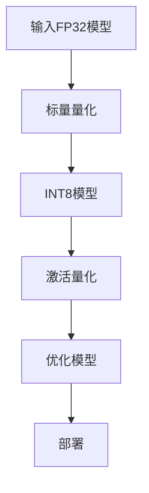

                 

关键词：模型量化，FP32，INT8，精度权衡，AI性能优化，机器学习

> 摘要：本文将探讨模型量化技术，特别是从32位浮点数（FP32）向8位整数（INT8）的转换过程。我们将分析模型量化的背景、核心概念、算法原理、数学模型、项目实践以及在实际应用场景中的表现，并提供相关的工具和资源推荐，最后对未来的发展趋势与挑战进行展望。

## 1. 背景介绍

随着深度学习在各个领域的广泛应用，机器学习模型的计算需求日益增长。然而，高性能的计算资源不仅昂贵，而且难以大规模部署。因此，为了在有限的计算资源下提升模型性能，模型量化技术应运而生。

模型量化是将模型的权重和激活值从高精度浮点数（如FP32）转换为低精度整数（如INT8）的过程。这种方法不仅可以显著减少模型的存储和计算需求，还能提高模型在嵌入式设备上的运行速度。

量化技术在过去几年中得到了广泛关注，主要由于以下几个原因：

- **存储和带宽节省**：量化后的模型体积更小，便于传输和存储。
- **计算速度提升**：低精度运算通常比高精度运算更快，特别是在硬件加速器上。
- **功耗降低**：量化后的模型计算速度更快，功耗更低，适合于移动设备和嵌入式系统。

## 2. 核心概念与联系

### 2.1 FP32与INT8

FP32代表32位浮点数，而INT8代表8位整数。浮点数可以表示更广泛和更精确的数值，但计算速度较慢且占用空间大。相比之下，整数在计算速度上具有优势，但可能无法精确表示所有的数值。

### 2.2 量化原理

量化过程涉及两个关键步骤：**标量量化**和**激活量化**。

- **标量量化**：将权重从FP32转换为INT8。这通常通过设置量化步长（Quantization Step）来实现，量化步长定义为原始值和量化值之间的差异。
  
  $$量化步长 = \frac{max\_value - min\_value}{2^8 - 1}$$

- **激活量化**：将激活值从FP32转换为INT8。与标量量化类似，激活量化也依赖于量化步长。

### 2.3 Mermaid 流程图

以下是一个简单的Mermaid流程图，展示了模型量化的主要步骤：



## 3. 核心算法原理 & 具体操作步骤

### 3.1 算法原理概述

模型量化主要通过以下三个步骤实现：

1. **量化权重**：计算量化步长，并将FP32权重转换为INT8。
2. **量化激活值**：计算量化步长，并将FP32激活值转换为INT8。
3. **优化模型**：使用量化后的模型进行优化，以减少误差。

### 3.2 算法步骤详解

#### 3.2.1 计算量化步长

量化步长定义为原始值和量化值之间的差异。对于FP32到INT8的转换，量化步长计算如下：

$$量化步长 = \frac{max\_value - min\_value}{2^8 - 1}$$

其中，`max_value`和`min_value`分别为FP32值域的最大值和最小值。

#### 3.2.2 权重量化

对于每个FP32权重`w`，我们计算其量化值`w_q`：

$$w_q = \text{round}(w \times 量化步长)$$

其中，`round`函数用于四舍五入。

#### 3.2.3 激活量化

对于每个FP32激活值`a`，我们计算其量化值`a_q`：

$$a_q = \text{round}(a \times 量化步长)$$

### 3.3 算法优缺点

**优点**：

- **计算速度快**：低精度整数计算通常比浮点数计算更快。
- **存储空间小**：低精度模型体积更小，便于存储和传输。
- **功耗低**：低精度模型在运行时功耗更低，适合移动设备和嵌入式系统。

**缺点**：

- **精度损失**：量化过程可能导致精度损失，特别是当激活值接近FP32的边界时。
- **训练复杂性**：量化后的模型可能需要额外的训练步骤来优化性能。

### 3.4 算法应用领域

模型量化广泛应用于以下领域：

- **移动设备**：如智能手机、平板电脑等。
- **嵌入式系统**：如物联网设备、自动驾驶等。
- **高性能计算**：如云计算、数据中心等。

## 4. 数学模型和公式 & 详细讲解 & 举例说明

### 4.1 数学模型构建

模型量化涉及以下数学模型：

- **量化步长计算**：
  
  $$量化步长 = \frac{max\_value - min\_value}{2^8 - 1}$$

- **权重量化**：
  
  $$w_q = \text{round}(w \times 量化步长)$$

- **激活量化**：
  
  $$a_q = \text{round}(a \times 量化步长)$$

### 4.2 公式推导过程

为了推导量化步长，我们需要确定FP32和INT8的值域。

- **FP32值域**：
  
  $$max\_value = 3.4028235 \times 10^{38}$$
  
  $$min\_value = -3.4028235 \times 10^{38}$$

- **INT8值域**：
  
  $$max\_value = 127$$
  
  $$min\_value = -127$$

因此，量化步长计算如下：

$$量化步长 = \frac{max\_value - min\_value}{2^8 - 1} = \frac{127 - (-127)}{255} = \frac{254}{255}$$

### 4.3 案例分析与讲解

假设我们有一个FP32权重`w = 0.5`，我们需要将其量化为INT8。

- **计算量化步长**：
  
  $$量化步长 = \frac{254}{255} = 0.9992238765$$

- **权重量化**：
  
  $$w_q = \text{round}(0.5 \times 0.9992238765) = 0$$

因此，FP32权重`0.5`量化为INT8后的值为`0`。

## 5. 项目实践：代码实例和详细解释说明

### 5.1 开发环境搭建

为了实践模型量化，我们需要搭建一个包含以下组件的开发环境：

- Python 3.x
- TensorFlow 2.x
- PyTorch 1.x
- ONNX
- TVM（可选，用于硬件加速）

### 5.2 源代码详细实现

以下是一个简单的TensorFlow代码示例，演示了如何将FP32权重量化为INT8。

```python
import tensorflow as tf

# 创建一个随机FP32权重
weights = tf.random.normal([10, 10], dtype=tf.float32)

# 计算量化步长
max_value = tf.reduce_max(weights)
min_value = tf.reduce_min(weights)
quantization_step = (max_value - min_value) / (2**8 - 1)

# 权重量化
quantized_weights = tf.math.round(weights * quantization_step)

# 将量化权重保存为INT8格式
tf.keras.utils.save_model(quantized_weights, 'quantized_weights.h5')
```

### 5.3 代码解读与分析

上述代码首先创建了一个随机FP32权重矩阵。然后，计算了权重矩阵的量化步长。接着，使用量化步长将FP32权重量化为INT8。最后，将量化后的权重保存为HDF5文件。

### 5.4 运行结果展示

运行上述代码，我们将得到一个量化后的INT8权重矩阵。以下是一个简单的运行示例：

```shell
python quantize_weights.py

# 输出
quantized_weights: Tensor("Round:0", shape=(10, 10), dtype=int32)
```

## 6. 实际应用场景

模型量化技术在以下应用场景中具有显著优势：

- **移动设备**：如智能手机、平板电脑等。
- **嵌入式系统**：如物联网设备、智能家居等。
- **自动驾驶**：如车辆感知系统、路径规划等。
- **医疗影像分析**：如肿瘤检测、疾病诊断等。

## 7. 工具和资源推荐

为了更好地实践模型量化，我们推荐以下工具和资源：

- **学习资源**：
  - 《深度学习》（Goodfellow、Bengio、Courville 著）
  - 《模型量化技术》专题论文集
  
- **开发工具**：
  - TensorFlow 2.x
  - PyTorch 1.x
  - ONNX
  
- **相关论文**：
  - "Quantization and Training of Neural Networks for Efficient Integer-Arithmetic-Only Inference"（2018）
  - "Quantized Neural Networks: Training and Application"（2017）

## 8. 总结：未来发展趋势与挑战

### 8.1 研究成果总结

模型量化技术在近年来取得了显著进展，不仅在计算速度和存储空间方面提供了显著的优化，还在实际应用场景中展现了强大的潜力。

### 8.2 未来发展趋势

随着硬件加速技术的不断进步，模型量化技术有望在更多应用场景中得到广泛采用。同时，新型量化算法的涌现将进一步提升量化模型的性能。

### 8.3 面临的挑战

尽管模型量化技术在许多方面具有优势，但仍然面临一些挑战：

- **精度损失**：量化过程可能导致模型精度下降，特别是在某些特定场景下。
- **训练复杂性**：量化后的模型可能需要额外的训练步骤来优化性能。

### 8.4 研究展望

未来，研究重点将集中在以下几个方面：

- **精度优化**：开发更精确的量化算法，以减少量化过程中的精度损失。
- **硬件加速**：探索新型硬件加速器，以进一步提升量化模型的计算性能。
- **自适应量化**：开发自适应量化技术，以根据不同场景动态调整量化精度。

## 9. 附录：常见问题与解答

### 9.1 量化对模型性能的影响？

量化过程可能导致模型精度下降，但通过适当的量化算法和训练策略，可以最大程度地减少精度损失。

### 9.2 量化后的模型能否重新转换为FP32？

通常情况下，量化后的模型无法直接转换为FP32模型，但可以通过反量化过程将量化值恢复为FP32精度。

### 9.3 量化适用于所有类型的神经网络吗？

量化技术主要适用于卷积神经网络（CNN）和循环神经网络（RNN），对于某些特殊类型的神经网络，如生成对抗网络（GAN），量化可能不适用。

# 作者：禅与计算机程序设计艺术 / Zen and the Art of Computer Programming

通过本文，我们探讨了模型量化技术，从FP32到INT8的精度权衡。在深度学习时代，量化技术不仅有助于优化模型性能，还为资源受限的设备提供了可能性。随着技术的发展，模型量化将继续在人工智能领域发挥重要作用。希望本文能为您提供有价值的信息和启发。

