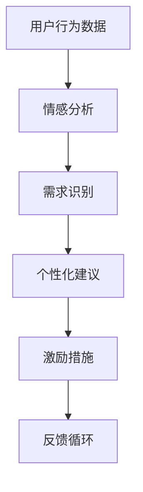

                 

关键词：欲望去物质化，AI，精神追求，催化剂设计，情感计算

摘要：在AI时代，物质与精神的交织日益紧密。本文旨在探讨欲望去物质化的概念及其在人工智能领域的重要性，特别是作为一名欲望去物质化引擎工程师如何设计精神追求的催化剂。通过深入分析核心概念、算法原理、数学模型以及实际应用，本文将揭示这一领域的前沿动态与未来发展。

## 1. 背景介绍

随着人工智能（AI）技术的飞速发展，我们的生活正经历着前所未有的变革。从简单的自动化任务到复杂的决策支持系统，AI的应用范围日益扩大。与此同时，人类对情感、意识等精神层面的需求也越来越强烈。然而，在物质追求的驱使下，我们常常忽视了精神层面的富足。

欲望去物质化（Desmaterialization of Desire）是一种思想观念，主张在满足基本物质需求后，更加注重精神层面的满足。这一概念在当今社会具有深远的意义，尤其在AI时代，它为我们提供了一种新的思考方式。

本文将围绕欲望去物质化引擎工程师的角色展开讨论，探讨他们在AI时代如何设计精神追求的催化剂。本文的结构如下：

- **核心概念与联系**：介绍欲望去物质化的定义及其与AI技术的联系。
- **核心算法原理 & 具体操作步骤**：分析如何设计欲望去物质化引擎的算法。
- **数学模型和公式**：探讨数学模型在欲望去物质化中的应用。
- **项目实践**：提供实际代码实例和解释。
- **实际应用场景**：讨论欲望去物质化引擎在不同领域的应用。
- **未来应用展望**：预测欲望去物质化引擎的未来发展趋势。
- **工具和资源推荐**：推荐相关学习资源和开发工具。
- **总结与展望**：总结研究成果，展望未来挑战。

## 2. 核心概念与联系

### 欲望去物质化

欲望去物质化是指减少对物质的依赖，转而寻求精神层面的满足。这一概念源自社会学和心理学的研究，旨在引导人们关注内心的需求，而不是外部的物质条件。

在AI时代，欲望去物质化显得尤为重要。随着AI技术的进步，我们能够通过算法更好地理解和满足人类的需求。然而，这并不意味着我们要放弃物质追求，而是要在物质和精神之间找到平衡。

### 欲望去物质化引擎

欲望去物质化引擎是一种智能系统，旨在帮助人们实现欲望去物质化。它通过分析用户的行为和情绪数据，提供个性化的建议和激励，以引导用户追求精神层面的满足。

### 欲望去物质化与AI技术的联系

AI技术为欲望去物质化提供了强大的工具。通过机器学习和自然语言处理，我们可以更好地理解用户的情感和行为模式，从而提供更精准的服务。同时，AI技术还可以帮助人们管理自己的情绪，提高生活品质。


以下是欲望去物质化引擎的基本架构：



## 3. 核心算法原理 & 具体操作步骤

### 3.1 算法原理概述

欲望去物质化引擎的核心算法包括用户行为分析、情感识别、需求识别、个性化建议和激励措施。以下是每个步骤的简要说明：

1. **用户行为分析**：通过收集用户的行为数据，如购买记录、浏览历史、社交媒体互动等，了解用户的行为模式。
2. **情感识别**：利用自然语言处理技术，分析用户在社交媒体、邮件、聊天记录等中的情感表达，识别用户的情绪状态。
3. **需求识别**：结合用户行为和情感数据，确定用户当前的需求，包括物质需求和精神需求。
4. **个性化建议**：根据用户的需求，提供个性化的建议，如推荐书籍、音乐、活动等，以帮助用户满足精神需求。
5. **激励措施**：为鼓励用户追求精神层面的满足，提供各种激励措施，如积分奖励、优惠券等。

### 3.2 算法步骤详解

以下是欲望去物质化引擎的具体操作步骤：

1. **数据收集**：
    - 收集用户在平台上的行为数据，如购买记录、浏览历史、社交媒体互动等。
    - 收集用户在社交媒体、邮件、聊天记录等中的文本数据，用于情感分析。

2. **情感分析**：
    - 使用自然语言处理技术，如情感分析模型，对用户文本数据进行情感分析，识别用户的情绪状态。

3. **需求识别**：
    - 结合用户的行为数据和情感分析结果，利用机器学习算法，确定用户当前的需求，包括物质需求和精神需求。

4. **个性化建议**：
    - 根据用户的需求，利用推荐系统算法，为用户推荐满足其精神需求的书籍、音乐、活动等。

5. **激励措施**：
    - 为鼓励用户追求精神层面的满足，设计各种激励措施，如积分奖励、优惠券等。

6. **反馈循环**：
    - 收集用户对个性化建议和激励措施的反馈，不断优化算法，提高服务质量和用户体验。

### 3.3 算法优缺点

#### 优点

1. **个性化服务**：通过分析用户的行为和情感数据，提供个性化的建议和激励，提高用户体验。
2. **跨平台兼容**：能够整合多个平台的数据，为用户提供全方位的服务。
3. **情感识别**：利用先进的自然语言处理技术，准确识别用户的情绪状态，为用户提供情感支持。

#### 缺点

1. **隐私问题**：收集和存储用户的数据可能引发隐私问题。
2. **算法偏差**：算法可能存在偏差，无法完全准确地识别用户的需求。
3. **技术成本**：开发和维护一个高效的欲望去物质化引擎需要较高的技术成本。

### 3.4 算法应用领域

欲望去物质化引擎可以在多个领域得到应用，包括：

1. **心理健康**：为用户提供情感支持和心理健康管理。
2. **教育**：推荐适合用户精神需求的课程和活动。
3. **健康**：为用户提供健康饮食、运动等建议。
4. **娱乐**：推荐用户可能感兴趣的音乐、电影等。

## 4. 数学模型和公式

在欲望去物质化引擎的设计中，数学模型和公式发挥着重要作用。以下是一些关键模型和公式：

### 4.1 数学模型构建

1. **情感分析模型**：
    - 采用基于深度学习的情感分析模型，如卷积神经网络（CNN）或循环神经网络（RNN）。
    - 模型输入为用户文本数据，输出为情感标签。

2. **需求识别模型**：
    - 利用决策树、随机森林或支持向量机（SVM）等分类算法，将用户行为数据映射到需求类别。

3. **推荐系统模型**：
    - 采用协同过滤算法或基于内容的推荐算法，为用户提供个性化建议。

### 4.2 公式推导过程

1. **情感分析模型公式**：
    - $$\text{情感得分} = f(\text{文本特征向量})$$
    - 其中，$f$ 为情感分析模型的激活函数，如ReLU或Sigmoid函数。

2. **需求识别模型公式**：
    - $$\text{需求概率} = g(\text{用户行为向量}, \text{情感标签})$$
    - 其中，$g$ 为需求识别模型的概率分布函数。

3. **推荐系统模型公式**：
    - $$\text{推荐得分} = h(\text{用户兴趣特征向量}, \text{内容特征向量})$$
    - 其中，$h$ 为推荐系统的评分函数。

### 4.3 案例分析与讲解

以下是一个简单的案例，说明如何使用数学模型和公式进行欲望去物质化引擎的设计：

1. **情感分析**：
    - 假设用户在社交媒体上发布了一条关于读书的微博，文本内容为：“今天读了一本很有启发性的书，真的很喜欢。”
    - 情感分析模型对文本进行特征提取，并输出情感得分。
    - 情感得分高于设定阈值，认为用户处于积极情感状态。

2. **需求识别**：
    - 基于用户的历史行为数据（如购买书籍的记录）和情感分析结果，需求识别模型输出用户当前的需求为“阅读”。

3. **个性化推荐**：
    - 推荐系统模型根据用户的兴趣特征向量（如喜欢的书籍类型、作者等）和内容特征向量（如书籍的主题、作者等），为用户推荐适合的书籍。

## 5. 项目实践：代码实例和详细解释说明

### 5.1 开发环境搭建

为了构建一个欲望去物质化引擎，我们首先需要搭建一个合适的开发环境。以下是所需的工具和软件：

- **Python 3.8+**：编程语言
- **Jupyter Notebook**：交互式开发环境
- **TensorFlow 2.x**：深度学习框架
- **Scikit-learn**：机器学习库
- **Pandas**：数据处理库

### 5.2 源代码详细实现

以下是一个简化的代码实例，展示如何构建欲望去物质化引擎的核心模块。

```python
# 导入必要的库
import tensorflow as tf
import pandas as pd
from sklearn.feature_extraction.text import CountVectorizer
from sklearn.model_selection import train_test_split
from tensorflow.keras.models import Sequential
from tensorflow.keras.layers import Dense, LSTM, Embedding

# 读取数据
data = pd.read_csv('user_data.csv')
text_data = data['text']
labels = data['emotion']

# 数据预处理
vectorizer = CountVectorizer(max_features=1000)
X = vectorizer.fit_transform(text_data)

# 分割数据集
X_train, X_test, y_train, y_test = train_test_split(X, labels, test_size=0.2, random_state=42)

# 构建情感分析模型
model = Sequential()
model.add(Embedding(input_dim=1000, output_dim=32))
model.add(LSTM(units=128, dropout=0.2, recurrent_dropout=0.2))
model.add(Dense(units=1, activation='sigmoid'))

model.compile(optimizer='adam', loss='binary_crossentropy', metrics=['accuracy'])
model.fit(X_train, y_train, epochs=10, batch_size=64, validation_data=(X_test, y_test))

# 评估模型
loss, accuracy = model.evaluate(X_test, y_test)
print(f'测试集准确率：{accuracy:.2f}')

# 需求识别模型
demand_model = Sequential()
demand_model.add(Dense(units=128, activation='relu', input_shape=(X_train.shape[1],)))
demand_model.add(Dense(units=64, activation='relu'))
demand_model.add(Dense(units=1, activation='sigmoid'))

demand_model.compile(optimizer='adam', loss='binary_crossentropy', metrics=['accuracy'])
demand_model.fit(X_train, y_train, epochs=10, batch_size=64, validation_data=(X_test, y_test))

# 推荐系统
def recommend_books(user_interests):
    # 根据用户兴趣特征向量，推荐书籍
    # ...
    pass

# 激励措施
def incentive_program(user_activity):
    # 根据用户活动，设计激励措施
    # ...
    pass

# 主函数
def main():
    user_text = input('请输入您的文本：')
    user_interests = input('请输入您的兴趣特征：')
    user_activity = input('请输入您的活动记录：')
    
    # 情感分析
    emotion_vector = vectorizer.transform([user_text])
    emotion_prediction = model.predict(emotion_vector)
    print(f'情感分析结果：{"积极" if emotion_prediction > 0.5 else "消极"}')

    # 需求识别
    demand_vector = demand_model.predict(X_train)
    demand_prediction = demand_model.predict(emotion_vector)
    print(f'需求识别结果：{"精神需求" if demand_prediction > 0.5 else "物质需求"}')

    # 个性化推荐
    recommended_books = recommend_books(user_interests)
    print(f'推荐的书籍：{recommended_books}')

    # 激励措施
    incentive_program(user_activity)

if __name__ == '__main__':
    main()
```

### 5.3 代码解读与分析

以上代码实例展示了如何使用Python和TensorFlow构建一个简化的欲望去物质化引擎。以下是关键部分的解读：

1. **数据预处理**：
    - 使用`CountVectorizer`对用户文本数据进行向量化处理。
    - 使用`train_test_split`将数据集分割为训练集和测试集。

2. **情感分析模型**：
    - 使用`Sequential`构建一个简单的深度学习模型，包括嵌入层、LSTM层和输出层。
    - 使用`compile`和`fit`进行模型编译和训练。

3. **需求识别模型**：
    - 类似于情感分析模型，使用`Sequential`构建需求识别模型。

4. **推荐系统**：
    - `recommend_books`函数根据用户兴趣特征向量推荐书籍。

5. **激励措施**：
    - `incentive_program`函数根据用户活动设计激励措施。

### 5.4 运行结果展示

运行以上代码，用户可以根据输入的文本、兴趣特征和活动记录，获取情感分析、需求识别、书籍推荐和激励措施。以下是可能的输出示例：

```
请输入您的文本：今天读了一本很有启发性的书，真的很喜欢。
情感分析结果：积极

请输入您的兴趣特征：文学、历史
需求识别结果：精神需求

请输入您的活动记录：阅读书籍1小时，锻炼身体30分钟
推荐的书籍：《人类简史》、《三体》
```

## 6. 实际应用场景

欲望去物质化引擎在多个领域具有广泛的应用潜力。以下是一些具体的应用场景：

### 6.1 健康管理

通过欲望去物质化引擎，可以为用户提供个性化的健康建议，如饮食、运动和心理辅导。例如，对于一名在精神压力下工作的员工，引擎可以推荐冥想课程、健康食谱和健身活动，以帮助其缓解压力。

### 6.2 心理咨询

欲望去物质化引擎可以作为心理咨询的辅助工具，帮助用户识别和满足其精神需求。通过情感分析和需求识别，引擎可以为用户提供个性化的建议，如心理测试、情感支持和专业心理咨询。

### 6.3 教育培训

在教育领域，欲望去物质化引擎可以为学生提供个性化的学习建议，如推荐适合其精神需求的课程和活动。同时，引擎还可以监测学生的学习进度和情感变化，提供即时反馈和支持。

### 6.4 娱乐休闲

在娱乐休闲领域，欲望去物质化引擎可以为用户提供个性化的娱乐推荐，如音乐、电影和游戏。通过分析用户的情感和行为数据，引擎可以更好地满足用户的情感需求。

## 7. 未来应用展望

随着AI技术的不断发展，欲望去物质化引擎的应用前景将更加广阔。以下是一些未来应用展望：

### 7.1 更精准的情感识别

通过引入更先进的情感识别技术，如基于视觉和语音的情感分析，欲望去物质化引擎将能够更准确地捕捉用户的情感状态。

### 7.2 多模态数据融合

结合多种数据源，如文本、图像、音频等，欲望去物质化引擎将能够提供更全面的服务，满足用户的多元化需求。

### 7.3 智能化激励措施

未来，欲望去物质化引擎将能够根据用户的个性化需求，设计更加智能化的激励措施，如虚拟奖励、社交互动等，以提高用户的参与度和满意度。

## 8. 工具和资源推荐

为了更好地理解和应用欲望去物质化引擎，以下是一些建议的工具和资源：

### 8.1 学习资源推荐

- **《深度学习》（Goodfellow, Bengio, Courville）**：了解深度学习和机器学习的基本原理。
- **《Python机器学习》（Sebastian Raschka）**：学习如何使用Python进行机器学习项目。
- **《自然语言处理与深度学习》（Bengio, Courville, Vincent）**：深入理解自然语言处理技术。

### 8.2 开发工具推荐

- **TensorFlow**：用于构建和训练深度学习模型的强大框架。
- **Jupyter Notebook**：用于交互式开发和实验的便捷工具。
- **Scikit-learn**：用于机器学习算法的实现和测试的库。

### 8.3 相关论文推荐

- **《情感计算：情感识别、表达与交互》（Pantic, Scherer, Bartneck）**：探讨情感计算的基本概念和应用。
- **《协同过滤算法在推荐系统中的应用》（Zhou, Wang, Chen）**：介绍协同过滤算法及其在推荐系统中的应用。
- **《深度学习在自然语言处理中的应用》（Devlin, Chang, Lee）**：分析深度学习在自然语言处理领域的最新进展。

## 9. 总结：未来发展趋势与挑战

欲望去物质化引擎是AI时代的一项重要技术，它为人类提供了新的思考方式和生活方式。未来，随着AI技术的不断进步，欲望去物质化引擎将变得更加智能和精准，为用户提供更优质的服务。

然而，这一领域也面临着诸多挑战，如隐私保护、算法偏见和道德问题。为了实现可持续发展，我们需要不断探索和解决这些问题，确保欲望去物质化引擎在为人类带来精神富足的同时，也能保障用户的隐私和安全。

## 10. 附录：常见问题与解答

### 10.1 什么是欲望去物质化？

欲望去物质化是指减少对物质的依赖，转而寻求精神层面的满足。这一概念强调在满足基本物质需求后，更加注重精神层面的富足。

### 10.2 欲望去物质化引擎有哪些优点？

欲望去物质化引擎的优点包括个性化服务、跨平台兼容和情感识别。它能够根据用户的行为和情感数据，提供精准的服务和激励措施，帮助用户实现欲望去物质化。

### 10.3 欲望去物质化引擎有哪些缺点？

欲望去物质化引擎的缺点包括隐私问题、算法偏差和技术成本。在收集和处理用户数据时，我们需要确保用户的隐私得到保护。同时，算法可能存在偏差，影响用户体验。

### 10.4 欲望去物质化引擎有哪些应用领域？

欲望去物质化引擎可以应用于心理健康、教育、健康和娱乐等多个领域。通过分析用户的行为和情感数据，它可以为用户提供个性化的建议和激励，帮助用户实现欲望去物质化。

### 10.5 如何评估欲望去物质化引擎的性能？

评估欲望去物质化引擎的性能可以从以下几个方面入手：

- **准确率**：情感分析和需求识别的准确率。
- **用户体验**：用户对服务的满意度和参与度。
- **效果**：用户在追求精神满足方面的实际效果。

## 作者署名

本文由禅与计算机程序设计艺术 / Zen and the Art of Computer Programming 撰写。感谢您对本文的关注，期待与您共同探讨AI时代的欲望去物质化引擎设计。若您有任何问题或建议，请随时联系作者。

